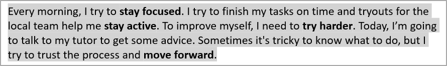

## **Áttekintés**

Ez a cikk bemutatja, hogyan formázhat szöveget PowerPoint és OpenDocument előadásokban az Aspose.Slides for Java használatával. Kitér a háttérszínekre, átlátszóságra, karakterközökre, betűtípus‑tulajdonságokra, forgatásra, bekezdés‑közökre, automatikus illesztés viselkedésére, szöveg‑horgonyzásra, tabulátor‑állomásokra és nyelvi beállításokra.

Ha nincs másként megadva, a példák a [sample.pptx](sample.pptx) fájlt használják. Az első dián az első alakzat egy szövegdoboz, és az első bekezdése az alább látható szöveget tartalmazza. Mind a dia, mind az alakzat indexelése nulláról indul. A félkövér részeket kiválasztó példák a hatékony formázást használják, beleértve az örökölt félkövér formázást:


A szó szerinti szöveg vagy reguláris kifejezéssel egyező részek megtalálásához és kiemeléséhez lásd a [Szöveg keresése és cseréje](/slides/hu/java/search-and-replace-text/) oldalt.

## **Szöveg háttérszín beállítása**

Használja az [IParagraphFormat.getDefaultPortionFormat](https://reference.aspose.com/slides/hu/java/com.aspose.slides/iparagraphformat/#getDefaultPortionFormat--) metódust a bekezdés alapértelmezett kiemelési szín beállításához, vagy az [IBasePortionFormat.getHighlightColor](https://reference.aspose.com/slides/hu/java/com.aspose.slides/ibaseportionformat/#getHighlightColor--) metódust egyedi szövegrésszekhez.

Következő példa világosszürke kiemelést állít be alapértelmezettként az első bekezdéshez. Az egyedi részek explicit kiemelési színei felülbírálják ezt az alapértelmezést:

```java
import com.aspose.slides.*;
import java.awt.Color;

Presentation presentation = new Presentation("sample.pptx");
try {
    ISlide slide = presentation.getSlides().get_Item(0);

    IAutoShape autoShape = (IAutoShape)slide.getShapes().get_Item(0);
    IParagraph paragraph = autoShape.getTextFrame().getParagraphs().get_Item(0);

    // Állítsa be a kiemelés színét a teljes bekezdéshez.
    paragraph.getParagraphFormat().getDefaultPortionFormat().getHighlightColor().setColor(Color.LIGHT_GRAY);

    presentation.save("gray_paragraph.pptx", SaveFormat.Pptx);
} finally {
    presentation.dispose();
}
```

Az eredmény:



A következő kódrészlet bemutatja, hogyan állítható be a háttérszín **félkövér betűtípusú szövegrések** számára:

```java
import com.aspose.slides.*;
import java.awt.Color;

Presentation presentation = new Presentation("sample.pptx");
try {
    ISlide slide = presentation.getSlides().get_Item(0);

    IAutoShape autoShape = (IAutoShape)slide.getShapes().get_Item(0);
    IParagraph paragraph = autoShape.getTextFrame().getParagraphs().get_Item(0);

    for (IPortion portion : paragraph.getPortions()) {
        if (portion.getPortionFormat().getEffective().getFontBold()) {
            // Állítsa be a kiemelés színét a szövegrészhez.
            portion.getPortionFormat().getHighlightColor().setColor(Color.LIGHT_GRAY);
        }
    }

    presentation.save("gray_text_portions.pptx", SaveFormat.Pptx);
} finally {
    presentation.dispose();
}
```

Az eredmény:


## **Szöveg bekezdések igazítása**

Használja az [IParagraphFormat.setAlignment](https://reference.aspose.com/slides/hu/java/com.aspose.slides/iparagraphformat/#setAlignment-int-) metódust a bekezdés igazításának beállításához egy szövegkeretben. Az érték lehet középre, balra, jobbra, sorkizárt stb.

A következő kódrészlet bemutatja, hogyan igazítható a bekezdés **középre**:

```java
import com.aspose.slides.*;

Presentation presentation = new Presentation("sample.pptx");
try {
    ISlide slide = presentation.getSlides().get_Item(0);

    IAutoShape autoShape = (IAutoShape)slide.getShapes().get_Item(0);
    IParagraph paragraph = autoShape.getTextFrame().getParagraphs().get_Item(0);

    // Állítsa be a bekezdés igazítását középre.
    paragraph.getParagraphFormat().setAlignment(TextAlignment.Center);

    presentation.save("aligned_paragraph.pptx", SaveFormat.Pptx);
} finally {
    presentation.dispose();
}
```

Az eredmény:


## **Átlátszóság beállítása szövegre**

A szöveg átlátszósága az [IBasePortionFormat.getFillFormat](https://reference.aspose.com/slides/hu/java/com.aspose.slides/ibaseportionformat/#getFillFormat--) által kiosztott szín alfa komponensén keresztül szabályozható. Az alábbi példákban az `alpha = 50` egy ARGB alfa-csatorna érték a 0–255 skálán, nem átlátszósági százalék.

A következő kódrészlet bemutatja, hogyan alkalmazható átlátszóság a **teljes bekezdésre**:

```java
import com.aspose.slides.*;
import java.awt.Color;

int alpha = 50;

Presentation presentation = new Presentation("sample.pptx");
try {
    ISlide slide = presentation.getSlides().get_Item(0);

    IAutoShape autoShape = (IAutoShape)slide.getShapes().get_Item(0);
    IParagraph paragraph = autoShape.getTextFrame().getParagraphs().get_Item(0);

    // Állítsa be a szöveg kitöltőszínét átlátszó színre.
    paragraph.getParagraphFormat().getDefaultPortionFormat().getFillFormat().setFillType(FillType.Solid);
    paragraph.getParagraphFormat().getDefaultPortionFormat().getFillFormat().getSolidFillColor().setColor(new Color(0, 0, 0, alpha));

    presentation.save("transparent_paragraph.pptx", SaveFormat.Pptx);
} finally {
    presentation.dispose();
}
```

Az eredmény:


A következő kódrészlet bemutatja, hogyan alkalmazható átlátszóság **félkövér betűtípusú szövegrések** esetén:

```java
import com.aspose.slides.*;
import java.awt.Color;

int alpha = 50;

Presentation presentation = new Presentation("sample.pptx");
try {
    ISlide slide = presentation.getSlides().get_Item(0);

    IAutoShape autoShape = (IAutoShape)slide.getShapes().get_Item(0);
    IParagraph paragraph = autoShape.getTextFrame().getParagraphs().get_Item(0);

    for (IPortion portion : paragraph.getPortions()) {
        if (portion.getPortionFormat().getEffective().getFontBold()) {
            // Állítsa be a szövegrész átlátszóságát.
            portion.getPortionFormat().getFillFormat().setFillType(FillType.Solid);
            portion.getPortionFormat().getFillFormat().getSolidFillColor().setColor(new Color(0, 0, 0, alpha));
        }
    }

    presentation.save("transparent_text_portions.pptx", SaveFormat.Pptx);
} finally {
    presentation.dispose();
}
```

Az eredmény:


## **Karakterköz beállítása szövegre**

Használja az [IBasePortionFormat.setSpacing](https://reference.aspose.com/slides/hu/java/com.aspose.slides/ibaseportionformat/#setSpacing-float-) metódust a karakterek közötti távolság növelésére vagy szűkítésére egy szövegdobozban. A példák 3 pont távolságot adnak hozzá; a negatív értékek szűkítik a szöveget.

A következő Java kód bemutatja, hogyan növelhető a karakterköz **a teljes bekezdésben**:

```java
import com.aspose.slides.*;

Presentation presentation = new Presentation("sample.pptx");
try {
    ISlide slide = presentation.getSlides().get_Item(0);

    IAutoShape autoShape = (IAutoShape)slide.getShapes().get_Item(0);
    IParagraph paragraph = autoShape.getTextFrame().getParagraphs().get_Item(0);

    // Megjegyzés: Használjon negatív értékeket a karakterköz összenyomásához.
    paragraph.getParagraphFormat().getDefaultPortionFormat().setSpacing(3); // Bővíti a karakterközöket.

    presentation.save("character_spacing_in_paragraph.pptx", SaveFormat.Pptx);
} finally {
    presentation.dispose();
}
```

Az eredmény:


A következő kódrészlet bemutatja, hogyan növelhető a karakterköz **félkövér betűtípusú szövegrések** esetén:

```java
import com.aspose.slides.*;

Presentation presentation = new Presentation("sample.pptx");
try {
    ISlide slide = presentation.getSlides().get_Item(0);

    IAutoShape autoShape = (IAutoShape)slide.getShapes().get_Item(0);
    IParagraph paragraph = autoShape.getTextFrame().getParagraphs().get_Item(0);

    for (IPortion portion : paragraph.getPortions()) {
        if (portion.getPortionFormat().getEffective().getFontBold()) {
            // Megjegyzés: Használjon negatív értékeket a karakterköz összenyomásához.
            portion.getPortionFormat().setSpacing(3); // Bővíti a karakterközöket.
        }
    }

    presentation.save("character_spacing_in_text_portions.pptx", SaveFormat.Pptx);
} finally {
    presentation.dispose();
}
```

Az eredmény:


### **Kerning letiltása bizonyos betűtípusoknál**

Néhány esetben az Aspose.Slides által megjelenített szöveg kicsit szorosabbnak tűnhet, mint ugyanaz a szöveg a PowerPointban. Ez azért fordulhat elő, mert a PowerPoint bizonyos betűtípusoknál figyelmen kívül hagyhatja a kerning adatokat, még akkor is, ha a betűtípus tartalmaz érvényes kerning információkat, és a kerning be van kapcsolva a PowerPoint beállításaiban.

Az ilyen esetekben a megjelenített kimenet PowerPoint-hoz való közelebb hozásához letilthatja a kerninget a megfelelő betűtípust használó szövegrések számára. Állítsa az [IBasePortionFormat.setKerningMinimalSize](https://reference.aspose.com/slides/hu/java/com.aspose.slides/ibaseportionformat/#setKerningMinimalSize-float-) értékét a tényleges betűméretnél nagyobbra. Ez a példa a "presentation.pptx" fájlt igényli, amelyben az első dián az első alakzat egy szövegdoboz. Ellenőrzi a hatékony betűneveket, beleértve az örökölt betűtípusokat, és 100 pontos küszöböt állít be azoknak a részeknek, amelyek a Roboto-t használják. Ez letiltja a kerninget azokra a részekre, amelyek betűmérete 100 pont alatti:

```java
import com.aspose.slides.*;

Presentation presentation = new Presentation("presentation.pptx");
try {
    ISlide slide = presentation.getSlides().get_Item(0);

    IAutoShape autoShape = (IAutoShape)slide.getShapes().get_Item(0);
    String targetFont = "Roboto";

    for (IParagraph paragraph : autoShape.getTextFrame().getParagraphs()) {
        for (IPortion portion : paragraph.getPortions()) {
            IPortionFormatEffectiveData portionFormat = portion.getPortionFormat().getEffective();

            if ((portionFormat.getLatinFont() != null &&
                 portionFormat.getLatinFont().getFontName().equals(targetFont)) ||
                (portionFormat.getEastAsianFont() != null &&
                 portionFormat.getEastAsianFont().getFontName().equals(targetFont)) ||
                (portionFormat.getComplexScriptFont() != null &&
                 portionFormat.getComplexScriptFont().getFontName().equals(targetFont))) {
                portion.getPortionFormat().setKerningMinimalSize(100);
            }
        }
    }

    presentation.save("output.pptx", SaveFormat.Pptx);
} finally {
    presentation.dispose();
}
```

Az ilyen küszöb alatti egyező szövegnél ez a beállítás megakadályozza a kerninget, és segíthet az Aspose.Slides megjelenítésének a PowerPoint vizuális kimenetéhez igazítani az ilyen PowerPoint-specifikus viselkedéstől érintett betűtípusok esetén.

## **Szöveg betűtípus tulajdonságainak kezelése**

A betűtípus tulajdonságok beállíthatók bekezdés szinten az [IParagraphFormat.getDefaultPortionFormat](https://reference.aspose.com/slides/hu/java/com.aspose.slides/iparagraphformat/#getDefaultPortionFormat--) segítségével, vagy egyedi részeknél az [IPortionFormat](https://reference.aspose.com/slides/hu/java/com.aspose.slides/iportionformat/) segítségével.

A következő példa beállítja az első bekezdés alapértelmezett betűtípusát 12 pontos Times New Roman-ra, félkövér, dőlt és pontozott aláhúzással. Az egyedi részeken megadott formázás felülbírálja ezeket az alapértelmezéseket:

```java
import com.aspose.slides.*;

Presentation presentation = new Presentation("sample.pptx");
try {
    ISlide slide = presentation.getSlides().get_Item(0);

    IAutoShape autoShape = (IAutoShape)slide.getShapes().get_Item(0);
    IParagraph paragraph = autoShape.getTextFrame().getParagraphs().get_Item(0);

    // Állítsa be a bekezdés betűtípus tulajdonságait.
    paragraph.getParagraphFormat().getDefaultPortionFormat().setFontHeight(12);
    paragraph.getParagraphFormat().getDefaultPortionFormat().setFontBold(NullableBool.True);
    paragraph.getParagraphFormat().getDefaultPortionFormat().setFontItalic(NullableBool.True);
    paragraph.getParagraphFormat().getDefaultPortionFormat().setFontUnderline(TextUnderlineType.Dotted);
    paragraph.getParagraphFormat().getDefaultPortionFormat().setLatinFont(new FontData("Times New Roman"));

    presentation.save("font_properties_for_paragraph.pptx", SaveFormat.Pptx);
} finally {
    presentation.dispose();
}
```

Az eredmény:


A következő példa 13 pontos Times New Roman, dőlt formázás és pontozott aláhúzás alkalmazását mutatja a részekre, amelyek hatékony formázása félkövér:

```java
import com.aspose.slides.*;

Presentation presentation = new Presentation("sample.pptx");
try {
    ISlide slide = presentation.getSlides().get_Item(0);

    IAutoShape autoShape = (IAutoShape)slide.getShapes().get_Item(0);
    IParagraph paragraph = autoShape.getTextFrame().getParagraphs().get_Item(0);

    for (IPortion portion : paragraph.getPortions()) {
        if (portion.getPortionFormat().getEffective().getFontBold()) {
            // Állítsa be a betűtípus tulajdonságait a szövegrészhez.
            portion.getPortionFormat().setFontHeight(13);
            portion.getPortionFormat().setFontItalic(NullableBool.True);
            portion.getPortionFormat().setFontUnderline(TextUnderlineType.Dotted);
            portion.getPortionFormat().setLatinFont(new FontData("Times New Roman"));
        }
    }

    presentation.save("font_properties_for_text_portions.pptx", SaveFormat.Pptx);
} finally {
    presentation.dispose();
}
```

Az eredmény:


## **Szöveg forgatásának beállítása**

Használja az [ITextFrameFormat.setTextVerticalType](https://reference.aspose.com/slides/hu/java/com.aspose.slides/itextframeformat/#setTextVerticalType-byte-) metódust egy előre definiált szövegorientáció beállításához egy alakzatban.

A következő kódrészlet a szövegorientációt állítja a shape-ben a [TextVerticalType.Vertical270](https://reference.aspose.com/slides/hu/java/com.aspose.slides/textverticaltype/) értékre, amely a szöveget **90 fokkal óramutató járásával ellentétesen** forgatja:

```java
import com.aspose.slides.*;

Presentation presentation = new Presentation("sample.pptx");
try {
    ISlide slide = presentation.getSlides().get_Item(0);

    IAutoShape autoShape = (IAutoShape)slide.getShapes().get_Item(0);
    autoShape.getTextFrame().getTextFrameFormat().setTextVerticalType(TextVerticalType.Vertical270);

    presentation.save("text_rotation.pptx", SaveFormat.Pptx);
} finally {
    presentation.dispose();
}
```

Az eredmény:


## **Egyéni forgatás beállítása szövegkeretekhez**

Használja az [ITextFrameFormat.setRotationAngle](https://reference.aspose.com/slides/hu/java/com.aspose.slides/itextframeformat/#setRotationAngle-float-) metódust egy egyéni forgatási szög beállításához egy [ITextFrame](https://reference.aspose.com/slides/hu/java/com.aspose.slides/itextframe/) esetén.

A következő kódrészlet 3 fokkal óramutató járásával megegyező irányban forgatja a szövegkeretet az alakzaton belül:

```java
import com.aspose.slides.*;

Presentation presentation = new Presentation("sample.pptx");
try {
    ISlide slide = presentation.getSlides().get_Item(0);

    IAutoShape autoShape = (IAutoShape)slide.getShapes().get_Item(0);
    autoShape.getTextFrame().getTextFrameFormat().setRotationAngle(3);

    presentation.save("custom_text_rotation.pptx", SaveFormat.Pptx);
} finally {
    presentation.dispose();
}
```

Az eredmény:


## **Be bekezdések sortávolságának beállítása**

Az Aspose.Slides biztosítja a [IParagraphFormat.setSpaceAfter](https://reference.aspose.com/slides/hu/java/com.aspose.slides/iparagraphformat/#setSpaceAfter-float-), [IParagraphFormat.setSpaceBefore](https://reference.aspose.com/slides/hu/java/com.aspose.slides/iparagraphformat/#setSpaceBefore-float-), és [IParagraphFormat.setSpaceWithin](https://reference.aspose.com/slides/hu/java/com.aspose.slides/iparagraphformat/#setSpaceWithin-float-) metódusokat a bekezdés közötti távolság szabályozásához. Ezek a tulajdonságok a következőképpen használhatók:

* Használjon pozitív értéket a sor távolságának a sor magasságának százalékában megadásához.
* Használjon negatív értéket a sor távolságának pontban megadásához.

A következő példa a első bekezdésen belüli távolságot a sor magasságának 200%-ára (dupla sortávolság) állítja be:

```java
import com.aspose.slides.*;

Presentation presentation = new Presentation("sample.pptx");
try {
    ISlide slide = presentation.getSlides().get_Item(0);

    IAutoShape autoShape = (IAutoShape)slide.getShapes().get_Item(0);

    IParagraph paragraph = autoShape.getTextFrame().getParagraphs().get_Item(0);
    paragraph.getParagraphFormat().setSpaceWithin(200);

    presentation.save("line_spacing.pptx", SaveFormat.Pptx);
} finally {
    presentation.dispose();
}
```

Az eredmény:


## **Sor törés szabályozása**

A bekezdés sor törés szabályai hasznosak keskeny szövegblokkban és olyan előadásokban, amelyek latin és kelet-ázsiai szöveget kevernek. A következő metódusok az [IParagraphFormat](https://reference.aspose.com/slides/hu/java/com.aspose.slides/iparagraphformat/) részei, így egész bekezdésre vonatkoznak:

- [setLatinLineBreak](https://reference.aspose.com/slides/hu/java/com.aspose.slides/iparagraphformat/#setLatinLineBreak-byte-) szabályozza a latin sor törés szabályait. Vegyes szövegben a módosítása megváltoztathatja a szomszédos kelet-ázsiai szöveg és írásjelek törését is.
- [setEastAsianLineBreak](https://reference.aspose.com/slides/hu/java/com.aspose.slides/iparagraphformat/#setEastAsianLineBreak-byte-) szabályozza a kelet-ázsiai sor törés szabályait, beleértve a sor elején és végén lévő karakterek korlátozásait.

Ezek a szabályok nem helyettesítik az [ITextFrameFormat.setWrapText](https://reference.aspose.com/slides/hu/java/com.aspose.slides/itextframeformat/#setWrapText-byte-) metódust, amely automatikus sortörést engedélyez egy szövegkeretben. A sortörés során befolyásolják az elrendezést; nem szúrnak be sorvégi karaktereket. Egy explicit sortörés új sort kényszerít a bekezdésen belül a rendelkezésre álló szélességtől függetlenül.

A következő önálló példa létrehoz egy keskeny szövegblokkot, amely kínai és latin szöveget tartalmaz. Mindkét sortörési opciót explicit módon állítja be, és elmenti a "line_breaking.pptx" fájlt. A szabályok kipróbálásához módosítsa a megfelelő értéket, miközben a másik beállítást változatlanul hagyja. A példa 24 pontos Arial és SimSun betűtípusokat használ 160 pontos keret szélességgel és nulla vízszintes keret margóval. Az [ITextFrameFormat.setAutofitType](https://reference.aspose.com/slides/hu/java/com.aspose.slides/itextframeformat/#setAutofitType-byte-) metódust a [TextAutofitType.None](https://reference.aspose.com/slides/hu/java/com.aspose.slides/textautofittype/) értékkel hívják meg, hogy a szöveg mérete és a keret dimenziói rögzítve maradjanak.

```java
import com.aspose.slides.*;
import java.awt.Color;

Presentation presentation = new Presentation();
try {
    ISlide slide = presentation.getSlides().get_Item(0);

    IAutoShape shape = slide.getShapes().addAutoShape(ShapeType.Rectangle, 50, 50, 160, 300);
    shape.getFillFormat().setFillType(FillType.NoFill);

    ITextFrame textFrame = shape.getTextFrame();
    textFrame.getTextFrameFormat().setWrapText(NullableBool.True);
    textFrame.getTextFrameFormat().setAutofitType(TextAutofitType.None);
    textFrame.getTextFrameFormat().setMarginLeft(0);
    textFrame.getTextFrameFormat().setMarginRight(0);

    IParagraph paragraph = textFrame.getParagraphs().get_Item(0);
    paragraph.setText("中文排版测试，PowerPoint 中文演示。");

    IParagraphFormat format = paragraph.getParagraphFormat();
    format.setAlignment(TextAlignment.Left);
    format.getDefaultPortionFormat().setFontHeight(24);
    FontData latinFont = new FontData("Arial");
    format.getDefaultPortionFormat().setLatinFont(latinFont);
    FontData eastAsianFont = new FontData("SimSun");
    format.getDefaultPortionFormat().setEastAsianFont(eastAsianFont);
    format.getDefaultPortionFormat().getFillFormat().setFillType(FillType.Solid);
    format.getDefaultPortionFormat().getFillFormat().getSolidFillColor().setColor(Color.BLACK);
    format.setLatinLineBreak(NullableBool.False);
    format.setEastAsianLineBreak(NullableBool.True);

    presentation.save("line_breaking.pptx", SaveFormat.Pptx);
} finally {
    presentation.dispose();
}
```

## **Függő írásjelek szabályozása**

Az [IParagraphFormat.setHangingPunctuation](https://reference.aspose.com/slides/hu/java/com.aspose.slides/iparagraphformat/#setHangingPunctuation-byte-) lehetővé teszi, hogy az alkalmas írásjelek a szövegsor jobb szélén túlnyúljanak, ahelyett, hogy a következő sorba kerülnek. Ez az egész bekezdésre vonatkozik, és különbözik a függő behúzástól.

A következő önálló példa engedélyezi a függő írásjeleket egy 100 pontos szélességű szövegkeretben, és elmenti a "hanging_punctuation.pptx" fájlt. 24 pontos Arial betűtípus és nulla vízszintes keret margó esetén a végső pont a "sentence" után marad, és a jobb szövegél túlnyúlik. Állítsa a tulajdonságot [NullableBool.False](https://reference.aspose.com/slides/hu/java/com.aspose.slides/nullablebool/) értékre a összehasonlításhoz: ezekkel a beállításokkal a pont külön sorba kerül. A sortörés engedélyezett, az automatikus illesztés le van tiltva, hogy a rendelkezésre álló szélesség rögzített maradjon.

```java
import com.aspose.slides.*;
import java.awt.Color;

Presentation presentation = new Presentation();
try {
    ISlide slide = presentation.getSlides().get_Item(0);

    IAutoShape shape = slide.getShapes().addAutoShape(ShapeType.Rectangle, 50, 50, 100, 200);
    shape.getFillFormat().setFillType(FillType.NoFill);

    ITextFrame textFrame = shape.getTextFrame();
    textFrame.getTextFrameFormat().setWrapText(NullableBool.True);
    textFrame.getTextFrameFormat().setAutofitType(TextAutofitType.None);
    textFrame.getTextFrameFormat().setMarginLeft(0);
    textFrame.getTextFrameFormat().setMarginRight(0);

    IParagraph paragraph = textFrame.getParagraphs().get_Item(0);
    paragraph.setText("Simple text, next sentence.");

    IParagraphFormat format = paragraph.getParagraphFormat();
    format.setAlignment(TextAlignment.Left);
    format.getDefaultPortionFormat().setFontHeight(24);
    FontData latinFont = new FontData("Arial");
    format.getDefaultPortionFormat().setLatinFont(latinFont);
    format.getDefaultPortionFormat().getFillFormat().setFillType(FillType.Solid);
    format.getDefaultPortionFormat().getFillFormat().getSolidFillColor().setColor(Color.BLACK);
    format.setHangingPunctuation(NullableBool.True);

    presentation.save("hanging_punctuation.pptx", SaveFormat.Pptx);
} finally {
    presentation.dispose();
}
```

Nem minden írásjel használható függő módon. A látható eredmény a betűtípus rendelkezésre állásától és az elrendezéstől függ: a betűtípus, a rendelkezésre álló szélesség, a margók vagy az automatikus illesztés beállításainak módosítása eltüntetheti a látható különbséget.

## **Automatikus illesztés típusának beállítása szövegkeretekhez**

Az [ITextFrameFormat.setAutofitType](https://reference.aspose.com/slides/hu/java/com.aspose.slides/itextframeformat/#setAutofitType-byte-) meghatározza, hogyan viselkedik a szöveg, ha meghaladja a tároló határait. Ezzel szabályozható, hogy a szöveg zsugorodjon, túlcímkét képezzen vagy automatikusan átméretezze az alakzatot. A következő példa úgy konfigurálja az alakzatot, hogy a szöveghez igazodva átméreteződjön, és elmenti az eredményt a "autofit_type.pptx" fájlba:

```java
import com.aspose.slides.*;

Presentation presentation = new Presentation("sample.pptx");
try {
    ISlide slide = presentation.getSlides().get_Item(0);

    IAutoShape autoShape = (IAutoShape)slide.getShapes().get_Item(0);
    autoShape.getTextFrame().getTextFrameFormat().setAutofitType(TextAutofitType.Shape);

    presentation.save("autofit_type.pptx", SaveFormat.Pptx);
} finally {
    presentation.dispose();
}
```

A sorok számolásához automatikus sortörés után és annak megtekintéséhez, hogy a szöveg vagy az alakzat szélessége hogyan változtatja az eredményt, lásd a [Count Rendered Lines](/slides/hu/java/manage-paragraph/) oldalt. A sorok száma önmagában nem jelzi, hogy a szöveg túllépi-e a tárolót.

## **Szövegkeretek horgonyának beállítása**

Az [ITextFrameFormat.setAnchoringType](https://reference.aspose.com/slides/hu/java/com.aspose.slides/itextframeformat/#setAnchoringType-byte-) meghatározza, hogy a szöveg hogyan helyezkedik el függőlegesen egy alakzatban, például a tetején, közepén vagy alján. A következő példa a szöveget az első alakzat aljára horgonyozza, és elmenti az eredményt a "text_anchor.pptx" fájlba:

```java
import com.aspose.slides.*;

Presentation presentation = new Presentation("sample.pptx");
try {
    ISlide slide = presentation.getSlides().get_Item(0);

    IAutoShape autoShape = (IAutoShape)slide.getShapes().get_Item(0);
    autoShape.getTextFrame().getTextFrameFormat().setAnchoringType(TextAnchorType.Bottom);

    presentation.save("text_anchor.pptx", SaveFormat.Pptx);
} finally {
    presentation.dispose();
}
```

## **Szöveg tabuláció beállítása**

Használja az [IParagraphFormat.setDefaultTabSize](https://reference.aspose.com/slides/hu/java/com.aspose.slides/iparagraphformat/#setDefaultTabSize-float-) és az [IParagraphFormat.getTabs](https://reference.aspose.com/slides/hu/java/com.aspose.slides/iparagraphformat/#getTabs--) metódusokat a bekezdés tabulátorállomásainak konfigurálásához. A következő példa az alapértelmezett tabulátor távolságot 100 pontra állítja, és egy balra igazított tabulátort ad hozzá 30 pontnál. Ezek a beállítások hatással vannak a tabulátor karaktert tartalmazó szövegre.

```java
import com.aspose.slides.*;

Presentation presentation = new Presentation("sample.pptx");
try {
    ISlide slide = presentation.getSlides().get_Item(0);

    IAutoShape autoShape = (IAutoShape)slide.getShapes().get_Item(0);
    
    IParagraph paragraph = autoShape.getTextFrame().getParagraphs().get_Item(0);
    paragraph.getParagraphFormat().setDefaultTabSize(100);
    paragraph.getParagraphFormat().getTabs().add(30, TabAlignment.Left);

    presentation.save("paragraph_tabs.pptx", SaveFormat.Pptx);
} finally {
    presentation.dispose();
}
```

Az eredmény:


## **Helyesírás-ellenőrzés nyelvének beállítása**

Az Aspose.Slides biztosítja az [IBasePortionFormat.setLanguageId](https://reference.aspose.com/slides/hu/java/com.aspose.slides/ibaseportionformat/#setLanguageId-java.lang.String-) metódust, amely lehetővé teszi a szövegrész helyesírás-ellenőrzési nyelvének beállítását. A helyesírás-ellenőrzési nyelv határozza meg a PowerPointban a helyesírás- és nyelvtani ellenőrzéshez használt nyelvet.

A következő példa a "presentation.pptx" fájlt igényli, amelynek első diáján az első alakzat egy szövegdoboz, és legalább egy bekezdése van. Lecseréli az első bekezdés tartalmát "1。"‑ra, a betűtípust SimSun‑ra állítja, és a Simplified Chinese helyesírás-ellenőrzési nyelvet (`zh-CN`) rendeli hozzá. Az eredményt a "proofing_language.pptx" fájlba menti:

```java
import com.aspose.slides.*;

Presentation presentation = new Presentation("presentation.pptx");
try {
    ISlide slide = presentation.getSlides().get_Item(0);
    IAutoShape autoShape = (IAutoShape)slide.getShapes().get_Item(0);

    IParagraph paragraph = autoShape.getTextFrame().getParagraphs().get_Item(0);
    paragraph.getPortions().clear();

    FontData font = new FontData("SimSun");

    Portion textPortion = new Portion();
    textPortion.getPortionFormat().setComplexScriptFont(font);
    textPortion.getPortionFormat().setEastAsianFont(font);
    textPortion.getPortionFormat().setLatinFont(font);

    // Állítsa be a helyesírási nyelv azonosítóját.
    textPortion.getPortionFormat().setLanguageId("zh-CN");

    textPortion.setText("1。");
    paragraph.getPortions().add(textPortion);

    presentation.save("proofing_language.pptx", SaveFormat.Pptx);
} finally {
    presentation.dispose();
}
```

## **Alapértelmezett nyelv beállítása**

Használja a [LoadOptions.setDefaultTextLanguage](https://reference.aspose.com/slides/hu/java/com.aspose.slides/loadoptions/#setDefaultTextLanguage-java.lang.String-) metódust az alapértelmezett nyelv meghatározásához a betöltés vagy a prezentáció létrehozása közben létrehozott szöveghez. A következő példa egy prezentációt hoz létre az US English alapértelmezett szövegnyelvvel, hozzáad egy szövegdobozt, és kiírja az `en-US` értéket az első szövegrészhez.

```java
import com.aspose.slides.*;

LoadOptions loadOptions = new LoadOptions();
loadOptions.setDefaultTextLanguage("en-US");

Presentation presentation = new Presentation(loadOptions);
try {
    ISlide slide = presentation.getSlides().get_Item(0);

    // Új téglalap alakzat hozzáadása szöveggel.
    IAutoShape shape = slide.getShapes().addAutoShape(ShapeType.Rectangle, 20, 20, 150, 50);
    shape.getTextFrame().setText("Sample text");

    // Ellenőrizze az első rész nyelvét.
    IPortion portion = shape.getTextFrame().getParagraphs().get_Item(0).getPortions().get_Item(0);
    System.out.println(portion.getPortionFormat().getLanguageId());
} finally {
    presentation.dispose();
}
```

## **Alapértelmezett szövegstílus beállítása**

Az alapértelmezett szövegformázás alkalmazásához a prezentáció szintjén használja az [IPresentation.getDefaultTextStyle](https://reference.aspose.com/slides/hu/java/com.aspose.slides/ipresentation/#getDefaultTextStyle--) metódust.

A következő példa egy 14 pontos félkövér betűtípust állít be alapértelmezettként a legfelső szintű bekezdésekhez egy új prezentációban, és a "default_text_style.pptx" fájlba menti. A szöveg örökölheti ezeket az alapértelmezéseket, hacsak egy specifikusabb formázás nem felülírja őket.

```java
import com.aspose.slides.*;

Presentation presentation = new Presentation();
try {
    // A legfelső szintű bekezdés formátumának lekérése.
    IParagraphFormat paragraphFormat = presentation.getDefaultTextStyle().getLevel(0);

    if (paragraphFormat != null) {
        paragraphFormat.getDefaultPortionFormat().setFontHeight(14);
        paragraphFormat.getDefaultPortionFormat().setFontBold(NullableBool.True);
    }

    presentation.save("default_text_style.pptx", SaveFormat.Pptx);
} finally {
    presentation.dispose();
}
```

## **Szöveg kinyerése nagybetűs hatással**

A PowerPointban a **All Caps** betűtípus hatásának alkalmazása a szöveget nagybetűsen jeleníti meg a dián, még akkor is, ha eredetileg kisbetűvel írták. Amikor ilyen szövegrést kér le az Aspose.Slides, a könyvtár a pontosan beírt szöveget adja vissza. A megjelenített szöveghez való illesztéshez ellenőrizze a [TextCapType](https://reference.aspose.com/slides/hu/java/com.aspose.slides/textcaptype/) értékét, és alakítsa a visszakapott karakterláncot nagybetűssé, ha az érték `All`.

A példa a "sample2.pptx" fájlt igényli, amelynek első diáján az első alakzat egy szövegdoboz. Az első bekezdés első része tartalmazza a "Hello, Aspose!" szöveget All Caps hatással, ahogyan az alább látható.


A következő kódrészlet bemutatja, hogyan lehet kinyerni a szöveget a **All Caps** hatással:

```java
import com.aspose.slides.*;

Presentation presentation = new Presentation("sample2.pptx");
try {
    ISlide slide = presentation.getSlides().get_Item(0);
    
    IAutoShape autoShape = (IAutoShape)slide.getShapes().get_Item(0);
    IPortion textPortion = autoShape.getTextFrame().getParagraphs().get_Item(0).getPortions().get_Item(0);

    System.out.println("Original text: " + textPortion.getText());

    IPortionFormatEffectiveData textFormat = textPortion.getPortionFormat().getEffective();
    if (textFormat.getTextCapType() == TextCapType.All) {
        String text = textPortion.getText().toUpperCase();
        System.out.println("All-Caps effect: " + text);
    }
} finally {
    presentation.dispose();
}
```

Kimenet:

```text
Original text: Hello, Aspose!
All-Caps effect: HELLO, ASPOSE!
```

## **GYIK**

**Hogyan módosíthatok szöveget egy dián lévő táblázatban?**

A dián lévő táblázat szövegének módosításához használja az [ITable](https://reference.aspose.com/slides/hu/java/com.aspose.slides/itable/) interfészt. Iteráljon végig a cellákon, és frissítse az egyes cellákat az [ICell.getTextFrame](https://reference.aspose.com/slides/hu/java/com.aspose.slides/icell/#getTextFrame--) metódussal, valamint a bekezdés formázását az [IParagraph.getParagraphFormat](https://reference.aspose.com/slides/hu/java/com.aspose.slides/iparagraph/#getParagraphFormat--) metódussal.

**Hogyan alkalmazhatok színátmenetet a szövegre egy PowerPoint-dián?**

A szöveg színátmenetes színének alkalmazásához használja az [IBasePortionFormat.getFillFormat](https://reference.aspose.com/slides/hu/java/com.aspose.slides/ibaseportionformat/#getFillFormat--) metódust. Állítsa az [IFillFormat.setFillType](https://reference.aspose.com/slides/hu/java/com.aspose.slides/ifillformat/#setFillType-byte-) értékét a [FillType.Gradient](https://reference.aspose.com/slides/hu/java/com.aspose.slides/filltype/) értékre, és konfigurálja a gradient állomásokat, irányt és átlátszóságot.