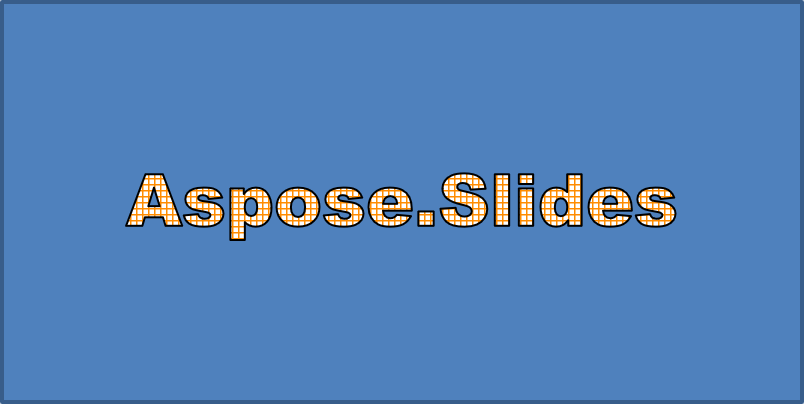

## **Áttekintés**

A WordArt effektusok lehetővé teszik a szöveg kitöltéssel, körvonalazással, árnyékokkal, tükrözésekkel, ragyogással, transzformációkkal és 3D formázással való formázását. Ez a cikk bemutatja, hogyan hozhatók létre és testreszabhatók ezek az effektusok PowerPoint‑prezentációkban az Aspose.Slides for Java segítségével, anélkül, hogy a Microsoft Office telepítve lenne.

## **Egyszerű WordArt sablon létrehozása és alkalmazása szövegre**

A következő példák egyszerű WordArt stílust hoznak létre a szöveg, betűtípus, mintakitöltés és körvonal beállításával.

Minden példa új prezentációt hoz létre, és egy téglalapot ad az első diára; bemeneti fájlra nincs szükség. Az első példa a szöveget „Aspose.Slides” -re állítja. Az alakzat pozíciója és méretei pontban vannak megadva:

```java
import com.aspose.slides.*;

Presentation presentation = new Presentation();
try {
    ISlide slide = presentation.getSlides().get_Item(0);

    IAutoShape autoShape = slide.getShapes().addAutoShape(ShapeType.Rectangle, 20, 20, 400, 200);
    ITextFrame textFrame = autoShape.getTextFrame();

    IPortion portion = textFrame.getParagraphs().get_Item(0).getPortions().get_Item(0);
    portion.setText("Aspose.Slides");
} finally {
    presentation.dispose();
}
```

Állítsa be a betűtípust Arial Black-ra 36 pontban, hogy a formázás jobban látható legyen:

```java
import com.aspose.slides.*;

Presentation presentation = new Presentation();
try {
    ISlide slide = presentation.getSlides().get_Item(0);

    IAutoShape autoShape = slide.getShapes().addAutoShape(ShapeType.Rectangle, 20, 20, 400, 200);

    IPortion portion = autoShape.getTextFrame().getParagraphs().get_Item(0).getPortions().get_Item(0);
    portion.setText("Aspose.Slides");
    FontData font = new FontData("Arial Black");
    portion.getPortionFormat().setLatinFont(font);
    portion.getPortionFormat().setFontHeight(36);
} finally {
    presentation.dispose();
}
```

Alkalmazzon egy [SmallGrid](https://reference.aspose.com/slides/hu/java/com.aspose.slides/patternstyle/#SmallGrid) mintát sötét narancssárga előtérrel és fehér háttérrel, majd adjon hozzá egy 1 pont széles fekete szövegkörvonalat:

```java
import com.aspose.slides.*;
import java.awt.Color;

Presentation presentation = new Presentation();
try {
    ISlide slide = presentation.getSlides().get_Item(0);

    IAutoShape autoShape = slide.getShapes().addAutoShape(ShapeType.Rectangle, 20, 20, 400, 200);

    IPortion portion = autoShape.getTextFrame().getParagraphs().get_Item(0).getPortions().get_Item(0);
    portion.setText("Aspose.Slides");
    FontData font = new FontData("Arial Black");
    portion.getPortionFormat().setLatinFont(font);
    portion.getPortionFormat().setFontHeight(36);

    portion.getPortionFormat().getFillFormat().setFillType(FillType.Pattern);
    Color darkOrange = new Color(255, 140, 0);
    portion.getPortionFormat().getFillFormat().getPatternFormat().getForeColor().setColor(darkOrange);
    portion.getPortionFormat().getFillFormat().getPatternFormat().getBackColor().setColor(Color.WHITE);
    portion.getPortionFormat().getFillFormat().getPatternFormat().setPatternStyle(PatternStyle.SmallGrid);

    portion.getPortionFormat().getLineFormat().setWidth(1);
    portion.getPortionFormat().getLineFormat().getFillFormat().setFillType(FillType.Solid);
    portion.getPortionFormat().getLineFormat().getFillFormat().getSolidFillColor().setColor(Color.BLACK);
} finally {
    presentation.dispose();
}
```

Az eredményül kapott szöveg:



## **Más WordArt effektusok alkalmazása**

A következő példák bemutatják, hogyan alkalmazhatók árnyékok, tükrözések, ragyogás, transzformációk és 3D effektusok a szövegre.

### **Külső árnyék effektusok alkalmazása**

A külső árnyék mélységet ad a szöveg mögé helyezett árnyékkal. Testreszabhatja annak színét, irányát, távolságát, elmosódási sugarát, méretezését és ferdeségét.

Ez a példa meghívja az [enableOuterShadowEffect](https://reference.aspose.com/slides/hu/java/com.aspose.slides/effectformat/#enableOuterShadowEffect--) metódust, és egy fekete árnyékot állít be 4 pont elmosódási sugárral, 230 fokos iránnyal és 30 pont távolsággal. A 100 méretezési érték megőrzi az árnyék méretét, míg a vízszintes ferdeség 20 fokkal döntja el. Az alfa transzformáció 32 %-os átlátszatlanságot állít be:

```java
import com.aspose.slides.*;
import java.awt.Color;

Presentation presentation = new Presentation();
try {
    ISlide slide = presentation.getSlides().get_Item(0);

    IAutoShape autoShape = slide.getShapes().addAutoShape(ShapeType.Rectangle, 20, 20, 400, 200);

    IPortion portion = autoShape.getTextFrame().getParagraphs().get_Item(0).getPortions().get_Item(0);
    portion.setText("Aspose.Slides");
    FontData font = new FontData("Arial Black");
    portion.getPortionFormat().setLatinFont(font);
    portion.getPortionFormat().setFontHeight(36);

    portion.getPortionFormat().getEffectFormat().enableOuterShadowEffect();
    portion.getPortionFormat().getEffectFormat().getOuterShadowEffect().getShadowColor().setColor(Color.BLACK);
    portion.getPortionFormat().getEffectFormat().getOuterShadowEffect().setScaleHorizontal(100);
    portion.getPortionFormat().getEffectFormat().getOuterShadowEffect().setScaleVertical(100);
    portion.getPortionFormat().getEffectFormat().getOuterShadowEffect().setBlurRadius(4);
    portion.getPortionFormat().getEffectFormat().getOuterShadowEffect().setDirection(230);
    portion.getPortionFormat().getEffectFormat().getOuterShadowEffect().setDistance(30);
    portion.getPortionFormat().getEffectFormat().getOuterShadowEffect().setSkewHorizontal(20);
    portion.getPortionFormat().getEffectFormat().getOuterShadowEffect().setSkewVertical(0);
    portion.getPortionFormat().getEffectFormat().getOuterShadowEffect().getShadowColor().getColorTransform().add(ColorTransformOperation.SetAlpha, 0.32f);
} finally {
    presentation.dispose();
}
```

Az eredményül kapott szöveg:


{}
- Ha a külső és az előre beállított árnyékok együtt vannak használva, csak a külső árnyék kerül alkalmazásra.
- Ha a külső és belső árnyékok egyszerre vannak használva, az eredő effektus a PowerPoint verziójától függ. Például a PowerPoint 2013‑ban az effektus duplázódik, míg a PowerPoint 2007‑ben csak a külső árnyék kerül alkalmazásra.
{}

### **Tükrözés effektusok alkalmazása**

A tükrözés egy tükrözött másolatot hoz létre a szövegről. Állítsa be a pozícióját, méretezését, elmosódását és átlátszatlanságát a megjelenés irányításához.

Ez a példa meghívja az [enableReflectionEffect](https://reference.aspose.com/slides/hu/java/com.aspose.slides/effectformat/#enableReflectionEffect--) metódust, és függőlegesen fordítja meg a tükrözést -100 %-os méretezéssel. 0,5 pont elmosódási sugarat és 4,72 pont távolságot használ. Az átlátszatlanság 60 %-ról 0,9 %-ra csökken a 0 % és 60 % közötti pozíciók között a tükrözésen:

```java
import com.aspose.slides.*;

Presentation presentation = new Presentation();
try {
    ISlide slide = presentation.getSlides().get_Item(0);

    IAutoShape autoShape = slide.getShapes().addAutoShape(ShapeType.Rectangle, 20, 20, 400, 200);

    IPortion portion = autoShape.getTextFrame().getParagraphs().get_Item(0).getPortions().get_Item(0);
    portion.setText("Aspose.Slides");
    FontData font = new FontData("Arial Black");
    portion.getPortionFormat().setLatinFont(font);
    portion.getPortionFormat().setFontHeight(36);

    portion.getPortionFormat().getEffectFormat().enableReflectionEffect();
    portion.getPortionFormat().getEffectFormat().getReflectionEffect().setBlurRadius(0.5);
    portion.getPortionFormat().getEffectFormat().getReflectionEffect().setDistance(4.72);
    portion.getPortionFormat().getEffectFormat().getReflectionEffect().setStartPosAlpha(0f);
    portion.getPortionFormat().getEffectFormat().getReflectionEffect().setEndPosAlpha(60f);
    portion.getPortionFormat().getEffectFormat().getReflectionEffect().setDirection(90);
    portion.getPortionFormat().getEffectFormat().getReflectionEffect().setScaleHorizontal(100);
    portion.getPortionFormat().getEffectFormat().getReflectionEffect().setScaleVertical(-100);
    portion.getPortionFormat().getEffectFormat().getReflectionEffect().setStartReflectionOpacity(60f);
    portion.getPortionFormat().getEffectFormat().getReflectionEffect().setEndReflectionOpacity(0.9f);
    portion.getPortionFormat().getEffectFormat().getReflectionEffect().setRectangleAlign(RectangleAlignment.BottomLeft);
} finally {
    presentation.dispose();
}
```

Az eredményül kapott szöveg:


### **Ragyogás effektusok alkalmazása**

A ragyogás egy lágy színes körvonalat ad a szöveg köré. Állítsa be a színét, átlátszatlanságát és sugarát a hatás szabályozásához.

Ez a példa meghívja az [enableGlowEffect](https://reference.aspose.com/slides/hu/java/com.aspose.slides/effectformat/#enableGlowEffect--) metódust, és piros ragyogást alkalmaz 54 %-os átlátszatlansággal és 7 pont sugarral:

```java
import com.aspose.slides.*;
import java.awt.Color;

Presentation presentation = new Presentation();
try {
    ISlide slide = presentation.getSlides().get_Item(0);

    IAutoShape autoShape = slide.getShapes().addAutoShape(ShapeType.Rectangle, 20, 20, 400, 200);

    IPortion portion = autoShape.getTextFrame().getParagraphs().get_Item(0).getPortions().get_Item(0);
    portion.setText("Aspose.Slides");
    FontData font = new FontData("Arial Black");
    portion.getPortionFormat().setLatinFont(font);
    portion.getPortionFormat().setFontHeight(36);

    portion.getPortionFormat().getEffectFormat().enableGlowEffect();
    portion.getPortionFormat().getEffectFormat().getGlowEffect().getColor().setColor(Color.RED);
    portion.getPortionFormat().getEffectFormat().getGlowEffect().getColor().getColorTransform().add(ColorTransformOperation.SetAlpha, 0.54f);
    portion.getPortionFormat().getEffectFormat().getGlowEffect().setRadius(7);
} finally {
    presentation.dispose();
}
```

Az eredményül kapott szöveg:


### **WordArt transzformációk alkalmazása**

A WordArt transzformációk hajlítják, nyújtják vagy torzítják a szövegtömböt.

Állítsa be a [setTransform](https://reference.aspose.com/slides/hu/java/com.aspose.slides/textframeformat/#setTransform-int-) értékét [ArchUpPour](https://reference.aspose.com/slides/hu/java/com.aspose.slides/textshapetype/#ArchUpPour) –ra, hogy a teljes szövegkeretet felfelé görbítse:

```java
import com.aspose.slides.*;

Presentation presentation = new Presentation();
try {
    ISlide slide = presentation.getSlides().get_Item(0);

    IAutoShape autoShape = slide.getShapes().addAutoShape(ShapeType.Rectangle, 20, 20, 400, 200);

    ITextFrame textFrame = autoShape.getTextFrame();
    textFrame.setText("Aspose.Slides");
    textFrame.getTextFrameFormat().setTransform(TextShapeType.ArchUpPour);
} finally {
    presentation.dispose();
}
```

Az eredményül kapott szöveg:


{}
Az Aspose.Slides for Java előre definiált [transformation types](https://reference.aspose.com/slides/hu/java/com.aspose.slides/textshapetype/) készletet kínál.
{}

### **3D effektusok alkalmazása alakzatokra és szövegre**

3D effektusokat alkalmazhat egy alakzatra vagy a szövegére. A lekerekítések, kitüremkedés, világítás és kamera beállítások határozzák meg a végeredményt.

A következő példa a [ThreeDFormat](https://reference.aspose.com/slides/hu/java/com.aspose.slides/threedformat/) használja, hogy körkörös lekerekítéseket, narancs kitüremkedést és sötétvörös körvonalat adjon a téglalaphoz. A lekerekítések mérete, a kitüremkedés magassága, a körvonal szélessége és a mélység pontban van megadva. Egy műanyag anyag, egyensúlyozott megvilágítás, amely 40 fokkal körbeforgatott a Z tengely körül, és egy perspektíva kamera határozza meg a megjelenését:

```java
import com.aspose.slides.*;
import java.awt.Color;

Presentation presentation = new Presentation();
try {
    ISlide slide = presentation.getSlides().get_Item(0);

    IAutoShape autoShape = slide.getShapes().addAutoShape(ShapeType.Rectangle, 20, 20, 400, 200);
    autoShape.getTextFrame().setText("Aspose.Slides");

    autoShape.getThreeDFormat().getBevelBottom().setBevelType(BevelPresetType.Circle);
    autoShape.getThreeDFormat().getBevelBottom().setHeight(10.5);
    autoShape.getThreeDFormat().getBevelBottom().setWidth(10.5);

    autoShape.getThreeDFormat().getBevelTop().setBevelType(BevelPresetType.Circle);
    autoShape.getThreeDFormat().getBevelTop().setHeight(12.5);
    autoShape.getThreeDFormat().getBevelTop().setWidth(11);

    Color orange = new Color(255, 165, 0);
    autoShape.getThreeDFormat().getExtrusionColor().setColor(orange);
    autoShape.getThreeDFormat().setExtrusionHeight(6);

    Color darkRed = new Color(139, 0, 0);
    autoShape.getThreeDFormat().getContourColor().setColor(darkRed);
    autoShape.getThreeDFormat().setContourWidth(1.5);

    autoShape.getThreeDFormat().setDepth(3);

    autoShape.getThreeDFormat().setMaterial(MaterialPresetType.Plastic);

    autoShape.getThreeDFormat().getLightRig().setDirection(LightingDirection.Top);
    autoShape.getThreeDFormat().getLightRig().setLightType(LightRigPresetType.Balanced);
    autoShape.getThreeDFormat().getLightRig().setRotation(0, 0, 40);

    autoShape.getThreeDFormat().getCamera().setCameraType(CameraPresetType.PerspectiveContrastingRightFacing);
} finally {
    presentation.dispose();
}
```

Az alakzat 3D effektusa:


Ez a példa hasonló 3D formázást alkalmaz a szövegre a [TextFrameFormat.getThreeDFormat](https://reference.aspose.com/slides/hu/java/com.aspose.slides/textframeformat/#getThreeDFormat--) segítségével. A kisebb lekerekítések a betűk széleit formálják, míg a kitüremkedés és a világítás mélységet ad a szövegnek:

```java
import com.aspose.slides.*;
import java.awt.Color;

Presentation presentation = new Presentation();
try {
    ISlide slide = presentation.getSlides().get_Item(0);

    IAutoShape autoShape = slide.getShapes().addAutoShape(ShapeType.Rectangle, 20, 20, 400, 200);
    ITextFrame textFrame = autoShape.getTextFrame();
    textFrame.setText("Aspose.Slides");

    textFrame.getTextFrameFormat().getThreeDFormat().getBevelBottom().setBevelType(BevelPresetType.Circle);
    textFrame.getTextFrameFormat().getThreeDFormat().getBevelBottom().setHeight(3.5);
    textFrame.getTextFrameFormat().getThreeDFormat().getBevelBottom().setWidth(3.5);

    textFrame.getTextFrameFormat().getThreeDFormat().getBevelTop().setBevelType(BevelPresetType.Circle);
    textFrame.getTextFrameFormat().getThreeDFormat().getBevelTop().setHeight(4);
    textFrame.getTextFrameFormat().getThreeDFormat().getBevelTop().setWidth(4);

    Color orange = new Color(255, 165, 0);
    textFrame.getTextFrameFormat().getThreeDFormat().getExtrusionColor().setColor(orange);
    textFrame.getTextFrameFormat().getThreeDFormat().setExtrusionHeight(6);

    Color darkRed = new Color(139, 0, 0);
    textFrame.getTextFrameFormat().getThreeDFormat().getContourColor().setColor(darkRed);
    textFrame.getTextFrameFormat().getThreeDFormat().setContourWidth(1.5);

    textFrame.getTextFrameFormat().getThreeDFormat().setDepth(3);

    textFrame.getTextFrameFormat().getThreeDFormat().setMaterial(MaterialPresetType.Plastic);

    textFrame.getTextFrameFormat().getThreeDFormat().getLightRig().setDirection(LightingDirection.Top);
    textFrame.getTextFrameFormat().getThreeDFormat().getLightRig().setLightType(LightRigPresetType.Balanced);
    textFrame.getTextFrameFormat().getThreeDFormat().getLightRig().setRotation(0, 0, 40);

    textFrame.getTextFrameFormat().getThreeDFormat().getCamera().setCameraType(CameraPresetType.PerspectiveContrastingRightFacing);
} finally {
    presentation.dispose();
}
```

A szöveg 3D effektusa:


{}
A 3D effektusok alkalmazása szövegre vagy azok alakzataira—és ezek kölcsönhatása—közvetlenül meghatározott szabályok szerint működik. Tekintsen meg egy jelenetet, amely mind a szöveget, mind a benne lévő alakzatot tartalmazza. Egy 3D effektus magában foglalja az objektum 3D ábrázolását és azt a jelenetet, amelyben elhelyezkedik.

- Ha a jelenet mind az alakzatra, mind a szövegre be van állítva, az alakzat jelenete lesz előnyben, a szöveg jelenete figyelmen kívül marad.
- Ha az alakzatnak nincs saját jelenete, de van 3D ábrázolása, a szöveg jelenete kerül felhasználásra.
- Ha az alakzatnak egyáltalán nincs 3D effektusa, laposnak tekintik, és a 3D effektus csak a szövegre kerül alkalmazásra.

Ezek a viselkedések a [ThreeDFormat.getLightRig](https://reference.aspose.com/slides/hu/java/com.aspose.slides/threedformat/#getLightRig--) és a [ThreeDFormat.getCamera](https://reference.aspose.com/slides/hu/java/com.aspose.slides/threedformat/#getCamera--) metódusokra vonatkoznak.
{}

A szöveg lapos és olvasható tartásához, miközben megmarad az alakzat 3D formázása, tekintse meg a [Keep Text Flat on a 3D Shape](/slides/hu/java/3d-presentation/) oldalt a beállítások összehasonlításához és egy teljes Java példához.

## **GYIK**

**Használhatok WordArt effektusokat különböző betűtípusokkal vagy írásrendszerekkel (pl. arab, kínai)?**

Igen, az Aspose.Slides for Java támogatja az Unicode-ot, és működik minden főbb betűtípussal és írásrendszerrel. A WordArt effektusok, például az árnyék, kitöltés és körvonal alkalmazhatók függetlenül a nyelvtől, bár a betűk elérhetősége és megjelenítése a rendszer betűtípusaitól függhet.

**Alkalmazhatok WordArt effektusokat a diamester elemeire?**

Igen, a WordArt effektusok alkalmazhatók a mester dia alakzataira, beleértve a címmintákat, lábléceket vagy háttérszöveget. A mester elrendezésén végzett változtatások minden kapcsolódó diára kihatnak.

**A WordArt effektusok befolyásolják a prezentáció fájlméretét?**

Kissé. Az árnyékok, ragyogások és színátmenetes kitöltések némi extra formázási metaadatot adnak hozzá, ami enyhén növelheti a fájlméretet, de általában elhanyagolható.

**Előnézhetem a WordArt effektusok eredményét anélkül, hogy menteném a prezentációt?**

Igen, a WordArt tartalmazó diákat képekké (pl. PNG, JPEG) renderelheti a [ISlide.getImage](https://reference.aspose.com/slides/hu/java/com.aspose.slides/islide/#getImage--) vagy az egyes alakzatokat a [IShape.getImage](https://reference.aspose.com/slides/hu/java/com.aspose.slides/ishape/#getImage--) segítségével. Ez lehetővé teszi az eredmény előnézetét memóriában vagy a képernyőn, mielőtt a teljes prezentációt mentené vagy exportálná.