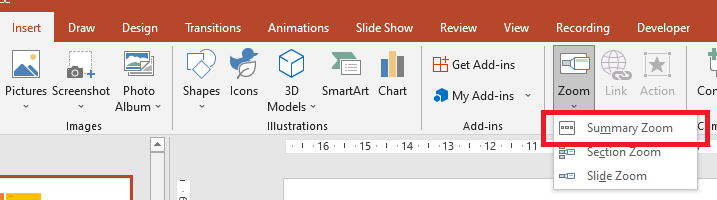

## **Bevezetés**

PowerPoint zoomok lehetővé teszik, hogy egy adott diára, szakaszra vagy a bemutató részeire ugorjunk oda‑vissza. Prezentáció során ez a gyors navigálási lehetőség nagyon hasznos lehet. 


* A teljes bemutató egyetlen diára való összefoglalásához használja a [Summary Zoom](#Summary-Zoom).
* Kiválasztott diák megjelenítéséhez használja a [Slide Zoom](#Slide-Zoom).
* Egyetlen szakasz megjelenítéséhez használja a [Section Zoom](#Section-Zoom).

## **Dia Zoom**
A dia zoom dinamikusabbá teheti a bemutatót, lehetővé téve, hogy szabadon navigáljon a diák között tetszőleges sorrendben anélkül, hogy megszakítaná a prezentáció folyamatát. A dia zoomok nagyszerűek rövid bemutatókhoz, ahol nincs sok szakasz, de más bemutatási forgatókönyvekben is használhatók.

A dia zoomok segítenek több információs darabot mélyebben megtekinteni, mintha egyetlen vásznon lennél. 


Dia zoom objektumokhoz az Aspose.Slides a [ZoomImageType](https://reference.aspose.com/slides/hu/java/com.aspose.slides/ZoomImageType) felsorolást, az [IZoomFrame](https://reference.aspose.com/slides/hu/java/com.aspose.slides/IZoomFrame) interfészt, valamint néhány metódust a [IShapeCollection](https://reference.aspose.com/slides/hu/java/com.aspose.slides/IShapeCollection) interfész alatt biztosítja.

### **Zoom Keretek Létrehozása**

Zoom keretet egy diára az alábbi módon adhat hozzá:

1.	Hozzon létre egy példányt a [Presentation](https://reference.aspose.com/slides/hu/java/com.aspose.slides/Presentation) osztályból.
2.	Hozzon létre új diát, amelyekhez a zoom kereteket kívánja linkelni. 
3.	Adjon az elkészített diákhoz azonosító szöveget és hátteret.
4.	Adjon zoom kereteket (a létrehozott diákra mutató hivatkozásokkal) az első diához.
5.	Írja ki a módosított bemutatót PPTX fájlként.

``` java
Presentation pres = new Presentation();
try {
    //Új diák hozzáadása a bemutatóhoz
    ISlide slide2 = pres.getSlides().addEmptySlide(pres.getSlides().get_Item(0).getLayoutSlide());
    ISlide slide3 = pres.getSlides().addEmptySlide(pres.getSlides().get_Item(0).getLayoutSlide());

    //Háttér létrehozása a második diára
    slide2.getBackground().setType(BackgroundType.OwnBackground);
    slide2.getBackground().getFillFormat().setFillType(FillType.Solid);
    slide2.getBackground().getFillFormat().getSolidFillColor().setColor(Color.cyan);

    //Szövegdoboz létrehozása a második diához
    IAutoShape autoshape = slide2.getShapes().addAutoShape(ShapeType.Rectangle, 100, 200, 500, 200);
    autoshape.getTextFrame().setText("Second Slide");

    //Háttér létrehozása a harmadik diára
    slide3.getBackground().setType(BackgroundType.OwnBackground);
    slide3.getBackground().getFillFormat().setFillType(FillType.Solid);
    slide3.getBackground().getFillFormat().getSolidFillColor().setColor(Color.darkGray);

    //Szövegdoboz létrehozása a harmadik diához
    autoshape = slide3.getShapes().addAutoShape(ShapeType.Rectangle, 100, 200, 500, 200);
    autoshape.getTextFrame().setText("Trird Slide");

    //ZoomFrame objektumok hozzáadása
    pres.getSlides().get_Item(0).getShapes().addZoomFrame(20, 20, 250, 200, slide2);
    pres.getSlides().get_Item(0).getShapes().addZoomFrame(200, 250, 250, 200, slide3);

    //A bemutató mentése
    pres.save("presentation.pptx", SaveFormat.Pptx);
} finally {
    if (pres != null) pres.dispose();
}
```
### **Egyéni Képekkel Létrehozott Zoom Keretek**

Az Aspose.Slides for Java segítségével egyedi előnézeti képpel rendelkező zoom keretet az alábbi módon hozhat létre: 
1.	Hozzon létre egy példányt a [Presentation](https://reference.aspose.com/slides/hu/java/com.aspose.slides/Presentation) osztályból.
2.	Hozzon létre egy új diát, amelyhez a zoom keretet linkelni kívánja. 
3.	Adjon a diához azonosító szöveget és hátteret.
4.	Hozzon létre egy [IPPImage](https://reference.aspose.com/slides/hu/java/com.aspose.slides/IPPImage) objektumot úgy, hogy képet ad hozzá a [Presentation](https://reference.aspose.com/slides/hu/java/com.aspose.slides/Presentation) objektumhoz társított Images gyűjteményhez, amely a keret kitöltésére szolgál.
5.	Adjon zoom kereteket (a létrehozott diára mutató hivatkozással) az első diához.
6.	Írja ki a módosított bemutatót PPTX fájlként.

``` java
Presentation pres = new Presentation();
try {
    //Új dia hozzáadása a bemutatóhoz
    ISlide slide = pres.getSlides().addEmptySlide(pres.getSlides().get_Item(0).getLayoutSlide());

    // Háttér létrehozása a második diára
    slide.getBackground().setType(BackgroundType.OwnBackground);
    slide.getBackground().getFillFormat().setFillType(FillType.Solid);
    slide.getBackground().getFillFormat().getSolidFillColor().setColor(Color.cyan);

    // Szövegdoboz létrehozása a harmadik diára
    IAutoShape autoshape = slide.getShapes().addAutoShape(ShapeType.Rectangle, 100, 200, 500, 200);
    autoshape.getTextFrame().setText("Second Slide");

    // Új kép létrehozása a zoom objektumhoz
    IPPImage picture;
        IImage image = Images.fromFile("image.png");
        try {
            picture = pres.getImages().addImage(image);
        } finally {
            if (image != null) image.dispose();
        }
    //ZoomFrame objektum hozzáadása
    pres.getSlides().get_Item(0).getShapes().addZoomFrame(20, 20, 300, 200, slide, picture);

    // A bemutató mentése
    pres.save("presentation.pptx", SaveFormat.Pptx);
} catch(IOException e) {
} finally {
    if (pres != null) pres.dispose();
}
```
### **Zoom Keretek Formázása**

Az előző szakaszokban bemutattuk, hogyan hozhat létre egyszerű zoom kereteket. Bonyolultabb zoom keretek létrehozásához módosítania kell egy egyszerű keret formázását. Többféle formázási lehetőség áll rendelkezésre a zoom keretekhez. 

A zoom keret formázását egy dián az alábbi módon vezérelheti:

1.	Hozzon létre egy példányt a [Presentation](https://reference.aspose.com/slides/hu/java/com.aspose.slides/Presentation) osztályból.
2.	Hozzon létre új diát, amelyekhez a zoom keretet linkelni kívánja. 
3.	Adjon némi azonosító szöveget és hátteret a létrehozott diákhoz.
4.	Adjon zoom kereteket (a létrehozott diákra mutató hivatkozásokkal) az első diához.
5.	Hozzon létre egy [IPPImage](https://reference.aspose.com/slides/hu/java/com.aspose.slides/IPPImage) objektumot úgy, hogy képet ad hozzá a [Presentation](https://reference.aspose.com/slides/hu/java/com.aspose.slides/Presentation) objektumhoz társított Images gyűjteményhez, amely a keret kitöltésére szolgál.
6.	Állítson be egy egyéni képet az első zoom keret objektumhoz.
7.	Módosítsa a vonal formázását a második zoom keret objektumnál.
8.	Távolítsa el a hátteret a második zoom keret objektum képéről.
5.	Írja ki a módosított bemutatót PPTX fájlként.

``` java 
Presentation pres = new Presentation();
try {
    //Új diák hozzáadása a bemutatóhoz
    ISlide slide2 = pres.getSlides().addEmptySlide(pres.getSlides().get_Item(0).getLayoutSlide());
    ISlide slide3 = pres.getSlides().addEmptySlide(pres.getSlides().get_Item(0).getLayoutSlide());

    // Háttér létrehozása a második diára
    slide2.getBackground().setType(BackgroundType.OwnBackground);
    slide2.getBackground().getFillFormat().setFillType(FillType.Solid);
    slide2.getBackground().getFillFormat().getSolidFillColor().setColor(Color.cyan);

    // Szövegdoboz létrehozása a második diára
    IAutoShape autoshape = slide2.getShapes().addAutoShape(ShapeType.Rectangle, 100, 200, 500, 200);
    autoshape.getTextFrame().setText("Second Slide");

    // Háttér létrehozása a harmadik diára
    slide3.getBackground().setType(BackgroundType.OwnBackground);
    slide3.getBackground().getFillFormat().setFillType(FillType.Solid);
    slide3.getBackground().getFillFormat().getSolidFillColor().setColor(Color.darkGray);

    // Szövegdoboz létrehozása a harmadik diára
    autoshape = slide3.getShapes().addAutoShape(ShapeType.Rectangle, 100, 200, 500, 200);
    autoshape.getTextFrame().setText("Trird Slide");

    //ZoomFrame objektumok hozzáadása
    IZoomFrame zoomFrame1 = pres.getSlides().get_Item(0).getShapes().addZoomFrame(20, 20, 250, 200, slide2);
    IZoomFrame zoomFrame2 = pres.getSlides().get_Item(0).getShapes().addZoomFrame(200, 250, 250, 200, slide3);

    // Új kép létrehozása a zoom objektumhoz
    IPPImage picture;
        IImage image = Images.fromFile("image.png");
        try {
            picture = pres.getImages().addImage(image);
        } finally {
            if (image != null) image.dispose();
        }
    //Egyéni kép beállítása a zoomFrame1 objektumhoz
    zoomFrame1.setImage(picture);

    // Zoomkeret formátum beállítása a zoomFrame2 objektumhoz
    zoomFrame2.getLineFormat().setWidth(5);
    zoomFrame2.getLineFormat().getFillFormat().setFillType(FillType.Solid);
    zoomFrame2.getLineFormat().getFillFormat().getSolidFillColor().setColor(Color.pink);
    zoomFrame2.getLineFormat().setDashStyle(LineDashStyle.DashDot);

    // Beállítás a zoomFrame2 objektum háttér megjelenítésének letiltásához
    zoomFrame2.setShowBackground(false);

    // A bemutató mentése
    pres.save("presentation.pptx", SaveFormat.Pptx);
} catch(IOException e) {
} finally {
    if (pres != null) pres.dispose();
}
```

## **Szakasz Zoom**

A szakasz zoom egy hivatkozás a bemutató egy szakaszára. A szakasz zoomokat használhatja visszatérni a kiemelni kívánt szakaszokhoz, vagy arra, hogy rámutasson, hogyan kapcsolódnak a bemutató egyes részei. 


Szakasz zoom objektumokhoz az Aspose.Slides az [ISectionZoomFrame](https://reference.aspose.com/slides/hu/java/com.aspose.slides/ISectionZoomFrame) interfészt és néhány metódust a [IShapeCollection](https://reference.aspose.com/slides/hu/java/com.aspose.slides/IShapeCollection) interfész alatt biztosít.

### **Szakasz Zoom Keretek Létrehozása**

Szakasz zoom keretet egy diára az alábbi módon adhat hozzá:

1.	Hozzon létre egy példányt a [Presentation](https://reference.aspose.com/slides/hu/java/com.aspose.slides/Presentation) osztályból.
2.	Hozzon létre egy új diát. 
3.	Adjon azonosító hátteret a létrehozott diához.
4.	Hozzon létre egy új szakaszt, amelyhez a zoom keretet linkelni kívánja. 
5.	Adjon szakasz zoom keretet (a létrehozott szakaszra mutató hivatkozással) az első diához.
6.	Írja ki a módosított bemutatót PPTX fájlként.

``` java
Presentation pres = new Presentation();
try {
    //Új dia hozzáadása a bemutatóhoz
    ISlide slide = pres.getSlides().addEmptySlide(pres.getSlides().get_Item(0).getLayoutSlide());
    slide.getBackground().getFillFormat().setFillType(FillType.Solid);
    slide.getBackground().getFillFormat().getSolidFillColor().setColor(Color.yellow);
    slide.getBackground().setType(BackgroundType.OwnBackground);

    // Új szakasz hozzáadása a bemutatóhoz
    pres.getSections().addSection("Section 1", slide);

    // Adds a SectionZoomFrame object
    ISectionZoomFrame sectionZoomFrame = pres.getSlides().get_Item(0).getShapes().addSectionZoomFrame(20, 20, 300, 200, pres.getSections().get_Item(1));

    // Saves the presentation
    pres.save("presentation.pptx", SaveFormat.Pptx);
} finally {
    if (pres != null) pres.dispose();
}
```
### **Egyéni Képekkel Létrehozott Szakasz Zoom Keretek**

Az Aspose.Slides for Java segítségével egyedi előnézeti képpel rendelkező szakasz zoom keretet az alábbi módon hozhat létre: 

1.	Hozzon létre egy példányt a [Presentation](https://reference.aspose.com/slides/hu/java/com.aspose.slides/Presentation) osztályból.
2.	Hozzon létre egy új diát.
3.	Adjon azonosító hátteret a létrehozott diához.
4.	Hozzon létre egy új szakaszt, amelyhez a zoom keretet linkelni kívánja. 
5.	Hozzon létre egy [IPPImage](https://reference.aspose.com/slides/hu/java/com.aspose.slides/IPPImage) objektumot úgy, hogy képet ad hozzá a [Presentation](https://reference.aspose.com/slides/hu/java/com.aspose.slides/Presentation) objektumhoz társított Images gyűjteményhez, amely a keret kitöltésére szolgál.
5.	Adjon egy szakasz zoom keretet (a létrehozott szakaszra mutató hivatkozással) az első diához.
6.	Írja ki a módosított bemutatót PPTX fájlként.

``` java 
Presentation pres = new Presentation();
try {
    //Új dia hozzáadása a bemutatóhoz
    ISlide slide = pres.getSlides().addEmptySlide(pres.getSlides().get_Item(0).getLayoutSlide());
    slide.getBackground().getFillFormat().setFillType(FillType.Solid);
    slide.getBackground().getFillFormat().getSolidFillColor().setColor(Color.yellow);
    slide.getBackground().setType(BackgroundType.OwnBackground);

    // Új szakasz hozzáadása a bemutatóhoz
    pres.getSections().addSection("Section 1", slide);

    // Új kép létrehozása a zoom objektumhoz
    IPPImage picture;
    IImage image = Images.fromFile("image.png");
    try {
        picture = pres.getImages().addImage(image);
    } finally {
        if (image != null) image.dispose();
    }

    // SectionZoomFrame objektum hozzáadása
    ISectionZoomFrame sectionZoomFrame = pres.getSlides().get_Item(0).getShapes().addSectionZoomFrame(20, 20, 300, 200, pres.getSections().get_Item(1), picture);

    // A bemutató mentése
    pres.save("presentation.pptx", SaveFormat.Pptx);
} catch(IOException e) {
} finally {
    if (pres != null) pres.dispose();
}
```
### **Szakasz Zoom Keretek Formázása**

A szakasz zoom keretek formázásához a következőképpen módosíthatja egy egyszerű keret beállításait. Többféle formázási lehetőség áll rendelkezésre egy szakasz zoom kerethez. 

A szakasz zoom keret formázását egy dián az alábbi módon vezérelheti:

1.	Hozzon létre egy példányt a [Presentation](https://reference.aspose.com/slides/hu/java/com.aspose.slides/Presentation) osztályból.
2.	Hozzon létre egy új diát.
3.	Adjon azonosító hátteret a létrehozott diához.
4.	Hozzon létre egy új szakaszt, amelyhez a zoom keretet linkelni kívánja. 
5.	Adjon szakasz zoom keretet (a létrehozott szakaszra mutató hivatkozással) az első diához.
6.	Módosítsa a létrehozott szakasz zoom objektum méretét és pozícióját.
7.	Hozzon létre egy [IPPImage](https://reference.aspose.com/slides/hu/java/com.aspose.slides/IPPImage) objektumot úgy, hogy képet ad hozzá a [Presentation](https://reference.aspose.com/slides/hu/java/com.aspose.slides/Presentation) objektumhoz társított Images gyűjteményhez, amely a keret kitöltésére szolgál.
8.	Állítson be egy egyéni képet a létrehozott szakasz zoom keret objektumhoz.
9.	Állítsa be a *visszatérés az eredeti diára a linkelt szakaszból* funkciót. 
10.	Távolítsa el a hátteret a szakasz zoom keret objektum képéről.
11.	Módosítsa a vonal formázását a második zoom keret objektumnál.
12.	Módosítsa az átmenet időtartamát.
13.	Írja ki a módosított bemutatót PPTX fájlként.

``` java
Presentation pres = new Presentation();
try {
    //Új dia hozzáadása a bemutatóhoz
    ISlide slide = pres.getSlides().addEmptySlide(pres.getSlides().get_Item(0).getLayoutSlide());
    slide.getBackground().getFillFormat().setFillType(FillType.Solid);
    slide.getBackground().getFillFormat().getSolidFillColor().setColor(Color.yellow);
    slide.getBackground().setType(BackgroundType.OwnBackground);

    // Új szakasz hozzáadása a bemutatóhoz
    pres.getSections().addSection("Section 1", slide);

    // SectionZoomFrame objektum hozzáadása
    ISectionZoomFrame sectionZoomFrame = pres.getSlides().get_Item(0).getShapes().addSectionZoomFrame(20, 20, 300, 200, pres.getSections().get_Item(1));

    // Formázás a SectionZoomFrame-hez
    sectionZoomFrame.setX(100);
    sectionZoomFrame.setY(300);
    sectionZoomFrame.setWidth(100);
    sectionZoomFrame.setHeight(75);

    IPPImage picture;
    IImage image = Images.fromFile("image.png");
    try {
         picture = pres.getImages().addImage(image);
     } finally {
        if (image != null) image.dispose();
     }
    sectionZoomFrame.setImage(picture);

    sectionZoomFrame.setReturnToParent(true);
    sectionZoomFrame.setShowBackground(false);

    sectionZoomFrame.getLineFormat().getFillFormat().setFillType(FillType.Solid);
    sectionZoomFrame.getLineFormat().getFillFormat().getSolidFillColor().setColor(Color.gray);
    sectionZoomFrame.getLineFormat().setDashStyle(LineDashStyle.DashDot);
    sectionZoomFrame.getLineFormat().setWidth(2.5f);

    sectionZoomFrame.setTransitionDuration(1.5f);

    // A bemutató mentése
    pres.save("presentation.pptx", SaveFormat.Pptx);
} catch(IOException e) {
} finally {
    if (pres != null) pres.dispose();
}
```


## **Összefoglaló Zoom**

Az összefoglaló zoom egy belépő oldalhoz hasonló, ahol a bemutató minden része egyszerre látható. Prezentáció során a zoomot használhatja a bemutató bármely pontja közötti átlépésre tetszőleges sorrendben. Kreatív lehet, előre ugorhat, vagy visszatérhet a diák egyes részeihez anélkül, hogy megszakítaná a bemutató folytonosságát.



Összefoglaló zoom objektumokhoz az Aspose.Slides a [ISummaryZoomFrame](https://reference.aspose.com/slides/hu/java/com.aspose.slides/ISummaryZoomFrame), [ISummaryZoomSection](https://reference.aspose.com/slides/hu/java/com.aspose.slides/ISummaryZoomSection) és [ISummaryZoomSectionCollection](https://reference.aspose.com/slides/hu/java/com.aspose.slides/ISummaryZoomSectionCollection) interfészeket, valamint néhány metódust a [IShapeCollection](https://reference.aspose.com/slides/hu/java/com.aspose.slides/IShapeCollection) interfész alatt biztosít.

### **Összefoglaló Zoom Létrehozása**

Összefoglaló zoom keretet egy diára az alábbi módon adhat hozzá:

1.	Hozzon létre egy példányt a [Presentation](https://reference.aspose.com/slides/hu/java/com.aspose.slides/Presentation) osztályból.
2.	Hozzon létre új diát azonosító háttérrel és új szakaszokkal a létrehozott diákhoz.
3.	Adja hozzá az összefoglaló zoom keretet az első diához.
4.	Írja ki a módosított bemutatót PPTX fájlként.

``` java 
Presentation pres = new Presentation();
try {
    //Új dia hozzáadása a bemutatóhoz
    ISlide slide = pres.getSlides().addEmptySlide(pres.getSlides().get_Item(0).getLayoutSlide());
    slide.getBackground().getFillFormat().setFillType(FillType.Solid);
    slide.getBackground().getFillFormat().getSolidFillColor().setColor(Color.gray);
    slide.getBackground().setType(BackgroundType.OwnBackground);

    // Új szakasz hozzáadása a bemutatóhoz
    pres.getSections().addSection("Section 1", slide);

    //Új dia hozzáadása a bemutatóhoz
    slide = pres.getSlides().addEmptySlide(pres.getSlides().get_Item(0).getLayoutSlide());
    slide.getBackground().getFillFormat().setFillType(FillType.Solid);
    slide.getBackground().getFillFormat().getSolidFillColor().setColor(Color.cyan);
    slide.getBackground().setType(BackgroundType.OwnBackground);

    // Új szakasz hozzáadása a bemutatóhoz
    pres.getSections().addSection("Section 2", slide);

    //Új dia hozzáadása a bemutatóhoz
    slide = pres.getSlides().addEmptySlide(pres.getSlides().get_Item(0).getLayoutSlide());
    slide.getBackground().getFillFormat().setFillType(FillType.Solid);
    slide.getBackground().getFillFormat().getSolidFillColor().setColor(Color.magenta);
    slide.getBackground().setType(BackgroundType.OwnBackground);

    // Új szakasz hozzáadása a bemutatóhoz
    pres.getSections().addSection("Section 3", slide);

    //Új dia hozzáadása a bemutatóhoz
    slide = pres.getSlides().addEmptySlide(pres.getSlides().get_Item(0).getLayoutSlide());
    slide.getBackground().getFillFormat().setFillType(FillType.Solid);
    slide.getBackground().getFillFormat().getSolidFillColor().setColor(Color.green);
    slide.getBackground().setType(BackgroundType.OwnBackground);

    // Új szakasz hozzáadása a bemutatóhoz
    pres.getSections().addSection("Section 4", slide);

    // Adds a SummaryZoomFrame object
    ISummaryZoomFrame summaryZoomFrame = pres.getSlides().get_Item(0).getShapes().addSummaryZoomFrame(150, 50, 300, 200);

    // A bemutató mentése
    pres.save("presentation.pptx", SaveFormat.Pptx);
} finally {
    if (pres != null) pres.dispose();
}
```

### **Összefoglaló Zoom Szakasz Hozzáadása és Eltávolítása**

Az összefoglaló zoom keretben minden szakaszt az [ISummaryZoomSection](https://reference.aspose.com/slides/hu/java/com.aspose.slides/ISummaryZoomSection) objektumok képviselnek, amelyeket az [ISummaryZoomSectionCollection](https://reference.aspose.com/slides/hu/java/com.aspose.slides/ISummaryZoomSectionCollection) tárol. Egy összefoglaló zoom szakasz objektumot az [ISummaryZoomSectionCollection](https://reference.aspose.com/slides/hu/java/com.aspose.slides/ISummaryZoomSectionCollection) interfészen keresztül a következőképpen adhat hozzá vagy távolíthat el:

1.	Hozzon létre egy példányt a [Presentation](https://reference.aspose.com/slides/hu/java/com.aspose.slides/Presentation) osztályból.
2.	Hozzon létre új diát azonosító háttérrel és új szakaszokkal a létrehozott diákhoz.
3.	Adjon egy összefoglaló zoom keretet az első diára.
4.	Adjon egy új diát és szakaszt a bemutatóhoz.
5.	Adja hozzá a létrehozott szakaszt az összefoglaló zoom kerethez.
6.	Távolítsa el az első szakaszt az összefoglaló zoom keretből.
7.	Írja ki a módosított bemutatót PPTX fájlként.

``` java
Presentation pres = new Presentation();
try {
    //Új dia hozzáadása a bemutatóhoz
    ISlide slide = pres.getSlides().addEmptySlide(pres.getSlides().get_Item(0).getLayoutSlide());
    slide.getBackground().getFillFormat().setFillType(FillType.Solid);
    slide.getBackground().getFillFormat().getSolidFillColor().setColor(Color.gray);
    slide.getBackground().setType(BackgroundType.OwnBackground);

    // Új szakasz hozzáadása a bemutatóhoz
    pres.getSections().addSection("Section 1", slide);

    //Új dia hozzáadása a bemutatóhoz
    slide = pres.getSlides().addEmptySlide(pres.getSlides().get_Item(0).getLayoutSlide());
    slide.getBackground().getFillFormat().setFillType(FillType.Solid);
    slide.getBackground().getFillFormat().getSolidFillColor().setColor(Color.cyan);
    slide.getBackground().setType(BackgroundType.OwnBackground);

    // Új szakasz hozzáadása a bemutatóhoz
    pres.getSections().addSection("Section 2", slide);

    // SummaryZoomFrame objektum hozzáadása
    ISummaryZoomFrame summaryZoomFrame = pres.getSlides().get_Item(0).getShapes().addSummaryZoomFrame(150, 50, 300, 200);

    //Új dia hozzáadása a bemutatóhoz
    slide = pres.getSlides().addEmptySlide(pres.getSlides().get_Item(0).getLayoutSlide());
    slide.getBackground().getFillFormat().setFillType(FillType.Solid);
    slide.getBackground().getFillFormat().getSolidFillColor().setColor(Color.magenta);
    slide.getBackground().setType(BackgroundType.OwnBackground);

    // Új szakasz hozzáadása a bemutatóhoz
    ISection section3 = pres.getSections().addSection("Section 3", slide);

    // Szakaszt hozzáadása az Summary Zoom-hoz
    summaryZoomFrame.getSummaryZoomCollection().addSummaryZoomSection(section3);

    // Szakasz eltávolítása a Summary Zoom-ból
    summaryZoomFrame.getSummaryZoomCollection().removeSummaryZoomSection(pres.getSections().get_Item(1));

    // A bemutató mentése
    pres.save("presentation.pptx", SaveFormat.Pptx);
} finally {
    if (pres != null) pres.dispose();
}
```

### **Összefoglaló Zoom Szakaszok Formázása**

A összefoglaló zoom szakasz objektum formázását egy összefoglaló zoom keretben a következőképpen vezérelheti:

1.	Hozzon létre egy példányt a [Presentation](https://reference.aspose.com/slides/hu/java/com.aspose.slides/Presentation) osztályból.
2.	Hozzon létre új diát azonosító háttérrel és új szakaszokkal a létrehozott diákhoz.
3.	Adjon egy összefoglaló zoom keretet az első diára.
4.	Szerezze meg az első objektumhoz tartozó összefoglaló zoom szakasz objektumot az `ISummaryZoomSectionCollection`‑ből.
7.	Hozzon létre egy [IPPImage](https://reference.aspose.com/slides/hu/java/com.aspose.slides/IPPImage) objektumot úgy, hogy képet ad hozzá a [Presentation](https://reference.aspose.com/slides/hu/java/com.aspose.slides/Presentation) objektumhoz társított images gyűjteményhez, amely a keret kitöltésére szolgál.
8.	Állítson be egy egyéni képet a létrehozott szakasz zoom keret objektumhoz.
9.	Állítsa be a *visszatérés az eredeti diára a linkelt szakaszból* funkciót. 
11.	Módosítsa a vonal formázását a második zoom keret objektumnál.
12.	Módosítsa az átmenet időtartamát.
13.	Írja ki a módosított bemutatót PPTX fájlként.

``` java
Presentation pres = new Presentation();
try {
    //Új dia hozzáadása a bemutatóhoz
    ISlide slide = pres.getSlides().addEmptySlide(pres.getSlides().get_Item(0).getLayoutSlide());
    slide.getBackground().getFillFormat().setFillType(FillType.Solid);
    slide.getBackground().getFillFormat().getSolidFillColor().setColor(Color.gray);
    slide.getBackground().setType(BackgroundType.OwnBackground);

    // Új szakasz hozzáadása a bemutatóhoz
    pres.getSections().addSection("Section 1", slide);

    //Új dia hozzáadása a bemutatóhoz
    slide = pres.getSlides().addEmptySlide(pres.getSlides().get_Item(0).getLayoutSlide());
    slide.getBackground().getFillFormat().setFillType(FillType.Solid);
    slide.getBackground().getFillFormat().getSolidFillColor().setColor(Color.cyan);
    slide.getBackground().setType(BackgroundType.OwnBackground);

    // Új szakasz hozzáadása a bemutatóhoz
    pres.getSections().addSection("Section 2", slide);

    // SummaryZoomFrame objektum hozzáadása
    ISummaryZoomFrame summaryZoomFrame = pres.getSlides().get_Item(0).getShapes().addSummaryZoomFrame(150, 50, 300, 200);

    // Az első SummaryZoomSection objektum lekérése
    ISummaryZoomSection summarySection = summaryZoomFrame.getSummaryZoomCollection().get_Item(0);

    // Formázás a SummaryZoomSection objektumhoz
    IPPImage picture;
    IImage image = Images.fromFile("image.png");
    try {
    picture = pres.getImages().addImage(picture);
    } finally {
          if (image != null) image.dispose();
    }
    summarySection.setImage(picture);

    summarySection.setReturnToParent(false);

    summarySection.getLineFormat().getFillFormat().setFillType(FillType.Solid);
    summarySection.getLineFormat().getFillFormat().getSolidFillColor().setColor(Color.black);
    summarySection.getLineFormat().setDashStyle(LineDashStyle.DashDot);
    summarySection.getLineFormat().setWidth(1.5f);

    summarySection.setTransitionDuration(1.5f);

    // A bemutató mentése
    pres.save("presentation.pptx", SaveFormat.Pptx);
} catch(IOException e) {
} finally {
    if (pres != null) pres.dispose();
}
```

## **GYIK**

**Vissza tudom‑e irányítani a „szülő” diára a cél megjelenítése után?**

Igen. A [Zoom frame](https://reference.aspose.com/slides/hu/java/com.aspose.slides/zoomframe/) vagy a [section](https://reference.aspose.com/slides/hu/java/com.aspose.slides/sectionzoomframe/) rendelkezik egy `ReturnToParent` viselkedéssel, amely engedélyezve a nézőket visszaküldi a kiindulási diára, miután megtekintették a cél tartalmat.

**Módosíthatom a Zoom átmenet „sebességét” vagy időtartamát?**

Igen. A Zoom támogatja a `TransitionDuration` beállítását, így szabályozhatja, mennyi ideig tart a ugrás animációja.

**Vannak korlátok arra, hogy hány Zoom objektumot tartalmazhat egy bemutató?**

A dokumentációban nincs szigorú API korlát. A gyakorlati határok a bemutató összetettségétől és a néző teljesítményétől függenek. Sok Zoom keretet hozzáadhat, de vegye figyelembe a fájlméretet és a renderelési időt.