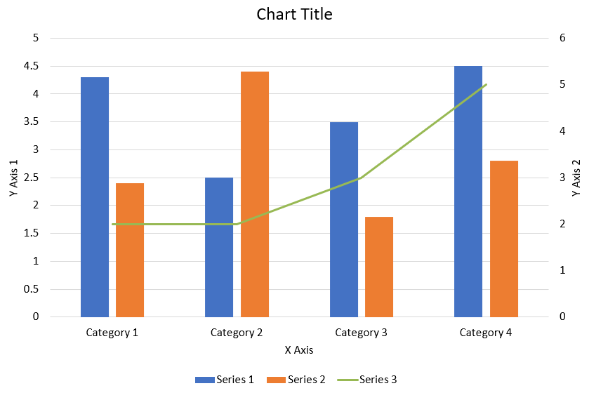

## **Áttekintés**

Ez a cikk átfogó útmutatót nyújt arról, hogyan hozhatunk létre és testreszabhassuk a diagramokat az Aspose.Slides használatával. Megtanulja, hogyan adhat programozott módon diagramot egy diára, hogyan töltheti fel adatokka­l, és hogyan alkalmazhat különféle formázási beállításokat a konkrét tervezési igényekhez. A cikk során részletes kódpéldák illusztrálják az egyes lépéseket, a prezentáció és a diagramobjektum inicializálásától a sorok, tengelyek és jelmagyarázatok konfigurálásáig. Az útmutató követésével szilárd megértést szerez a dinamikus diagramgenerálás integrálásáról alkalmazásaiban, egyszerűsítve az adat‑vezérelt prezentációk létrehozását.

## **Diagram Létrehozása**

A diagramok segítenek az embereknek gyorsan vizualizálni az adatokat és betekintést nyerni, ami esetleg nem nyilvánvaló egy táblázatból vagy számolótáblázatból.

**Miért érdemes diagramokat létrehozni?**

* nagy mennyiségű adat aggregálása, tömörítése vagy összegzése egyetlen dián egy prezentációban  
* minták és trendek feltárása az adatokban  
* megállapítani az adatok irányát és lendületét időben vagy egy adott mérőegységhez viszonyítva  
* kijelölni kiugró értékeket, rendellenességeket, eltéréseket, hibákat, értelmetlen adatokat stb.  
* komplex adatok kommunikálása vagy bemutatása  

PowerPointban diagramokat hozhat létre a Beszúrás funkcióval, amely számos diagramtípus tervezéséhez sablonokat biztosít. Az Aspose.Slides segítségével szabványos diagramokat (népszerű diagramtípusok alapján) és egyedi diagramokat is létrehozhat.

{}  
A diagramok létrehozásához az Aspose.Slides a [ChartType](https://reference.aspose.com/slides/hu/java/com.aspose.slides/ChartType) osztályt biztosítja. Ennek az osztálynak a mezői a különböző diagramtípusoknak felelnek meg.  
{}

### **Normál diagramok létrehozása**

_Steps: Create Chart_
- <a name="java-create-powerpoint-chart" id="java-create-powerpoint-chart"><strong><em>Lépések:</em> PowerPoint diagram létrehozása Java-ban</strong></a>
- <a name="java-create-presentation-chart" id="java-create-presentation-chart"><strong><em>Lépések:</em> Prezentáció diagram létrehozása Java-ban</strong></a>
- <a name="java-create-powerpoint-presentation-chart" id="java-create-powerpoint-presentation-chart"><strong><em>Lépések:</em> PowerPoint prezentáció diagram létrehozása Java-ban</strong></a>

_Kódlépések:_

1. Hozzon létre egy példányt a [Presentation](https://reference.aspose.com/slides/hu/java/com.aspose.slides/Presentation) osztályból.  
2. Szerezzen meg egy diára hivatkozást a indexe alapján.  
3. Adjon hozzá egy diagramot némi adattal, és adja meg a kívánt diagramtípust.  
4. Adjon címet a diagramnak.  
5. Nyissa meg a diagram adatlapját.  
6. Törölje az összes alapértelmezett sorozatot és kategóriát.  
7. Adjon hozzá új sorozatokat és kategóriákat.  
8. Adjon új diagramadatokat a diagram sorozathoz.  
9. Adjon kitöltőszínt a diagram sorozathoz.  
10. Adjon címkéket a diagram sorozatnak.  
11. Mentse a módosított prezentációt PPTX fájlként.  

Ez a Java kód megmutatja, hogyan hozhat létre egy normál diagramot:

```java
import com.aspose.slides.*;
import java.awt.Color;

// PPTX fájlt képviselő prezentáció osztályt példányosít
Presentation pres = new Presentation();
try {
    // Eléri az első diát
    ISlide sld = pres.getSlides().get_Item(0);
    
    // Diagramot ad hozzá az alapértelmezett adataival
    IChart chart = sld.getShapes().addChart(ChartType.ClusteredColumn, 0, 0, 500, 500);
    
    // Beállítja a diagram címét
    chart.getChartTitle().addTextFrameForOverriding("Sample Title");
    chart.getChartTitle().getTextFrameForOverriding().getTextFrameFormat().setCenterText(NullableBool.True);
    chart.getChartTitle().setHeight(20);
    chart.setTitle(true);
    
    // Beállítja a diagram adatlapjának indexét
    int defaultWorksheetIndex = 0;
    
    // Lekéri a diagram adatlapját
    IChartDataWorkbook fact = chart.getChartData().getChartDataWorkbook();
    
    // Törli az alapértelmezett generált sorozatokat és kategóriákat
    chart.getChartData().getSeries().clear();
    chart.getChartData().getCategories().clear();
    int s = chart.getChartData().getSeries().size();
    s = chart.getChartData().getCategories().size();
    
    // Új sorozatokat ad hozzá
    chart.getChartData().getSeries().add(fact.getCell(defaultWorksheetIndex, 0, 1, "Series 1"),chart.getType());
    chart.getChartData().getSeries().add(fact.getCell(defaultWorksheetIndex, 0, 2, "Series 2"),chart.getType());
    
    // Új kategóriákat ad hozzá
    chart.getChartData().getCategories().add(fact.getCell(defaultWorksheetIndex, 1, 0, "Caetegoty 1"));
    chart.getChartData().getCategories().add(fact.getCell(defaultWorksheetIndex, 2, 0, "Caetegoty 2"));
    chart.getChartData().getCategories().add(fact.getCell(defaultWorksheetIndex, 3, 0, "Caetegoty 3"));
    
    // Az első diagram sorozatot veszi
    IChartSeries series = chart.getChartData().getSeries().get_Item(0);
    
    // Most feltölti a sorozat adatait
    series.getDataPoints().addDataPointForBarSeries(fact.getCell(defaultWorksheetIndex, 1, 1, 20));
    series.getDataPoints().addDataPointForBarSeries(fact.getCell(defaultWorksheetIndex, 2, 1, 50));
    series.getDataPoints().addDataPointForBarSeries(fact.getCell(defaultWorksheetIndex, 3, 1, 30));
    
    // Beállítja a sorozat kitöltőszínét
    series.getFormat().getFill().setFillType(FillType.Solid);
    series.getFormat().getFill().getSolidFillColor().setColor(Color.RED);
    
    // A második diagram sorozatot veszi
    series = chart.getChartData().getSeries().get_Item(1);
    
    // Feltölti a sorozat adatait
    series.getDataPoints().addDataPointForBarSeries(fact.getCell(defaultWorksheetIndex, 1, 2, 30));
    series.getDataPoints().addDataPointForBarSeries(fact.getCell(defaultWorksheetIndex, 2, 2, 10));
    series.getDataPoints().addDataPointForBarSeries(fact.getCell(defaultWorksheetIndex, 3, 2, 60));
    
    // Beállítja a sorozat kitöltőszínét
    series.getFormat().getFill().setFillType(FillType.Solid);
    series.getFormat().getFill().getSolidFillColor().setColor(Color.GREEN);
    
    // Egyéni címkéket hoz létre az új sorozat minden kategóriájához
    // Beállítja az első címkét, hogy a kategória nevét jelenítse meg
    IDataLabel lbl = series.getDataPoints().get_Item(0).getLabel();
    lbl.getDataLabelFormat().setShowCategoryName(true);
    
    lbl = series.getDataPoints().get_Item(1).getLabel();
    lbl.getDataLabelFormat().setShowSeriesName(true);
    
    // Megjeleníti az értéket a harmadik címkén
    lbl = series.getDataPoints().get_Item(2).getLabel();
    lbl.getDataLabelFormat().setShowValue(true);
    lbl.getDataLabelFormat().setShowSeriesName(true);
    lbl.getDataLabelFormat().setSeparator("/");
    
    // Mentés a diagrammal együtt a prezentációt
    pres.save("output.pptx", SaveFormat.Pptx);
} finally {
    if (pres != null) pres.dispose();
}
```

### **Szórt diagramok létrehozása**

Szórt diagramok (más néven szórt ábrák vagy x‑y grafikonok) gyakran használatosak minták keresésére vagy két változó közti korreláció bemutatására.

Érdemes szórt diagramot használni, ha  

* párosított numerikus adatokat tartalmaz  
* két változó van, amelyek jól párosíthatók  
* meg szeretné határozni, hogy a két változó összefügg‑e  
* független változónak több értéke van egy függő változóhoz  

<a name="java-create-scattered-chart" id="java-create-scattered-chart"><strong><em>Lépések:</em> Szórt diagram létrehozása Java-ban</strong></a> |
<a name="java-create-powerpoint-scattered-chart" id="java-create-powerpoint-scattered-chart"><strong><em>Lépések:</em> PowerPoint szórt diagram létrehozása Java-ban</strong></a> |
<a name="java-create-powerpoint-presentation-scattered-chart" id="java-create-powerpoint-presentation-scattered-chart"><strong><em>Lépések:</em> PowerPoint prezentáció szórt diagram létrehozása Java-ban</strong></a>

1. Kérjük kövesse a fent említett lépéseket a [Normál diagramok létrehozása](#creating-normal-charts) részben  
2. A harmadik lépésnél adjon hozzá egy diagramot némi adattal, és válassza a kívánt diagramtípust az alábbiak közül  

   1. [ChartType.ScatterWithMarkers](https://reference.aspose.com/slides/hu/java/com.aspose.slides/charttype/#ScatterWithMarkers) - _Szórt diagramot jelöl._  
   2. [ChartType.ScatterWithSmoothLinesAndMarkers](https://reference.aspose.com/slides/hu/java/com.aspose.slides/charttype/#ScatterWithSmoothLinesAndMarkers) - _Szórt diagram, ívekkel összekötve, adatjelzőkkel._  
   3. [ChartType.ScatterWithSmoothLines](https://reference.aspose.com/slides/hu/java/com.aspose.slides/charttype/#ScatterWithSmoothLines) - _Szórt diagram, ívekkel összekötve, adatjelzők nélkül._  
   4. [ChartType.ScatterWithStraightLinesAndMarkers](https://reference.aspose.com/slides/hu/java/com.aspose.slides/charttype/#ScatterWithStraightLinesAndMarkers) - _Szórt diagram, egyenes vonalakkal összekötve, adatjelzőkkel._  
   5. [ChartType.ScatterWithStraightLines](https://reference.aspose.com/slides/hu/java/com.aspose.slides/charttype/#ScatterWithStraightLines) - _Szórt diagram, egyenes vonalakkal összekötve, adatjelzők nélkül._

Ez a Java kód megmutatja, hogyan hozhat létre szórt diagramokat különböző jelzősorozatokkal:  

```java
import com.aspose.slides.*;

// PPTX fájlt képviselő prezentáció osztályt példányosít
Presentation pres = new Presentation();
try {
    // Eléri az első diát
    ISlide slide = pres.getSlides().get_Item(0);

    // Létrehozza az alapértelmezett diagramot
    IChart chart = slide.getShapes().addChart(ChartType.ScatterWithSmoothLines, 0, 0, 400, 400);
    
    // Lekéri az alapértelmezett diagram adatlapjának indexét
    int defaultWorksheetIndex = 0;
    
    // Lekéri a diagram adatlapját
    IChartDataWorkbook fact = chart.getChartData().getChartDataWorkbook();
    
    // Törli a demó sorozatot
    chart.getChartData().getSeries().clear();
    
    // Új sorozatokat ad hozzá
    chart.getChartData().getSeries().add(fact.getCell(defaultWorksheetIndex, 1, 1, "Series 1"), chart.getType());
    chart.getChartData().getSeries().add(fact.getCell(defaultWorksheetIndex, 1, 3, "Series 2"), chart.getType());
    
    // Az első diagram sorozatot veszi
    IChartSeries series = chart.getChartData().getSeries().get_Item(0);
    
    // Új pontot (1:3) ad a sorozathoz
    series.getDataPoints().addDataPointForScatterSeries(fact.getCell(defaultWorksheetIndex, 2, 1, 1), fact.getCell(defaultWorksheetIndex, 2, 2, 3));
    
    // Új pontot (2:10) ad
    series.getDataPoints().addDataPointForScatterSeries(fact.getCell(defaultWorksheetIndex, 3, 1, 2), fact.getCell(defaultWorksheetIndex, 3, 2, 10));
    
    // Módosítja a sorozat típusát
    series.setType(ChartType.ScatterWithStraightLinesAndMarkers);
    
    // Módosítja a diagram sorozat jelölőjét
    series.getMarker().setSize(10);
    series.getMarker().setSymbol(MarkerStyleType.Star);
    
    // A második diagram sorozatot veszi
    series = chart.getChartData().getSeries().get_Item(1);
    
    // Új pontot (5:2) ad hozzá ott
    series.getDataPoints().addDataPointForScatterSeries(fact.getCell(defaultWorksheetIndex, 2, 3, 5), fact.getCell(defaultWorksheetIndex, 2, 4, 2));
    
    // Új pontot (3:1) ad
    series.getDataPoints().addDataPointForScatterSeries(fact.getCell(defaultWorksheetIndex, 3, 3, 3), fact.getCell(defaultWorksheetIndex, 3, 4, 1));
    
    // Új pontot (2:2) ad
    series.getDataPoints().addDataPointForScatterSeries(fact.getCell(defaultWorksheetIndex, 4, 3, 2), fact.getCell(defaultWorksheetIndex, 4, 4, 2));
    
    // Új pontot (5:1) ad
    series.getDataPoints().addDataPointForScatterSeries(fact.getCell(defaultWorksheetIndex, 5, 3, 5), fact.getCell(defaultWorksheetIndex, 5, 4, 1));
    
    // Módosítja a diagram sorozat jelölőjét
    series.getMarker().setSize(10);
    series.getMarker().setSymbol(MarkerStyleType.Circle);
    
    pres.save("AsposeChart_out.pptx", SaveFormat.Pptx);
} finally {
    if (pres != null) pres.dispose();
}
```

### **Kördiagramok létrehozása**

Kördiagramok a legalkalmasabbak a részek‑és‑egész kapcsolat megjelenítésére, különösen ha az adatok kategóriákat tartalmaznak numerikus értékekkel. Ha adatai sok részt vagy címkét tartalmaznak, érdemes sávdiagramot használni.

<a name="java-create-pie-chart" id="java-create-pie-chart"><strong><em>Lépések:</em> Kördiagram létrehozása Java-ban</strong></a> |
<a name="java-create-powerpoint-pie-chart" id="java-create-powerpoint-pie-chart"><strong><em>Lépések:</em> PowerPoint kördiagram létrehozása Java-ban</strong></a> |
<a name="java-create-powerpoint-presentation-pie-chart" id="java-create-powerpoint-presentation-pie-chart"><strong><em>Lépések:</em> PowerPoint prezentáció kördiagram létrehozása Java-ban</strong></a>

1. Hozzon létre egy példányt a [Presentation](https://reference.aspose.com/slides/hu/java/com.aspose.slides/Presentation) osztályból.  
2. Szerezze meg a dia hivatkozását az indexe alapján.  
3. Adjon hozzá egy diagramot alapértelmezett adatokkal a kívánt típussal (ebben az esetben a [ChartType].Pie).  
4. Nyissa meg a diagram adat [IChartDataWorkbook].  
5. Törölje az alapértelmezett sorozatokat és kategóriákat.  
6. Adjon hozzá új sorozatokat és kategóriákat.  
7. Adjon új diagramadatokat a diagram sorozathoz.  
8. Adjon új pontokat a diagramokhoz, és egyéni színeket a kördiagram szektoraihoz.  
9. Állítsa be a sorozatok címkéit.  
10. Állítson be vezetővonalakat a sorozatcímkékhez.  
11. Állítsa be a kördiagram forgásszögét.  
12. Mentse a módosított prezentációt PPTX fájlba  

Ez a Java kód megmutatja, hogyan hozhat létre egy kördiagramot:  

```java
import com.aspose.slides.*;
import java.awt.Color;

// PPTX fájlt képviselő prezentáció osztályt példányosít
Presentation pres = new Presentation();
try {
    // Eléri az első diát
    ISlide slides = pres.getSlides().get_Item(0);
    
    // Alapértelmezett adatokkal ad hozzá egy diagramot
    IChart chart = slides.getShapes().addChart(ChartType.Pie, 100, 100, 400, 400);
    
    // Beállítja a diagram címét
    chart.getChartTitle().addTextFrameForOverriding("Sample Title");
    chart.getChartTitle().getTextFrameForOverriding().getTextFrameFormat().setCenterText(NullableBool.True);
    chart.getChartTitle().setHeight(20);
    chart.setTitle(true);
    
    // Beállítja a diagram adatlapjának indexét
    int defaultWorksheetIndex = 0;
    
    // Lekéri a diagram adatlapját
    IChartDataWorkbook fact = chart.getChartData().getChartDataWorkbook();
    
    // Törli az alapértelmezett létrehozott sorozatokat és kategóriákat
    chart.getChartData().getSeries().clear();
    chart.getChartData().getCategories().clear();
    
    // Új kategóriákat ad hozzá
    chart.getChartData().getCategories().add(fact.getCell(0, 1, 0, "First Qtr"));
    chart.getChartData().getCategories().add(fact.getCell(0, 2, 0, "2nd Qtr"));
    chart.getChartData().getCategories().add(fact.getCell(0, 3, 0, "3rd Qtr"));
    
    // Új sorozatot ad hozzá
    IChartSeries series = chart.getChartData().getSeries().add(fact.getCell(0, 0, 1, "Series 1"), chart.getType());
    
    //Feltölti a sorozat adatait
    series.getDataPoints().addDataPointForPieSeries(fact.getCell(defaultWorksheetIndex, 1, 1, 20));
    series.getDataPoints().addDataPointForPieSeries(fact.getCell(defaultWorksheetIndex, 2, 1, 50));
    series.getDataPoints().addDataPointForPieSeries(fact.getCell(defaultWorksheetIndex, 3, 1, 30));
    
    // Nem működik az új verzióban
    // Új pontok hozzáadása és a szektor színének beállítása
    // series.IsColorVaried = true;
    chart.getChartData().getSeriesGroups().get_Item(0).setColorVaried(true);
    
    IChartDataPoint point = series.getDataPoints().get_Item(0);
    point.getFormat().getFill().setFillType(FillType.Solid);
    point.getFormat().getFill().getSolidFillColor().setColor(Color.CYAN);
	
    // Beállítja a szektor szegélyét
    point.getFormat().getLine().getFillFormat().setFillType(FillType.Solid);
    point.getFormat().getLine().getFillFormat().getSolidFillColor().setColor(Color.GRAY);
    point.getFormat().getLine().setWidth(3.0);
    point.getFormat().getLine().setStyle(LineStyle.ThinThick);
    point.getFormat().getLine().setDashStyle(LineDashStyle.DashDot);
    
    IChartDataPoint point1 = series.getDataPoints().get_Item(1);
    point1.getFormat().getFill().setFillType(FillType.Solid);
    point1.getFormat().getFill().getSolidFillColor().setColor(Color.ORANGE);
    
    // Beállítja a szektor szegélyét
    point1.getFormat().getLine().setFillFormat().setFillType(FillType.Solid);
    point1.getFormat().getLine().getFillFormat().getSolidFillColor().setColor(Color.BLUE);
    point1.getFormat().getLine().setWidth(3.0);
    point1.getFormat().getLine().setStyle(LineStyle.Single);
    point1.getFormat().getLine().setDashStyle(LineDashStyle.LargeDashDot);
    
    IChartDataPoint point2 = series.getDataPoints().get_Item(2);
    point2.getFormat().getFill().setFillType(FillType.Solid);
    point2.getFormat().getFill().getSolidFillColor().setColor(Color.YELLOW);
    
    // Beállítja a szektor szegélyét
    point2.getFormat().getLine().getFillFormat().setFillType(FillType.Solid);
    point2.getFormat().getLine().getFillFormat().getSolidFillColor().setColor(Color.RED);
    point2.getFormat().getLine().setWidth(2.0);
    point2.getFormat().getLine().setStyle(LineStyle.ThinThin);
    point2.getFormat().getLine().setDashStyle(LineDashStyle.LargeDashDotDot);
    
    // Egyéni címkéket hoz létre az új sorozat minden kategóriájához
    IDataLabel lbl1 = series.getDataPoints().get_Item(0).getLabel();
    
    // lbl.ShowCategoryName = true;
    lbl1.getDataLabelFormat().setShowValue(true);
    
    IDataLabel lbl2 = series.getDataPoints().get_Item(1).getLabel();
    lbl2.getDataLabelFormat().setShowValue(true);
    lbl2.getDataLabelFormat().setShowLegendKey(true);
    lbl2.getDataLabelFormat().setShowPercentage(true);
    
    IDataLabel lbl3 = series.getDataPoints().get_Item(2).getLabel();
    lbl3.getDataLabelFormat().setShowSeriesName(true);
    lbl3.getDataLabelFormat().setShowPercentage(true);
    
    // Megjeleníti a vezetővonalakat a diagramon
    series.getLabels().getDefaultDataLabelFormat().setShowLeaderLines(true);
    
    // Beállítja a kördiagram szektorok forgásszögét
    chart.getChartData().getSeriesGroups().get_Item(0).setFirstSliceAngle(180);
    
    // Mentés a diagrammal együtt a prezentációt
    pres.save("PieChart_out.pptx", SaveFormat.Pptx);
} finally {
    if (pres != null) pres.dispose();
}
```

### **Vonaldiagramok létrehozása**

Vonaldiagramok (más néven vonalgrafikonok) a legalkalmasabbak olyan helyzetekben, ahol a változások időbeli alakulását szeretné bemutatni. Egy vonaldiagram segítségével egyszerre sok adatot hasonlíthat össze, nyomon követheti az időbeli változásokat és trendeket, kiemelheti az anomáliákat a sorozatokban stb.

1. Hozzon létre egy példányt a [Presentation](https://reference.aspose.com/slides/hu/java/com.aspose.slides/Presentation) osztályból.  
2. Szerezzen meg egy diára hivatkozást a indexe alapján.  
3. Adjon hozzá egy diagramot alapértelmezett adatokkal a kívánt típussal (ebben az esetben a `ChartType.Line`).  
4. Mentse a módosított prezentációt PPTX fájlba  

Ez a Java kód megmutatja, hogyan hozhat létre egy vonaldiagramot:  

```java
import com.aspose.slides.*;

Presentation pres = new Presentation();
try {
    IChart lineChart = pres.getSlides().get_Item(0).getShapes().addChart(ChartType.Line, 10, 50, 600, 350);

    pres.save("lineChart.pptx", SaveFormat.Pptx);
} finally {
    if (pres != null) pres.dispose();
}
```

Alapértelmezés szerint a vonaldiagram pontjait egyenes folytonos vonalak kötik össze. Ha szeretné, hogy a pontok helyett szaggatott vonalak legyenek, megadhatja a kívánt szaggatottságot a következő módon:  

```java
import com.aspose.slides.*;

Presentation pres = new Presentation();
try {
    IChart lineChart = pres.getSlides().get_Item(0).getShapes().addChart(ChartType.Line, 10, 50, 600, 350);

    for (IChartSeries series : lineChart.getChartData().getSeries())
    {
        series.getFormat().getLine().setDashStyle(LineDashStyle.Dash);
    }

    pres.save("lineChart.pptx", SaveFormat.Pptx);
} finally {
    if (pres != null) pres.dispose();
}
```

### **Fa térképes diagramok létrehozása**

Fa térképes diagramok a legalkalmasabbak értékesítési adatok esetén, amikor szeretné megmutatni az adatkategóriák relatív méretét, és egyben gyorsan felhívni a figyelmet a nagy hozzájáruló elemekre.

<a name="java-create-tree-map-chart" id="java-create-tree-map-chart"><strong><em>Lépések:</em> Fa térképes diagram létrehozása Java-ban</strong></a> |
<a name="java-create-powerpoint-tree-map-chart" id="java-create-powerpoint-tree-map-chart"><strong><em>Lépések:</em> PowerPoint fa térképes diagram létrehozása Java-ban</strong></a> |
<a name="java-create-powerpoint-presentation-tree-map-chart" id="java-create-powerpoint-presentation-tree-map-chart"><strong><em>Lépések:</em> PowerPoint prezentáció fa térképes diagram létrehozása Java-ban</strong></a>

1. Hozzon létre egy példányt a [Presentation](https://reference.aspose.com/slides/hu/java/com.aspose.slides/Presentation) osztályból.  
2. Szerezzen meg egy diára hivatkozást a indexe alapján.  
3. Adjon hozzá egy diagramot alapértelmezett adatokkal a kívánt típussal (ebben az esetben a [ChartType].TreeMap).  
4. Nyissa meg a diagram adat [IChartDataWorkbook].  
5. Törölje az alapértelmezett sorozatokat és kategóriákat.  
6. Adjon hozzá új sorozatokat és kategóriákat.  
7. Adjon új diagramadatokat a diagram sorozathoz.  
8. Mentse a módosított prezentációt PPTX fájlba  

Ez a Java kód megmutatja, hogyan hozhat létre egy fa térképes diagramot:  

```java
import com.aspose.slides.*;

Presentation pres = new Presentation();
try {
    IChart chart = pres.getSlides().get_Item(0).getShapes().addChart(ChartType.Treemap, 50, 50, 500, 400);
    chart.getChartData().getCategories().clear();
    chart.getChartData().getSeries().clear();

    IChartDataWorkbook wb = chart.getChartData().getChartDataWorkbook();
    wb.clear(0);

    //ág 1
    IChartCategory leaf = chart.getChartData().getCategories().add(wb.getCell(0, "C1", "Leaf1"));
    leaf.getGroupingLevels().setGroupingItem(1, "Stem1");
    leaf.getGroupingLevels().setGroupingItem(2, "Branch1");

    chart.getChartData().getCategories().add(wb.getCell(0, "C2", "Leaf2"));

    leaf = chart.getChartData().getCategories().add(wb.getCell(0, "C3", "Leaf3"));
    leaf.getGroupingLevels().setGroupingItem(1, "Stem2");

    chart.getChartData().getCategories().add(wb.getCell(0, "C4", "Leaf4"));

    //ág 2
    leaf = chart.getChartData().getCategories().add(wb.getCell(0, "C5", "Leaf5"));
    leaf.getGroupingLevels().setGroupingItem(1, "Stem3");
    leaf.getGroupingLevels().setGroupingItem(2, "Branch2");

    chart.getChartData().getCategories().add(wb.getCell(0, "C6", "Leaf6"));

    leaf = chart.getChartData().getCategories().add(wb.getCell(0, "C7", "Leaf7"));
    leaf.getGroupingLevels().setGroupingItem(1, "Stem4");

    chart.getChartData().getCategories().add(wb.getCell(0, "C8", "Leaf8"));

    IChartSeries series = chart.getChartData().getSeries().add(ChartType.Treemap);
    series.getLabels().getDefaultDataLabelFormat().setShowCategoryName(true);
    series.getDataPoints().addDataPointForTreemapSeries(wb.getCell(0, "D1", 4));
    series.getDataPoints().addDataPointForTreemapSeries(wb.getCell(0, "D2", 5));
    series.getDataPoints().addDataPointForTreemapSeries(wb.getCell(0, "D3", 3));
    series.getDataPoints().addDataPointForTreemapSeries(wb.getCell(0, "D4", 6));
    series.getDataPoints().addDataPointForTreemapSeries(wb.getCell(0, "D5", 9));
    series.getDataPoints().addDataPointForTreemapSeries(wb.getCell(0, "D6", 9));
    series.getDataPoints().addDataPointForTreemapSeries(wb.getCell(0, "D7", 4));
    series.getDataPoints().addDataPointForTreemapSeries(wb.getCell(0, "D8", 3));

    series.setParentLabelLayout(ParentLabelLayoutType.Overlapping);

    pres.save("Treemap.pptx", SaveFormat.Pptx);
} finally {
    if (pres != null) pres.dispose();
}
```

### **Részvénydiagramok létrehozása**

<a name="java-create-stock-chart" id="java-create-stock-chart"><strong><em>Lépések:</em> Részvénydiagram létrehozása Java-ban</strong></a> |
<a name="java-create-powerpoint-stock-chart" id="java-powerpoint-stock-chart"><strong><em>Lépések:</em> PowerPoint részvénydiagram létrehozása Java-ban</strong></a> |
<a name="java-create-powerpoint-presentation-stock-chart" id="java-create-powerpoint-presentation-stock-chart"><strong><em>Lépések:</em> PowerPoint prezentáció részvénydiagram létrehozása Java-ban</strong></a>

1. Hozzon létre egy példányt a [Presentation](https://reference.aspose.com/slides/hu/java/com.aspose.slides/Presentation) osztályból.  
2. Szerezze meg a dia hivatkozását az indexe alapján.  
3. Adjon hozzá egy diagramot alapértelmezett adatokkal a kívánt típussal ([ChartType].OpenHighLowClose).  
4. Nyissa meg a diagram adat [IChartDataWorkbook].  
5. Törölje az alapértelmezett sorozatokat és kategóriákat.  
6. Adjon hozzá új sorozatokat és kategóriákat.  
7. Adjon új diagramadatokat a diagram sorozathoz.  
8. Határozza meg a HiLowLines formátumát.  
9. Mentse a módosított prezentációt PPTX fájlba  

A részvénydiagram létrehozásához használt minta Java kód:  

```java
import com.aspose.slides.*;

Presentation pres = new Presentation();
try {
    IChart chart = pres.getSlides().get_Item(0).getShapes().addChart(ChartType.OpenHighLowClose, 50, 50, 600, 400, false);

    chart.getChartData().getSeries().clear();
    chart.getChartData().getCategories().clear();

    IChartDataWorkbook wb = chart.getChartData().getChartDataWorkbook();

    chart.getChartData().getCategories().add(wb.getCell(0, 1, 0, "A"));
    chart.getChartData().getCategories().add(wb.getCell(0, 2, 0, "B"));
    chart.getChartData().getCategories().add(wb.getCell(0, 3, 0, "C"));

    chart.getChartData().getSeries().add(wb.getCell(0, 0, 1, "Open"), chart.getType());
    chart.getChartData().getSeries().add(wb.getCell(0, 0, 2, "High"), chart.getType());
    chart.getChartData().getSeries().add(wb.getCell(0, 0, 3, "Low"), chart.getType());
    chart.getChartData().getSeries().add(wb.getCell(0, 0, 4, "Close"), chart.getType());

    IChartSeries series = chart.getChartData().getSeries().get_Item(0);

    series.getDataPoints().addDataPointForStockSeries(wb.getCell(0, 1, 1, 72));
    series.getDataPoints().addDataPointForStockSeries(wb.getCell(0, 2, 1, 25));
    series.getDataPoints().addDataPointForStockSeries(wb.getCell(0, 3, 1, 38));

    series = chart.getChartData().getSeries().get_Item(1);
    series.getDataPoints().addDataPointForStockSeries(wb.getCell(0, 1, 2, 172));
    series.getDataPoints().addDataPointForStockSeries(wb.getCell(0, 2, 2, 57));
    series.getDataPoints().addDataPointForStockSeries(wb.getCell(0, 3, 2, 57));

    series = chart.getChartData().getSeries().get_Item(2);
    series.getDataPoints().addDataPointForStockSeries(wb.getCell(0, 1, 3, 12));
    series.getDataPoints().addDataPointForStockSeries(wb.getCell(0, 2, 3, 12));
    series.getDataPoints().addDataPointForStockSeries(wb.getCell(0, 3, 3, 13));

    series = chart.getChartData().getSeries().get_Item(3);
    series.getDataPoints().addDataPointForStockSeries(wb.getCell(0, 1, 4, 25));
    series.getDataPoints().addDataPointForStockSeries(wb.getCell(0, 2, 4, 38));
    series.getDataPoints().addDataPointForStockSeries(wb.getCell(0, 3, 4, 50));

    chart.getChartData().getSeriesGroups().get_Item(0).getUpDownBars().setUpDownBars(true);
    chart.getChartData().getSeriesGroups().get_Item(0).getHiLowLinesFormat().getLine().getFillFormat().setFillType(FillType.Solid);

    for (IChartSeries ser : chart.getChartData().getSeries())
    {
        ser.getFormat().getLine().getFillFormat().setFillType(FillType.NoFill);
    }

    pres.save("output.pptx", SaveFormat.Pptx);
} finally {
    if (pres != null) pres.dispose();
}
```

### **Box‑and‑Whisker diagramok létrehozása**

<a name="java-create-box-and-whisker-chart" id="java-create-box-and-whisker-chart"><strong><em>Lépések:</em> Box‑and‑Whisker diagram létrehozása Java-ban</strong></a> |
<a name="java-create-powerpoint-box-and-whisker-chart" id="java-powerpoint-box-and-whisker-chart"><strong><em>Lépések:</em> PowerPoint Box‑and‑Whisker diagram létrehozása Java-ban</strong></a> |
<a name="java-create-powerpoint-presentation-box-and-whisker-chart" id="java-create-powerpoint-presentation-box-and-whisker-chart"><strong><em>Lépések:</em> PowerPoint prezentáció Box‑and‑Whisker diagram létrehozása Java-ban</strong></a>

1. Hozzon létre egy példányt a [Presentation](https://reference.aspose.com/slides/hu/java/com.aspose.slides/Presentation) osztályból.  
2. Szerezzen meg egy diára hivatkozást a indexe alapján.  
3. Adjon hozzá egy diagramot alapértelmezett adatokkal a kívánt típussal ([ChartType].BoxAndWhisker).  
4. Nyissa meg a diagram adat [IChartDataWorkbook].  
5. Törölje az alapértelmezett sorozatokat és kategóriákat.  
6. Adjon hozzá új sorozatokat és kategóriákat.  
7. Adjon új diagramadatokat a diagram sorozathoz.  
8. Mentse a módosított prezentációt PPTX fájlba  

Ez a Java kód megmutatja, hogyan hozhat létre egy box‑and‑whisker diagramot:  

```java
import com.aspose.slides.*;

Presentation pres = new Presentation();
try {
    IChart chart = pres.getSlides().get_Item(0).getShapes().addChart(ChartType.BoxAndWhisker, 50, 50, 500, 400);
    chart.getChartData().getCategories().clear();
    chart.getChartData().getSeries().clear();

    IChartDataWorkbook wb = chart.getChartData().getChartDataWorkbook();
    wb.clear(0);

    chart.getChartData().getCategories().add(wb.getCell(0, "A1", "Category 1"));
    chart.getChartData().getCategories().add(wb.getCell(0, "A2", "Category 1"));
    chart.getChartData().getCategories().add(wb.getCell(0, "A3", "Category 1"));
    chart.getChartData().getCategories().add(wb.getCell(0, "A4", "Category 1"));
    chart.getChartData().getCategories().add(wb.getCell(0, "A5", "Category 1"));
    chart.getChartData().getCategories().add(wb.getCell(0, "A6", "Category 1"));

    IChartSeries series = chart.getChartData().getSeries().add(ChartType.BoxAndWhisker);

    series.setQuartileMethod(QuartileMethodType.Exclusive);
    series.setShowMeanLine(true);
    series.setShowMeanMarkers(true);
    series.setShowInnerPoints(true);
    series.setShowOutlierPoints(true);

    series.getDataPoints().addDataPointForBoxAndWhiskerSeries(wb.getCell(0, "B1", 15));
    series.getDataPoints().addDataPointForBoxAndWhiskerSeries(wb.getCell(0, "B2", 41));
    series.getDataPoints().addDataPointForBoxAndWhiskerSeries(wb.getCell(0, "B3", 16));
    series.getDataPoints().addDataPointForBoxAndWhiskerSeries(wb.getCell(0, "B4", 10));
    series.getDataPoints().addDataPointForBoxAndWhiskerSeries(wb.getCell(0, "B5", 23));
    series.getDataPoints().addDataPointForBoxAndWhiskerSeries(wb.getCell(0, "B6", 16));

    pres.save("BoxAndWhisker.pptx", SaveFormat.Pptx);
} finally {
    if (pres != null) pres.dispose();
}
```

### **Tölcsér diagramok létrehozása**

<a name="java-create-funnel-chart" id="java-create-funnel-chart"><strong><em>Lépések:</em> Tölcsér diagram létrehozása Java-ban</strong></a> |
<a name="java-create-powerpoint-funnel-chart" id="java-create-powerpoint-funnel-chart"><strong><em>Lépések:</em> PowerPoint tölcsér diagram létrehozása Java-ban</strong></a> |
<a name="java-create-powerpoint-presentation-funnel-chart" id="java-create-powerpoint-presentation-funnel-chart"><strong><em>Lépések:</em> PowerPoint prezentáció tölcsér diagram létrehozása Java-ban</strong></a>

1. Hozzon létre egy példányt a [Presentation](https://reference.aspose.com/slides/hu/java/com.aspose.slides/Presentation) osztályból.  
2. Szerezzen meg egy diára hivatkozást a indexe alapján.  
3. Adjon hozzá egy diagramot alapértelmezett adatokkal a kívánt típussal ([ChartType].Funnel).  
4. Mentse a módosított prezentációt PPTX fájlba  

A Java kód megmutatja, hogyan hozhat létre egy tölcsér diagramot:  

```java
import com.aspose.slides.*;

Presentation pres = new Presentation();
try {
    IChart chart = pres.getSlides().get_Item(0).getShapes().addChart(ChartType.Funnel, 50, 50, 500, 400);
    chart.getChartData().getCategories().clear();
    chart.getChartData().getSeries().clear();

    IChartDataWorkbook wb = chart.getChartData().getChartDataWorkbook();

    wb.clear(0);

    chart.getChartData().getCategories().add(wb.getCell(0, "A1", "Category 1"));
    chart.getChartData().getCategories().add(wb.getCell(0, "A2", "Category 2"));
    chart.getChartData().getCategories().add(wb.getCell(0, "A3", "Category 3"));
    chart.getChartData().getCategories().add(wb.getCell(0, "A4", "Category 4"));
    chart.getChartData().getCategories().add(wb.getCell(0, "A5", "Category 5"));
    chart.getChartData().getCategories().add(wb.getCell(0, "A6", "Category 6"));

    IChartSeries series = chart.getChartData().getSeries().add(ChartType.Funnel);

    series.getDataPoints().addDataPointForFunnelSeries(wb.getCell(0, "B1", 50));
    series.getDataPoints().addDataPointForFunnelSeries(wb.getCell(0, "B2", 100));
    series.getDataPoints().addDataPointForFunnelSeries(wb.getCell(0, "B3", 200));
    series.getDataPoints().addDataPointForFunnelSeries(wb.getCell(0, "B4", 300));
    series.getDataPoints().addDataPointForFunnelSeries(wb.getCell(0, "B5", 400));
    series.getDataPoints().addDataPointForFunnelSeries(wb.getCell(0, "B6", 500));

    pres.save("Funnel.pptx", SaveFormat.Pptx);
} finally {
    if (pres != null) pres.dispose();
}
```

### **Sunburst diagramok létrehozása**

<a name="java-create-sunburst-chart" id="java-create-sunburst-chart"><strong><em>Lépések:</em> Sunburst diagram létrehozása Java-ban</strong></a> |
<a name="java-create-powerpoint-sunburst-chart" id="java-create-powerpoint-sunburst-chart"><strong><em>Lépések:</em> PowerPoint Sunburst diagram létrehozása Java-ban</strong></a> |
<a name="java-create-powerpoint-presentation-sunburst-chart" id="java-create-powerpoint-presentation-sunburst-chart"><strong><em>Lépések:</em> PowerPoint prezentáció Sunburst diagram létrehozása Java-ban</strong></a>

1. Hozzon létre egy példányt a [Presentation](https://reference.aspose.com/slides/hu/java/com.aspose.slides/Presentation) osztályból.  
2. Szerezzen meg egy diára hivatkozást a indexe alapján.  
3. Adjon hozzá egy diagramot alapértelmezett adatokkal a kívánt típussal (ebben az esetben a [ChartType].sunburst).  
4. Mentse a módosított prezentációt PPTX fájlba  

Ez a Java kód megmutatja, hogyan hozhat létre egy sunburst diagramot:  

```java
import com.aspose.slides.*;

Presentation pres = new Presentation();
try {
    IChart chart = pres.getSlides().get_Item(0).getShapes().addChart(ChartType.Sunburst, 50, 50, 500, 400);
    chart.getChartData().getCategories().clear();
    chart.getChartData().getSeries().clear();

    IChartDataWorkbook wb = chart.getChartData().getChartDataWorkbook();
    wb.clear(0);

    //ág 1
    IChartCategory leaf = chart.getChartData().getCategories().add(wb.getCell(0, "C1", "Leaf1"));
    leaf.getGroupingLevels().setGroupingItem(1, "Stem1");
    leaf.getGroupingLevels().setGroupingItem(2, "Branch1");

    chart.getChartData().getCategories().add(wb.getCell(0, "C2", "Leaf2"));

    leaf = chart.getChartData().getCategories().add(wb.getCell(0, "C3", "Leaf3"));
    leaf.getGroupingLevels().setGroupingItem(1, "Stem2");

    chart.getChartData().getCategories().add(wb.getCell(0, "C4", "Leaf4"));

    //ág 2
    leaf = chart.getChartData().getCategories().add(wb.getCell(0, "C5", "Leaf5"));
    leaf.getGroupingLevels().setGroupingItem(1, "Stem3");
    leaf.getGroupingLevels().setGroupingItem(2, "Branch2");

    chart.getChartData().getCategories().add(wb.getCell(0, "C6", "Leaf6"));

    leaf = chart.getChartData().getCategories().add(wb.getCell(0, "C7", "Leaf7"));
    leaf.getGroupingLevels().setGroupingItem(1, "Stem4");

    chart.getChartData().getCategories().add(wb.getCell(0, "C8", "Leaf8"));

    IChartSeries series = chart.getChartData().getSeries().add(ChartType.Sunburst);
    series.getLabels().getDefaultDataLabelFormat().setShowCategoryName(true);
    series.getDataPoints().addDataPointForSunburstSeries(wb.getCell(0, "D1", 4));
    series.getDataPoints().addDataPointForSunburstSeries(wb.getCell(0, "D2", 5));
    series.getDataPoints().addDataPointForSunburstSeries(wb.getCell(0, "D3", 3));
    series.getDataPoints().addDataPointForSunburstSeries(wb.getCell(0, "D4", 6));
    series.getDataPoints().addDataPointForSunburstSeries(wb.getCell(0, "D5", 9));
    series.getDataPoints().addDataPointForSunburstSeries(wb.getCell(0, "D6", 9));
    series.getDataPoints().addDataPointForSunburstSeries(wb.getCell(0, "D7", 4));
    series.getDataPoints().addDataPointForSunburstSeries(wb.getCell(0, "D8", 3));
    
    pres.save("Sunburst.pptx", SaveFormat.Pptx);
} finally {
    if (pres != null) pres.dispose();
}
```

### **Histogram diagramok létrehozása**

<a name="java-create-histogram-chart" id="java-create-histogram-chart"><strong><em>Lépések:</em> Histogram diagram létrehozása Java-ban</strong></a> |
<a name="java-create-powerpoint-histogram-chart" id="java-create-powerpoint-histogram-chart"><strong><em>Lépések:</em> PowerPoint Histogram diagram létrehozása Java-ban</strong></a> |
<a name="java-create-powerpoint-presentation-histogram-chart" id="java-create-powerpoint-presentation-histogram-chart"><strong><em>Lépések:</em> PowerPoint prezentáció Histogram diagram létrehozása Java-ban</strong></a>

1. Hozzon létre egy példányt a [Presentation](https://reference.aspose.com/slides/hu/java/com.aspose.slides/Presentation) osztályból.  
2. Szerezzen meg egy diára hivatkozást a indexe alapján.  
3. Adjon hozzá egy diagramot alapértelmezett adatokkal a kívánt típussal ([ChartType].Histogram).  
4. Nyissa meg a diagram adat [IChartDataWorkbook].  
5. Törölje az alapértelmezett sorozatokat és kategóriákat.  
6. Adjon hozzá új sorozatokat és kategóriákat.  
7. Mentse a módosított prezentációt PPTX fájlba  

Ez a Java kód megmutatja, hogyan hozhat létre egy histogram diagramot:  

```java
import com.aspose.slides.*;

Presentation pres = new Presentation();
try {
    IChart chart = pres.getSlides().get_Item(0).getShapes().addChart(ChartType.Histogram, 50, 50, 500, 400);
    chart.getChartData().getCategories().clear();
    chart.getChartData().getSeries().clear();

    IChartDataWorkbook wb = chart.getChartData().getChartDataWorkbook();
    wb.clear(0);

    IChartSeries series = chart.getChartData().getSeries().add(ChartType.Histogram);
    series.getDataPoints().addDataPointForHistogramSeries(wb.getCell(0, "A1", 15));
    series.getDataPoints().addDataPointForHistogramSeries(wb.getCell(0, "A2", -41));
    series.getDataPoints().addDataPointForHistogramSeries(wb.getCell(0, "A3", 16));
    series.getDataPoints().addDataPointForHistogramSeries(wb.getCell(0, "A4", 10));
    series.getDataPoints().addDataPointForHistogramSeries(wb.getCell(0, "A5", -23));
    series.getDataPoints().addDataPointForHistogramSeries(wb.getCell(0, "A6", 16));

    chart.getAxes().getHorizontalAxis().setAggregationType(AxisAggregationType.Automatic);

    pres.save("Histogram.pptx", SaveFormat.Pptx);
} finally {
    if (pres != null) pres.dispose();
}
```

### **Radar diagramok létrehozása**

<a name="java-create-radar-chart" id="java-create-radar-chart"><strong><em>Lépések:</em> Radar diagram létrehozása Java-ban</strong></a> |
<a name="java-create-powerpoint-radar-chart" id="java-create-powerpoint-radar-chart"><strong><em>Lépések:</em> PowerPoint Radar diagram létrehozása Java-ban</strong></a> |
<a name="java-create-powerpoint-presentation-radar-chart" id="java-create-powerpoint-presentation-radar-chart"><strong><em>Lépések:</em> PowerPoint prezentáció Radar diagram létrehozása Java-ban</strong></a>

1. Hozzon létre egy példányt a [Presentation](https://reference.aspose.com/slides/hu/java/com.aspose.slides/Presentation) osztályból.  
2. Szerezzen meg egy diára hivatkozást a indexe alapján.  
3. Adjon hozzá egy diagramot némi adattal, és adja meg a kívánt diagramtípust (`ChartType.Radar`).  
4. Mentse a módosított prezentációt PPTX fájlba  

Ez a Java kód megmutatja, hogyan hozhat létre egy radar diagramot:  

```java
import com.aspose.slides.*;

Presentation pres = new Presentation();
try {
    pres.getSlides().get_Item(0).getShapes().addChart(ChartType.Radar, 20, 20, 400, 300);
    pres.save("Radar-chart.pptx", SaveFormat.Pptx);
} finally {
    if (pres != null) pres.dispose();
}
```

### **Többkategóriás diagramok létrehozása**

<a name="java-create-multi-category-chart" id="java-create-multi-category-chart"><strong><em>Lépések:</em> Többkategóriás diagram létrehozása Java-ban</strong></a> |
<a name="java-create-powerpoint-multi-category-chart" id="java-create-powerpoint-multi-category-chart"><strong><em>Lépések:</em> PowerPoint Többkategóriás diagram létrehozása Java-ban</strong></a> |
<a name="java-create-powerpoint-presentation-multi-category-chart" id="java-create-powerpoint-presentation-multi-category-chart"><strong><em>Lépések:</em> PowerPoint prezentáció Többkategóriás diagram létrehozása Java-ban</strong></a>

1. Hozzon létre egy példányt a [Presentation](https://reference.aspose.com/slides/hu/java/com.aspose.slides/Presentation) osztályból.  
2. Szerezzen meg egy diára hivatkozást a indexe alapján.  
3. Adjon hozzá egy diagramot alapértelmezett adatokkal a kívánt típussal ([ChartType].ClusteredColumn).  
4. Nyissa meg a diagram adat [IChartDataWorkbook].  
5. Törölje az alapértelmezett sorozatokat és kategóriákat.  
6. Adjon hozzá új sorozatokat és kategóriákat.  
7. Adjon új diagramadatokat a diagram sorozathoz.  
8. Mentse a módosított prezentációt PPTX fájlba.  

Ez a Java kód megmutatja, hogyan hozhat létre egy többkategóriás diagramot:  

```java
import com.aspose.slides.*;

Presentation pres = new Presentation();
try {
    IChart ch = pres.getSlides().get_Item(0).getShapes().addChart(ChartType.ClusteredColumn, 100, 100, 600, 450);
    ch.getChartData().getSeries().clear();
    ch.getChartData().getCategories().clear();
    
    IChartDataWorkbook fact = ch.getChartData().getChartDataWorkbook();
    fact.clear(0);
    int defaultWorksheetIndex = 0;

    IChartCategory category = ch.getChartData().getCategories().add(fact.getCell(0, "c2", "A"));
    category.getGroupingLevels().setGroupingItem(1, "Group1");
    category = ch.getChartData().getCategories().add(fact.getCell(0, "c3", "B"));

    category = ch.getChartData().getCategories().add(fact.getCell(0, "c4", "C"));
    category.getGroupingLevels().setGroupingItem(1, "Group2");
    category = ch.getChartData().getCategories().add(fact.getCell(0, "c5", "D"));

    category = ch.getChartData().getCategories().add(fact.getCell(0, "c6", "E"));
    category.getGroupingLevels().setGroupingItem(1, "Group3");
    category = ch.getChartData().getCategories().add(fact.getCell(0, "c7", "F"));

    category = ch.getChartData().getCategories().add(fact.getCell(0, "c8", "G"));
    category.getGroupingLevels().setGroupingItem(1, "Group4");
    category = ch.getChartData().getCategories().add(fact.getCell(0, "c9", "H"));

    // Sorozat hozzáadása
    IChartSeries series = ch.getChartData().getSeries().add(fact.getCell(0, "D1", "Series 1"),
            ChartType.ClusteredColumn);

    series.getDataPoints().addDataPointForBarSeries(fact.getCell(defaultWorksheetIndex, "D2", 10));
    series.getDataPoints().addDataPointForBarSeries(fact.getCell(defaultWorksheetIndex, "D3", 20));
    series.getDataPoints().addDataPointForBarSeries(fact.getCell(defaultWorksheetIndex, "D4", 30));
    series.getDataPoints().addDataPointForBarSeries(fact.getCell(defaultWorksheetIndex, "D5", 40));
    series.getDataPoints().addDataPointForBarSeries(fact.getCell(defaultWorksheetIndex, "D6", 50));
    series.getDataPoints().addDataPointForBarSeries(fact.getCell(defaultWorksheetIndex, "D7", 60));
    series.getDataPoints().addDataPointForBarSeries(fact.getCell(defaultWorksheetIndex, "D8", 70));
    series.getDataPoints().addDataPointForBarSeries(fact.getCell(defaultWorksheetIndex, "D9", 80));
    
    // Prezentáció mentése diagrammal
    pres.save("AsposeChart_out.pptx", SaveFormat.Pptx);
} finally {
    if (pres != null) pres.dispose();
}
```

### **Térkép diagramok létrehozása**

A térkép diagram egy olyan terület vizualizációja, amelyhez adatok kapcsolódnak. Térkép diagramok a legalkalmasabbak adatok vagy értékek összehasonlítására földrajzi régiók között.

<a name="java-create-map-chart" id="java-create-map-chart"><strong><em>Lépések:</em> Térkép diagram létrehozása Java-ban</strong></a> |
<a name="java-create-powerpoint-map-chart" id="java-create-powerpoint-map-chart"><strong><em>Lépések:</em> PowerPoint Térkép diagram létrehozása Java-ban</strong></a> |
<a name="java-create-powerpoint-presentation-map-chart" id="java-create-powerpoint-presentation-map-chart"><strong><em>Lépések:</em> PowerPoint prezentáció Térkép diagram létrehozása Java-ban</strong></a>

Ez a Java kód megmutatja, hogyan hozhat létre egy térkép diagramot:  

```java
import com.aspose.slides.*;

Presentation pres = new Presentation();
try {
    IChart chart = pres.getSlides().get_Item(0).getShapes().addChart(ChartType.Map, 50, 50, 500, 400);
    pres.save("mapChart.pptx", SaveFormat.Pptx);
} finally {
    if (pres != null) pres.dispose();
}
```

### **Kombinált diagramok létrehozása**

A kombinált diagram (vagy combo diagram) több diagramtípust kombinál egyetlen grafikonnal. Ez a diagram lehetővé teszi, hogy kiemelje, összehasonlítsa vagy megvizsgálja a különböző adatcsoportok közti különbségeket, segítve a kapcsolatok felismerését.



Az alábbi Java kód megmutatja, hogyan hozható létre a fent látható kombinált diagram egy PowerPoint prezentációban:  

```java
import com.aspose.slides.*;
import java.awt.Color;

static void createComboChart() {
    Presentation presentation = new Presentation();
    ISlide slide = presentation.getSlides().get_Item(0);
    try {
        IChart chart = createChartWithFirstSeries(slide);

        addSecondSeriesToChart(chart);
        addThirdSeriesToChart(chart);

        setPrimaryAxesFormat(chart);
        setSecondaryAxesFormat(chart);

        presentation.save("combo-chart.pptx", SaveFormat.Pptx);
    } finally {
        presentation.dispose();
    }
}

static IChart createChartWithFirstSeries(ISlide slide) {
    IChart chart = slide.getShapes().addChart(ChartType.ClusteredColumn, 50, 50, 600, 400);

    // Állítsa be a diagram címét.
    chart.setTitle(true);
    chart.getChartTitle().addTextFrameForOverriding("Chart Title");
    chart.getChartTitle().setOverlay(false);
    IParagraph titleParagraph = chart.getChartTitle().getTextFrameForOverriding().getParagraphs().get_Item(0);
    IPortionFormat titleFormat = titleParagraph.getParagraphFormat().getDefaultPortionFormat();
    titleFormat.setFontBold(NullableBool.False);
    titleFormat.setFontHeight(18f);

    // Állítsa be a diagram jelmagyarázatát.
    chart.getLegend().setPosition(LegendPositionType.Bottom);
    chart.getLegend().getTextFormat().getPortionFormat().setFontHeight(12f);

    // Törli az alapértelmezett generált sorozatokat és kategóriákat.
    chart.getChartData().getSeries().clear();
    chart.getChartData().getCategories().clear();

    int worksheetIndex = 0;
    IChartDataWorkbook workbook = chart.getChartData().getChartDataWorkbook();

    // Új kategóriákat ad hozzá.
    chart.getChartData().getCategories().add(workbook.getCell(worksheetIndex, 1, 0, "Category 1"));
    chart.getChartData().getCategories().add(workbook.getCell(worksheetIndex, 2, 0, "Category 2"));
    chart.getChartData().getCategories().add(workbook.getCell(worksheetIndex, 3, 0, "Category 3"));
    chart.getChartData().getCategories().add(workbook.getCell(worksheetIndex, 4, 0, "Category 4"));

    // Az első sorozatot adja hozzá.
    IChartDataCell seriesNameCell = workbook.getCell(worksheetIndex, 0, 1, "Series 1");
    IChartSeries series = chart.getChartData().getSeries().add(seriesNameCell, chart.getType());

    series.getParentSeriesGroup().setOverlap((byte)-25);
    series.getParentSeriesGroup().setGapWidth(220);

    series.getDataPoints().addDataPointForBarSeries(workbook.getCell(worksheetIndex, 1, 1, 4.3));
    series.getDataPoints().addDataPointForBarSeries(workbook.getCell(worksheetIndex, 2, 1, 2.5));
    series.getDataPoints().addDataPointForBarSeries(workbook.getCell(worksheetIndex, 3, 1, 3.5));
    series.getDataPoints().addDataPointForBarSeries(workbook.getCell(worksheetIndex, 4, 1, 4.5));

    return chart;
}

static void addSecondSeriesToChart(IChart chart) {
    IChartDataWorkbook workbook = chart.getChartData().getChartDataWorkbook();
    final int worksheetIndex = 0;

    IChartDataCell seriesNameCell = workbook.getCell(worksheetIndex, 0, 2, "Series 2");
    IChartSeries series = chart.getChartData().getSeries().add(seriesNameCell, ChartType.ClusteredColumn);

    series.getParentSeriesGroup().setOverlap((byte)-25);
    series.getParentSeriesGroup().setGapWidth(220);

    series.getDataPoints().addDataPointForBarSeries(workbook.getCell(worksheetIndex, 1, 2, 2.4));
    series.getDataPoints().addDataPointForBarSeries(workbook.getCell(worksheetIndex, 2, 2, 4.4));
    series.getDataPoints().addDataPointForBarSeries(workbook.getCell(worksheetIndex, 3, 2, 1.8));
    series.getDataPoints().addDataPointForBarSeries(workbook.getCell(worksheetIndex, 4, 2, 2.8));
}

static void addThirdSeriesToChart(IChart chart) {
    IChartDataWorkbook workbook = chart.getChartData().getChartDataWorkbook();
    final int worksheetIndex = 0;

    IChartDataCell seriesNameCell = workbook.getCell(worksheetIndex, 0, 3, "Series 3");
    IChartSeries series = chart.getChartData().getSeries().add(seriesNameCell, ChartType.Line);

    series.getDataPoints().addDataPointForLineSeries(workbook.getCell(worksheetIndex, 1, 3, 2.0));
    series.getDataPoints().addDataPointForLineSeries(workbook.getCell(worksheetIndex, 2, 3, 2.0));
    series.getDataPoints().addDataPointForLineSeries(workbook.getCell(worksheetIndex, 3, 3, 3.0));
    series.getDataPoints().addDataPointForLineSeries(workbook.getCell(worksheetIndex, 4, 3, 5.0));

    series.setPlotOnSecondAxis(true);
}

static void setPrimaryAxesFormat(IChart chart) {
    // Beállítja a vízszintes tengelyt.
    IAxis horizontalAxis = chart.getAxes().getHorizontalAxis();
    horizontalAxis.getTextFormat().getPortionFormat().setFontHeight(12f);
    horizontalAxis.getFormat().getLine().getFillFormat().setFillType(FillType.NoFill);

    setAxisTitle(horizontalAxis, "X Axis");

    // Beállítja a függőleges tengelyt.
    IAxis verticalAxis = chart.getAxes().getVerticalAxis();
    verticalAxis.getTextFormat().getPortionFormat().setFontHeight(12f);
    verticalAxis.getFormat().getLine().getFillFormat().setFillType(FillType.NoFill);

    setAxisTitle(verticalAxis, "Y Axis 1");

    // Beállítja a függőleges fő rácsvonalak színét.
    ILineFillFormat majorGridLinesFormat = verticalAxis.getMajorGridLinesFormat().getLine().getFillFormat();
    majorGridLinesFormat.setFillType(FillType.Solid);
    majorGridLinesFormat.getSolidFillColor().setColor(new Color(217, 217, 217));
}

static void setSecondaryAxesFormat(IChart chart) {
    // Beállítja a másodlagos vízszintes tengelyt.
    IAxis secondaryHorizontalAxis = chart.getAxes().getSecondaryHorizontalAxis();
    secondaryHorizontalAxis.setPosition(AxisPositionType.Bottom);
    secondaryHorizontalAxis.setCrossType(CrossesType.Maximum);
    secondaryHorizontalAxis.setVisible(false);
    secondaryHorizontalAxis.getMajorGridLinesFormat().getLine().getFillFormat().setFillType(FillType.NoFill);
    secondaryHorizontalAxis.getMinorGridLinesFormat().getLine().getFillFormat().setFillType(FillType.NoFill);

    // Beállítja a másodlagos függőleges tengelyt.
    IAxis secondaryVerticalAxis = chart.getAxes().getSecondaryVerticalAxis();
    secondaryVerticalAxis.setPosition(AxisPositionType.Right);
    secondaryVerticalAxis.getTextFormat().getPortionFormat().setFontHeight(12f);
    secondaryVerticalAxis.getFormat().getLine().getFillFormat().setFillType(FillType.NoFill);
    secondaryVerticalAxis.getMajorGridLinesFormat().getLine().getFillFormat().setFillType(FillType.NoFill);
    secondaryVerticalAxis.getMinorGridLinesFormat().getLine().getFillFormat().setFillType(FillType.NoFill);

    setAxisTitle(secondaryVerticalAxis, "Y Axis 2");
}

static void setAxisTitle(IAxis axis, String axisTitle) {
    axis.setTitle(true);
    axis.getTitle().setOverlay(false);
    IParagraph titleParagraph = axis.getTitle().addTextFrameForOverriding(axisTitle).getParagraphs().get_Item(0);
    IPortionFormat titleFormat = titleParagraph.getParagraphFormat().getDefaultPortionFormat();
    titleFormat.setFontBold(NullableBool.False);
    titleFormat.setFontHeight(12f);
}
```

## **Diagramok frissítése**

<a name="java-update-powerpoint-chart" id="java-update-powerpoint-chart"><strong><em>Lépések:</em> PowerPoint diagram frissítése Java-ban</strong></a> |
<a name="java-update-presentation-chart" id="java-update-presentation-chart"><strong><em>Lépések:</em> Prezentáció diagram frissítése Java-ban</strong></a> |
<a name="java-update-powerpoint-presentation-chart" id="java-update-powerpoint-presentation-chart"><strong><em>Lépések:</em> PowerPoint prezentáció diagram frissítése Java-ban</strong></a>

1. Hozzon létre egy [Presentation](https://reference.aspose.com/slides/hu/java/com.aspose.slides/Presentation) osztály példányt, amely a frissíteni kívánt diagramot tartalmazó prezentációt képviseli.  
2. Szerezze meg egy dia hivatkozását az indexe használatával.  
3. Járja be az összes alakzatot, hogy megtalálja a kívánt diagramot.  
4. Nyissa meg a diagram adatlapját.  
5. Módosítsa a diagram sorozatadatokat a sorozatértékek megváltoztatásával.  
6. Adjon hozzá egy új sorozatot és töltse fel az adatokat.  
7. Mentse a módosított prezentációt PPTX fájlként.  

Ez a Java kód megmutatja, hogyan frissíthet egy diagramot:  

```java
import com.aspose.slides.*;

// Megnyitja a prezentációt, amely a frissítendő diagramot tartalmazza
Presentation pres = new Presentation("ExistingChart.pptx");
try {
    // Eléri az első diát
    ISlide sld = pres.getSlides().get_Item(0);

    // Lekéri a diagramot a diáról
    IChart chart = (IChart)sld.getShapes().get_Item(0);

    // Beállítja a diagram adatlapjának indexét
    int defaultWorksheetIndex = 0;

    // Lekéri a diagram adatlapját
    IChartDataWorkbook fact = chart.getChartData().getChartDataWorkbook();

    // A diagram kategórianév módosítása
    fact.getCell(defaultWorksheetIndex, 1, 0, "Modified Category 1");
    fact.getCell(defaultWorksheetIndex, 2, 0, "Modified Category 2");

    // Az első diagram sorozatot veszi
    IChartSeries series = chart.getChartData().getSeries().get_Item(0);

    // Most frissíti a sorozat adatait
    fact.getCell(defaultWorksheetIndex, 0, 1, "New_Series1");// Sorozat nevét módosítja
    series.getDataPoints().get_Item(0).getValue().setData(90);
    series.getDataPoints().get_Item(1).getValue().setData(123);
    series.getDataPoints().get_Item(2).getValue().setData(44);

    // A második diagram sorozatot veszi
    series = chart.getChartData().getSeries().get_Item(1);

    // Most frissíti a sorozat adatait
    fact.getCell(defaultWorksheetIndex, 0, 2, "New_Series2");// Sorozat nevét módosítja
    series.getDataPoints().get_Item(0).getValue().setData(23);
    series.getDataPoints().get_Item(1).getValue().setData(67);
    series.getDataPoints().get_Item(2).getValue().setData(99);

    // Most új sorozatot ad hozzá
    chart.getChartData().getSeries().add(fact.getCell(defaultWorksheetIndex, 0, 3, "Series 3"), chart.getType());

    // A harmadik diagram sorozatot veszi
    series = chart.getChartData().getSeries().get_Item(2);

    // Most feltölti a sorozat adatait
    series.getDataPoints().addDataPointForBarSeries(fact.getCell(defaultWorksheetIndex, 1, 3, 20));
    series.getDataPoints().addDataPointForBarSeries(fact.getCell(defaultWorksheetIndex, 2, 3, 50));
    series.getDataPoints().addDataPointForBarSeries(fact.getCell(defaultWorksheetIndex, 3, 3, 30));

    chart.setType(ChartType.ClusteredCylinder);

    // Mentés diagrammal együtt a prezentációt
    pres.save("AsposeChartModified_out.pptx", SaveFormat.Pptx);
} finally {
    if (pres != null) pres.dispose();
}
```

## **Adattartomány beállítása diagramhoz**

A diagram adattartományának beállításához tegye a következőket:

1. Hozzon létre egy [Presentation](https://reference.aspose.com/slides/hu/java/com.aspose.slides/Presentation) osztály példányt, amely a diagramot tartalmazó prezentációt képviseli.  
2. Szerezzen meg egy diára hivatkozást a indexe alapján.  
3. Járja be az összes alakzatot, hogy megtalálja a kívánt diagramot.  
4. Nyissa meg a diagram adatot, és állítsa be a tartományt.  
5. Mentse a módosított prezentációt PPTX fájlként.  

Ez a Java kód megmutatja, hogyan állítható be a diagram adattartománya:  

```java
import com.aspose.slides.*;

// Megnyitja a diagramot tartalmazó prezentációt
Presentation pres = new Presentation("ExistingChart.pptx");
try {
    ISlide slide = pres.getSlides().get_Item(0);
    IChart chart = (IChart)slide.getShapes().get_Item(0);
    
    chart.getChartData().setRange("Sheet1!A1:B4");
    
    pres.save("SetDataRange_out.pptx", SaveFormat.Pptx);
} finally {
    if (pres != null) pres.dispose();
}
```

## **Alapértelmezett jelölők használata diagramokban**

Alapértelmezett jelölő használatakor a diagram sorozatai automatikusan különböző alapértelmezett jelölőszimbólumokkal jelennek meg.

Ez a Java kód megmutatja, hogyan állítható be a diagram sorozat jelölője automatikusan:  

```java
import com.aspose.slides.*;

Presentation pres = new Presentation();
try {
    ISlide slide = pres.getSlides().get_Item(0);
    IChart chart = slide.getShapes().addChart(ChartType.LineWithMarkers, 10, 10, 400, 400);

    chart.getChartData().getSeries().clear();
    chart.getChartData().getCategories().clear();

    IChartDataWorkbook fact = chart.getChartData().getChartDataWorkbook();
    chart.getChartData().getSeries().add(fact.getCell(0, 0, 1, "Series 1"), chart.getType());
    IChartSeries series = chart.getChartData().getSeries().get_Item(0);

    chart.getChartData().getCategories().add(fact.getCell(0, 1, 0, "C1"));
    series.getDataPoints().addDataPointForLineSeries(fact.getCell(0, 1, 1, 24));
    chart.getChartData().getCategories().add(fact.getCell(0, 2, 0, "C2"));
    series.getDataPoints().addDataPointForLineSeries(fact.getCell(0, 2, 1, 23));
    chart.getChartData().getCategories().add(fact.getCell(0, 3, 0, "C3"));
    series.getDataPoints().addDataPointForLineSeries(fact.getCell(0, 3, 1, -10));
    chart.getChartData().getCategories().add(fact.getCell(0, 4, 0, "C4"));
    series.getDataPoints().addDataPointForLineSeries(fact.getCell(0, 4, 1, null));

    chart.getChartData().getSeries().add(fact.getCell(0, 0, 2, "Series 2"), chart.getType());
    //Vegye a második diagram sorozatot
    IChartSeries series2 = chart.getChartData().getSeries().get_Item(1);

    //Most a sorozat adatait töltjük fel
    series2.getDataPoints().addDataPointForLineSeries(fact.getCell(0, 1, 2, 30));
    series2.getDataPoints().addDataPointForLineSeries(fact.getCell(0, 2, 2, 10));
    series2.getDataPoints().addDataPointForLineSeries(fact.getCell(0, 3, 2, 60));
    series2.getDataPoints().addDataPointForLineSeries(fact.getCell(0, 4, 2, 40));

    chart.setLegend(true);
    chart.getLegend().setOverlay(false);

    pres.save("DefaultMarkersInChart.pptx", SaveFormat.Pptx);
} finally {
    if (pres != null) pres.dispose();
}
```

## **FAQ**

### Milyen diagramtípusokat támogat az Aspose.Slides?

Az Aspose.Slides széles körű [diagramtípusokat](https://reference.aspose.com/slides/hu/java/com.aspose.slides/charttype/) támogat, többek között oszlop, vonal, kör, terület, szórt, histogram, radar és sok más. Ez a rugalmasság lehetővé teszi, hogy a legmegfelelőbb diagramtípust válassza adatvizualizációs igényeihez.

### Hogyan adhatok hozzá új diagramot egy diára?

Diagram hozzáadásához először hozzon létre egy [Presentation](https://reference.aspose.com/slides/hu/java/com.aspose.slides/presentation/) osztály példányt, szerezze be a kívánt diát az indexe alapján, majd hívja meg a diagram hozzáadására szolgáló metódust, megadva a diagramtípust és a kezdeti adatokat. Ez a folyamat közvetlenül a prezentációba integrálja a diagramot.

### Hogyan frissíthetem a diagramon megjelenített adatokat?

A diagram adatait a diagram adatkönyvtárához ([IChartDataWorkbook](https://reference.aspose.com/slides/hu/java/com.aspose.slides/ichartdataworkbook/)) való hozzáféréssel frissítheti, törölheti az alapértelmezett sorozatokat és kategóriákat, majd hozzáadhatja saját egyéni adatait. Ez lehetővé teszi a diagram legújabb adatokkal való naprakész tartását.

### Lehet-e testreszabni a diagram megjelenését?

Igen, az Aspose.Slides kiterjedt testreszabási lehetőségeket kínál. Módosíthatja a színeket, betűtípusokat, címkéket, jelmagyarázatokat és egyéb [formatting elements](/slides/hu/java/chart-entities/) elemeket, hogy a diagram megjelenése megfeleljen a tervezési követelményeinek.