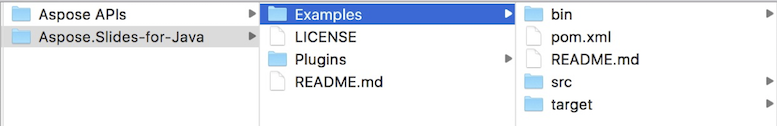

## **Letöltés az Aspose.Slides GitHub-ról**
Az összes Aspose.Slides for Java példát a [Github](https://github.com/aspose-slides/Aspose.Slides-for-Java) tárolja. Klónozhatja a tárolót kedvenc Github kliensével, vagy letöltheti a ZIP fájlt [ide](https://codeload.github.com/aspose-slides/Aspose.Slides-for-Java/zip/master).

Csomagolja ki a ZIP fájl tartalmát bármilyen mappába a számítógépén. Az összes példa a **Examples** mappában található.



## **Példák importálása az IDE-be**
A projekt Maven építési rendszert használ. Bármely modern IDE könnyen megnyithatja vagy importálhatja a projektet és annak függőségeit. Az alábbiakban bemutatjuk, hogyan használhatja a népszerű IDE-ket a példák felépítéséhez és futtatásához.

### **IntelliJ IDEA**
Kattintson a **File** menüre, majd válassza a **Open** lehetőséget. Tallózzon a projektmappához, és válassza ki a **pom.xml** fájlt.


A projekt megnyílik, és a függőségek automatikusan letöltődnek. A **Project** fülön tallózzon a **src/main/java** mappában található példák között. Egy példa futtatásához kattintson jobb gombbal a fájlra, és válassza a „Run ..” lehetőséget; a példa végrehajtódik, és a kimenet a beépített konzolablakban jelenik meg.


### **Eclipse**
Kattintson a **File** menüre, majd válassza az **Import** lehetőséget. Válassza a **Maven** – **Existing Maven Projects** opciót.


Tallózzon a GitHub-ról klónozott vagy letöltött mappához, és válassza a **pom.xml** fájlt. A projekt megnyílik, és a függőségek automatikusan letöltődnek. A **Package Explorer** fülön tallózzon a **src/main/java** mappában található példák között. Egy példa futtatásához kattintson jobb gombbal a fájlra, és válassza a **Run As** – **Java Application** lehetőséget; a példa végrehajtódik, és a kimenet a beépített konzolablakban jelenik meg.


### **NetBeans**
Kattintson a **File** menüre, majd válassza a **Open Project** lehetőséget. Tallózzon a GitHub-ról klónozott vagy letöltött mappához. A **Examples** mappa ikonjában megjelenik, hogy Maven projektről van szó. Válassza ki az **Examples** elemet, és nyissa meg.


A projekt megnyílik, és a függőségek automatikusan letöltődnek. A **Projects** fülön tallózzon a **source packages** mappában található példák között. Egy példa futtatásához kattintson jobb gombbal a fájlra, és válassza a **Run File** lehetőséget; a példa végrehajtódik, és a kimenet a beépített konzolablakban jelenik meg.


## **Aspose.Slides könyvtár hozzáadása a Maven helyi tárolóhoz**
Amikor importálja a **Aspose.Slides Examples** projektet az IDE-be, a Maven automatikusan letölti az aspose.slides JAR fájlt az [Aspose Maven Repository](https://releases.aspose.com/java/repo/com/aspose/) címről. Ha nincs internetkapcsolata, manuálisan is hozzáadhatja a JAR-t a helyi tárolóhoz.

### **mvn install**
Töltse le a [aspose.slides](https://releases.aspose.com/java/repo/com/aspose/aspose-slides/), csomagolja ki, és másolja az aspose.slides‑version.jar fájlt valahová, például a C meghajtóra. Adja ki a következő parancsot:

```
mvn install:install-file
    - Dfile=c:\aspose.slides-version.jar
    - DgroupId=com.aspose
    - DartifactId=aspose-slides
    - Dversion={version}
    - Dpackaging=jar
```

Most az **aspose.slides** jar a Maven helyi tárolójába másolódott.

### **pom.xml**
A telepítés után csak deklarálja az **aspose.slides** koordinátát a pom.xml‑ben. Adja hozzá az alábbi tárolót a **repositories** részhez, és a függőséget a **dependencies** részhez.

``` xml
<repository>
    <id>AsposeJavaAPI</id>
    <name>Aspose Java API</name>
    <url>https://releases.aspose.com/java/repo/</url>
</repository>

<dependency>
    <groupId>com.aspose</groupId>
    <artifactId>aspose-slides</artifactId>
    <version>25.12</version>
    <classifier>jdk16</classifier>
</dependency>
```

### **Kész**
Építse meg a projektet, most már a **aspose.slides** jar a Maven helyi tárolójából lesz elérhető.

## **Hozzájárulás**
Ha szeretne példát hozzáadni vagy javítani, bátorítjuk, hogy járuljon hozzá a projekthez. A tárolóban lévő összes példa és bemutató projekt nyílt forráskódú, és szabadon felhasználható saját alkalmazásaiban.

A hozzájáruláshoz fork-olhatja a tárolót, szerkesztheti a forráskódot, majd beküldhet egy Pull Request‑et. Át fogjuk tekinteni a változtatásokat, és ha hasznosnak találjuk, bekerülnek a tárolóba.