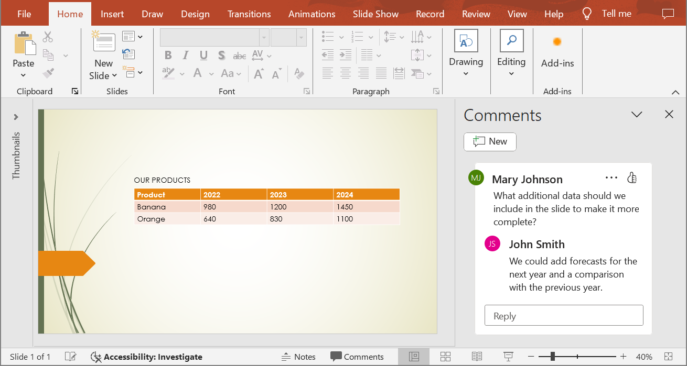

## **Bevezetés**

A PowerPoint és OpenDocument prezentációk JPG képekké konvertálása megkönnyíti a diák megosztását, a teljesítmény optimalizálását, valamint a tartalom weboldalakba vagy alkalmazásokba ágyazását. Az Aspose.Slides for .NET lehetővé teszi PPTX, PPT és ODP fájlok magas minőségű JPEG képekké alakítását. Ez az útmutató a konverzió különböző módszereit ismerteti.

Ezekkel a funkciókkal egyszerűen megvalósíthat saját prezentációs megjelenítőt, és minden diáról előnézeti képet készíthet. Ez hasznos lehet, ha a diákat másolás ellen kívánja védeni, vagy csak olvasásra szánt módon szeretné bemutatni a prezentációt. Az Aspose.Slides lehetővé teszi a teljes prezentáció vagy egy adott dia képformátumba konvertálását.

## **Prezentációs diák konvertálása JPG képekké**

A PPT, PPTX vagy ODP fájl JPG-re konvertálásának lépései:

1. Hozzon létre egy példányt a [Presentation](https://reference.aspose.com/slides/hu/net/aspose.slides/presentation) osztályból.  
1. Szerezze be a [ISlide](https://reference.aspose.com/slides/hu/net/aspose.slides/islide) típusú diaobjektumot a [Presentation.Slides](https://reference.aspose.com/slides/hu/net/aspose.slides/presentation/properties/slides) gyűjteményből.  
1. Készítsen képet a diáról a [ISlide.GetImage(float, float)](https://reference.aspose.com/slides/hu/net/aspose.slides/islide/getimage/#getimage_5) metódus segítségével.  
1. Hívja meg az [IImage.Save(string, ImageFormat)](https://reference.aspose.com/slides/hu/net/aspose.slides/iimage/save/#save_3) metódust a képobjektumon. Adja meg a kimeneti fájlnevet és a képformátumot argumentumként.

{} 

**Megjegyzés:** A PPT, PPTX vagy ODP JPG-re konvertálása eltér a többi formátumra való konvertálástól az Aspose.Slides .NET API-ban. Más formátumok esetén általában a [IPresentation.Save(String, SaveFormat, ISaveOptions)](https://reference.aspose.com/slides/hu/net/aspose.slides/ipresentation/save/#save_5) metódust használja. JPG konvertálásnál azonban a [IImage.Save(string, ImageFormat)](https://reference.aspose.com/slides/hu/net/aspose.slides/iimage/save/#save_3) metódust kell alkalmazni.

{} 

```c#
int scaleX = 1;
int scaleY = scaleX;

using (Presentation presentation = new Presentation("PowerPoint_Presentation.ppt"))
{
    foreach (ISlide slide in presentation.Slides)
    {
        // Készítsen diaképet a megadott méretezés szerint.
        using (IImage thumbnail = slide.GetImage(scaleX, scaleY))
        {
            // Mentse a képet lemezre JPEG formátumban.
            string imageFileName = $"Slide_{slide.SlideNumber}.jpg";
            thumbnail.Save(imageFileName, ImageFormat.Jpeg);
        }
    }
}
```

## **Diasorok konvertálása JPG-re testreszabott méretekkel**

A keletkező JPG képek méretének módosításához megadhatja a képméretet a [ISlide.GetImage(Size)](https://reference.aspose.com/slides/hu/net/aspose.slides/islide/getimage/#getimage_6) metódusnak átadva. Ennek köszönhetően konkrét szélesség‑ és magasságértékekkel generálhat képeket, biztosítva, hogy a kimenet megfeleljen a felbontási és képarány követelményeknek. Ez a rugalmasság különösen hasznos webalkalmazások, jelentések vagy dokumentációk számára, ahol pontos képméretek szükségesek.

```c#
Size imageSize = new Size(1200, 800);

using (Presentation presentation = new Presentation("PowerPoint_Presentation.pptx"))
{
    foreach (ISlide slide in presentation.Slides)
    {
        // Készítsen diaképet a megadott mérettel.
        using (IImage thumbnail = slide.GetImage(imageSize))
        {
            // Mentse a képet lemezre JPEG formátumban.
            string imageFileName = $"Slide_{slide.SlideNumber}.jpg";
            thumbnail.Save(imageFileName, ImageFormat.Jpeg);
        }
    }
}
```

## **Megjegyzések megjelenítése diák képkénti mentésekor**

Az Aspose.Slides for .NET olyan funkciót kínál, amely lehetővé teszi a megjegyzések megjelenítését a prezentáció diáin, amikor azokat JPG képekké konvertálja. Ez a lehetőség különösen hasznos a PowerPoint prezentációkban a közreműködők által hozzáadott annotációk, visszajelzések vagy megbeszélések megőrzésére. Ennek az opciónak az engedélyezésével a megjegyzések láthatóvá válnak a generált képeken, megkönnyítve a visszajelzések áttekintését és megosztását anélkül, hogy meg kellene nyitni az eredeti prezentációs fájlt.

Tegyük fel, hogy van egy „sample.pptx” nevű prezentációfájl, amelyen egy dia megjegyzéseket tartalmaz:



Az alábbi C# kód a diát JPG képpé konvertálja, miközben megőrzi a megjegyzéseket:

```c#
int scaleX = 2;
int scaleY = scaleX;

using (Presentation presentation = new Presentation("sample.pptx"))
{
    IRenderingOptions options = new RenderingOptions
    {
        // Állítsa be a dia megjegyzéseihez tartozó beállításokat.
        SlidesLayoutOptions = new NotesCommentsLayoutingOptions
        {
            CommentsPosition = CommentsPositions.Right,
            CommentsAreaWidth = 200,
            CommentsAreaColor = Color.DarkOrange                  
        }
    };

    // Alakítsa át az első diát képpé.
    using (IImage image = presentation.Slides[0].GetImage(options, scaleX, scaleY))
    {
        image.Save("Slide_1.jpg", ImageFormat.Jpeg);
    }
}
```

Az eredmény:


## **Lásd még**

Lásd a PPT, PPTX vagy ODP képekké konvertálásának egyéb lehetőségeit, például:

- [PowerPoint konvertálása GIF-re](/slides/hu/net/convert-powerpoint-to-animated-gif/)  
- [PowerPoint konvertálása PNG-re](/slides/hu/net/convert-powerpoint-to-png/)  
- [PowerPoint konvertálása TIFF-re](/slides/hu/net/convert-powerpoint-to-tiff/)  
- [PowerPoint konvertálása SVG-re](/slides/hu/net/render-a-slide-as-an-svg-image/)

{} 

Az Aspose.Slides által a PowerPoint JPG képekké konvertálásához, próbálja ki ezeket az ingyenes online konvertereket: PowerPoint [PPTX to JPG](https://products.aspose.app/slides/hu/conversion/pptx-to-jpg) és [PPT to JPG](https://products.aspose.app/slides/hu/conversion/ppt-to-jpg). 

{} 


{}

Az Aspose egy [INGYENES Collage webalkalmazást](https://products.aspose.app/slides/hu/collage) biztosít. Ezzel az online szolgáltatással összefűzhet [JPG → JPG](https://products.aspose.app/slides/hu/collage/jpg) vagy PNG → PNG képeket, létrehozhat [fotórácsokat](https://products.aspose.app/slides/hu/collage/photo-grid) stb.  

Ugyanazokat az elveket alkalmazva, amelyeket ebben a cikkben bemutattunk, átkonvertálhat képeket egyik formátumból a másikba. További információkért tekintse meg ezeket az oldalakat: konvertálás [kép → JPG](https://products.aspose.com/slides/hu/net/conversion/image-to-jpg/); konvertálás [JPG → kép](https://products.aspose.com/slides/hu/net/conversion/jpg-to-image/); konvertálás [JPG → PNG](https://products.aspose.com/slides/hu/net/conversion/jpg-to-png/), konvertálás [PNG → JPG](https://products.aspose.com/slides/hu/net/conversion/png-to-jpg/); konvertálás [PNG → SVG](https://products.aspose.com/slides/hu/net/conversion/png-to-svg/), konvertálás [SVG → PNG](https://products.aspose.com/slides/hu/net/conversion/svg-to-png/).

{}

## **GYIK**

**Támogatja-e ez a módszer a kötegelt konvertálást?**

Igen, az Aspose.Slides lehetővé teszi több dia kötegelt JPG-re konvertálását egyetlen műveletben.

**A konvertálás támogatja-e a SmartArt, diagramok és egyéb összetett objektumok megjelenítését?**

Igen, az Aspose.Slides minden tartalmat megjelenít, beleértve a SmartArt‑ot, diagramokat, táblázatokat, alakzatokat stb. Azonban a megjelenítési pontosság némileg eltérhet a PowerPoint-tól, különösen egyedi vagy hiányzó betűtípusok használata esetén.

**Vannak-e korlátozások a feldolgozható diákszámra vonatkozóan?**

Az Aspose.Slides önmagában nem szabhat szigorú korlátot a feldolgozható diák számát illetően. Azonban nagy méretű prezentációk vagy nagy felbontású képek esetén memóriahiány (out‑of‑memory) hibával találkozhat.