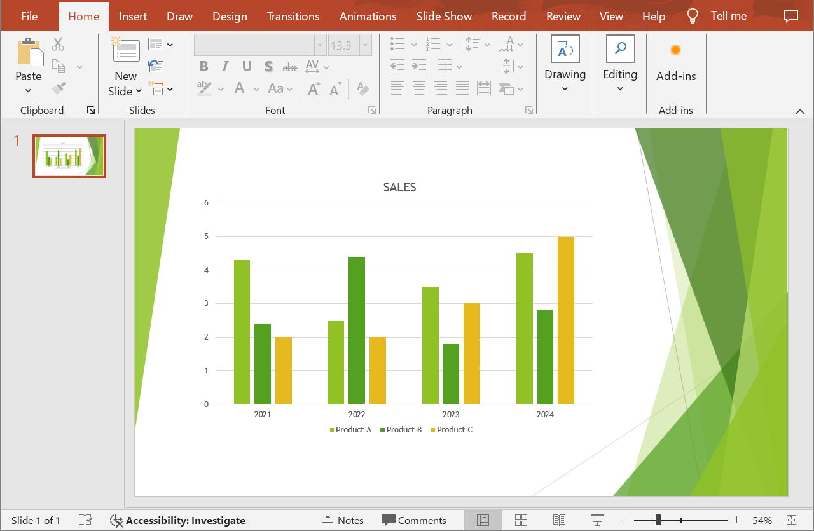

## **Áttekintés**

Ez a cikk megoldást nyújt a fejlesztők számára a PowerPoint‑ és OpenDocument‑prezentációk Word dokumentummá konvertálására az Aspose.Slides for .NET és az Aspose.Words for .NET segítségével. A lépésről‑lépésre útmutató végigvezeti a konvertálási folyamat minden szakaszán.

## **Prezentáció átalakítása Word dokumentummá**

Kövesse az alábbi utasításokat a PowerPoint vagy OpenDocument prezentáció Word dokumentummá konvertálásához:

1. Hozza létre a [Presentation](https://reference.aspose.com/slides/hu/net/aspose.slides/presentation/) osztályt, és töltse be a prezentáció fájlt.
2. Hozza létre a [Document](https://reference.aspose.com/words/net/aspose.words/document/) és a [DocumentBuilder](https://reference.aspose.com/words/net/aspose.words/documentbuilder/) osztályokat a Word dokumentum előállításához.
3. Állítsa be a Word dokumentum oldalméretét a prezentáció méretéhez a [DocumentBuilder.PageSetup](https://reference.aspose.com/words/net/aspose.words/documentbuilder/pagesetup/) tulajdonság segítségével.
4. Állítsa be a margókat a Word dokumentumban a [DocumentBuilder.PageSetup](https://reference.aspose.com/words/net/aspose.words/documentbuilder/pagesetup/) tulajdonság segítségével.
5. Járja be a prezentáció összes diáját a [Presentation.Slides](https://reference.aspose.com/slides/hu/net/aspose.slides/presentation/slides/hu/) tulajdonság segítségével.
    - Generáljon diaképet a [ISlide](https://reference.aspose.com/slides/hu/net/aspose.slides/islide/) interfész `GetImage` metódusával, és mentse memóriastream‑be.
    - Adja hozzá a diaképet a Word dokumentumhoz a [DocumentBuilder](https://reference.aspose.com/words/net/aspose.words/documentbuilder/) osztály `InsertImage` metódusával.
6. Mentse a Word dokumentumot fájlba.

Tegyük fel, hogy van egy **sample.pptx** prezentációnk, amely így néz ki:



Az alábbi C# kódrészlet bemutatja, hogyan lehet a PowerPoint prezentációt Word dokumentummá konvertálni:

```cs
using Aspose.Slides;
using Aspose.Words;

// Töltsön be egy prezentáció fájlt.
using var presentation = new Presentation("sample.pptx");

// Hozzon létre Document és DocumentBuilder objektumokat.
var document = new Document();
var builder = new DocumentBuilder(document);

// Állítsa be az oldal méretét a Word dokumentumban.
var slideSize = presentation.SlideSize.Size;
builder.PageSetup.PageWidth = slideSize.Width;
builder.PageSetup.PageHeight = slideSize.Height;

// Állítsa be a margókat a Word dokumentumban.
builder.PageSetup.LeftMargin = 0;
builder.PageSetup.RightMargin = 0;
builder.PageSetup.TopMargin = 0;
builder.PageSetup.BottomMargin = 0;

const float scaleX = 2, scaleY = 2;

// Járja be a prezentáció összes diáját.
foreach (var slide in presentation.Slides)
{
    // Generáljon diaképet és mentse memóriastream-be.
    using var image = slide.GetImage(scaleX, scaleY);
    using var imageStream = new MemoryStream();
    image.Save(imageStream, ImageFormat.Png);

    // Adja hozzá a diaképet a Word dokumentumhoz.
    imageStream.Seek(0, SeekOrigin.Begin);
    builder.InsertImage(imageStream.ToArray(), builder.PageSetup.PageWidth, builder.PageSetup.PageHeight);

    builder.InsertBreak(BreakType.PageBreak);
}

// Mentse a Word dokumentumot fájlba.
document.Save("output.docx");
```

Az eredmény:


{} 
Próbálja ki az [**Online PPT‑Word konvertert**](https://products.aspose.app/slides/hu/conversion/ppt-to-word), hogy megtudja, milyen előnyökre tehet szert a PowerPoint és OpenDocument prezentációk Word dokumentummá konvertálásával. 
{}

## **GYIK**

### Milyen komponenseket kell telepíteni a PowerPoint és OpenDocument prezentációk Word dokumentummá konvertálásához?

Csak hozzá kell adnia a megfelelő NuGet csomagokat a [Aspose.Slides for .NET](https://www.nuget.org/packages/Aspose.Slides.NET) és a [Aspose.Words for .NET](https://www.nuget.org/packages/Aspose.Words/) könyvtárakhoz a C# projektjéhez. Mindkét könyvtár önálló API‑ként működik, és nincs szükség a Microsoft Office telepítésére.

### Támogatott minden PowerPoint és OpenDocument prezentációformátum?

Aspose.Slides for .NET [supports all presentation formats](/slides/hu/net/supported-file-formats/), beleértve a PPT, PPTX, ODP és egyéb gyakori fájltípusokat. Ez biztosítja, hogy különböző verziókban létrehozott Microsoft PowerPoint prezentációkkal is dolgozhasson.