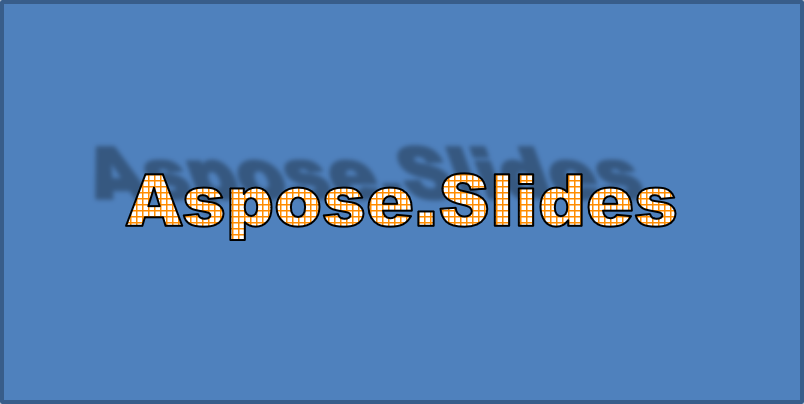

## **Áttekintés**

A WordArt effektusok lehetővé teszik, hogy látványos, stilizált szöveget adjunk a PowerPoint‑prezentációkhoz. Az Aspose.Slides for .NET segítségével a fejlesztők programozott módon hozhatnak létre, testreszabhatnak és kezelhetnek WordArt‑ot, akárcsak a Microsoft PowerPoint‑ban — Office telepítése nélkül. Ez a cikk áttekintést nyújt a WordArt .NET‑beli használatáról, többek között arról, hogyan alkalmazhatók szövegtranszformációk, kitöltési stílusok, körvonalak, árnyékok és egyéb formázási lehetőségek, hogy a prezentáció tartalma kifejezőbb és figyelemfelkeltőbb legyen. A WordArt lehetővé teszi, hogy a szöveget grafikus objektumként kezeljük. Olyan hatásokat vagy speciális módosításokat jelent, amelyekkel a szöveget vonzóbbá vagy feltűnőbbé tehetjük.

## **Egyszerű WordArt sablon létrehozása és alkalmazása szövegre**

Ebben a szakaszban megvizsgáljuk, hogyan hozhatunk létre egy egyszerű WordArt sablont, és alkalmazhatjuk azt szövegre az Aspose.Slides for .NET használatával. A WordArt egyszerű módot kínál a szöveg megjelenésének javítására lenyűgöző vizuális hatásokkal és stílusokkal. A WordArt létrehozásának és használatának alapvető lépéseinek elsajátításával ezeket a technikákat könnyedén alkalmazhatja bármely projektnél, élénkebbé és emlékezetesebbé téve a prezentációkat.

Először egyszerű szöveget hozunk létre a következő C# kóddal:

```cs
using (Presentation presentation = new Presentation())
{
    ISlide slide = presentation.Slides[0];

    IAutoShape autoShape = slide.Shapes.AddAutoShape(ShapeType.Rectangle, 20, 20, 400, 200);
    ITextFrame textFrame = autoShape.TextFrame;

    IPortion portion = textFrame.Paragraphs[0].Portions[0];
    portion.Text = "Aspose.Slides";
}
```

Ezután a szöveg betűméretét nagyobb értékre állítjuk, hogy a hatás jobban látható legyen, a következő kóddal:

```cs
    portion.PortionFormat.LatinFont = new FontData("Arial Black");
    portion.PortionFormat.FontHeight = 36;
```

Itt a SmallGrid minta kitöltést alkalmazzuk a szövegre, és egy 1‑es vastagságú fekete szövegkeretet adunk hozzá a következő kóddal:

```cs
    portion.PortionFormat.FillFormat.FillType = FillType.Pattern;
    portion.PortionFormat.FillFormat.PatternFormat.ForeColor.Color = Color.DarkOrange;
    portion.PortionFormat.FillFormat.PatternFormat.BackColor.Color = Color.White;
    portion.PortionFormat.FillFormat.PatternFormat.PatternStyle = PatternStyle.SmallGrid;
                
    portion.PortionFormat.LineFormat.FillFormat.FillType = FillType.Solid;
    portion.PortionFormat.LineFormat.FillFormat.SolidFillColor.Color = Color.Black;
```

Az eredményül kapott szöveg:


## **Egyéb WordArt effektusok alkalmazása**

A basic transzformációkon túl az Aspose.Slides for .NET lehetővé teszi, hogy különféle fejlett WordArt effektusokkal gazdagítsa a szöveg megjelenését. Ide tartoznak a körvonalak, kitöltések, árnyékok, tükröződések és ragyogás. Ezeket a funkciókat kombinálva olyan figyelemfelkeltő szövegstílusokat hozhat létre, amelyek kiemelkednek a prezentációkban. Ez a rész bemutatja, hogyan alkalmazhatók ezek az effektusok programozottan egyszerű, tiszta kódpéldákkal.

### **Külső árnyék effektusok alkalmazása**

A külső árnyék effektusok segítenek a szöveget kiemelni, azáltal, hogy az outline mögé árnyékot tesznek, mélységérzetet és háttértől való elválasztást teremtve. Az Aspose.Slides for .NET egyszerűen lehetővé teszi a külső árnyékok alkalmazását és testreszabását WordArt szövegen. Ebben a szakaszban megtanulja, hogyan állíthatja be az árnyék színét, irányát, távolságát, elmosódási sugarát és egyebeket a kívánt vizuális hatás eléréséhez.

A következő C# kódrészlet alkalmaz egy árnyék effektust a fent létrehozott szövegre.

```cs
    portion.PortionFormat.EffectFormat.EnableOuterShadowEffect();
    portion.PortionFormat.EffectFormat.OuterShadowEffect.ShadowColor.Color = Color.Black;
    portion.PortionFormat.EffectFormat.OuterShadowEffect.ScaleHorizontal = 100;
    portion.PortionFormat.EffectFormat.OuterShadowEffect.ScaleVertical = 100;
    portion.PortionFormat.EffectFormat.OuterShadowEffect.BlurRadius = 4;
    portion.PortionFormat.EffectFormat.OuterShadowEffect.Direction = 230;
    portion.PortionFormat.EffectFormat.OuterShadowEffect.Distance = 30;
    portion.PortionFormat.EffectFormat.OuterShadowEffect.SkewHorizontal = 20;
    portion.PortionFormat.EffectFormat.OuterShadowEffect.SkewVertical = 0;
    portion.PortionFormat.EffectFormat.OuterShadowEffect.ShadowColor.ColorTransform.Add(ColorTransformOperation.SetAlpha, 0.32f);
```

Az eredményül kapott szöveg:



{} 

- Amikor az OuterShadow és a PresetShadow együtt van használva, csak az OuterShadow effektus kerül alkalmazásra.
- Ha az OuterShadow és az InnerShadow egyszerre van alkalmazva, a hatás a PowerPoint verziójától függ. Például PowerPoint 2013‑ban a hatás duplázódik, míg PowerPoint 2007‑ben csak az OuterShadow effektus jelenik meg.

{}

### **Tükröződés effektusok alkalmazása**

Ebben a szakaszban megvizsgáljuk, hogyan alkalmazhatók tükröződés effektusok a diákban az Aspose.Slides for .NET használatával. A tükröződés effektusok hatékony módot nyújtanak arra, hogy szövegnek vagy alakzatoknak modern, stílusos megjelenést adjanak, kiemelve a kulcselemeket és mélységet kölcsönözve a prezentációnak. A hatások alkalmazásának és testreszabásának folyamatának megértésével könnyen a tervezési igényekhez és a márkaazonosításhoz igazíthatja őket.

Adjunk tükröződés effektust a szöveghez a következő C# példakóddal:

```cs
    portion.PortionFormat.EffectFormat.EnableReflectionEffect();
    portion.PortionFormat.EffectFormat.ReflectionEffect.BlurRadius = 0.5; 
    portion.PortionFormat.EffectFormat.ReflectionEffect.Distance = 4.72; 
    portion.PortionFormat.EffectFormat.ReflectionEffect.StartPosAlpha = 0f; 
    portion.PortionFormat.EffectFormat.ReflectionEffect.EndPosAlpha = 60f; 
    portion.PortionFormat.EffectFormat.ReflectionEffect.Direction = 90; 
    portion.PortionFormat.EffectFormat.ReflectionEffect.ScaleHorizontal = 100; 
    portion.PortionFormat.EffectFormat.ReflectionEffect.ScaleVertical = -100;
    portion.PortionFormat.EffectFormat.ReflectionEffect.StartReflectionOpacity = 60f;
    portion.PortionFormat.EffectFormat.ReflectionEffect.EndReflectionOpacity = 0.9f;
    portion.PortionFormat.EffectFormat.ReflectionEffect.RectangleAlign = RectangleAlignment.BottomLeft;   
```

Az eredményül kapott szöveg:


### **Ragyogás effektusok alkalmazása**

Ebben a szakaszban megvizsgáljuk, hogyan alkalmazhatunk ragyogás effektust a szövegre az Aspose.Slides for .NET segítségével. A ragyogás effektus egy fénylő körvonalat ad a szövegnek, növelve a dia vizuális vonzerejét. A szín és intenzitás beállításával könnyedén testre szabhatja a ragyogást a tervezési és márkaigényeknek megfelelően, biztosítva, hogy a prezentáció kulcspontjai felkeltsék a közönség figyelmét.

Alkalmazzon ragyogás effektust a szövegre, hogy ragyogjon vagy kitűnjön, a következő kóddal:

```cs
    portion.PortionFormat.EffectFormat.EnableGlowEffect();
    portion.PortionFormat.EffectFormat.GlowEffect.Color.R = 255;
    portion.PortionFormat.EffectFormat.GlowEffect.Color.ColorTransform.Add(ColorTransformOperation.SetAlpha, 0.54f);
    portion.PortionFormat.EffectFormat.GlowEffect.Radius = 7;
```

Az eredményül kapott szöveg:


### **WordArt transzformációk alkalmazása**

Ebben a szakaszban megvizsgáljuk, hogyan használhatók a transzformációk a WordArt‑ban az Aspose.Slides for .NET‑el. A transzformációk lehetővé teszik a szöveg meghajlítását, nyújtását vagy torzítását, egyedi és vizuálisan lenyűgöző hatásokat teremtve. Ennek a technikának a elsajátításával könnyedén alakíthatja a szöveg formáit és stílusait a márkájának vagy kreatív elképzelésének megfelelően, így professzionális és hatásos prezentációt biztosítva.

Használja a `Transform` tulajdonságot (amely az egész szövegrészt érinti) a következő kóddal:

```cs
    textFrame.TextFrameFormat.Transform = TextShapeType.ArchUpPour;
```

Az eredményül kapott szöveg:


{} 

Az Aspose.Slides for .NET egy előre definiált [transzformáció típusok](https://reference.aspose.com/slides/hu/net/aspose.slides/textshapetype/) halmazát biztosítja.

{} 

### **3D effektusok alkalmazása alakzatokra és szövegre**

Realista, figyelemfelkeltő vizuálok létrehozása jelentősen növelheti a prezentációk hatását. Ebben a szakaszban bemutatjuk, hogyan alkalmazhat háromdimenziós (3D) effektusokat alakzatokra az Aspose.Slides for .NET‑el. A mélység, szög és fényviszonyok paramétereinek manipulálásával lenyűgöző 3D transzformációkat hozhat létre, amelyek azonnal megragadják a közönség figyelmét. Legyen szó finom kiemelésekről vagy drámai illúziókról, ezek a funkciók rugalmas módot kínálnak a tervezés fokozására és az ötletek hatásos közvetítésére.

A következő példakóddal állítsa be a 3D effektust az alakzatra:

```cs
    autoShape.ThreeDFormat.BevelBottom.BevelType = BevelPresetType.Circle;
    autoShape.ThreeDFormat.BevelBottom.Height = 10.5;
    autoShape.ThreeDFormat.BevelBottom.Width = 10.5;

    autoShape.ThreeDFormat.BevelTop.BevelType = BevelPresetType.Circle;
    autoShape.ThreeDFormat.BevelTop.Height = 12.5;
    autoShape.ThreeDFormat.BevelTop.Width = 11;

    autoShape.ThreeDFormat.ExtrusionColor.Color = Color.Orange;
    autoShape.ThreeDFormat.ExtrusionHeight = 6;

    autoShape.ThreeDFormat.ContourColor.Color = Color.DarkRed;
    autoShape.ThreeDFormat.ContourWidth = 1.5;

    autoShape.ThreeDFormat.Depth = 3;

    autoShape.ThreeDFormat.Material = MaterialPresetType.Plastic;

    autoShape.ThreeDFormat.LightRig.Direction = LightingDirection.Top;
    autoShape.ThreeDFormat.LightRig.LightType = LightRigPresetType.Balanced;
    autoShape.ThreeDFormat.LightRig.SetRotation(0, 0, 40);

    autoShape.ThreeDFormat.Camera.CameraType = CameraPresetType.PerspectiveContrastingRightFacing;
```

Az eredményül kapott alakzat:


A következő példakóddal állítsa be a 3D effektust a szövegre:

```cs
    textFrame.TextFrameFormat.ThreeDFormat.BevelBottom.BevelType = BevelPresetType.Circle;
    textFrame.TextFrameFormat.ThreeDFormat.BevelBottom.Height = 3.5;
    textFrame.TextFrameFormat.ThreeDFormat.BevelBottom.Width = 3.5;

    textFrame.TextFrameFormat.ThreeDFormat.BevelTop.BevelType = BevelPresetType.Circle;
    textFrame.TextFrameFormat.ThreeDFormat.BevelTop.Height = 4;
    textFrame.TextFrameFormat.ThreeDFormat.BevelTop.Width = 4;

    textFrame.TextFrameFormat.ThreeDFormat.ExtrusionColor.Color = Color.Orange;
    textFrame.TextFrameFormat.ThreeDFormat.ExtrusionHeight= 6;

    textFrame.TextFrameFormat.ThreeDFormat.ContourColor.Color = Color.DarkRed;
    textFrame.TextFrameFormat.ThreeDFormat.ContourWidth = 1.5;

    textFrame.TextFrameFormat.ThreeDFormat.Depth= 3;

    textFrame.TextFrameFormat.ThreeDFormat.Material = MaterialPresetType.Plastic;

    textFrame.TextFrameFormat.ThreeDFormat.LightRig.Direction = LightingDirection.Top;
    textFrame.TextFrameFormat.ThreeDFormat.LightRig.LightType = LightRigPresetType.Balanced;
    textFrame.TextFrameFormat.ThreeDFormat.LightRig.SetRotation(0, 0, 40);

    textFrame.TextFrameFormat.ThreeDFormat.Camera.CameraType = CameraPresetType.PerspectiveContrastingRightFacing;
```

Az eredményül kapott szöveg:


{} 

A 3D effektusok alkalmazása a szövegre vagy azok alakzataira — és az effektek közötti kölcsönhatás — speciális szabályok szerint történik. Tekintse meg a következő példát, amely egy szöveget és a szöveget tartalmazó alakzatot is érinti. A 3D effektus magában foglalja az objektum 3D reprezentációját és a rá helyezett jelenetet.

- Ha egy jelenet mind a alakzatra, mind a szövegre be van állítva, az alakzat jelenete kap elsőbbséget, a szöveg jelenete pedig figyelmen kívül marad.
- Ha az alakzatnak nincs saját jelenete, de van 3D reprezentációja, a szöveg jelenete kerül felhasználásra.
- Ha az alakzatnak egyáltalán nincs 3D effektusa, akkor laposként kezelik, és a 3D effektus csak a szövegre kerül alkalmazásra.

Ezek a viselkedések a [ThreeDFormat.LightRig](https://reference.aspose.com/slides/hu/net/aspose.slides/threedformat/lightrig/) és a [ThreeDFormat.Camera](https://reference.aspose.com/slides/hu/net/aspose.slides/threedformat/camera/) tulajdonságokra vonatkoznak.

{} 

## **GYIK**

**Használhatok WordArt effektusokat különböző betűtípusokkal vagy írásrendszerekkel (például arab, kínai)?**

Igen, az Aspose.Slides for .NET támogatja az Unicode‑ot, és működik minden főbb betűtípussal és írásrendszerrel. A WordArt effektusok, például az árnyék, kitöltés és körvonal, nyelvtől függetlenül alkalmazhatók, bár a betűtípus rendelkezésre állása és megjelenítése a rendszer betűtípusaival függhet.

**Alkalmazhatok WordArt effektusokat a diamester elemekre?**

Igen, WordArt effektusokat alkalmazhat a mesterdiák alakzataira, beleértve a címhelyőrzőket, lábléceket vagy háttérszöveget. A mesterelrendezésben végzett módosítások minden kapcsolódó diára kihatnak.

**A WordArt effektusok befolyásolják a prezentáció fájlméretét?**

Kissé igen. Az olyan WordArt effektusok, mint az árnyékok, ragyogás és színátmenetes kitöltések, enyhén növelhetik a fájlméretet a hozzáadott formázási metaadatok miatt, de a különbség általában elhanyagolható.

**Megtekinthetem a WordArt effektusok eredményét a prezentáció mentése nélkül?**

Igen, a WordArt‑ot tartalmazó diák képek (például PNG, JPEG) formájában renderelhetők a `GetImage` metódussal a [IShape](https://reference.aspose.com/slides/hu/net/aspose.slides/ishape/) vagy [ISlide](https://reference.aspose.com/slides/hu/net/aspose.slides/islide/) interfészekről. Ez lehetővé teszi az eredmény előnézetét memóriában vagy képernyőn a teljes prezentáció mentése vagy exportálása előtt.