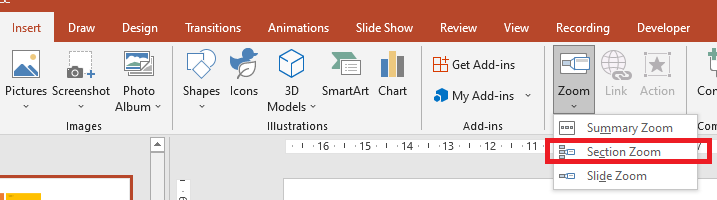

## **Bevezetés**

A Zoomok a PowerPointben lehetővé teszik, hogy egyes diák, szakaszok és a bemutató egyes részei között ugorj előre és vissza. Bemutatás közben ez a gyors navigálási képesség nagyon hasznos lehet. 


* Egy teljes bemutató összegzéséhez egyetlen dián használj egy [Summary Zoom](#Summary-Zoom) elemet.
* Kiválasztott diák megjelenítéséhez használj egy [Slide Zoom](#Slide-Zoom) elemet.
* Egyetlen szakasz megjelenítéséhez használj egy [Section Zoom](#Section-Zoom) elemet.

## **Slide Zoom**
A slide zoom dinamikusabbá teheti a bemutatót, lehetővé téve, hogy tetszőleges sorrendben szabadon navigálj a diák között anélkül, hogy megszakítanád a bemutató folyamatát. A slide zoomok kiválóak rövid, kevés szakaszt tartalmazó bemutatókhoz, de különböző bemutatási forgatókönyvekben is használhatók.

A slide zoomok segítségével több információs darabot is felfedezhetsz, miközben úgy érzed, mintha egyetlen vásznon dolgoznál. 


A slide zoom objektumokhoz az Aspose.Slides a [ZoomImageType](https://reference.aspose.com/slides/hu/net/aspose.slides/zoomimagetype) felsorolást, az [IZoomFrame](https://reference.aspose.com/slides/hu/net/aspose.slides/izoomframe) interfészt és néhány metódust a [IShapeCollection](https://reference.aspose.com/slides/hu/net/aspose.slides/ishapecollection) interfész alatt biztosítja.

### **Zoomkeretek létrehozása**

Zoomkeretet egy diára a következőképpen adhatunk hozzá:

1.	Hozz létre egy példányt a [Presentation](https://reference.aspose.com/slides/hu/net/aspose.slides/presentation) osztályból.
2.	Hozz létre új diákat, amelyeket a zoomkeretekhez szeretnél összekapcsolni. 
3.	Adj az elkészített diákhoz azonosító szöveget és hátteret.
4.	Adj zoomkereteket (a létrehozott diákra mutató hivatkozásokkal) az első diához.
5.	Mentsd a módosított bemutatót PPTX fájlként.

Ez a C# kód megmutatja, hogyan hozhatsz létre egy zoomkeretet egy dián:

``` csharp 
using (Presentation pres = new Presentation())
{
    // Új diák hozzáadása a prezentációhoz
    ISlide slide2 = pres.Slides.AddEmptySlide(pres.Slides[0].LayoutSlide);
    ISlide slide3 = pres.Slides.AddEmptySlide(pres.Slides[0].LayoutSlide);

    // Háttér létrehozása a második dia számára
    slide2.Background.Type = BackgroundType.OwnBackground;
    slide2.Background.FillFormat.FillType = FillType.Solid;
    slide2.Background.FillFormat.SolidFillColor.Color = Color.Cyan;

    // Szövegdoboz létrehozása a második dia számára
    IAutoShape autoshape = slide2.Shapes.AddAutoShape(ShapeType.Rectangle, 100, 200, 500, 200);
    autoshape.TextFrame.Text = "Second Slide";

    // Háttér létrehozása a harmadik dia számára
    slide3.Background.Type = BackgroundType.OwnBackground;
    slide3.Background.FillFormat.FillType = FillType.Solid;
    slide3.Background.FillFormat.SolidFillColor.Color = Color.DarkKhaki;

    // Szövegdoboz létrehozása a harmadik dia számára
    autoshape = slide3.Shapes.AddAutoShape(ShapeType.Rectangle, 100, 200, 500, 200);
    autoshape.TextFrame.Text = "Trird Slide";

    // ZoomFrame objektumok hozzáadása
    pres.Slides[0].Shapes.AddZoomFrame(20, 20, 250, 200, slide2);
    pres.Slides[0].Shapes.AddZoomFrame(200, 250, 250, 200, slide3);

    // A prezentáció mentése
    pres.Save("presentation.pptx", SaveFormat.Pptx);
}
```
### **Zoomkeretek létrehozása egyéni képekkel**
Az Aspose.Slides for .NET segítségével egy másik dia előnézeti képpel ellátott zoomkeretet a következőképpen hozhatsz létre: 
1.	Hozz létre egy példányt a [Presentation](https://reference.aspose.com/slides/hu/net/aspose.slides/presentation) osztályból.
2.	Hozz létre egy új diát, amelyhez a zoomkeretet szeretnéd kapcsolni. 
3.	Adj azonosító szöveget és hátteret a diára.
4.	Hozz létre egy [IPPImage](https://reference.aspose.com/slides/hu/net/aspose.slides/ippimage) objektumot úgy, hogy egy képet adsz az a [Presentation](https://reference.aspose.com/slides/hu/net/aspose.slides/presentation) objektumhoz tartozó Images gyűjteményhez, amely a keretet fogja kitölteni.
5.	Adj zoomkereteket (a létrehozott diára mutató hivatkozással) az első diához.
6.	Mentsd a módosított bemutatót PPTX fájlként.

Ez a C# kód megmutatja, hogyan hozhatsz létre egy zoomkeretet egy különböző képpel:

``` csharp 
using (Presentation pres = new Presentation())
{
    // Új dia hozzáadása a prezentációhoz
    ISlide slide = pres.Slides.AddEmptySlide(pres.Slides[0].LayoutSlide);

    // Háttér létrehozása a második dia számára
    slide.Background.Type = BackgroundType.OwnBackground;
    slide.Background.FillFormat.FillType = FillType.Solid;
    slide.Background.FillFormat.SolidFillColor.Color = Color.Cyan;

    // Szövegdoboz létrehozása a harmadik dia számára
    IAutoShape autoshape = slide.Shapes.AddAutoShape(ShapeType.Rectangle, 100, 200, 500, 200);
    autoshape.TextFrame.Text = "Second Slide";

    // Új kép létrehozása a zoom objektumhoz
    IImage image = Images.FromFile("image.png");
    IPPImage ppImage = pres.Images.AddImage(image);
    image.Dispose();

    // ZoomFrame objektum hozzáadása
    pres.Slides[0].Shapes.AddZoomFrame(20, 20, 300, 200, slide, ppImage);

    // A prezentáció mentése
    pres.Save("presentation.pptx", SaveFormat.Pptx);
}
```
### **Zoomkeretek formázása**
Az előző szakaszokban egyszerű zoomkeretek létrehozását mutattuk be. Összetettebb zoomkeretek létrehozásához módosítanod kell egy egyszerű keret formázását. Számos formázási lehetőség áll rendelkezésre egy zoomkerethez. 

Zoomkeret formázását egy dián a következőképpen vezérelheted:

1.	Hozz létre egy példányt a [Presentation](https://reference.aspose.com/slides/hu/net/aspose.slides/presentation) osztályból.
2.	Hozz létre új diákat, amelyeket a zoomkerethez szeretnél összekapcsolni. 
3.	Adj némi azonosító szöveget és hátteret a létrehozott diákhoz.
4.	Adj zoomkereteket (a létrehozott diákra mutató hivatkozásokkal) az első diához.
5.	Hozz létre egy [IPPImage](https://reference.aspose.com/slides/hu/net/aspose.slides/ippimage) objektumot úgy, hogy egy képet adsz az a [Presentation](https://reference.aspose.com/slides/hu/net/aspose.slides/presentation) objektumhoz tartozó Images gyűjteményhez, amely a keretet fogja kitölteni.
6.	Állíts be egy egyéni képet az első zoomkeret objektumhoz.
7.	Módosítsd a második zoomkeret objektum vonalformátumát.
8.	Távolítsd el a háttérképet a második zoomkeret objektum képéből.
5.	Mentsd a módosított bemutatót PPTX fájlként.

Ez a C# kód megmutatja, hogyan változtathatod meg egy zoomkeret formázását egy dián: 

``` csharp 
using (Presentation pres = new Presentation())
{
    //Új diák hozzáadása a prezentációhoz
    ISlide slide2 = pres.Slides.AddEmptySlide(pres.Slides[0].LayoutSlide);
    ISlide slide3 = pres.Slides.AddEmptySlide(pres.Slides[0].LayoutSlide);

    // Háttér létrehozása a második dia számára
    slide2.Background.Type = BackgroundType.OwnBackground;
    slide2.Background.FillFormat.FillType = FillType.Solid;
    slide2.Background.FillFormat.SolidFillColor.Color = Color.Cyan;

    // Szövegdoboz létrehozása a második dia számára
    IAutoShape autoshape = slide2.Shapes.AddAutoShape(ShapeType.Rectangle, 100, 200, 500, 200);
    autoshape.TextFrame.Text = "Second Slide";

    // Háttér létrehozása a harmadik dia számára
    slide3.Background.Type = BackgroundType.OwnBackground;
    slide3.Background.FillFormat.FillType = FillType.Solid;
    slide3.Background.FillFormat.SolidFillColor.Color = Color.DarkKhaki;

    // Szövegdoboz létrehozása a harmadik dia számára
    autoshape = slide3.Shapes.AddAutoShape(ShapeType.Rectangle, 100, 200, 500, 200);
    autoshape.TextFrame.Text = "Trird Slide";

    //Adds ZoomFrame objects
    IZoomFrame zoomFrame1 = pres.Slides[0].Shapes.AddZoomFrame(20, 20, 250, 200, slide2);
    IZoomFrame zoomFrame2 = pres.Slides[0].Shapes.AddZoomFrame(200, 250, 250, 200, slide3);

    // Új kép létrehozása a zoom objektumhoz
    IImage image = Images.FromFile("image.png");
    IPPImage ppImage = pres.Images.AddImage(image);
    image.Dispose();

    // Egyéni kép beállítása a zoomFrame1 objektumhoz
    zoomFrame1.ZoomImage = ppImage;

    // Zoomkeret formátum beállítása a zoomFrame2 objektumhoz
    zoomFrame2.LineFormat.Width = 5;
    zoomFrame2.LineFormat.FillFormat.FillType = FillType.Solid;
    zoomFrame2.LineFormat.FillFormat.SolidFillColor.Color = Color.HotPink;
    zoomFrame2.LineFormat.DashStyle = LineDashStyle.DashDot;

    // Beállítás a háttér nem megjelenítésére a zoomFrame2 objektumnál
    zoomFrame2.ShowBackground = false;

    // A prezentáció mentése
    pres.Save("presentation.pptx", SaveFormat.Pptx);
}
```

## **Section Zoom**

A section zoom egy hivatkozás a bemutató egy szakaszára. A section zoomokkal visszatérhetsz azokba a szakaszokba, amelyeket különösen ki szeretnél emelni. Vagy arra használhatod őket, hogy bemutasd, hogyan kapcsolódnak a bemutató egyes részei egymáshoz. 



A section zoom objektumokhoz az Aspose.Slides az [ISectionZoomFrame](https://reference.aspose.com/slides/hu/net/aspose.slides/isectionzoomframe) interfészt és néhány metódust a [IShapeCollection](https://reference.aspose.com/slides/hu/net/aspose.slides/ishapecollection) interfész alatt biztosítja.

### **Section Zoom keretek létrehozása**

Egy section zoom keretet egy diára a következőképpen adhatunk hozzá:

1.	Hozz létre egy példányt a [Presentation](https://reference.aspose.com/slides/hu/net/aspose.slides/presentation) osztályból.
2.	Hozz létre egy új diát. 
3.	Adj azonosító háttért a létrehozott diához.
4.	Hozz létre egy új szakaszt, amelyhez a zoomkeretet szeretnéd kapcsolni. 
5.	Adj egy section zoom keretet (a létrehozott szakaszra mutató hivatkozásokkal) az első diához.
6.	Mentsd a módosított bemutatót PPTX fájlként.

Ez a C# kód megmutatja, hogyan hozhatsz létre egy zoomkeretet egy dián:

``` csharp 
using (Presentation pres = new Presentation())
{
    //Új dia hozzáadása a prezentációhoz
    ISlide slide = pres.Slides.AddEmptySlide(pres.Slides[0].LayoutSlide);
    slide.Background.FillFormat.FillType = FillType.Solid;
    slide.Background.FillFormat.SolidFillColor.Color = Color.YellowGreen;
    slide.Background.Type = BackgroundType.OwnBackground;

    // Új szakasz hozzáadása a prezentációhoz
    pres.Sections.AddSection("Section 1", slide);

    // SectionZoomFrame objektum hozzáadása
    ISectionZoomFrame sectionZoomFrame = pres.Slides[0].Shapes.AddSectionZoomFrame(20, 20, 300, 200, pres.Sections[1]);

    // A prezentáció mentése
    pres.Save("presentation.pptx", SaveFormat.Pptx);
}
```
### **Section Zoom keretek létrehozása egyéni képekkel**

Az Aspose.Slides for .NET segítségével egy másik dia előnézeti képpel ellátott section zoom keretet a következőképpen hozhatsz létre: 

1.	Hozz létre egy példányt a [Presentation](https://reference.aspose.com/slides/hu/net/aspose.slides/presentation) osztályból.
2.	Hozz létre egy új diát.
3.	Adj azonosító háttért a létrehozott diához.
4.	Hozz létre egy új szakaszt, amelyhez a zoomkeretet szeretnéd kapcsolni. 
5.	Hozz létre egy [IPPImage](https://reference.aspose.com/slides/hu/net/aspose.slides/ippimage) objektumot úgy, hogy egy képet adsz az a [Presentation](https://reference.aspose.com/slides/hu/net/aspose.slides/presentation) objektumhoz tartozó Images gyűjteményhez, amely a keretet fogja kitölteni.
5.	Adj egy section zoom keretet (a létrehozott szakaszra mutató hivatkozással) az első diához.
6.	Mentsd a módosított bemutatót PPTX fájlként.

Ez a C# kód megmutatja, hogyan hozhatsz létre egy zoomkeretet egy másik képpel:

``` csharp 
using (Presentation pres = new Presentation())
{
    //Új dia hozzáadása a prezentációhoz
    ISlide slide = pres.Slides.AddEmptySlide(pres.Slides[0].LayoutSlide);
    slide.Background.FillFormat.FillType = FillType.Solid;
    slide.Background.FillFormat.SolidFillColor.Color = Color.YellowGreen;
    slide.Background.Type = BackgroundType.OwnBackground;

    // Új szakasz hozzáadása a prezentációhoz
    pres.Sections.AddSection("Section 1", slide);

    // Új kép létrehozása a zoom objektumhoz
    IImage image = Images.FromFile("image.png");
    IPPImage ppImage = pres.Images.AddImage(image);
    image.Dispose();

    // SectionZoomFrame objektum hozzáadása
    ISectionZoomFrame sectionZoomFrame = pres.Slides[0].Shapes.AddSectionZoomFrame(20, 20, 300, 200, pres.Sections[1], ppImage);

    // A prezentáció mentése
    pres.Save("presentation.pptx", SaveFormat.Pptx);
}
```
### **Section Zoom keretek formázása**

Összetettebb section zoom keretek létrehozásához módosítanod kell egy egyszerű keret formázását. Számos formázási lehetőség áll rendelkezésre egy section zoom kerethez. 

A section zoom keret formázását egy dián a következőképpen irányíthatod:

1.	Hozz létre egy példányt a [Presentation](https://reference.aspose.com/slides/hu/net/aspose.slides/presentation) osztályból.
2.	Hozz létre egy új diát.
3.	Adj azonosító háttért a létrehozott diához.
4.	Hozz létre egy új szakaszt, amelyhez a zoomkeretet szeretnéd kapcsolni. 
5.	Adj egy section zoom keretet (a létrehozott szakaszra mutató hivatkozásokkal) az első diához.
6.	Módosítsd a létrehozott section zoom objektum méretét és pozícióját.
7.	Hozz létre egy [IPPImage](https://reference.aspose.com/slides/hu/net/aspose.slides/ippimage) objektumot úgy, hogy egy képet adsz az a [Presentation](https://reference.aspose.com/slides/hu/net/aspose.slides/presentation) objektumhoz tartozó Images gyűjteményhez, amely a keretet fogja kitölteni.
8.	Állíts be egy egyéni képet a létrehozott section zoom keret objektumhoz.
9.	Állítsd be a *visszatérés az eredeti diára a kapcsolt szakaszból* funkciót. 
10.	Távolítsd el a háttérképet a section zoom keret objektum képéből.
11.	Módosítsd a második zoomkeret objektum vonalformátumát.
12.	Módosítsd a tranzíció időtartamát.
13.	Mentsd a módosított bemutatót PPTX fájlként.

Ez a C# kód megmutatja, hogyan változtathatod meg egy section zoom keret formázását:

``` csharp 
using (Presentation pres = new Presentation())
{
    //Új dia hozzáadása a prezentációhoz
    ISlide slide = pres.Slides.AddEmptySlide(pres.Slides[0].LayoutSlide);
    slide.Background.FillFormat.FillType = FillType.Solid;
    slide.Background.FillFormat.SolidFillColor.Color = Color.YellowGreen;
    slide.Background.Type = BackgroundType.OwnBackground;

    // Új szakasz hozzáadása a prezentációhoz
    pres.Sections.AddSection("Section 1", slide);

    // SectionZoomFrame objektum hozzáadása
    ISectionZoomFrame sectionZoomFrame = pres.Slides[0].Shapes.AddSectionZoomFrame(20, 20, 300, 200, pres.Sections[1]);

    // Formázás a SectionZoomFrame-hez
    sectionZoomFrame.X = 100;
    sectionZoomFrame.Y = 300;
    sectionZoomFrame.Width = 100;
    sectionZoomFrame.Height = 75;

    IImage image = Images.FromFile("image.png");
    IPPImage ppImage = pres.Images.AddImage(image);
    image.Dispose();

    sectionZoomFrame.ZoomImage = ppImage;

    sectionZoomFrame.ReturnToParent = true;
    sectionZoomFrame.ShowBackground = false;

    sectionZoomFrame.LineFormat.FillFormat.FillType = FillType.Solid;
    sectionZoomFrame.LineFormat.FillFormat.SolidFillColor.Color = Color.Brown;
    sectionZoomFrame.LineFormat.DashStyle = LineDashStyle.DashDot;
    sectionZoomFrame.LineFormat.Width = 2.5f;

    sectionZoomFrame.TransitionDuration = 1.5f;

    // A prezentáció mentése
    pres.Save("presentation.pptx", SaveFormat.Pptx);
}
```


## **Summary Zoom**

A summary zoom olyan, mint egy nyitóoldal, ahol a bemutató minden része egyszerre látható. Bemutatás közben a zoom segítségével bármilyen sorrendben ugorhatsz egyik helyről a másikra. Kreatívan használhatod: előre ugorhatsz, vagy visszatérhetsz a diavetítés egyes részeihez anélkül, hogy megszakítanád a bemutató folyamatát.


A summary zoom objektumokhoz az Aspose.Slides az [ISummaryZoomFrame](https://reference.aspose.com/slides/hu/net/aspose.slides/isummaryzoomframe), az [ISummaryZoomFrameSection](https://reference.aspose.com/slides/hu/net/aspose.slides/isummaryzoomsection) és az [ISummaryZoomSectionCollection](https://reference.aspose.com/slides/hu/net/aspose.slides/isummaryzoomsectioncollection) interfészeket, valamint néhány metódust a [IShapeCollection](https://reference.aspose.com/slides/hu/net/aspose.slides/ishapecollection) interfész alatt biztosítja.

### **Summary Zoom létrehozása**

Egy summary zoom keretet egy diára a következőképpen adhatunk hozzá:

1.	Hozz létre egy példányt a [Presentation](https://reference.aspose.com/slides/hu/net/aspose.slides/presentation) osztályból.
2.	Hozz létre új diákat azonosító háttérrel és új szakaszokkal a létrehozott diákhoz.
3.	Adj egy summary zoom keretet az első diához.
4.	Mentsd a módosított bemutatót PPTX fájlként.

Ez a C# kód megmutatja, hogyan hozhatsz létre egy summary zoom keretet egy dián:

``` csharp 
using (Presentation pres = new Presentation())
{
    //Új dia hozzáadása a prezentációhoz
    ISlide slide = pres.Slides.AddEmptySlide(pres.Slides[0].LayoutSlide);
    slide.Background.FillFormat.FillType = FillType.Solid;
    slide.Background.FillFormat.SolidFillColor.Color = Color.Brown;
    slide.Background.Type = BackgroundType.OwnBackground;

    // Új szakasz hozzáadása a prezentációhoz
    pres.Sections.AddSection("Section 1", slide);

    //Új dia hozzáadása a prezentációhoz
    slide = pres.Slides.AddEmptySlide(pres.Slides[0].LayoutSlide);
    slide.Background.FillFormat.FillType = FillType.Solid;
    slide.Background.FillFormat.SolidFillColor.Color = Color.Aqua;
    slide.Background.Type = BackgroundType.OwnBackground;

    // Új szakasz hozzáadása a prezentációhoz
    pres.Sections.AddSection("Section 2", slide);

    //Új dia hozzáadása a prezentációhoz
    slide = pres.Slides.AddEmptySlide(pres.Slides[0].LayoutSlide);
    slide.Background.FillFormat.FillType = FillType.Solid;
    slide.Background.FillFormat.SolidFillColor.Color = Color.Chartreuse;
    slide.Background.Type = BackgroundType.OwnBackground;

    // Új szakasz hozzáadása a prezentációhoz
    pres.Sections.AddSection("Section 3", slide);

    //Új dia hozzáadása a prezentációhoz
    slide = pres.Slides.AddEmptySlide(pres.Slides[0].LayoutSlide);
    slide.Background.FillFormat.FillType = FillType.Solid;
    slide.Background.FillFormat.SolidFillColor.Color = Color.DarkGreen;
    slide.Background.Type = BackgroundType.OwnBackground;

    // Új szakasz hozzáadása a prezentációhoz
    pres.Sections.AddSection("Section 4", slide);

    // Új SummaryZoomFrame objektum hozzáadása
    ISummaryZoomFrame summaryZoomFrame = pres.Slides[0].Shapes.AddSummaryZoomFrame(150, 50, 300, 200);

    // A prezentáció mentése
    pres.Save("presentation.pptx", SaveFormat.Pptx);
}
```

### **Summary Zoom szakaszok hozzáadása és eltávolítása**

A summary zoom keretben minden szakasz egy [ISummaryZoomFrameSection](https://reference.aspose.com/slides/hu/net/aspose.slides/isummaryzoomsection) objektummal van reprezentálva, amely az [ISummaryZoomSectionCollection](https://reference.aspose.com/slides/hu/net/aspose.slides/isummaryzoomsectioncollection) objektumban tárolódik. Egy summary zoom szakasz objektumot a [ISummaryZoomSectionCollection](https://reference.aspose.com/slides/hu/net/aspose.slides/isummaryzoomsectioncollection) interfészen keresztül a következőképpen adhatod hozzá vagy távolíthatod el:

1.	Hozz létre egy példányt a [Presentation](https://reference.aspose.com/slides/hu/net/aspose.slides/presentation) osztályból.
2.	Hozz létre új diákat azonosító háttérrel és új szakaszokkal a létrehozott diákhoz.
3.	Adj egy summary zoom keretet az első diához.
4.	Adj egy új diát és szakaszt a bemutatóhoz.
5.	Adj a létrehozott szakaszt a summary zoom kerethez.
6.	Távolítsd el az első szakaszt a summary zoom keretből.
7.	Mentsd a módosított bemutatót PPTX fájlként.

Ez a C# kód megmutatja, hogyan adhatunk hozzá és távolíthatunk el szakaszokat egy summary zoom keretben:

``` csharp 
using (Presentation pres = new Presentation())
{
    // Új dia hozzáadása a prezentációhoz
    ISlide slide = pres.Slides.AddEmptySlide(pres.Slides[0].LayoutSlide);
    slide.Background.FillFormat.FillType = FillType.Solid;
    slide.Background.FillFormat.SolidFillColor.Color = Color.Brown;
    slide.Background.Type = BackgroundType.OwnBackground;

    // Új szakasz hozzáadása a prezentációhoz
    pres.Sections.AddSection("Section 1", slide);

    // Új dia hozzáadása a prezentációhoz
    slide = pres.Slides.AddEmptySlide(pres.Slides[0].LayoutSlide);
    slide.Background.FillFormat.FillType = FillType.Solid;
    slide.Background.FillFormat.SolidFillColor.Color = Color.Aqua;
    slide.Background.Type = BackgroundType.OwnBackground;

    // Új szakasz hozzáadása a prezentációhoz
    pres.Sections.AddSection("Section 2", slide);

    // SummaryZoomFrame objektum hozzáadása
    ISummaryZoomFrame summaryZoomFrame = pres.Slides[0].Shapes.AddSummaryZoomFrame(150, 50, 300, 200);

    // Új dia hozzáadása a prezentációhoz
    slide = pres.Slides.AddEmptySlide(pres.Slides[0].LayoutSlide);
    slide.Background.FillFormat.FillType = FillType.Solid;
    slide.Background.FillFormat.SolidFillColor.Color = Color.Chartreuse;
    slide.Background.Type = BackgroundType.OwnBackground;

    // Új szakasz hozzáadása a prezentációhoz
    ISection section3 = pres.Sections.AddSection("Section 3", slide);

    // Szakaszt hozzáadása a Summary Zoom-hoz
    summaryZoomFrame.SummaryZoomCollection.AddSummaryZoomSection(section3);

    // Szakasz eltávolítása a Summary Zoom-ból
    summaryZoomFrame.SummaryZoomCollection.RemoveSummaryZoomSection(pres.Sections[1]);

    // A prezentáció mentése
    pres.Save("presentation.pptx", SaveFormat.Pptx);
}
```

### **Summary Zoom szakaszok formázása**

Összetettebb summary zoom szakasz objektumok létrehozásához módosítanod kell egy egyszerű keret formázását. Számos formázási lehetőség áll rendelkezésre egy summary zoom szakasz objektumhoz. 

A summary zoom szakasz objektum formázását egy summary zoom keretben a következőképpen irányíthatod:

1.	Hozz létre egy példányt a [Presentation](https://reference.aspose.com/slides/hu/net/aspose.slides/presentation) osztályból.
2.	Hozz létre új diákat azonosító háttérrel és új szakaszokkal a létrehozott diákhoz.
3.	Adj egy summary zoom keretet az első diához.
4.	Nyerd le az első objektumot a `ISummaryZoomSectionCollection`‑ből.
7.	Hozz létre egy [IPPImage](https://reference.aspose.com/slides/hu/net/aspose.slides/ippimage) objektumot úgy, hogy egy képet adsz az a [Presentation](https://reference.aspose.com/slides/hu/net/aspose.slides/presentation) objektumhoz tartozó Images gyűjteményhez, amely a keretet fogja kitölteni.
8.	Állíts be egy egyéni képet a létrehozott section zoom keret objektumhoz.
9.	Állítsd be a *visszatérés az eredeti diára a kapcsolt szakaszból* funkciót. 
11.	Módosítsd a második zoomkeret objektum vonalformátumát.
12.	Módosítsd a tranzíció időtartamát.
13.	Mentsd a módosított bemutatót PPTX fájlként.

Ez a C# kód megmutatja, hogyan változtathatod meg egy summary zoom szakasz objektum formázását:

``` csharp 
using (Presentation pres = new Presentation())
{
    //Új dia hozzáadása a prezentációhoz
    ISlide slide = pres.Slides.AddEmptySlide(pres.Slides[0].LayoutSlide);
    slide.Background.FillFormat.FillType = FillType.Solid;
    slide.Background.FillFormat.SolidFillColor.Color = Color.Brown;
    slide.Background.Type = BackgroundType.OwnBackground;

    // Új szakasz hozzáadása a prezentációhoz
    pres.Sections.AddSection("Section 1", slide);

    //Új dia hozzáadása a prezentációhoz
    slide = pres.Slides.AddEmptySlide(pres.Slides[0].LayoutSlide);
    slide.Background.FillFormat.FillType = FillType.Solid;
    slide.Background.FillFormat.SolidFillColor.Color = Color.Aqua;
    slide.Background.Type = BackgroundType.OwnBackground;

    // Új szakasz hozzáadása a prezentációhoz
    pres.Sections.AddSection("Section 2", slide);

    // SummaryZoomFrame objektum hozzáadása
    ISummaryZoomFrame summaryZoomFrame = pres.Slides[0].Shapes.AddSummaryZoomFrame(150, 50, 300, 200);

    // Első SummaryZoomSection objektum lekérése
    ISummaryZoomSection summarySection = summaryZoomFrame.SummaryZoomCollection[0];

    IImage image = Images.FromFile("image.png");
    IPPImage ppImage = pres.Images.AddImage(image);
    image.Dispose();

    // Formázás a SummaryZoomSection objektumhoz
    summarySection.ZoomImage = ppImage;
    summarySection.ReturnToParent = false;

    summarySection.LineFormat.FillFormat.FillType = FillType.Solid;
    summarySection.LineFormat.FillFormat.SolidFillColor.Color = Color.Black;
    summarySection.LineFormat.DashStyle = LineDashStyle.DashDot;
    summarySection.LineFormat.Width = 1.5f;

    summarySection.TransitionDuration = 1.5f;

    // A prezentáció mentése
    pres.Save("presentation.pptx", SaveFormat.Pptx);
}
```

## **GYIK**

**Visszatérhetek-e a „szülő” diára a cél megjelenítése után?**

Igen. A [Zoom frame](https://reference.aspose.com/slides/hu/net/aspose.slides/zoomframe/) vagy a [section](https://reference.aspose.com/slides/hu/net/aspose.slides/sectionzoomframe/) rendelkezik egy `ReturnToParent` viselkedéssel, amely engedélyezve visszaküldi a nézőt a kiinduló diára a cél tartalom megtekintése után.

**Módosíthatom a Zoom átvitel „sebességét” vagy időtartamát?**

Igen. A Zoom támogatja a `TransitionDuration` beállítását, így szabályozhatod, mennyi időt vesz igénybe az ugrás animációja.

**Vannak korlátok arra vonatkozóan, hogy egy bemutató hány Zoom objektumot tartalmazhat?**

Nincs hivatalosan dokumentált szigorú API‑korlát. A gyakorlati korlátok a bemutató összetettségétől és a nézők teljesítményétől függenek. Sok Zoom keretet hozzáadhatsz, de figyelembe kell venni a fájlméretet és a renderelési időt.