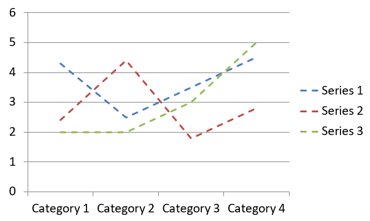

## **Áttekintés**

Ez a cikk átfogó útmutatót nyújt a diagramok létrehozásához és testreszabásához az Aspose.Slides for .NET használatával. Megtanulja, hogyan adhat programozottan diagramot egy diára, hogyan töltse fel adatokka­l, és hogyan alkalmazzon különféle formázási lehetőségeket, hogy megfeleljenek a specifikus tervezési követelményeknek. A cikk során részletes kódrészletek illusztrálják az egyes lépéseket, a prezentáció és a diagramobjektum inicializálásától a sorok, tengelyek és jelmagyarázat beállításáig. Ennek az útmutatónak a követésével alaposan megérti, hogyan integrálhat dinamikus diagramgenerálást .NET‑alkalmazásaiba, egyszerűsítve az adat‑vezérelt prezentációk létrehozásának folyamatát.

## **Diagram létrehozása**

A diagramok segítenek az embereknek gyorsan megjeleníteni az adatokat, és olyan betekintéseket nyújtanak, amelyek egy táblázatból vagy munkafüzetből nem lennének azonnal nyilvánvalóak.

**Miért érdemes diagramokat készíteni?**

Diagramok használatával:

* nagy mennyiségű adatot összegezhet, sűríthet vagy összefoglalhat egyetlen dián;
* felfedheti az adatok mintáit és trendjeit;
* meghatározhatja az adatok időbeli vagy egy adott mérőegységhez viszonyított irányát és lendületét;
* észreveheti a kiugró értékeket, eltéréseket, hibákat és értelmetlen adatokat;
* komplex adatokat kommunikálhat vagy bemutathat.

A PowerPointban a diagramokat a *Beszúrás* funkción keresztül hozhatja létre, amely számos diagramtípus sablonját biztosítja. Az Aspose.Slides segítségével szabványos diagramokat (népszerű diagramtípusok alapján) és egyedi diagramokat egyaránt készíthet.

{} 
Használja a [ChartType](https://reference.aspose.com/slides/net/aspose.slides.charts/charttype/) felsorolást az [Aspose.Slides.Charts](https://reference.aspose.com/slides/net/aspose.slides.charts/) névtérben. Ennek az enumerációnak az értékei a különböző diagramtípusoknak felelnek meg.
{} 

### **Csoportos oszlopdiagramok létrehozása**

Ez a szakasz bemutatja, hogyan hozhat létre csoportos oszlopdiagramot az Aspose.Slides for .NET segítségével. Megtanulja, hogyan inicializáljon egy prezentációt, adjon hozzá diagramot, és testreszabja annak elemeit, például a címet, adatokat, sorozatokat, kategóriákat és a stílusát. Kövesse az alábbi lépéseket a standard csoportos oszlopdiagram létrehozásához:

1. Hozzon létre egy példányt a [Presentation](https://reference.aspose.com/slides/net/aspose.slides/presentation) osztályból.  
1. Kapjon hivatkozást egy diára a indexe alapján.  
1. Adjon hozzá egy diagramot némi adattal, és adja meg a `ChartType.ClusteredColumn` típust.  
1. Adjon címet a diagramhoz.  
1. Hozzáférés a diagram adatlapjához.  
1. Törölje az összes alapértelmezett sorozatot és kategóriát.  
1. Adjon meg új sorozatokat és kategóriákat.  
1. Adjon hozzá új diagramadatot a sorozathoz.  
1. Állítson be kitöltőszínt a diagram sorozatához.  
1. Adjon címkéket a diagram sorozatához.  
1. Mentse a módosított prezentációt PPTX fájlként.

Ez a C# kód bemutatja a csoportos oszlopdiagram létrehozását:

```c#
using System.Drawing;
using Aspose.Slides;
using Aspose.Slides.Charts;
using Aspose.Slides.Export;

// Példányosítsa a Presentation osztályt.
using (Presentation presentation = new Presentation())
{
    // Hozza elérhetővé az első diát.
    ISlide slide = presentation.Slides[0];

    // Adjon hozzá egy csoportos oszlopdiagramot az alapértelmezett adataival.
    IChart chart = slide.Shapes.AddChart(ChartType.ClusteredColumn, 20, 20, 500, 300);

    // Állítsa be a diagram címét.
    chart.ChartTitle.AddTextFrameForOverriding("Sample Title");
    chart.ChartTitle.TextFrameForOverriding.TextFrameFormat.CenterText = NullableBool.True;
    chart.ChartTitle.Height = 20;
    chart.HasTitle = true;

    // Állítsa be a diagram adatlapjának indexét.
    int worksheetIndex = 0;

    // Szerezze be a diagram adatkönyvtárát.
    IChartDataWorkbook workbook = chart.ChartData.ChartDataWorkbook;

    // Törölje az alapértelmezett generált sorozatokat és kategóriákat.
    chart.ChartData.Series.Clear();
    chart.ChartData.Categories.Clear();

    // Új sorozatok hozzáadása.
    chart.ChartData.Series.Add(workbook.GetCell(worksheetIndex, 0, 1, "Series 1"), chart.Type);
    chart.ChartData.Series.Add(workbook.GetCell(worksheetIndex, 0, 2, "Series 2"), chart.Type);

    // Új kategóriák hozzáadása.
    chart.ChartData.Categories.Add(workbook.GetCell(worksheetIndex, 1, 0, "Category 1"));
    chart.ChartData.Categories.Add(workbook.GetCell(worksheetIndex, 2, 0, "Category 2"));
    chart.ChartData.Categories.Add(workbook.GetCell(worksheetIndex, 3, 0, "Category 3"));

    // Szerezze meg az első diagram sorozatot.
    IChartSeries series = chart.ChartData.Series[0];

    // Töltse fel a sorozat adatait.
    series.DataPoints.AddDataPointForBarSeries(workbook.GetCell(worksheetIndex, 1, 1, 20));
    series.DataPoints.AddDataPointForBarSeries(workbook.GetCell(worksheetIndex, 2, 1, 50));
    series.DataPoints.AddDataPointForBarSeries(workbook.GetCell(worksheetIndex, 3, 1, 30));

    // Állítsa be a sorozat kitöltőszínét.
    series.Format.Fill.FillType = FillType.Solid;
    series.Format.Fill.SolidFillColor.Color = Color.Red;

    // Szerezze meg a második diagram sorozatot.
    series = chart.ChartData.Series[1];

    // Töltse fel a sorozat adatait.
    series.DataPoints.AddDataPointForBarSeries(workbook.GetCell(worksheetIndex, 1, 2, 30));
    series.DataPoints.AddDataPointForBarSeries(workbook.GetCell(worksheetIndex, 2, 2, 10));
    series.DataPoints.AddDataPointForBarSeries(workbook.GetCell(worksheetIndex, 3, 2, 60));

    // Állítsa be a sorozat kitöltőszínét.
    series.Format.Fill.FillType = FillType.Solid;
    series.Format.Fill.SolidFillColor.Color = Color.Green;

    // Állítsa be az első címkét a kategórianév megjelenítésére.
    IDataLabel label = series.DataPoints[0].Label;
    label.DataLabelFormat.ShowCategoryName = true;

    label = series.DataPoints[1].Label;
    label.DataLabelFormat.ShowSeriesName = true;

    // Állítsa be a sorozatot, hogy a harmadik címkéhez értéket jelenítsen meg.
    label = series.DataPoints[2].Label;
    label.DataLabelFormat.ShowValue = true;
    label.DataLabelFormat.ShowSeriesName = true;
    label.DataLabelFormat.Separator = "/";

    // Save the presentation to disk as a PPTX file.
    presentation.Save("AsposeChart_out.pptx", SaveFormat.Pptx);
}
```

Az eredmény:


### **Szórt diagramok létrehozása**

A szórt diagramok (más néven szórtábrák vagy x‑y grafikonok) gyakran használatosak minták keresésére vagy két változó közötti korrelációk bemutatására.

Használjon szórt diagramot, ha:

* párosított numerikus adatokkal dolgozik;  
* két változó jól párosítható egymással;  
* meg szeretné határozni, hogy a két változó összefügg-e;  
* egy független változónak több értéke van egy függő változóhoz képest.

Ez a C# kód megmutatja, hogyan hozhat létre szórt diagramot különböző jelölőszerekkel:

```c#
using Aspose.Slides;
using Aspose.Slides.Charts;
using Aspose.Slides.Export;

// Példányosítsa a Presentation osztályt.
using (Presentation presentation = new Presentation())
{
    // Elérje az első diát.
    ISlide slide = presentation.Slides[0];

    // Hozza létre az alapértelmezett szórt diagramot.
    IChart chart = slide.Shapes.AddChart(ChartType.ScatterWithSmoothLines, 20, 20, 500, 300);

    // Állítsa be a diagram adatlapjának indexét.
    int worksheetIndex = 0;

    // Szerezze be a diagram adatkönyvtárát.
    IChartDataWorkbook workbook = chart.ChartData.ChartDataWorkbook;

    // Törölje az alapértelmezett sorozatot.
    chart.ChartData.Series.Clear();

    // Új sorozatok hozzáadása.
    chart.ChartData.Series.Add(workbook.GetCell(worksheetIndex, 1, 1, "Series 1"), chart.Type);
    chart.ChartData.Series.Add(workbook.GetCell(worksheetIndex, 1, 3, "Series 2"), chart.Type);

    // Szerezze meg az első diagram sorozatot.
    IChartSeries series = chart.ChartData.Series[0];

    // Új pont (1:3) hozzáadása a sorozathoz.
    series.DataPoints.AddDataPointForScatterSeries(workbook.GetCell(worksheetIndex, 2, 1, 1), workbook.GetCell(worksheetIndex, 2, 2, 3));

    // Új pont (2:10) hozzáadása.
    series.DataPoints.AddDataPointForScatterSeries(workbook.GetCell(worksheetIndex, 3, 1, 2), workbook.GetCell(worksheetIndex, 3, 2, 10));

    // A sorozat típusának módosítása.
    series.Type = ChartType.ScatterWithStraightLinesAndMarkers;

    // A diagram sorozat jelölőjének módosítása.
    series.Marker.Size = 10;
    series.Marker.Symbol = MarkerStyleType.Star;

    // Szerezze meg a második diagram sorozatot.
    series = chart.ChartData.Series[1];

    // Új pont (5:2) hozzáadása a diagram sorozathoz.
    series.DataPoints.AddDataPointForScatterSeries(workbook.GetCell(worksheetIndex, 2, 3, 5), workbook.GetCell(worksheetIndex, 2, 4, 2));

    // Új pont (3:1) hozzáadása.
    series.DataPoints.AddDataPointForScatterSeries(workbook.GetCell(worksheetIndex, 3, 3, 3), workbook.GetCell(worksheetIndex, 3, 4, 1));

    // Új pont (2:2) hozzáadása.
    series.DataPoints.AddDataPointForScatterSeries(workbook.GetCell(worksheetIndex, 4, 3, 2), workbook.GetCell(worksheetIndex, 4, 4, 2));

    // Új pont (5:1) hozzáadása.
    series.DataPoints.AddDataPointForScatterSeries(workbook.GetCell(worksheetIndex, 5, 3, 5), workbook.GetCell(worksheetIndex, 5, 4, 1));

    // A diagram sorozat jelölőjének módosítása.
    series.Marker.Size = 10;
    series.Marker.Symbol = MarkerStyleType.Circle;

    // Mentse a prezentációt lemezre PPTX fájlként.
    presentation.Save("AsposeChart_out.pptx", SaveFormat.Pptx);
}
```

Az eredmény:


### **Kördiagramok létrehozása**

A kördiagramok leginkább a rész‑egész kapcsolat megjelenítésére szolgálnak, különösen akkor, ha az adatok kategóriákat tartalmaznak numerikus értékekkel. Ha sok rész vagy címke van, érdemes oszlopdiagramra váltani.

1. Hozzon létre egy példányt a [Presentation](https://reference.aspose.com/slides/net/aspose.slides/presentation) osztályból.  
1. Kapjon hivatkozást egy diára a indexe alapján.  
1. Adjon hozzá egy diagramot alapértelmezett adatokkal, és adja meg a `ChartType.Pie` típust.  
1. Hozzáférés a diagram adatkönyvtárához ([IChartDataWorkbook](https://reference.aspose.com/slides/net/aspose.slides.charts/ichartdataworkbook/)).  
1. Törölje az alapértelmezett sorozatot és kategóriákat.  
1. Adjon meg új sorozatokat és kategóriákat.  
1. Adjon hozzá új diagramadatot a sorozathoz.  
1. Adjon hozzá új pontokat a diagramhoz, és alkalmazzon egyéni színeket a kördiagram szeleteire.  
1. Állítsa be a címkéket a sorozathoz.  
1. Engedélyezze a vezetővonalakat a sorozatcímkékhez.  
1. Állítsa be a forgási szöget a kördiagramhoz.  
1. Mentse a módosított prezentációt PPTX fájlként.

Ez a C# kód bemutatja a kördiagram létrehozását:

```c#
using System.Drawing;
using Aspose.Slides;
using Aspose.Slides.Charts;
using Aspose.Slides.Export;

// Példányosítsa a Presentation osztályt.
using (Presentation presentation = new Presentation())
{
    // Elérje az első diát.
    ISlide slide = presentation.Slides[0];

    // Adjon hozzá egy diagramot az alapértelmezett adataival.
    IChart chart = slide.Shapes.AddChart(ChartType.Pie, 20, 20, 500, 300);

    // Állítsa be a diagram címét.
    chart.ChartTitle.AddTextFrameForOverriding("Sample Title");
    chart.ChartTitle.TextFrameForOverriding.TextFrameFormat.CenterText = NullableBool.True;
    chart.ChartTitle.Height = 20;
    chart.HasTitle = true;

    // Állítsa be, hogy az első sorozat értékeket mutasson.
    chart.ChartData.Series[0].Labels.DefaultDataLabelFormat.ShowValue = true;

    // Állítsa be a diagram adatlapjának indexét.
    int worksheetIndex = 0;

    // Szerezze meg a diagram adatkönyvtárát.
    IChartDataWorkbook workbook = chart.ChartData.ChartDataWorkbook;

    // Törölje az alapértelmezett generált sorozatokat és kategóriákat.
    chart.ChartData.Series.Clear();
    chart.ChartData.Categories.Clear();

    // Új kategóriák hozzáadása.
    chart.ChartData.Categories.Add(workbook.GetCell(0, 1, 0, "1st Qtr"));
    chart.ChartData.Categories.Add(workbook.GetCell(0, 2, 0, "2nd Qtr"));
    chart.ChartData.Categories.Add(workbook.GetCell(0, 3, 0, "3rd Qtr"));

    // Új sorozatok hozzáadása.
    IChartSeries series = chart.ChartData.Series.Add(workbook.GetCell(0, 0, 1, "Series 1"), chart.Type);

    // Töltse fel a sorozat adatait.
    series.DataPoints.AddDataPointForPieSeries(workbook.GetCell(worksheetIndex, 1, 1, 20));
    series.DataPoints.AddDataPointForPieSeries(workbook.GetCell(worksheetIndex, 2, 1, 50));
    series.DataPoints.AddDataPointForPieSeries(workbook.GetCell(worksheetIndex, 3, 1, 30));

    // Állítsa be a szektor színét.
    chart.ChartData.SeriesGroups[0].IsColorVaried = true;

    IChartDataPoint point = series.DataPoints[0];
    point.Format.Fill.FillType = FillType.Solid;
    point.Format.Fill.SolidFillColor.Color = Color.Cyan;

    // Állítsa be a szektor keretét.
    point.Format.Line.FillFormat.FillType = FillType.Solid;
    point.Format.Line.FillFormat.SolidFillColor.Color = Color.Gray;
    point.Format.Line.Width = 3.0;
    point.Format.Line.Style = LineStyle.ThinThick;
    point.Format.Line.DashStyle = LineDashStyle.LargeDash;

    IChartDataPoint point1 = series.DataPoints[1];
    point1.Format.Fill.FillType = FillType.Solid;
    point1.Format.Fill.SolidFillColor.Color = Color.Brown;

    // Állítsa be a szektor keretét.
    point1.Format.Line.FillFormat.FillType = FillType.Solid;
    point1.Format.Line.FillFormat.SolidFillColor.Color = Color.Blue;
    point1.Format.Line.Width = 3.0;
    point1.Format.Line.Style = LineStyle.Single;
    point1.Format.Line.DashStyle = LineDashStyle.LargeDashDot;

    IChartDataPoint point2 = series.DataPoints[2];
    point2.Format.Fill.FillType = FillType.Solid;
    point2.Format.Fill.SolidFillColor.Color = Color.Coral;

    // Állítsa be a szektor keretét.
    point2.Format.Line.FillFormat.FillType = FillType.Solid;
    point2.Format.Line.FillFormat.SolidFillColor.Color = Color.Red;
    point2.Format.Line.Width = 2.0;
    point2.Format.Line.Style = LineStyle.ThinThin;
    point2.Format.Line.DashStyle = LineDashStyle.LargeDashDotDot;

    // Egyéni címkék létrehozása az új sorozat minden kategóriájához.
    IDataLabel label1 = series.DataPoints[0].Label;

    label1.DataLabelFormat.ShowValue = true;

    IDataLabel label2 = series.DataPoints[1].Label;
    label2.DataLabelFormat.ShowValue = true;
    label2.DataLabelFormat.ShowLegendKey = true;
    label2.DataLabelFormat.ShowPercentage = true;

    IDataLabel label3 = series.DataPoints[2].Label;
    label3.DataLabelFormat.ShowSeriesName = true;
    label3.DataLabelFormat.ShowPercentage = true;

    // Állítsa be, hogy a sorozat vezetővonalakat mutasson a diagramon.
    series.Labels.DefaultDataLabelFormat.ShowLeaderLines = true;

    // Állítsa be a kördiagram szektorok forgatási szögét.
    chart.ChartData.SeriesGroups[0].FirstSliceAngle = 180;

    // Mentse a prezentációt lemezre PPTX fájlként.
    presentation.Save("PieChart_out.pptx", SaveFormat.Pptx);
}
```

Az eredmény:


### **Vonaldiagramok létrehozása**

A vonaldiagramok (más néven vonalgrafikonok) leginkább olyan helyzetekben használatosak, amikor az értékek időbeli változását szeretné bemutatni. Egy vonaldiagram segítségével egyszerre több adatot összehasonlíthat, nyomon követheti a változásokat és trendeket, kiemelheti az anomáliákat stb.

1. Hozzon létre egy példányt a [Presentation](https://reference.aspose.com/slides/net/aspose.slides/presentation) osztályból.  
1. Kapjon hivatkozást egy diára a indexe alapján.  
1. Adjon hozzá egy diagramot alapértelmezett adatokkal, és adja meg a `ChartType.Line` típust.  
1. Hozzáférés a diagram adatkönyvtárához ([IChartDataWorkbook](https://reference.aspose.com/slides/net/aspose.slides.charts/ichartdataworkbook/)).  
1. Törölje az alapértelmezett sorozatot és kategóriákat.  
1. Adjon meg új sorozatokat és kategóriákat.  
1. Adjon hozzá új diagramadatot a sorozathoz.  
1. Mentse a módosított prezentációt PPTX fájlként.

Ez a C# kód bemutatja a vonaldiagram létrehozását:

```c#
using Aspose.Slides;
using Aspose.Slides.Charts;
using Aspose.Slides.Export;

using (Presentation presentation = new Presentation())
{
    IChart lineChart = presentation.Slides[0].Shapes.AddChart(ChartType.Line, 20, 20, 500, 300);

    presentation.Save("lineChart.pptx", SaveFormat.Pptx);
}
```

Alapértelmezés szerint a vonaldiagram pontjait egyenes, folytonos vonalak kötik össze. Ha szaggatott vonalakkal szeretné összekötni, adja meg a kívánt vonaltípust a következő módon:

```c#
using Aspose.Slides;
using Aspose.Slides.Charts;

using (Presentation presentation = new Presentation())
{
    IChart lineChart = presentation.Slides[0].Shapes.AddChart(ChartType.Line, 20, 20, 500, 300);

    foreach (IChartSeries series in lineChart.ChartData.Series)
    {
        series.Format.Line.DashStyle = LineDashStyle.Dash;
    }
}
```

Az eredmény:



### **Faág diagramok (Tree Map) létrehozása**

A faág diagramok (Tree Map) leginkább értékesítési adatok megjelenítésére alkalmasak, amikor a kategóriák relatív méretét szeretné bemutatni, és gyorsan felhívni a figyelmet a legnagyobb hozzájárulókra az egyes kategóriákon belül.

1. Hozzon létre egy példányt a [Presentation](https://reference.aspose.com/slides/net/aspose.slides/presentation) osztályból.  
1. Kapjon hivatkozást egy diára a indexe alapján.  
1. Adjon hozzá egy diagramot alapértelmezett adatokkal, és adja meg a `ChartType.Treemap` típust.  
1. Hozzáférés a diagram adatkönyvtárához ([IChartDataWorkbook](https://reference.aspose.com/slides/net/aspose.slides.charts/ichartdataworkbook/)).  
1. Törölje az alapértelmezett sorozatot és kategóriákat.  
1. Adjon meg új sorozatokat és kategóriákat.  
1. Adjon hozzá új diagramadatot a sorozathoz.  
1. Mentse a módosított prezentációt PPTX fájlként.

Ez a C# kód bemutatja a faág diagram létrehozását:

```c#
using Aspose.Slides;
using Aspose.Slides.Charts;
using Aspose.Slides.Export;

using (Presentation presentation = new Presentation())
{
    IChart chart = presentation.Slides[0].Shapes.AddChart(ChartType.Treemap, 20, 20, 500, 300);
    chart.ChartData.Categories.Clear();
    chart.ChartData.Series.Clear();

    IChartDataWorkbook workbook = chart.ChartData.ChartDataWorkbook;
    workbook.Clear(0);

    // Ág 1
    IChartCategory leaf = chart.ChartData.Categories.Add(workbook.GetCell(0, "C1", "Leaf1"));
    leaf.GroupingLevels.SetGroupingItem(1, "Stem1");
    leaf.GroupingLevels.SetGroupingItem(2, "Branch1");

    chart.ChartData.Categories.Add(workbook.GetCell(0, "C2", "Leaf2"));

    leaf = chart.ChartData.Categories.Add(workbook.GetCell(0, "C3", "Leaf3"));
    leaf.GroupingLevels.SetGroupingItem(1, "Stem2");

    chart.ChartData.Categories.Add(workbook.GetCell(0, "C4", "Leaf4"));

    // Ág 2
    leaf = chart.ChartData.Categories.Add(workbook.GetCell(0, "C5", "Leaf5"));
    leaf.GroupingLevels.SetGroupingItem(1, "Stem3");
    leaf.GroupingLevels.SetGroupingItem(2, "Branch2");

    chart.ChartData.Categories.Add(workbook.GetCell(0, "C6", "Leaf6"));

    leaf = chart.ChartData.Categories.Add(workbook.GetCell(0, "C7", "Leaf7"));
    leaf.GroupingLevels.SetGroupingItem(1, "Stem4");

    chart.ChartData.Categories.Add(workbook.GetCell(0, "C8", "Leaf8"));

    IChartSeries series = chart.ChartData.Series.Add(ChartType.Treemap);
    series.Labels.DefaultDataLabelFormat.ShowCategoryName = true;
    series.DataPoints.AddDataPointForTreemapSeries(workbook.GetCell(0, "D1", 4));
    series.DataPoints.AddDataPointForTreemapSeries(workbook.GetCell(0, "D2", 5));
    series.DataPoints.AddDataPointForTreemapSeries(workbook.GetCell(0, "D3", 3));
    series.DataPoints.AddDataPointForTreemapSeries(workbook.GetCell(0, "D4", 6));
    series.DataPoints.AddDataPointForTreemapSeries(workbook.GetCell(0, "D5", 9));
    series.DataPoints.AddDataPointForTreemapSeries(workbook.GetCell(0, "D6", 9));
    series.DataPoints.AddDataPointForTreemapSeries(workbook.GetCell(0, "D7", 4));
    series.DataPoints.AddDataPointForTreemapSeries(workbook.GetCell(0, "D8", 3));

    series.ParentLabelLayout = ParentLabelLayoutType.Overlapping;

    presentation.Save("Treemap.pptx", SaveFormat.Pptx);
}
```

Az eredmény:


### **Részvénydiagramok (Stock) létrehozása**

A részvénydiagramok pénzügyi adatok (nyitó, legmagasabb, legalacsonyabb és záró árak) megjelenítésére szolgálnak, segítve a piaci trendek és volatilitás elemzését. Lényeges betekintést nyújtanak a részvény teljesítményébe, támogatva a befektetőket és elemzőket a megalapozott döntéshozatalban.

1. Hozzon létre egy példányt a [Presentation](https://reference.aspose.com/slides/net/aspose.slides/presentation) osztályból.  
1. Kapjon hivatkozást egy diára a indexe alapján.  
1. Adjon hozzá egy diagramot alapértelmezett adatokkal, és adja meg a `ChartType.OpenHighLowClose` típust.  
1. Hozzáférés a diagram adatkönyvtárához ([IChartDataWorkbook](https://reference.aspose.com/slides/net/aspose.slides.charts/ichartdataworkbook/)).  
1. Törölje az alapértelmezett sorozatot és kategóriákat.  
1. Adjon meg új sorozatokat és kategóriákat.  
1. Adjon hozzá új diagramadatot a sorozathoz.  
1. Adja meg a HiLowLines formátumot.  
1. Mentse a módosított prezentációt PPTX fájlként.

Ez a C# kód bemutatja a részvénydiagram létrehozását:

```c#
using Aspose.Slides;
using Aspose.Slides.Charts;
using Aspose.Slides.Export;

using (Presentation presentation = new Presentation())
{
    IChart chart = presentation.Slides[0].Shapes.AddChart(ChartType.OpenHighLowClose, 20, 20, 500, 300, false);

    IChartDataWorkbook workbook = chart.ChartData.ChartDataWorkbook;

    chart.ChartData.Categories.Add(workbook.GetCell(0, 1, 0, "A"));
    chart.ChartData.Categories.Add(workbook.GetCell(0, 2, 0, "B"));
    chart.ChartData.Categories.Add(workbook.GetCell(0, 3, 0, "C"));

    chart.ChartData.Series.Add(workbook.GetCell(0, 0, 1, "Open"), chart.Type);
    chart.ChartData.Series.Add(workbook.GetCell(0, 0, 2, "High"), chart.Type);
    chart.ChartData.Series.Add(workbook.GetCell(0, 0, 3, "Low"), chart.Type);
    chart.ChartData.Series.Add(workbook.GetCell(0, 0, 4, "Close"), chart.Type);

    IChartSeries series = chart.ChartData.Series[0];
    series.DataPoints.AddDataPointForStockSeries(workbook.GetCell(0, 1, 1, 72));
    series.DataPoints.AddDataPointForStockSeries(workbook.GetCell(0, 2, 1, 25));
    series.DataPoints.AddDataPointForStockSeries(workbook.GetCell(0, 3, 1, 38));

    series = chart.ChartData.Series[1];
    series.DataPoints.AddDataPointForStockSeries(workbook.GetCell(0, 1, 2, 172));
    series.DataPoints.AddDataPointForStockSeries(workbook.GetCell(0, 2, 2, 57));
    series.DataPoints.AddDataPointForStockSeries(workbook.GetCell(0, 3, 2, 57));

    series = chart.ChartData.Series[2];
    series.DataPoints.AddDataPointForStockSeries(workbook.GetCell(0, 1, 3, 12));
    series.DataPoints.AddDataPointForStockSeries(workbook.GetCell(0, 2, 3, 12));
    series.DataPoints.AddDataPointForStockSeries(workbook.GetCell(0, 3, 3, 13));

    series = chart.ChartData.Series[3];
    series.DataPoints.AddDataPointForStockSeries(workbook.GetCell(0, 1, 4, 25));
    series.DataPoints.AddDataPointForStockSeries(workbook.GetCell(0, 2, 4, 38));
    series.DataPoints.AddDataPointForStockSeries(workbook.GetCell(0, 3, 4, 50));

    chart.ChartData.SeriesGroups[0].UpDownBars.HasUpDownBars = true;
    chart.ChartData.SeriesGroups[0].HiLowLinesFormat.Line.FillFormat.FillType = FillType.Solid;

    foreach (IChartSeries ser in chart.ChartData.Series)
    {
        ser.Format.Line.FillFormat.FillType = FillType.NoFill;
    }

    chart.Axes.VerticalAxis.MinorGridLinesFormat.Line.FillFormat.FillType = FillType.NoFill;

    presentation.Save("Stock-chart.pptx", SaveFormat.Pptx);
}
```

Az eredmény:


### **Doboz‑ és szárnydiagramok (Box and Whisker) létrehozása**

A doboz‑ és szárnydiagramok a statisztikai eloszlás megjelenítésére szolgálnak, összefoglalva a kulcsfontosságú mérőszámokat, például a mediánt, a kvartiliseket és a lehetséges kiugró értékeket. Különösen hasznosak felderítő adat‑analízisekben és statisztikai tanulmányokban, hogy gyorsan megértsük az adatvariabilitást és az anomáliákat.

1. Hozzon létre egy példányt a [Presentation](https://reference.aspose.com/slides/net/aspose.slides/presentation) osztályból.  
1. Kapjon hivatkozást egy diára a indexe alapján.  
1. Adjon hozzá egy diagramot alapértelmezett adatokkal, és adja meg a `ChartType.BoxAndWhisker` típust.  
1. Hozzáférés a diagram adatkönyvtárához ([IChartDataWorkbook](https://reference.aspose.com/slides/net/aspose.slides.charts/ichartdataworkbook/)).  
1. Törölje az alapértelmezett sorozatot és kategóriákat.  
1. Adjon meg új sorozatokat és kategóriákat.  
1. Adjon hozzá új diagramadatot a sorozathoz.  
1. Mentse a módosított prezentációt PPTX fájlként.

Ez a C# kód bemutatja a doboz‑ és szárnydiagram létrehozását:

```c#
using Aspose.Slides;
using Aspose.Slides.Charts;
using Aspose.Slides.Export;

using (Presentation presentation = new Presentation())
{
    IChart chart = presentation.Slides[0].Shapes.AddChart(ChartType.BoxAndWhisker, 20, 20, 500, 300);
    chart.ChartData.Categories.Clear();
    chart.ChartData.Series.Clear();

    IChartDataWorkbook workbook = chart.ChartData.ChartDataWorkbook;
    workbook.Clear(0);

    chart.ChartData.Categories.Add(workbook.GetCell(0, "A1", "Category 1"));
    chart.ChartData.Categories.Add(workbook.GetCell(0, "A2", "Category 2"));
    chart.ChartData.Categories.Add(workbook.GetCell(0, "A3", "Category 3"));
    chart.ChartData.Categories.Add(workbook.GetCell(0, "A4", "Category 4"));
    chart.ChartData.Categories.Add(workbook.GetCell(0, "A5", "Category 5"));
    chart.ChartData.Categories.Add(workbook.GetCell(0, "A6", "Category 6"));

    IChartSeries series = chart.ChartData.Series.Add(ChartType.BoxAndWhisker);

    series.QuartileMethod = QuartileMethodType.Exclusive;
    series.ShowMeanLine = true;
    series.ShowMeanMarkers = true;
    series.ShowInnerPoints = true;
    series.ShowOutlierPoints = true;

    series.DataPoints.AddDataPointForBoxAndWhiskerSeries(workbook.GetCell(0, "B1", 15));
    series.DataPoints.AddDataPointForBoxAndWhiskerSeries(workbook.GetCell(0, "B2", 41));
    series.DataPoints.AddDataPointForBoxAndWhiskerSeries(workbook.GetCell(0, "B3", 16));
    series.DataPoints.AddDataPointForBoxAndWhiskerSeries(workbook.GetCell(0, "B4", 10));
    series.DataPoints.AddDataPointForBoxAndWhiskerSeries(workbook.GetCell(0, "B5", 23));
    series.DataPoints.AddDataPointForBoxAndWhiskerSeries(workbook.GetCell(0, "B6", 16));

    presentation.Save("BoxAndWhisker.pptx", SaveFormat.Pptx);
}
```

### **Tölcsérdiagramok (Funnel) létrehozása**

A tölcsérdiagramok a szekvenciális lépésekkel rendelkező folyamatok vizualizálására szolgálnak, ahol az adat mennyisége csökken a lépésektől a következőre. Különösen hasznosak a konverziós arányok elemzésében, szűk keresztmetszetek azonosításában és az értékesítési vagy marketing folyamatok hatékonyságának nyomon követésében.

1. Hozzon létre egy példányt a [Presentation](https://reference.aspose.com/slides/net/aspose.slides/presentation) osztályból.  
1. Kapjon hivatkozást egy diára a indexe alapján.  
1. Adjon hozzá egy diagramot alapértelmezett adatokkal, és adja meg a `ChartType.Funnel` típust.  
1. Mentse a módosított prezentációt PPTX fájlként.

Ez a C# kód bemutatja a tölcsérdiagram létrehozását:

```c#
using Aspose.Slides;
using Aspose.Slides.Charts;
using Aspose.Slides.Export;

using (Presentation presentation = new Presentation("test.pptx"))
{
    IChart chart = presentation.Slides[0].Shapes.AddChart(ChartType.Funnel, 50, 50, 500, 400);
    chart.ChartData.Categories.Clear();
    chart.ChartData.Series.Clear();

    IChartDataWorkbook workbook = chart.ChartData.ChartDataWorkbook;
    workbook.Clear(0);

    chart.ChartData.Categories.Add(workbook.GetCell(0, "A1", "Category 1"));
    chart.ChartData.Categories.Add(workbook.GetCell(0, "A2", "Category 2"));
    chart.ChartData.Categories.Add(workbook.GetCell(0, "A3", "Category 3"));
    chart.ChartData.Categories.Add(workbook.GetCell(0, "A4", "Category 4"));
    chart.ChartData.Categories.Add(workbook.GetCell(0, "A5", "Category 5"));
    chart.ChartData.Categories.Add(workbook.GetCell(0, "A6", "Category 6"));

    IChartSeries series = chart.ChartData.Series.Add(ChartType.Funnel);

    series.DataPoints.AddDataPointForFunnelSeries(workbook.GetCell(0, "B1", 50));
    series.DataPoints.AddDataPointForFunnelSeries(workbook.GetCell(0, "B2", 100));
    series.DataPoints.AddDataPointForFunnelSeries(workbook.GetCell(0, "B3", 200));
    series.DataPoints.AddDataPointForFunnelSeries(workbook.GetCell(0, "B4", 300));
    series.DataPoints.AddDataPointForFunnelSeries(workbook.GetCell(0, "B5", 400));
    series.DataPoints.AddDataPointForFunnelSeries(workbook.GetCell(0, "B6", 500));

    presentation.Save("Funnel.pptx", SaveFormat.Pptx);
}
```

Az eredmény:


### **Napcsíksdiagramok (Sunburst) létrehozása**

A napcsíksdiagramok hierarchikus adatok megjelenítésére szolgálnak, a szinteket koncentrikus gyűrűkként ábrázolva. Segítenek a rész‑egész kapcsolatok illusztrálásában, és ideálisak a beágyazott kategóriák és alkategóriák tiszta, kompakt formában történő bemutatásához.

1. Hozzon létre egy példányt a [Presentation](https://reference.aspose.com/slides/net/aspose.slides/presentation) osztályból.  
1. Kapjon hivatkozást egy diára a indexe alapján.  
1. Adjon hozzá egy diagramot alapértelmezett adatokkal, és adja meg a `ChartType.Sunburst` típust.  
1. Mentse a módosított prezentációt PPTX fájlként.

Ez a C# kód bemutatja a napcsíksdiagram létrehozását:

```c#
using Aspose.Slides;
using Aspose.Slides.Charts;
using Aspose.Slides.Export;

using (Presentation presentation = new Presentation())
{
    IChart chart = presentation.Slides[0].Shapes.AddChart(ChartType.Sunburst, 20, 20, 500, 300);
    chart.ChartData.Categories.Clear();
    chart.ChartData.Series.Clear();

    IChartDataWorkbook workbook = chart.ChartData.ChartDataWorkbook;
    workbook.Clear(0);

    // Ág 1
    IChartCategory leaf = chart.ChartData.Categories.Add(workbook.GetCell(0, "C1", "Leaf1"));
    leaf.GroupingLevels.SetGroupingItem(1, "Stem1");
    leaf.GroupingLevels.SetGroupingItem(2, "Branch1");

    chart.ChartData.Categories.Add(workbook.GetCell(0, "C2", "Leaf2"));

    leaf = chart.ChartData.Categories.Add(workbook.GetCell(0, "C3", "Leaf3"));
    leaf.GroupingLevels.SetGroupingItem(1, "Stem2");

    chart.ChartData.Categories.Add(workbook.GetCell(0, "C4", "Leaf4"));

    // Ág 2
    leaf = chart.ChartData.Categories.Add(workbook.GetCell(0, "C5", "Leaf5"));
    leaf.GroupingLevels.SetGroupingItem(1, "Stem3");
    leaf.GroupingLevels.SetGroupingItem(2, "Branch2");

    chart.ChartData.Categories.Add(workbook.GetCell(0, "C6", "Leaf6"));

    leaf = chart.ChartData.Categories.Add(workbook.GetCell(0, "C7", "Leaf7"));
    leaf.GroupingLevels.SetGroupingItem(1, "Stem4");

    chart.ChartData.Categories.Add(workbook.GetCell(0, "C8", "Leaf8"));

    IChartSeries series = chart.ChartData.Series.Add(ChartType.Sunburst);
    series.Labels.DefaultDataLabelFormat.ShowCategoryName = true;
    series.DataPoints.AddDataPointForSunburstSeries(workbook.GetCell(0, "D1", 4));
    series.DataPoints.AddDataPointForSunburstSeries(workbook.GetCell(0, "D2", 5));
    series.DataPoints.AddDataPointForSunburstSeries(workbook.GetCell(0, "D3", 3));
    series.DataPoints.AddDataPointForSunburstSeries(workbook.GetCell(0, "D4", 6));
    series.DataPoints.AddDataPointForSunburstSeries(workbook.GetCell(0, "D5", 9));
    series.DataPoints.AddDataPointForSunburstSeries(workbook.GetCell(0, "D6", 9));
    series.DataPoints.AddDataPointForSunburstSeries(workbook.GetCell(0, "D7", 4));
    series.DataPoints.AddDataPointForSunburstSeries(workbook.GetCell(0, "D8", 3));

    presentation.Save("Sunburst.pptx", SaveFormat.Pptx);
}
```

Az eredmény:


### **Hisztogram diagramok létrehozása**

A hisztogram diagramok a numerikus adatok eloszlását jelenítik meg értéktartományok (bin) szerint. Különösen hasznosak a frekvencia, ferdeség és szórás mintáinak azonosításában, illetve a kiugró értékek felismerésében.

1. Hozzon létre egy példányt a [Presentation](https://reference.aspose.com/slides/net/aspose.slides/presentation) osztályból.  
1. Kapjon hivatkozást egy diára a indexe alapján.  
1. Adjon hozzá egy diagramot némi adattal, és adja meg a `ChartType.Histogram` típust.  
1. Hozzáférés a diagram adatkönyvtárához ([IChartDataWorkbook](https://reference.aspose.com/slides/net/aspose.slides.charts/ichartdataworkbook/)).  
1. Törölje az alapértelmezett sorozatot és kategóriákat.  
1. Adjon meg új sorozatokat és kategóriákat.  
1. Mentse a módosított prezentációt PPTX fájlként.

Ez a C# kód bemutatja a hisztogram diagram létrehozását:

```c#
using Aspose.Slides;
using Aspose.Slides.Charts;
using Aspose.Slides.Export;

using (Presentation presentation = new Presentation())
{
    IChart chart = presentation.Slides[0].Shapes.AddChart(ChartType.Histogram, 20, 20, 500, 300);
    chart.ChartData.Categories.Clear();
    chart.ChartData.Series.Clear();

    IChartDataWorkbook workbook = chart.ChartData.ChartDataWorkbook;
    workbook.Clear(0);

    IChartSeries series = chart.ChartData.Series.Add(ChartType.Histogram);
    series.DataPoints.AddDataPointForHistogramSeries(workbook.GetCell(0, "A1", 15));
    series.DataPoints.AddDataPointForHistogramSeries(workbook.GetCell(0, "A2", -41));
    series.DataPoints.AddDataPointForHistogramSeries(workbook.GetCell(0, "A3", 16));
    series.DataPoints.AddDataPointForHistogramSeries(workbook.GetCell(0, "A4", 10));
    series.DataPoints.AddDataPointForHistogramSeries(workbook.GetCell(0, "A5", -23));
    series.DataPoints.AddDataPointForHistogramSeries(workbook.GetCell(0, "A6", 16));

    chart.Axes.HorizontalAxis.AggregationType = AxisAggregationType.Automatic;

    presentation.Save("Histogram.pptx", SaveFormat.Pptx);
}
```

Az eredmény:


### **Radar diagramok létrehozása**

A radar diagramok többváltozós adatot jelenítenek meg kétdimenziós formátumban, lehetővé téve több változó egyszerre történő összehasonlítását. Különösen alkalmasak a minták, erősségek és gyengeségek azonosítására több teljesítménymutató vagy attribútum esetén.

1. Hozzon létre egy példányt a [Presentation](https://reference.aspose.com/slides/net/aspose.slides/presentation) osztályból.  
1. Kapjon hivatkozást egy diára a indexe alapján.  
1. Adjon hozzá egy diagramot némi adattal, és adja meg a `ChartType.Radar` típust.  
1. Mentse a módosított prezentációt PPTX fájlként.

Ez a C# kód bemutatja a radar diagram létrehozását:

```c#
using Aspose.Slides;
using Aspose.Slides.Charts;
using Aspose.Slides.Export;

using (Presentation presentation = new Presentation())
{
    presentation.Slides[0].Shapes.AddChart(ChartType.Radar, 20, 20, 500, 300);
    presentation.Save("Radar-chart.pptx", SaveFormat.Pptx);
}
```

Az eredmény:


### **Többkategóriás diagramok létrehozása**

A többkategóriás diagramok olyan adatokat jelenítenek meg, ahol több kategóriacsoport is szerepel, lehetővé téve az értékek több dimenzióban történő egyidejű összehasonlítását. Különösen hasznosak összetett, több rétegből álló adathalmazok trendjeinek és összefüggéseinek elemzésében.

1. Hozzon létre egy példányt a [Presentation](https://reference.aspose.com/slides/net/aspose.slides/presentation) osztályból.  
1. Kapjon hivatkozást egy diára a indexe alapján.  
1. Adjon hozzá egy diagramot alapértelmezett adatokkal, és adja meg a `ChartType.ClusteredColumn` típust.  
1. Hozzáférés a diagram adatkönyvtárához ([IChartDataWorkbook](https://reference.aspose.com/slides/net/aspose.slides.charts/ichartdataworkbook/)).  
1. Törölje az alapértelmezett sorozatot és kategóriákat.  
1. Adjon meg új sorozatokat és kategóriákat.  
1. Adjon hozzá új diagramadatot a sorozathoz.  
1. Mentse a módosított prezentációt PPTX fájlként.

Ez a C# kód bemutatja a többkategóriás diagram létrehozását:

```c#
using Aspose.Slides;
using Aspose.Slides.Charts;
using Aspose.Slides.Export;

using (Presentation presentation = new Presentation())
{
    ISlide slide = presentation.Slides[0];

    IChart chart = presentation.Slides[0].Shapes.AddChart(ChartType.ClusteredColumn, 20, 20, 500, 300);
    chart.ChartData.Series.Clear();
    chart.ChartData.Categories.Clear();

    IChartDataWorkbook workbook = chart.ChartData.ChartDataWorkbook;
    workbook.Clear(0);

    int worksheetIndex = 0;

    IChartCategory category = chart.ChartData.Categories.Add(workbook.GetCell(0, "c2", "A"));
    category.GroupingLevels.SetGroupingItem(1, "Group1");
    category = chart.ChartData.Categories.Add(workbook.GetCell(0, "c3", "B"));

    category = chart.ChartData.Categories.Add(workbook.GetCell(0, "c4", "C"));
    category.GroupingLevels.SetGroupingItem(1, "Group2");
    category = chart.ChartData.Categories.Add(workbook.GetCell(0, "c5", "D"));

    category = chart.ChartData.Categories.Add(workbook.GetCell(0, "c6", "E"));
    category.GroupingLevels.SetGroupingItem(1, "Group3");
    category = chart.ChartData.Categories.Add(workbook.GetCell(0, "c7", "F"));

    category = chart.ChartData.Categories.Add(workbook.GetCell(0, "c8", "G"));
    category.GroupingLevels.SetGroupingItem(1, "Group4");
    category = chart.ChartData.Categories.Add(workbook.GetCell(0, "c9", "H"));

    // Sorozat hozzáadása.
    IChartSeries series = chart.ChartData.Series.Add(workbook.GetCell(0, "D1", "Series 1"), ChartType.ClusteredColumn);

    series.DataPoints.AddDataPointForBarSeries(workbook.GetCell(worksheetIndex, "D2", 10));
    series.DataPoints.AddDataPointForBarSeries(workbook.GetCell(worksheetIndex, "D3", 20));
    series.DataPoints.AddDataPointForBarSeries(workbook.GetCell(worksheetIndex, "D4", 30));
    series.DataPoints.AddDataPointForBarSeries(workbook.GetCell(worksheetIndex, "D5", 40));
    series.DataPoints.AddDataPointForBarSeries(workbook.GetCell(worksheetIndex, "D6", 50));
    series.DataPoints.AddDataPointForBarSeries(workbook.GetCell(worksheetIndex, "D7", 60));
    series.DataPoints.AddDataPointForBarSeries(workbook.GetCell(worksheetIndex, "D8", 70));
    series.DataPoints.AddDataPointForBarSeries(workbook.GetCell(worksheetIndex, "D9", 80));

    // A diagramot tartalmazó prezentáció mentése.
    presentation.Save("AsposeChart_out.pptx", SaveFormat.Pptx);
}
```

Az eredmény:


### **Térképdiagramok (Map) létrehozása**

A térképdiagramok a földrajzi adatok vizualizálására szolgálnak, ahol az információt országokhoz, államokhoz vagy városokhoz kötik. Különösen alkalmasak a regionális trendek, demográfiai adatok és térbeli eloszlások elemzésére egyértelmű, vizuálisan vonzó módon.

Ez a C# kód bemutatja a térképdiagram létrehozását:

```c#
using Aspose.Slides;
using Aspose.Slides.Charts;
using Aspose.Slides.Export;

using (Presentation presentation = new Presentation())
{
    IChart chart = presentation.Slides[0].Shapes.AddChart(ChartType.Map, 20, 20, 500, 300);
    presentation.Save("mapChart.pptx", SaveFormat.Pptx);
}
```

Az eredmény:


{} 
A fenti kép a mentett prezentációt mutatja megnyitva a PowerPointban. Az Aspose.Slides helyesen írja a térképdiagramot és annak adatait, de magát a térképdiagramot nem rajzolja: amikor egy diát, amely egyet tartalmaz, képpé renderel, vagy PDF‑re/SVG‑re konvertál, a diagram területe üres marad. A dián lévő többi alakzat érintetlen marad.
{} 

### **Kombinációs diagramok létrehozása**

A kombinációs diagram (vagy combo diagram) két vagy több diagramtípust kombinál egyetlen grafikonban. Ez a diagram lehetővé teszi, hogy kiemelje, összehasonlítsa vagy megvizsgálja a különböző adathalmazok közötti különbségeket, segítve a köztük lévő kapcsolatok azonosítását.


Az alábbi C# kód mutatja be, hogyan lehet létrehozni a fenti kombinációs diagramot egy PowerPoint‑prezentációban:

```c#
using System.Drawing;
using Aspose.Slides;
using Aspose.Slides.Charts;
using Aspose.Slides.Export;

private static void CreateComboChart()
{
    using (Presentation presentation = new Presentation())
    {
        IChart chart = CreateChartWithFirstSeries(presentation.Slides[0]);

        AddSecondSeriesToChart(chart);
        AddThirdSeriesToChart(chart);

        SetPrimaryAxesFormat(chart);
        SetSecondaryAxesFormat(chart);

        presentation.Save("combo-chart.pptx", SaveFormat.Pptx);
    }
}

private static IChart CreateChartWithFirstSeries(ISlide slide)
{
    IChart chart = slide.Shapes.AddChart(ChartType.ClusteredColumn, 50, 50, 600, 400);

    // Beállítja a diagram címét
    chart.HasTitle = true;
    chart.ChartTitle.AddTextFrameForOverriding("Chart Title");
    chart.ChartTitle.Overlay = false;
    IPortionFormat portionFormat = 
       chart.ChartTitle.TextFrameForOverriding.Paragraphs[0].ParagraphFormat.DefaultPortionFormat;
    portionFormat.FontBold = NullableBool.False;
    portionFormat.FontHeight = 18f;

    // Beállítja a diagram jelmagyarázatát
    chart.Legend.Position = LegendPositionType.Bottom;
    chart.Legend.TextFormat.PortionFormat.FontHeight = 12f;

    // Törli az alapértelmezett generált sorozatokat és kategóriákat
    chart.ChartData.Series.Clear();
    chart.ChartData.Categories.Clear();

    int worksheetIndex = 0;
    IChartDataWorkbook workbook = chart.ChartData.ChartDataWorkbook;

    // Új kategóriák hozzáadása
    chart.ChartData.Categories.Add(workbook.GetCell(worksheetIndex, 1, 0, "Category 1"));
    chart.ChartData.Categories.Add(workbook.GetCell(worksheetIndex, 2, 0, "Category 2"));
    chart.ChartData.Categories.Add(workbook.GetCell(worksheetIndex, 3, 0, "Category 3"));
    chart.ChartData.Categories.Add(workbook.GetCell(worksheetIndex, 4, 0, "Category 4"));

    // Első sorozat hozzáadása
    IChartSeries series = chart.ChartData.Series.Add(
        workbook.GetCell(worksheetIndex, 0, 1, "Series 1"), chart.Type);

    series.ParentSeriesGroup.Overlap = -25;
    series.ParentSeriesGroup.GapWidth = 220;

    series.DataPoints.AddDataPointForBarSeries(workbook.GetCell(worksheetIndex, 1, 1, 4.3));
    series.DataPoints.AddDataPointForBarSeries(workbook.GetCell(worksheetIndex, 2, 1, 2.5));
    series.DataPoints.AddDataPointForBarSeries(workbook.GetCell(worksheetIndex, 3, 1, 3.5));
    series.DataPoints.AddDataPointForBarSeries(workbook.GetCell(worksheetIndex, 4, 1, 4.5));

    return chart;
}

private static void AddSecondSeriesToChart(IChart chart)
{
    IChartDataWorkbook workbook = chart.ChartData.ChartDataWorkbook;
    const int worksheetIndex = 0;

    IChartSeries series = chart.ChartData.Series.Add(
        workbook.GetCell(worksheetIndex, 0, 2, "Series 2"), ChartType.ClusteredColumn);

    series.ParentSeriesGroup.Overlap = -25;
    series.ParentSeriesGroup.GapWidth = 220;

    series.DataPoints.AddDataPointForBarSeries(workbook.GetCell(worksheetIndex, 1, 2, 2.4));
    series.DataPoints.AddDataPointForBarSeries(workbook.GetCell(worksheetIndex, 2, 2, 4.4));
    series.DataPoints.AddDataPointForBarSeries(workbook.GetCell(worksheetIndex, 3, 2, 1.8));
    series.DataPoints.AddDataPointForBarSeries(workbook.GetCell(worksheetIndex, 4, 2, 2.8));
}

private static void AddThirdSeriesToChart(IChart chart)
{
    IChartDataWorkbook workbook = chart.ChartData.ChartDataWorkbook;
    const int worksheetIndex = 0;

    IChartSeries series = chart.ChartData.Series.Add(
        workbook.GetCell(worksheetIndex, 0, 3, "Series 3"), ChartType.Line);

    series.DataPoints.AddDataPointForLineSeries(workbook.GetCell(worksheetIndex, 1, 3, 2.0));
    series.DataPoints.AddDataPointForLineSeries(workbook.GetCell(worksheetIndex, 2, 3, 2.0));
    series.DataPoints.AddDataPointForLineSeries(workbook.GetCell(worksheetIndex, 3, 3, 3.0));
    series.DataPoints.AddDataPointForLineSeries(workbook.GetCell(worksheetIndex, 4, 3, 5.0));

    series.PlotOnSecondAxis = true;
}

private static void SetPrimaryAxesFormat(IChart chart)
{
    // Beállítja a vízszintes tengelyt
    IAxis horizontalAxis = chart.Axes.HorizontalAxis;
    horizontalAxis.TextFormat.PortionFormat.FontHeight = 12f;
    horizontalAxis.Format.Line.FillFormat.FillType = FillType.NoFill;

    SetAxisTitle(horizontalAxis, "X Axis");

    // Beállítja a függőleges tengelyt
    IAxis verticalAxis = chart.Axes.VerticalAxis;
    verticalAxis.TextFormat.PortionFormat.FontHeight = 12f;
    verticalAxis.Format.Line.FillFormat.FillType = FillType.NoFill;

    SetAxisTitle(verticalAxis, "Y Axis 1");

    // Beállítja a függőleges fő rácsvonalak színét
    ILineFillFormat majorGridLinesFormat = verticalAxis.MajorGridLinesFormat.Line.FillFormat;
    majorGridLinesFormat.FillType = FillType.Solid;
    majorGridLinesFormat.SolidFillColor.Color = Color.FromArgb(217, 217, 217);
}

private static void SetSecondaryAxesFormat(IChart chart)
{
    // Beállítja a másodlagos vízszintes tengelyt
    IAxis secondaryHorizontalAxis = chart.Axes.SecondaryHorizontalAxis;
    secondaryHorizontalAxis.Position = AxisPositionType.Bottom;
    secondaryHorizontalAxis.CrossType = CrossesType.Maximum;
    secondaryHorizontalAxis.IsVisible = false;
    secondaryHorizontalAxis.MajorGridLinesFormat.Line.FillFormat.FillType = FillType.NoFill;
    secondaryHorizontalAxis.MinorGridLinesFormat.Line.FillFormat.FillType = FillType.NoFill;

    // Beállítja a másodlagos függőleges tengelyt
    IAxis secondaryVerticalAxis = chart.Axes.SecondaryVerticalAxis;
    secondaryVerticalAxis.Position = AxisPositionType.Right;
    secondaryVerticalAxis.TextFormat.PortionFormat.FontHeight = 12f;
    secondaryVerticalAxis.Format.Line.FillFormat.FillType = FillType.NoFill;
    secondaryVerticalAxis.MajorGridLinesFormat.Line.FillFormat.FillType = FillType.NoFill;
    secondaryVerticalAxis.MinorGridLinesFormat.Line.FillFormat.FillType = FillType.NoFill;

    SetAxisTitle(secondaryVerticalAxis, "Y Axis 2");
}

private static void SetAxisTitle(IAxis axis, string axisTitle)
{
    axis.HasTitle = true;
    axis.Title.Overlay = false;
    IPortionFormat titlePortionFormat =
        axis.Title.AddTextFrameForOverriding(axisTitle).Paragraphs[0].ParagraphFormat.DefaultPortionFormat;
    titlePortionFormat.FontBold = NullableBool.False;
    titlePortionFormat.FontHeight = 12f;
}
```

## **Diagramok frissítése**

Az Aspose.Slides for .NET lehetővé teszi, hogy a PowerPoint‑diagramokat frissítse diagramadatok, formázás és stílus módosításával. Ez a funkció egyszerűsíti a prezentációk naprakészen tartását dinamikus tartalommal, és biztosítja, hogy a diagramok pontosan tükrözzék a aktuális adatokat és vizuális szabványokat.

1. Hozzon létre egy [Presentation](https://reference.aspose.com/slides/net/aspose.slides/presentation) példányt, amely a diagramot tartalmazó prezentációt képviseli.  
1. Kapjon hivatkozást egy diára a indexe alapján.  
1. Járja be az összes alakzatot a diagram megtalálásához.  
1. Hozzáférés a diagram adatlapjához.  
1. Módosítsa a diagram adat sorozatát a sorozat értékeinek megváltoztatásával.  
1. Adjon hozzá egy új sorozatot, és töltse fel az adataival.  
1. Mentse a módosított prezentációt PPTX fájlként.

Ez a C# kód bemutatja, hogyan frissíthet egy diagramot:

```c#
using Aspose.Slides;
using Aspose.Slides.Charts;
using Aspose.Slides.Export;

const string chartName = "My chart";

// Példányosítja a Presentation osztályt, amely egy PPTX fájlt képvisel.
using (Presentation presentation = new Presentation("ExistingChart.pptx"))
{
    // Elérje az első diát.
    ISlide slide = presentation.Slides[0];

    foreach (IShape shape in slide.Shapes)
    {
        if (shape is IChart chart && chart.Name == chartName)
        {
            // Állítsa be a diagram adatlapjának indexét.
            int worksheetIndex = 0;

            // Szerezze meg a diagram adatkönyvtárát.
            IChartDataWorkbook workbook = chart.ChartData.ChartDataWorkbook;

            // Módosítja a diagram kategória neveket.
            workbook.GetCell(worksheetIndex, 1, 0, "Modified Category 1");
            workbook.GetCell(worksheetIndex, 2, 0, "Modified Category 2");

            // Szerezze meg az első diagram sorozatot.
            IChartSeries series = chart.ChartData.Series[0];

            // Frissíti a sorozat adatait.
            workbook.GetCell(worksheetIndex, 0, 1, "New_Series 1"); // Sorozatnév módosítása.
            series.DataPoints[0].Value.Data = 90;
            series.DataPoints[1].Value.Data = 123;
            series.DataPoints[2].Value.Data = 44;

            // Szerezze meg a második diagram sorozatot.
            series = chart.ChartData.Series[1];

            // Frissíti a sorozat adatait.
            workbook.GetCell(worksheetIndex, 0, 2, "New_Series 2"); // Sorozatnév módosítása.
            series.DataPoints[0].Value.Data = 23;
            series.DataPoints[1].Value.Data = 67;
            series.DataPoints[2].Value.Data = 99;

            // Új sorozat hozzáadása.
            series = chart.ChartData.Series.Add(workbook.GetCell(worksheetIndex, 0, 3, "Series 3"), chart.Type);

            // A sorozat adatainak feltöltése.
            series.DataPoints.AddDataPointForBarSeries(workbook.GetCell(worksheetIndex, 1, 3, 20));
            series.DataPoints.AddDataPointForBarSeries(workbook.GetCell(worksheetIndex, 2, 3, 50));
            series.DataPoints.AddDataPointForBarSeries(workbook.GetCell(worksheetIndex, 3, 3, 30));

            chart.Type = ChartType.ClusteredCylinder;
        }
    }

    // A diagramot tartalmazó prezentáció mentése.
    presentation.Save("AsposeChartModified_out.pptx", SaveFormat.Pptx);
}
```

## **Diagram adatintervallum beállítása**

A már meglévő diagram által használt tartomány megtekintéséhez lásd a [Retrieve a Chart's Data Range](/slides/hu/net/chart-workbook/#retrieve-a-charts-data-range) szakaszt.

Az Aspose.Slides for .NET rugalmasságot biztosít egy adott munkalap adatintervallumának diagramadat‑forrásként történő meghatározásához. Ez azt jelenti, hogy közvetlenül leképezhet egy munkalap részét a diagramra, szabályozva, mely cellák járulnak hozzá a diagram sorozataihoz és kategóriáihoz. Ennek eredményeként könnyen frissítheti és szinkronizálhatja a diagramokat a munkalap legújabb adatváltozásaival, biztosítva, hogy a PowerPoint‑prezentációk aktuális és pontos információkat tükrözzenek.

1. Hozzon létre egy [Presentation](https://reference.aspose.com/slides/net/aspose.slides/presentation) példányt, amely a diagramot tartalmazó prezentációt képviseli.  
1. Kapjon hivatkozást egy diára a indexe alapján.  
1. Járja be az összes alakzatot a diagram megtalálásához.  
1. Hozzáférés a diagram adataihoz, és állítsa be a tartományt.  
1. Mentse a módosított prezentációt PPTX fájlként.

Ez a C# kód bemutatja, hogyan állíthatja be a diagram adatintervallumát:

```c#
using Aspose.Slides;
using Aspose.Slides.Charts;
using Aspose.Slides.Export;

const string chartName = "My chart";

// Példányosítja a Presentation osztályt, amely egy PPTX fájlt képvisel.
using (Presentation presentation = new Presentation("ExistingChart.pptx"))
{
    // Elérje az első diát.
    ISlide slide = presentation.Slides[0];

    foreach (IShape shape in slide.Shapes)
    {
        if (shape is IChart chart && chart.Name == chartName)
        {
            chart.ChartData.SetRange("Sheet1!A1:B4");
        }
    }

    presentation.Save("SetDataRange_out.pptx", SaveFormat.Pptx);
}
```

## **Alapértelmezett jelölők használata diagramokban**

Alapértelmezett jelölők használatakor a diagram minden sorozata automatikusan más‑más alapértelmezett jelölőszimbólumot kap.

Ez a C# kód mutatja be, hogyan állíthat be automatikusan egy diagram sorozat jelölőjét:

```c#
using Aspose.Slides;
using Aspose.Slides.Charts;
using Aspose.Slides.Export;

using (Presentation presentation = new Presentation())
{
    ISlide slide = presentation.Slides[0];
    IChart chart = slide.Shapes.AddChart(ChartType.LineWithMarkers, 10, 10, 400, 400);

    chart.ChartData.Series.Clear();
    chart.ChartData.Categories.Clear();

    IChartDataWorkbook workbook = chart.ChartData.ChartDataWorkbook;

    IChartSeries series = chart.ChartData.Series.Add(workbook.GetCell(0, 0, 1, "Series 1"), chart.Type);

    chart.ChartData.Categories.Add(workbook.GetCell(0, 1, 0, "C1"));
    series.DataPoints.AddDataPointForLineSeries(workbook.GetCell(0, 1, 1, 24));

    chart.ChartData.Categories.Add(workbook.GetCell(0, 2, 0, "C2"));
    series.DataPoints.AddDataPointForLineSeries(workbook.GetCell(0, 2, 1, 23));

    chart.ChartData.Categories.Add(workbook.GetCell(0, 3, 0, "C3"));
    series.DataPoints.AddDataPointForLineSeries(workbook.GetCell(0, 3, 1, -10));

    chart.ChartData.Categories.Add(workbook.GetCell(0, 4, 0, "C4"));
    series.DataPoints.AddDataPointForLineSeries(workbook.GetCell(0, 4, 1, null));

    IChartSeries series2 = chart.ChartData.Series.Add(workbook.GetCell(0, 0, 2, "Series 2"), chart.Type);

    // Töltse fel a sorozat adatait.
    series2.DataPoints.AddDataPointForLineSeries(workbook.GetCell(0, 1, 2, 30));
    series2.DataPoints.AddDataPointForLineSeries(workbook.GetCell(0, 2, 2, 10));
    series2.DataPoints.AddDataPointForLineSeries(workbook.GetCell(0, 3, 2, 60));
    series2.DataPoints.AddDataPointForLineSeries(workbook.GetCell(0, 4, 2, 40));

    chart.HasLegend = true;
    chart.Legend.Overlay = false;

    presentation.Save("DefaultMarkersInChart.pptx", SaveFormat.Pptx);
}
```

## **GYIK**

**Milyen diagramtípusokat támogat az Aspose.Slides for .NET?**

Az Aspose.Slides for .NET széles körű diagramtípusokat támogat, többek között oszlop, vonal, kör, terület, szórt, hisztogram, radar és sok egyebet. Ez a rugalmasság lehetővé teszi a legmegfelelőbb diagramtípus kiválasztását az adatvizualizációs igényeihez.

**Hogyan adhatok új diagramot egy diára?**

Diagram hozzáadásához először hozza létre a [Presentation](https://reference.aspose.com/slides/net/aspose.slides/presentation) példányát, szerezze be a kívánt diát az indexe alapján, majd hívja meg a diagramot hozzáadó metódust, megadva a diagram típusát és a kezdeti adatokat. Ez a folyamat közvetlenül a diagramot integrálja a prezentációba.

**Hogyan frissíthetem a diagramon megjelenő adatokat?**

A diagram adatait a diagram adatkönyvtárához ([IChartDataWorkbook](https://reference.aspose.com/slides/net/aspose.slides.charts/ichartdataworkbook/)) való hozzáféréssel, az alapértelmezett sorozatok és kategóriák törlésével, majd egyedi adatok hozzáadásával frissítheti. Ez lehetővé teszi a diagram programozott frissítését a legújabb adatok tükrözéséhez.

**Lehet-e testre szabni a diagram megjelenését?**

Igen, az Aspose.Slides for .NET kiterjedt testreszabási lehetőségeket kínál. Módosíthatja a színeket, betűtípusokat, címkéket, jelmagyarázatot és egyéb formázási elemeket, hogy a diagram megjelenése megfeleljen a specifikus tervezési követelményeknek.