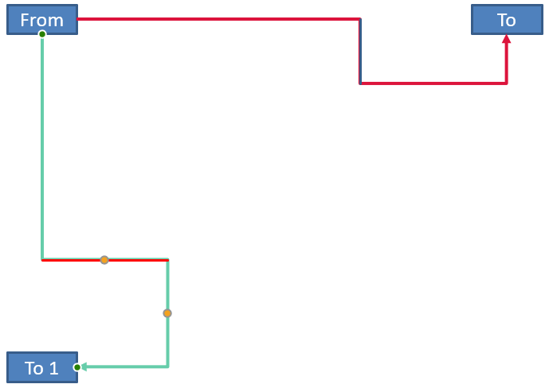

## **Bevezetés**

A PowerPoint összekötő egy speciális vonal, amely két alakzatot kapcsol össze, és a alakzatokhoz rögzítve marad, még akkor is, ha azok egy adott dián mozognak vagy áthelyeződnek. 

Az összekötők általában *kapcsolódási pontokkal* (zöld pontok) vannak összekapcsolva, amelyek alapértelmezés szerint minden alakzaton megtalálhatók. A kapcsolódási pontok megjelennek, amikor a kurzor közel kerül hozzájuk.

*Igazítási pontok* (narancssárga pontok), amelyek csak bizonyos összekötőkön léteznek, a összekötő pozíciójának és alakjának módosítására szolgálnak.

## **Az összekötők típusai**

PowerPointban használhat egyenes, könyök (szögelt) és íves összekötőket. 

Az Aspose.Slides ezeket az összekötőket biztosítja:

| Connector                      | Image                                                        | Igazítási pontok száma |
| ------------------------------ | ------------------------------------------------------------ | --------------------------- |
| `ShapeType.Line`               |       | 0                           |
| `ShapeType.StraightConnector1` |  | 0                           |
| `ShapeType.BentConnector2`     |   | 0                           |
| `ShapeType.BentConnector3`     |     | 1                           |
| `ShapeType.BentConnector4`     |     | 2                           |
| `ShapeType.BentConnector5`     |     | 3                           |
| `ShapeType.CurvedConnector2`   |  | 0                           |
| `ShapeType.CurvedConnector3`   |  | 1                           |
| `ShapeType.CurvedConnector4`   |  | 2                           |
| `ShapeType.CurvedConnector5`   |  | 3                           |

## **Alakzatok összekötése összekötőkkel**

1. Hozzon létre egy példányt a [Presentation](https://reference.aspose.com/slides/hu/net/aspose.slides/presentation/) osztályból.
1. Szerezzen be egy dia hivatkozását az indexén keresztül.
1. Adjon hozzá két [AutoShape](https://reference.aspose.com/slides/hu/net/aspose.slides/autoshape/) elemet a diára a `Shapes` objektum által biztosított `AddAutoShape` metódus használatával.
1. Az `AddConnector` metódus segítségével, amely a `Shapes` objektum által ki van téve, adjon hozzá egy összekötőt a kívánt összekötő típus megadásával.
1. Kösse össze az alakzatokat az összekötővel.
1. Hívja meg a `Reroute` metódust a legrövidebb csatlakozási útvonal alkalmazásához.
1. Mentse el a prezentációt. 

Ez a C# kód bemutatja, hogyan adjon egy összekötőt (egy könyökös összekötőt) két alakzat (egy ellipszis és egy téglalap) között:

```c#
// Létrehozza a PPTX fájlt reprezentáló prezentáció osztály példányát
using (Presentation input = new Presentation())
{                
    // Eléri egy konkrét dia alakzatgyűjteményét
    IShapeCollection shapes = input.Slides[0].Shapes;

    // Ellipszis automatikus alakzatot ad hozzá
    IAutoShape ellipse = shapes.AddAutoShape(ShapeType.Ellipse, 0, 100, 100, 100);

    // Téglalap automatikus alakzatot ad hozzá
    IAutoShape rectangle = shapes.AddAutoShape(ShapeType.Rectangle, 100, 300, 100, 100);

    // Összekötő alakzatot ad a dia alakzatgyűjteményéhez
    IConnector connector = shapes.AddConnector(ShapeType.BentConnector2, 0, 0, 10, 10);

    // Az összekötővel összekapcsolja az alakzatokat
    connector.StartShapeConnectedTo = ellipse;
    connector.EndShapeConnectedTo = rectangle;

    // Meghívja a reroute függvényt, amely automatikusan beállítja a leg rövidebb útvonalat az alakzatok között
    connector.Reroute();

    // Elmenti a prezentációt
    input.Save("Shapes-connector.pptx", SaveFormat.Pptx);
}
```

{} 
`Connector.Reroute` metódus újratervezi az összekötőt, és arra kényszeríti, hogy a lehető legrövidebb útvonalat vegye az alakzatok között. Ennek elérése érdekében a metódus módosíthatja a `StartShapeConnectionSiteIndex` és `EndShapeConnectionSiteIndex` pontokat. 
{} 

## **Kapcsolódási pont megadása**
Ha egy összekötőnek konkrét pontok segítségével kell két alakzatot összekapcsolnia, a kívánt kapcsolódási pontokat a következőképpen adhatja meg:

1. Hozzon létre egy példányt a [Presentation](https://reference.aspose.com/slides/hu/net/aspose.slides/presentation/) osztályból.
1. Szerezzen be egy dia hivatkozását az indexén keresztül.
1. Adjon hozzá két [AutoShape](https://reference.aspose.com/slides/hu/net/aspose.slides/autoshape/) elemet a diára a `Shapes` objektum által biztosított `AddAutoShape` metódus használatával.
1. Az `AddConnector` metódus segítségével, amely a `Shapes` objektum által ki van téve, adjon hozzá egy összekötőt a kívánt összekötő típus megadásával.
1. Kösse össze az alakzatokat az összekötővel.
1. Állítsa be a kívánt kapcsolódási pontokat az alakzatokon.
1. Mentse el a prezentációt.

Ez a C# kód egy olyan műveletet mutat be, ahol egy preferált kapcsolódási pont kerül meghatározásra:

```c#
// Létrehozza a PPTX fájlt reprezentáló prezentáció osztályt
using (Presentation presentation = new Presentation())
{
    // Eléri egy adott dia alakzatgyűjteményét
    IShapeCollection shapes = presentation.Slides[0].Shapes;

    // Összekötő alakzatot ad a dia alakzatgyűjteményéhez
    IConnector connector = shapes.AddConnector(ShapeType.BentConnector3, 0, 0, 10, 10);

    // Ellipszis automatikus alakzat hozzáadása
    IAutoShape ellipse = shapes.AddAutoShape(ShapeType.Ellipse, 0, 100, 100, 100);

    // Téglalap automatikus alakzat hozzáadása
    IAutoShape rectangle = shapes.AddAutoShape(ShapeType.Rectangle, 100, 200, 100, 100);

    // Az összekötővel összekapcsolja az alakzatokat
    connector.StartShapeConnectedTo = ellipse;
    connector.EndShapeConnectedTo = rectangle;

    // Beállítja a kívánt kapcsolódási pont indexét az ellipszis alakzaton
    uint wantedIndex = 6;

    // Ellenőrzi, hogy a kívánt index kisebb-e a maximális pontszámnál
    if (ellipse.ConnectionSiteCount > wantedIndex)
    {
        // Beállítja a kívánt kapcsolódási pontot az ellipszis automatikus alakzaton
        connector.StartShapeConnectionSiteIndex = wantedIndex;
    }

    // Elmenti a prezentációt
    presentation.Save("Connecting_Shape_on_desired_connection_site_out.pptx", SaveFormat.Pptx);
}
```

## **Összekötő pont módosítása**

Módosíthat egy meglévő összekötőt a hozzá tartozó igazítási pontok segítségével. Csak azok az összekötők módosíthatók így, amelyek rendelkeznek igazítási pontokkal. Lásd a táblázatot a **[Az összekötők típusai.](/slides/hu/net/connector/#types-of-connectors)** alatt. 

### **Egyszerű eset**

Tekintsünk egy olyan esetet, ahol egy összekötő két alakzat (A és B) között egy harmadik alakzatot (C) érint:


```c#
Presentation pres = new Presentation();
ISlide sld = pres.Slides[0];
IShape shape = sld.Shapes.AddAutoShape(ShapeType.Rectangle, 300, 150, 150, 75);
IShape shapeFrom = sld.Shapes.AddAutoShape(ShapeType.Rectangle, 500, 400, 100, 50);
IShape shapeTo = sld.Shapes.AddAutoShape(ShapeType.Rectangle, 100, 100, 70, 30);
 
IConnector connector = sld.Shapes.AddConnector(ShapeType.BentConnector5, 20, 20, 400, 300);
 
connector.LineFormat.EndArrowheadStyle = LineArrowheadStyle.Triangle;
connector.LineFormat.FillFormat.FillType = FillType.Solid;
connector.LineFormat.FillFormat.SolidFillColor.Color = Color.Black;
 
connector.StartShapeConnectedTo = shapeFrom;
connector.EndShapeConnectedTo = shapeTo;
connector.StartShapeConnectionSiteIndex = 2;
```

A harmadik alakzat elkerülése vagy megkerülése érdekében a összekötőt úgy módosíthatjuk, hogy a függőleges vonalát balra mozgatjuk:


```c#
IAdjustValue adj2 = connector.Adjustments[1];
adj2.RawValue += 10000;
```

### **Bonyolult esetek** 

Bonyolultabb igazítások elvégzéséhez a következő tényezőket kell figyelembe venni:

* Egy összekötő állítható pontja erősen kapcsolódik egy olyan képlethez, amely kiszámítja és meghatározza a pozícióját. Így a pont helyének módosítása megváltoztathatja az összekötő alakját.
* Az összekötő igazítási pontjai szigorú sorrendben vannak definiálva egy tömbben. Az igazítási pontok számozása az összekötő kezdőpontjától a végpontjáig terjed.
* Az igazítási pont értékek a csatlakozó alakzat szélességének/magasságának százalékát tükrözik. 
  * Az alakzat a csatlakozó kezdő és végpontjaival, 1000-szeresére skálázva határolt. 
  * Az első pont a szélesség százalékát, a második pont a magasság százalékát, a harmadik pont pedig újra a szélesség százalékát határozza meg.
* Az összekötő igazítási pontjainak koordinátáit meghatározó számítások során figyelembe kell venni az összekötő forgását és tükröződését. **Megjegyzés** hogy a **[Az összekötők típusai](/slides/hu/net/connector/#types-of-connectors)** alatt megjelenített összes összekötő forgatási szöge 0.

#### **Eset 1**

Tekintsünk egy olyan esetet, ahol két szövegdoboz objektum kapcsolódik egymáshoz egy összekötőn keresztül:


```c#
// Példányosít egy prezentáció osztályt, amely egy PPTX fájlt képvisel
Presentation pres = new Presentation();
// Lekéri a prezentáció első diáját
ISlide sld = pres.Slides[0];
// Alakzatokat ad hozzá, amelyek egy összekötővel lesznek összekötve
IAutoShape shapeFrom = sld.Shapes.AddAutoShape(ShapeType.Rectangle, 100, 100, 60, 25);
shapeFrom.TextFrame.Text = "From";
IAutoShape shapeTo = sld.Shapes.AddAutoShape(ShapeType.Rectangle, 500, 100, 60, 25);
shapeTo.TextFrame.Text = "To";
// Összekötőt ad hozzá
IConnector connector = sld.Shapes.AddConnector(ShapeType.BentConnector4, 20, 20, 400, 300);
// Megadja az összekötő irányát
connector.LineFormat.EndArrowheadStyle = LineArrowheadStyle.Triangle;
// Megadja az összekötő színét
connector.LineFormat.FillFormat.FillType = FillType.Solid;
connector.LineFormat.FillFormat.SolidFillColor.Color = Color.Crimson;
// Megadja az összekötő vonal vastagságát
connector.LineFormat.Width = 3;

// Az összekötővel összekapcsolja az alakzatokat
connector.StartShapeConnectedTo = shapeFrom;
connector.StartShapeConnectionSiteIndex = 3;
connector.EndShapeConnectedTo = shapeTo;
connector.EndShapeConnectionSiteIndex = 2;

// Lekéri az összekötő igazítási pontjait
IAdjustValue adjValue_0 = connector.Adjustments[0];
IAdjustValue adjValue_1 = connector.Adjustments[1];
```

**Igazítás**

Megváltoztathatjuk az összekötő igazítási pontjainak értékeit úgy, hogy a megfelelő szélességi és magassági százalékokat rendre 20 %‑kal és 200 %‑kal növeljük:

```c#
// Módosítja az igazítási pontok értékeit
adjValue_0.RawValue += 20000;
adjValue_1.RawValue += 200000;
```

Az eredmény:


Ahhoz, hogy egy olyan modellt definiáljunk, amely lehetővé teszi az összekötő egyes részeinek koordinátáinak és alakjának meghatározását, hozzunk létre egy alakzatot, amely a connector.Adjustments[0] pontnál a vízszintes komponensnek felel meg:

```c#
// Rajzolja az összekötő függőleges komponensét

float x = connector.X + connector.Width * adjValue_0.RawValue / 100000;
float y = connector.Y;
float height = connector.Height * adjValue_1.RawValue / 100000;
sld.Shapes.AddAutoShape( ShapeType .Rectangle, x, y, 0, height);
```

Az eredmény:


#### **Eset 2**

**Eset 1**-ben egyszerű összekötő-igazítási műveletet mutattunk be alapelvek használatával. Normál helyzetekben figyelembe kell venni az összekötő forgatását és megjelenítését (amelyeket a connector.Rotation, a connector.Frame.FlipH és a connector.Frame.FlipV állít be). Most bemutatjuk a folyamatot.

Először adjunk egy új szövegdoboz objektumot (**To 1**) a diához (kapcsolódási célból), és hozzunk létre egy új (zöld) összekötőt, amely ezt összeköti a már létrehozott objektumokkal.

```c#
// Létrehoz egy új kötési objektumot
IAutoShape shapeTo_1 = sld.Shapes.AddAutoShape(ShapeType.Rectangle, 100, 400, 60, 25);
shapeTo_1.TextFrame.Text = "To 1";
// Létrehoz egy új összekötőt
connector = sld.Shapes.AddConnector(ShapeType.BentConnector4, 20, 20, 400, 300);
connector.LineFormat.EndArrowheadStyle = LineArrowheadStyle.Triangle;
connector.LineFormat.FillFormat.FillType = FillType.Solid;
connector.LineFormat.FillFormat.SolidFillColor.Color = Color.MediumAquamarine;
connector.LineFormat.Width = 3;
// Az objektumokat az újonnan létrehozott összekötővel kapcsolja össze
connector.StartShapeConnectedTo = shapeFrom;
connector.StartShapeConnectionSiteIndex = 2;
connector.EndShapeConnectedTo = shapeTo_1;
connector.EndShapeConnectionSiteIndex = 3;
// Lekéri az összekötő igazítási pontjait
adjValue_0 = connector.Adjustments[0];
adjValue_1 = connector.Adjustments[1];
// Módosítja az igazítási pontok értékeit 
adjValue_0.RawValue += 20000;
adjValue_1.RawValue += 200000;
```

Az eredmény:


Másodszor hozzunk létre egy alakzatot, amely a vízszintes komponenst reprezentálja az új összekötő connector.Adjustments[0] pontján keresztül. Használjuk a connector.Rotation, connector.Frame.FlipH és connector.Frame.FlipV adatait, és alkalmazzuk a népszerű koordinátakonverziós képletet egy adott x0 pont körüli forgatáshoz:

X = (x — x0) * cos(alpha) — (y — y0) * sin(alpha) + x0;
Y = (x — x0) * sin(alpha) + (y — y0) * cos(alpha) + y0;

A mi esetünkben az objektum forgásszöge 90 fok, és az összekötő függőlegesen jelenik meg, ezért a megfelelő kód:

```c#
// Mentse az összekötő koordinátáit
x = connector.X;
y = connector.Y;
// Korrigálja az összekötő koordinátáit, ha megjelenik
if (connector.Frame.FlipH == NullableBool.True)
{
    x += connector.Width;
}
if (connector.Frame.FlipV == NullableBool.True)
{
    y += connector.Height;
}
// Beveszi az igazítási pont értékét koordinátaként
x += connector.Width * adjValue_0.RawValue / 100000;
//  Átalakítja a koordinátákat, mivel Sin(90) = 1 és Cos(90) = 0
float xx = connector.Frame.CenterX - y + connector.Frame.CenterY;
float yy = x - connector.Frame.CenterX + connector.Frame.CenterY;
// Meghatározza a vízszintes komponens szélességét a második igazítási pont értékével
float width = connector.Height * adjValue_1.RawValue / 100000;
IAutoShape shape = sld.Shapes.AddAutoShape(ShapeType.Rectangle, xx, yy, width, 0);
shape.LineFormat.FillFormat.FillType = FillType.Solid;
shape.LineFormat.FillFormat.SolidFillColor.Color = Color.Red;

```

Az eredmény:



Bemutattuk a egyszerű és a bonyolult (forgásszögekkel rendelkező) igazítási pontok számításait. A megszerzett tudás felhasználásával saját modellt készíthet (vagy kódot írhat), amellyel `GraphicsPath` objektumot kaphat, vagy akár a kapcsolódási pont értékeit meghatározott dia‑koordináták alapján állíthatja be.

## **Az összekötő vonalak szögének meghatározása**
1. Hozzon létre egy példányt a [Presentation](https://reference.aspose.com/slides/hu/net/aspose.slides/presentation/) osztályból.
1. Szerezzen be egy dia hivatkozását az indexén keresztül.
1. Érje el az összekötő vonalas alakzatot.
1. Használja a vonal szélességét, magasságát, az alakzat keretmagasságát és keretszélességét a szög kiszámításához.

```c#
public static void Run()
{
    Presentation pres = new Presentation("ConnectorLineAngle.pptx");
    Slide slide = (Slide)pres.Slides[0];
    Shape shape;
    for (int i = 0; i < slide.Shapes.Count; i++)
    {
        double dir = 0.0;
        shape = (Shape)slide.Shapes[i];
        if (shape is AutoShape)
        {
            AutoShape ashp = (AutoShape)shape;
            if (ashp.ShapeType == ShapeType.Line)
            {
                dir = getDirection(ashp.Width, ashp.Height, Convert.ToBoolean(ashp.Frame.FlipH), Convert.ToBoolean(ashp.Frame.FlipV));
            }
        }
        else if (shape is Connector)
        {
            Connector ashp = (Connector)shape;
            dir = getDirection(ashp.Width, ashp.Height, Convert.ToBoolean(ashp.Frame.FlipH), Convert.ToBoolean(ashp.Frame.FlipV));
        }

        Console.WriteLine(dir);
    }

}
public static double getDirection(float w, float h, bool flipH, bool flipV)
{
    float endLineX = w * (flipH ? -1 : 1);
    float endLineY = h * (flipV ? -1 : 1);
    float endYAxisX = 0;
    float endYAxisY = h;
    double angle = (Math.Atan2(endYAxisY, endYAxisX) - Math.Atan2(endLineY, endLineX));
    if (angle < 0) angle += 2 * Math.PI;
    return angle * 180.0 / Math.PI;
}
```

## **FAQ**

**Hogyan tudom megállapítani, hogy egy összekötő "ragasztható"-e egy adott alakzathoz?**

Ellenőrizze, hogy az alakzat rendelkezik-e [kapcsolódási pontokkal](https://reference.aspose.com/slides/hu/net/aspose.slides/shape/connectionsitecount/). Ha nincs, vagy a szám nulla, a ragasztás nem lehetséges; ebben az esetben használjon szabad végpontokat, és helyezze el őket manuálisan. Érdemes a pontok számát ellenőrizni a csatlakoztatás előtt.

**Mi történik az összekötővel, ha törlök egy a kapcsolódott alakzatok közül?**

A végei leválasztásra kerülnek; az összekötő a dián egy szabad kezdő/vegpontú egyszerű vonalként marad. Törölheti, vagy újra hozzárendelheti a kapcsolatokat, és szükség esetén [újra tervezheti](https://reference.aspose.com/slides/hu/net/aspose.slides/connector/reroute/).

**Megmaradnak az összekötő kapcsolatok, ha egy diát egy másik prezentációba másolok?**

Általában igen, ha a cél alakzatok is másolásra kerülnek. Ha a dia egy másik fájlba kerül a kapcsolódó alakzatok nélkül, a végek szabadokká válnak, és újra kell csatlakoztatni őket.