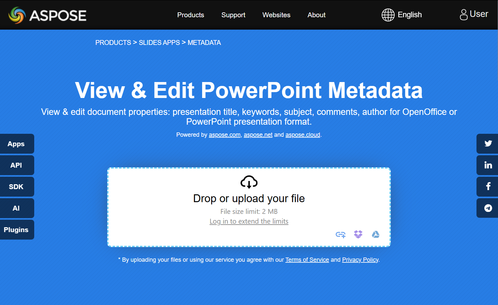

## **Bevezetés**

Az Aspose.Slides for .NET két típusú dokumentumtulajdonságot támogat: **Beépített** és **Egyéni**. Mindkét tulajdonság típus könnyen elérhető és kezelhető az Aspose.Slides for .NET API használatával.

Az Aspose.Slides lehetővé teszi, hogy a bemutató dokumentumtulajdonságokkal a [IDocumentProperties](https://reference.aspose.com/slides/hu/net/aspose.slides/idocumentproperties/) interfészen keresztül dolgozzon. Ennek az interfésznek egy példányát a [IPresentation.DocumentProperties](https://reference.aspose.com/slides/hu/net/aspose.slides/ipresentation/documentproperties/) adja vissza. A következő példák bemutatják, hogyan olvashatók, módosíthatók és kezelhetők ezek a tulajdonságok.

{}
Kérjük, vegye figyelembe, hogy a **Application** és **Producer** mezők nem módosíthatók, mivel ezek a mezők mindig az "Aspose Ltd." és az "Aspose.Slides for .NET x.x.x" értékeket jelenítik meg.
{} 

## **Bemutató tulajdonságainak kezelése**

A Microsoft PowerPoint lehetővé teszi, hogy a bemutatófájlokhoz tulajdonságokat adjon hozzá. Ezek a dokumentumtulajdonságok lehetővé teszik hasznos információk tárolását a fájlokkal együtt. Két típusú dokumentumtulajdonság létezik:

- Rendszer által definiált (beépített) tulajdonságok
- Felhasználó által definiált (egyéni) tulajdonságok

**Beépített** tulajdonságok általános információkat tartalmaznak a dokumentumról, például a dokumentum címét, a szerző nevét, a dokumentum statisztikáit és egyebeket.

**Egyéni** tulajdonságokat a felhasználók **Név/Érték** párok formájában definiálnak, ahol a név és az érték is a felhasználó által van megadva.

Az Aspose.Slides for .NET használatával a fejlesztők hozzáférhetnek és módosíthatják mind a beépített, mind az egyéni tulajdonságokat.

A Microsoft PowerPoint lehetővé teszi a felhasználók számára a dokumentumtulajdonságok kezelését az Office ikonra kattintva, majd a **File → Info → Properties** menüpont kiválasztásával. Az **Advanced Properties** kiválasztása után egy párbeszédablak jelenik meg, ahol a bemutatófájl összes dokumentumtulajdonságát kezelheti.

A **Properties** párbeszédablakban több lap található, például **General**, **Summary**, **Statistics**, **Contents** és **Custom**.  
Minden lap lehetőséget biztosít a PowerPoint fájlhoz kapcsolódó konkrét típusú információk konfigurálására. Az **Custom** lapot a felhasználó által definiált tulajdonságok kezelése szolgálja.

## **Nyilvános tulajdonságok olvasása titkosított bemutatóból**

A nyitó jelszó általában védi a bemutató tartalmát és a dokumentumtulajdonságokat is. Ha egy bemutató titkosítva van a [IProtectionManager.EncryptDocumentProperties](https://reference.aspose.com/slides/hu/net/aspose.slides/iprotectionmanager/encryptdocumentproperties/) `false` értékkel, a dokumentumtulajdonságai nyilvános maradnak. Egy alkalmazás ekkor a [LoadOptions.OnlyLoadDocumentProperties](https://reference.aspose.com/slides/hu/net/aspose.slides/loadoptions/onlyloaddocumentproperties/) értékét `true`-ra állíthatja, és a nyilvános metaadatokat a nyitó jelszó megadása nélkül olvashatja.

`OnlyLoadDocumentProperties` szabályozza, hogy az Aspose.Slides mit tölt be; semmit sem titkosít vissza. Ha a tulajdonságok a titkosítás részei voltak, a jelszó nélkül történő betöltés sikertelen. Ha a bemutató nincs titkosítva, a beállítást figyelmen kívül hagyja, és a teljes bemutató betöltődik.

A következő példa ellenőrzi a betöltési módot a [IProtectionManager.IsOnlyDocumentPropertiesLoaded](https://reference.aspose.com/slides/hu/net/aspose.slides/iprotectionmanager/isonlydocumentpropertiesloaded/) segítségével, majd a beépített tulajdonságokat a [IPresentation.DocumentProperties](https://reference.aspose.com/slides/hu/net/aspose.slides/ipresentation/documentproperties/) használatával olvasa:

```csharp
using System;
using Aspose.Slides;

var loadOptions = new LoadOptions { OnlyLoadDocumentProperties = true };
using var presentation = new Presentation("public-properties-encrypted.pptx", loadOptions);

if (presentation.ProtectionManager.IsOnlyDocumentPropertiesLoaded)
{
    var properties = presentation.DocumentProperties;

    Console.WriteLine("Author: " + properties.Author);
    Console.WriteLine("Title: " + properties.Title);
    Console.WriteLine("Keywords: " + properties.Keywords);
}
else
{
    Console.WriteLine("The presentation was not loaded in document-properties-only mode.");
}
```

Ebben a módban a diák tartalma nem töltődik be. A diák, mesterdiák, elrendezések, alakzatok, média és egyéb bemutató objektumok nem állnak rendelkezésre. Az alkalmazásoknak mindig ellenőrizniük kell az `IsOnlyDocumentPropertiesLoaded` értékét, mielőtt olyan műveletet hajtanának végre, amely a teljes bemutató objektummodellt igényli.

{}
A nyilvános metaadatok felfedhetik a szerzők nevét, címeket, tárgyakat, kulcsszavakat, céginformációkat, megjegyzéseket és egyéni értékeket. Titkosítsa az érzékeny tulajdonságokat együtt a bemutatóval. Csak akkor hagyja őket nyilvánosnak, ha indexelés, osztályozás, keresés vagy dokumentumkezelő rendszereknek konkrét igénye van a jelszó nélküli hozzáférésre.
{}

## **Titkosított bemutató tulajdonságainak frissítése**

Titkosított PPTX fájl esetén a `OnlyLoadDocumentProperties` beállítással betöltött bemutató a nyilvános metaadatok olvasására szolgál. Az Aspose.Slides nem tudja menteni a módosított tulajdonságokat ebből a csak metaadatot tartalmazó objektumból, mivel a nyilvános tulajdonságoknak összhangban kell lenniük a titkosított bemutató belső adataival. Ennek frissítéséhez ezért helyes nyitó jelszó és a teljes betöltés szükséges.

A következő példa a [LoadOptions.Password](https://reference.aspose.com/slides/hu/net/aspose.slides/loadoptions/password/) használatával nyitja meg a bemutatót, frissíti a nyilvános beépített tulajdonságokat, és elmenti az eredményt. Ezután a [IPresentationInfo.IsEncrypted](https://reference.aspose.com/slides/hu/net/aspose.slides/ipresentationinfo/isencrypted/) segítségével ellenőrzi, hogy a titkosítás megmaradt-e, és jelszó nélkül újra megnyitja a nyilvános metaadatokat az új értékek ellenőrzéséhez:

```csharp
using System;
using Aspose.Slides;
using Aspose.Slides.Export;

const string inputPath = "public-properties-encrypted.pptx";
const string outputPath = "updated-public-properties-encrypted.pptx";

{
    var loadOptions = new LoadOptions { Password = "open_password" };
    using var presentation = new Presentation(inputPath, loadOptions);

    presentation.DocumentProperties.Title = "Updated Product Roadmap";
    presentation.DocumentProperties.Keywords = "roadmap, planning, indexed";
    presentation.Save(outputPath, SaveFormat.Pptx);
}

var presentationInfo = PresentationFactory.Instance.GetPresentationInfo(outputPath);
Console.WriteLine("The presentation is encrypted: " + presentationInfo.IsEncrypted);

var metadataLoadOptions = new LoadOptions { OnlyLoadDocumentProperties = true };
using var metadataPresentation = new Presentation(outputPath, metadataLoadOptions);

if (metadataPresentation.ProtectionManager.IsOnlyDocumentPropertiesLoaded)
{
    Console.WriteLine("Title: " + metadataPresentation.DocumentProperties.Title);
    Console.WriteLine("Keywords: " + metadataPresentation.DocumentProperties.Keywords);
}
else
{
    Console.WriteLine("The presentation was not loaded in document-properties-only mode.");
}
```

Ha egy alkalmazás nem jogosult a bemutató tartalmát visszafejteni vagy betölteni, a titkosított PPTX fájl nyilvános tulajdonságait csak olvashatóként kell kezelnie.

## **Beépített tulajdonságok elérése**

Ezeket a tulajdonságokat a [IDocumentProperties](https://reference.aspose.com/slides/hu/net/aspose.slides/idocumentproperties/) interfész teszi elérhetővé, és a következőket tartalmazzák: **Creator** (Szerző), **Description**, **Keywords**, **Created** (Létrehozás dátuma), **Modified** (Módosítás dátuma), **Printed** (Legutóbbi nyomtatás dátuma), **LastModifiedBy**, **SharedDoc** (megmutatja, hogy a dokumentum több különböző készítő között meg van-e osztva), **PresentationFormat**, **Subject**, **Title** és egyebek.

```cs
using Aspose.Slides;

// Példányosítja a Presentation osztályt, amely egy prezentációs fájlt képvisel.
using Presentation presentation = new Presentation("AccessBuiltInProperties.pptx");

// Lekéri a prezentációhoz kapcsolódó IDocumentProperties típusú objektum hivatkozását.
IDocumentProperties documentProperties = presentation.DocumentProperties;

// Megjeleníti a beépített tulajdonságokat.
Console.WriteLine("Category : " + documentProperties.Category);
Console.WriteLine("Content status : " + documentProperties.ContentStatus);
Console.WriteLine("Creation date : " + documentProperties.CreatedTime);
Console.WriteLine("Author : " + documentProperties.Author);
Console.WriteLine("Comments : " + documentProperties.Comments);
Console.WriteLine("Key words : " + documentProperties.Keywords);
Console.WriteLine("Last modified by : " + documentProperties.LastSavedBy);
Console.WriteLine("Manager : " + documentProperties.Manager);
Console.WriteLine("Modified date : " + documentProperties.LastSavedTime);
Console.WriteLine("Presentation format : " + documentProperties.PresentationFormat);
Console.WriteLine("Last print date : " + documentProperties.LastPrinted);
Console.WriteLine("Is shared between producers : " + documentProperties.SharedDoc);
Console.WriteLine("Subject : " + documentProperties.Subject);
Console.WriteLine("Title : " + documentProperties.Title);
```

## **Beépített tulajdonságok módosítása**

A bemutató fájlok beépített tulajdonságainak módosítása ugyanolyan egyszerű, mint azok elérése. Egyszerűen egy karakterláncot adhat meg bármely kívánt tulajdonságnak, és a tulajdonság értéke frissülni fog. Az alábbi példában bemutatjuk, hogyan módosíthatja egy prezentáció beépített dokumentumtulajdonságait.

```cs
using Aspose.Slides;
using Aspose.Slides.Export;

// Példányosítja a Presentation osztályt, amely egy prezentációs fájlt képvisel.
using Presentation presentation = new Presentation("ModifyBuiltInProperties.pptx");

// Lekéri a prezentációhoz kapcsolódó IDocumentProperties típusú objektum hivatkozását.
IDocumentProperties documentProperties = presentation.DocumentProperties;

// Beállítja a beépített tulajdonságokat.
documentProperties.Author = "Aspose.Slides for .NET";
documentProperties.Title = "Manage PowerPoint Presentation Properties";
documentProperties.Subject = "Modify Built-in Properties";
documentProperties.Comments = "Aspose description";
documentProperties.Manager = "Aspose manager";

// Mentse a prezentációt egy fájlba.
presentation.Save("DocumentProperties_output.pptx", SaveFormat.Pptx);
```

## **Egyéni bemutató tulajdonságok hozzáadása**

Az egyéni bemutató tulajdonságok lehetővé teszik a fejlesztők számára, hogy további metaadatokat vagy konkrét információkat tároljanak egy bemutató fájlban. Az Aspose.Slides egyszerűvé teszi ezen egyéni tulajdonságok programozott létrehozását és kezelését. A következő példák bemutatják, hogyan adhat egyéni tulajdonságokat a bemutatóihoz.

```cs
using Aspose.Slides;
using Aspose.Slides.Export;

// Példányosítja a Presentation osztályt.
using Presentation presentation = new Presentation();

// Lekéri a prezentációhoz kapcsolódó IDocumentProperties típusú objektum hivatkozását.
IDocumentProperties documentProperties = presentation.DocumentProperties;

// Egyéni tulajdonságok hozzáadása.
documentProperties["Reviewed by"] = "John Smith";
documentProperties["Confidentiality level"] = "Internal";
documentProperties["Document version"] = 2;

// A prezentáció mentése fájlba.
presentation.Save("CustomDocumentProperties_output.pptx", SaveFormat.Pptx);
```

## **Egyéni tulajdonságok elérése és módosítása**

Az Aspose.Slides lehetővé teszi a fejlesztők számára, hogy meglévő egyéni tulajdonságokhoz hozzáférjenek és értékeiket egyszerűen módosítsák. Ez a funkció segít a pontos metaadatok fenntartásában és támogatja a felhasználói bevitel vagy üzleti logika alapján történő dinamikus frissítéseket. Az alábbi példák bemutatják, hogyan lehet lekérni és frissíteni egyéni tulajdonságok értékeit egy bemutatóban.

```cs
using Aspose.Slides;
using Aspose.Slides.Export;

// Példányosítja a Presentation osztályt, amely egy PPTX fájlt képvisel.
using Presentation presentation = new Presentation("AccessAndModifyProperties.pptx");

// Lekéri a prezentációhoz kapcsolódó IDocumentProperties típusú objektum hivatkozását.
IDocumentProperties documentProperties = presentation.DocumentProperties;

// Egyéni tulajdonságok elérése és módosítása.
for (int i = 0; i < documentProperties.CountOfCustomProperties; i++)
{
    string propertyName = documentProperties.GetCustomPropertyName(i);
    object propertyValue = documentProperties[propertyName];

    // Kiírja az egyéni tulajdonság nevét és értékét.
    Console.WriteLine("Custom property name : " + propertyName);
    Console.WriteLine("Custom property value : " + propertyValue);

    // Módosítja az egyéni tulajdonság értékét.
    documentProperties[propertyName] = "New Value " + (i + 1);
}

// A prezentáció mentése fájlba.
presentation.Save("CustomProperties_output.pptx", SaveFormat.Pptx);
```

## **Élő példa**

Próbálja ki a [**View & Edit PowerPoint Metadata**](https://products.aspose.app/slides/hu/metadata) online alkalmazást, hogy lássa, hogyan dolgozhat a dokumentumtulajdonságokkal az Aspose.Slides API segítségével:

[](https://products.aspose.app/slides/hu/metadata)

## **GYIK**

**Hogyan távolíthatok el egy beépített tulajdonságot a bemutatóból?**

A beépített tulajdonságok szerves részei a bemutatónak, és nem távolíthatók el teljesen. Azonban megváltoztathatja az értéküket, vagy ha a konkrét tulajdonság megengedi, beállíthatja őket üresre.

**Mi történik, ha olyan egyéni tulajdonságot adok hozzá, amely már létezik?**

Ha olyan egyéni tulajdonságot ad hozzá, amely már létezik, a meglévő értéke felülíródik az újjal. Nem szükséges előre eltávolítani vagy ellenőrizni a tulajdonságot, mivel az Aspose.Slides automatikusan frissíti a tulajdonság értékét.

**El tudok-e érni bemutató tulajdonságokat anélkül, hogy teljesen betölteném a bemutatót?**

Igen. Használja a [PresentationFactory.GetPresentationInfo](https://reference.aspose.com/slides/hu/net/aspose.slides/presentationfactory/getpresentationinfo/) metódust, majd a [IPresentationInfo.ReadDocumentProperties](https://reference.aspose.com/slides/hu/net/aspose.slides/ipresentationinfo/readdocumentproperties/) segítségével olvassa el a tárolt dokumentum metaadatokat anélkül, hogy [Presentation](https://reference.aspose.com/slides/hu/net/aspose.slides/presentation/) példányt hozna létre. Tekintse meg a [Build a Lightweight Presentation Inventory](/slides/hu/net/examine-presentation/) oldalt egy teljes jelentési példa és formátum‑specifikus korlátozások megismeréséhez.

**Olvashatok-e nyilvános tulajdonságokat egy titkosított bemutatóból a nyitó jelszó megadása nélkül?**

Igen. A bemutatónak úgy kell titkosítva lennie, hogy az `EncryptDocumentProperties` `false` legyen, és a betöltéskor az `OnlyLoadDocumentProperties` `true` legyen.

**Frissíthetek‑e egy titkosított PPTX fájlt csak dokumentumtulajdonságok módjában?**

Nem. A nyilvános és titkosított tulajdonság adatoknak összhangban kell maradniuk, ezért egy titkosított PPTX fájl frissítéséhez a teljes bemutatót kell betölteni a megfelelő nyitó jelszóval.