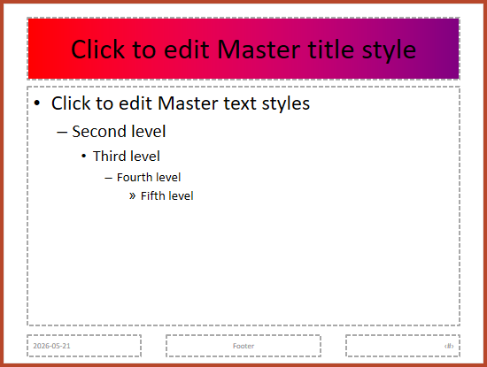

## **Áttekintés**

Egy **slide master** meghatározza a megosztott tervezési beállításokat egy diacsoport számára. Tartalmazhat közös alakzatokat, logókat, háttereket, szövegstílusokat, téma-beállításokat és lábléc-beállításokat. A PowerPointban a slide master szerkesztése a szokásos módja annak, hogy egy prezentáció konzisztens maradjon anélkül, hogy minden dián ugyanazt a formázást kellene ismételni.

Az Aspose.Slides for .NET ugyanazt a modellt támogatja. Egy prezentáció egy vagy több master diát tartalmazhat, és minden master dia több layout diát tartalmazhat. A normál diák általában nem hivatkoznak közvetlenül egy master diára. Ehelyett egy normál dia egy layout diát használ, és ez a layout dia egy master diához tartozik.

A hierarchia:

1. **Slide master** – meghatározza a megosztott tervezést és témát.  
2. **Layout slide** – meghatározza a helyőrzők és a layout‑szintű formázás adott elrendezését.  
3. **Normal slide** – a tényleges prezentációs tartalmat tartalmazza, és egy layout diát használ.


Az Aspose.Slidesban egy slide master a [IMasterSlide](https://reference.aspose.com/slides/hu/net/aspose.slides/imasterslide/) interfész által van megjelenítve. A prezentáció összes master diája a [Presentation.Masters](https://reference.aspose.com/slides/hu/net/aspose.slides/presentation/masters/) gyűjteményen keresztül érhető el, amely megvalósítja az [IMasterSlideCollection](https://reference.aspose.com/slides/hu/net/aspose.slides/imasterslidecollection/) interfészt.

{}
Amikor ugyanaz a tulajdonság több szinten is definiálva van, a specifikusabb szint nyer. Például, ha egy master dia és egy layout dia is háttérszínt határoz meg, a layoutot használó diák a layout háttérszínét alkalmazzák. Az elrendezési diákról további információkat a [Apply or Change Slide Layouts](/slides/hu/net/slide-layout/) oldalon talál.
{}

## **Slide Masterok elérése**

PowerPointban a **View** > **Slide Master** menüből nyitható meg a Slide Master nézet.


Az Aspose.Slidesban a `Masters` gyűjteményt kell használni a master diák eléréséhez:

```csharp
using Aspose.Slides;

using var presentation = new Presentation("presentation.pptx");

var firstMasterSlide = presentation.Masters[0];
var masterSlideCount = presentation.Masters.Count;
var firstMasterLayoutSlideCount = firstMasterSlide.LayoutSlides.Count;

Console.WriteLine("Master slides: " + masterSlideCount);
Console.WriteLine("Layouts in the first master: " + firstMasterLayoutSlideCount);
```

A normál dia által használt master diát a saját layoutján keresztül is lekérhetjük:

```csharp
using Aspose.Slides;

using var presentation = new Presentation("presentation.pptx");

var slide = presentation.Slides[0];
var layoutSlide = slide.LayoutSlide;
var masterSlide = layoutSlide.MasterSlide;
var masterSlideName = masterSlide.Name;

Console.WriteLine(masterSlideName);
```

## **Mi található egy Slide Masterban**

A master dia egy diához hasonló objektum. Implementálja a [IBaseSlide](https://reference.aspose.com/slides/hu/net/aspose.slides/ibaseslide/) interfészt, így sok közös diatulajdonságot tesz elérhetővé, amelyeket a normál és layout diák is használnak. A master‑specifikus tagok a [IMasterSlide](https://reference.aspose.com/slides/hu/net/aspose.slides/imasterslide/) API‑oldalon vannak felsorolva.

A leggyakrabban használt master dia tagok:

| Tag | Cél |
| --- | --- |
| `Background` | A master‑szintű dia háttér beállítása. |
| `Shapes` | A masterre elhelyezett alakzatok tárolása, például logók, képkockák és megosztott szöveg. |
| `LayoutSlides` | A masterhez tartozó layout diák tárolása. |
| `ThemeManager` | Hozzáférést biztosít a master téma API‑khoz. |
| `HeaderFooterManager` | Fejléc, lábléc, dátum és dia‑szám vezérlése a master és annak gyermek‑layoutjai számára. |
| `GetDependingSlides` | Visszaadja azokat a normál diákat, amelyek a masteren keresztül a layoutjaik miatt függnek tőle. |

## **Kép hozzáadása egy Slide Masterhez**

Amikor képet adunk egy master diához, az a master‑layoutot használó diákon is megjelenik. Ez hasznos logók, vízjelekkel, dekoratív sávokkal és más ismétlődő vizuális elemekkel.

Az alábbi példa egy logót ad az első master diához:

```csharp
using Aspose.Slides;
using Aspose.Slides.Export;

using var presentation = new Presentation("presentation.pptx");

var masterSlide = presentation.Masters[0];
var logoBytes = File.ReadAllBytes("logo.png");
var logoImage = presentation.Images.AddImage(logoBytes);

masterSlide.Shapes.AddPictureFrame(
    ShapeType.Rectangle,
    x: 20,
    y: 20,
    width: 80,
    height: 80,
    image: logoImage);

presentation.Save("presentation-with-logo.pptx", SaveFormat.Pptx);
```

A képkeretekről további információt a [Picture Frame](/slides/hu/net/picture-frame/) oldalon talál.

## **A master grafika láthatóságának vezérlése**

Az örökölt master grafika (például logók vagy dekoratív alakzatok) elrejtéséhez a [IBaseSlide.ShowMasterShapes](https://reference.aspose.com/slides/hu/net/aspose.slides/ibaseslide/showmastershapes/) használható, anélkül, hogy törölnénk őket a masterről. Az adott dián állítsd a [Slide.ShowMasterShapes](https://reference.aspose.com/slides/hu/net/aspose.slides/slide/showmastershapes/) értékét `false`‑ra, ha el akarod rejteni a grafikát, és `true`‑ra, ha meg akarod jeleníteni.

Az alábbi önálló példa egy kék dekoratív sávot hoz létre egy masteren, és két diát, amelyek ugyanazt az üres layoutot használják. A sáv látható az első dián, a másodikon rejtve. Nincs bemeneti prezentáció vagy kép szükséges.

```csharp
using System.Drawing;
using Aspose.Slides;
using Aspose.Slides.Export;

using var presentation = new Presentation();
var masterSlide = presentation.Masters[0];
var layoutSlide = masterSlide.LayoutSlides.GetByType(SlideLayoutType.Blank);
layoutSlide.ShowMasterShapes = true;

var slideHeight = presentation.SlideSize.Size.Height;
var band = masterSlide.Shapes.AddAutoShape(ShapeType.Rectangle, 0, 0, 60, slideHeight);
band.FillFormat.FillType = FillType.Solid;
band.FillFormat.SolidFillColor.Color = Color.SteelBlue;
band.LineFormat.FillFormat.FillType = FillType.NoFill;

var visibleSlide = presentation.Slides[0];
visibleSlide.LayoutSlide = layoutSlide;
visibleSlide.Shapes.Clear();

var hiddenSlide = presentation.Slides.AddEmptySlide(layoutSlide);

visibleSlide.ShowMasterShapes = true;
hiddenSlide.ShowMasterShapes = false;

presentation.Save("master-graphics.pptx", SaveFormat.Pptx);
```

A példa a **Blank** layoutot használja egy új prezentációból, és eltávolítja az első dia saját helyőrzőit.

### **A beállítás hatókörének kiválasztása**

Egy normál dia a masterét a [ISlide.LayoutSlide](https://reference.aspose.com/slides/hu/net/aspose.slides/islide/layoutslide/) és a [ILayoutSlide.MasterSlide](https://reference.aspose.com/slides/hu/net/aspose.slides/ilayoutslide/masterslide/) segítségével használja. Az egyes dián végzett beállítás csak azon a dián hat. Ha a [LayoutSlide.ShowMasterShapes](https://reference.aspose.com/slides/hu/net/aspose.slides/layoutslide/showmastershapes/) értékét `false`‑ra állítod, a master grafika el lesz rejtve minden olyan dián, amely azt a közös layoutot használja, még akkor is, ha saját beállításuk `true`. Csak egy dián szeretnél grafikát elrejteni, akkor módosítsd a dia tulajdonságát, és hagyd változatlanul a közös layoutot.

A beállítás nem támogatott láthatóság‑vezérlőként a master dián magán. A masteren mindig `false`‑t ad vissza, a `true` érték hozzárendelése `NotSupportedException`‑t vált ki. Alkalmazd normál dián vagy layouton.

### **Grafika és háttér megkülönböztetése**

| Művelet | Hatás |
| --- | --- |
| Master grafika elrejtése | Az örökölt master alakzatok láthatóságának vezérlése a törlés vagy a dia saját alakzatainak módosítása nélkül. |
| Dia háttér kitöltésének módosítása | A háttér színét, színátmenetét vagy képét változtatja. A master grafika különálló alakzat, és látható maradhat a háttér felett. Lásd a [Presentation Background](/slides/hu/net/presentation-background/). |
| Alakzat törlése a masterről | A megosztott forrásalkot eltávolítja, ezért már nem lesz elérhető semelyik, a mastert használó dián sem. |

## **Helyőrzők kezelése**

A helyőrzőket általában a layout diák definiálják. A master dia biztosítja a megosztott stílust és témát, amelyet a layoutok örökölnek, míg minden layout dönti el, hogy mely helyőrzők érhetők el és hová kerülnek.

PowerPointban a helyőrzőparancsok a Slide Master nézetben érhetők el.


Új helyőrzők hozzáadásához az Aspose.Slidesban dolgozz a masterhez tartozó layout diával:

```csharp
using Aspose.Slides;
using Aspose.Slides.Export;

using var presentation = new Presentation("presentation.pptx");

var masterSlide = presentation.Masters[0];
var blankLayoutSlide =
    masterSlide.LayoutSlides.GetByType(SlideLayoutType.Blank) ??
    masterSlide.LayoutSlides.Add(SlideLayoutType.Blank, "Blank");

blankLayoutSlide.PlaceholderManager.AddTextPlaceholder(
    x: 60,
    y: 120,
    width: 600,
    height: 80);

presentation.Slides.AddEmptySlide(blankLayoutSlide);
presentation.Save("presentation-with-placeholder.pptx", SaveFormat.Pptx);
```

Már létező helyőrzőalakzatokat is formázhatsz egy master dián. Az alábbi példa megtalálja a cím helyőrzőt, és lineáris színátmenetes kitöltést alkalmaz rá:

```csharp
using System.Drawing;
using Aspose.Slides;
using Aspose.Slides.Export;

using var presentation = new Presentation("presentation.pptx");

var masterSlide = presentation.Masters[0];
var titlePlaceholder = FindPlaceholder(masterSlide, PlaceholderType.Title);

if (titlePlaceholder != null)
{
    var redGradientColor = Color.FromArgb(255, 0, 0);
    var purpleGradientColor = Color.FromArgb(128, 0, 128);

    titlePlaceholder.FillFormat.FillType = FillType.Gradient;
    titlePlaceholder.FillFormat.GradientFormat.GradientShape = GradientShape.Linear;
    titlePlaceholder.FillFormat.GradientFormat.GradientStops.Add(0, redGradientColor);
    titlePlaceholder.FillFormat.GradientFormat.GradientStops.Add(255, purpleGradientColor);
}

presentation.Save("presentation-title-style.pptx", SaveFormat.Pptx);

static IAutoShape? FindPlaceholder(IMasterSlide masterSlide, PlaceholderType placeholderType)
{
    foreach (var shape in masterSlide.Shapes)
    {
        if (shape is IAutoShape { Placeholder: not null } autoShape &&
            autoShape.Placeholder.Type == placeholderType)
        {
            return autoShape;
        }
    }

    return null;
}
```



További helyőrző- és szövegformázási lehetőségekért lásd a [Set Prompt Text in Placeholder](/slides/hu/net/manage-placeholder/) és a [Text Formatting](/slides/hu/net/text-formatting/) oldalakat.

## **Slide Master háttér módosítása**

A master háttér azokat a layoutokat és diákot örökli, amelyek nem írják felül. Az alábbi példa egy szilárd háttérszínt állít be az első master diára:

```csharp
using System.Drawing;
using Aspose.Slides;
using Aspose.Slides.Export;

using var presentation = new Presentation("presentation.pptx");

var masterSlide = presentation.Masters[0];

masterSlide.Background.Type = BackgroundType.OwnBackground;
masterSlide.Background.FillFormat.FillType = FillType.Solid;
masterSlide.Background.FillFormat.SolidFillColor.Color = Color.ForestGreen;

presentation.Save("presentation-master-background.pptx", SaveFormat.Pptx);
```

Kapcsolódó témák: [Presentation Background](/slides/hu/net/presentation-background/) és [Presentation Theme](/slides/hu/net/presentation-theme/).

## **Slide Master klónozása egy másik prezentációba**

Az [IMasterSlideCollection.AddClone](https://reference.aspose.com/slides/hu/net/aspose.slides/imasterslidecollection/addclone/) használatával egy master diát másik prezentációba másolhatod. A másolt master ezután a célprezentáció layoutjai és diái számára is használható.

```csharp
using Aspose.Slides;
using Aspose.Slides.Export;

using var sourcePresentation = new Presentation("source.pptx");
using var destinationPresentation = new Presentation("destination.pptx");

var sourceMasterSlide = sourcePresentation.Masters[0];
var clonedMasterSlide = destinationPresentation.Masters.AddClone(sourceMasterSlide);

destinationPresentation.Save("destination-with-master.pptx", SaveFormat.Pptx);
```

Ha a normál diákot a saját masterével együtt kell klónozni, lásd a [Clone Slides](/slides/hu/net/clone-slides/) oldalt.

## **Több Slide Master hozzáadása**

Egy prezentáció több master diát is tartalmazhat. Ez akkor hasznos, ha különböző szakaszok különböző márkaarculatot, oldalszerkezetet vagy téma‑beállításokat igényelnek.


Az alábbi példa klónozza az alapértelmezett mastert, a klónnak más háttérszínt ad, létrehoz egy layoutot a klónozott master alatt, és egy új diát ad hozzá, amely ezt a layoutot használja:

```csharp
using System.Drawing;
using Aspose.Slides;
using Aspose.Slides.Export;

using var presentation = new Presentation("presentation.pptx");

var defaultMasterSlide = presentation.Masters[0];
var sectionMasterSlide = presentation.Masters.AddClone(defaultMasterSlide);

sectionMasterSlide.Background.Type = BackgroundType.OwnBackground;
sectionMasterSlide.Background.FillFormat.FillType = FillType.Solid;
sectionMasterSlide.Background.FillFormat.SolidFillColor.Color = Color.LightSteelBlue;

var sourceBlankLayout =
    defaultMasterSlide.LayoutSlides.GetByType(SlideLayoutType.Blank) ??
    defaultMasterSlide.LayoutSlides[0];
var sectionBlankLayout = sectionMasterSlide.LayoutSlides.AddClone(sourceBlankLayout);

presentation.Slides.AddEmptySlide(sectionBlankLayout);
presentation.Save("presentation-with-multiple-masters.pptx", SaveFormat.Pptx);
```

## **Slide Masterok összehasonlítása**

A master diák összehasonlíthatók az [IBaseSlide](https://reference.aspose.com/slides/hu/net/aspose.slides/ibaseslide/) által örökölt `Equals` metódussal. Az összehasonlítás a struktúrát és a statikus tartalmat ellenőrzi, például alakzatokat, szöveget, formázást, animációkat és egyéb dia‑beállításokat. Nem hasonlítja össze az egyedi azonosítókat, mint a dia‑ID‑k, vagy a dinamikus helyőrzőértékeket, mint az aktuális dátum.

```csharp
using Aspose.Slides;

using var firstPresentation = new Presentation("first.pptx");
using var secondPresentation = new Presentation("second.pptx");

var firstPresentationMasterCount = firstPresentation.Masters.Count;
var secondPresentationMasterCount = secondPresentation.Masters.Count;

for (var firstMasterIndex = 0; firstMasterIndex < firstPresentationMasterCount; firstMasterIndex++)
{
    for (var secondMasterIndex = 0; secondMasterIndex < secondPresentationMasterCount; secondMasterIndex++)
    {
        var firstMasterSlide = firstPresentation.Masters[firstMasterIndex];
        var secondMasterSlide = secondPresentation.Masters[secondMasterIndex];
        var areMasterSlidesEqual = firstMasterSlide.Equals(secondMasterSlide);

        if (areMasterSlidesEqual)
        {
            Console.WriteLine(
                "first.pptx master #{0} equals second.pptx master #{1}",
                firstMasterIndex,
                secondMasterIndex);
        }
    }
}
```

További információkért lásd a [Compare Presentation Slides](/slides/hu/net/compare-slides/) oldalt.

## **Slide Master nézet beállítása alapértelmezett nézetnek**

A [ViewProperties](https://reference.aspose.com/slides/hu/net/aspose.slides/viewproperties/) `LastView` tulajdonságával vezérelheted, hogy a PowerPoint milyen nézettel nyíljon meg először. Az alábbi példa a prezentációt Slide Master nézetben nyitja meg:

```csharp
using Aspose.Slides;
using Aspose.Slides.Export;

using var presentation = new Presentation("presentation.pptx");

presentation.ViewProperties.LastView = ViewType.SlideMasterView;
presentation.Save("presentation-master-view.pptx", SaveFormat.Pptx);
```

További nézetbeállításokért lásd a [Save Presentation](/slides/hu/net/save-presentation/) oldalt.

## **Használaton kívüli Master Diák eltávolítása**

Előfordul, hogy egy prezentáció olyan master diákat tartalmaz, amelyeket már egyetlen normál dia sem használ. A nem használt master-ek eltávolítása csökkentheti a fájlméretet és egyszerűsítheti a sablonkarbantartást.

A [MasterSlideCollection.RemoveUnused](https://reference.aspose.com/slides/hu/net/aspose.slides/masterslidecollection/removeunused/) metódussal eltávolíthatod a nem használt master diákot a `Masters` gyűjteményből:

```csharp
using Aspose.Slides;
using Aspose.Slides.Export;

using var presentation = new Presentation("presentation.pptx");

presentation.Masters.RemoveUnused(ignorePreserveField: true);
presentation.Save("presentation-clean.pptx", SaveFormat.Pptx);
```

Alacsony kódú megoldásként használhatod a [Compress.RemoveUnusedMasterSlides](https://reference.aspose.com/slides/hu/net/aspose.slides.lowcode/compress/removeunusedmasterslides/) metódust is:

```csharp
using Aspose.Slides;
using Aspose.Slides.Export;

using var presentation = new Presentation("presentation.pptx");

Aspose.Slides.LowCode.Compress.RemoveUnusedMasterSlides(presentation);
presentation.Save("presentation-clean.pptx", SaveFormat.Pptx);
```

## **GYIK**

**Mi a különbség a slide master és a layout slide között?**  
Egy slide master megosztott tervezési beállításokat, például témát, hátteret, közös alakzatokat és szövegstílusokat definiál. Egy layout slide egy master slide-hez tartozik, és egy adott helyőrző‑elrendezést határoz meg. Egy normál dia egy layout slide‑ot használ, így mind a layoutot, mind a master‑t örökli.

**Lehet egy prezentációban több slide master?**  
Igen. Egy prezentáció tartalmazhat több slide masterdát. Használj több master‑t, ha a különböző szakaszok más‑más vizuális rendszert vagy márkaarculatot igényelnek.

**Hol kell helyőrzőket elhelyezni – a master slide‑ban vagy a layout slide‑ban?**  
A legtöbb esetben a helyőrzőket a layout slide‑okban kell elhelyezni. A megosztott vizuális elemeket és a közös formázást a master slide‑ra helyezd, a tartalmi helyőrzőket pedig a normál diák által használt layoutokra.

**Törölhetek egy master slide‑t, amely még használatban van?**  
Nem. Egy master slide, amelynek függő diái vannak, nem távolítható el biztonságosan. Először mozgasd át ezeket a diákat egy másik master alatti layoutokra, vagy használd a nem használt master‑takarítási módszert, amely csak a használaton kívüli master‑okat távolítja el.