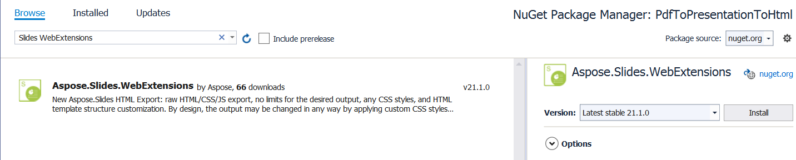

## **Bevezetés**

* A régi Aspose.Slides API kiadásokban, amikor PowerPoint‑ot exportáltál HTML‑re, a kapott HTML SVG‑markuppal együtt, valamint HTML‑el jelent meg. Minden dia egy SVG‑konténerként került exportálásra.  
* Az új Aspose.Slides verziókban, amikor a WebExtensions rendszert használod PowerPoint‑prezentációk HTML‑re exportálásához, testre szabhatod a HTML‑export beállításait a legjobb eredmény eléréséhez.  

Az új WebExtensions rendszerrel egy teljes prezentációt exportálhatsz HTML‑be CSS‑osztályok és JavaScript‑animációk (SVG‑nélkül) segítségével. Az új export rendszer korlátlan számú beállítást és metódust kínál, amelyek meghatározzák az export folyamatát.  

A WebExtensions rendszert a következő esetekben és eseményekben használják HTML‑generálásra a prezentációkból:

* egyedi CSS‑stílusok vagy animációk használatakor; bizonyos alakzat‑típusok markuppjának felülírása.  
* a dokumentumstruktúra felülírásakor, például egyedi navigáció létrehozásakor az oldalak között.  
* .html, .css, .js fájlok mappákba mentésekor egyedi hierarchiával, beleértve a specifikus fájltípusok külön mappába helyezését. Például a diák exportálása egy mappába a szekció neve alapján.  
* CSS és JS fájlok alapértelmezés szerint külön mappákba mentése, majd azok hozzáadása egy HTML‑fájlhoz. A képek és beágyazott betűkészletek szintén külön fájlokba kerülnek. Ezek természetesen beágyazhatók egy HTML‑fájlba (base64 formátumban). Bizonyos erőforrás‑részeket fájlokba menthetsz, míg másokat beágyazhatsz HTML‑be base64‑ként.  

A PowerPoint‑ről HTML‑re példák megtekinthetők az [Aspose.Slides.WebExtensions projekt](https://github.com/aspose-slides/Aspose.Slides.WebExtensions/) GitHub‑on. Ez a projekt 2 részből áll: **Examples\SinglePageApp** és **Examples\MultiPageApp**. A cikkben használt további példák szintén megtalálhatók a GitHub‑repo-ban.  

### **Sablonok**

Az HTML‑export képességeinek további bővítéséhez ajánljuk az ASP.NET Razor sablonrendszer használatát. A [Presentation](https://reference.aspose.com/slides/hu/net/aspose.slides/presentation) osztálypéldányt sablonokkal kombinálva HTML‑dokumentummá alakíthatod az export eredményét.  

**Bemutató**

Ebben a példában szöveget exportálunk egy prezentációból HTML‑be. Először hozzuk létre a sablont:

``` html
<!DOCTYPE html>
<body>
    @foreach (Slide slide in Model.Object.Slides)    
    {
        foreach (Shape shape in slide.Shapes)
        {
            if(shape is AutoShape)
            {
                ITextFrame textFrame = ((AutoShape)shape).TextFrame;
                <div class="text">@textFrame.Text</div>
            }
        }
    }
</body>
</html>
```
Ez a sablon a lemezen „shape-template-hello-world.html” néven van mentve, és a következő lépésben kerül felhasználásra.  

A sablonban végigiterálunk a szövegkereteket a prezentáció alakzatai között, hogy a szöveget megjelenítsük. Hozzuk létre a HTML‑fájlt a WebDocument segítségével, majd exportáljuk a Presentation‑t a fájlba:  

``` csharp
using (Presentation pres = new Presentation())
{
    IAutoShape shape = pres.Slides[0].Shapes.AddAutoShape(ShapeType.Rectangle, 10, 10, 100, 150);
    shape.TextFrame.Text = "Hello World";
                
    WebDocumentOptions options = new WebDocumentOptions
    {
        TemplateEngine = new RazorTemplateEngine(), // A Razor sablonmotort kívánjuk használni. Más sablonmotorok is használhatók az ITemplateEngine megvalósításával  
        OutputSaver = new FileOutputSaver() // Más eredménymentőket lehet használni az IOutputSaver interfész megvalósításával
    };
    WebDocument document = new WebDocument(options);

    // dokumentum "input" hozzáadása – milyen forrás lesz használva a HTML-dokumentum generálásához
    document.Input
        .AddTemplate<Presentation>( // a sablon a Presentation-t fogja használni "model" objektumként (Model.Object) 
        "index", // sablonkulcs – a sablonmotor számára szükséges egy objektum (Presentation) a lemezen betöltött sablonhoz ("shape-template-hello-world.html")  
        @"custom-templates\shape-template-hello-world.html"); // a sablon, amelyet korábban létrehoztunk
                
    // kimenet hozzáadása – hogyan fog kinézni a létrehozott HTML-dokumentum a lemezen való mentéskor
    document.Output.Add(
        "hello-world.html", // kimeneti fájl útvonala
        "index", // sablonkulcs, amelyet ehhez a fájlhoz használnak (korábban beállítottuk)  
        pres); // egy tényleges Model.Object példány 
                
    document.Save();
}
```

Például CSS‑stílusok hozzáadásával a export eredményhez piros színűre változtathatjuk a szöveget. Adjunk hozzá egy CSS‑sablont:  

``` css
.text {
    color: red;
}
```

Ezután illesszük be a bemeneti és kimeneti részekbe:  

``` csharp
using (Presentation pres = new Presentation())
{
    IAutoShape shape = pres.Slides[0].Shapes.AddAutoShape(ShapeType.Rectangle, 10, 10, 100, 150);
    shape.TextFrame.Text = "Hello World";
                
    WebDocumentOptions options = new WebDocumentOptions { TemplateEngine = new RazorTemplateEngine(), OutputSaver = new FileOutputSaver() };
    WebDocument document = new WebDocument(options);

    document.Input.AddTemplate<Presentation>("index", @"custom-templates\shape-template-hello-world.html");
    document.Input.AddTemplate<Presentation>("styles", @"custom-templates\styles\shape-template-hello-world.css");
    document.Output.Add("hello-world.html", "index", pres); 
    document.Output.Add("hello-world.css", "styles", pres);
                
    document.Save();
}
```

Adjunk hozzá egy hivatkozást a stílusokra a sablonhoz és a „text” osztályhoz:  
``` html
<!DOCTYPE html>
<head>
    <link rel="stylesheet" type="text/css" href="hello-world.css" />
</head>
...
</html>
```

### **Alapértelmezett sablonok**

A WebExtensions 2 alapvető sablonkészletet biztosít a prezentációk HTML‑re exportálásához:  
* **Single-page**: az összes prezentációtartalom egy HTML‑fájlba kerül exportálásra. Minden egyéb erőforrás (képek, betűk, stílusok stb.) külön fájlokba kerül.  
* **Multi-page**: minden prezentációs dia egyedi HTML‑fájlba kerül exportálásra. Az erőforrások exportálásának alaplogikája megegyezik az egyoldalas változattal.  

A `PresentationExtensions` osztályt használhatod a prezentáció export folyamatának egyszerűsítésére sablonokkal. A `PresentationExtensions` osztály a `Presentation` osztályhoz tartozó kiterjesztési metódusokat tartalmazza. Egy prezentáció egyoldalas exportálásához csak importálni kell az `Aspose.Slides.WebExtensions` névteret, majd meghívni két metódust. Az első metódus, `ToSinglePageWebDocument`, létrehozza a `WebDocument` példányt. A második metódus menti a HTML‑dokumentumot:  

``` csharp
using (Presentation pres = new Presentation("demo.pptx"))
{
    WebDocument document = pres.ToSinglePageWebDocument("templates\\single-page", @"single-page-output");
    document.Save();
}
```

A `ToSinglePageWebDocument` metódus két paramétert vehet: a sablonok mappáját és az export mappáját.  

Többoldalas exportáláshoz használd a `ToMultiPageWebDocument` metódust ugyanezekkel a paraméterekkel:  

``` csharp
using (Presentation pres = new Presentation("demo.pptx"))
{
    WebDocument document = pres.ToMultiPageWebDocument("templates\\multi-page", @"mutil-page-output");
    document.Save();
}
```

A WebExtensions‑ben minden sablon, amely a markup generálásához használatos, egy kulcshoz van kötve. A kulcs a sablonokban felhasználható. Például az `@Include` direktívában egy adott sablont beilleszthetsz egy másikba a kulcs segítségével.  

Ezt a folyamatot bemutathatjuk a szövegrészlet sablon használatával a bekezdés sablonon belül. A példát megtalálod az Aspose.Slides.WebExtensions projektben: [Templates\common\paragraph.html](https://github.com/aspose-slides/Aspose.Slides.WebExtensions/blob/main/Aspose.Slides.WebExtensions/Templates/common/paragraph.html). A bekezdés részeit a Razor Engine `@foreach` direktívájával iteráljuk:  

``` html
@foreach (Portion portion in contextObject.Portions) 
{ 
    var subModel = Model.SubModel(portion);
    subModel.Local.Put("parentTextFrame", parentTextFrame);
    subModel.Local.Put("tableContent", tableContentFlag);
	@Raw(Include("portion", subModel).ToString().Replace(Environment.NewLine, ""));
}
```

A résznek saját sablonja van: [portion.html](https://github.com/aspose-slides/Aspose.Slides.WebExtensions/blob/main/Aspose.Slides.WebExtensions/Templates/common/portion.html), és hozzá van generálva egy modell. Ez a modell lesz hozzáadva a kimeneti `paragraph.html` sablonhoz:  
``` html
@Raw(Include("portion", subModel).ToString().Replace(Environment.NewLine, ""));
```

Minden alakzat‑típushoz egyedi sablont használunk, amely az Aspose.Slides.WebExtensions projekt által biztosított általános sablonkészlethez kerül hozzáadásra. A sablonok a `ToSinglePageWebDocument` és a `ToMultiPageWebDocument` metódusokban kombinálódnak a végső eredmény érdekében. Ezek a közös sablonok mindkét változatban (egy‑ és többoldalas) használatosak:

- templates  
+-common  
  ¦ +-scripts: javascript‑szkriptek a dia‑átmeneti animációkhoz, példaként.  
  ¦ +-styles: közös CSS‑stílusok.  
  ¦ +-multi-page: index, menü, dia sablonok a többoldalas kimenethez.  
  ¦ +-single-page: index, dia sablonok az egyoldalas kimenethez.  

A `PresentationExtensions.AddCommonInputOutput` metódusban a közös rész hogyan van a sablonokhoz kötve, megtekinthető [itt](https://github.com/aspose-slides/Aspose.Slides.WebExtensions/blob/main/Aspose.Slides.WebExtensions/PresentationExtensions.cs).  

### **Alapértelmezett sablon testreszabása**

A közös modell sablonjának bármely elemét módosíthatod. Például megváltoztathatod a táblázat formázási stílusait, miközben a egyoldalas további stílusai változatlanok maradnak.  

Alapértelmezés szerint a `Templates\common\table.html` kerül felhasználásra, és a táblázat ugyanolyan megjelenést kap, mint a PowerPoint‑ban. Változtassuk meg a táblázat formázását egyedi CSS‑stílusokkal:  
``` css
.custom-table {
    border: 1px solid black;
}
.custom-table tr:nth-child(even) {background: #CCC}
.custom-table tr:nth-child(odd) {background: #ffb380}
```

Létrehozhatunk ugyanolyan bemeneti sablon‑struktúrát és kimeneti fájlokat (ahogy generálva van), miközben meghívjuk a `PresentationExtensions.ToSinglePageWebDocument` metódust. Adjunk hozzá egy `ExportCustomTableStyles_AddCommonStructure` metódust ehhez. Ennek a metódusnak és a `ToSinglePageWebDocument` metódusnak a különbsége, hogy nem kell hozzáadni a standard táblázat‑sablont és a fő index‑oldalt (ez fel lesz cserélve a saját táblázat‑stílusra mutató hivatkozással):  

``` csharp
private static void ExportCustomTableStyles_AddCommonStructure(
    Presentation pres, 
    WebDocument document,
    string templatesPath, 
    string outputPath, 
    bool embedImages)
{
    AddCommonStylesTemplates(document, templatesPath);
            
    document.Input.AddTemplate<Slide>("slide", Path.Combine(templatesPath, "slide.html"));
    document.Input.AddTemplate<AutoShape>("autoshape", Path.Combine(templatesPath, "autoshape.html"));
    document.Input.AddTemplate<TextFrame>("textframe", Path.Combine(templatesPath, "textframe.html"));
    document.Input.AddTemplate<Paragraph>("paragraph", Path.Combine(templatesPath, "paragraph.html"));
    document.Input.AddTemplate<Paragraph>("bullet", Path.Combine(templatesPath, "bullet.html"));
    document.Input.AddTemplate<Portion>("portion", Path.Combine(templatesPath, "portion.html"));
    document.Input.AddTemplate<VideoFrame>("videoframe", Path.Combine(templatesPath, "videoframe.html"));
    document.Input.AddTemplate<PictureFrame>("pictureframe", Path.Combine(templatesPath, "pictureframe.html")); ;
    document.Input.AddTemplate<Shape>("shape", Path.Combine(templatesPath, "shape.html"));

    AddSinglePageCommonOutput(pres, document, outputPath);
            
    AddResourcesOutput(pres, document, embedImages);
            
    AddScriptsOutput(document, templatesPath);
}
```

Adjunk hozzá egy egyedi sablont helyette:  

``` csharp
using (Presentation pres = new Presentation("table.pptx"))
{
    const string templatesPath = "templates\\single-page";
    const string outputPath = "custom-table-styles";
                
    var options = new WebDocumentOptions
    {
        TemplateEngine = new RazorTemplateEngine(),
        OutputSaver = new FileOutputSaver(),
        EmbedImages = false
    };

    // globális dokumentumértékek beállítása
    WebDocument document = new WebDocument(options);
    SetupGlobals(document, options, outputPath);

    // közös struktúra hozzáadása (kivéve a táblázat sablont)
    ExportCustomTableStyles_AddCommonStructure(pres, document, templatesPath, outputPath, options.EmbedImages);
                
    // egyedi táblázat sablon hozzáadása
    document.Input.AddTemplate<Table>("table", @"custom-templates\table-custom-style.html");
                
    // egyedi táblázat stílusok hozzáadása
    document.Input.AddTemplate<Presentation>("table-custom-style", @"custom-templates\styles\table-custom-style.css");
    document.Output.Add(Path.Combine(outputPath, "table-custom-style.css"), "table-custom-style", pres);
                
    // egyedi index hozzáadása – ez csak a standard "index.html" másolata, de tartalmaz hivatkozást a "table-custom-style.css"-re
    document.Input.AddTemplate<Presentation>("index", @"custom-templates\index-table-custom-style.html");
                
    document.Save();
}
```

``` html
@model TemplateContext<Table>

@{
	Table contextObject = Model.Object;
	
	var origin = Model.Local.Get<Point>("origin");
	var positionStyle = string.Format("left: {0}px; top: {1}px; width: {2}px; height: {3}px;",
										(int)contextObject.X + origin.X,
										(int)contextObject.Y + origin.Y,
										(int)contextObject.Width,
										(int)contextObject.Height);
}

	<table class="table custom-table" style="@positionStyle">
	@for (int i = 0; i < contextObject.Rows.Count; i++)
	{
		var rowHeight = string.Format("height: {0}px", contextObject.Rows[i].Height);
		<tr style="@rowHeight">
		@for (int j = 0; j < contextObject.Columns.Count; j++)
		{
			var cell = contextObject[j, i];
			if (cell.FirstRowIndex ==  i && cell.FirstColumnIndex == j)
			{
				var spans = cell.IsMergedCell ? string.Format("rowspan=\"{0}\" colspan=\"{1}\"", cell.RowSpan, cell.ColSpan) : "";
				<td width="@cell.Width px" @Raw(spans)>
					@{
						for(int k = 0; k < cell.TextFrame.Paragraphs.Count; k++)
						{
							var para = (Paragraph)cell.TextFrame.Paragraphs[k];
						
							var subModel = Model.SubModel(para);
							double[] margins = new double[] { cell.MarginLeft, cell.MarginTop, cell.MarginRight, cell.MarginBottom };
							subModel.Local.Put("margins", margins);
							subModel.Local.Put("parent", cell.TextFrame);
							subModel.Local.Put("parentContainerSize", new SizeF((float)cell.Width, (float)cell.Height));
                            subModel.Local.Put("tableContent", true);
							
							@Include("paragraph", subModel)
						}
					}
				</td>
			}
		}
		</tr>
	}
</table>
```

**Megjegyzés**: az egyedi táblázat‑sablon ugyanazzal a „table” kulccsal lett hozzáadva, mint a standard táblázat. Így egy bizonyos alapértelmezett sablont felülírhatsz újraírás nélkül. Ugyanazokat a kulcsokat használva a default struktúra sablonjait is alkalmazhatod. Például egy standard bekezdés‑sablont használhatsz a táblázat‑sablonban, vagy felülírhatod a kulccsal.  
Az `index.html`‑be is beillesztheted a saját táblázat‑CSS‑stílusokra mutató hivatkozást:  

``` html
<!DOCTYPE html>    
    
<html     
    xmlns="http://www.w3.org/1999/xhtml"    
    xmlns:svg="http://www.w3.org/2000/svg"    
    xmlns:xlink="http://www.w3.org/1999/xlink">    
<head>    
     ...
    <link rel="stylesheet" type="text/css" href="table-custom-style.css" />
    ...
</head>    
<body>    
    ...
</body>
</html>
```

## **Projekt létrehozása nulláról: Animált diák‑átmenetek**

A WebExtensions lehetővé teszi a prezentációk animált dia‑átmenetekkel való exportálását — csak állítsd be a `WebDocumentOptions` `AnimateTransitions` tulajdonságát `true`‑ra:  

``` csharp
WebDocumentOptions options = new WebDocumentOptions
{
    // ... egyéb beállítások
    AnimateTransitions = true
};
```

Hozzunk létre egy új projektet, amely az Aspose.Slides‑et és az Aspose.Slides.WebExtensions‑t használja HTML‑viewer készítéséhez PDF‑ből, sima animált oldal‑átmenetekkel. Itt a PDF‑import funkciót kell használnunk az Aspose.Slides‑ből.  

Hozzunk létre egy **PdfToPresentationToHtml** projektet, és adjuk hozzá az Aspose.Slides.WebExtensions NuGet‑csomagot (az Aspose.Slides csomag is függőségként kerül felvételre):  


Első lépésként importáljuk a PDF‑dokumentumot, amely animálva lesz és HTML‑prezentációvá exportálódik:  

``` csharp
using (Presentation pres = new Presentation())
{
    pres.Slides.RemoveAt(0);
    pres.Slides.AddFromPdf("sample.pdf");
}
```

Ezután állítsuk be az animált dia‑átmeneteket (minden dia a PDF egy oldala). A minta PDF‑dokumentumban 9 dia van. Adjunk hozzá dia‑átmeneteket mindegyikhez (bemutató a HTML‑megjelenítés közben):  

``` csharp
pres.Slides[0].SlideShowTransition.Type = TransitionType.Fade;
pres.Slides[1].SlideShowTransition.Type = TransitionType.RandomBar;
pres.Slides[2].SlideShowTransition.Type = TransitionType.Cover;
pres.Slides[3].SlideShowTransition.Type = TransitionType.Dissolve;
pres.Slides[4].SlideShowTransition.Type = TransitionType.Switch;
pres.Slides[5].SlideShowTransition.Type = TransitionType.Pan;
pres.Slides[6].SlideShowTransition.Type = TransitionType.Ferris;
pres.Slides[7].SlideShowTransition.Type = TransitionType.Pull;
pres.Slides[8].SlideShowTransition.Type = TransitionType.Plus;
```

Végül exportáljuk HTML‑be a `WebDocument`‑et úgy, hogy a `AnimateTransitions` tulajdonság `true`‑ra van állítva:  

``` csharp
WebDocumentOptions options = new WebDocumentOptions
{
    TemplateEngine = new RazorTemplateEngine(),
    OutputSaver = new FileOutputSaver(),
    AnimateTransitions = true
};

WebDocument document = pres.ToSinglePageWebDocument(options, "templates\\single-page", "animated-pdf");
document.Save();
```

Teljes forráskód‑példa:  
``` csharp
using (Presentation pres = new Presentation())
{
    pres.Slides.RemoveAt(0);
    pres.Slides.AddFromPdf("sample.pdf");

    pres.Slides[0].SlideShowTransition.Type = TransitionType.Fade;
    pres.Slides[1].SlideShowTransition.Type = TransitionType.RandomBar;
    pres.Slides[2].SlideShowTransition.Type = TransitionType.Cover;
    pres.Slides[3].SlideShowTransition.Type = TransitionType.Dissolve;
    pres.Slides[4].SlideShowTransition.Type = TransitionType.Switch;
    pres.Slides[5].SlideShowTransition.Type = TransitionType.Pan;
    pres.Slides[6].SlideShowTransition.Type = TransitionType.Ferris;
    pres.Slides[7].SlideShowTransition.Type = TransitionType.Pull;
    pres.Slides[8].SlideShowTransition.Type = TransitionType.Plus;

    WebDocumentOptions options = new WebDocumentOptions
    {
        TemplateEngine = new RazorTemplateEngine(),
        OutputSaver = new FileOutputSaver(),
        AnimateTransitions = true
    };

    WebDocument document = pres.ToSinglePageWebDocument(options, "templates\\single-page", "animated-pdf");
    document.Save();
}
```

Ez minden, amire szükséged van egy PDF‑dokumentumból származó, animált oldal‑átmenetekkel rendelkező HTML létrehozásához.  

* [Minta HTML‑fájl letöltése](https://github.com/aspose-slides/Aspose.Slides.WebExtensions/tree/main/Examples).  
* [Minta projekt letöltése](/slides/hu/net/web-extensions/sample.zip).