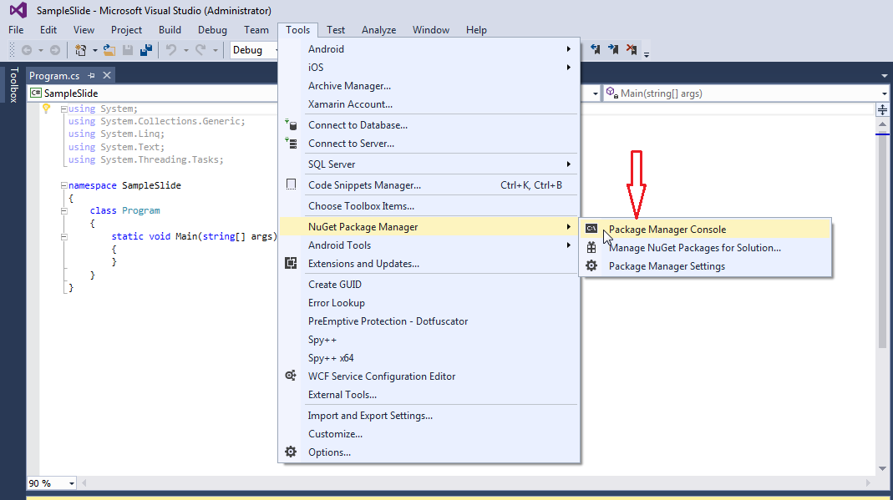

## **Áttekintés**

Ez a cikk leírja, hogyan telepíthető az Aspose.Slides for .NET Windows és macOS rendszerekre. A NuGet‑alapú telepítésre összpontosít, és bemutatja, hogyan adható hozzá a könyvtár egy Visual Studio projekthez a NuGet Package Manager vagy a Package Manager Console segítségével Windows rendszeren. Emellett ismerteti a csomag frissítését és a kiadás előtti verziók telepítését, ha szükséges.

## **Windows**
A NuGet a legegyszerűbb módja az Aspose API‑k letöltésének és telepítésének .NET környezetben PC‑ken.

### **Módszer 1: Aspose.Slides telepítése vagy frissítése a NuGet Package Manager‑ből**

1. Nyissa meg a Microsoft Visual Studio‑t.  
2. Hozzon létre egy egyszerű konzolalkalmazást vagy nyisson meg egy meglévő projektet.  
3. Válassza a **Tools** > **NuGet package manager** menüpontot.  
4. A **Browse** lapon keressen a szövegmezőben *Aspose Slides* kifejezésre.  
{}
5. Kattintson az **Aspose.Slides.NET** elemre, majd az **Install** gombra.  
   * Ha már telepítve van, és frissíteni szeretné az Aspose.Slides‑t, válassza az **Update** gombot.  

A kiválasztott API letöltődik, és a projektben hivatkozássá válik.

### **Módszer 2: Aspose.Slides telepítése vagy frissítése a Package Manager Console‑ból**

Ez mutatja, hogyan hivatkozhat a [Aspose.Slides API](https://www.nuget.org/packages/Aspose.Slides.NET/) csomagra a csomagkezelő konzolon keresztül:

1. Nyissa meg a Microsoft Visual Studio‑t.  
2. Hozzon létre egy egyszerű konzolalkalmazást vagy nyisson meg egy meglévő projektet.  
3. Válassza a **Tools** > **Library Package Manager** > **Package Manager Console** menüpontot.  

4. Futassa ezt a parancsot: `Install-Package Aspose.Slides.NET`  

A legújabb teljes kiadás kerül telepítésre az alkalmazásba.  

* Alternatívaként a `-prerelease` kapcsolót is hozzáadhatja a parancshoz, hogy a legújabb (hotfixekkel együtt) kiadás is telepítve legyen.

A **Installing Aspose.Slides.NET** tipp a ablak alja körül jelenik meg.  

Amikor a letöltés befejeződik, néhány megerősítő üzenetet fog látni.  

Ha nem ismeri a [Aspose EULA](https://about.aspose.com/legal/eula) feltételeit, érdemes elolvasnia a licencet, amely a fenti URL‑ben található.  

Az alkalmazásban látnia kell, hogy az Aspose.Slides sikeresen hozzá lett adva és hivatkozásként szerepel.  

A Package Manager Console‑ban futtathatja a `Update-Package Aspose.Slides.NET` parancsot az Aspose.Slides csomag frissítéseinek kereséséhez. A megtalált frissítések automatikusan települnek. A `-prerelease` kapcsolóval a legújabb kiadás is frissíthető.

#### **Megfontolandók megosztott szerverkörnyezetben történő futtatáskor**
Erősen ajánljuk, hogy az összes Aspose .NET komponens **Full Trust** jogosultsági szinttel fusson, mivel az Aspose komponenseknek néha regisztrációs beállításokhoz és a virtuális könyvtáron kívül lévő fájlokhoz kell hozzáférniük – például betűkészletek olvasásakor.

Továbbá az Aspose.NET komponensek a .NET alapvető rendszerosztályaira épülnek, és egyes osztályok bizonyos esetekben szintén Full Trust jogosultságot igényelnek.

Az internetszolgáltatók, akik több vállalat alkalmazásait üzemeltetik, általában a **Medium Trust** biztonsági szintet alkalmazzák. .NET 2.0 esetén ez a szint korlátozásokat eredményezhet, amelyek befolyásolják az Aspose.Slides működését:

- **RegistryPermission** nem érhető el. Ennek következtében nem férhet hozzá a regisztrációs adatbázishoz, amely a betűkészletek felsorolásához szükséges a dokumentumok renderelésekor.  
- **FileIOPermission** korlátozott. Csak a saját alkalmazásának virtuális könyvtárhierarchiájában lévő fájlokhoz férhet hozzá. Ez azt is jelentheti, hogy a betűkészletek nem olvashatók exportáláskor.  

A fenti okok miatt erősen javasoljuk, hogy az Aspose.Slides **Full Trust** jogosultságokkal fusson. Ha **Medium Trust** környezetet használ, inkonzisztenciákat tapasztalhat – bizonyos könyvtári funkciók (például a renderelés) nem működhetnek bizonyos feladatok során.

## **macOS**

A NuGet a legegyszerűbb módja az Aspose.Slides for .NET letöltésének és telepítésének macOS‑en.

**Előkövetelmény telepítése**

A `System.Drawing` névtér macOS‑en másként működik, ezért telepíteni kell a mono-libgdiplus‑t.

> .NET 5‑ben és korábbi verziókban a [System.Drawing.Common](https://www.nuget.org/packages/System.Drawing.Common/) NuGet csomag Windows, Linux és macOS rendszereken működik. Azonban platformkülönbségek vannak. Linux és macOS esetén a GDI+ funkcionalitást a [libgdiplus](https://www.mono-project.com/docs/gui/libgdiplus/) könyvtár valósítja meg. Ez a könyvtár a legtöbb Linux‑disztribúción nincs alapértelmezés szerint telepítve, és nem támogatja a Windows‑on és macOS‑on elérhető GDI+ összes funkcióját. Vannak olyan platformok is, ahol a libgdiplus egyáltalán nem érhető el. A System.Drawing.Common csomag típusainak Linuxon és macOS‑en való használatához külön kell telepíteni a libgdiplus‑t. További információért lásd a [Install .NET on Linux](https://docs.microsoft.com/en-us/dotnet/core/install/linux) vagy a [Install .NET on macOS](https://docs.microsoft.com/en-us/dotnet/core/install/macos#libgdiplus) dokumentumokat.

A mono-libgdiplus külön telepítéséhez macen lásd ezt a cikket: [this article](https://docs.microsoft.com/en-us/dotnet/core/install/macos#libgdiplus).

### **Aspose.Slides telepítése**

1. Nyissa meg a Visual Studio‑t.  
2. Hozzon létre egy egyszerű konzolalkalmazást vagy nyisson meg egy meglévő projektet.  
3. Válassza a **Project** > **Manage NuGet Packages...** menüpontot.  
   
4. Írja be a *Aspose.Slides* kifejezést a szövegmezőbe.  
5. Kattintson az **Aspose.Slides for .NET** elemre, majd a **Add Package** gombra.  
6. Adjon hozzá egy egyszerű kódrészletet.  
   * A kódot a [this page](/slides/hu/net/create-presentation/) oldalon másolhatja.  
7. Futtassa az alkalmazást.  
8. Nyissa meg a projekt *folder/bin/Debug/presentation_file_name* könyvtárát.

## **GYIK**

**Van ingyenes verzió vagy próbaverzió korlátozással?**

Igen, alapértelmezés szerint az Aspose.Slides értékelő módban fut, amely vízjelet helyez el, és egyéb korlátozásokat is alkalmazhat. A korlátozások eltávolításához érvényes [licenc](/slides/hu/net/licensing/) szükséges.