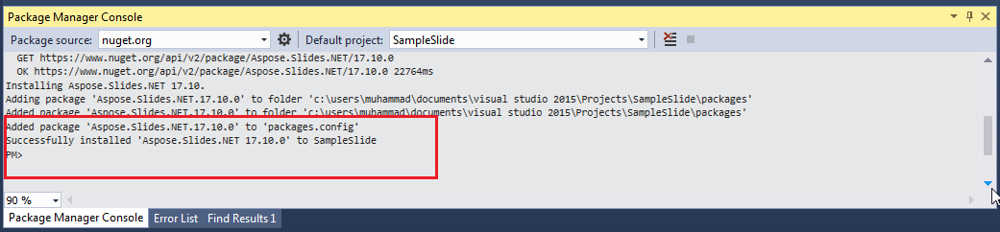

## **Áttekintés**

Ez a cikk bemutatja, hogyan telepíthető az Aspose.Slides for .NET Windows, Linux és macOS rendszerekre. A NuGet-alapú telepítésre összpontosít, és megmutatja, hogyan adható hozzá a könyvtár a NuGet csomagkezelőn vagy a Package Manager Console-on keresztül Windowson, egy .NET projekthez Linuxon, és egy Visual Studio projekthez macOS-en. Leírja továbbá, hogyan frissíthető a csomag és hogyan telepíthetők előzetes kiadások, ha szükséges.

A telepítés előtt tekintse át a támogatott operációs rendszereket, .NET megvalósításokat és a további függőségeket a [Rendszerkövetelmények](/slides/hu/net/system-requirements/) oldalon.

## **Windows**
A NuGet a legegyszerűbb módot nyújtja az Aspose .NET API-k letöltéséhez és telepítéséhez PC-ken. 

### **Módszer 1: Az Aspose.Slides telepítése vagy frissítése a NuGet csomagkezelőből**

1. Nyissa meg a Microsoft Visual Studio-t. 
2. Hozzon létre egy egyszerű konzolalkalmazást, vagy nyisson meg egy meglévő projektet. 
3. Navigáljon a **Tools** > **NuGet package manager** menüpontra. 
4. A **Browse** rész alatt keresse meg a *Aspose Slides* kifejezést a szövegmezőben. 
{}
5. Kattintson a **Aspose.Slides.NET**-re, majd a **Install** gombra. 
   * Ha frissíteni szeretné az Aspose.Slides‑t – feltételezve, hogy már telepítette – kattintson a **Update** gombra. 

A kiválasztott API letöltődik, és hivatkozásként kerül a projektbe.

### **Módszer 2: Az Aspose.Slides telepítése vagy frissítése a Package Manager Console-on keresztül**

Így hivatkozhat a [Aspose.Slides API](https://www.nuget.org/packages/Aspose.Slides.NET/) csomagkezelő konzolon:

1. Nyissa meg a Microsoft Visual Studio-t. 
2. Hozzon létre egy egyszerű konzolalkalmazást, vagy nyisson meg egy meglévő projektet. 
3. Navigáljon a **Tools** > **Library Package Manager** > **Package Manager Console** menüpontra. 

4. Futtassa ezt a parancsot: `Install-Package Aspose.Slides.NET` 

A legújabb teljes kiadás települ az alkalmazásba. 

* Alternatívaként hozzáadhatja a `-prerelease` utótagot a parancshoz, hogy a legújabb kiadást (hotfixekkel együtt) is telepítse. 

A **Installing Aspose.Slides.NET** tipp a ablak alja felé jelenik meg. 

Amikor a letöltés befejeződik, megjelennek néhány megerősítő üzenet. 

Ha nem ismeri a [Aspose EULA](https://about.aspose.com/legal/eula) dokumentumot, érdemes elolvasni a hivatkozott licencet. 

Az alkalmazásában látnia kell, hogy az Aspose.Slides sikeresen hozzá lett adva és hivatkozásként szerepel. 

A Package Manager Console-ban futtathatja a `Update-Package Aspose.Slides.NET` parancsot, hogy ellenőrizze az Aspose.Slides csomag frissítéseit. A frissítések (ha vannak) automatikusan települnek. A `-prerelease` utótaggal is frissítheti a legújabb kiadást.

#### **Megfontolások megosztott szerverkörnyezetben való futtatáskor**
Erősen javasoljuk, hogy az összes Aspose .NET komponenst **Full Trust** jogosultságkörrel futtassa, mivel az Aspose komponenseknek néha hozzá kell férniük a rendszerleíró adatbázishoz és a virtuális könyvtáron kívül elhelyezkedő fájlokhoz – például a betűtípusok olvasásához. 

Továbbá, az Aspose.NET komponensek a .NET alaprendszer osztályain alapulnak – és ezek közül néhány bizonyos esetekben szintén **Full Trust** jogosultságot igényel. 

Az internetszolgáltatók, akik több különböző cég alkalmazásait üzemeltetik, általában a **Medium Trust** biztonsági szintet alkalmazzák. .NET 2.0 esetén ez a biztonsági szint korlátozásokat eredményezhet az Aspose.Slides működésében:

- **RegistryPermission** nem áll rendelkezésre. Ez azt jelenti, hogy nem férhet hozzá a rendszerleíró adatbázishoz, ami a dokumentumok renderelésekor telepített betűtípusok felsorolásához szükséges. 
- **FileIOPermission** korlátozott. Ez azt jelenti, hogy csak a saját alkalmazása virtuális könyvtárhierarchiájában lévő fájlokhoz férhet hozzá. Ez azt is jelentheti, hogy a betűtípusok exportálási műveletek során nem olvashatók. 

A fenti okok miatt erősen ajánljuk, hogy az Aspose.Slides-t **Full Trust** jogosultságokkal futtassa. Ha **Medium trust**-et használ, átmeneti hibákat tapasztalhat – egyes könyvtári funkciók (például a renderelés) nem működhetnek bizonyos feladatok esetén. 

## **Linux**

A NuGet a legegyszerűbb módja az Aspose.Slides for .NET letöltésének és telepítésének Linuxon. Adja hozzá a [Aspose.Slides.NET](https://www.nuget.org/packages/Aspose.Slides.NET/) csomagot .NET projektjéhez.

## **macOS**

A NuGet a legegyszerűbb módja az Aspose.Slides for .NET letöltésének és telepítésének Mac gépeken.

### **Telepítse az Aspose.Slides**

1. Nyissa meg a Visual Studio-t. 
2. Hozzon létre egy egyszerű konzolalkalmazást, vagy nyisson meg egy meglévő projektet.
3. Navigáljon a **Project** > **Manage NuGet Packages...** menüpontra.
   
4. Írja be a *Aspose.Slides* kifejezést a szövegmezőbe. 
5. Kattintson az **Aspose.Slides for .NET**-re, majd a **Add Package** gombra. 
6. Adjon hozzá egy egyszerű kódrészletet.
   * A kódot másolhatja [erről az oldalról](/slides/hu/net/create-presentation/).
7. Futtassa az alkalmazást.
8. Nyissa meg a projekt *folder/bin/Debug/presentation_file_name* mappáját.

## **FAQ**

**Van ingyenes verzió vagy próbahasználati korlátozás?**

Igen, alapértelmezetten az Aspose.Slides értékelő módban fut, ami vízjelet helyez el, és egyéb korlátozások lehetnek. A korlátozások eltávolításához alkalmazzon érvényes [licencet](/slides/hu/net/licensing/).