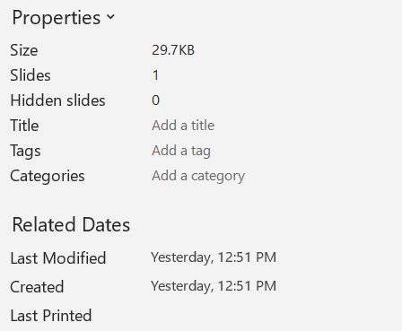

## **Áttekintés**

Az Aspose.Slides képes azonosítani egy bemutató formátumát, és beolvasni a dokumentum metaadatait anélkül, hogy létrehozná a teljes prezentáció objektummodellt. Ez akkor hasznos, ha fájlokat kell osztályozni, leltárt készíteni, vagy tulajdonságokat ellenőrizni szeretne, mielőtt eldöntené, hogy betölti és feldolgozza a prezentáció tartalmát.

Ez a cikk bemutatja a könnyű ellenőrzést a [PresentationFactory](https://reference.aspose.com/slides/hu/nodejs-java/aspose.slides/presentationfactory/) és a [PresentationInfo](https://reference.aspose.com/slides/hu/nodejs-java/aspose.slides/presentationinfo/) segítségével, valamint a célzott frissítéseket a [DocumentProperties](https://reference.aspose.com/slides/hu/nodejs-java/aspose.slides/documentproperties/) segítségével.

## **Ellenőrizze a prezentáció formátumát**

Használja a [PresentationFactory.getPresentationInfo](https://reference.aspose.com/slides/hu/nodejs-java/aspose.slides/presentationfactory/getpresentationinfo/) függvényt egy fájl ellenőrzéséhez anélkül, hogy [Presentation](https://reference.aspose.com/slides/hu/nodejs-java/aspose.slides/presentation/) példányt hozna létre. A [PresentationInfo.getLoadFormat](https://reference.aspose.com/slides/hu/nodejs-java/aspose.slides/presentationinfo/getloadformat/) metódus jelzi a felismert formátumot, például PPTX, PPT vagy ODP.

```javascript
const aspose = require("aspose.slides.via.java");

const fileNames = ["pres.pptx", "pres.ppt", "pres.odp"];

for (const fileName of fileNames) {
    const presentationInfo = aspose.PresentationFactory.getInstance().getPresentationInfo(fileName);
    const loadFormat = presentationInfo.getLoadFormat();
    let formatName = `Other (${loadFormat})`;

    if (loadFormat === aspose.LoadFormat.Pptx) {
        formatName = "PPTX";
    } else if (loadFormat === aspose.LoadFormat.Ppt) {
        formatName = "PPT";
    } else if (loadFormat === aspose.LoadFormat.Odp) {
        formatName = "ODP";
    }

    console.log(`${fileName}: ${formatName}`);
}
```

## **Könnyű prezentáció leltár létrehozása**

Ha sok prezentációs fájlt dolgoz fel, egy tömör leltárra lehet szüksége érvényesítéshez, indexeléshez vagy egy dokumentumkezelő rendszerhez. Ebben a helyzetben használja a [PresentationFactory.getPresentationInfo](https://reference.aspose.com/slides/hu/nodejs-java/aspose.slides/presentationfactory/getpresentationinfo/) függvényt egy [PresentationInfo](https://reference.aspose.com/slides/hu/nodejs-java/aspose.slides/presentationinfo/) objektum megszerzéséhez, majd hívja meg a [PresentationInfo.readDocumentProperties](https://reference.aspose.com/slides/hu/nodejs-java/aspose.slides/presentationinfo/readdocumentproperties/) metódust a dokumentum metaadatainak beolvasásához. Ez a megközelítés nem hoz létre [Presentation](https://reference.aspose.com/slides/hu/nodejs-java/aspose.slides/presentation/) példányt, és nem igényli a teljes prezentáció objektummodell bejárását.

A [DocumentProperties](https://reference.aspose.com/slides/hu/nodejs-java/aspose.slides/documentproperties/) által biztosított kiterjesztett tulajdonságok a következő leltárei értékeket adják:

| Módszer | Leltár érték |
| --- | --- |
| [getSlides](https://reference.aspose.com/slides/hu/nodejs-java/aspose.slides/documentproperties/#getSlides) | A diák összes száma. |
| [getHiddenSlides](https://reference.aspose.com/slides/hu/nodejs-java/aspose.slides/documentproperties/#getHiddenSlides) | A rejtett diák száma. |
| [getNotes](https://reference.aspose.com/slides/hu/nodejs-java/aspose.slides/documentproperties/#getNotes) | A jegyzeteket tartalmazó diák száma. |
| [getParagraphs](https://reference.aspose.com/slides/hu/nodejs-java/aspose.slides/documentproperties/#getParagraphs) | Az elérhető bekezdések összes száma. |
| [getWords](https://reference.aspose.com/slides/hu/nodejs-java/aspose.slides/documentproperties/#getWords) | A szavak összes száma. |
| [getMultimediaClips](https://reference.aspose.com/slides/hu/nodejs-java/aspose.slides/documentproperties/#getMultimediaClips) | Az audio és video klipek összes száma. |

A következő példa beolvassa ezeket az értékeket anélkül, hogy [Presentation](https://reference.aspose.com/slides/hu/nodejs-java/aspose.slides/presentation/) objektumot hozna létre, és egy tömör leltárt nyomtat. Emellett kombinálja a [DocumentProperties.getHeadingPairs](https://reference.aspose.com/slides/hu/nodejs-java/aspose.slides/documentproperties/#getHeadingPairs) függvényt a [DocumentProperties.getTitlesOfParts](https://reference.aspose.com/slides/hu/nodejs-java/aspose.slides/documentproperties/#getTitlesOfParts) függvénnyel, hogy megjelenítse a tartalmi csoportokat, mint például a betűtípusok, témák és diacímek.

```javascript
const path = require("path");
const aspose = require("aspose.slides.via.java");

const filePath = "sample.pptx";
const presentationInfo = aspose.PresentationFactory.getInstance().getPresentationInfo(filePath);
const documentProperties = presentationInfo.readDocumentProperties();

const loadFormat = presentationInfo.getLoadFormat();
let formatName = `Other (${loadFormat})`;

if (loadFormat === aspose.LoadFormat.Pptx) {
    formatName = "PPTX";
} else if (loadFormat === aspose.LoadFormat.Ppt) {
    formatName = "PPT";
} else if (loadFormat === aspose.LoadFormat.Odp) {
    formatName = "ODP";
}

console.log(`File: ${path.basename(filePath)}`);
console.log(`Format: ${formatName}`);
console.log(`Title: ${documentProperties.getTitle()}`);
console.log(`Author: ${documentProperties.getAuthor()}`);
console.log("Statistics:");
console.log(`  Slides: ${documentProperties.getSlides()}`);
console.log(`  Hidden slides: ${documentProperties.getHiddenSlides()}`);
console.log(`  Slides with notes: ${documentProperties.getNotes()}`);
console.log(`  Paragraphs: ${documentProperties.getParagraphs()}`);
console.log(`  Words: ${documentProperties.getWords()}`);
console.log(`  Multimedia clips: ${documentProperties.getMultimediaClips()}`);

const headingPairs = documentProperties.getHeadingPairs() || [];
const titlesOfParts = documentProperties.getTitlesOfParts() || [];
let partIndex = 0;

if (headingPairs.length === 0 || titlesOfParts.length === 0) {
    console.log("Content groups: not available");
} else {
    console.log("Content groups:");

    for (const headingPair of headingPairs) {
        const partCount = headingPair.getCount();
        console.log(`  ${headingPair.getName()} (${partCount})`);

        for (let partOffset = 0; partOffset < partCount && partIndex < titlesOfParts.length; partOffset++) {
            console.log(`    - ${titlesOfParts[partIndex]}`);
            partIndex++;
        }
    }

    if (partIndex < titlesOfParts.length) {
        console.log("  Other parts:");

        while (partIndex < titlesOfParts.length) {
            console.log(`    - ${titlesOfParts[partIndex]}`);
            partIndex++;
        }
    }
}
```

Minden [HeadingPair](https://reference.aspose.com/slides/hu/nodejs-java/aspose.slides/headingpair/) egy csoportnevet ad a [HeadingPair.getName](https://reference.aspose.com/slides/hu/nodejs-java/aspose.slides/headingpair/#getName) segítségével, és a csoportban lévő elemek számát a [HeadingPair.getCount](https://reference.aspose.com/slides/hu/nodejs-java/aspose.slides/headingpair/#getCount) segítségével. A [DocumentProperties.getTitlesOfParts](https://reference.aspose.com/slides/hu/nodejs-java/aspose.slides/documentproperties/#getTitlesOfParts) egy lapos, rendezett tömböt ad vissza, ezért a csoportonként megadott egymást követő címek számát kell felhasználni.

### **Tárolt metaadatok és formátumkorlátozások**

A [PresentationInfo.readDocumentProperties](https://reference.aspose.com/slides/hu/nodejs-java/aspose.slides/presentationinfo/readdocumentproperties/) által visszaadott leltártulajdonságok tükrözik a forrásdokumentumban elérhető metaadatokat. Az Aspose.Slides nem tölti be és nem járja be a prezentáció objektummodellt, hogy újraszámolja ezeket az értékeket ebben a hívásban. A hiányzó tulajdonságok alapértelmezett értékekkel vannak jelölve, és a tárolt értékek elavultak lehetnek, ha az utolsó mentést végző alkalmazás nem frissítette a dokumentumtulajdonságokat.

- **PPTX:** A formátum kiterjesztett dokumentumtulajdonságokat biztosít a diák, jegyzetek, rejtett diák, bekezdések, szavak és multimédia darabszámához, valamint a heading pair és part title adatokat. Elérhetőségük attól függ, mely tulajdonságokat írta a dokumentum előállítója.
- **PPT:** A bináris formátum tárolhat megfelelő dokumentumösszegző tulajdonságokat. Ha egy tulajdonság hiányzik vagy nem frissült a dokumentum előállítója által, az Aspose.Slides annak tárolt vagy alapértelmezett értékét adja vissza a diák alapján történő újraszámolás helyett.
- **ODP:** Az OpenDocument metaadatok általános dokumentumstatisztikákat biztosítanak, például oldal, bekezdés és szó számlálást, de ezek az értékek nem minden PowerPoint-specifikus kiterjesztett tulajdonsághoz térnek vissza. A rejtett diák, jegyzetdiák, multimédia, heading pair és part title metaadatok hiányozhatnak, és a leltártulajdonságok alapértelmezett értékekkel térhetnek vissza. Ne tekintse a null értéket vagy a üres tömböt tekintélyes bizonyítéknak arra, hogy a megfelelő tartalom hiányzik.

Használja a könnyű metaadatmegközelítést leltárakhoz és előzetes ellenőrzésekhez. Töltse be a prezentációt és ellenőrizze az élő objektummodellt, ha az eredménynek tükröznie kell a memóriában lévő változásokat vagy ha a tényleges prezentáció tartalmát kell ellenőrizni.

## **Prezentáció tulajdonságainak frissítése**

A [PresentationInfo.readDocumentProperties](https://reference.aspose.com/slides/hu/nodejs-java/aspose.slides/presentationinfo/readdocumentproperties/) által visszaadott tulajdonságok módosíthatók anélkül, hogy [Presentation](https://reference.aspose.com/slides/hu/nodejs-java/aspose.slides/presentation/) példányt hoznánk létre. Alkalmazza a változtatásokat a [PresentationInfo.updateDocumentProperties](https://reference.aspose.com/slides/hu/nodejs-java/aspose.slides/presentationinfo/updatedocumentproperties/) segítségével, majd írja ki a kötéssel ellátott prezentációt a [PresentationInfo.writeBindedPresentation](https://reference.aspose.com/slides/hu/nodejs-java/aspose.slides/presentationinfo/writebindedpresentation/) segítségével.

Az alábbi kép az eredeti dokumentumtulajdonságokat mutatja.



A következő példa megváltoztatja a címet és az utolsó mentés időpontját, majd az eredményt egy új fájlba írja:

```javascript
const aspose = require("aspose.slides.via.java");
const java = require("java");

const sourceFile = "sample.pptx";
const outputFile = "sample_with_updated_properties.pptx";
const presentationInfo = aspose.PresentationFactory.getInstance().getPresentationInfo(sourceFile);
const documentProperties = presentationInfo.readDocumentProperties();

documentProperties.setTitle("Quarterly sales report");
documentProperties.setLastSavedTime(java.newInstanceSync("java.util.Date"));

presentationInfo.updateDocumentProperties(documentProperties);
const outputStream = java.newInstanceSync("java.io.FileOutputStream", outputFile);
try {
    presentationInfo.writeBindedPresentation(outputStream);
} finally {
    outputStream.close();
}
```

Az alábbi kép a frissített dokumentumtulajdonságokat mutatja.


## **Hasznos hivatkozások**

Kapcsolódó biztonsági ellenőrzések és védelmi beállítások miatt tekintse meg a következő cikkeket:

- [Prezentációk jelszóval való védelme](/slides/hu/nodejs-java/password-protected-presentation/)
- [Prezentációk írásvédelme](/slides/hu/nodejs-java/write-protected-presentation/)

## **GYIK**

**Hogyan ellenőrizhetem, hogy a betűtípusok be vannak-e ágyazva, és melyek azok?**

Töltse be a prezentációt, és használja a [Presentation.getFontsManager](https://reference.aspose.com/slides/hu/nodejs-java/aspose.slides/presentation/getfontsmanager/) metódust. Hívja a [FontsManager.getEmbeddedFonts](https://reference.aspose.com/slides/hu/nodejs-java/aspose.slides/fontsmanager/getembeddedfonts/) függvényt a beágyazott betűtípusok megszerzéséhez, illetve a [FontsManager.getFonts](https://reference.aspose.com/slides/hu/nodejs-java/aspose.slides/fontsmanager/getfonts/) függvényt a prezentáció által használt betűtípusokhoz. Hasonlítsa össze a két eredményt, hogy megtalálja a megjelenítéshez szükséges, de nem beágyazott betűtípusokat.

**Hogyan tudom gyorsan megállapítani, hogy a fájl tartalmaz-e rejtett diákot és hányat?**

Ha a tárolt dokumentummetaadatok elegendőek, olvassa a [DocumentProperties.getHiddenSlides](https://reference.aspose.com/slides/hu/nodejs-java/aspose.slides/documentproperties/#getHiddenSlides) értékét a [PresentationFactory.getPresentationInfo](https://reference.aspose.com/slides/hu/nodejs-java/aspose.slides/presentationfactory/getpresentationinfo/) és a [PresentationInfo.readDocumentProperties](https://reference.aspose.com/slides/hu/nodejs-java/aspose.slides/presentationinfo/readdocumentproperties/) segítségével. Ez alkalmas egy könnyű leltárhoz. Ha a prezentáció memóriában módosult, a tárolt metaadatok hiányozhatnak vagy elavultak lehetnek, vagy ha élő értékeket kell ellenőrizni, járja be a [Presentation.getSlides](https://reference.aspose.com/slides/hu/nodejs-java/aspose.slides/presentation/getslides/) elemeit, és ellenőrizze minden dia [Slide.getHidden](https://reference.aspose.com/slides/hu/nodejs-java/aspose.slides/slide/gethidden/) metódusát.

**Meg tudom-e határozni, hogy testreszabott diák méret és tájolás van-e használatban, és eltérnek-e az alapértelmezettektől?**

Igen. Töltse be a prezentációt, és hívja a [Presentation.getSlideSize](https://reference.aspose.com/slides/hu/nodejs-java/aspose.slides/presentation/getslidesize/) metódust. Használja a [SlideSize.getType](https://reference.aspose.com/slides/hu/nodejs-java/aspose.slides/slidesize/gettype/), [SlideSize.getSize](https://reference.aspose.com/slides/hu/nodejs-java/aspose.slides/slidesize/getsize/), és [SlideSize.getOrientation](https://reference.aspose.com/slides/hu/nodejs-java/aspose.slides/slidesize/getorientation/) függvényeket a jelenlegi beállítások összehasonlításához a várt előre beállított értékekkel és dimenziókkal.

**Van gyors módja annak, hogy ellenőrizzem, hivatkoznak-e a diagramok külső adatforrásokra?**

Igen. Keresse meg minden [Chart](https://reference.aspose.com/slides/hu/nodejs-java/aspose.slides/chart/) elemet, és hívja a [ChartData.getDataSourceType](https://reference.aspose.com/slides/hu/nodejs-java/aspose.slides/chartdata/getdatasourcetype/) függvényt. Külső munkafüzet esetén hívja a [ChartData.getExternalWorkbookPath](https://reference.aspose.com/slides/hu/nodejs-java/aspose.slides/chartdata/getexternalworkbookpath/) függvényt. Az adatforrás típusa és elérési útja jelzi a külső hivatkozást, de a cél elérhetőségének ellenőrzése külön erőforrás-ellenőrzést igényel.

**Hogyan értékelhetem a „nehéz” diákot, amelyek lassíthatják a renderelést vagy a PDF exportot?**

Nincs egyetlen komplexitási tulajdonság. Járja be a [Presentation.getSlides](https://reference.aspose.com/slides/hu/nodejs-java/aspose.slides/presentation/getslides/) elemeit, és minden dia [BaseSlide.getShapes](https://reference.aspose.com/slides/hu/nodejs-java/aspose.slides/baseslide/#getShapes) gyűjteményét. Használja a alakzatok darabszámát és a nagy képek, effektusok, animációk vagy multimédia jelenlétét szűrőjelzőként, és mérjen egy reprezentatív renderelést vagy exportot, mielőtt egy diát végleges teljesítménybottlenecknek tekintene.