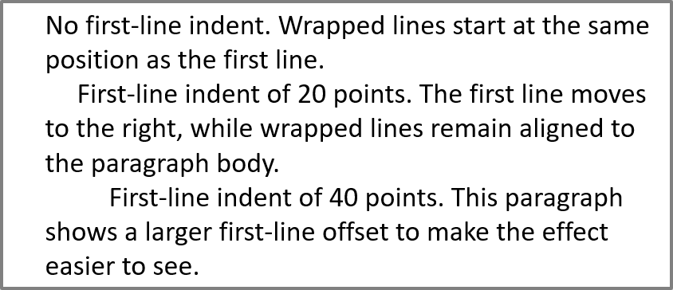

## **Áttekintés**

Az Aspose.Slides for Node.js via Java a szöveget egy szövegkeretek, bekezdések és szakaszok hierarchiájában ábrázolja:

* [TextFrame](https://reference.aspose.com/slides/hu/nodejs-java/aspose.slides/textframe/) a szövegtároló egy alakzatban, és hozzáférést biztosít a bekezdésgyűjteményhez.
* [Paragraph](https://reference.aspose.com/slides/hu/nodejs-java/aspose.slides/paragraph/) egy bekezdést képvisel egy szövegkeretben, és hozzáférést ad a szakaszokhoz és a bekezdés-szintű formázáshoz.
* [Portion](https://reference.aspose.com/slides/hu/nodejs-java/aspose.slides/portion/) egy szövegrészt jelöl egy bekezdésen belül. Minden résznek saját szövege és karakter-szintű formázása lehet.

Egy bekezdés tehát különböző betűtípusokkal, színekkel, méretekkel és egyéb formázással ellátott szöveget tartalmazhat több szakasz használatával.

## **Bekezdések létrehozása és formázása**

### **Bekezdések létrehozása több szakaszzal**

Az alábbi lépések egy szövegkeretet hoznak létre három bekezdéssel, mindegyik három szakaszt tartalmazva:

1. Hozzon létre egy példányt a [Presentation](https://reference.aspose.com/slides/hu/nodejs-java/aspose.slides/presentation/) osztályból.
2. Érje el a megfelelő diát az indexe alapján.
3. Adjon hozzá egy téglalap alakú [AutoShape](https://reference.aspose.com/slides/hu/nodejs-java/aspose.slides/autoshape/) elemet a diára.
4. Szerezze meg az alakzat [TextFrame](https://reference.aspose.com/slides/hu/nodejs-java/aspose.slides/textframe/) elemét.
5. Használja az alapértelmezett bekezdést, és adjon hozzá két további [Paragraph](https://reference.aspose.com/slides/hu/nodejs-java/aspose.slides/paragraph/) objektumot a szövegkerethez.
6. Adjunk elegendő [Portion](https://reference.aspose.com/slides/hu/nodejs-java/aspose.slides/portion/) objektumot minden bekezdéshez, hogy három szakaszt tartalmazzanak. Az alapértelmezett bekezdés már tartalmaz egy üres szakaszt.
7. Állítsa be minden szakasz szövegét.
8. Alkalmazzon karakter-szintű formázást a [Portion.getPortionFormat](https://reference.aspose.com/slides/hu/nodejs-java/aspose.slides/portion/getportionformat/) segítségével.
9. Mentse a módosított prezentációt.

Az alábbi JavaScript példakód megvalósítja a lépéseket:

```javascript
var aspose = aspose || {};
aspose.slides = require("aspose.slides.via.java");
const java = require("java");

const presentation = new aspose.slides.Presentation();
try {
    const slide = presentation.getSlides().get_Item(0);
    const shape = slide.getShapes().addAutoShape(aspose.slides.ShapeType.Rectangle, 50, 150, 300, 150);
    const textFrame = shape.getTextFrame();

    const firstParagraph = textFrame.getParagraphs().get_Item(0);
    firstParagraph.getPortions().add(new aspose.slides.Portion());
    firstParagraph.getPortions().add(new aspose.slides.Portion());

    const secondParagraph = new aspose.slides.Paragraph();
    secondParagraph.getPortions().add(new aspose.slides.Portion());
    secondParagraph.getPortions().add(new aspose.slides.Portion());
    secondParagraph.getPortions().add(new aspose.slides.Portion());
    textFrame.getParagraphs().add(secondParagraph);

    const thirdParagraph = new aspose.slides.Paragraph();
    thirdParagraph.getPortions().add(new aspose.slides.Portion());
    thirdParagraph.getPortions().add(new aspose.slides.Portion());
    thirdParagraph.getPortions().add(new aspose.slides.Portion());
    textFrame.getParagraphs().add(thirdParagraph);

    const paragraphCount = textFrame.getParagraphs().getCount();
    for (let paragraphIndex = 0; paragraphIndex < paragraphCount; paragraphIndex++) {
        const paragraph = textFrame.getParagraphs().get_Item(paragraphIndex);
        const portionCount = paragraph.getPortions().getCount();
        for (let portionIndex = 0; portionIndex < portionCount; portionIndex++) {
            const portion = paragraph.getPortions().get_Item(portionIndex);
            portion.setText("Portion " + (paragraphIndex + 1) + "." + (portionIndex + 1));

            if (portionIndex === 0) {
                portion.getPortionFormat().getFillFormat().setFillType(java.newByte(aspose.slides.FillType.Solid));
                portion.getPortionFormat().getFillFormat().getSolidFillColor().setColor(java.getStaticFieldValue("java.awt.Color", "RED"));
                portion.getPortionFormat().setFontBold(java.newByte(aspose.slides.NullableBool.True));
                portion.getPortionFormat().setFontHeight(15);
            } else if (portionIndex === 1) {
                portion.getPortionFormat().getFillFormat().setFillType(java.newByte(aspose.slides.FillType.Solid));
                portion.getPortionFormat().getFillFormat().getSolidFillColor().setColor(java.getStaticFieldValue("java.awt.Color", "BLUE"));
                portion.getPortionFormat().setFontItalic(java.newByte(aspose.slides.NullableBool.True));
                portion.getPortionFormat().setFontHeight(18);
            }
        }
    }

    presentation.save("paragraphs_with_portions.pptx", aspose.slides.SaveFormat.Pptx);
} finally {
    presentation.dispose();
}
```

## **Felsorolások és számozott listák létrehozása**

### **Felsorolás vagy számozott lista létrehozása**

A felsorolások és a számozás megkönnyítik a kapcsolódó elemek áttekintését. Az Aspose.Slides-ben a lista beállításait a [BulletFormat](https://reference.aspose.com/slides/hu/nodejs-java/aspose.slides/bulletformat/) definiálja.

1. Hozzon létre egy példányt a [Presentation](https://reference.aspose.com/slides/hu/nodejs-java/aspose.slides/presentation/) osztályból.
2. Érje el a megfelelő diát az indexe alapján.
3. Adjon hozzá egy [AutoShape](https://reference.aspose.com/slides/hu/nodejs-java/aspose.slides/autoshape/) elemet a kiválasztott diára.
4. Szerezze meg az alakzat [TextFrame](https://reference.aspose.com/slides/hu/nodejs-java/aspose.slides/textframe/) elemét.
5. Távolítsa el az alapértelmezett bekezdést a szövegkeretből.
6. Hozzon létre egy [Paragraph](https://reference.aspose.com/slides/hu/nodejs-java/aspose.slides/paragraph/) objektumot egy szimbólum pontozáshoz.
7. Állítsa a [BulletFormat.setType](https://reference.aspose.com/slides/hu/nodejs-java/aspose.slides/bulletformat/settype/) értékét a [BulletType.Symbol](https://reference.aspose.com/slides/hu/nodejs-java/aspose.slides/bullettype/) típusra, és adja meg a pontozás karakterét.
8. Állítsa be a bekezdés szövegét, behúzását, a pontozás színét és magasságát.
9. Adja hozzá a bekezdést a szövegkerethez.
10. Hozzon létre egy második bekezdést, és állítsa a [BulletFormat.setType](https://reference.aspose.com/slides/hu/nodejs-java/aspose.slides/bulletformat/settype/) értékét a [BulletType.Numbered](https://reference.aspose.com/slides/hu/nodejs-java/aspose.slides/bullettype/) típusra.
11. Konfigurálja a számozott pontozás stílusát, majd adja hozzá a bekezdést a szövegkerethez.
12. Mentse a prezentációt.

Az alábbi JavaScript példa egy szimbólum és egy számozott pontozást hoz létre:

```javascript
var aspose = aspose || {};
aspose.slides = require("aspose.slides.via.java");
const java = require("java");

const presentation = new aspose.slides.Presentation();
try {
    const slide = presentation.getSlides().get_Item(0);
    const shape = slide.getShapes().addAutoShape(aspose.slides.ShapeType.Rectangle, 200, 200, 400, 200);
    const textFrame = shape.getTextFrame();
    textFrame.getParagraphs().clear();

    const symbolParagraph = new aspose.slides.Paragraph();
    symbolParagraph.setText("Welcome to Aspose.Slides");
    symbolParagraph.getParagraphFormat().getBullet().setType(java.newByte(aspose.slides.BulletType.Symbol));
    symbolParagraph.getParagraphFormat().getBullet().setChar(java.newChar(0x2022));
    symbolParagraph.getParagraphFormat().setIndent(25);
    symbolParagraph.getParagraphFormat().getBullet().getColor().setColorType(aspose.slides.ColorType.RGB);
    symbolParagraph.getParagraphFormat().getBullet().getColor().setColor(java.getStaticFieldValue("java.awt.Color", "BLACK"));
    symbolParagraph.getParagraphFormat().getBullet().setBulletHardColor(java.newByte(aspose.slides.NullableBool.True));
    symbolParagraph.getParagraphFormat().getBullet().setHeight(100);
    textFrame.getParagraphs().add(symbolParagraph);

    const numberedParagraph = new aspose.slides.Paragraph();
    numberedParagraph.setText("This is a numbered item");
    numberedParagraph.getParagraphFormat().getBullet().setType(java.newByte(aspose.slides.BulletType.Numbered));
    numberedParagraph.getParagraphFormat().getBullet().setNumberedBulletStyle(java.newByte(aspose.slides.NumberedBulletStyle.BulletCircleNumWDBlackPlain));
    numberedParagraph.getParagraphFormat().setIndent(25);
    numberedParagraph.getParagraphFormat().getBullet().getColor().setColorType(aspose.slides.ColorType.RGB);
    numberedParagraph.getParagraphFormat().getBullet().getColor().setColor(java.getStaticFieldValue("java.awt.Color", "BLACK"));
    numberedParagraph.getParagraphFormat().getBullet().setBulletHardColor(java.newByte(aspose.slides.NullableBool.True));
    numberedParagraph.getParagraphFormat().getBullet().setHeight(100);
    textFrame.getParagraphs().add(numberedParagraph);

    presentation.save("bulleted_and_numbered_list.pptx", aspose.slides.SaveFormat.Pptx);
} finally {
    presentation.dispose();
}
```

### **Képes pontozás használata**

A képes pontozás lehetővé teszi egy egyéni kép használatát a szimbólum vagy szám helyett.

1. Hozzon létre egy példányt a [Presentation](https://reference.aspose.com/slides/hu/nodejs-java/aspose.slides/presentation/) osztályból.
2. Érje el a megfelelő diát az indexe alapján.
3. Adjon hozzá egy [AutoShape](https://reference.aspose.com/slides/hu/nodejs-java/aspose.slides/autoshape/) elemet, majd szerezze meg annak [TextFrame](https://reference.aspose.com/slides/hu/nodejs-java/aspose.slides/textframe/) elemét.
4. Távolítsa el az alapértelmezett bekezdést a szövegkeretből.
5. Töltse be a pontozási képet, és adja hozzá a prezentáció képgyűjteményéhez egy [PPImage](https://reference.aspose.com/slides/hu/nodejs-java/aspose.slides/ppimage/) segítségével.
6. Hozzon létre egy [Paragraph](https://reference.aspose.com/slides/hu/nodejs-java/aspose.slides/paragraph/) objektumot, és állítsa be a szövegét.
7. Állítsa a [BulletFormat.setType](https://reference.aspose.com/slides/hu/nodejs-java/aspose.slides/bulletformat/settype/) értékét a [BulletType.Picture](https://reference.aspose.com/slides/hu/nodejs-java/aspose.slides/bullettype/) típusra.
8. A [BulletFormat.getPicture](https://reference.aspose.com/slides/hu/nodejs-java/aspose.slides/bulletformat/getpicture/) segítségével rendelje hozzá a képet, és állítsa be a pontozás magasságát.
9. Adja hozzá a bekezdést a szövegkerethez.
10. Mentse a módosított prezentációt.

Az alábbi JavaScript példa képes pontozást hoz létre:

```javascript
var aspose = aspose || {};
aspose.slides = require("aspose.slides.via.java");
const java = require("java");

const presentation = new aspose.slides.Presentation();
try {
    const slide = presentation.getSlides().get_Item(0);

    const bulletImage = aspose.slides.Images.fromFile("image.png");
    let presentationImage;
    try {
        presentationImage = presentation.getImages().addImage(bulletImage);
    } finally {
        bulletImage.dispose();
    }

    const shape = slide.getShapes().addAutoShape(aspose.slides.ShapeType.Rectangle, 200, 200, 400, 200);
    const textFrame = shape.getTextFrame();
    textFrame.getParagraphs().clear();

    const paragraph = new aspose.slides.Paragraph();
    paragraph.setText("Welcome to Aspose.Slides");
    paragraph.getParagraphFormat().getBullet().setType(java.newByte(aspose.slides.BulletType.Picture));
    paragraph.getParagraphFormat().getBullet().getPicture().setImage(presentationImage);
    paragraph.getParagraphFormat().getBullet().setHeight(100);
    textFrame.getParagraphs().add(paragraph);

    presentation.save("picture_bullet.pptx", aspose.slides.SaveFormat.Pptx);
    presentation.save("picture_bullet.ppt", aspose.slides.SaveFormat.Ppt);
} finally {
    presentation.dispose();
}
```

### **Többszintű lista létrehozása**

A [ParagraphFormat.setDepth](https://reference.aspose.com/slides/hu/nodejs-java/aspose.slides/paragraphformat/setdepth/) beállítással helyezhetőek a bekezdések a lista különböző szintjeire. A legfelső szint mélysége `0`.

1. Hozzon létre egy [Presentation](https://reference.aspose.com/slides/hu/nodejs-java/aspose.slides/presentation/) objektumot, és érje el egy diát.
2. Adjon hozzá egy [AutoShape](https://reference.aspose.com/slides/hu/nodejs-java/aspose.slides/autoshape/) elemet, és törölje az alapértelmezett bekezdést a szövegkeretből.
3. Hozzon létre négy bekezdést, és állítsa be a pontozási szimbólumaikat.
4. Állítsa be a [ParagraphFormat.setDepth](https://reference.aspose.com/slides/hu/nodejs-java/aspose.slides/paragraphformat/setdepth/) értékét `0`, `1`, `2` és `3`‑ra.
5. Adja hozzá a bekezdéseket a szövegkerethez, majd mentse a prezentációt.

Az alábbi JavaScript példa egy négy szintű felsorolást hoz létre:

```javascript
var aspose = aspose || {};
aspose.slides = require("aspose.slides.via.java");
const java = require("java");

const presentation = new aspose.slides.Presentation();
try {
    const slide = presentation.getSlides().get_Item(0);
    const shape = slide.getShapes().addAutoShape(aspose.slides.ShapeType.Rectangle, 200, 200, 400, 200);
    const textFrame = shape.getTextFrame();
    textFrame.getParagraphs().clear();

    const firstParagraph = new aspose.slides.Paragraph();
    firstParagraph.setText("Content");
    firstParagraph.getParagraphFormat().getBullet().setType(java.newByte(aspose.slides.BulletType.Symbol));
    firstParagraph.getParagraphFormat().getBullet().setChar(java.newChar(0x2022));
    firstParagraph.getParagraphFormat().getDefaultPortionFormat().getFillFormat().setFillType(java.newByte(aspose.slides.FillType.Solid));
    firstParagraph.getParagraphFormat().getDefaultPortionFormat().getFillFormat().getSolidFillColor().setColor(java.getStaticFieldValue("java.awt.Color", "BLACK"));
    firstParagraph.getParagraphFormat().setDepth(java.newShort(0));

    const secondParagraph = new aspose.slides.Paragraph();
    secondParagraph.setText("Second level");
    secondParagraph.getParagraphFormat().getBullet().setType(java.newByte(aspose.slides.BulletType.Symbol));
    secondParagraph.getParagraphFormat().getBullet().setChar(java.newChar(45));
    secondParagraph.getParagraphFormat().getDefaultPortionFormat().getFillFormat().setFillType(java.newByte(aspose.slides.FillType.Solid));
    secondParagraph.getParagraphFormat().getDefaultPortionFormat().getFillFormat().getSolidFillColor().setColor(java.getStaticFieldValue("java.awt.Color", "BLACK"));
    secondParagraph.getParagraphFormat().setDepth(java.newShort(1));

    const thirdParagraph = new aspose.slides.Paragraph();
    thirdParagraph.setText("Third level");
    thirdParagraph.getParagraphFormat().getBullet().setType(java.newByte(aspose.slides.BulletType.Symbol));
    thirdParagraph.getParagraphFormat().getBullet().setChar(java.newChar(0x2022));
    thirdParagraph.getParagraphFormat().getDefaultPortionFormat().getFillFormat().setFillType(java.newByte(aspose.slides.FillType.Solid));
    thirdParagraph.getParagraphFormat().getDefaultPortionFormat().getFillFormat().getSolidFillColor().setColor(java.getStaticFieldValue("java.awt.Color", "BLACK"));
    thirdParagraph.getParagraphFormat().setDepth(java.newShort(2));

    const fourthParagraph = new aspose.slides.Paragraph();
    fourthParagraph.setText("Fourth level");
    fourthParagraph.getParagraphFormat().getBullet().setType(java.newByte(aspose.slides.BulletType.Symbol));
    fourthParagraph.getParagraphFormat().getBullet().setChar(java.newChar(45));
    fourthParagraph.getParagraphFormat().getDefaultPortionFormat().getFillFormat().setFillType(java.newByte(aspose.slides.FillType.Solid));
    fourthParagraph.getParagraphFormat().getDefaultPortionFormat().getFillFormat().getSolidFillColor().setColor(java.getStaticFieldValue("java.awt.Color", "BLACK"));
    fourthParagraph.getParagraphFormat().setDepth(java.newShort(3));

    textFrame.getParagraphs().add(firstParagraph);
    textFrame.getParagraphs().add(secondParagraph);
    textFrame.getParagraphs().add(thirdParagraph);
    textFrame.getParagraphs().add(fourthParagraph);

    presentation.save("multilevel_list.pptx", aspose.slides.SaveFormat.Pptx);
} finally {
    presentation.dispose();
}
```

### **Számozott listaelemek kezdése egyéni értékekkel**

A [BulletFormat.setNumberedBulletStartWith](https://reference.aspose.com/slides/hu/nodejs-java/aspose.slides/bulletformat/setnumberedbulletstartwith/) segítségével megadható a számozott bekezdés kezdeti száma.

1. Hozzon létre egy [Presentation](https://reference.aspose.com/slides/hu/nodejs-java/aspose.slides/presentation/) objektumot, és adjon hozzá egy [AutoShape](https://reference.aspose.com/slides/hu/nodejs-java/aspose.slides/autoshape/) elemet a diára.
2. Törölje az alapértelmezett bekezdést az alakzat szövegkeretéről.
3. Hozzon létre három számozott bekezdést.
4. Állítsa a [BulletFormat.setNumberedBulletStartWith](https://reference.aspose.com/slides/hu/nodejs-java/aspose.slides/bulletformat/setnumberedbulletstartwith/) értékét `2`, `3` és `7`‑re a megfelelő bekezdéseknél.
5. Adja hozzá a bekezdéseket a szövegkerethez, majd mentse a prezentációt.

Az alábbi JavaScript példa egyedi kezdőszámot rendel minden bekezdéshez:

```javascript
var aspose = aspose || {};
aspose.slides = require("aspose.slides.via.java");
const java = require("java");

const presentation = new aspose.slides.Presentation();
try {
    const slide = presentation.getSlides().get_Item(0);
    const shape = slide.getShapes().addAutoShape(aspose.slides.ShapeType.Rectangle, 200, 200, 400, 200);
    const textFrame = shape.getTextFrame();
    textFrame.getParagraphs().clear();

    const firstParagraph = new aspose.slides.Paragraph();
    firstParagraph.setText("Start at 2");
    firstParagraph.getParagraphFormat().getBullet().setType(java.newByte(aspose.slides.BulletType.Numbered));
    firstParagraph.getParagraphFormat().getBullet().setNumberedBulletStartWith(java.newShort(2));
    textFrame.getParagraphs().add(firstParagraph);

    const secondParagraph = new aspose.slides.Paragraph();
    secondParagraph.setText("Start at 3");
    secondParagraph.getParagraphFormat().getBullet().setType(java.newByte(aspose.slides.BulletType.Numbered));
    secondParagraph.getParagraphFormat().getBullet().setNumberedBulletStartWith(java.newShort(3));
    textFrame.getParagraphs().add(secondParagraph);

    const thirdParagraph = new aspose.slides.Paragraph();
    thirdParagraph.setText("Start at 7");
    thirdParagraph.getParagraphFormat().getBullet().setType(java.newByte(aspose.slides.BulletType.Numbered));
    thirdParagraph.getParagraphFormat().getBullet().setNumberedBulletStartWith(java.newShort(7));
    textFrame.getParagraphs().add(thirdParagraph);

    presentation.save("custom_numbered_list.pptx", aspose.slides.SaveFormat.Pptx);
} finally {
    presentation.dispose();
}
```

## **Bekezdéselrendezés és végjellemzők vezérlése**

### **Első sor behúzás beállítása**

A [ParagraphFormat.setIndent](https://reference.aspose.com/slides/hu/nodejs-java/aspose.slides/paragraphformat/setindent/) használatával szabályozható a bekezdés első sorának behúzása. Ez a metódus csak az első sort mozgatja a bekezdés bal margójához képest. A pozitív érték jobbra tolja az első sort, míg a többi sor a bekezdés szövegéhez igazodik.

A teljes bekezdés mozgatásához használja a [ParagraphFormat.setMarginLeft](https://reference.aspose.com/slides/hu/nodejs-java/aspose.slides/paragraphformat/setmarginleft/)‑t. Az első sor csak a [ParagraphFormat.setIndent](https://reference.aspose.com/slides/hu/nodejs-java/aspose.slides/paragraphformat/setindent/)‑val mozgatható.

Az alábbi példa több bekezdést hoz létre, és különböző [ParagraphFormat.setIndent](https://reference.aspose.com/slides/hu/nodejs-java/aspose.slides/paragraphformat/setindent/) értékeket alkalmaz, hogy bemutassa az első sor behúzásának hatását a bekezdéselrendezésre.

1. Hozzon létre egy példányt a [Presentation](https://reference.aspose.com/slides/hu/nodejs-java/aspose.slides/presentation/) osztályból.
2. Érje el a céldiat.
3. Adjon hozzá egy téglalap alakú [AutoShape](https://reference.aspose.com/slides/hu/nodejs-java/aspose.slides/autoshape/) elemet a diára.
4. Szerezze meg az alakzat [TextFrame](https://reference.aspose.com/slides/hu/nodejs-java/aspose.slides/textframe/) elemét, és távolítsa el az alapértelmezett bekezdést.
5. Hozzon létre több bekezdést, és állítson be különböző [ParagraphFormat.setIndent](https://reference.aspose.com/slides/hu/nodejs-java/aspose.slides/paragraphformat/setindent/) értékeket.
6. Adja hozzá a bekezdéseket a szövegkerethez.
7. Mentse a módosított prezentációt.

Ez a kód megmutatja, hogyan állíthat be bekezdésbehúzást:

```javascript
var aspose = aspose || {};
aspose.slides = require("aspose.slides.via.java");
const java = require("java");

const presentation = new aspose.slides.Presentation();
try {
    const slide = presentation.getSlides().get_Item(0);

    const shape = slide.getShapes().addAutoShape(aspose.slides.ShapeType.Rectangle, 50, 50, 420, 220);
    shape.getFillFormat().setFillType(java.newByte(aspose.slides.FillType.NoFill));
    shape.getLineFormat().getFillFormat().setFillType(java.newByte(aspose.slides.FillType.Solid));
    shape.getLineFormat().getFillFormat().getSolidFillColor().setColor(java.getStaticFieldValue("java.awt.Color", "GRAY"));

    const textFrame = shape.getTextFrame();
    textFrame.getTextFrameFormat().setAutofitType(java.newByte(aspose.slides.TextAutofitType.Shape));
    textFrame.getParagraphs().clear();

    const firstParagraph = new aspose.slides.Paragraph();
    firstParagraph.setText("No first-line indent. Wrapped lines start at the same position as the first line.");
    firstParagraph.getParagraphFormat().getDefaultPortionFormat().getFillFormat().setFillType(java.newByte(aspose.slides.FillType.Solid));
    firstParagraph.getParagraphFormat().getDefaultPortionFormat().getFillFormat().getSolidFillColor().setColor(java.getStaticFieldValue("java.awt.Color", "BLACK"));
    firstParagraph.getParagraphFormat().setMarginLeft(20);
    firstParagraph.getParagraphFormat().setIndent(0);

    const secondParagraph = new aspose.slides.Paragraph();
    secondParagraph.setText("First-line indent of 20 points. The first line moves to the right, while wrapped lines remain aligned to the paragraph body.");
    secondParagraph.getParagraphFormat().getDefaultPortionFormat().getFillFormat().setFillType(java.newByte(aspose.slides.FillType.Solid));
    secondParagraph.getParagraphFormat().getDefaultPortionFormat().getFillFormat().getSolidFillColor().setColor(java.getStaticFieldValue("java.awt.Color", "BLACK"));
    secondParagraph.getParagraphFormat().setMarginLeft(20);
    secondParagraph.getParagraphFormat().setIndent(20);

    const thirdParagraph = new aspose.slides.Paragraph();
    thirdParagraph.setText("First-line indent of 40 points. This paragraph shows a larger first-line offset to make the effect easier to see.");
    thirdParagraph.getParagraphFormat().getDefaultPortionFormat().getFillFormat().setFillType(java.newByte(aspose.slides.FillType.Solid));
    thirdParagraph.getParagraphFormat().getDefaultPortionFormat().getFillFormat().getSolidFillColor().setColor(java.getStaticFieldValue("java.awt.Color", "BLACK"));
    thirdParagraph.getParagraphFormat().setMarginLeft(20);
    thirdParagraph.getParagraphFormat().setIndent(40);

    textFrame.getParagraphs().add(firstParagraph);
    textFrame.getParagraphs().add(secondParagraph);
    textFrame.getParagraphs().add(thirdParagraph);

    presentation.save("paragraph_indent.pptx", aspose.slides.SaveFormat.Pptx);
} finally {
    presentation.dispose();
}
```

Az eredmény:



### **Függőleges behúzás beállítása**

A függőleges (hanging) behúzás egy olyan bekezdéselrendezés, ahol az első sor balra indul a többi sorhoz képest. Az Aspose.Slides-ben ezt a hatást a [ParagraphFormat.setIndent](https://reference.aspose.com/slides/hu/nodejs-java/aspose.slides/paragraphformat/setindent/) segítségével állíthatja be. Negatív érték megadása balra tolja az első sort a bekezdés testétől.

Gyakorlatban a [ParagraphFormat.setMarginLeft](https://reference.aspose.com/slides/hu/nodejs-java/aspose.slides/paragraphformat/setmarginleft/) határozza meg a bekezdés testének bal pozícióját, míg a [ParagraphFormat.setIndent](https://reference.aspose.com/slides/hu/nodejs-java/aspose.slides/paragraphformat/setindent/) az első sor relatív helyzetét szabályozza. Függőleges behúzás létrehozásához adjon meg pozitív értéket a `setMarginLeft`‑nek, és negatív értéket a `setIndent`‑nek.

Ez a formázás hasznos bibliográfiákhoz, hivatkozásokhoz, szójegyzékekhez és más bekezdésekhez, ahol a sorok a bekezdés testének alá kell, hogy illeszkedjenek, nem az első sor első karakteréhez.

1. Hozzon létre egy [Presentation](https://reference.aspose.com/slides/hu/nodejs-java/aspose.slides/presentation/) példányt.
2. Érje el a céldiat.
3. Adjon hozzá egy téglalap [AutoShape](https://reference.aspose.com/slides/hu/nodejs-java/aspose.slides/autoshape/) elemet a diára.
4. Szerezze meg az alakzat [TextFrame](https://reference.aspose.com/slides/hu/nodejs-java/aspose.slides/textframe/) elemét, és távolítsa el az alapértelmezett bekezdést.
5. Hozzon létre bekezdéseket, és adjon meg pozitív értéket a [ParagraphFormat.setMarginLeft](https://reference.aspose.com/slides/hu/nodejs-java/aspose.slides/paragraphformat/setmarginleft/)‑nek.
6. Adjon meg negatív értéket a [ParagraphFormat.setIndent](https://reference.aspose.com/slides/hu/nodejs-java/aspose.slides/paragraphformat/setindent/)‑nek a függőleges behúzás létrehozásához.
7. Adja hozzá a bekezdéseket a szövegkerethez.
8. Mentse a módosított prezentációt.

Ez a kód megmutatja, hogyan állíthat be függőleges behúzást egy bekezdéshez:

```javascript
var aspose = aspose || {};
aspose.slides = require("aspose.slides.via.java");
const java = require("java");

const presentation = new aspose.slides.Presentation();
try {
    const slide = presentation.getSlides().get_Item(0);

    const shape = slide.getShapes().addAutoShape(aspose.slides.ShapeType.Rectangle, 50, 50, 420, 220);
    shape.getFillFormat().setFillType(java.newByte(aspose.slides.FillType.NoFill));
    shape.getLineFormat().getFillFormat().setFillType(java.newByte(aspose.slides.FillType.Solid));
    shape.getLineFormat().getFillFormat().getSolidFillColor().setColor(java.getStaticFieldValue("java.awt.Color", "GRAY"));

    const textFrame = shape.getTextFrame();
    textFrame.getTextFrameFormat().setAutofitType(java.newByte(aspose.slides.TextAutofitType.Shape));
    textFrame.getParagraphs().clear();

    const firstParagraph = new aspose.slides.Paragraph();
    firstParagraph.setText("A hanging indent is created by combining a positive left margin with a negative indent. The first line starts to the left, while wrapped lines align with the paragraph body.");
    firstParagraph.getParagraphFormat().getDefaultPortionFormat().getFillFormat().setFillType(java.newByte(aspose.slides.FillType.Solid));
    firstParagraph.getParagraphFormat().getDefaultPortionFormat().getFillFormat().getSolidFillColor().setColor(java.getStaticFieldValue("java.awt.Color", "BLACK"));
    firstParagraph.getParagraphFormat().setMarginLeft(40);
    firstParagraph.getParagraphFormat().setIndent(-20);

    const secondParagraph = new aspose.slides.Paragraph();
    secondParagraph.setText("This second example uses a deeper hanging indent so the difference between the first line and the wrapped lines is easier to compare.");
    secondParagraph.getParagraphFormat().getDefaultPortionFormat().getFillFormat().setFillType(java.newByte(aspose.slides.FillType.Solid));
    secondParagraph.getParagraphFormat().getDefaultPortionFormat().getFillFormat().getSolidFillColor().setColor(java.getStaticFieldValue("java.awt.Color", "BLACK"));
    secondParagraph.getParagraphFormat().setMarginLeft(60);
    secondParagraph.getParagraphFormat().setIndent(-30);

    textFrame.getParagraphs().add(firstParagraph);
    textFrame.getParagraphs().add(secondParagraph);

    presentation.save("hanging_indent.pptx", aspose.slides.SaveFormat.Pptx);
} finally {
    presentation.dispose();
}
```

Az eredmény:


### **A bekezdés végejének tulajdonságai beállítása**

A [Paragraph.setEndParagraphPortionFormat](https://reference.aspose.com/slides/hu/nodejs-java/aspose.slides/paragraph/setendparagraphportionformat/) a bekezdés végejelének formázását szabályozza. Az alábbi példa betűméretet és latin betűtípust állít be a második bekezdés végejelére:

1. Hozzon létre vagy töltse be egy [Presentation](https://reference.aspose.com/slides/hu/nodejs-java/aspose.slides/presentation/) objektumot, és érje el egy diát.
2. Adjon hozzá egy [AutoShape](https://reference.aspose.com/slides/hu/nodejs-java/aspose.slides/autoshape/) elemet, és törölje az alapértelmezett bekezdést.
3. Hozzon létre két bekezdést, és adjon hozzá szövegszakaszokat.
4. Hozzon létre egy [PortionFormat](https://reference.aspose.com/slides/hu/nodejs-java/aspose.slides/portionformat/) objektumot a második bekezdés végejeléhez.
5. Állítsa be a [BasePortionFormat.setFontHeight](https://reference.aspose.com/slides/hu/nodejs-java/aspose.slides/baseportionformat/#setFontHeight) és a [BasePortionFormat.setLatinFont](https://reference.aspose.com/slides/hu/nodejs-java/aspose.slides/baseportionformat/#setLatinFont) értékeit.
6. A [Paragraph.setEndParagraphPortionFormat](https://reference.aspose.com/slides/hu/nodejs-java/aspose.slides/paragraph/setendparagraphportionformat/) használatával rendelje hozzá a formátumot, majd mentse a prezentációt.

```javascript
var aspose = aspose || {};
aspose.slides = require("aspose.slides.via.java");

const presentation = new aspose.slides.Presentation();
try {
    const slide = presentation.getSlides().get_Item(0);
    const shape = slide.getShapes().addAutoShape(aspose.slides.ShapeType.Rectangle, 10, 10, 200, 250);
    const textFrame = shape.getTextFrame();
    textFrame.getParagraphs().clear();

    const firstParagraph = new aspose.slides.Paragraph();
    firstParagraph.getPortions().add(new aspose.slides.Portion("Sample text"));

    const secondParagraph = new aspose.slides.Paragraph();
    secondParagraph.getPortions().add(new aspose.slides.Portion("Sample text 2"));

    const endParagraphFormat = new aspose.slides.PortionFormat();
    endParagraphFormat.setFontHeight(48);
    endParagraphFormat.setLatinFont(new aspose.slides.FontData("Times New Roman"));
    secondParagraph.setEndParagraphPortionFormat(endParagraphFormat);

    textFrame.getParagraphs().add(firstParagraph);
    textFrame.getParagraphs().add(secondParagraph);

    presentation.save("end_paragraph_format.pptx", aspose.slides.SaveFormat.Pptx);
} finally {
    presentation.dispose();
}
```

## **Megjelenített sorok számolása**

A bekezdés szabályok, amelyek az automatikus sortörést és a sortöréskor használt írásjelet befolyásolják, megtalálhatók a [Control Line Breaking](/slides/hu/nodejs-java/text-formatting/#control-line-breaking) és a [Control Hanging Punctuation](/slides/hu/nodejs-java/text-formatting/#control-hanging-punctuation) szakaszokban.

A [Paragraph.getLinesCount](https://reference.aspose.com/slides/hu/nodejs-java/aspose.slides/paragraph/#getLinesCount) használatával megszámolhatók a bekezdés által elrendezés után elfoglalt sorok, beleértve az automatikus sortörést. Ez hasznos a szöveghossz és a layout ellenőrzésére prezentációs sablonokban.

Egy bekezdés egy elem a [TextFrame.getParagraphs](https://reference.aspose.com/slides/hu/nodejs-java/aspose.slides/textframe/#getParagraphs) gyűjteményben, és több megjelenített sort is elfoglalhat. Egy explicit sortörés egy bekezdésen belül új sort hoz létre anélkül, hogy új bekezdést generálna. Az automatikus sortörés a rendelkezésre álló szélesség alapján hoz létre sorokat anélkül, hogy a szövegben explicit sortöréseket helyezne el. Ezért a bekezdések vagy a sortörés karakterek számolása nem adja meg a tényleges megjelenített sorok számát.

Az alábbi példa egy szöveges alakzatot hoz létre, megszámolja annak sorait, szűkíti az alakzatot, majd lecseréli a szöveget egy rövidebb karakterláncra. A sortörés engedélyezve van, az automatikus illesztés (autofit) pedig le van tiltva, így az alakzat szélessége szabályozza a sortörést anélkül, hogy a szöveget vagy az alakzatot automatikusan méretezné. Az alakzat méretei pontban vannak megadva. Végül a példa egy további bekezdést ad hozzá, és összeadja a sorok számát a szövegkeretben.

```javascript
var aspose = aspose || {};
aspose.slides = require("aspose.slides.via.java");
const java = require("java");

const presentation = new aspose.slides.Presentation();
try {
    const slide = presentation.getSlides().get_Item(0);

    const shape = slide.getShapes().addAutoShape(aspose.slides.ShapeType.Rectangle, 50, 50, 400, 200);
    const textFrame = shape.getTextFrame();
    textFrame.getTextFrameFormat().setWrapText(java.newByte(aspose.slides.NullableBool.True));
    textFrame.getTextFrameFormat().setAutofitType(java.newByte(aspose.slides.TextAutofitType.None));

    const paragraph = textFrame.getParagraphs().get_Item(0);
    paragraph.getParagraphFormat().getDefaultPortionFormat().setFontHeight(20);
    paragraph.setText("This text demonstrates how automatic wrapping changes the number of rendered lines.");
    console.log("Original width: " + paragraph.getLinesCount());

    shape.setWidth(150);
    console.log("Narrower shape: " + paragraph.getLinesCount());

    paragraph.setText("Short text.");
    console.log("Shorter text: " + paragraph.getLinesCount());

    const secondParagraph = new aspose.slides.Paragraph();
    secondParagraph.setText("Another paragraph.");
    secondParagraph.getParagraphFormat().getDefaultPortionFormat().setFontHeight(20);
    textFrame.getParagraphs().add(secondParagraph);

    let totalLineCount = 0;
    for (let i = 0; i < textFrame.getParagraphs().getCount(); i++) {
        const currentParagraph = textFrame.getParagraphs().get_Item(i);
        totalLineCount += currentParagraph.getLinesCount();
    }
    console.log("Total lines in the text frame: " + totalLineCount);
} finally {
    presentation.dispose();
}
```

Ezzel a szöveggel és ezekkel a méretekkel a forma szűkítése növeli a sorok számát, míg a rövid karakterláncra cserélés csökkenti azt. A pontos számok változhatnak a betűkészlet elérhetőségétől, helyettesítéstől, betűmérettől, margóktól, behúzásoktól, sortöréstől és az autofit beállításoktól függően. A célkörnyezetben használt betűkészleteket és elrendezési beállításokat alkalmazza a sablon ellenőrzésekor.

Magában a sorok száma nem határozza meg, hogy a szöveg túllépi-e a tárolót. A rendelkezésre álló magasság, sormagasságok, bekezdés- és sorközök, valamint az autofit viselkedés is számít; még egyetlen sor is túlcsordulhat, ha a sortörés le van tiltva.

## **Bekezdés tartalmának importálása és exportálása**

### **HTML szöveg importálása bekezdésekbe**

A [ParagraphCollection.addFromHtml](https://reference.aspose.com/slides/hu/nodejs-java/aspose.slides/paragraphcollection/addfromhtml/) segítségével HTML jelölést konvertálhat bekezdésekké és szakaszokká egy szövegkeretben.

1. Hozzon létre egy példányt a [Presentation](https://reference.aspose.com/slides/hu/nodejs-java/aspose.slides/presentation/) osztályból.
2. Érje el egy diát, és adjon hozzá egy [AutoShape](https://reference.aspose.com/slides/hu/nodejs-java/aspose.slides/autoshape/) elemet.
3. Szerezze meg az alakzat [TextFrame](https://reference.aspose.com/slides/hu/nodejs-java/aspose.slides/textframe/) elemét, és törölje az alapértelmezett bekezdést.
4. Definiálja vagy olvassa be a forrás HTML karakterláncot.
5. Adja át az HTML karakterláncot a [ParagraphCollection.addFromHtml](https://reference.aspose.com/slides/hu/nodejs-java/aspose.slides/paragraphcollection/addfromhtml/) metódusnak.
6. Mentse a módosított prezentációt.

Ez a JavaScript példa HTML-t importál egy szövegkeretbe:

```javascript
var aspose = aspose || {};
aspose.slides = require("aspose.slides.via.java");
const java = require("java");

const presentation = new aspose.slides.Presentation();
try {
    const slide = presentation.getSlides().get_Item(0);
    const shapeWidth = presentation.getSlideSize().getSize().getWidth() - 20;
    const shapeHeight = presentation.getSlideSize().getSize().getHeight() - 20;
    const shape = slide.getShapes().addAutoShape(aspose.slides.ShapeType.Rectangle, 10, 10, shapeWidth, shapeHeight);
    shape.getFillFormat().setFillType(java.newByte(aspose.slides.FillType.NoFill));
    shape.getTextFrame().getParagraphs().clear();

    const html = "<p><b>Aspose.Slides</b> imports HTML text into presentation paragraphs.</p>";
    shape.getTextFrame().getParagraphs().addFromHtml(html);
    presentation.save("html_text.pptx", aspose.slides.SaveFormat.Pptx);
} finally {
    presentation.dispose();
}
```

### **Bekezdés szöveg exportálása HTML-be**

A [ParagraphCollection.exportToHtml](https://reference.aspose.com/slides/hu/nodejs-java/aspose.slides/paragraphcollection/exporttohtml/) segítségével egy kijelölt bekezdéssort exportálhat HTML-ként.

1. Hozzon létre vagy töltse be egy [Presentation](https://reference.aspose.com/slides/hu/nodejs-java/aspose.slides/presentation/) példányt.
2. Érje el a diát, és keresse meg azt az [AutoShape](https://reference.aspose.com/slides/hu/nodejs-java/aspose.slides/autoshape/) elemet, amely a szöveget tartalmazza.
3. Szerezze meg az alakzat [TextFrame](https://reference.aspose.com/slides/hu/nodejs-java/aspose.slides/textframe/) elemét.
4. Hívja meg a [ParagraphCollection.exportToHtml](https://reference.aspose.com/slides/hu/nodejs-java/aspose.slides/paragraphcollection/exporttohtml/)‑t a kezdő bekezdés indexével és az exportálandó bekezdések számával.
5. Írja a visszakapott HTML karakterláncot egy fájlba.

Ez a önálló JavaScript példa létrehoz egy szövegalkalmazást, és exportálja az összes bekezdését:

```javascript
var aspose = aspose || {};
aspose.slides = require("aspose.slides.via.java");
const java = require("java");
const fs = require("fs");

const presentation = new aspose.slides.Presentation();
try {
    const slide = presentation.getSlides().get_Item(0);
    const sourceShape = slide.getShapes().addAutoShape(aspose.slides.ShapeType.Rectangle, 20, 20, 400, 100);
    const sourceTextFrame = sourceShape.getTextFrame();
    sourceTextFrame.getParagraphs().clear();
    for (const text of ["First paragraph", "Second paragraph", "Third paragraph"]) {
        const sourceParagraph = new aspose.slides.Paragraph();
        sourceParagraph.setText(text);
        sourceTextFrame.getParagraphs().add(sourceParagraph);
    }
    const shape = slide.getShapes().get_Item(0);

    if (java.instanceOf(shape, "com.aspose.slides.IAutoShape")) {
        const textFrame = shape.getTextFrame();
        if (textFrame !== null) {
            const paragraphs = textFrame.getParagraphs();
            const html = paragraphs.exportToHtml(0, paragraphs.getCount(), null);
            fs.writeFileSync("paragraphs.html", html, "utf8");
        } else {
            console.log("The first shape does not contain a text frame.");
        }
    } else {
        console.log("The first shape is not a text shape.");
    }
} finally {
    presentation.dispose();
}
```

### **Bekezdés renderelése képként**

A [Paragraph.getImage](https://reference.aspose.com/slides/hu/nodejs-java/aspose.slides/paragraph/#getImage) egyetlen bekezdést renderel közvetlenül, és egy [IImage](https://reference.aspose.com/slides/hu/nodejs-java/aspose.slides/iimage/) objektumot ad vissza. A kapott képet a [IImage.save](https://reference.aspose.com/slides/hu/nodejs-java/aspose.slides/iimage/#save/)‑vel mentheti. Nem szükséges a tartalmazó alakzatot renderelni vagy a bitmapet manuálisan kivágni.

A [Paragraph.getImage](https://reference.aspose.com/slides/hu/nodejs-java/aspose.slides/paragraph/#getImage) `null`‑t adhat vissza, ha a bekezdés nem található a szülőgyűjteményben, nincs érvényes renderelési határa, vagy nem renderelhető. Ellenőrizze az eredményt mentés előtt, és a felhasználás után szabadítsa fel a visszakapott képet.

#### **Bekezdés renderelése alapértelmezett méretarányban**

Az alábbi szövegdoboz három bekezdést tartalmaz:


Az alábbi példakód a második bekezdést rendereli egy normál szövegalkalmazásban alapértelmezett méretarányban, és PNG formátumban menti a visszakapott képet. A `finally` blokk biztosítja a kép megfelelő felszabadítását.

```javascript
var aspose = aspose || {};
aspose.slides = require("aspose.slides.via.java");
const java = require("java");

const presentation = new aspose.slides.Presentation();
try {
    const slide = presentation.getSlides().get_Item(0);
    const sourceShape = slide.getShapes().addAutoShape(aspose.slides.ShapeType.Rectangle, 20, 20, 400, 100);
    const sourceTextFrame = sourceShape.getTextFrame();
    sourceTextFrame.getParagraphs().clear();
    for (const text of ["First paragraph", "Second paragraph", "Third paragraph"]) {
        const sourceParagraph = new aspose.slides.Paragraph();
        sourceParagraph.setText(text);
        sourceTextFrame.getParagraphs().add(sourceParagraph);
    }
    const shape = slide.getShapes().get_Item(0);

    if (java.instanceOf(shape, "com.aspose.slides.IAutoShape")) {
        const textFrame = shape.getTextFrame();
        if (textFrame !== null && textFrame.getParagraphs().getCount() > 1) {
            const paragraph = textFrame.getParagraphs().get_Item(1);
            const paragraphImage = paragraph.getImage();

            if (paragraphImage !== null) {
                try {
                    paragraphImage.save("paragraph.png", aspose.slides.ImageFormat.Png);
                } finally {
                    paragraphImage.dispose();
                }
            } else {
                console.log("The paragraph could not be rendered.");
            }
        } else {
            console.log("The expected paragraph was not found.");
        }
    } else {
        console.log("The first shape is not a text shape.");
    }
} finally {
    presentation.dispose();
}
```

Az eredmény:


#### **Bekezdés renderelése táblázatcellában méretezéssel**

Használja a [Paragraph.getImage](https://reference.aspose.com/slides/hu/nodejs-java/aspose.slides/paragraph/#getImage) olyan túlterhelését, amely `scaleX` és `scaleY` paramétereket fogad, hogy beállítsa a vízszintes és függőleges méretezési tényezőket. Az alábbi példa létrehoz egy táblázatot, a bekezdést az első cellájában kétszeres alapmérettel rendereli, és PNG képként menti az eredményt.

```javascript
var aspose = aspose || {};
aspose.slides = require("aspose.slides.via.java");
const java = require("java");

const scaleX = 2;
const scaleY = 2;

const presentation = new aspose.slides.Presentation();
try {
    const slide = presentation.getSlides().get_Item(0);
    const columnWidths = java.newArray("double", [300]);
    const rowHeights = java.newArray("double", [80]);
    const table = slide.getShapes().addTable(50, 50, columnWidths, rowHeights);
    const paragraph = table.get_Item(0, 0).getTextFrame().getParagraphs().get_Item(0);
    paragraph.setText("Text in a table cell");

    const paragraphImage = paragraph.getImage(scaleX, scaleY);
    if (paragraphImage !== null) {
        try {
            paragraphImage.save("table_paragraph.png", aspose.slides.ImageFormat.Png);
        } finally {
            paragraphImage.dispose();
        }
    } else {
        console.log("The paragraph could not be rendered.");
    }
} finally {
    presentation.dispose();
}
```

Az `1` tényező megőrzi az adott tengely alap pixelméretét. Például a `2` mindkét tényező esetén egy olyan képet eredményez, amelynek szélessége és magassága megközelítőleg kétszerese az alapméreteknek, így négyszer annyi pixel keletkezik. A nagyobb tényezők általában élesebb szöveget biztosítanak nagyítás vagy nagy felbontású kimenet esetén, de növelik a memóriahasználatot és a fájlméretet. Az `1`‑nél kisebb tényezők kisebb részletességű képeket hoznak létre. Használjon egyenlő tényezőket a bekezdés képarányának megtartásához; a különböző vízszintes és függőleges tényezők külön-külön nyújtják a kimenetet.

Egy teljes alakzat renderelése a [Shape.getImage](https://reference.aspose.com/slides/hu/nodejs-java/aspose.slides/shape/#getImage)‑vel akkor hasznos, ha a kimenetnek tartalmaznia kell az alakzat kitöltését, szegélyét vagy egyéb vizuális kontextusát. Kizárólag bekezdés‑képhez használja a [Paragraph.getImage](https://reference.aspose.com/slides/hu/nodejs-java/aspose.slides/paragraph/#getImage)‑t.

## **GYIK**

**Teljesen letiltható a sortörés egy szövegkereten belül?**

Igen. A [TextFrameFormat.setWrapText](https://reference.aspose.com/slides/hu/nodejs-java/aspose.slides/textframeformat/setwraptext/) beállításával letiltható a sortörés, így a sorok nem törnek a szövegkeret szélein.

**Hogyan kaphatom meg egy adott bekezdés pontos diára vonatkozó határait?**

Használja a [Paragraph.getRect](https://reference.aspose.com/slides/hu/nodejs-java/aspose.slides/paragraph/getrect/) metódust a bekezdés határoló téglalapjának lekérésére. A [Portion.getRect](https://reference.aspose.com/slides/hu/nodejs-java/aspose.slides/portion/#getRect) egy egyedi szakasz határait adja vissza.

**Hol van a bekezdés igazítása (balra, jobbra, középre vagy sorkizárt) szabályozva?**

A [ParagraphFormat.setAlignment](https://reference.aspose.com/slides/hu/nodejs-java/aspose.slides/paragraphformat/setalignment/) egy bekezdés‑szintű beállítás, és az egész bekezdésre alkalmazódik, függetlenül az egyedi szakaszformázástól.

**Beállítható a nyelvhelyességi nyelv egy bekezdés egy részére?**

Igen. A [BasePortionFormat.setLanguageId](https://reference.aspose.com/slides/hu/nodejs-java/aspose.slides/baseportionformat/#setLanguageId) beállítható egyedi szakaszokra, így egy bekezdés több nyelven is tartalmazhat szöveget.