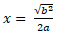

## **Áttekintés**

A PowerPoint egyenleteket az Office Math Markup Language (OMML) formátumban tárolja. Az Aspose.Slides for Node.js via Java segítségével programozottan hozhat létre ugyanilyen matematikai tartalmakat: törtöket, gyököket, függvényeket, határokat, N-értelmű operátorokat, mátrixokat, tömböket és formázott matematikai blokkokat.

PowerPointban a felhasználók általában a **Insert > Equation** menüből adnak hozzá egyenleteket:


Az eredmény szerkeszthető matematikai szöveg a dián:



Az Aspose.Slides három fő objektumon keresztül építi fel ezt a matematikai szöveget:

- A matematikai alakzat, amelyet az [addMathShape](https://reference.aspose.com/slides/hu/nodejs-java/aspose.slides/shapecollection/#addMathShape) hoz létre, az az alakzat, amely az egyenletet tartalmazza.
- [MathPortion](https://reference.aspose.com/slides/hu/nodejs-java/aspose.slides/mathportion/) tárolja a matematikai tartalmat az alakzat szövegkeretén belül.
- [MathParagraph](https://reference.aspose.com/slides/hu/nodejs-java/aspose.slides/mathparagraph/) egy vagy több [MathBlock](https://reference.aspose.com/slides/hu/nodejs-java/aspose.slides/mathblock/) objektumot tartalmaz.

Az alábbi legtöbb példa a [MathematicalText](https://reference.aspose.com/slides/hu/nodejs-java/aspose.slides/mathematicaltext/) és a [MathElementBase](https://reference.aspose.com/slides/hu/nodejs-java/aspose.slides/mathelementbase/) folyékony metódusait használja a kód rövid és olvasható tartása érdekében.

MathML export esetén tekintse meg a [Matematikai egyenletek exportálása prezentációkból Node.js segítségével Java](/slides/hu/nodejs-java/exporting-math-equations/) oldalt.

## **Egyenlet létrehozása**

Ez a példa egy matematikai alakzatot hoz létre és hozzáadja a Pitagorasz tételt:


```javascript
let presentation = new aspose.slides.Presentation();
try {
    let slide = presentation.getSlides().get_Item(0);

    let mathShape = slide.getShapes().addMathShape(20, 20, 700, 120);
    let mathParagraph = mathShape.getTextFrame().getParagraphs()
            .get_Item(0).getPortions().get_Item(0).getMathParagraph();

    let equation = new aspose.slides.MathematicalText("c")
            .setSuperscript("2")
            .join("=")
            .join(new aspose.slides.MathematicalText("a").setSuperscript("2"))
            .join("+")
            .join(new aspose.slides.MathematicalText("b").setSuperscript("2"));

    mathParagraph.add(equation);

    presentation.save("pythagorean-theorem.pptx", aspose.slides.SaveFormat.Pptx);
} finally {
    presentation.dispose();
}
```

{}
`addMathShape` olyan alakzatot hoz létre, amely már tartalmaz egy matematikai bekezdést. Hozzáfér az első `MathPortion`-hoz, lekéri annak `MathParagraph`-ját, és hozzáadja a matematikai blokkokat vagy elemeket.
{}

## **Törtök hozzáadása**

A [`divide`](https://reference.aspose.com/slides/hu/nodejs-java/aspose.slides/mathelementbase/) használatával hozhat létre törtet. A tört stílusát a [MathFractionTypes](https://reference.aspose.com/slides/hu/nodejs-java/aspose.slides/mathfractiontypes/) segítségével választhatja ki.


```javascript
let presentation = new aspose.slides.Presentation();
try {
    let slide = presentation.getSlides().get_Item(0);

    let mathShape = slide.getShapes().addMathShape(20, 20, 700, 100);
    let mathParagraph = mathShape.getTextFrame().getParagraphs()
            .get_Item(0).getPortions().get_Item(0).getMathParagraph();

    let fraction = new aspose.slides.MathematicalText("1")
            .divide("x", aspose.slides.MathFractionTypes.Skewed);

    mathParagraph.add(new aspose.slides.MathBlock(fraction));

    presentation.save("fraction.pptx", aspose.slides.SaveFormat.Pptx);
} finally {
    presentation.dispose();
}
```

Halmozott törthez használja a `MathFractionTypes.Bar`-t:

```javascript
let stackedFraction = new aspose.slides.MathematicalText("x + 1").divide("y - 1", aspose.slides.MathFractionTypes.Bar);
```

## **Gyökök hozzáadása**

A [`radical`](https://reference.aspose.com/slides/hu/nodejs-java/aspose.slides/mathelementbase/) segítségével hozhat létre négyzetgyököt, köbgyököt vagy más gyököt. A jelenlegi elem lesz a alap, az argumentum pedig a kitevő.


```javascript
let presentation = new aspose.slides.Presentation();
try {
    let slide = presentation.getSlides().get_Item(0);

    let mathShape = slide.getShapes().addMathShape(20, 20, 700, 100);
    let mathParagraph = mathShape.getTextFrame().getParagraphs()
            .get_Item(0).getPortions().get_Item(0).getMathParagraph();

    let radical = new aspose.slides.MathematicalText("x")
            .radical("n");

    mathParagraph.add(new aspose.slides.MathBlock(radical));

    presentation.save("radical.pptx", aspose.slides.SaveFormat.Pptx);
} finally {
    presentation.dispose();
}
```

## **Függvények és határok hozzáadása**

A [`asArgumentOfFunction`](https://reference.aspose.com/slides/hu/nodejs-java/aspose.slides/mathelementbase/) vagy a [`function`](https://reference.aspose.com/slides/hu/nodejs-java/aspose.slides/mathelementbase/) használható olyan függvényekhez, mint `sin(x)`, `log(x)`, vagy egyedi függvénynevek. Határok esetén a `lim`-et helyezze egy [MathLimit](https://reference.aspose.com/slides/hu/nodejs-java/aspose.slides/mathlimit/) elembe, vagy használja a [`setLowerLimit`](https://reference.aspose.com/slides/hu/nodejs-java/aspose.slides/mathelementbase/).


```javascript
let presentation = new aspose.slides.Presentation();
try {
    let slide = presentation.getSlides().get_Item(0);

    let mathShape = slide.getShapes().addMathShape(20, 20, 700, 100);
    let mathParagraph = mathShape.getTextFrame().getParagraphs()
            .get_Item(0).getPortions().get_Item(0).getMathParagraph();

    let limit = new aspose.slides.MathematicalText("lim")
            .setLowerLimit("x\u2192\u221E")
            .function("x");

    mathParagraph.add(new aspose.slides.MathBlock(limit));

    presentation.save("functions-and-limits.pptx", aspose.slides.SaveFormat.Pptx);
} finally {
    presentation.dispose();
}
```

Egy egyedi függvényneknél tegye a függvénynevet a jelenlegi elemmé:

```javascript
let customFunction = new aspose.slides.MathematicalText("f").function("x + 1");
```

## **N-értelmű operátorok és integrálok hozzáadása**

A [`nary`](https://reference.aspose.com/slides/hu/nodejs-java/aspose.slides/mathelementbase/) használható összegekre, uniókra, metszetekre és egyéb nagy operátorokra. Az [`integral`](https://reference.aspose.com/slides/hu/nodejs-java/aspose.slides/mathelementbase/) integrálokhoz. Mindkét metódus lehetővé teszi az alsó és felső határok beállítását.


```javascript
let presentation = new aspose.slides.Presentation();
try {
    let slide = presentation.getSlides().get_Item(0);

    let mathShape = slide.getShapes().addMathShape(20, 20, 700, 120);
    let mathParagraph = mathShape.getTextFrame().getParagraphs()
            .get_Item(0).getPortions().get_Item(0).getMathParagraph();

    let summationBase = new aspose.slides.MathematicalText("x")
            .setSuperscript("k")
            .join(new aspose.slides.MathematicalText("a").setSuperscript("n-k"));

    let summation = summationBase.nary(aspose.slides.MathNaryOperatorTypes.Summation, "k=0", "n");

    mathParagraph.add(new aspose.slides.MathBlock(summation));

    presentation.save("nary-operators.pptx", aspose.slides.SaveFormat.Pptx);
} finally {
    presentation.dispose();
}
```

Az N-értelmű operátorok nagy operátorok opcionális határokkal. Az egyszerű operátorok, mint a `+`, `-`, és `=` általában `MathematicalText`-ként kerülnek hozzáadásra és fűzve a kifejezésbe.

Integrálhoz használja a `integral`-t:

```javascript
let integralBase = new aspose.slides.MathematicalText("x").join(new aspose.slides.MathematicalText("dx").toBox());
let integral = integralBase.integral(aspose.slides.MathIntegralTypes.Simple, "0", "1");
```

## **Mátrixok hozzáadása**

A [MathMatrix](https://reference.aspose.com/slides/hu/nodejs-java/aspose.slides/mathmatrix/) a sorok és oszlopok kezelésére szolgál. Alapértelmezés szerint a mátrixok nem tartalmaznak zárójeleket, ezért szükség esetén helyezze zárójelek, szögletes zárójelek vagy kapcsos zárójelek közé.


```javascript
let presentation = new aspose.slides.Presentation();
try {
    let slide = presentation.getSlides().get_Item(0);

    let mathShape = slide.getShapes().addMathShape(20, 20, 700, 120);
    let mathParagraph = mathShape.getTextFrame().getParagraphs()
            .get_Item(0).getPortions().get_Item(0).getMathParagraph();

    let matrix = new aspose.slides.MathMatrix(2, 3);
    matrix.set_Item(0, 0, new aspose.slides.MathematicalText("1"));
    matrix.set_Item(0, 1, new aspose.slides.MathematicalText("x"));
    matrix.set_Item(1, 0, new aspose.slides.MathematicalText("x"));
    matrix.set_Item(1, 1, new aspose.slides.MathematicalText("2"));
    matrix.set_Item(1, 2, new aspose.slides.MathematicalText("y"));

    mathParagraph.add(new aspose.slides.MathBlock(matrix));

    presentation.save("matrix.pptx", aspose.slides.SaveFormat.Pptx);
} finally {
    presentation.dispose();
}
```

## **Egyenlet tömbök hozzáadása**

A [`toMathArray`](https://reference.aspose.com/slides/hu/nodejs-java/aspose.slides/mathelementbase/) akkor használható, ha igazított egyenletekre vagy függőleges kifejezéstömbre van szükség.


```javascript
let presentation = new aspose.slides.Presentation();
try {
    let slide = presentation.getSlides().get_Item(0);

    let mathShape = slide.getShapes().addMathShape(20, 20, 700, 140);
    let mathParagraph = mathShape.getTextFrame().getParagraphs()
            .get_Item(0).getPortions().get_Item(0).getMathParagraph();

    let equationArray = new aspose.slides.MathematicalText("x")
            .join("y")
            .toMathArray();

    mathParagraph.add(new aspose.slides.MathBlock(equationArray));

    presentation.save("equation-array.pptx", aspose.slides.SaveFormat.Pptx);
} finally {
    presentation.dispose();
}
```

## **Trigonometrikus függvények hozzáadása**

A [`asArgumentOfFunction`](https://reference.aspose.com/slides/hu/nodejs-java/aspose.slides/mathelementbase/) akkor használható, ha az argumentum a jelenlegi elem és a függvény neve ismert.


```javascript
let presentation = new aspose.slides.Presentation();
try {
    let slide = presentation.getSlides().get_Item(0);

    let mathShape = slide.getShapes().addMathShape(20, 20, 700, 100);
    let mathParagraph = mathShape.getTextFrame().getParagraphs()
            .get_Item(0).getPortions().get_Item(0).getMathParagraph();

    let cosine = new aspose.slides.MathematicalText("2x")
            .asArgumentOfFunction(aspose.slides.MathFunctionsOfOneArgument.Cos);

    mathParagraph.add(new aspose.slides.MathBlock(cosine));

    presentation.save("trigonometric-function.pptx", aspose.slides.SaveFormat.Pptx);
} finally {
    presentation.dispose();
}
```

## **Alsó- és felső indexek hozzáadása**

Használja az alsó- és felső index segédeszközeit indexek és hatványok esetén. Ha az indexeknek az alapelem bal oldalán kell megjelenniük, használja a [`setSubSuperscriptOnTheLeft`](https://reference.aspose.com/slides/hu/nodejs-java/aspose.slides/mathelementbase/).


```javascript
let presentation = new aspose.slides.Presentation();
try {
    let slide = presentation.getSlides().get_Item(0);

    let mathShape = slide.getShapes().addMathShape(20, 20, 700, 100);
    let mathParagraph = mathShape.getTextFrame().getParagraphs()
            .get_Item(0).getPortions().get_Item(0).getMathParagraph();

    let scripts = new aspose.slides.MathematicalText("Y")
            .setSubSuperscriptOnTheLeft("1", "n");

    mathParagraph.add(new aspose.slides.MathBlock(scripts));

    presentation.save("subscript-superscript.pptx", aspose.slides.SaveFormat.Pptx);
} finally {
    presentation.dispose();
}
```

## **Határolók hozzáadása**

A [`enclose`](https://reference.aspose.com/slides/hu/nodejs-java/aspose.slides/mathelementbase/) segítségével helyezzen el egy kifejezést határolók közé. Számos elemet tartalmazó határoló kifejezéseknél megadhat egy elválasztó karaktert is.


```javascript
let presentation = new aspose.slides.Presentation();
try {
    let slide = presentation.getSlides().get_Item(0);

    let mathShape = slide.getShapes().addMathShape(20, 20, 700, 100);
    let mathParagraph = mathShape.getTextFrame().getParagraphs()
            .get_Item(0).getPortions().get_Item(0).getMathParagraph();

    let delimiter = new aspose.slides.MathematicalText("x")
            .join("y")
            .join("z")
            .enclose(java.newChar('<'), java.newChar('>'));
    delimiter.setSeparatorCharacter(java.newChar('|'));

    mathParagraph.add(new aspose.slides.MathBlock(delimiter));

    presentation.save("delimiters.pptx", aspose.slides.SaveFormat.Pptx);
} finally {
    presentation.dispose();
}
```

## **Szegélyzett keret hozzáadása**

A [`toBorderBox`](https://reference.aspose.com/slides/hu/nodejs-java/aspose.slides/mathelementbase/) akkor használható, ha magát az egyenletet keretbe kell tenni.


```javascript
let presentation = new aspose.slides.Presentation();
try {
    let slide = presentation.getSlides().get_Item(0);

    let mathShape = slide.getShapes().addMathShape(20, 20, 700, 100);
    let mathParagraph = mathShape.getTextFrame().getParagraphs()
            .get_Item(0).getPortions().get_Item(0).getMathParagraph();

    let boxedEquation = new aspose.slides.MathematicalText("a")
            .setSuperscript("2")
            .join("=")
            .join(new aspose.slides.MathematicalText("b").setSuperscript("2"))
            .join("+")
            .join(new aspose.slides.MathematicalText("c").setSuperscript("2"))
            .toBorderBox();

    mathParagraph.add(new aspose.slides.MathBlock(boxedEquation));

    presentation.save("border-box.pptx", aspose.slides.SaveFormat.Pptx);
} finally {
    presentation.dispose();
}
```

## **Tagok csoportosítása**

A [`group`](https://reference.aspose.com/slides/hu/nodejs-java/aspose.slides/mathelementbase/) segítségével helyezhet csoportosító karaktert egy kifejezés fölé vagy alá. Határom hozzáadásával láthatja el a csoportosított tagokat.


```javascript
let presentation = new aspose.slides.Presentation();
try {
    let slide = presentation.getSlides().get_Item(0);

    let mathShape = slide.getShapes().addMathShape(20, 20, 700, 120);
    let mathParagraph = mathShape.getTextFrame().getParagraphs()
            .get_Item(0).getPortions().get_Item(0).getMathParagraph();

    let grouped = new aspose.slides.MathematicalText("x + y")
            .group(java.newChar('\u23DF'), aspose.slides.MathTopBotPositions.Bottom, aspose.slides.MathTopBotPositions.Top)
            .setLowerLimit("any text");

    mathParagraph.add(new aspose.slides.MathBlock(grouped));

    presentation.save("grouped-terms.pptx", aspose.slides.SaveFormat.Pptx);
} finally {
    presentation.dispose();
}
```

## **Matematikai elemek formázása**

Formázó segédeszközöket csak akkor használjon, ha egyértelművé teszik a képletet. Például a [`overbar`](https://reference.aspose.com/slides/hu/nodejs-java/aspose.slides/mathelementbase/) egy vonalat helyez a matematikai elem fölé.


```javascript
let presentation = new aspose.slides.Presentation();
try {
    let slide = presentation.getSlides().get_Item(0);

    let mathShape = slide.getShapes().addMathShape(20, 20, 700, 100);
    let mathParagraph = mathShape.getTextFrame().getParagraphs()
            .get_Item(0).getPortions().get_Item(0).getMathParagraph();

    let overbar = new aspose.slides.MathematicalText("ABC").overbar();

    mathParagraph.add(new aspose.slides.MathBlock(overbar));

    presentation.save("overbar.pptx", aspose.slides.SaveFormat.Pptx);
} finally {
    presentation.dispose();
}
```

## **Gyors referenciakártya**

| Feladat | Fő API |
| --- | --- |
| Matematikai szöveg létrehozása | [MathematicalText](https://reference.aspose.com/slides/hu/nodejs-java/aspose.slides/mathematicaltext/) |
| Elemek kombinálása | [join](https://reference.aspose.com/slides/hu/nodejs-java/aspose.slides/mathelementbase/) |
| Törtök létrehozása | [divide](https://reference.aspose.com/slides/hu/nodejs-java/aspose.slides/mathelementbase/) |
| Felső vagy alsó index hozzáadása | [setSuperscript](https://reference.aspose.com/slides/hu/nodejs-java/aspose.slides/mathelementbase/), [setSubscript](https://reference.aspose.com/slides/hu/nodejs-java/aspose.slides/mathelementbase/) |
| Függvények hozzáadása | [function](https://reference.aspose.com/slides/hu/nodejs-java/aspose.slides/mathelementbase/), [asArgumentOfFunction](https://reference.aspose.com/slides/hu/nodejs-java/aspose.slides/mathelementbase/) |
| Gyökök hozzáadása | [radical](https://reference.aspose.com/slides/hu/nodejs-java/aspose.slides/mathelementbase/) |
| Határok hozzáadása | [setLowerLimit](https://reference.aspose.com/slides/hu/nodejs-java/aspose.slides/mathelementbase/), [setUpperLimit](https://reference.aspose.com/slides/hu/nodejs-java/aspose.slides/mathelementbase/) |
| Baloldali indexek hozzáadása | [setSubSuperscriptOnTheLeft](https://reference.aspose.com/slides/hu/nodejs-java/aspose.slides/mathelementbase/) |
| Összegzések és integrálok hozzáadása | [nary](https://reference.aspose.com/slides/hu/nodejs-java/aspose.slides/mathelementbase/), [integral](https://reference.aspose.com/slides/hu/nodejs-java/aspose.slides/mathelementbase/) |
| Mátrixok hozzáadása | [MathMatrix](https://reference.aspose.com/slides/hu/nodejs-java/aspose.slides/mathmatrix/) |
| Egyenlet tömbök hozzáadása | [toMathArray](https://reference.aspose.com/slides/hu/nodejs-java/aspose.slides/mathelementbase/) |
| Határolók hozzáadása | [enclose](https://reference.aspose.com/slides/hu/nodejs-java/aspose.slides/mathelementbase/) |
| Vonalak és keretek hozzáadása | [overbar](https://reference.aspose.com/slides/hu/nodejs-java/aspose.slides/mathelementbase/), [toBorderBox](https://reference.aspose.com/slides/hu/nodejs-java/aspose.slides/mathelementbase/) |
| Tagok csoportosítása | [group](https://reference.aspose.com/slides/hu/nodejs-java/aspose.slides/mathelementbase/) |

## **Gyakran ismételt kérdések**

**Szerkeszthetek meglévő PowerPoint egyenletet?**

Igen. Nyissa meg a prezentációt, keresse meg azt az alakzatot, amely `MathPortion`-t tartalmaz, szerezze meg a `MathParagraph`-ját, és frissítse a bekezdésben lévő matematikai blokkokat.

**Az egyenletek szerkeszthető PowerPoint matematikaként kerülnek mentésre?**

Igen. PPTX formátumba mentéskor az Aspose.Slides az egyenletet szerkeszthető Office matematikaként írja.

**Exportálhatok egyenleteket LaTeX-be?**

Az Aspose.Slides a matematikai egyenleteket MathML-be exportálja. Ha LaTeX-re van szüksége, először exportáljon MathML-be, majd egy olyan eszközzel konvertálja, amely támogatja a kívánt LaTeX változatot.