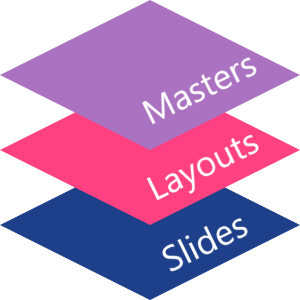

## **Áttekintés**

A **slide master** egy csoport diák közös tervezési beállításait határozza meg. Tartalmazhat közös alakzatokat, logókat, háttérképeket, szövegstílusokat, témabeállításokat és láblécbeállításokat. A PowerPointban a diamester szerkesztése a szokásos módja annak, hogy a bemutató egységes legyen anélkül, hogy minden dián ismételni kellene ugyanazt a formázást.

Az Aspose.Slides for Node.js via Java ugyanazt a modellt támogatja. Egy prezentáció egy vagy több mesterdiát tartalmazhat, és minden mesterdia több elrendezés-diát is tartalmazhat. A normál diák általában nem hivatkoznak közvetlenül egy mesterdiára. Ehelyett egy normál dia egy elrendezés-diat használ, és ez az elrendezés-dia egy mesterdia része.

A hierarchia a következő:

1. **Slide master** - meghatározza a közös tervezést és témát.
1. **Layout slide** - meghatároz egy adott elrendezést a helyőrzőkkel és elrendezési szintű formázással.
1. **Normal slide** - tartalmazza a tényleges prezentációs tartalmat és egy elrendezés-diat használ.



Az Aspose.Slidesban a diamester a [MasterSlide](https://reference.aspose.com/slides/hu/nodejs-java/aspose.slides/masterslide/) osztállyal van reprezentálva. A prezentáció összes mesterdiája a `Presentation.getMasters()` gyűjteményen keresztül érhető el.

{}
Ha ugyanaz a tulajdonság több szinten is definiálva van, a specifikusabb szint nyer. Például, ha egy mesterdia és egy elrendezés-dia is meghatároz egy háttérszínt, akkor az az elrendezésen alapuló diák az elrendezés háttérét használják. További információért az elrendezés-diákról lásd a [Apply or Change Slide Layouts](/nodejs-java/slide-layout/) oldalt.
{}

## **Mesterdiák elérése**

PowerPointban a Diamester nézetet a **Nézet** > **Diamester** menüből nyithatja meg.


Az Aspose.Slidesban a `getMasters()` gyűjteményt használja a mesterdiák eléréséhez:

```javascript
var aspose = aspose || {};
aspose.slides = require("aspose.slides.via.java");

let presentation = new aspose.slides.Presentation("presentation.pptx");
try {
    let firstMasterSlide = presentation.getMasters().get_Item(0);
    let masterSlideCount = presentation.getMasters().size();
    let firstMasterLayoutSlideCount = firstMasterSlide.getLayoutSlides().size();

    console.log("Master slides: " + masterSlideCount);
    console.log("Layouts in the first master: " + firstMasterLayoutSlideCount);
} finally {
    presentation.dispose();
}
```

A normál dia által használt mesterdiát a layoutja segítségével is lekérheti:

```javascript
var aspose = aspose || {};
aspose.slides = require("aspose.slides.via.java");

let presentation = new aspose.slides.Presentation("presentation.pptx");
try {
    let slide = presentation.getSlides().get_Item(0);
    let layoutSlide = slide.getLayoutSlide();
    let masterSlide = layoutSlide.getMasterSlide();
    let masterSlideName = masterSlide.getName();

    console.log(masterSlideName);
} finally {
    presentation.dispose();
}
```

## **Mit tartalmaz egy Diamester**

A mesterdia egy dia-szerű objektum. Örökli a közös diális viselkedést a [BaseSlide](https://reference.aspose.com/slides/hu/nodejs-java/aspose.slides/baseslide/) osztályból, ezért ugyanazokat a dia tulajdonságokat teszi elérhetővé, mint a normál és az elrendezés-diák. A mesterre specifikus tagok a [MasterSlide](https://reference.aspose.com/slides/hu/nodejs-java/aspose.slides/masterslide/) API oldalon találhatók.

A gyakran használt mesterdia tagok a következők:

| Tag | Cél |
| --- | --- |
| `getBackground()` | Beállítja a mester szintű dia hátterét. |
| `getShapes()` | Tárolja a mesterre helyezett alakzatokat, mint logók, képkockák és közös szöveg. |
| `getLayoutSlides()` | Tárolja a mesterhez tartozó elrendezés-diákat. |
| `getThemeManager()` | Hozzáférést biztosít a mester téma API-khoz. |
| `getHeaderFooterManager()` | Kezeli a fejléceket, lábléceket, dátumokat és dia számokat a mester és al- elrendezései számára. |
| `getDependingSlides()` | Visszaadja a normál diákat, amelyek a mesterre épülnek a layoutjaikon keresztül. |

## **Kép hozzáadása egy Diamesterhez**

Amikor képet ad hozzá egy mesterdiához, az megjelenik azokon a diákon, amelyek a mesterből származó elrendezéseket használják. Ez hasznos logók, vízjelek, díszszalagok és más ismétlődő vizuális elemek esetén.

A következő példa egy logót ad az első mesterdiához:

```javascript
var aspose = aspose || {};
aspose.slides = require("aspose.slides.via.java");

let presentation = new aspose.slides.Presentation("presentation.pptx");
try {
    let masterSlide = presentation.getMasters().get_Item(0);
    let logo = aspose.slides.Images.fromFile("logo.png");

    try {
        let logoImage = presentation.getImages().addImage(logo);

        masterSlide.getShapes().addPictureFrame(
            aspose.slides.ShapeType.Rectangle,
            20,
            20,
            80,
            80,
            logoImage);
    } finally {
        logo.dispose();
    }

    presentation.save("presentation-with-logo.pptx", aspose.slides.SaveFormat.Pptx);
} finally {
    presentation.dispose();
}
```

További információért a képkockákról lásd a [Picture Frame](/nodejs-java/picture-frame/) oldalt.

## **Helyőrzők kezelése**

A helyőrzőket általában az elrendezés-diákon definiálják. A mesterdia biztosítja a közös stílust és témát, amelyet az elrendezések örökölnek, míg minden elrendezés dönti el, mely helyőrzők elérhetők és hol helyezkednek el.

PowerPointban a helyőrző parancsok a Diamester nézetben érhetők el.


Új helyőrzők hozzáadásához az Aspose.Slidesban dolgozzon a mesterhez tartozó elrendezés-diával:

```javascript
var aspose = aspose || {};
aspose.slides = require("aspose.slides.via.java");
const java = require("java");

let presentation = new aspose.slides.Presentation("presentation.pptx");
try {
    let masterSlide = presentation.getMasters().get_Item(0);
    let blankLayoutType = java.newByte(aspose.slides.SlideLayoutType.Blank);
    let blankLayoutSlide = masterSlide.getLayoutSlides().getByType(blankLayoutType);

    if (blankLayoutSlide === null) {
        blankLayoutSlide = masterSlide.getLayoutSlides().add(blankLayoutType, "Blank");
    }

    blankLayoutSlide.getPlaceholderManager().addTextPlaceholder(60, 120, 600, 80);

    presentation.getSlides().addEmptySlide(blankLayoutSlide);
    presentation.save("presentation-with-placeholder.pptx", aspose.slides.SaveFormat.Pptx);
} finally {
    presentation.dispose();
}
```

A már meglévő helyőrző alakzatokat is formázhatja a mesterdián. A következő példa megtalálja a cím helyőrzőt és lineáris színátmenetes kitöltést alkalmaz rá:

```javascript
var aspose = aspose || {};
aspose.slides = require("aspose.slides.via.java");
const java = require("java");

let presentation = new aspose.slides.Presentation("presentation.pptx");
try {
    let masterSlide = presentation.getMasters().get_Item(0);
    let titlePlaceholder = null;
    let masterShapes = masterSlide.getShapes();
    let masterShapeCount = masterShapes.size();

    for (let masterShapeIndex = 0; masterShapeIndex < masterShapeCount; masterShapeIndex++) {
        let shape = masterShapes.get_Item(masterShapeIndex);

        if (java.instanceOf(shape, "com.aspose.slides.AutoShape")) {
            let placeholder = shape.getPlaceholder();

            if (placeholder !== null && placeholder.getType() === aspose.slides.PlaceholderType.Title) {
                titlePlaceholder = shape;
                break;
            }
        }
    }

    if (titlePlaceholder !== null) {
        let gradientFillType = java.newByte(aspose.slides.FillType.Gradient);
        let linearGradientShape = java.newByte(aspose.slides.GradientShape.Linear);
        let redGradientColor = java.newInstanceSync("java.awt.Color", 255, 0, 0);
        let purpleGradientColor = java.newInstanceSync("java.awt.Color", 128, 0, 128);

        titlePlaceholder.getFillFormat().setFillType(gradientFillType);
        titlePlaceholder.getFillFormat().getGradientFormat().setGradientShape(linearGradientShape);
        titlePlaceholder.getFillFormat().getGradientFormat().getGradientStops().add(0.0, redGradientColor);
        titlePlaceholder.getFillFormat().getGradientFormat().getGradientStops().add(1.0, purpleGradientColor);
    }

    presentation.save("presentation-title-style.pptx", aspose.slides.SaveFormat.Pptx);
} finally {
    presentation.dispose();
}
```


További helyőrző és szövegformázási lehetőségekért lásd a [Set Prompt Text in Placeholder](/nodejs-java/manage-placeholder/) és a [Text Formatting](/nodejs-java/text-formatting/) oldalakat.

## **Diamester háttér módosítása**

A mester háttér öröklődik az elrendezések és azok a diák számára, amelyek nem írják felül. A következő példa szilárd háttérszínt állít be az első mesterdiára:

```javascript
var aspose = aspose || {};
aspose.slides = require("aspose.slides.via.java");
const java = require("java");

let presentation = new aspose.slides.Presentation("presentation.pptx");
try {
    let masterSlide = presentation.getMasters().get_Item(0);
    let ownBackgroundType = java.newByte(aspose.slides.BackgroundType.OwnBackground);
    let solidFillType = java.newByte(aspose.slides.FillType.Solid);
    let masterBackgroundColor = java.getStaticFieldValue("java.awt.Color", "GREEN");

    masterSlide.getBackground().setType(ownBackgroundType);
    masterSlide.getBackground().getFillFormat().setFillType(solidFillType);
    masterSlide.getBackground().getFillFormat().getSolidFillColor().setColor(masterBackgroundColor);

    presentation.save("presentation-master-background.pptx", aspose.slides.SaveFormat.Pptx);
} finally {
    presentation.dispose();
}
```

Kapcsolódó témákért lásd a [Presentation Background](/nodejs-java/presentation-background/) és a [Presentation Theme](/nodejs-java/presentation-theme/) oldalakat.

## **Diamester klónozása egy másik prezentációba**

Használja a `MasterSlideCollection.addClone` metódust egy mesterdia egy másik prezentációba másolásához. A másolt mester aztán az elrendezések és diák által a célprezentációban felhasználható lesz.

```javascript
var aspose = aspose || {};
aspose.slides = require("aspose.slides.via.java");

let sourcePresentation = new aspose.slides.Presentation("source.pptx");
let destinationPresentation = new aspose.slides.Presentation("destination.pptx");
try {
    let sourceMasterSlide = sourcePresentation.getMasters().get_Item(0);
    let clonedMasterSlide = destinationPresentation.getMasters().addClone(sourceMasterSlide);

    destinationPresentation.save("destination-with-master.pptx", aspose.slides.SaveFormat.Pptx);
} finally {
    sourcePresentation.dispose();
    destinationPresentation.dispose();
}
```

Ha a normál diákot is a mesterrel együtt kell klónozni, lásd a [Clone Slides](/nodejs-java/clone-slides/) oldalt.

## **Több Diamester hozzáadása**

Egy prezentáció több mesterdiát is tartalmazhat. Ez hasznos, ha a különböző szakaszoknak eltérő vizuális rendszerek vagy márkázás szükséges.


A következő példa klónozza az alapértelmezett mestert, más háttérrel látja el a klónt, létrehoz egy elrendezést a klónozott mester alatt, és egy új diát ad hozzá az elrendezés alapján:

```javascript
var aspose = aspose || {};
aspose.slides = require("aspose.slides.via.java");
const java = require("java");

let presentation = new aspose.slides.Presentation("presentation.pptx");
try {
    let defaultMasterSlide = presentation.getMasters().get_Item(0);
    let sectionMasterSlide = presentation.getMasters().addClone(defaultMasterSlide);
    let ownBackgroundType = java.newByte(aspose.slides.BackgroundType.OwnBackground);
    let solidFillType = java.newByte(aspose.slides.FillType.Solid);
    let sectionMasterBackgroundColor = java.getStaticFieldValue("java.awt.Color", "LIGHT_GRAY");

    sectionMasterSlide.getBackground().setType(ownBackgroundType);
    sectionMasterSlide.getBackground().getFillFormat().setFillType(solidFillType);
    sectionMasterSlide.getBackground().getFillFormat().getSolidFillColor().setColor(sectionMasterBackgroundColor);

    let blankLayoutType = java.newByte(aspose.slides.SlideLayoutType.Blank);
    let sourceBlankLayout = defaultMasterSlide.getLayoutSlides().getByType(blankLayoutType);
    if (sourceBlankLayout === null) {
        sourceBlankLayout = defaultMasterSlide.getLayoutSlides().get_Item(0);
    }

    let sectionBlankLayout = sectionMasterSlide.getLayoutSlides().addClone(sourceBlankLayout);

    presentation.getSlides().addEmptySlide(sectionBlankLayout);
    presentation.save("presentation-with-multiple-masters.pptx", aspose.slides.SaveFormat.Pptx);
} finally {
    presentation.dispose();
}
```

## **Diamesterek összehasonlítása**

A mesterdiák összehasonlíthatók a [BaseSlide](https://reference.aspose.com/slides/hu/nodejs-java/aspose.slides/baseslide/) örökölt `equals` metódusával. Az összehasonlítás ellenőrzi a szerkezetet és a statikus tartalmat, mint például az alakzatok, szöveg, formázás, animációk és egyéb dia beállítások. Nem hasonlítja össze az egyedi azonosítókat, például a dia ID-ket, vagy a dinamikus helyőrző értékeket, mint a jelenlegi dátum.

```javascript
var aspose = aspose || {};
aspose.slides = require("aspose.slides.via.java");

let firstPresentation = new aspose.slides.Presentation("first.pptx");
let secondPresentation = new aspose.slides.Presentation("second.pptx");
try {
    let firstPresentationMasterCount = firstPresentation.getMasters().size();
    let secondPresentationMasterCount = secondPresentation.getMasters().size();

    for (let firstMasterIndex = 0; firstMasterIndex < firstPresentationMasterCount; firstMasterIndex++) {
        for (let secondMasterIndex = 0; secondMasterIndex < secondPresentationMasterCount; secondMasterIndex++) {
            let firstMasterSlide = firstPresentation.getMasters().get_Item(firstMasterIndex);
            let secondMasterSlide = secondPresentation.getMasters().get_Item(secondMasterIndex);
            let areMasterSlidesEqual = firstMasterSlide.equals(secondMasterSlide);

            if (areMasterSlidesEqual) {
                console.log(
                    "first.pptx master #" + firstMasterIndex +
                    " equals second.pptx master #" + secondMasterIndex);
            }
        }
    }
} finally {
    firstPresentation.dispose();
    secondPresentation.dispose();
}
```

További információért lásd a [Compare Presentation Slides](/slides/hu/nodejs-java/compare-slides/) oldalt.

## **Diamester nézet beállítása alapértelmezett nézetként**

Használja a `setLastView` metódust a [ViewProperties](https://reference.aspose.com/slides/hu/nodejs-java/aspose.slides/viewproperties/) osztályon a PowerPoint által elsőként megnyitott nézet szabályozásához. A következő példa a prezentációt Diamester nézetben nyitja meg:

```javascript
var aspose = aspose || {};
aspose.slides = require("aspose.slides.via.java");
const java = require("java");

let presentation = new aspose.slides.Presentation("presentation.pptx");
try {
    let slideMasterViewType = java.newByte(aspose.slides.ViewType.SlideMasterView);

    presentation.getViewProperties().setLastView(slideMasterViewType);
    presentation.save("presentation-master-view.pptx", aspose.slides.SaveFormat.Pptx);
} finally {
    presentation.dispose();
}
```

További nézet beállításokért lásd a [Save Presentation](/slides/hu/nodejs-java/save-presentation/) oldalt.

## **Használaton kívüli Diamesterek eltávolítása**

A prezentációk néha olyan mesterdiákat tartalmaznak, amelyeket már egyetlen normál dia sem használ. A használaton kívüli mesterek eltávolítása csökkentheti a fájlméretet és egyszerűsítheti a sablonkarbantartást.

Használja a `removeUnused` metódust a `getMasters()` gyűjteményből a használaton kívüli mesterek eltávolításához:

```javascript
var aspose = aspose || {};
aspose.slides = require("aspose.slides.via.java");

let presentation = new aspose.slides.Presentation("presentation.pptx");
try {
    presentation.getMasters().removeUnused(true);
    presentation.save("presentation-clean.pptx", aspose.slides.SaveFormat.Pptx);
} finally {
    presentation.dispose();
}
```

Alacsony kódú `Compress.removeUnusedMasterSlides` metódust is használhat:

```javascript
var aspose = aspose || {};
aspose.slides = require("aspose.slides.via.java");

let presentation = new aspose.slides.Presentation("presentation.pptx");
try {
    aspose.slides.Compress.removeUnusedMasterSlides(presentation);
    presentation.save("presentation-clean.pptx", aspose.slides.SaveFormat.Pptx);
} finally {
    presentation.dispose();
}
```

## **FAQ**

### Mi a különbség a diamester és az elrendezés-dia között?

A diamester meghatározza a közös tervezési beállításokat, például a témát, háttérszínt, közös alakzatokat és szövegstílusokat. Az elrendezés-dia egy mesterdiához tartozik, és egy adott helyőrző elrendezést definiál. Egy normál dia egy elrendezés-diát használ, így mind az elrendezést, mind a mestert örökli.

### Tartalmazhat egy prezentáció több diamestert?

Igen. Egy prezentáció több diamestert is tartalmazhat. Használjon több mestert, ha a különböző szakaszoknak eltérő vizuális rendszerek vagy márkázás szükséges.

### Helyőrzőket a mesterdiára vagy az elrendezés-diára kellene feltennem?

A legtöbb esetben helyőrzőket az elrendezés-diákra helyezze. A közös vizuális elemeket és formázásokat a mesterdiára tegye, a tartalmi helyőrzőket pedig azokra az elrendezésekre, amelyeket a normál diák használnak.

### Törölhetek egy még használt mesterdiát?

Nem. Egy olyan mesterdia, amelynek függő diái vannak, nem távolítható el biztonságosan közvetlenül. Előbb helyezze át ezeket a diákot másik mester alá tartozó elrendezésekbe, vagy használjon olyan tisztítási módszert, amely csak a nem használt mestereket távolítja el.