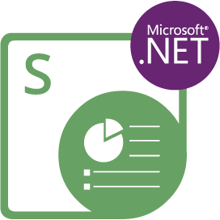

{}

**Üdvözöljük az Aspose.Slides for Node.js via .NET-ben**

Aspose.Slides for Node.js via .NET egy osztálykönyvtár, amely lehetővé teszi alkalmazásai számára, hogy Microsoft PowerPoint® használata nélkül olvassanak és írjanak PowerPoint® dokumentumokat.

Aspose.Slides for Node.js via .NET az első és egyetlen összetevő, amely a PowerPoint® dokumentumok kezeléséhez szükséges funkciókat biztosítja.

Aspose.Slides for Node.js via .NET sok kulcsfontosságú funkciót kínál, például a szöveg, alakzatok, táblázatok és animációk kezelése, hang és videó hozzáadása a diákhoz, diák előnézete, diák exportálása SVG, PDF formátumba és még sok más.

{}

## Aspose.Slides for Node.js via .NET erőforrások

{}

Aspose.Slides for Node.js via .NET az Aspose.Slides for .NET-ből lett átkonvertálva, így használhatja a későbbi dokumentációt és API referencia anyagokat.

{}

Ezek hasznos erőforrásokra mutató hivatkozások:

- [Aspose.Slides for Node.js via .NET online dokumentáció](/slides/hu/net/developer-guide/)
- [Aspose.Slides for Node.js via .NET funkciók](/slides/hu/nodejs-net/features-overview/)
- [Aspose.Slides for Node.js via .NET korlátozások és API különbségek](/slides/hu/nodejs-net/limitations-and-api-differences/)
- [Aspose.Slides for Node.js via .NET kiadási megjegyzések](https://releases.aspose.com/slides/hu/nodejs-net/release-notes/)
- [Aspose.Slides for Node.js via .NET termékoldal](https://products.aspose.com/slides/hu/nodejs-net/)
- [Aspose.Slides for Node.js via .NET csomag letöltése](https://releases.aspose.com/slides/hu/nodejs-net/)
- [Aspose.Slides for Node.js via .NET telepítése](/slides/hu/nodejs-net/installation/)
- [Aspose.Slides for Node.js via .NET API referencia](https://reference.aspose.com/slides/hu/nodejs-net/)
- [Aspose.Slides for Node.js via .NET ingyenes támogatási fórum](https://forum.aspose.com/c/slides/hu/11)
- [Aspose.Slides for Node.js via .NET fizetett támogatási helpdesk](https://helpdesk.aspose.com/)