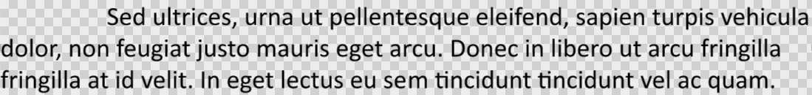

## **Bevezetés**

Az Aspose.Slides minden osztályt biztosít, amelyre a PowerPoint szövegek, bekezdések és részek kezeléséhez szüksége van.

* Az Aspose.Slides biztosítja a [TextFrame](https://reference.aspose.com/slides/hu/php-java/aspose.slides/textframe/) osztályt, amely lehetővé teszi, hogy olyan objektumokat adjunk hozzá, amelyek egy bekezdést képviselnek. Egy `TextFame` objektum egy vagy több bekezdést (minden bekezdés egy sortörésen keresztül jön létre) tartalmazhat.
* Az Aspose.Slides biztosítja a [Paragraph](https://reference.aspose.com/slides/hu/php-java/aspose.slides/paragraph/) osztályt, amely lehetővé teszi, hogy olyan objektumokat adjunk hozzá, amelyek részeket (portion) képviselnek. Egy `Paragraph` objektum egy vagy több részt (a részek objektumainak gyűjteménye) tartalmazhat.
* Az Aspose.Slides biztosítja a [Portion](https://reference.aspose.com/slides/hu/php-java/aspose.slides/portion/) osztályt, amely lehetővé teszi, hogy olyan objektumokat adjunk hozzá, amelyek szövegeket és azok formázási tulajdonságait képviselik.

Egy `Paragraph` objektum képes a szövegeket különböző formázási tulajdonságokkal kezelni az alatta lévő `Portion` objektumok segítségével.

## **Több bekezdés hozzáadása, amelyek több részt tartalmaznak**

Az alábbi lépések megmutatják, hogyan adjunk hozzá egy szövegkeretet, amely 3 bekezdést tartalmaz, és minden bekezdés 3 részt tartalmaz:

1. Hozzon létre egy példányt a [Presentation](https://reference.aspose.com/slides/hu/php-java/aspose.slides/presentation/) osztályból.
2. Érje el a megfelelő dia hivatkozását az indexe alapján.
3. Adjon egy Rectangle [AutoShape](https://reference.aspose.com/slides/hu/php-java/aspose.slides/autoshape/) elemet a diához.
4. Szerezze meg az [AutoShape](https://reference.aspose.com/slides/hu/php-java/aspose.slides/autoshape/)-hoz kapcsolódó ITextFrame-et.
5. Hozzon létre két [Paragraph](https://reference.aspose.com/slides/hu/php-java/aspose.slides/paragraph/) objektumot, és adja hozzá őket a [TextFrame](https://reference.aspose.com/slides/hu/php-java/aspose.slides/textframe/) bekezdéggyűjteményéhez.
6. Hozzon létre három [Portion](https://reference.aspose.com/slides/hu/php-java/aspose.slides/portion/) objektumot minden új `Paragraph` számára (alapértelmezett bekezdéshez két Portion objektumot), és adja hozzá az egyes `Portion` objektumokat a megfelelő `Paragraph` részegység gyűjteményéhez.
7. Állítson be szöveget minden részhez.
8. Alkalmazza a kívánt formázási jellemzőket minden részre a `Portion` objektum által nyújtott formázási tulajdonságokkal.
9. Mentse a módosított prezentációt.

Ez a PHP kód a lépések megvalósítása a részeket tartalmazó bekezdések hozzáadásához:

```php
# Létrehozza a Presentation osztály egy példányát, amely egy PPTX fájlt képvisel
$pres = new Presentation();
try {
    # Az első diát elérve
    $slide = $pres->getSlides()->get_Item(0);
    # Rectangle típusú AutoShape hozzáadása
    $ashp = $slide->getShapes()->addAutoShape(ShapeType::Rectangle, 50, 150, 300, 150);
    # Az AutoShape TextFrame-jének elérése
    $tf = $ashp->getTextFrame();
    # Bekezdések és Részek létrehozása különböző szövegformátumokkal
    $para0 = $tf->getParagraphs()->get_Item(0);
    $port01 = new Portion();
    $port02 = new Portion();
    $para0->getPortions()->add($port01);
    $para0->getPortions()->add($port02);
    $para1 = new Paragraph();
    $tf->getParagraphs()->add($para1);
    $port10 = new Portion();
    $port11 = new Portion();
    $port12 = new Portion();
    $para1->getPortions()->add($port10);
    $para1->getPortions()->add($port11);
    $para1->getPortions()->add($port12);
    $para2 = new Paragraph();
    $tf->getParagraphs()->add($para2);
    $port20 = new Portion();
    $port21 = new Portion();
    $port22 = new Portion();
    $para2->getPortions()->add($port20);
    $para2->getPortions()->add($port21);
    $para2->getPortions()->add($port22);
    for($i = 0; $i < 3; $i++) {
        for($j = 0; $j < 3; $j++) {
            $portion = $tf->getParagraphs()->get_Item($i)->getPortions()->get_Item($j);
            $portion->setText("Portion0" . $j);
            if ($j == 0) {
                $portion->getPortionFormat()->getFillFormat()->setFillType(FillType::Solid);
                $portion->getPortionFormat()->getFillFormat()->getSolidFillColor()->setColor(java("java.awt.Color")->RED);
                $portion->getPortionFormat()->setFontBold(NullableBool::True);
                $portion->getPortionFormat()->setFontHeight(15);
            } else if ($j == 1) {
                $portion->getPortionFormat()->getFillFormat()->setFillType(FillType::Solid);
                $portion->getPortionFormat()->getFillFormat()->getSolidFillColor()->setColor(java("java.awt.Color")->BLUE);
                $portion->getPortionFormat()->setFontItalic(NullableBool::True);
                $portion->getPortionFormat()->setFontHeight(18);
            }
        }
    }
    # PPTX mentése lemezre
    $pres->save("multiParaPort_out.pptx", SaveFormat::Pptx);
} finally {
    if (!java_is_null($pres)) {
        $pres->dispose();
    }
}
```

## **Bekezdések felsorolásainak kezelése**

A felsorolások segítenek az információ gyors és hatékony szervezésében és bemutatásában. A felsorolásos bekezdések mindig könnyebben olvashatók és érthetők.

1. Hozzon létre egy példányt a [Presentation](https://reference.aspose.com/slides/hu/php-java/aspose.slides/presentation/) osztályból.
2. Érje el a megfelelő dia hivatkozását az indexe alapján.
3. Adjon egy [AutoShape](https://reference.aspose.com/slides/hu/php-java/aspose.slides/autoshape/) elemet a kiválasztott diára.
4. Érje el az autoshape [TextFrame](https://reference.aspose.com/slides/hu/php-java/aspose.slides/textframe/)-jét.
5. Távolítsa el az alapértelmezett bekezdést a `TextFrame`-ből.
6. Hozza létre az első bekezdés példányát a [Paragraph](https://reference.aspose.com/slides/hu/php-java/aspose.slides/paragraph/) osztállyal.
7. Állítsa be a bekezdés bullet `Type` értékét `Symbol`-ra, és adja meg a bullet karaktert.
8. Állítsa be a bekezdés `Text` értékét.
9. Állítsa be a bekezdés `Indent` értékét a bullet számára.
10. Állítson be színt a bullet-nek.
11. Állítson be magasságot a bullet-nek.
12. Adja hozzá az új bekezdést a `TextFrame` bekezdéggyűjteményéhez.
13. Adja hozzá a második bekezdést, és ismételje meg a 7‑tól 13‑ig terjedő lépéseket.
14. Mentse a prezentációt.

Ez a PHP kód megmutatja, hogyan adjon hozzá egy bekezdés bullet‑t:

```php
# Létrehozza a Presentation osztály egy példányát, amely egy PPTX fájlt képvisel
$pres = new Presentation();
try {
    # Eléri az első diát
    $slide = $pres->getSlides()->get_Item(0);
    # Hozzáad egy Autoshape-et és eléri azt
    $aShp = $slide->getShapes()->addAutoShape(ShapeType::Rectangle, 200, 200, 400, 200);
    # Eléri az autoshape szövegkeretét
    $txtFrm = $aShp->getTextFrame();
    # Eltávolítja az alapértelmezett bekezdést
    $txtFrm->getParagraphs()->removeAt(0);
    # Létrehoz egy bekezdést
    $para = new Paragraph();
    # Beállítja a bekezdés bullet stílusát és szimbólumát
    $para->getParagraphFormat()->getBullet()->setType(BulletType::Symbol);
    $para->getParagraphFormat()->getBullet()->setChar(8226);
    # Beállítja a bekezdés szövegét
    $para->setText("Welcome to Aspose.Slides");
    # Beállítja a bullet behúzást
    $para->getParagraphFormat()->setIndent(25);
    # Beállítja a bullet színét
    $para->getParagraphFormat()->getBullet()->getColor()->setColorType(ColorType::RGB);
    $para->getParagraphFormat()->getBullet()->getColor()->setColor(java("java.awt.Color")->BLACK);
    $para->getParagraphFormat()->getBullet()->setBulletHardColor(NullableBool::True);// beállítja az IsBulletHardColor értékét true-ra a saját bullet szín használatához

    # Beállítja a bullet magasságát
    $para->getParagraphFormat()->getBullet()->setHeight(100);
    # Hozzáadja a bekezdést a szövegkerethez
    $txtFrm->getParagraphs()->add($para);
    # Létrehoz egy második bekezdést
    $para2 = new Paragraph();
    # Beállítja a bekezdés bullet típusát és stílusát
    $para2->getParagraphFormat()->getBullet()->setType(BulletType::Numbered);
    $para2->getParagraphFormat()->getBullet()->setNumberedBulletStyle(NumberedBulletStyle->BulletCircleNumWDBlackPlain);
    # Hozzáadja a bekezdés szövegét
    $para2->setText("This is numbered bullet");
    # Beállítja a bullet behúzást
    $para2->getParagraphFormat()->setIndent(25);
    $para2->getParagraphFormat()->getBullet()->getColor()->setColorType(ColorType::RGB);
    $para2->getParagraphFormat()->getBullet()->getColor()->setColor(java("java.awt.Color")->BLACK);
    $para2->getParagraphFormat()->getBullet()->setBulletHardColor(NullableBool::True);// beállítja az IsBulletHardColor értékét true-ra a saját bullet szín használatához

    # Beállítja a bullet magasságát
    $para2->getParagraphFormat()->getBullet()->setHeight(100);
    # Hozzáadja a bekezdést a szövegkerethez
    $txtFrm->getParagraphs()->add($para2);
    # Elmenti a módosított prezentációt
    $pres->save("Bullet_out.pptx", SaveFormat::Pptx);
} finally {
    if (!java_is_null($pres)) {
        $pres->dispose();
    }
}
```

## **Képes felsorolások kezelése**

A felsorolások segítenek az információ gyors és hatékony szervezésében és bemutatásában. A képes bekezdések könnyen olvashatók és érthetők.

1. Hozzon létre egy példányt a [Presentation](https://reference.aspose.com/slides/hu/php-java/aspose.slides/presentation/) osztályból.
2. Érje el a megfelelő dia hivatkozását az indexe alapján.
3. Adjon egy [AutoShape](https://reference.aspose.com/slides/hu/php-java/aspose.slides/autoshape/) elemet a diára.
4. Érje el az autoshape [TextFrame](https://reference.aspose.com/slides/hu/php-java/aspose.slides/textframe/)-jét.
5. Távolítsa el az alapértelmezett bekezdést a `TextFrame`-ből.
6. Hozza létre az első bekezdés példányát a [Paragraph](https://reference.aspose.com/slides/hu/php-java/aspose.slides/paragraph/) osztállyal.
7. Töltse be a képet a [PPImage](https://reference.aspose.com/slides/hu/php-java/aspose.slides/ppimage/)-be.
8. Állítsa be a bullet típusát a [Picture](https://reference.aspose.com/slides/hu/php-java/aspose.slides/bullettype/#Picture) típusra, és adja meg a képet.
9. Állítsa be a Paragraph `Text` értékét.
10. Állítsa be a Paragraph `Indent` értékét a bullet számára.
11. Állítson be színt a bullet-nek.
12. Állítson be magasságot a bullet-nek.
13. Adja hozzá az új bekezdést a `TextFrame` bekezdéggyűjteményéhez.
14. Adja hozzá a második bekezdést, és ismételje meg a korábbi lépéseket.
15. Mentse a módosított prezentációt.

Ez a PHP kód megmutatja, hogyan adjon hozzá és kezeljen képes bullet‑okat:

```php
# Létrehozza a Presentation osztály egy példányát, amely egy PPTX fájlt képvisel
$presentation = new Presentation();
try {
    # Eléri az első diát
    $slide = $presentation->getSlides()->get_Item(0);
    # Létrehozza a bulletok képét
    $picture;
    $image = Images->fromFile("bullets.png");
    try {
        $picture = $presentation->getImages()->addImage($image);
    } finally {
        if (!java_is_null($image)) {
            $image->dispose();
        }
    }
    # Hozzáad és eléri az Autoshape-et
    $autoShape = $slide->getShapes()->addAutoShape(ShapeType::Rectangle, 200, 200, 400, 200);
    # Eléri az autoshape szövegkeretét
    $textFrame = $autoShape->getTextFrame();
    # Eltávolítja az alapértelmezett bekezdést
    $textFrame->getParagraphs()->removeAt(0);
    # Létrehoz egy új bekezdést
    $paragraph = new Paragraph();
    $paragraph->setText("Welcome to Aspose.Slides");
    # Beállítja a bekezdés bullet stílusát és képét
    $paragraph->getParagraphFormat()->getBullet()->setType(BulletType::Picture);
    $paragraph->getParagraphFormat()->getBullet()->getPicture()->setImage($picture);
    # Beállítja a bullet magasságát
    $paragraph->getParagraphFormat()->getBullet()->setHeight(100);
    # Hozzáadja a bekezdést a szövegkerethez
    $textFrame->getParagraphs()->add($paragraph);
    # Mentse a prezentációt PPTX fájlként
    $presentation->save("ParagraphPictureBulletsPPTX_out.pptx", SaveFormat::Pptx);
    # Mentse a prezentációt PPT fájlként
    $presentation->save("ParagraphPictureBulletsPPT_out.ppt", SaveFormat::Ppt);
} catch (JavaException $e) {
} finally {
    if (!java_is_null($presentation)) {
        $presentation->dispose();
    }
}
```

## **Többszintű felsorolások kezelése**

A felsorolások segítenek az információ gyors és hatékony szervezésében és bemutatásában. A többszintű bullet‑ok könnyen olvashatók és érthetők.

1. Hozzon létre egy példányt a [Presentation](https://reference.aspose.com/slides/hu/php-java/aspose.slides/presentation/) osztályból.
2. Érje el a megfelelő dia hivatkozását az indexe alapján.
3. Adjon egy [AutoShape](https://reference.aspose.com/slides/hu/php-java/aspose.slides/autoshape/) elemet az új diára.
4. Érje el az autoshape [TextFrame](https://reference.aspose.com/slides/hu/php-java/aspose.slides/textframe/)-jét.
5. Távolítsa el az alapértelmezett bekezdést a `TextFrame`-ből.
6. Hozza létre az első bekezdés példányát a [Paragraph](https://reference.aspose.com/slides/hu/php-java/aspose.slides/paragraph/) osztállyal, és állítsa be a mélységet 0‑ra.
7. Hozza létre a második bekezdés példányát a `Paragraph` osztállyal, és állítsa be a mélységet 1‑re.
8. Hozza létre a harmadik bekezdés példányát a `Paragraph` osztállyal, és állítsa be a mélységet 2‑re.
9. Hozza létre a negyedik bekezdés példányát a `Paragraph` osztállyal, és állítsa be a mélységet 3‑ra.
10. Adja hozzá az új bekezdéseket a `TextFrame` bekezdéggyűjteményéhez.
11. Mentse a módosított prezentációt.

Ez a PHP kód megmutatja, hogyan adjon hozzá és kezeljen többszintű bullet‑okat:

```php
# Létrehozza a Presentation osztály egy példányát, amely egy PPTX fájlt képvisel
$pres = new Presentation();
try {
    # Eléri az első diát
    $slide = $pres->getSlides()->get_Item(0);
    # Hozzáad és eléri az Autoshape-et
    $aShp = $slide->getShapes()->addAutoShape(ShapeType::Rectangle, 200, 200, 400, 200);
    # Eléri a létrehozott autoshape szövegkeretét
    $text = $aShp->addTextFrame("");
    # Törli az alapértelmezett bekezdést
    $text->getParagraphs()->clear();
    # Hozzáadja az első bekezdést
    $para1 = new Paragraph();
    $para1->setText("Content");
    $para1->getParagraphFormat()->getBullet()->setType(BulletType::Symbol);
    $para1->getParagraphFormat()->getBullet()->setChar(8226);
    $para1->getParagraphFormat()->getDefaultPortionFormat()->getFillFormat()->setFillType(FillType::Solid);
    $para1->getParagraphFormat()->getDefaultPortionFormat()->getFillFormat()->getSolidFillColor()->setColor(java("java.awt.Color")->BLACK);
    # Beállítja a bullet szintjét
    $para1->getParagraphFormat()->setDepth(0);
    # Hozzáadja a második bekezdést
    $para2 = new Paragraph();
    $para2->setText("Second Level");
    $para2->getParagraphFormat()->getBullet()->setType(BulletType::Symbol);
    $para2->getParagraphFormat()->getBullet()->setChar('-');
    $para2->getParagraphFormat()->getDefaultPortionFormat()->getFillFormat()->setFillType(FillType::Solid);
    $para2->getParagraphFormat()->getDefaultPortionFormat()->getFillFormat()->getSolidFillColor()->setColor(java("java.awt.Color")->BLACK);
    # Beállítja a bullet szintjét
    $para2->getParagraphFormat()->setDepth(1);
    # Hozzáadja a harmadik bekezdést
    $para3 = new Paragraph();
    $para3->setText("Third Level");
    $para3->getParagraphFormat()->getBullet()->setType(BulletType::Symbol);
    $para3->getParagraphFormat()->getBullet()->setChar(8226);
    $para3->getParagraphFormat()->getDefaultPortionFormat()->getFillFormat()->setFillType(FillType::Solid);
    $para3->getParagraphFormat()->getDefaultPortionFormat()->getFillFormat()->getSolidFillColor()->setColor(java("java.awt.Color")->BLACK);
    # Beállítja a bullet szintjét
    $para3->getParagraphFormat()->setDepth(2);
    # Hozzáadja a negyedik bekezdést
    $para4 = new Paragraph();
    $para4->setText("Fourth Level");
    $para4->getParagraphFormat()->getBullet()->setType(BulletType::Symbol);
    $para4->getParagraphFormat()->getBullet()->setChar('-');
    $para4->getParagraphFormat()->getDefaultPortionFormat()->getFillFormat()->setFillType(FillType::Solid);
    $para4->getParagraphFormat()->getDefaultPortionFormat()->getFillFormat()->getSolidFillColor()->setColor(java("java.awt.Color")->BLACK);
    # Beállítja a bullet szintjét
    $para4->getParagraphFormat()->setDepth(3);
    # Hozzáadja a bekezdéseket a gyűjteményhez
    $text->getParagraphs()->add($para1);
    $text->getParagraphs()->add($para2);
    $text->getParagraphs()->add($para3);
    $text->getParagraphs()->add($para4);
    # Elmenti a prezentációt PPTX fájlként
    $pres->save("MultilevelBullet.pptx", SaveFormat::Pptx);
} finally {
    if (!java_is_null($pres)) {
        $pres->dispose();
    }
}
```

## **Egyéni számozott lista kezelésével ellátott bekezdés**

A [BulletFormat](https://reference.aspose.com/slides/hu/php-java/aspose.slides/bulletformat/) osztály biztosítja a [setNumberedBulletStartWith](https://reference.aspose.com/slides/hu/php-java/aspose.slides/bulletformat/setnumberedbulletstartwith/) metódust és másokat, amelyek lehetővé teszik a bekezdések egyedi számozásának vagy formázásának kezelését.

1. Hozzon létre egy példányt a [Presentation](https://reference.aspose.com/slides/hu/php-java/aspose.slides/presentation/) osztályból.
2. Érje el a bekezdést tartalmazó diát.
3. Adjon egy [AutoShape](https://reference.aspose.com/slides/hu/php-java/aspose.slides/autoshape/) elemet a diára.
4. Érje el az autoshape [TextFrame](https://reference.aspose.com/slides/hu/php-java/aspose.slides/textframe/)-jét.
5. Távolítsa el az alapértelmezett bekezdést a `TextFrame`-ből.
6. Hozza létre az első bekezdés példányát a [Paragraph](https://reference.aspose.com/slides/hu/php-java/aspose.slides/paragraph/) osztállyal, és állítsa be a [NumberedBulletStartWith](https://reference.aspose.com/slides/hu/php-java/aspose.slides/bulletformat/setnumberedbulletstartwith/) értékét 2‑re.
7. Hozza létre a második bekezdés példányát a `Paragraph` osztállyal, és állítsa be a `NumberedBulletStartWith` értékét 3‑ra.
8. Hozza létre a harmadik bekezdés példányát a `Paragraph` osztállyal, és állítsa be a `NumberedBulletStartWith` értékét 7‑re.
9. Adja hozzá az új bekezdéseket a `TextFrame` bekezdéggyűjteményéhez.
10. Mentse a módosított prezentációt.

Ez a PHP kód megmutatja, hogyan adjon hozzá és kezeljen egyedi számozású vagy formázott bekezdéseket:

```php
$presentation = new Presentation();
try {
    $shape = $presentation->getSlides()->get_Item(0)->getShapes()->addAutoShape(ShapeType::Rectangle, 200, 200, 400, 200);
    # Eléri a létrehozott autoshape szövegkeretét
    $textFrame = $shape->getTextFrame();
    # Eltávolítja az alapértelmezett létező bekezdést
    $textFrame->getParagraphs()->removeAt(0);
    # Első lista
    $paragraph1 = new Paragraph();
    $paragraph1->setText("bullet 2");
    $paragraph1->getParagraphFormat()->setDepth(4);
    $paragraph1->getParagraphFormat()->getBullet()->setNumberedBulletStartWith(2);
    $paragraph1->getParagraphFormat()->getBullet()->setType(BulletType::Numbered);
    $textFrame->getParagraphs()->add($paragraph1);
    $paragraph2 = new Paragraph();
    $paragraph2->setText("bullet 3");
    $paragraph2->getParagraphFormat()->setDepth(4);
    $paragraph2->getParagraphFormat()->getBullet()->setNumberedBulletStartWith(3);
    $paragraph2->getParagraphFormat()->getBullet()->setType(BulletType::Numbered);
    $textFrame->getParagraphs()->add($paragraph2);
    $paragraph5 = new Paragraph();
    $paragraph5->setText("bullet 7");
    $paragraph5->getParagraphFormat()->setDepth(4);
    $paragraph5->getParagraphFormat()->getBullet()->setNumberedBulletStartWith(7);
    $paragraph5->getParagraphFormat()->getBullet()->setType(BulletType::Numbered);
    $textFrame->getParagraphs()->add($paragraph5);
    $presentation->save("SetCustomBulletsNumber-slides.pptx", SaveFormat::Pptx);
} finally {
    if (!java_is_null($presentation)) {
        $presentation->dispose();
    }
}
```

## **Első sor behúzásának beállítása bekezdéshez**

Az [ParagraphFormat::setIndent](https://reference.aspose.com/slides/hu/php-java/aspose.slides/paragraphformat/setindent/) metódus segítségével szabályozhatja a bekezdés első sorának behúzását. Ez a metódus csak az első sort mozgatja el a bekezdés bal margójához viszonyítva. A pozitív érték jobbra tolja az első sort, míg a többi sor a bekezdés törzséhez igazodik.

Használja a [ParagraphFormat::setMarginLeft](https://reference.aspose.com/slides/hu/php-java/aspose.slides/paragraphformat/setmarginleft/) metódust, ha a teljes bekezdést szeretné elmozdítani. Használja a [ParagraphFormat::setIndent](https://reference.aspose.com/slides/hu/php-java/aspose.slides/paragraphformat/setindent/) metódust, ha csak az első sort akarja elmozdítani.

Az alábbi példa több bekezdést hoz létre, és különböző behúzási értékeket alkalmaz, hogy bemutassa, hogyan befolyásolja az első sor behúzása a bekezdés elrendezését.

1. Hozzon létre egy példányt a [Presentation](https://reference.aspose.com/slides/hu/php-java/aspose.slides/presentation/) osztályból.
2. Érje el a céldiat.
3. Adjon egy téglalap [AutoShape](https://reference.aspose.com/slides/hu/php-java/aspose.slides/autoshape/) elemet a diára.
4. Adjon egy üres [TextFrame](https://reference.aspose.com/slides/hu/php-java/aspose.slides/textframe/) elemet a shape-hez, és távolítsa el az alapértelmezett bekezdést.
5. Hozzon létre több bekezdést, és állítson be különböző [Indent](https://reference.aspose.com/slides/hu/php-java/aspose.slides/paragraphformat/setindent/) értékeket számukra.
6. Adja hozzá a bekezdéseket a szövegkerethez.
7. Mentse a módosított prezentációt.

Ez a kód megmutatja, hogyan állíthat be bekezdésbehúzást:

```php
$presentation = new Presentation();
try {
    $slide = $presentation->getSlides()->get_Item(0);

    $rectangleShape = $slide->getShapes()->addAutoShape(ShapeType::Rectangle,50,50,420,220);
    $rectangleShape->getFillFormat()->setFillType(FillType::NoFill);
    $rectangleShape->getLineFormat()->getFillFormat()->setFillType(FillType::Solid);
    $rectangleShape->getLineFormat()->getFillFormat()->getSolidFillColor()->setColor(java("java.awt.Color")->GRAY);

    $textFrame = $rectangleShape->addTextFrame("");
    $textFrame->getTextFrameFormat()->setAutofitType(TextAutofitType::Shape);
    $textFrame->getParagraphs()->removeAt(0);

    $firstParagraph = new Paragraph();
    $firstParagraph->getParagraphFormat()->getDefaultPortionFormat()->getFillFormat()->setFillType(FillType::Solid);
    $firstParagraph->getParagraphFormat()->getDefaultPortionFormat()->getFillFormat()->getSolidFillColor()->setColor(java("java.awt.Color")->BLACK);
    $firstParagraph->setText("No first-line indent. Wrapped lines start at the same position as the first line.");
    $firstParagraph->getParagraphFormat()->setMarginLeft(20.0);
    $firstParagraph->getParagraphFormat()->setIndent(0.0);

    $secondParagraph = new Paragraph();
    $secondParagraph->getParagraphFormat()->getDefaultPortionFormat()->getFillFormat()->setFillType(FillType::Solid);
    $secondParagraph->getParagraphFormat()->getDefaultPortionFormat()->getFillFormat()->getSolidFillColor()->setColor(java("java.awt.Color")->BLACK);
    $secondParagraph->setText("First-line indent of 20 points. The first line moves to the right, while wrapped lines remain aligned to the paragraph body.");
    $secondParagraph->getParagraphFormat()->setMarginLeft(20.0);
    $secondParagraph->getParagraphFormat()->setIndent(20.0);

    $thirdParagraph = new Paragraph();
    $thirdParagraph->getParagraphFormat()->getDefaultPortionFormat()->getFillFormat()->setFillType(FillType::Solid);
    $thirdParagraph->getParagraphFormat()->getDefaultPortionFormat()->getFillFormat()->getSolidFillColor()->setColor(java("java.awt.Color")->BLACK);
    $thirdParagraph->setText("First-line indent of 40 points. This paragraph shows a larger first-line offset to make the effect easier to see.");
    $thirdParagraph->getParagraphFormat()->setMarginLeft(20.0);
    $thirdParagraph->getParagraphFormat()->setIndent(40.0);

    $textFrame->getParagraphs()->add($firstParagraph);
    $textFrame->getParagraphs()->add($secondParagraph);
    $textFrame->getParagraphs()->add($thirdParagraph);

    $presentation->save("paragraph_indent.pptx", SaveFormat::Pptx);
} finally {
    $presentation->dispose();
}
```

Az eredmény:


## **Függőleges behúzás beállítása bekezdéshez**

A függőleges behúzás olyan bekezdéselrendezés, ahol az első sor balra kezdődik a többi sorhoz képest. Az Aspose.Slides-ban ezt a hatást a [ParagraphFormat::setIndent](https://reference.aspose.com/slides/hu/php-java/aspose.slides/paragraphformat/setindent/) metódussal hozhatja létre. Állítson be negatív értéket a behúzáshoz, hogy az első sor balra mozduljon el a bekezdés törzséhez képest.

A gyakorlatban a [ParagraphFormat::setMarginLeft](https://reference.aspose.com/slides/hu/php-java/aspose.slides/paragraphformat/setmarginleft/) határozza meg a bekezdés törzs bal pozícióját, a [ParagraphFormat::setIndent](https://reference.aspose.com/slides/hu/php-java/aspose.slides/paragraphformat/setindent/) pedig meghatározza az első sor helyzetét ehhez a margóhoz képest. Függőleges behúzás létrehozásához állítson be pozitív `MarginLeft` értéket és negatív `Indent` értéket.

Ez a formázás hasznos bibliográfiák, hivatkozások, szószedet-bejegyzések és más olyan bekezdések esetén, ahol a sortörésnél a soroknak a bekezdés törzse alá kell illeszkedniük, nem pedig az első sor első karaktere alá.

1. Hozzon létre egy példányt a [Presentation](https://reference.aspose.com/slides/hu/php-java/aspose.slides/presentation/) osztályból.
2. Érje el a céldiat.
3. Adjon egy téglalap [AutoShape](https://reference.aspose.com/slides/hu/php-java/aspose.slides/autoshape/) elemet a diára.
4. Adjon egy üres [TextFrame](https://reference.aspose.com/slides/hu/php-java/aspose.slides/textframe/) elemet a shape-hez, és távolítsa el az alapértelmezett bekezdést.
5. Hozzon létre bekezdéseket, és állítson be pozitív [MarginLeft](https://reference.aspose.com/slides/hu/php-java/aspose.slides/paragraphformat/setmarginleft/) értéket minden bekezdéshez.
6. Állítson be negatív [Indent](https://reference.aspose.com/slides/hu/php-java/aspose.slides/paragraphformat/setindent/) értéket a függőleges behúzás hatásának létrehozásához.
7. Adja hozzá a bekezdéseket a szövegkerethez.
8. Mentse a módosított prezentációt.

Ez a kód megmutatja, hogyan állíthat be függőleges behúzást egy bekezdéshez:

```php
$presentation = new Presentation();
try {
    $slide = $presentation->getSlides()->get_Item(0);

    $rectangleShape = $slide->getShapes()->addAutoShape(ShapeType::Rectangle,50,50,420,220);
    $rectangleShape->getFillFormat()->setFillType(FillType::NoFill);
    $rectangleShape->getLineFormat()->getFillFormat()->setFillType(FillType::Solid);
    $rectangleShape->getLineFormat()->getFillFormat()->getSolidFillColor()->setColor(java("java.awt.Color")->GRAY);

    $textFrame = $rectangleShape->addTextFrame("");
    $textFrame->getTextFrameFormat()->setAutofitType(TextAutofitType::Shape);
    $textFrame->getParagraphs()->removeAt(0);

    $firstParagraph = new Paragraph();
    $firstParagraph->getParagraphFormat()->getDefaultPortionFormat()->getFillFormat()->setFillType(FillType::Solid);
    $firstParagraph->getParagraphFormat()->getDefaultPortionFormat()->getFillFormat()->getSolidFillColor()->setColor(java("java.awt.Color")->BLACK);
    $firstParagraph->setText("A hanging indent is created by combining a positive left margin with a negative indent. The first line starts to the left, while wrapped lines align with the paragraph body.");
    $firstParagraph->getParagraphFormat()->setMarginLeft(40.0);
    $firstParagraph->getParagraphFormat()->setIndent(-20.0);

    $secondParagraph = new Paragraph();
    $secondParagraph->getParagraphFormat()->getDefaultPortionFormat()->getFillFormat()->setFillType(FillType::Solid);
    $secondParagraph->getParagraphFormat()->getDefaultPortionFormat()->getFillFormat()->getSolidFillColor()->setColor(java("java.awt.Color")->BLACK);
    $secondParagraph->setText("This second example uses a deeper hanging indent so the difference between the first line and the wrapped lines is easier to compare.");
    $secondParagraph->getParagraphFormat()->setMarginLeft(60.0);
    $secondParagraph->getParagraphFormat()->setIndent(-30.0);

    $textFrame->getParagraphs()->add($firstParagraph);
    $textFrame->getParagraphs()->add($secondParagraph);

    $presentation->save("hanging_indent.pptx", SaveFormat::Pptx);
} finally {
    $presentation->dispose();
}
```

Az eredmény:


## **A bekezdés végi futtatási tulajdonságok kezelése**

1. Hozzon létre egy példányt a [Presentation](https://reference.aspose.com/slides/hu/php-java/aspose.slides/presentation/) osztályból.
1. Szerezze meg a bekezdést tartalmazó dia hivatkozását a pozíciója alapján.
1. Adjon egy téglalap [AutoShape](https://reference.aspose.com/slides/hu/php-java/aspose.slides/autoshape/) elemet a diára.
1. Adjon egy [TextFrame](https://reference.aspose.com/slides/hu/php-java/aspose.slides/textframe/) elemet két bekezdéssel a Rectangle-hez.
1. Állítsa be a betűmagasságot és a betűtípust a bekezdésekhez.
1. Állítsa be a vég (End) tulajdonságokat a bekezdésekhez.
1. Írja ki a módosított prezentációt PPTX fájlként.

Ez a PHP kód megmutatja, hogyan állíthatja be a bekezdések End tulajdonságait PowerPointban:

```php
$pres = new Presentation();
try {
    $shape = $pres->getSlides()->get_Item(0)->getShapes()->addAutoShape(ShapeType::Rectangle, 10, 10, 200, 250);
    $para1 = new Paragraph();
    $para1->getPortions()->add(new Portion("Sample text"));
    $para2 = new Paragraph();
    $para2->getPortions()->add(new Portion("Sample text 2"));
    $portionFormat = new PortionFormat();
    $portionFormat::setFontHeight(48);
    $portionFormat::setLatinFont(new FontData("Times New Roman"));
    $para2->setEndParagraphPortionFormat($portionFormat);
    $shape->getTextFrame()->getParagraphs()->add($para1);
    $shape->getTextFrame()->getParagraphs()->add($para2);
    $pres->save($resourcesOutputPath . "pres.pptx", SaveFormat::Pptx);
} finally {
    if (!java_is_null($pres)) {
        $pres->dispose();
    }
}
```

## **HTML szöveg importálása bekezdésekbe**

Az Aspose.Slides kibővített támogatást nyújt a HTML szöveg bekezdésekbe való importálásához.

1. Hozzon létre egy példányt a [Presentation](https://reference.aspose.com/slides/hu/php-java/aspose.slides/presentation/) osztályból.
2. Érje el a megfelelő dia hivatkozását az indexe alapján.
3. Adjon egy [AutoShape](https://reference.aspose.com/slides/hu/php-java/aspose.slides/autoshape/) elemet a diára.
4. Adjon és érje el az `AutoShape`-hez tartozó [TextFrame](https://reference.aspose.com/slides/hu/php-java/aspose.slides/textframe/)-et.
5. Távolítsa el az alapértelmezett bekezdést a `TextFrame`-ből.
6. Olvassa be a forrás HTML fájlt egy TextReader-ben.
7. Hozza létre az első bekezdés példányt a [Paragraph](https://reference.aspose.com/slides/hu/php-java/aspose.slides/paragraph/) osztállyal.
8. Adja hozzá a HTML fájl tartalmát a beolvasott TextReader-ből a TextFrame [ParagraphCollection](https://reference.aspose.com/slides/hu/php-java/aspose.slides/paragraphcollection/)-jához.
9. Mentse a módosított prezentációt.

Ez a PHP kód a lépések megvalósítása a HTML szövegek bekezdésekbe importálásához:

```php
# Üres prezentáció példány létrehozása
$pres = new Presentation();
try {
    # A prezentáció alapértelmezett első diájának elérése
    $slide = $pres->getSlides()->get_Item(0);
    # Az AutoShape hozzáadása a HTML tartalom elhelyezéséhez
    $ashape = $slide->getShapes()->addAutoShape(ShapeType::Rectangle, 10, 10, $pres->getSlideSize()->getSize()->getWidth() - 20, $pres->getSlideSize()->getSize()->getHeight() - 10);
    $ashape->getFillFormat()->setFillType(FillType::NoFill);
    # Szövegkeret hozzáadása a shape-hez
    $ashape->addTextFrame("");
    # Az hozzáadott szövegkeret összes bekezdésének törlése
    $ashape->getTextFrame()->getParagraphs()->clear();
    # HTML fájl betöltése stream readerrel
    $tr = new StreamReader("file.html");
    # Szöveg hozzáadása a HTML stream readerből a szövegkeretbe
    $ashape->getTextFrame()->getParagraphs()->addFromHtml($tr->readToEnd());
    # Prezentáció mentése
    $pres->save("output_out.pptx", SaveFormat::Pptx);
} finally {
    if (!java_is_null($pres)) {
        $pres->dispose();
    }
}
```

## **Bekezdés szöveg exportálása HTML-be**

Az Aspose.Slides kibővített támogatást nyújt a szövegek (bekezdésekben) HTML-be exportálásához.

1. Hozzon létre egy példányt a [Presentation](https://reference.aspose.com/slides/hu/php-java/aspose.slides/presentation/) osztályból, és töltse be a kívánt prezentációt.
2. Érje el a megfelelő dia hivatkozását az indexe alapján.
3. Érje el azt a shape-et, amely a HTML-be exportálandó szöveget tartalmazza.
4. Érje el a shape [TextFrame](https://reference.aspose.com/slides/hu/php-java/aspose.slides/textframe/)-jét.
5. Hozzon létre egy `StreamWriter` példányt, és adja hozzá az új HTML fájlt.
6. Adjon meg egy kezdő indexet a `StreamWriter`-nek, és exportálja a kívánt bekezdéseket.

Ez a PHP kód megmutatja, hogyan exportálhat PowerPoint bekezdés szövegeket HTML-be:

```php
# Betölti a prezentáció fájlt
$pres = new Presentation("ExportingHTMLText.pptx");
try {
    # A prezentáció alapértelmezett első diájának elérése
    $slide = $pres->getSlides()->get_Item(0);
    # Kívánt index
    $index = 0;
    # Hozzáadott shape elérése
    $ashape = $slide->getShapes()->get_Item($index);
    # Kimeneti HTML fájl létrehozása
    $os = new Java("java.io.FileOutputStream", "output.html");
    $writer = new OutputStreamWriter($os, "UTF-8");
    # Az első bekezdés HTML-ként való kinyerése
    # Bekezdések adatainak írása HTML-be a bekezdés kezdőindexének és a másolni kívánt bekezdések számának megadása alapján
    $writer->write($ashape->getTextFrame()->getParagraphs()->exportToHtml(0, $ashape->getTextFrame()->getParagraphs()->getCount(), null));
    $writer->close();
} catch (JavaException $e) {
} finally {
    if (!java_is_null($pres)) {
        $pres->dispose();
    }
}
```

## **Bekezdés mentése képként**

Ebben a szakaszban két példát mutatunk be, amelyek bemutatják, hogyan lehet egy szöveges bekezdést, amelyet a [Paragraph](https://reference.aspose.com/slides/hu/php-java/aspose.slides/paragraph/) osztály képvisel, képként menteni. Mindkét példában a bekezdést tartalmazó shape képét a [Shape](https://reference.aspose.com/slides/hu/php-java/aspose.slides/shape/) osztály `getImage` metódusaival nyerjük ki, kiszámítjuk a bekezdés határait a shape szövegkeretén belül, és bitmap képként exportáljuk. Ezek a megközelítések lehetővé teszik, hogy a PowerPoint prezentációkból származó szöveg specifikus részeit különálló képként mentse, ami különböző felhasználási forgatókönyvekben hasznos lehet.

Tegyük fel, hogy van egy sample.pptx nevű prezentáció fájlunk, amely egy diát tartalmaz, ahol az első shape egy szövegdoboz, három bekezdéssel.


**Példa 1**

Ebben a példában a második bekezdést képként nyerjük ki. Ehhez a prezentáció első diájának shape képét vonjuk ki, majd kiszámítjuk a második bekezdés határait a shape szövegkeretében. A bekezdést ezután egy új bitmap képre rajzoljuk újra, amelyet PNG formátumban mentünk. Ez a módszer különösen hasznos, ha egy konkrét bekezdést különálló képként szeretne menteni, miközben megőrzi a szöveg pontos méreteit és formázását.

```php
$imageIO = new Java("javax.imageio.ImageIO");

$presentation = new Presentation("sample.pptx");
try {
    $firstShape = $presentation->getSlides()->get_Item(0)->getShapes()->get_Item(0);

    // Mentse a shape-et memóriában bitmapként.
    $shapeImage = $firstShape->getImage();
    $shapeImageStream = new Java("java.io.ByteArrayOutputStream");
    $shapeImage->save($shapeImageStream, ImageFormat::Png);
    $shapeImage->dispose();

    // Hozzon létre egy shape bitmapet a memóriából.
    $shapeImageInputStream = new Java("java.io.ByteArrayInputStream", $shapeImageStream->toByteArray());
    $shapeBitmap = $imageIO->read($shapeImageInputStream);

    // Számolja ki a második bekezdés határait.
    $secondParagraph = $firstShape->getTextFrame()->getParagraphs()->get_Item(1);
    $paragraphRectangle = $secondParagraph->getRect();

    // Számolja ki a kimeneti kép koordinátáit és méretét (minimum méret - 1x1 pixel).
    $imageX = floor(java_values($paragraphRectangle->getX()));
    $imageY = floor(java_values($paragraphRectangle->getY()));
    $imageWidth = max(1, ceil(java_values($paragraphRectangle->getWidth())));
    $imageHeight = max(1, ceil(java_values($paragraphRectangle->getHeight())));

    // Vágja le a shape bitmapet, hogy csak a bekezdés bitmapet kapja.
    $paragraphBitmap = $shapeBitmap->getSubimage($imageX, $imageY, $imageWidth, $imageHeight);

    $imageIO->write($paragraphBitmap, "png", new Java("java.io.File", "paragraph.png"));
} finally {
    if (!java_is_null($presentation)) {
        $presentation->dispose();
    }
}
```

Az eredmény:



**Példa 2**

Ebben a példában a korábbi megközelítést kiterjesztjük, úgy hogy a bekezdés képe skálázási tényezőket kap. A shape-et a prezentációból kinyerjük, és a `2` skálázási tényezővel mentjük képként. Ez magasabb felbontású kimenetet tesz lehetővé a bekezdés exportálásakor. A bekezdés határait ezután a skálát figyelembe véve számítjuk ki. A skálázás különösen hasznos lehet, ha részletesebb képre van szükség, például magas minőségű nyomtatott anyagokhoz.

```php
$imageIO = new Java("javax.imageio.ImageIO");

$imageScaleX = 2;
$imageScaleY = $imageScaleX;

$presentation = new Presentation("sample.pptx");
try {
    $firstShape = $presentation->getSlides()->get_Item(0)->getShapes()->get_Item(0);

    // Mentse a shape-et memóriában bitmapként skálázással.
    $shapeImage = $firstShape->getImage(ShapeThumbnailBounds::Shape, $imageScaleX, $imageScaleY);
    $shapeImageStream = new Java("java.io.ByteArrayOutputStream");
    $shapeImage->save($shapeImageStream, ImageFormat::Png);
    $shapeImage->dispose();

    // Hozzon létre egy shape bitmapet a memóriából.
    $shapeImageInputStream = new Java("java.io.ByteArrayInputStream", $shapeImageStream->toByteArray());
    $shapeBitmap = $imageIO->read($shapeImageInputStream);

    // Számolja ki a második bekezdés határait.
    $secondParagraph = $firstShape->getTextFrame()->getParagraphs()->get_Item(1);
    $paragraphRectangle = $secondParagraph->getRect();
    $paragraphRectangle->setRect(
            java_values($paragraphRectangle->getX()) * $imageScaleX,
            java_values($paragraphRectangle->getY()) * $imageScaleY,
            java_values($paragraphRectangle->getWidth()) * $imageScaleX,
            java_values($paragraphRectangle->getHeight()) * $imageScaleY
    );

    // Számolja ki a kimeneti kép koordinátáit és méretét (minimum méret - 1x1 pixel).
    $imageX = floor(java_values($paragraphRectangle->getX()));
    $imageY = floor(java_values($paragraphRectangle->getY()));
    $imageWidth = max(1, ceil(java_values($paragraphRectangle->getWidth())));
    $imageHeight = max(1, ceil(java_values($paragraphRectangle->getHeight())));

    // Vágja le a shape bitmapet, hogy csak a bekezdés bitmapet kapja.
    $paragraphBitmap = $shapeBitmap->getSubimage($imageX, $imageY, $imageWidth, $imageHeight);

    $imageIO->write($paragraphBitmap, "png", new Java("java.io.File", "paragraph.png"));
} finally {
    if (!java_is_null($presentation)) {
        $presentation->dispose();
    }
}
```

## **GYIK**

**Lehetőség van a sorok megtörésének teljes letiltására egy szövegkeretben?**

Igen. Használja a szövegkeret `setWrapText` ( [setWrapText](https://reference.aspose.com/slides/hu/php-java/aspose.slides/textframeformat/setwraptext/) ) beállítását, hogy kikapcsolja a sortörést, így a sorok nem fognak megtörni a keret szélein.

**Hogyan tudom lekérni egy adott bekezdés pontos, diára vetített határait?**

A bekezdés (és akár egyetlen rész) határoló téglalapját lekérdezve megtudhatja a pontos pozícióját és méretét a dián.

**Hol vezérlhető a bekezdés igazítása (balra/jobbra/középre/justifikált)?**

Az [Alignment](https://reference.aspose.com/slides/hu/php-java/aspose.slides/paragraphformat/setalignment/) egy bekezdés‑szintű beállítás a [ParagraphFormat](https://reference.aspose.com/slides/hu/php-java/aspose.slides/paragraphformat/)-ban; a teljes bekezdésre vonatkozik, függetlenül az egyes részek formázásától.

**Be tudok állítani helyesírás-nyelvet csak a bekezdés egy részére (pl. egy szóra)?**

Igen. A nyelv a [PortionFormat::setLanguageId](https://reference.aspose.com/slides/hu/php-java/aspose.slides/baseportionformat/#setLanguageId) szinten van beállítva, így egy bekezdésen belül több nyelv is létezhet.)