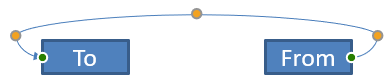

## **Bevezetés**

A PowerPoint kapcsoló egy speciális vonal, amely két alakzatot kapcsol össze, és a alakzatokhoz kapcsolódva marad akkor is, ha azok egy adott dián mozognak vagy áthelyeződnek. 

A kapcsolók általában *kapcsolódási pontokhoz* (zöld pontok) csatlakoznak, amelyek alapértelmezés szerint minden alakzaton megtalálhatók. A kapcsolódási pontok megjelennek, amikor a kurzor közel kerül hozzájuk.

*Igazítási pontok* (narancssárga pontok), amelyek csak bizonyos kapcsolók esetén léteznek, a kapcsolók pozíciójának és alakjának módosítására szolgálnak.

## **Kapcsolók típusai**

A PowerPointban használhatunk egyenes, könyök (szöges) és íves kapcsolókat. 

Aspose.Slides ezeket a kapcsolókat biztosítja:

| Kapcsoló                      | Kép                                                        | Igazítási pontok száma |
| ------------------------------ | ------------------------------------------------------------ | --------------------------- |
| `ShapeType::Line`               |       | 0                           |
| `ShapeType::StraightConnector1` |  | 0                           |
| `ShapeType::BentConnector2`     |   | 0                           |
| `ShapeType::BentConnector3`     |     | 1                           |
| `ShapeType::BentConnector4`     |     | 2                           |
| `ShapeType::BentConnector5`     |     | 3                           |
| `ShapeType::CurvedConnector2`   |  | 0                           |
| `ShapeType::CurvedConnector3`   |  | 1                           |
| `ShapeType::CurvedConnector4`   |  | 2                           |
| `ShapeType::CurvedConnector5`   |  | 3                           |

## **Alakzatok összekapcsolása kapcsolókkal**

1. Hozzon létre egy példányt a [Presentation](https://apireference.aspose.com/slides/hu/php-java/aspose.slides/Presentation) osztályból.  
1. Szerezze meg a dia hivatkozását az indexén keresztül.  
1. Adjon hozzá két [AutoShape](https://reference.aspose.com/slides/hu/php-java/aspose.slides/AutoShape) elemet a dián a `Shapes` objektum által biztosított `addAutoShape` metódussal.  
1. Adjon hozzá egy kapcsolót a `Shapes` objektum által biztosított `addConnector` metódussal, megadva a kapcsoló típusát.  
1. Kösse össze az alakzatokat a kapcsolóval.  
1. Hívja meg a `reroute` metódust a legrövidebb kapcsolati út alkalmazásához.  
1. Mentse a prezentációt.  

Ez a PHP kód bemutatja, hogyan adjon hozzá egy kapcsolót (egy megtört kapcsolót) két alakzat (egy ellipszis és egy téglalap) között:

```php
// Létrehozza a PPTX fájlt képviselő prezentáció osztályt
  $pres = new Presentation();
  try {
    # Hozzáfér a megadott dia alakzatgyűjteményéhez
    $shapes = $pres->getSlides()->get_Item(0)->getShapes();
    # Ellipszis autóalakzatot ad hozzá
    $ellipse = $shapes->addAutoShape(ShapeType::Ellipse, 0, 100, 100, 100);
    # Téglalap autóalakzatot ad hozzá
    $rectangle = $shapes->addAutoShape(ShapeType::Rectangle, 100, 300, 100, 100);
    # Kapcsoló alakzatot ad a dia alakzatgyűjteményéhez
    $connector = $shapes->addConnector(ShapeType::BentConnector2, 0, 0, 10, 10);
    # A kapcsolóval összekapcsolja az alakzatokat
    $connector->setStartShapeConnectedTo($ellipse);
    $connector->setEndShapeConnectedTo($rectangle);
    # Meghívja a reroute metódust, amely beállítja az alakzatok közötti automatikus legrövidebb utat
    $connector->reroute();
    # Mentse a prezentációt
    $pres->save("output.pptx", SaveFormat::Pptx);
} finally {
    if (!java_is_null($pres)) $pres.dispose();
}
```

{} 
`Connector.reroute` metódus újra irányítja a kapcsolót, és kényszeríti, hogy a lehető legrövidebb útvonalat vegye az alakzatok között. A cél elérése érdekében a metódus módosíthatja a `setStartShapeConnectionSiteIndex` és a `setEndShapeConnectionSiteIndex` pontokat. 
{} 

## **Kapcsolódási pont megadása**

Ha azt szeretné, hogy egy kapcsoló két alakzatot a alakzatok meghatározott pontjaival kössön össze, a preferált kapcsolódási pontokat a következő módon kell megadni:

1. Hozzon létre egy példányt a [Presentation](https://reference.aspose.com/slides/hu/php-java/aspose.slides/Presentation) osztályból.  
1. Szerezze meg a dia hivatkozását az indexén keresztül.  
1. Adjon hozzá két [AutoShape](https://reference.aspose.com/slides/hu/php-java/aspose.slides/AutoShape) elemet a dián a `Shapes` objektum által biztosított `addAutoShape` metódussal.  
1. Adjon hozzá egy kapcsolót a `Shapes` objektum által biztosított `addConnector` metódussal, megadva a kapcsoló típusát.  
1. Kösse össze az alakzatokat a kapcsolóval.  
1. Állítsa be a preferált kapcsolódási pontokat az alakzatokon.  
1. Mentse a prezentációt.  

```php
  # Létrehozza a PPTX fájlt reprezentáló prezentáció osztályt
  $pres = new Presentation();
  try {
    # Hozzáfér a megadott dia alakzatgyűjteményéhez
    $shapes = $pres->getSlides()->get_Item(0)->getShapes();
    # Ellipszis autóalakzatot ad hozzá
    $ellipse = $shapes->addAutoShape(ShapeType::Ellipse, 0, 100, 100, 100);
    # Téglalap autóalakzatot ad hozzá
    $rectangle = $shapes->addAutoShape(ShapeType::Rectangle, 100, 300, 100, 100);
    # Kapcsoló alakzatot ad a dia alakzatgyűjteményéhez
    $connector = $shapes->addConnector(ShapeType::BentConnector2, 0, 0, 10, 10);
    # A kapcsolóval összekapcsolja az alakzatokat
    $connector->setStartShapeConnectedTo($ellipse);
    $connector->setEndShapeConnectedTo($rectangle);
    # Beállítja a preferált kapcsolódási pont indexét az Ellipszis alakzaton
    $wantedIndex = 6;
    # Ellenőrzi, hogy a preferált index kisebb-e a maximális hely index számnál
    if ($ellipse->getConnectionSiteCount() > $wantedIndex) {
      # Beállítja a preferált kapcsolódási pontot az Ellipszis autóalakzaton
      $connector->setStartShapeConnectionSiteIndex($wantedIndex);
    }
    # Mentse a prezentációt
    $pres->save("output.pptx", SaveFormat::Pptx);
  } finally {
    if (!java_is_null($pres)) {
      $pres->dispose();
    }
  }
```

## **Kapcsoló pontjának módosítása**

Egy meglévő kapcsolót a hozzá tartozó igazítási pontokkal módosíthat. Csak az igazítási pontokkal rendelkező kapcsolók módosíthatók ebben a módon. Lásd a táblázatot a **[Kapcsolók típusai](/slides/hu/php-java/connector/#types-of-connectors)** alatt.

### **Egyszerű eset**

Tekintsünk egy esetet, ahol egy kapcsoló két alakzat (A és B) között egy harmadik alakzatot (C) érint:


```php
  $pres = new Presentation();
  try {
    $sld = $pres->getSlides()->get_Item(0);
    $shape = $sld->getShapes()->addAutoShape(ShapeType::Rectangle, 300, 150, 150, 75);
    $shapeFrom = $sld->getShapes()->addAutoShape(ShapeType::Rectangle, 500, 400, 100, 50);
    $shapeTo = $sld->getShapes()->addAutoShape(ShapeType::Rectangle, 100, 100, 70, 30);
    $connector = $sld->getShapes()->addConnector(ShapeType::BentConnector5, 20, 20, 400, 300);
    $connector->getLineFormat()->setEndArrowheadStyle(LineArrowheadStyle->Triangle);
    $connector->getLineFormat()->getFillFormat()->setFillType(FillType::Solid);
    $connector->getLineFormat()->getFillFormat()->getSolidFillColor()->setColor(java("java.awt.Color")->BLACK);
    $connector->setStartShapeConnectedTo($shapeFrom);
    $connector->setEndShapeConnectedTo($shapeTo);
    $connector->setStartShapeConnectionSiteIndex(2);
  } finally {
    if (!java_is_null($pres)) {
      $pres->dispose();
    }
  }
```

A harmadik alakzat elkerüléséhez vagy megkerüléséhez a kapcsolót úgy módosíthatjuk, hogy a függőleges vonalát balra mozdítjuk:


```php
  $adj2 = $connector->getAdjustments()->get_Item(1);
  $adj2->setRawValue($adj2->getRawValue() + 10000);

```

### **Összetett esetek** 

Összetettebb módosítások végrehajtásához az alábbiakat kell figyelembe venni:

* A kapcsoló állítható pontja szorosan egy olyan képlethez kapcsolódik, amely kiszámítja és meghatározza a pozícióját. Így a pont helyzetének változtatása megváltoztathatja a kapcsoló alakját.  
* A kapcsoló igazítási pontjai egy tömbben szigorú sorrendben vannak definiálva. Az igazítási pontok számozása a kapcsoló kezdőpontjától a végpontig tart.  
* Az igazítási pont értékei a kapcsoló alakzat szélességének/magasságának százalékát tükrözik.  
  * Az alakzat a kapcsoló kezdő- és végpontjainak 1000-szeresével határolt.  
  * Az első, második és harmadik pont a szélesség, a magasság, majd újra a szélesség százalékát határozza meg.  
* Az igazítási pontok koordinátáit meghatározó számításoknál figyelembe kell venni a kapcsoló forgását és tükröződését. **Megjegyzés**: a **[Kapcsolók típusai](/slides/hu/php-java/connector/#types-of-connectors)** alatt látható összes kapcsoló forgatási szöge 0.

#### **Eset 1**

Tekintsünk egy esetet, ahol két szövegkeret objektum egy kapcsolóval van összekapcsolva:


```php
  # Létrehozza a PPTX fájlt reprezentáló prezentáció osztályt
  $pres = new Presentation();
  try {
    # Lekéri a prezentáció első diáját
    $sld = $pres->getSlides()->get_Item(0);
    # Alakzatokat ad hozzá, amelyeket egy kapcsolóval kapcsolunk össze
    $shapeFrom = $sld->getShapes()->addAutoShape(ShapeType::Rectangle, 100, 100, 60, 25);
    $shapeFrom->getTextFrame()->setText("From");
    $shapeTo = $sld->getShapes()->addAutoShape(ShapeType::Rectangle, 500, 100, 60, 25);
    $shapeTo->getTextFrame()->setText("To");
    # Kapcsolót ad hozzá
    $connector = $sld->getShapes()->addConnector(ShapeType::BentConnector4, 20, 20, 400, 300);
    # Meghatározza a kapcsoló irányát
    $connector->getLineFormat()->setEndArrowheadStyle(LineArrowheadStyle->Triangle);
    # Meghatározza a kapcsoló színét
    $connector->getLineFormat()->getFillFormat()->setFillType(FillType::Solid);
    $connector->getLineFormat()->getFillFormat()->getSolidFillColor()->setColor(java("java.awt.Color")->RED);
    # Meghatározza a kapcsoló vonalának vastagságát
    $connector->getLineFormat()->setWidth(3);
    # Az alakzatokat a kapcsolóval összekapcsolja
    $connector->setStartShapeConnectedTo($shapeFrom);
    $connector->setStartShapeConnectionSiteIndex(3);
    $connector->setEndShapeConnectedTo($shapeTo);
    $connector->setEndShapeConnectionSiteIndex(2);
    # Lekéri a kapcsoló igazítási pontjait
    $adjValue_0 = $connector->getAdjustments()->get_Item(0);
    $adjValue_1 = $connector->getAdjustments()->get_Item(1);
  } finally {
    if (!java_is_null($pres)) {
      $pres->dispose();
    }
  }
```

**Módosítás**

A kapcsoló igazítási pontjainak értékeit a megfelelő szélesség- és magasság százalékának 20%-os és 200%-os növelésével módosíthatjuk:

```php
  # Módosítja az igazítási pontok értékeit
  $adjValue_0->setRawValue($adjValue_0->getRawValue() + 20000);
  $adjValue_1->setRawValue($adjValue_1->getRawValue() + 200000);

```

Az eredmény:


Ahhoz, hogy egy modellt definiáljunk, amely lehetővé teszi a kapcsoló egyes részeinek koordinátáinak és alakjának meghatározását, hozzunk létre egy alakzatot, amely a `connector.getAdjustments().get_Item(0)` pontnál lévő vízszintes komponensnek felel meg:

```php
  # Rajzolja a kapcsoló függőleges komponensét
  $x = $connector->getX() . $connector->getWidth() * $adjValue_0->getRawValue() / 100000;
  $y = $connector->getY();
  $height = $connector->getHeight() * $adjValue_1->getRawValue() / 100000;
  $sld->getShapes()->addAutoShape(ShapeType::Rectangle, $x, $y, 0, $height);
```

Az eredmény:


#### **Eset 2**

Az **Eset 1**-ben egyszerű kapcsoló módosítási műveletet mutattunk be alapelvek használatával. Normál körülmények között figyelembe kell venni a kapcsoló forgását és megjelenését (amelyeket a `connector.getRotation()`, a `connector.getFrame().getFlipH()` és a `connector.getFrame().getFlipV()` állít be). Most bemutatjuk a folyamatot.

Először adjunk hozzá egy új szövegkeret objektumot (**To 1**) a diához (kapcsolódási célból), és hozzunk létre egy új (zöld) kapcsolót, amely összeköti azt a már létrehozott objektumokkal.

```php
  # Létrehozza az új kötési objektumot
  $shapeTo_1 = $sld->getShapes()->addAutoShape(ShapeType::Rectangle, 100, 400, 60, 25);
  $shapeTo_1->getTextFrame()->setText("To 1");
  # Létrehozza az új kapcsolót
  $connector = $sld->getShapes()->addConnector(ShapeType::BentConnector4, 20, 20, 400, 300);
  $connector->getLineFormat()->setEndArrowheadStyle(LineArrowheadStyle->Triangle);
  $connector->getLineFormat()->getFillFormat()->setFillType(FillType::Solid);
  $connector->getLineFormat()->getFillFormat()->getSolidFillColor()->setColor(java("java.awt.Color")->CYAN);
  $connector->getLineFormat()->setWidth(3);
  # Az objektumokat az újonnan létrehozott kapcsolóval összekapcsolja
  $connector->setStartShapeConnectedTo($shapeFrom);
  $connector->setStartShapeConnectionSiteIndex(2);
  $connector->setEndShapeConnectedTo($shapeTo_1);
  $connector->setEndShapeConnectionSiteIndex(3);
  # Lekéri a kapcsoló igazítási pontjait
  $adjValue_0 = $connector->getAdjustments()->get_Item(0);
  $adjValue_1 = $connector->getAdjustments()->get_Item(1);
  # Módosítja az igazítási pontok értékeit
  $adjValue_0->setRawValue($adjValue_0->getRawValue() + 20000);
  $adjValue_1->setRawValue($adjValue_1->getRawValue() + 200000);

```

Az eredmény:


Másodszor hozzunk létre egy alakzatot, amely a kapcsoló vízszintes komponensének felel meg, és áthalad az új kapcsoló igazítási pontján: `connector.getAdjustments().get_Item(0)`. A `connector.getRotation()`, a `connector.getFrame().getFlipH()` és a `connector.getFrame().getFlipV()` értékeket fogjuk használni, és alkalmazzuk a gyakran használt koordináta átalakító képletet a forgatáshoz egy adott x0 pont körül:

X = (x — x0) * cos(alpha) — (y — y0) * sin(alpha) + x0;

Y = (x — x0) * sin(alpha) + (y — y0) * cos(alpha) + y0;

A mi esetünkben az objektum forgásszöge 90 fok, a kapcsoló függőlegesen jelenik meg, ezért ez a megfelelő kód:

```php
  # Elmenti a kapcsoló koordinátáit
  $x = $connector->getX();
  $y = $connector->getY();
  # Javítja a kapcsoló koordinátákat, ha szükséges
  if ($connector->getFrame()->getFlipH() == NullableBool::True) {
    $x += $connector->getWidth();
  }
  if ($connector->getFrame()->getFlipV() == NullableBool::True) {
    $y += $connector->getHeight();
  }
  # Az igazítási pont értékét veszi koordinátaként
  $x += $connector->getWidth() * $adjValue_0->getRawValue() / 100000;
  # Átalakítja a koordinátákat, mivel Sin(90)=1 és Cos(90)=0
  $xx = $connector->getFrame()->getCenterX() - $y . $connector->getFrame()->getCenterY();
  $yy = $x - $connector->getFrame()->getCenterX() . $connector->getFrame()->getCenterY();
  # Meghatározza a vízszintes komponens szélességét a második igazítási pont értékének felhasználásával
  $width = $connector->getHeight() * $adjValue_1->getRawValue() / 100000;
  $shape = $sld->getShapes()->addAutoShape(ShapeType::Rectangle, $xx, $yy, $width, 0);
  $shape->getLineFormat()->getFillFormat()->setFillType(FillType::Solid);
  $shape->getLineFormat()->getFillFormat()->getSolidFillColor()->setColor(java("java.awt.Color")->RED);
```

Az eredmény:


Bemutattuk az egyszerű módosításokat és a bonyolultabb, forgatási szöggel rendelkező igazítási pontokat érintő számításokat. Az így szerzett tudás segítségével saját modellt fejleszthet (vagy kódot írhat), amely `GraphicsPath` objektumot hoz létre, vagy akár a kapcsoló igazítási pontjainak értékeit beállítja a konkrét diak koordináták alapján.

## **A kapcsoló vonalak szögének meghatározása**

1. Hozzon létre egy példányt az osztályból.  
1. Szerezze meg a dia hivatkozását az indexén keresztül.  
1. Hozza hozzá a kapcsoló vonal alakzatot.  
1. Használja a vonal szélességét, magasságát, az alakzat keretmagasságát és keretszélességét a szög kiszámításához.  

```php
  $pres = new Presentation("ConnectorLineAngle.pptx");
  try {
    $slide = $pres->getSlides()->get_Item(0);
    for($i = 0; $i < java_values($slide->getShapes()->size()) ; $i++) {
      $dir = 0.0;
      $shape = $slide->getShapes()->get_Item($i);
      if (java_instanceof($shape, new JavaClass("com.aspose.slides.AutoShape"))) {
        $ashp = $shape;
        if ($ashp->getShapeType() == ShapeType::Line) {
          $dir = getDirection($ashp->getWidth(), $ashp->getHeight(), java_values($ashp->getFrame()->getFlipH()) > 0, $ashp->getFrame()->getFlipV() > 0);
        }
      } else if (java_instanceof($shape, new JavaClass("com.aspose.slides.Connector"))) {
        $ashp = $shape;
        $dir = getDirection($ashp->getWidth(), $ashp->getHeight(), java_values($ashp->getFrame()->getFlipH()) > 0, java_values($ashp->getFrame()->getFlipV()) > 0);
      }
      echo($dir);
    }
  } finally {
    if (!java_is_null($pres)) {
      $pres->dispose();
    }
  }
```

## **FAQ**

**Hogyan állapíthatom meg, hogy egy kapcsoló „ragasztható”‑e egy adott alakzatra?**

Ellenőrizze, hogy az alakzat rendelkezik-e [kapcsolódási helyekkel](https://reference.aspose.com/slides/hu/php-java/aspose.slides/shape/getconnectionsitecount/). Ha nincs ilyen, vagy a számuk nulla, a ragasztás nem lehetséges; ebben az esetben szabad végpontokat kell használni és kézzel pozícionálni őket. Értelemszerűen a csatlakoztatás előtt ellenőrizni kell a helyek számát.

**Mi történik a kapcsolóval, ha törlöm az egyik csatlakoztatott alakzatot?**

A végei leválasztásra kerülnek; a kapcsoló a diához egy szabad végű vonalként marad meg. Törölheti, vagy újra hozzárendelheti a csatlakozásokat, és szükség esetén [újrairányíthatja](https://reference.aspose.com/slides/hu/php-java/aspose.slides/connector/reroute/).

**Megmaradnak a kapcsoló kötései, ha egy diát egy másik prezentációba másolok?**

Általában igen, ha a cél alakzatok is másolásra kerülnek. Ha a dia egy másik fájlba kerül a kapcsolódó alakzatok nélkül, a végek szabadokká válnak, és újra kell csatlakoztatni őket.