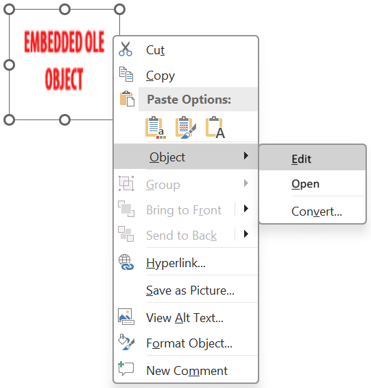

## **Bevezetés**

Amikor az Aspose.Slides for Python via Java könyvtárat használja, hogy egy [OleObjectFrame](https://reference.aspose.com/slides/hu/python-java/aspose.slides/oleobjectframe/) hozzáadjon egy diára, egy "EMBEDDED OLE OBJECT" üzenet jelenik meg a kimeneti dián. Ez az üzenet szándékos, és nem hibáról van szó.

További információért az OLE objektumok kezeléséről, lásd a [Manage OLE](/slides/hu/python-java/manage-ole/) oldalt.

## **Magyarázat és megoldás**

Az Aspose.Slides megjeleníti a "EMBEDDED OLE OBJECT" üzenetet, hogy jelezze, hogy az OLE objektum módosult, és a előnézeti képet frissíteni kell.

Például, ha egy Microsoft Excel diagramot ad hozzá egy [OleObjectFrame](https://reference.aspose.com/slides/hu/python-java/aspose.slides/oleobjectframe/) diára (további részletekért lásd a "Manage OLE" cikket), majd megnyitja a prezentációt a Microsoft PowerPointban, a dián ezt a képet fogja látni:


Azt megerősíteni, hogy az OLE objektum a diára került, kattintson duplán a "EMBEDDED OLE OBJECT" üzenetre, vagy kattintson jobb gombbal, és válassza az **Object > Edit** lehetőséget.



Ezután a PowerPoint megnyitja a beágyazott OLE objektumot.


A dia megtarthatja a "EMBEDDED OLE OBJECT" üzenetet. Amikor rákattint az OLE objektumra, a dia előnézete frissül, és a "EMBEDDED OLE OBJECT" üzenet helyett megjelenik az OLE objektum tényleges képe.


Mentse a prezentációt a frissített OLE objektum előnézeti kép megőrzéséhez. Amikor újra megnyitja a prezentációt, már nem fogja látni a "EMBEDDED OLE OBJECT" üzenetet.

## **Egyéb megoldás**

Ha nem kívánja eltávolítani a "EMBEDDED OLE OBJECT" üzenetet a prezentáció PowerPointban történő megnyitásával és mentésével, helyettesítheti azt a kívánt előnézeti képpel. Az alábbi kód bemutatja a folyamatot:

```python
import jpype
import asposeslides

if not jpype.isJVMStarted():
    jpype.startJVM()

from asposeslides.api import Images, Presentation, SaveFormat

presentation = Presentation("embeddedOLE.pptx")
try:
    slide = presentation.getSlides().get_Item(0)
    ole_frame = slide.getShapes().get_Item(0)

    # Kép hozzáadása a prezentáció erőforrásaihoz.
    image = Images.fromFile("myImage.png")
    try:
        ole_image = presentation.getImages().addImage(image)
    finally:
        image.dispose()

    # Cím és kép beállítása az OLE objektum előnézetéhez.
    ole_frame.setSubstitutePictureTitle("My title")
    ole_frame.getSubstitutePictureFormat().getPicture().setImage(ole_image)
    ole_frame.setObjectIcon(False)

    presentation.save("embeddedOLE-newImage.pptx", SaveFormat.Pptx)
finally:
    presentation.dispose()
```

A [OleObjectFrame](https://reference.aspose.com/slides/hu/python-java/aspose.slides/oleobjectframe/) tartalmazó dia ezután a következőre változik:


## **GYIK**

**Miért jelenik meg a "EMBEDDED OLE OBJECT" üzenet?**

Az üzenet azt jelzi, hogy az OLE objektum megváltozott, és az előnézeti képet frissíteni kell. Ez a viselkedés szándékos.

**Hogyan frissíthetem az előnézetet a PowerPointban?**

Kattintson duplán az üzenetre, vagy válassza az **Object > Edit** lehetőséget a beágyazott OLE objektum megnyitásához. Kattintson az OLE objektumra a előnézet frissítéséhez, majd mentse a prezentációt.

**Lecserélhetem az üzenetet a prezentáció PowerPointban történő megnyitása nélkül?**

Igen. A fenti kódrészletben bemutatott módon hozzárendelhet egy kívánt előnézeti képet az OLE objektumhoz.