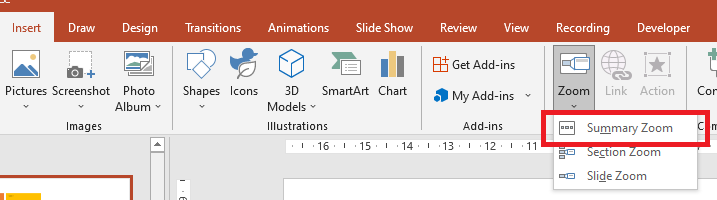

## **Bevezetés**

A PowerPoint zoomok lehetővé teszik, hogy átlépjünk és visszalépjünk a bemutató adott diái, szekciói és részei között. Prezentálás közben ez a gyors navigálási képesség nagyon hasznos lehet.


* Az egész prezentáció egyetlen dián való összefoglalásához használja az [Összegző zoom](#summary-zoom) elemet.
* Csak a kiválasztott diák megjelenítéséhez használja a [Dia zoom](#slide-zoom) elemet.
* Egyetlen szekció megjelenítéséhez használja a [Szekció zoom](#section-zoom) elemet.

## **Dia zoom**
A dia zoom dinamikusabbá teheti a prezentációt, lehetővé téve, hogy szabadon navigáljon a diák között tetszőleges sorrendben, anélkül, hogy megzavarná a bemutató folyamatát. A dia zoomok kiválóak rövid, kevés szekcióval rendelkező előadásokhoz, de más prezentációs forgatókönyvekben is használhatók.

A dia zoomok segítenek több információs darabot részletezni, miközben úgy érzi, mintha egyetlen vásznon dolgozna.


Dia zoom objektumokhoz az Aspose.Slides biztosítja a ZoomImageType felsorolást, a ZoomFrame osztályt, valamint a ShapeCollection osztály egyes metódusait.

### **Zoom keretek létrehozása**

Zoomkeretet egy diára a következőképpen adhat hozzá:

1. Hozzon létre egy példányt a Presentation osztályból.
2. Hozzon létre új diákat, amelyhez a zoom kereteket szeretné összekapcsolni.
3. Adjon az elkészített diákhoz azonosító szöveget és háttérképet.
4. Adjon hozzá zoomkereteket (amelyek a létrehozott diákat hivatkozzák) az első diához.
5. Mentse a módosított prezentációt PPTX fájlként.

Ez a Python kód bemutatja, hogyan hozhat létre zoomkeretet egy dián:

```python
import jpype
import asposeslides

if not jpype.isJVMStarted():
    jpype.startJVM()

from asposeslides.api import BackgroundType, FillType, Presentation, SaveFormat, ShapeType
from java.awt import Color

presentation = Presentation()
try:
    # Adds new slides to the presentation
    #  Creates a background for the second slide
    #  Creates a text box for the second slide
    second_slide = presentation.getSlides().addEmptySlide(presentation.getSlides().get_Item(0).getLayoutSlide())
    third_slide = presentation.getSlides().addEmptySlide(presentation.getSlides().get_Item(0).getLayoutSlide())

    #  Creates a background for the second slide
    second_slide.getBackground().setType(BackgroundType.OwnBackground)
    second_slide.getBackground().getFillFormat().setFillType(FillType.Solid)
    second_slide.getBackground().getFillFormat().getSolidFillColor().setColor(Color.cyan)

    #  Creates a text box for the second slide
    auto_shape = second_slide.getShapes().addAutoShape(ShapeType.Rectangle, 100, 200, 500, 200)
    auto_shape.getTextFrame().setText("Second Slide")

    #  Creates a background for the third slide
    third_slide.getBackground().setType(BackgroundType.OwnBackground)
    third_slide.getBackground().getFillFormat().setFillType(FillType.Solid)
    third_slide.getBackground().getFillFormat().getSolidFillColor().setColor(Color.darkGray)

    #  Create a text box for the third slide
    auto_shape = third_slide.getShapes().addAutoShape(ShapeType.Rectangle, 100, 200, 500, 200)
    auto_shape.getTextFrame().setText("Third Slide")

    # Adds ZoomFrame objects
    presentation.getSlides().get_Item(0).getShapes().addZoomFrame(20, 20, 250, 200, second_slide)
    presentation.getSlides().get_Item(0).getShapes().addZoomFrame(200, 250, 250, 200, third_slide)

    #  Saves the presentation
    presentation.save("presentation.pptx", SaveFormat.Pptx)
finally:
    presentation.dispose()
```
### **Egyedi képekkel rendelkező zoom keretek létrehozása**
Az Aspose.Slides for Python via Java használatával a következőképpen hozhat létre egy zoomkeretet eltérő dia előnézeti képpel:

1. Hozzon létre egy példányt a Presentation osztályból.
2. Hozzon létre egy új diát, amelyhez a zoomkeretet szeretné összekapcsolni.
3. Adjon azonosító szöveget és háttérképet a diára.
4. Hozzon létre egy PPImage objektumot úgy, hogy egy képet ad a Presentation objektumhoz tartozó képgyűjteményhez, amely a keret kitöltésére lesz használva.
5. Adjon hozzá zoomkereteket (amelyek a létrehozott diát hivatkozzák) az első diához.
6. Mentse a módosított prezentációt PPTX fájlként.

Ez a Python kód bemutatja, hogyan hozhat létre egy zoomkeretet különböző képpel:

```python
import jpype
import asposeslides

if not jpype.isJVMStarted():
    jpype.startJVM()

from asposeslides.api import BackgroundType, FillType, Images, Presentation, SaveFormat, ShapeType
from java.awt import Color

presentation = Presentation()
try:
    # Új dia hozzáadása a prezentációhoz
    slide = presentation.getSlides().addEmptySlide(presentation.getSlides().get_Item(0).getLayoutSlide())

    #  Háttér létrehozása a második diára
    slide.getBackground().setType(BackgroundType.OwnBackground)
    slide.getBackground().getFillFormat().setFillType(FillType.Solid)
    slide.getBackground().getFillFormat().getSolidFillColor().setColor(Color.cyan)

    #  Szövegdoboz létrehozása a második diára
    auto_shape = slide.getShapes().addAutoShape(ShapeType.Rectangle, 100, 200, 500, 200)
    auto_shape.getTextFrame().setText("Second Slide")

    #  Új kép létrehozása a zoom objektumhoz
    image = Images.fromFile("image.png")
    try:
        picture = presentation.getImages().addImage(image)
    finally:
        image.dispose()

    # A ZoomFrame objektum hozzáadása
    presentation.getSlides().get_Item(0).getShapes().addZoomFrame(20, 20, 300, 200, slide, picture)

    #  A prezentáció mentése
    presentation.save("presentation.pptx", SaveFormat.Pptx)
finally:
    presentation.dispose()
```
### **Zoom keretek formázása**
Az előző szakaszokban bemutattuk, hogyan hozhatunk létre egyszerű zoomkereteket. Bonyolultabb zoomkeretek létrehozásához módosítani kell egy egyszerű keret formázását. Számos formázási lehetőség áll rendelkezésre egy zoomkerethez.

A zoomkeret formázását egy dián a következőképpen szabályozhatja:

1. Hozzon létre egy példányt a Presentation osztályból.
2. Hozzon létre új diákat, amelyhez a zoom kereteket szeretné összekapcsolni.
3. Adjon azonosító szöveget és háttérképet a létrehozott diákhoz.
4. Adjon hozzá zoomkereteket (amelyek a létrehozott diákat hivatkozzák) az első diához.
5. Hozzon létre egy PPImage objektumot úgy, hogy egy képet ad a Presentation objektumhoz tartozó képgyűjteményhez, amely a keret kitöltésére lesz használva.
6. Állítson be egy egyedi képet az első zoomkeret objektumhoz.
7. Módosítsa a vonalformátumot a második zoomkeret objektumnál.
8. Távolítsa el a háttérképet a második zoomkeret objektum képéről.
9. Mentse a módosított prezentációt PPTX fájlként.

Ez a Python kód bemutatja, hogyan változtathatja meg egy zoomkeret formázását egy dián:

```python
import jpype
import asposeslides

if not jpype.isJVMStarted():
    jpype.startJVM()

from asposeslides.api import BackgroundType, FillType, Images, LineDashStyle, Presentation, SaveFormat, ShapeType
from java.awt import Color

presentation = Presentation()
try:
    # Új diák hozzáadása a prezentációhoz
    second_slide = presentation.getSlides().addEmptySlide(presentation.getSlides().get_Item(0).getLayoutSlide())
    third_slide = presentation.getSlides().addEmptySlide(presentation.getSlides().get_Item(0).getLayoutSlide())

    #  Háttér létrehozása a második diára
    second_slide.getBackground().setType(BackgroundType.OwnBackground)
    second_slide.getBackground().getFillFormat().setFillType(FillType.Solid)
    second_slide.getBackground().getFillFormat().getSolidFillColor().setColor(Color.cyan)

    #  Szövegdoboz létrehozása a második diára
    auto_shape = second_slide.getShapes().addAutoShape(ShapeType.Rectangle, 100, 200, 500, 200)
    auto_shape.getTextFrame().setText("Second Slide")

    #  Háttér létrehozása a harmadik diára
    third_slide.getBackground().setType(BackgroundType.OwnBackground)
    third_slide.getBackground().getFillFormat().setFillType(FillType.Solid)
    third_slide.getBackground().getFillFormat().getSolidFillColor().setColor(Color.darkGray)

    #  Szövegdoboz létrehozása a harmadik diára
    auto_shape = third_slide.getShapes().addAutoShape(ShapeType.Rectangle, 100, 200, 500, 200)
    auto_shape.getTextFrame().setText("Third Slide")

    # ZoomFrame objektumok hozzáadása
    first_zoom_frame = presentation.getSlides().get_Item(0).getShapes().addZoomFrame(20, 20, 250, 200, second_slide)
    second_zoom_frame = presentation.getSlides().get_Item(0).getShapes().addZoomFrame(200, 250, 250, 200, third_slide)

    #  Új kép létrehozása a zoom objektumhoz
    image = Images.fromFile("image.png")
    try:
        picture = presentation.getImages().addImage(image)
    finally:
        image.dispose()

    #  Egyedi kép beállítása a first_zoom_frame objektumhoz
    first_zoom_frame.setZoomImage(picture)

    #  Zoom keret formátumának beállítása a second_zoom_frame objektumhoz
    second_zoom_frame.getLineFormat().setWidth(5)
    second_zoom_frame.getLineFormat().getFillFormat().setFillType(FillType.Solid)
    second_zoom_frame.getLineFormat().getFillFormat().getSolidFillColor().setColor(Color.pink)
    second_zoom_frame.getLineFormat().setDashStyle(LineDashStyle.DashDot)

    #  Beállítás a háttér elrejtésére a second_zoom_frame objektumnál
    second_zoom_frame.setShowBackground(False)

    #  A prezentáció mentése
    presentation.save("presentation.pptx", SaveFormat.Pptx)
finally:
    presentation.dispose()
```

## **Szekció zoom**

A szekció zoom egy hivatkozás a prezentáció egy szekciójára. A szekció zoomokat használhatja visszatérésre olyan szekciókhoz, amelyeket különösen ki szeretne emelni. Vagy használhatja őket arra, hogy bemutassa, hogyan kapcsolódnak a prezentáció egyes részei.


Szekció zoom objektumokhoz az Aspose.Slides biztosítja a SectionZoomFrame osztályt és a ShapeCollection osztály egyes metódusait.

### **Szekció zoom keretek létrehozása**

Szekció zoom keretet a diára a következőképpen adhat hozzá:

1. Hozzon létre egy példányt a Presentation osztályból.
2. Hozzon létre egy új diát.
3. Adjon egy megkülönböztető háttérképet a létrehozott diára.
4. Hozzon létre egy új szekciót, amelyhez a zoomkeretet szeretné összekapcsolni.
5. Adjon hozzá egy szekció zoom keretet (amely a létrehozott szekcióra hivatkozik) az első diához.
6. Mentse a módosított prezentációt PPTX fájlként.

Ez a Python kód bemutatja, hogyan hozhat létre egy zoomkeretet egy dián:

```python
import jpype
import asposeslides

if not jpype.isJVMStarted():
    jpype.startJVM()

from asposeslides.api import BackgroundType, FillType, Presentation, SaveFormat
from java.awt import Color

presentation = Presentation()
try:
    # Új dia hozzáadása a prezentációhoz
    slide = presentation.getSlides().addEmptySlide(presentation.getSlides().get_Item(0).getLayoutSlide())
    slide.getBackground().getFillFormat().setFillType(FillType.Solid)
    slide.getBackground().getFillFormat().getSolidFillColor().setColor(Color.yellow)
    slide.getBackground().setType(BackgroundType.OwnBackground)

    #  Új szekció hozzáadása a prezentációhoz
    presentation.getSections().addSection("Section 1", slide)

    #  SectionZoomFrame objektum hozzáadása
    section_zoom_frame = presentation.getSlides().get_Item(0).getShapes().addSectionZoomFrame(20, 20, 300, 200, presentation.getSections().get_Item(1))

    #  A prezentáció mentése
    presentation.save("presentation.pptx", SaveFormat.Pptx)
finally:
    presentation.dispose()
```
### **Egyedi képekkel rendelkező szekció zoom keretek létrehozása**

Az Aspose.Slides for Python via Java használatával a következőképpen hozhat létre egy szekció zoom keretet eltérő dia előnézeti képpel:

1. Hozzon létre egy példányt a Presentation osztályból.
2. Hozzon létre egy új diát.
3. Adjon egy megkülönböztető háttérképet a létrehozott diára.
4. Hozzon létre egy új szekciót, amelyhez a zoomkeretet szeretné összekapcsolni.
5. Hozzon létre egy PPImage objektumot úgy, hogy egy képet ad a Presentation objektumhoz tartozó képgyűjteményhez, amely a keret kitöltésére lesz használva.
6. Adjon hozzá egy szekció zoom keretet (amely a létrehozott szekcióra hivatkozik) az első diához.
7. Mentse a módosított prezentációt PPTX fájlként.

Ez a Python kód bemutatja, hogyan hozhat létre egy zoomkeretet különböző képpel:

```python
import jpype
import asposeslides

if not jpype.isJVMStarted():
    jpype.startJVM()

from asposeslides.api import BackgroundType, FillType, Images, Presentation, SaveFormat
from java.awt import Color

presentation = Presentation()
try:
    # Új dia hozzáadása a prezentációhoz
    slide = presentation.getSlides().addEmptySlide(presentation.getSlides().get_Item(0).getLayoutSlide())
    slide.getBackground().getFillFormat().setFillType(FillType.Solid)
    slide.getBackground().getFillFormat().getSolidFillColor().setColor(Color.yellow)
    slide.getBackground().setType(BackgroundType.OwnBackground)

    #  Új szekció hozzáadása a prezentációhoz
    presentation.getSections().addSection("Section 1", slide)

    #  Új kép létrehozása a zoom objektumhoz
    image = Images.fromFile("image.png")
    try:
        picture = presentation.getImages().addImage(image)
    finally:
        image.dispose()

    #  SectionZoomFrame objektum hozzáadása
    section_zoom_frame = presentation.getSlides().get_Item(0).getShapes().addSectionZoomFrame(20, 20, 300, 200, presentation.getSections().get_Item(1), picture)

    #  A prezentáció mentése
    presentation.save("presentation.pptx", SaveFormat.Pptx)
finally:
    presentation.dispose()
```
### **Szekció zoom keretek formázása**

Bonyolultabb szekció zoom keretek létrehozásához módosítani kell egy egyszerű keret formázását. Számos formázási lehetőség áll rendelkezésre egy szekció zoom kerethez.

A szekció zoom keret formázását egy dián a következőképpen szabályozhatja:

1. Hozzon létre egy példányt a Presentation osztályból.
2. Hozzon létre egy új diát.
3. Adjon egy megkülönböztető háttérképet a létrehozott diára.
4. Hozzon létre egy új szekciót, amelyhez a zoomkeretet szeretné összekapcsolni.
5. Adjon hozzá egy szekció zoom keretet (amely a létrehozott szekcióra hivatkozik) az első diához.
6. Módosítsa a létrehozott szekció zoom objektum méretét és pozícióját.
7. Hozzon létre egy PPImage objektumot úgy, hogy egy képet ad a Presentation objektumhoz tartozó képgyűjteményhez, amely a keret kitöltésére lesz használva.
8. Állítson be egy egyedi képet a létrehozott szekció zoom keret objektumhoz.
9. Állítsa be a *visszatérés az eredeti diára a kapcsolt szekcióból* funkciót.
10. Távolítsa el a háttérképet a szekció zoom keret objektum képéről.
11. Módosítsa a vonalformátumot a szekció zoom keret objektumnál.
12. Módosítsa az átmenet időtartamát.
13. Mentse a módosított prezentációt PPTX fájlként.

Ez a Python kód bemutatja, hogyan változtathatja meg egy szekció zoom keret formázását:

```python
import jpype
import asposeslides

if not jpype.isJVMStarted():
    jpype.startJVM()

from asposeslides.api import BackgroundType, FillType, Images, LineDashStyle, Presentation, SaveFormat
from java.awt import Color

presentation = Presentation()
try:
    # Új dia hozzáadása a prezentációhoz
    slide = presentation.getSlides().addEmptySlide(presentation.getSlides().get_Item(0).getLayoutSlide())
    slide.getBackground().getFillFormat().setFillType(FillType.Solid)
    slide.getBackground().getFillFormat().getSolidFillColor().setColor(Color.yellow)
    slide.getBackground().setType(BackgroundType.OwnBackground)

    #  Új szekció hozzáadása a prezentációhoz
    presentation.getSections().addSection("Section 1", slide)

    #  SectionZoomFrame objektum hozzáadása
    section_zoom_frame = presentation.getSlides().get_Item(0).getShapes().addSectionZoomFrame(20, 20, 300, 200, presentation.getSections().get_Item(1))

    #  A SectionZoomFrame formázása
    section_zoom_frame.setX(100)
    section_zoom_frame.setY(300)
    section_zoom_frame.setWidth(100)
    section_zoom_frame.setHeight(75)

    image = Images.fromFile("image.png")
    try:
        picture = presentation.getImages().addImage(image)
    finally:
        image.dispose()
    section_zoom_frame.setZoomImage(picture)

    section_zoom_frame.setReturnToParent(True)
    section_zoom_frame.setShowBackground(False)

    section_zoom_frame.getLineFormat().getFillFormat().setFillType(FillType.Solid)
    section_zoom_frame.getLineFormat().getFillFormat().getSolidFillColor().setColor(Color.gray)
    section_zoom_frame.getLineFormat().setDashStyle(LineDashStyle.DashDot)
    section_zoom_frame.getLineFormat().setWidth(2.5)

    section_zoom_frame.setTransitionDuration(1.5)

    #  A prezentáció mentése
    presentation.save("presentation.pptx", SaveFormat.Pptx)
finally:
    presentation.dispose()
```


## **Összegző zoom**

Az összegző zoom egyfajta kezdőoldal, ahol a prezentáció összes része egyszerre jelenik meg. Prezentálás közben a zoom segítségével bármilyen sorrendben válthat egyik helyről a másikra a bemutatóban. Kreatív lehet, előre ugorhat, vagy visszatérhet a diavetítés egyes részeihez anélkül, hogy megszakítaná a prezentáció folyamatát.



Az összegző zoom objektumokhoz az Aspose.Slides biztosítja a SummaryZoomFrame, a SummaryZoomSection és a SummaryZoomSectionCollection osztályokat, valamint a ShapeCollection osztály egyes metódusait.

### **Összegző zoom létrehozása**

Összegző zoom keretet a diára a következőképpen adhat hozzá:

1. Hozzon létre egy példányt a Presentation osztályból.
2. Hozzon létre új diákat megkülönböztető háttérrel és új szekciókkal a létrehozott diákhoz.
3. Adja hozzá az összegző zoom keretet az első diához.
4. Mentse a módosított prezentációt PPTX fájlként.

Ez a Python kód bemutatja, hogyan hozhat létre egy összegző zoom keretet egy dián:

```python
import jpype
import asposeslides

if not jpype.isJVMStarted():
    jpype.startJVM()

from asposeslides.api import BackgroundType, FillType, Presentation, SaveFormat
from java.awt import Color

presentation = Presentation()
try:
    # Új dia hozzáadása a prezentációhoz
    slide = presentation.getSlides().addEmptySlide(presentation.getSlides().get_Item(0).getLayoutSlide())
    slide.getBackground().getFillFormat().setFillType(FillType.Solid)
    slide.getBackground().getFillFormat().getSolidFillColor().setColor(Color.gray)
    slide.getBackground().setType(BackgroundType.OwnBackground)

    #  Új szekció hozzáadása a prezentációhoz
    presentation.getSections().addSection("Section 1", slide)

    # Új dia hozzáadása a prezentációhoz
    slide = presentation.getSlides().addEmptySlide(presentation.getSlides().get_Item(0).getLayoutSlide())
    slide.getBackground().getFillFormat().setFillType(FillType.Solid)
    slide.getBackground().getFillFormat().getSolidFillColor().setColor(Color.cyan)
    slide.getBackground().setType(BackgroundType.OwnBackground)

    #  Új szekció hozzáadása a prezentációhoz
    presentation.getSections().addSection("Section 2", slide)

    # Új dia hozzáadása a prezentációhoz
    slide = presentation.getSlides().addEmptySlide(presentation.getSlides().get_Item(0).getLayoutSlide())
    slide.getBackground().getFillFormat().setFillType(FillType.Solid)
    slide.getBackground().getFillFormat().getSolidFillColor().setColor(Color.magenta)
    slide.getBackground().setType(BackgroundType.OwnBackground)

    #  Új szekció hozzáadása a prezentációhoz
    presentation.getSections().addSection("Section 3", slide)

    # Új dia hozzáadása a prezentációhoz
    slide = presentation.getSlides().addEmptySlide(presentation.getSlides().get_Item(0).getLayoutSlide())
    slide.getBackground().getFillFormat().setFillType(FillType.Solid)
    slide.getBackground().getFillFormat().getSolidFillColor().setColor(Color.green)
    slide.getBackground().setType(BackgroundType.OwnBackground)

    #  Új szekció hozzáadása a prezentációhoz
    presentation.getSections().addSection("Section 4", slide)

    #  SummaryZoomFrame objektum hozzáadása
    summary_zoom_frame = presentation.getSlides().get_Item(0).getShapes().addSummaryZoomFrame(150, 50, 300, 200)

    #  A prezentáció mentése
    presentation.save("presentation.pptx", SaveFormat.Pptx)
finally:
    presentation.dispose()
```

### **Összegző zoom szekció hozzáadása és eltávolítása**

Az összegző zoom keretben szereplő összes szekciót a SummaryZoomSection objektumok képviselik, amelyek a SummaryZoomSectionCollection objektumban vannak tárolva. Összegző zoom szekció objektumot a SummaryZoomSectionCollection osztályon keresztül adhat hozzá vagy távolíthat el a következőképpen:

1. Hozzon létre egy példányt a Presentation osztályból.
2. Hozzon létre új diákat megkülönböztető háttérrel és új szekciókkal a létrehozott diákhoz.
3. Adja hozzá az összegző zoom keretet az első diához.
4. Adjon hozzá egy új diát és szekciót a prezentációhoz.
5. Adja a létrehozott szekciót az összegző zoom kerethez.
6. Távolítsa el az első szekciót az összegző zoom keretből.
7. Mentse a módosított prezentációt PPTX fájlként.

Ez a Python kód bemutatja, hogyan adhat hozzá és távolíthat el szekciókat egy összegző zoom keretben:

```python
import jpype
import asposeslides

if not jpype.isJVMStarted():
    jpype.startJVM()

from asposeslides.api import BackgroundType, FillType, Presentation, SaveFormat
from java.awt import Color

presentation = Presentation()
try:
    # Új dia hozzáadása a prezentációhoz
    slide = presentation.getSlides().addEmptySlide(presentation.getSlides().get_Item(0).getLayoutSlide())
    slide.getBackground().getFillFormat().setFillType(FillType.Solid)
    slide.getBackground().getFillFormat().getSolidFillColor().setColor(Color.gray)
    slide.getBackground().setType(BackgroundType.OwnBackground)

    #  Új szekció hozzáadása a prezentációhoz
    presentation.getSections().addSection("Section 1", slide)

    # Új dia hozzáadása a prezentációhoz
    slide = presentation.getSlides().addEmptySlide(presentation.getSlides().get_Item(0).getLayoutSlide())
    slide.getBackground().getFillFormat().setFillType(FillType.Solid)
    slide.getBackground().getFillFormat().getSolidFillColor().setColor(Color.cyan)
    slide.getBackground().setType(BackgroundType.OwnBackground)

    #  Új szekció hozzáadása a prezentációhoz
    presentation.getSections().addSection("Section 2", slide)

    #  SummaryZoomFrame objektum hozzáadása
    summary_zoom_frame = presentation.getSlides().get_Item(0).getShapes().addSummaryZoomFrame(150, 50, 300, 200)

    # Új dia hozzáadása a prezentációhoz
    slide = presentation.getSlides().addEmptySlide(presentation.getSlides().get_Item(0).getLayoutSlide())
    slide.getBackground().getFillFormat().setFillType(FillType.Solid)
    slide.getBackground().getFillFormat().getSolidFillColor().setColor(Color.magenta)
    slide.getBackground().setType(BackgroundType.OwnBackground)

    #  Új szekció hozzáadása a prezentációhoz
    third_section = presentation.getSections().addSection("Section 3", slide)

    #  Szekció hozzáadása a Summary Zoom-hoz
    summary_zoom_frame.getSummaryZoomCollection().addSummaryZoomSection(third_section)

    #  Szekció eltávolítása a Summary Zoom-ból
    summary_zoom_frame.getSummaryZoomCollection().removeSummaryZoomSection(presentation.getSections().get_Item(1))

    #  A prezentáció mentése
    presentation.save("presentation.pptx", SaveFormat.Pptx)
finally:
    presentation.dispose()
```

### **Összegző zoom szekciók formázása**

Bonyolultabb összegző zoom szekció objektumok létrehozásához módosítani kell egy egyszerű keret formázását. Számos formázási lehetőség áll rendelkezésre egy összegző zoom szekció objektumhoz.

A összegző zoom szekció objektum formázását egy összegző zoom keretben a következőképpen szabályozhatja:

1. Hozzon létre egy példányt a Presentation osztályból.
2. Hozzon létre új diákat megkülönböztető háttérrel és új szekciókkal a létrehozott diákhoz.
3. Adja hozzá az összegző zoom keretet az első diához.
4. Szerezze meg az első SummaryZoomSection objektumot a SummaryZoomSectionCollection-ból.
5. Hozzon létre egy PPImage objektumot úgy, hogy egy képet ad a Presentation objektumhoz tartozó képgyűjteményhez, amely a keret kitöltésére lesz használva.
6. Állítson be egy egyedi képet az összegző zoom szekció objektumhoz.
7. Állítsa be a *visszatérés az eredeti diára a kapcsolt szekcióból* funkciót.
8. Módosítsa a vonalformátumot az összegző zoom szekció objektumnál.
9. Módosítsa az átmenet időtartamát.
10. Mentse a módosított prezentációt PPTX fájlként.

Ez a Python kód bemutatja, hogyan változtathatja meg egy összegző zoom szekció objektum formázását:

```python
import jpype
import asposeslides

if not jpype.isJVMStarted():
    jpype.startJVM()

from asposeslides.api import BackgroundType, FillType, Images, LineDashStyle, Presentation, SaveFormat
from java.awt import Color

presentation = Presentation()
try:
    # Új dia hozzáadása a prezentációhoz
    slide = presentation.getSlides().addEmptySlide(presentation.getSlides().get_Item(0).getLayoutSlide())
    slide.getBackground().getFillFormat().setFillType(FillType.Solid)
    slide.getBackground().getFillFormat().getSolidFillColor().setColor(Color.gray)
    slide.getBackground().setType(BackgroundType.OwnBackground)

    #  Új szekció hozzáadása a prezentációhoz
    presentation.getSections().addSection("Section 1", slide)

    # Új dia hozzáadása a prezentációhoz
    slide = presentation.getSlides().addEmptySlide(presentation.getSlides().get_Item(0).getLayoutSlide())
    slide.getBackground().getFillFormat().setFillType(FillType.Solid)
    slide.getBackground().getFillFormat().getSolidFillColor().setColor(Color.cyan)
    slide.getBackground().setType(BackgroundType.OwnBackground)

    #  Új szekció hozzáadása a prezentációhoz
    presentation.getSections().addSection("Section 2", slide)

    #  SummaryZoomFrame objektum hozzáadása
    summary_zoom_frame = presentation.getSlides().get_Item(0).getShapes().addSummaryZoomFrame(150, 50, 300, 200)

    #  Az első SummaryZoomSection objektum lekérése
    summary_section = summary_zoom_frame.getSummaryZoomCollection().get_Item(0)

    #  A SummaryZoomSection objektum formázása
    image = Images.fromFile("image.png")
    try:
        picture = presentation.getImages().addImage(image)
    finally:
        image.dispose()
    summary_section.setZoomImage(picture)

    summary_section.setReturnToParent(False)

    summary_section.getLineFormat().getFillFormat().setFillType(FillType.Solid)
    summary_section.getLineFormat().getFillFormat().getSolidFillColor().setColor(Color.black)
    summary_section.getLineFormat().setDashStyle(LineDashStyle.DashDot)
    summary_section.getLineFormat().setWidth(1.5)

    summary_section.setTransitionDuration(1.5)

    #  A prezentáció mentése
    presentation.save("presentation.pptx", SaveFormat.Pptx)
finally:
    presentation.dispose()
```

## **GYIK**

**Visszatérhetek a 'szülő' diára a cél megjelenítése után?**

Igen. A [ZoomFrame](https://reference.aspose.com/slides/hu/python-java/aspose.slides/zoomframe/) vagy a [SectionZoomFrame](https://reference.aspose.com/slides/hu/python-java/aspose.slides/sectionzoomframe/) támogatja a visszatérést a kiinduló diára a [setReturnToParent](https://reference.aspose.com/slides/hu/python-java/aspose.slides/zoomobject/#setReturnToParent) segítségével, amely engedélyezve visszaküldi a nézőket a cél tartalom megtekintése után.

**Állítható a Zoom átmenet 'sebessége' vagy időtartama?**

Igen. A Zoom támogatja a átmenet időtartamának beállítását a [setTransitionDuration](https://reference.aspose.com/slides/hu/python-java/aspose.slides/zoomobject/#setTransitionDuration) segítségével, így szabályozhatja, mennyi időt tart a ugrás animációja.

**Van korlát arra, hogy hány Zoom objektumot tartalmazhat egy prezentáció?**

Nem dokumentált szigorú API‑korlát. A gyakorlati korlátok a prezentáció összetettségétől és a nézők teljesítményétől függenek. Sok Zoom keretet hozzáadhat, de vegye figyelembe a fájlméretet és a megjelenítési időt.