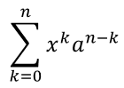

## **Áttekintés**

PowerPoint egyenleteket az Office Math Markup Language (OMML) formátumban tárolja. Az Aspose.Slides for Python via Java segítségével programozottan hozhat létre ugyanolyan típusú matematikai tartalmakat: törtöket, gyököket, függvényeket, határokat, N‑árnyalatos operátorokat, mátrixokat, tömböket és formázott matematikai blokkokat.

PowerPoint-ban a felhasználók általában a **Insert > Equation** menüből adnak hozzá egyenleteket:


Az eredmény egy szerkeszthető matematikai szöveg a dián:


Az Aspose.Slides három fő objektum segítségével építi fel ezt a matematikai szöveget:

- A matematikai alakzat, amelyet a [addMathShape](https://reference.aspose.com/slides/hu/python-java/aspose.slides/shapecollection/#addMathShape) hoz létre, az az alakzat, amely a képletet tartalmazza.
- [MathPortion](https://reference.aspose.com/slides/hu/python-java/aspose.slides/mathportion/) a matematikai tartalmat tárolja az alakzat szövegkeretén belül.
- [MathParagraph](https://reference.aspose.com/slides/hu/python-java/aspose.slides/mathparagraph/) egy vagy több [MathBlock](https://reference.aspose.com/slides/hu/python-java/aspose.slides/mathblock/) objektumot tartalmaz.

Az alábbi legtöbb példa a [MathematicalText](https://reference.aspose.com/slides/hu/python-java/aspose.slides/mathematicaltext/) és a [MathElementBase](https://reference.aspose.com/slides/hu/python-java/aspose.slides/mathelementbase/) folyékony metódusait használja a kód rövid és olvasható tartásához.

MathML export esetén lásd a [Export Math Equations from Presentations in Python](/slides/hu/python-java/exporting-math-equations/).

## **Egyenlet létrehozása**

Ez a példa egy matematikai alakzatot hoz létre, és hozzáadja a Pitagorasz‑tételt:


```python
import jpype
import asposeslides

if not jpype.isJVMStarted():
    jpype.startJVM()

from asposeslides.api import MathematicalText, Presentation, SaveFormat

presentation = Presentation()
try:
    slide = presentation.getSlides().get_Item(0)

    math_shape = slide.getShapes().addMathShape(20, 20, 700, 120)
    math_paragraph = math_shape.getTextFrame().getParagraphs().get_Item(0).getPortions().get_Item(0).getMathParagraph()

    a_squared = MathematicalText("a").setSuperscript("2")
    b_squared = MathematicalText("b").setSuperscript("2")
    equation = MathematicalText("c").setSuperscript("2").join("=").join(a_squared).join("+").join(b_squared)

    math_paragraph.add(equation)

    presentation.save("pythagorean-theorem.pptx", SaveFormat.Pptx)
finally:
    presentation.dispose()
```

{}
[addMathShape](https://reference.aspose.com/slides/hu/python-java/aspose.slides/shapecollection/#addMathShape) egy olyan alakzatot hoz létre, amely már tartalmaz egy matematikai bekezdést. Hozzáfér az első [MathPortion](https://reference.aspose.com/slides/hu/python-java/aspose.slides/mathportion/), lekéri annak [MathParagraph](https://reference.aspose.com/slides/hu/python-java/aspose.slides/mathparagraph/)-ját, és hozzáadja a matematikai blokkokat vagy elemeket.
{}

## **Törtek hozzáadása**

A [divide](https://reference.aspose.com/slides/hu/python-java/aspose.slides/mathelementbase/#divide) használatával hozhat létre törtet. A tört stílusát a [MathFractionTypes](https://reference.aspose.com/slides/hu/python-java/aspose.slides/mathfractiontypes/) segítségével választhatja ki.


```python
import jpype
import asposeslides

if not jpype.isJVMStarted():
    jpype.startJVM()

from asposeslides.api import MathBlock, MathFractionTypes, MathematicalText, Presentation, SaveFormat

presentation = Presentation()
try:
    slide = presentation.getSlides().get_Item(0)

    math_shape = slide.getShapes().addMathShape(20, 20, 700, 100)
    math_paragraph = math_shape.getTextFrame().getParagraphs().get_Item(0).getPortions().get_Item(0).getMathParagraph()

    fraction = MathematicalText("1").divide("x", MathFractionTypes.Skewed)

    math_block = MathBlock(fraction)
    math_paragraph.add(math_block)

    presentation.save("fraction.pptx", SaveFormat.Pptx)
finally:
    presentation.dispose()
```

Halmozott tört esetén használja a [MathFractionTypes.Bar](https://reference.aspose.com/slides/hu/python-java/aspose.slides/mathfractiontypes/#Bar) elemet:

```python
import jpype
import asposeslides

if not jpype.isJVMStarted():
    jpype.startJVM()

from asposeslides.api import MathFractionTypes, MathematicalText

stacked_fraction = MathematicalText("x + 1").divide("y - 1", MathFractionTypes.Bar)
```

## **Gyökök hozzáadása**

A [radical](https://reference.aspose.com/slides/hu/python-java/aspose.slides/mathelementbase/#radical) használatával hozhat létre négyzetgyököt, köbgyököt vagy más gyököt. Az aktuális elem lesz az alap, az argumentum pedig a fok.


```python
import jpype
import asposeslides

if not jpype.isJVMStarted():
    jpype.startJVM()

from asposeslides.api import MathBlock, MathematicalText, Presentation, SaveFormat

presentation = Presentation()
try:
    slide = presentation.getSlides().get_Item(0)

    math_shape = slide.getShapes().addMathShape(20, 20, 700, 100)
    math_paragraph = math_shape.getTextFrame().getParagraphs().get_Item(0).getPortions().get_Item(0).getMathParagraph()

    radical = MathematicalText("x").radical("n")

    math_block = MathBlock(radical)
    math_paragraph.add(math_block)

    presentation.save("radical.pptx", SaveFormat.Pptx)
finally:
    presentation.dispose()
```

## **Függvények és határok hozzáadása**

Használja az [asArgumentOfFunction](https://reference.aspose.com/slides/hu/python-java/aspose.slides/mathelementbase/#asArgumentOfFunction) vagy a [function](https://reference.aspose.com/slides/hu/python-java/aspose.slides/mathelementbase/#function) metódust olyan függvényekhez, mint a `sin(x)`, `log(x)` vagy egyedi függvénynevek. Határokhoz helyezze a `lim`‑et egy [MathLimit](https://reference.aspose.com/slides/hu/python-java/aspose.slides/mathlimit/)-ba, vagy használja a [setLowerLimit](https://reference.aspose.com/slides/hu/python-java/aspose.slides/mathelementbase/#setLowerLimit)‑t.


```python
import jpype
import asposeslides

if not jpype.isJVMStarted():
    jpype.startJVM()

from asposeslides.api import MathBlock, MathematicalText, Presentation, SaveFormat

presentation = Presentation()
try:
    slide = presentation.getSlides().get_Item(0)

    math_shape = slide.getShapes().addMathShape(20, 20, 700, 100)
    math_paragraph = math_shape.getTextFrame().getParagraphs().get_Item(0).getPortions().get_Item(0).getMathParagraph()

    limit = MathematicalText("lim").setLowerLimit("x\u2192\u221E").function("x")

    math_block = MathBlock(limit)
    math_paragraph.add(math_block)

    presentation.save("functions-and-limits.pptx", SaveFormat.Pptx)
finally:
    presentation.dispose()
```

Egyedi függvény név esetén tegye a függvény nevet az aktuális elemként:

```python
import jpype
import asposeslides

if not jpype.isJVMStarted():
    jpype.startJVM()

from asposeslides.api import MathematicalText

custom_function = MathematicalText("f").function("x + 1")
```

## **N-árnyalatos operátorok és integrálok hozzáadása**

A [nary](https://reference.aspose.com/slides/hu/python-java/aspose.slides/mathelementbase/#nary) használható összegekre, uniókra, metszetekre és egyéb nagy operátorokra. Az [integral](https://reference.aspose.com/slides/hu/python-java/aspose.slides/mathelementbase/#integral) használható integrálokra. Mindkét metódus lehetővé teszi az alsó és felső határ megadását.



```python
import jpype
import asposeslides

if not jpype.isJVMStarted():
    jpype.startJVM()

from asposeslides.api import MathBlock, MathNaryOperatorTypes, MathematicalText, Presentation, SaveFormat

presentation = Presentation()
try:
    slide = presentation.getSlides().get_Item(0)

    math_shape = slide.getShapes().addMathShape(20, 20, 700, 120)
    math_paragraph = math_shape.getTextFrame().getParagraphs().get_Item(0).getPortions().get_Item(0).getMathParagraph()

    a_power = MathematicalText("a").setSuperscript("n-k")
    summation_base = MathematicalText("x").setSuperscript("k").join(a_power)

    summation = summation_base.nary(MathNaryOperatorTypes.Summation, "k=0", "n")

    math_block = MathBlock(summation)
    math_paragraph.add(math_block)

    presentation.save("nary-operators.pptx", SaveFormat.Pptx)
finally:
    presentation.dispose()
```

Az N‑árnyalatos operátorok nagy operátorok, opcionális határokkal. Egyszerű operátorok, mint a `+`, `-`, és `=` általában a [MathematicalText](https://reference.aspose.com/slides/hu/python-java/aspose.slides/mathematicaltext/) segítségével kerülnek a kifejezésbe.

Integrál esetén használja a [integral](https://reference.aspose.com/slides/hu/python-java/aspose.slides/mathelementbase/#integral) metódust:

```python
import jpype
import asposeslides

if not jpype.isJVMStarted():
    jpype.startJVM()

from asposeslides.api import MathIntegralTypes, MathematicalText

differential = MathematicalText("dx").toBox()
integral_base = MathematicalText("x").join(differential)
integral = integral_base.integral(MathIntegralTypes.Simple, "0", "1")
```

## **Mátrixok hozzáadása**

Használja a [MathMatrix](https://reference.aspose.com/slides/hu/python-java/aspose.slides/mathmatrix/)‑t sorok és oszlopok létrehozásához. A mátrixok alapértelmezés szerint nem tartalmaznak zárójeleket, ezért zárójelezze a mátrixot, ha szükséges (zárójel, szögletes vagy kapcsos).


```python
import jpype
import asposeslides

if not jpype.isJVMStarted():
    jpype.startJVM()

from asposeslides.api import MathBlock, MathMatrix, MathematicalText, Presentation, SaveFormat

presentation = Presentation()
try:
    slide = presentation.getSlides().get_Item(0)

    math_shape = slide.getShapes().addMathShape(20, 20, 700, 120)
    math_paragraph = math_shape.getTextFrame().getParagraphs().get_Item(0).getPortions().get_Item(0).getMathParagraph()

    matrix = MathMatrix(2, 3)
    cell_0_0 = MathematicalText("1")
    matrix.set_Item(0, 0, cell_0_0)
    cell_0_1 = MathematicalText("x")
    matrix.set_Item(0, 1, cell_0_1)
    cell_1_0 = MathematicalText("x")
    matrix.set_Item(1, 0, cell_1_0)
    cell_1_1 = MathematicalText("2")
    matrix.set_Item(1, 1, cell_1_1)
    cell_1_2 = MathematicalText("y")
    matrix.set_Item(1, 2, cell_1_2)

    math_block = MathBlock(matrix)
    math_paragraph.add(math_block)

    presentation.save("matrix.pptx", SaveFormat.Pptx)
finally:
    presentation.dispose()
```

## **Egyenlet tömbök hozzáadása**

Használja a [toMathArray](https://reference.aspose.com/slides/hu/python-java/aspose.slides/mathelementbase/#toMathArray)‑t, ha igazított egyenletekre vagy függőleges kifejezés‑csoportokra van szükség.


```python
import jpype
import asposeslides

if not jpype.isJVMStarted():
    jpype.startJVM()

from asposeslides.api import MathBlock, MathematicalText, Presentation, SaveFormat

presentation = Presentation()
try:
    slide = presentation.getSlides().get_Item(0)

    math_shape = slide.getShapes().addMathShape(20, 20, 700, 140)
    math_paragraph = math_shape.getTextFrame().getParagraphs().get_Item(0).getPortions().get_Item(0).getMathParagraph()

    equation_array = MathematicalText("x").join("y").toMathArray()

    math_block = MathBlock(equation_array)
    math_paragraph.add(math_block)

    presentation.save("equation-array.pptx", SaveFormat.Pptx)
finally:
    presentation.dispose()
```

## **Trigonometrikus függvények hozzáadása**

Használja az [asArgumentOfFunction](https://reference.aspose.com/slides/hu/python-java/aspose.slides/mathelementbase/#asArgumentOfFunction)‑t, amikor az argumentum az aktuális elem, és a függvény neve ismert.


```python
import jpype
import asposeslides

if not jpype.isJVMStarted():
    jpype.startJVM()

from asposeslides.api import MathBlock, MathFunctionsOfOneArgument, MathematicalText, Presentation, SaveFormat

presentation = Presentation()
try:
    slide = presentation.getSlides().get_Item(0)

    math_shape = slide.getShapes().addMathShape(20, 20, 700, 100)
    math_paragraph = math_shape.getTextFrame().getParagraphs().get_Item(0).getPortions().get_Item(0).getMathParagraph()

    cosine = MathematicalText("2x").asArgumentOfFunction(MathFunctionsOfOneArgument.Cos)

    math_block = MathBlock(cosine)
    math_paragraph.add(math_block)

    presentation.save("trigonometric-function.pptx", SaveFormat.Pptx)
finally:
    presentation.dispose()
```

## **Alsó és felső indexek hozzáadása**

Használja az alsó‑ és felső‑index segédfüggvényeket indexek és hatványok létrehozásához. Ha az indexeknek a bázis bal oldalán kell megjelenniük, használja a [setSubSuperscriptOnTheLeft](https://reference.aspose.com/slides/hu/python-java/aspose.slides/mathelementbase/#setSubSuperscriptOnTheLeft)‑t.


```python
import jpype
import asposeslides

if not jpype.isJVMStarted():
    jpype.startJVM()

from asposeslides.api import MathBlock, MathematicalText, Presentation, SaveFormat

presentation = Presentation()
try:
    slide = presentation.getSlides().get_Item(0)

    math_shape = slide.getShapes().addMathShape(20, 20, 700, 100)
    math_paragraph = math_shape.getTextFrame().getParagraphs().get_Item(0).getPortions().get_Item(0).getMathParagraph()

    scripts = MathematicalText("Y").setSubSuperscriptOnTheLeft("1", "n")

    math_block = MathBlock(scripts)
    math_paragraph.add(math_block)

    presentation.save("subscript-superscript.pptx", SaveFormat.Pptx)
finally:
    presentation.dispose()
```

## **Elválasztók hozzáadása**

Használja az [enclose](https://reference.aspose.com/slides/hu/python-java/aspose.slides/mathelementbase/#enclose)‑t, hogy egy kifejezést elválasztók közé helyezzen. Több elemet tartalmazó kifejezésekhez beállíthat elválasztó karaktert is.


```python
import jpype
import asposeslides

if not jpype.isJVMStarted():
    jpype.startJVM()

from asposeslides.api import MathBlock, MathematicalText, Presentation, SaveFormat

presentation = Presentation()
try:
    slide = presentation.getSlides().get_Item(0)

    math_shape = slide.getShapes().addMathShape(20, 20, 700, 100)
    math_paragraph = math_shape.getTextFrame().getParagraphs().get_Item(0).getPortions().get_Item(0).getMathParagraph()

    delimiter = MathematicalText("x").join("y").join("z").enclose('<', '>')
    delimiter.setSeparatorCharacter('|')

    math_block = MathBlock(delimiter)
    math_paragraph.add(math_block)

    presentation.save("delimiters.pptx", SaveFormat.Pptx)
finally:
    presentation.dispose()
```

## **Keretes doboz hozzáadása**

Használja a [toBorderBox](https://reference.aspose.com/slides/hu/python-java/aspose.slides/mathelementbase/#toBorderBox)‑t, ha magát az egyenletet keretbe szeretné tenni.


```python
import jpype
import asposeslides

if not jpype.isJVMStarted():
    jpype.startJVM()

from asposeslides.api import MathBlock, MathematicalText, Presentation, SaveFormat

presentation = Presentation()
try:
    slide = presentation.getSlides().get_Item(0)

    math_shape = slide.getShapes().addMathShape(20, 20, 700, 100)
    math_paragraph = math_shape.getTextFrame().getParagraphs().get_Item(0).getPortions().get_Item(0).getMathParagraph()

    b_squared = MathematicalText("b").setSuperscript("2")
    c_squared = MathematicalText("c").setSuperscript("2")
    boxed_equation = MathematicalText("a").setSuperscript("2").join("=").join(b_squared).join("+").join(c_squared).toBorderBox()

    math_block = MathBlock(boxed_equation)
    math_paragraph.add(math_block)

    presentation.save("border-box.pptx", SaveFormat.Pptx)
finally:
    presentation.dispose()
```

## **Tagok csoportosítása**

Használja a [group](https://reference.aspose.com/slides/hu/python-java/aspose.slides/mathelementbase/#group)‑t, hogy egy csoportosító karaktert tegyen a kifejezés fölé vagy alá. Egy határ hozzáadásával felcímkézheti a csoportosított tagokat.


```python
import jpype
import asposeslides

if not jpype.isJVMStarted():
    jpype.startJVM()

from asposeslides.api import MathBlock, MathTopBotPositions, MathematicalText, Presentation, SaveFormat

presentation = Presentation()
try:
    slide = presentation.getSlides().get_Item(0)

    math_shape = slide.getShapes().addMathShape(20, 20, 700, 120)
    math_paragraph = math_shape.getTextFrame().getParagraphs().get_Item(0).getPortions().get_Item(0).getMathParagraph()

    grouped = MathematicalText("x + y").group('\u23DF', MathTopBotPositions.Bottom, MathTopBotPositions.Top).setLowerLimit("any text")

    math_block = MathBlock(grouped)
    math_paragraph.add(math_block)

    presentation.save("grouped-terms.pptx", SaveFormat.Pptx)
finally:
    presentation.dispose()
```

## **Matematikai elemek formázása**

Formázó segédfüggvényeket csak akkor használjon, ha a képletet egyértelműbbé teszik. Például az [overbar](https://reference.aspose.com/slides/hu/python-java/aspose.slides/mathelementbase/#overbar) egy vonalat helyez a matematikai elem fölé.


```python
import jpype
import asposeslides

if not jpype.isJVMStarted():
    jpype.startJVM()

from asposeslides.api import MathBlock, MathematicalText, Presentation, SaveFormat

presentation = Presentation()
try:
    slide = presentation.getSlides().get_Item(0)

    math_shape = slide.getShapes().addMathShape(20, 20, 700, 100)
    math_paragraph = math_shape.getTextFrame().getParagraphs().get_Item(0).getPortions().get_Item(0).getMathParagraph()

    overbar = MathematicalText("ABC").overbar()

    math_block = MathBlock(overbar)
    math_paragraph.add(math_block)

    presentation.save("overbar.pptx", SaveFormat.Pptx)
finally:
    presentation.dispose()
```

## **Gyors referenciák**

| Feladat | Fő API |
| --- | --- |
| Matematikai szöveg létrehozása | [MathematicalText](https://reference.aspose.com/slides/hu/python-java/aspose.slides/mathematicaltext/) |
| Elemtok egyesítése | [MathElementBase.join](https://reference.aspose.com/slides/hu/python-java/aspose.slides/mathelementbase/#join) |
| Törtek létrehozása | [MathElementBase.divide](https://reference.aspose.com/slides/hu/python-java/aspose.slides/mathelementbase/#divide) |
| Felső vagy alsó index hozzáadása | [setSuperscript](https://reference.aspose.com/slides/hu/python-java/aspose.slides/mathelementbase/#setSuperscript), [setSubscript](https://reference.aspose.com/slides/hu/python-java/aspose.slides/mathelementbase/#setSubscript) |
| Függvények hozzáadása | [function](https://reference.aspose.com/slides/hu/python-java/aspose.slides/mathelementbase/#function), [asArgumentOfFunction](https://reference.aspose.com/slides/hu/python-java/aspose.slides/mathelementbase/#asArgumentOfFunction) |
| Gyökök hozzáadása | [MathElementBase.radical](https://reference.aspose.com/slides/hu/python-java/aspose.slides/mathelementbase/#radical) |
| Határok hozzáadása | [setLowerLimit](https://reference.aspose.com/slides/hu/python-java/aspose.slides/mathelementbase/#setLowerLimit), [setUpperLimit](https://reference.aspose.com/slides/hu/python-java/aspose.slides/mathelementbase/#setUpperLimit) |
| Baloldali indexek hozzáadása | [setSubSuperscriptOnTheLeft](https://reference.aspose.com/slides/hu/python-java/aspose.slides/mathelementbase/#setSubSuperscriptOnTheLeft) |
| Összegzések és integrálok hozzáadása | [nary](https://reference.aspose.com/slides/hu/python-java/aspose.slides/mathelementbase/#nary), [integral](https://reference.aspose.com/slides/hu/python-java/aspose.slides/mathelementbase/#integral) |
| Mátrixok hozzáadása | [MathMatrix](https://reference.aspose.com/slides/hu/python-java/aspose.slides/mathmatrix/) |
| Egyenlet tömbök hozzáadása | [toMathArray](https://reference.aspose.com/slides/hu/python-java/aspose.slides/mathelementbase/#toMathArray) |
| Elválasztók hozzáadása | [enclose](https://reference.aspose.com/slides/hu/python-java/aspose.slides/mathelementbase/#enclose) |
| Vonalak és keretek hozzáadása | [overbar](https://reference.aspose.com/slides/hu/python-java/aspose.slides/mathelementbase/#overbar), [toBorderBox](https://reference.aspose.com/slides/hu/python-java/aspose.slides/mathelementbase/#toBorderBox) |
| Tagok csoportosítása | [group](https://reference.aspose.com/slides/hu/python-java/aspose.slides/mathelementbase/#group) |

## **GYIK**

**Szerkeszthetek meglévő PowerPoint egyenletet?**

Igen. Nyissa meg a prezentációt, keresse meg azt az alakzatot, amely egy [MathPortion](https://reference.aspose.com/slides/hu/python-java/aspose.slides/mathportion/)‑t tartalmaz, szerezze meg a [MathParagraph](https://reference.aspose.com/slides/hu/python-java/aspose.slides/mathparagraph/)-ját, és frissítse a benne lévő matematikai blokkokat.

**Az egyenletek szerkeszthető PowerPoint matematikaként kerülnek mentésre?**

Igen. PPTX mentésekor az Aspose.Slides az egyenletet szerkeszthető Office‑math tartalomként írja.

**Exportálhatom az egyenleteket LaTeX‑be?**

Igen. Szerezze meg az egyenlet [MathParagraph](https://reference.aspose.com/slides/hu/python-java/aspose.slides/mathparagraph/)‑ját a [MathPortion](https://reference.aspose.com/slides/hu/python-java/aspose.slides/mathportion/)-ból, és hívja meg a [MathParagraph.toLatex](https://reference.aspose.com/slides/hu/python-java/aspose.slides/mathparagraph/#toLatex)‑t a közvetlen exportáláshoz. Teljes példáért lásd a [Export Math Equations from Presentations in Python](/slides/hu/python-java/exporting-math-equations/#export-math-equations-to-latex).