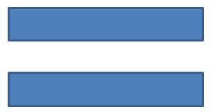

## **Áttekintés**

Ez a cikk bemutatja, hogyan lehet testreszabni a prezentációs alakzatokat az Aspose.Slides-ban a forma geometria szerkesztésével szerkesztési pontok és geometriai útvonalak segítségével. Megmutatja, hogyan kell használni a [GeometryPath](https://reference.aspose.com/slides/hu/python-java/aspose.slides/geometrypath/) osztályt a meglévő alakzatok módosításához, alapvető útvonal-szerkesztési műveletek végrehajtásához, pontok hozzáadásához vagy eltávolításához, és a frissített geometria alkalmazásához egy alakzatra.

Emellett bemutatja, hogyan lehet egyedi és összetett alakzatokat létrehozni, ívelt sarkokkal rendelkező alakzatokat felépíteni, meghatározni, hogy egy alakzat geometria zárt‑e, valamint átalakítani a [GeometryPath](https://reference.aspose.com/slides/hu/python-java/aspose.slides/geometrypath/) és a [java.awt.Shape](https://docs.oracle.com/javase/7/docs/api/java/awt/Shape.html) között további geometriai testreszabási forgatókönyvekhez.

## **Alakzat módosítása szerkesztési pontokkal**

Vegyünk egy négyzetet. A PowerPointban a **szerkesztési pontok** segítségével:

* a négyzet sarkát befelé vagy kifelé mozgathatja
* megadhatja egy sarok vagy pont görbületét
* új pontokat adhat a négyzethez
* manipulálhatja a négyzet pontjait, stb.

Alapvetően a leírt feladatokat bármely alakzatra elvégezheti. A szerkesztési pontokkal módosíthat egy alakzatot, vagy egy új alakzatot hozhat létre egy meglévőből.

## **Alakzat‑szerkesztési tippek**


Mielőtt elkezdené a PowerPoint alakzatok szerkesztését szerkesztési pontokkal, vegye figyelembe a következőket az alakzatokkal kapcsolatban:

* Egy alakzat (vagy annak útvonala) lehet zárt vagy nyitott.
* Zárt alakzatnál nincs kezdő‑ vagy végpontja. Nyílt alakzat esetén van eleje és vége.
* Minden alakzat legalább 2 horgonypontból áll, amelyeket vonalak kötnek össze.
* Egy vonal lehet egyenes vagy íves. A horgonypontok határozzák meg a vonal jellegét.
* A horgonypontok lehetnek sarokpontok, egyenes pontok vagy sima pontok:
  * Egy sarokpont az a pont, ahol 2 egyenes vonal találkozik szöggel.
  * Egy sima pont az a pont, ahol 2 fogantyú egy egyenes vonalban helyezkedik el, és a vonal szegmensek egy sima ívben csatlakoznak. Ebben az esetben minden fogantyú egyenlő távolságra van a horgonyponttól.
  * Egy egyenes pont az a pont, ahol 2 fogantyú egy egyenes vonalban helyezkedik el, és a vonal szegmensek egy ívben csatlakoznak. Ebben az esetben a fogantyúknek nem kell egyenlő távolságra lenniük a horgonyponttól.
* A horgonypontok mozgatásával vagy szerkesztésével (amely a vonalak szögét változtatja) megváltoztathatja az alakzat kinézetét.

A PowerPoint alakzatok szerkesztéséhez **Aspose.Slides** biztosítja a [GeometryPath](https://reference.aspose.com/slides/hu/python-java/aspose.slides/geometrypath/) osztályt.

* Egy [GeometryPath](https://reference.aspose.com/slides/hu/python-java/aspose.slides/geometrypath/) példány a [GeometryShape](https://reference.aspose.com/slides/hu/python-java/aspose.slides/geometryshape/) objektum geometriai útvonalát képviseli.
* A [GeometryPath](https://reference.aspose.com/slides/hu/python-java/aspose.slides/geometrypath/) lekéréséhez a [GeometryShape](https://reference.aspose.com/slides/hu/python-java/aspose.slides/geometryshape/) példányból használja a [GeometryShape.getGeometryPaths](https://reference.aspose.com/slides/hu/python-java/aspose.slides/geometryshape/#getGeometryPaths) metódust.
* Egy alakzat [GeometryPath](https://reference.aspose.com/slides/hu/python-java/aspose.slides/geometrypath/) beállításához használja a következő metódusokat: [GeometryShape.setGeometryPath](https://reference.aspose.com/slides/hu/python-java/aspose.slides/geometryshape/#setGeometryPath) *egyszerű alakzatok* esetén és [GeometryShape.setGeometryPaths](https://reference.aspose.com/slides/hu/python-java/aspose.slides/geometryshape/#setGeometryPaths) *összetett alakzatok* esetén.
* Szegmensek hozzáadásához használja a [GeometryPath](https://reference.aspose.com/slides/hu/python-java/aspose.slides/geometrypath/) alatti metódusokat.
* A [GeometryPath.setStroke](https://reference.aspose.com/slides/hu/python-java/aspose.slides/geometrypath/#setStroke) és a [GeometryPath.setFillMode](https://reference.aspose.com/slides/hu/python-java/aspose.slides/geometrypath/#setFillMode) metódusokkal beállíthatja a geometriai útvonal megjelenését.
* A [GeometryPath.getPathData](https://reference.aspose.com/slides/hu/python-java/aspose.slides/geometrypath/#getPathData) metódussal lekérheti egy [GeometryShape](https://reference.aspose.com/slides/hu/python-java/aspose.slides/geometryshape/) geometriai útvonalát útvonal‑szegmensek tömbjeként.
* További alakzatgeometria testreszabási lehetőségekhez átalakíthatja a [GeometryPath](https://reference.aspose.com/slides/hu/python-java/aspose.slides/geometrypath/)‑t [java.awt.Shape](https://docs.oracle.com/javase/7/docs/api/java/awt/Shape.html)-ra.
* Használja a [geometryPathToGraphicsPath](https://reference.aspose.com/slides/hu/python-java/aspose.slides/shapeutil/) és a [graphicsPathToGeometryPath](https://reference.aspose.com/slides/hu/python-java/aspose.slides/shapeutil/) metódusokat (a [ShapeUtil](https://reference.aspose.com/slides/hu/python-java/aspose.slides/shapeutil/) osztályból) a [GeometryPath](https://reference.aspose.com/slides/hu/python-java/aspose.slides/geometrypath/) és a [java.awt.Shape](https://docs.oracle.com/javase/7/docs/api/java/awt/Shape.html) közötti átalakításhoz mindkét irányban.

## **Egyszerű szerkesztési műveletek**

Az alábbi aláírások mutatják az alapvető szerkesztési műveleteket:

**Vonal hozzáadása** az útvonal végéhez:

- `geometry_path.lineTo(point)`
- `geometry_path.lineTo(x, y)`

**Vonal hozzáadása** egy megadott pozícióhoz az útvonalon:

- `geometry_path.lineTo(point, index)`
- `geometry_path.lineTo(x, y, index)`

**Köbös Bézier‑görbe hozzáadása** az útvonal végéhez:

- `geometry_path.cubicBezierTo(point1, point2, point3)`
- `geometry_path.cubicBezierTo(x1, y1, x2, y2, x3, y3)`

**Köbös Bézier‑görbe hozzáadása** egy megadott pozícióhoz az útvonalon:

- `geometry_path.cubicBezierTo(point1, point2, point3, index)`
- `geometry_path.cubicBezierTo(x1, y1, x2, y2, x3, y3, index)`

**Kvadratikus Bézier‑görbe hozzáadása** az útvonal végéhez:

- `geometry_path.quadraticBezierTo(point1, point2)`
- `geometry_path.quadraticBezierTo(x1, y1, x2, y2)`

**Kvadratikus Bézier‑görbe hozzáadása** egy megadott pozícióhoz az útvonalon:

- `geometry_path.quadraticBezierTo(point1, point2, index)`
- `geometry_path.quadraticBezierTo(x1, y1, x2, y2, index)`

**Megadott ív hozzáfűzése** az útvonalhoz:

- `geometry_path.arcTo(width, height, start_angle, sweep_angle)`

**Az aktuális alakzat bezárása** az útvonalon:

- `geometry_path.closeFigure()`

**A következő pont pozíciójának beállítása**:

- `geometry_path.moveTo(point)`
- `geometry_path.moveTo(x, y)`

**Útvonal‑szegmens eltávolítása** egy adott indexnél:

- `geometry_path.removeAt(index)`

## **Egyedi pontok hozzáadása egy alakzathoz**
1. Hozzon létre egy [GeometryShape](https://reference.aspose.com/slides/hu/python-java/aspose.slides/geometryshape/) példányt, és állítsa be a [ShapeType.Rectangle](https://reference.aspose.com/slides/hu/python-java/aspose.slides/shapetype/#Rectangle) típust.
2. Szerezze be a [GeometryPath](https://reference.aspose.com/slides/hu/python-java/aspose.slides/geometrypath/) példányt az alakzatról.
3. Adjon egy új pontot a két felső pont közé az útvonalban.
4. Adjon egy új pontot a két alsó pont közé az útvonalban.
5. Alkalmazza az útvonalat az alakzatra.

Ez a Python kód megmutatja, hogyan adhat egyedi pontokat egy alakzathoz:

```python
import jpype
import asposeslides

if not jpype.isJVMStarted():
    jpype.startJVM()

from asposeslides.api import Presentation, ShapeType

presentation = Presentation()
try:
    shape = presentation.getSlides().get_Item(0).getShapes().addAutoShape(ShapeType.Rectangle, 100, 100, 200, 100)
    geometry_path = shape.getGeometryPaths()[0]
    geometry_path.lineTo(100, 50, 1)
    geometry_path.lineTo(100, 50, 4)
    shape.setGeometryPath(geometry_path)
finally:
    presentation.dispose()
```


## **Pontok eltávolítása egy alakzatból**

1. Hozzon létre egy [GeometryShape](https://reference.aspose.com/slides/hu/python-java/aspose.slides/geometryshape/) példányt, és állítsa be a [ShapeType.Heart](https://reference.aspose.com/slides/hu/python-java/aspose.slides/shapetype/#Heart) típust. 
2. Szerezze be a [GeometryPath](https://reference.aspose.com/slides/hu/python-java/aspose.slides/geometrypath/) példányt az alakzatról.
3. Távolítsa el az útvonal szegmensét.
4. Alkalmazza az útvonalat az alakzatra.

Ez a Python kód megmutatja, hogyan távolíthat el pontokat egy alakzatról:

```python
import jpype
import asposeslides

if not jpype.isJVMStarted():
    jpype.startJVM()

from asposeslides.api import Presentation, ShapeType

presentation = Presentation()
try:
    shape = presentation.getSlides().get_Item(0).getShapes().addAutoShape(ShapeType.Heart, 100, 100, 300, 300)
    geometry_path = shape.getGeometryPaths()[0]
    geometry_path.removeAt(2)
    shape.setGeometryPath(geometry_path)
finally:
    presentation.dispose()
```


## **Egyedi alakzat létrehozása**

1. Számolja ki az alakzat pontjait.
2. Hozzon létre egy [GeometryPath](https://reference.aspose.com/slides/hu/python-java/aspose.slides/geometrypath/) példányt. 
3. Töltse fel az útvonalat a pontokkal.
4. Hozzon létre egy [GeometryShape](https://reference.aspose.com/slides/hu/python-java/aspose.slides/geometryshape/) példányt. 
5. Alkalmazza az útvonalat az alakzatra.

Ez a Python kód megmutatja, hogyan hozhat létre egyedi alakzatot:

```python
import jpype
import asposeslides

if not jpype.isJVMStarted():
    jpype.startJVM()

from asposeslides.api import Presentation, ShapeType, GeometryPath

import math

points = []
outer_radius = 100
inner_radius = 50
step = 72

for angle in range(-90, 270, step):
    radians = math.radians(angle)
    x = outer_radius * math.cos(radians)
    y = outer_radius * math.sin(radians)
    points.append((x + outer_radius, y + outer_radius))

    radians = math.radians(angle + step / 2)
    x = inner_radius * math.cos(radians)
    y = inner_radius * math.sin(radians)
    points.append((x + outer_radius, y + outer_radius))

star_path = GeometryPath()
star_path.moveTo(*points[0])
for point in points[1:]:
    star_path.lineTo(*point)
star_path.closeFigure()

presentation = Presentation()
try:
    shape = presentation.getSlides().get_Item(0).getShapes().addAutoShape(ShapeType.Rectangle, 100, 100, outer_radius * 2, outer_radius * 2)
    shape.setGeometryPath(star_path)
finally:
    presentation.dispose()
```


## **Összetett egyedi alakzat létrehozása**

1. Hozzon létre egy [GeometryShape](https://reference.aspose.com/slides/hu/python-java/aspose.slides/geometryshape/) példányt.
2. Hozzon létre egy első [GeometryPath](https://reference.aspose.com/slides/hu/python-java/aspose.slides/geometrypath/) példányt.
3. Hozzon létre egy második [GeometryPath](https://reference.aspose.com/slides/hu/python-java/aspose.slides/geometrypath/) példányt.
4. Alkalmazza a útvonalakat az alakzatra.

Ez a Python kód megmutatja, hogyan hozhat létre egy összetett egyedi alakzatot:

```python
import jpype
import asposeslides

if not jpype.isJVMStarted():
    jpype.startJVM()

from asposeslides.api import Presentation, ShapeType, GeometryPath

presentation = Presentation()
try:
    shape = presentation.getSlides().get_Item(0).getShapes().addAutoShape(ShapeType.Rectangle, 100, 100, 200, 100)

    top_path = GeometryPath()
    top_path.moveTo(0, 0)
    top_path.lineTo(shape.getWidth(), 0)
    top_path.lineTo(shape.getWidth(), shape.getHeight() / 3)
    top_path.lineTo(0, shape.getHeight() / 3)
    top_path.closeFigure()

    bottom_path = GeometryPath()
    bottom_path.moveTo(0, shape.getHeight() / 3 * 2)
    bottom_path.lineTo(shape.getWidth(), shape.getHeight() / 3 * 2)
    bottom_path.lineTo(shape.getWidth(), shape.getHeight())
    bottom_path.lineTo(0, shape.getHeight())
    bottom_path.closeFigure()

    shape.setGeometryPaths([top_path, bottom_path])
finally:
    presentation.dispose()
```


## **Egyedi alakzat létrehozása ívelt sarkokkal**

Ez a Python kód megmutatja, hogyan hozhat létre egyedi alakzatot ívelt (befelé görbült) sarkokkal:

```python
import jpype
import asposeslides

if not jpype.isJVMStarted():
    jpype.startJVM()

from asposeslides.api import Presentation, ShapeType, GeometryPath, SaveFormat

shape_x = 20
shape_y = 20
shape_width = 300
shape_height = 200

left_top_size = 50
right_top_size = 20
right_bottom_size = 40
left_bottom_size = 10

presentation = Presentation()
try:
    shape = presentation.getSlides().get_Item(0).getShapes().addAutoShape(ShapeType.Custom, shape_x, shape_y, shape_width, shape_height)
    geometry_path = GeometryPath()
    geometry_path.moveTo(left_top_size, 0)
    geometry_path.lineTo(shape_width - right_top_size, 0)
    geometry_path.arcTo(right_top_size, right_top_size, 180, -90)
    geometry_path.lineTo(shape_width, shape_height - right_bottom_size)
    geometry_path.arcTo(right_bottom_size, right_bottom_size, -90, -90)
    geometry_path.lineTo(left_bottom_size, shape_height)
    geometry_path.arcTo(left_bottom_size, left_bottom_size, 0, -90)
    geometry_path.lineTo(0, left_top_size)
    geometry_path.arcTo(left_top_size, left_top_size, 90, -90)
    geometry_path.closeFigure()
    shape.setGeometryPath(geometry_path)
    presentation.save("output.pptx", SaveFormat.Pptx)
finally:
    presentation.dispose()
```

## **Annak ellenőrzése, hogy egy alakzat geometria zárt‑e**

A zárt alakzatot úgy határozzuk meg, hogy minden oldal összeköttetésben van, egyetlen szegélyt alkotva hézagok nélkül. Egy ilyen alakzat lehet egyszerű geometriai forma vagy összetett egyedi körvonal. Az alábbi kódrészlet bemutatja, hogyan ellenőrizheti, hogy egy alakzat geometria zárt‑e:

```python
import jpype
import asposeslides

if not jpype.isJVMStarted():
    jpype.startJVM()

from asposeslides.api import PathCommandType

def is_geometry_closed(geometry_shape):
    is_closed = False
    for geometry_path in geometry_shape.getGeometryPaths():
        path_data = geometry_path.getPathData()
        if len(path_data) == 0:
            continue
        last_segment = path_data[-1]
        is_closed = last_segment.getPathCommand() == PathCommandType.Close
        if not is_closed:
            return False
    return is_closed
```

## **GeometryPath átalakítása java.awt.Shape‑ra** 

1. Hozzon létre egy [GeometryShape](https://reference.aspose.com/slides/hu/python-java/aspose.slides/geometryshape/) példányt.
2. Hozzon létre egy [java.awt.Shape](https://docs.oracle.com/javase/7/docs/api/java/awt/Shape.html) példányt.
3. Konvertálja a [java.awt.Shape](https://docs.oracle.com/javase/7/docs/api/java/awt/Shape.html) példányt a [GeometryPath](https://reference.aspose.com/slides/hu/python-java/aspose.slides/geometrypath/) példányra, a [PathIterator](https://docs.oracle.com/javase/8/docs/api/java/awt/geom/PathIterator.html) bejárásával és minden szegmens újbóli lejátszásával.
4. Alkalmazza az útvonalakat az alakzatra.

Ez a Python kód valósítja meg a fenti lépéseket a grafikusi útvonal geometry‑ra való átalakításához:

```python
import jpype
import asposeslides

if not jpype.isJVMStarted():
    jpime.startJVM()

from asposeslides.api import Presentation, ShapeType, GeometryPath, PathFillModeType

from java.awt import Font
from java.awt.geom import PathIterator
from java.awt.image import BufferedImage

presentation = Presentation()
try:
    # Új alakzat létrehozása.
    shape = presentation.getSlides().get_Item(0).getShapes().addAutoShape(ShapeType.Rectangle, 100, 100, 300, 100)

    # Az alakzat geometriai útvonalának lekérése.
    original_path = shape.getGeometryPaths()[0]
    original_path.setFillMode(PathFillModeType.None_)

    # Új grafikus útvonal létrehozása szöveggel.
    font = Font("Arial", Font.PLAIN, 40)
    text = "Text in shape"
    image = BufferedImage(100, 100, BufferedImage.TYPE_INT_ARGB)
    graphics = image.createGraphics()
    try:
        glyph_vector = font.createGlyphVector(graphics.getFontRenderContext(), text)
        graphics_path = glyph_vector.getOutline(20.0, -glyph_vector.getVisualBounds().getY() + 10)
    finally:
        graphics.dispose()

    # A grafikus útvonal átalakítása geometriai útvonallá.
    text_path = GeometryPath()
    path_iterator = graphics_path.getPathIterator(None)
    points = jpype.JArray(jpype.JFloat)(6)
    while not path_iterator.isDone():
        segment_type = path_iterator.currentSegment(points)
        if segment_type == PathIterator.SEG_MOVETO:
            text_path.moveTo(points[0], points[1])
        elif segment_type == PathIterator.SEG_LINETO:
            text_path.lineTo(points[0], points[1])
        elif segment_type == PathIterator.SEG_QUADTO:
            text_path.quadraticBezierTo(points[0], points[1], points[2], points[3])
        elif segment_type == PathIterator.SEG_CUBICTO:
            text_path.cubicBezierTo(points[0], points[1], points[2], points[3], points[4], points[5])
        elif segment_type == PathIterator.SEG_CLOSE:
            text_path.closeFigure()
        path_iterator.next()
    text_path.setFillMode(PathFillModeType.Normal)

    # A szöveg útvonal alkalmazása az eredeti geometriai útvonallal együtt.
    shape.setGeometryPaths([original_path, text_path])
finally:
    presentation.dispose()
```


## **GYIK**

**Mi történik a kitöltéssel és a körvonallal a geometria cseréje után?**

A stílus megmarad az alakzaton; csak a kontúr változik. A kitöltés és a körvonal automatikusan alkalmazásra kerül az új geometriára.

**Hogyan forgathatom helyesen egy egyedi alakzatot a geometriájával együtt?**

Használja az alakzat [setRotation](https://reference.aspose.com/slides/hu/python-java/aspose.slides/shape/#setRotation) metódusát; a geometria az alakzattal együtt forog, mert az az alakzat saját koordináta‑rendszeréhez van kötve.

**Átalakíthatom-e egy egyedi alakzatot képpé, hogy „lezároljam” az eredményt?**

Igen. Exportálja a kívánt [slide](/slides/hu/python-java/convert-powerpoint-to-png/) területet vagy a [shape](/slides/hu/python-java/create-shape-thumbnails/) maga képformátumba; ez leegyszerűsíti a nehéz geometriai elemekkel való további munkát.