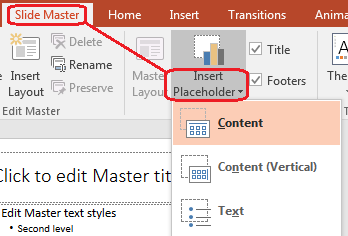

## **Áttekintés**

A **slide master** meghatározza a közös tervezési beállításokat egy diacsoport számára. Tartalmazhat közös alakzatokat, logókat, háttereket, szövegstílusokat, téma beállításokat és lábléc beállításokat. A PowerPointban a slide master szerkesztése a szokásos módja annak, hogy a prezentáció konzisztens maradjon anélkül, hogy minden dián ismételni kellene ugyanazt a formázást.

Aspose.Slides for Python via Java támogatja ugyanazt a modellt. Egy prezentáció tartalmazhat egy vagy több master diát, és minden master dia több layout diát is tartalmazhat. A normál diák általában nem hivatkoznak közvetlenül egy master diára. Ehelyett egy normál dia egy layout diát használ, amely egy master dia része.

A hierarchia a következő:

1. **Slide master** – meghatározza a közös tervezést és a témát.
1. **Layout slide** – meghatároz egy konkrét elrendezést a helyőrzőkkel és a layout szintű formázással.
1. **Normal slide** – tartalmazza a tényleges prezentációs tartalmat, és egy layout slide-ot használ.


Az Aspose.Slides-ban a slide master a [MasterSlide](https://reference.aspose.com/slides/hu/python-java/aspose.slides/masterslide/) osztállyal van reprezentálva. A prezentáció összes master diája a [Presentation.getMasters](https://reference.aspose.com/slides/hu/python-java/aspose.slides/presentation/#getMasters) gyűjteményen keresztül érhető el, amelyet a [MasterSlideCollection](https://reference.aspose.com/slides/hu/python-java/aspose.slides/masterslidecollection/) reprezentál.

{}
Ha ugyanaz a tulajdonság több szinten is definiálva van, a specifikusabb szint nyer. Például, ha egy master dia és egy layout dia is meghatároz egy háttérszínt, a layoutra épülő diák a layout háttérét használják. További információért a layout diákról lásd a [Apply or Change Slide Layouts](/slides/hu/python-java/slide-layout/) oldalt.
{}

## **A slide master-ek elérése**

A PowerPointban a Slide Master nézetet a **View** > **Slide Master** menüből nyithatja meg.


Az Aspose.Slides-ban használja a [Presentation.getMasters](https://reference.aspose.com/slides/hu/python-java/aspose.slides/presentation/#getMasters) gyűjteményt a master diák eléréséhez:

```python
import jpype
import asposeslides

if not jpype.isJVMStarted():
    jpype.startJVM()

from asposeslides.api import Presentation

presentation = Presentation("presentation.pptx")
try:
    first_master_slide = presentation.getMasters().get_Item(0)
    master_slide_count = presentation.getMasters().size()
    first_master_layout_slide_count = first_master_slide.getLayoutSlides().size()

    print(f"Master slides: {master_slide_count}")
    print(f"Layouts in the first master: {first_master_layout_slide_count}")
finally:
    presentation.dispose()
```

Le is kérheti egy normál dia által használt master diát a layoutján keresztül:

```python
import jpype
import asposeslides

if not jpype.isJVMStarted():
    jpype.startJVM()

from asposeslides.api import Presentation

presentation = Presentation("presentation.pptx")
try:
    slide = presentation.getSlides().get_Item(0)
    layout_slide = slide.getLayoutSlide()
    master_slide = layout_slide.getMasterSlide()
    master_slide_name = master_slide.getName()

    print(master_slide_name)
finally:
    presentation.dispose()
```

## **Mit tartalmaz egy slide master**

A master dia egy diára hasonlító objektum. Örökli a [BaseSlide](https://reference.aspose.com/slides/hu/python-java/aspose.slides/baseslide/) osztályt, így sok olyan dia tulajdonságot tesz elérhetővé, amelyet a normál és a layout diák használnak. A master specifikus tagok a [MasterSlide](https://reference.aspose.com/slides/hu/python-java/aspose.slides/masterslide/) API oldalán vannak felsorolva.

Az általánosan használt master dia tagok a következők:

| Tag | Cél |
| --- | --- |
| [getBackground](https://reference.aspose.com/slides/hu/python-java/aspose.slides/baseslide/#getBackground) | Beállítja a master szintű dia háttérét. |
| [getShapes](https://reference.aspose.com/slides/hu/python-java/aspose.slides/baseslide/#getShapes) | A master-re helyezett alakzatokat tárolja, például logókat, képkockákat és megosztott szöveget. |
| [getLayoutSlides](https://reference.aspose.com/slides/hu/python-java/aspose.slides/masterslide/#getLayoutSlides) | A masterhez tartozó layout diákat tárolja. |
| [getThemeManager](https://reference.aspose.com/slides/hu/python-java/aspose.slides/masterslide/#getThemeManager) | Hozzáférést biztosít a master téma API-khoz. |
| [getHeaderFooterManager](https://reference.aspose.com/slides/hu/python-java/aspose.slides/masterslide/#getHeaderFooterManager) | A master és annak alatti layoutok fejlécét, láblécét, dátumát és dia számait kezeli. |
| [getDependingSlides](https://reference.aspose.com/slides/hu/python-java/aspose.slides/masterslide/#getDependingSlides) | Visszaadja a normál diákat, amelyek a master-re a layoutjaikon keresztül támaszkodnak. |

## **Kép hozzáadása egy slide master-hez**

Ha képet ad hozzá egy master diához, az megjelenik azokon a diákon, amelyek az adott master layoutjait használják. Ez hasznos logók, vízjelek, díszcsíkok és egyéb ismétlődő vizuális elemek esetén.

A következő példa egy logót ad az első master diához:

```python
import jpype
import asposeslides

if not jpype.isJVMStarted():
    jpype.startJVM()

from asposeslides.api import Images, Presentation, SaveFormat, ShapeType

presentation = Presentation("presentation.pptx")
try:
    master_slide = presentation.getMasters().get_Item(0)
    logo = Images.fromFile("logo.png")
    try:
        logo_image = presentation.getImages().addImage(logo)
        master_slide.getShapes().addPictureFrame(ShapeType.Rectangle, 20, 20, 80, 80, logo_image)
    finally:
        logo.dispose()

    presentation.save("presentation-with-logo.pptx", SaveFormat.Pptx)
finally:
    presentation.dispose()
```

További információért a képkockákról lásd a [Picture Frame](/slides/hu/python-java/picture-frame/) oldalt.

## **A master grafikák láthatóságának vezérlése**

A [BaseSlide.setShowMasterShapes](https://reference.aspose.com/slides/hu/python-java/aspose.slides/baseslide/#setShowMasterShapes) használatával elrejtheti az örökölt master grafikákat, például logókat vagy díszalakzatokat, anélkül, hogy a masterről törölné őket. Adjon `False` értéket a [Slide.setShowMasterShapes](https://reference.aspose.com/slides/hu/python-java/aspose.slides/slide/#setShowMasterShapes) metódusnak azon dián, amelyik el akarja hagyni ezeket a grafikákat, és `True` értéket azoknál a diáknál, amelyek meg akarják jeleníteni őket.

A következő önálló példa egy kék díszcsíkot hoz létre egy masteren, valamint két diát, amelyek ugyanazt az üres layoutot használják. A csík az első dián látható, a másodikon rejtett. Nem szükséges bemeneti prezentáció vagy kép.

```python
import jpype
import asposeslides

if not jpype.isJVMStarted():
    jpype.startJVM()

from asposeslides.api import FillType, Presentation, SaveFormat, ShapeType, SlideLayoutType

Color = jpype.JClass("java.awt.Color")

presentation = Presentation()
try:
    master_slide = presentation.getMasters().get_Item(0)
    layout_slide = master_slide.getLayoutSlides().getByType(SlideLayoutType.Blank)
    layout_slide.setShowMasterShapes(True)

    slide_height = jpype.JFloat(presentation.getSlideSize().getSize().getHeight())
    band = master_slide.getShapes().addAutoShape(ShapeType.Rectangle, 0, 0, 60, slide_height)
    band_color = Color(70, 130, 180)
    band.getFillFormat().setFillType(FillType.Solid)
    band.getFillFormat().getSolidFillColor().setColor(band_color)
    band.getLineFormat().getFillFormat().setFillType(FillType.NoFill)

    visible_slide = presentation.getSlides().get_Item(0)
    visible_slide.setLayoutSlide(layout_slide)
    visible_slide.getShapes().clear()

    hidden_slide = presentation.getSlides().addEmptySlide(layout_slide)

    visible_slide.setShowMasterShapes(True)
    hidden_slide.setShowMasterShapes(False)

    presentation.save("master-graphics.pptx", SaveFormat.Pptx)
finally:
    presentation.dispose()
```

A példa a **Blank** layoutot használja, amely egy új prezentációval érkezik, és eltávolítja az első dia saját helyőrzőit.

### **Válassza ki a beállítás hatókörét**

Egy normál dia a masterét a [Slide.getLayoutSlide](https://reference.aspose.com/slides/hu/python-java/aspose.slides/slide/#getLayoutSlide) és a [LayoutSlide.getMasterSlide](https://reference.aspose.com/slides/hu/python-java/aspose.slides/layoutslide/#getMasterSlide) segítségével használja. A tulajdonság beállítása egy egyedi dián csak arra a diára hat. `False` átadása a [LayoutSlide.setShowMasterShapes](https://reference.aspose.com/slides/hu/python-java/aspose.slides/layoutslide/#setShowMasterShapes) metódusnak elrejti a master grafikákat azokon a diákon, amelyek ezt a közös layoutot használják, még akkor is, ha a saját beállításuk `True`. Egyetlen dián történő grafika elrejtéséhez módosítsa a dia tulajdonságát, és hagyja változatlanul a közös layoutot.

A beállítás nem támogatott láthatóságvezérlőként a master dián magán. Egy masteren a [getShowMasterShapes](https://reference.aspose.com/slides/hu/python-java/aspose.slides/masterslide/#getShowMasterShapes) mindig `False` értéket ad vissza, és a [setShowMasterShapes](https://reference.aspose.com/slides/hu/python-java/aspose.slides/masterslide/#setShowMasterShapes) `True` értékének átadása kivételt generál. Inkább egy normál diára vagy egy layoutra alkalmazza.

### **Különböztesse meg a grafikát a háttértől**

| Művelet | Hatás |
| --- | --- |
| Az örökölt master alakzatok láthatóságának vezérlése, anélkül hogy törölné őket vagy módosítaná a dia saját alakzatait. |
| Megváltoztatja a dia háttérkitöltését | Megváltoztatja a háttér színét, gradiensét vagy képét. A master grafikák különálló alakzatok, és láthatóak maradhatnak a háttér felett. Lásd a [Presentation Background](/slides/hu/python-java/presentation-background/) oldalt. |
| Törölje egy alakzatot a masterről | Eltávolítja a megosztott forrás alakzatot, így már nem érhető el egyetlen diának sem, amely azt a mastert használja. |

## **Helyőrzőkkel való munka**

A helyőrzőket általában a layout diákon definiálják. A master dia biztosítja a közös stílust és temát, amelyet a layoutok örökölnek, míg minden layout eldönti, hogy melyik helyőrző elérhető és hol helyezkedik el.

A PowerPointban a helyőrző parancsok a Slide Master nézetben érhetők el.



Új helyőrzők hozzáadásához az Aspose.Slides használatával dolgozzon a masterhez tartozó layout diával:

```python
import jpype
import asposeslides

if not jpype.isJVMStarted():
    jpype.startJVM()

from asposeslides.api import Presentation, SaveFormat, SlideLayoutType

presentation = Presentation("presentation.pptx")
try:
    master_slide = presentation.getMasters().get_Item(0)
    blank_layout_slide = master_slide.getLayoutSlides().getByType(SlideLayoutType.Blank)

    if blank_layout_slide is None:
        blank_layout_slide = master_slide.getLayoutSlides().add(SlideLayoutType.Blank, "Blank")

    blank_layout_slide.getPlaceholderManager().addTextPlaceholder(60, 120, 600, 80)

    presentation.getSlides().addEmptySlide(blank_layout_slide)
    presentation.save("presentation-with-placeholder.pptx", SaveFormat.Pptx)
finally:
    presentation.dispose()
```

Megformázhatja a már a master dián létező helyőrző alakzatokat is. A következő példa megtalálja a cím helyőrzőt és lineáris gradiens kitöltést alkalmaz rá:

```python
import jpype
import asposeslides

if not jpype.isJVMStarted():
    jpype.startJVM()

from asposeslides.api import AutoShape, FillType, GradientShape, PlaceholderType, Presentation, SaveFormat

Color = jpype.JClass("java.awt.Color")

presentation = Presentation("presentation.pptx")
try:
    master_slide = presentation.getMasters().get_Item(0)
    title_placeholder = None

    for shape in master_slide.getShapes():
        if isinstance(shape, AutoShape):
            if shape.getPlaceholder() is not None and shape.getPlaceholder().getType() == PlaceholderType.Title:
                title_placeholder = shape
                break

    if title_placeholder is not None:
        red_gradient_color = Color(255, 0, 0)
        purple_gradient_color = Color(128, 0, 128)

        title_placeholder.getFillFormat().setFillType(FillType.Gradient)
        title_placeholder.getFillFormat().getGradientFormat().setGradientShape(GradientShape.Linear)
        title_placeholder.getFillFormat().getGradientFormat().getGradientStops().add(jpype.JFloat(0.0), red_gradient_color)
        title_placeholder.getFillFormat().getGradientFormat().getGradientStops().add(jpype.JFloat(1.0), purple_gradient_color)

    presentation.save("presentation-title-style.pptx", SaveFormat.Pptx)
finally:
    presentation.dispose()
```


További helyőrző és szövegformázási lehetőségekért lásd a [Set Prompt Text in Placeholder](/slides/hu/python-java/manage-placeholder/) és a [Text Formatting](/slides/hu/python-java/text-formatting/) oldalakat.

## **Slide master háttér módosítása**

A master háttér öröklődik a layoutok és a diák számára, amelyek nem írják felül. A következő példa egy egyszínű háttérszínt állít be az első master dián:

```python
import jpype
import asposeslides

if not jpype.isJVMStarted():
    jpype.startJVM()

from asposeslides.api import BackgroundType, FillType, Presentation, SaveFormat

Color = jpype.JClass("java.awt.Color")

presentation = Presentation("presentation.pptx")
try:
    master_slide = presentation.getMasters().get_Item(0)
    master_background_color = Color.GREEN

    master_slide.getBackground().setType(BackgroundType.OwnBackground)
    master_slide.getBackground().getFillFormat().setFillType(FillType.Solid)
    master_slide.getBackground().getFillFormat().getSolidFillColor().setColor(master_background_color)

    presentation.save("presentation-master-background.pptx", SaveFormat.Pptx)
finally:
    presentation.dispose()
```

Kapcsolódó témákért lásd a [Presentation Background](/slides/hu/python-java/presentation-background/) és a [Presentation Theme](/slides/hu/python-java/presentation-theme/) oldalakat.

## **Slide master klónozása egy másik prezentációba**

A [MasterSlideCollection.addClone](https://reference.aspose.com/slides/hu/python-java/aspose.slides/masterslidecollection/#addClone) használatával másolhat egy master diát egy másik prezentációba. A másolt master ezután a célprezentáció layoutjai és diái által használható.

```python
import jpype
import asposeslides

if not jpype.isJVMStarted():
    jpype.startJVM()

from asposeslides.api import Presentation, SaveFormat

source_presentation = Presentation("source.pptx")
destination_presentation = Presentation("destination.pptx")
try:
    source_master_slide = source_presentation.getMasters().get_Item(0)
    cloned_master_slide = destination_presentation.getMasters().addClone(source_master_slide)

    destination_presentation.save("destination-with-master.pptx", SaveFormat.Pptx)
finally:
    source_presentation.dispose()
    destination_presentation.dispose()
```

Ha normál diákat is a masterrel együtt szeretne klónozni, lásd a [Clone Slides](/slides/hu/python-java/clone-slides/) oldalt.

## **Több slide master hozzáadása**

Egy prezentáció több master diát is tartalmazhat. Ez akkor hasznos, amikor a különböző szakaszok különböző márkázást, oldal struktúrát vagy téma beállításokat igényelnek.


A következő példa klónozza az alapértelmezett mastert, a klónnak más háttérszínt ad, egy layoutot hoz létre a klónozott master alatt, és egy új diát ad hozzá a layout alapján:

```python
import jpype
import asposeslides

if not jpype.isJVMStarted():
    jpype.startJVM()

from asposeslides.api import BackgroundType, FillType, Presentation, SaveFormat, SlideLayoutType

Color = jpype.JClass("java.awt.Color")

presentation = Presentation("presentation.pptx")
try:
    default_master_slide = presentation.getMasters().get_Item(0)
    section_master_slide = presentation.getMasters().addClone(default_master_slide)
    section_master_background_color = Color.LIGHT_GRAY

    section_master_slide.getBackground().setType(BackgroundType.OwnBackground)
    section_master_slide.getBackground().getFillFormat().setFillType(FillType.Solid)
    section_master_slide.getBackground().getFillFormat().getSolidFillColor().setColor(section_master_background_color)

    source_blank_layout = default_master_slide.getLayoutSlides().getByType(SlideLayoutType.Blank)
    if source_blank_layout is None:
        source_blank_layout = default_master_slide.getLayoutSlides().get_Item(0)

    section_blank_layout = section_master_slide.getLayoutSlides().addClone(source_blank_layout)

    presentation.getSlides().addEmptySlide(section_blank_layout)
    presentation.save("presentation-with-multiple-masters.pptx", SaveFormat.Pptx)
finally:
    presentation.dispose()
```

## **Slide master-ek összehasonlítása**

A master diák összehasonlíthatók a [equals](https://reference.aspose.com/slides/hu/python-java/aspose.slides/baseslide/#equals) metódussal, amelyet a [BaseSlide](https://reference.aspose.com/slides/hu/python-java/aspose.slides/baseslide/) örököl. Az összehasonlítás ellenőrzi a struktúrát és a statikus tartalmat, például alakzatokat, szöveget, formázást, animációkat és egyéb dia beállításokat. Nem hasonlítja össze az egyedi azonosítókat, például a dia ID-ket, vagy a dinamikus helyőrző értékeket, például az aktuális dátumot.

```python
import jpype
import asposeslides

if not jpype.isJVMStarted():
    jpype.startJVM()

from asposeslides.api import Presentation

first_presentation = Presentation("first.pptx")
second_presentation = Presentation("second.pptx")
try:
    first_presentation_master_count = first_presentation.getMasters().size()
    second_presentation_master_count = second_presentation.getMasters().size()

    for first_master_index in range(first_presentation_master_count):
        for second_master_index in range(second_presentation_master_count):
            first_master_slide = first_presentation.getMasters().get_Item(first_master_index)
            second_master_slide = second_presentation.getMasters().get_Item(second_master_index)
            are_master_slides_equal = first_master_slide.equals(second_master_slide)

            if are_master_slides_equal:
                print(f"first.pptx master #{first_master_index} equals second.pptx master #{second_master_index}")
finally:
    first_presentation.dispose()
    second_presentation.dispose()
```

További információért lásd a [Compare Presentation Slides](/slides/hu/python-java/compare-slides/) oldalt.

## **A slide master nézet beállítása alapértelmezett nézetnek**

A [setLastView](https://reference.aspose.com/slides/hu/python-java/aspose.slides/viewproperties/#setLastView) metódus használatával a [ViewProperties](https://reference.aspose.com/slides/hu/python-java/aspose.slides/viewproperties/)‑on szabályozhatja, hogy a PowerPoint melyik nézetet nyissa meg először. A következő példa a prezentációt Slide Master nézetben nyitja meg:

```python
import jpype
import asposeslides

if not jpype.isJVMStarted():
    jpype.startJVM()

from asposeslides.api import Presentation, SaveFormat, ViewType

presentation = Presentation("presentation.pptx")
try:
    presentation.getViewProperties().setLastView(ViewType.SlideMasterView)
    presentation.save("presentation-master-view.pptx", SaveFormat.Pptx)
finally:
    presentation.dispose()
```

További nézetbeállításokért lásd a [Save Presentation](/slides/hu/python-java/save-presentation/) oldalt.

## **Felhasználatlan master diákok eltávolítása**

A prezentációk néha olyan master diákat tartalmaznak, amelyeket már egyetlen normál dia sem használ. A felhasználatlan masterek eltávolítása csökkentheti a fájlméretet és egyszerűsítheti a sablon karbantartását.

A [removeUnused](https://reference.aspose.com/slides/hu/python-java/aspose.slides/masterslidecollection/#removeUnused) használatával eltávolíthatja a felhasználatlan mastereket a [Presentation.getMasters](https://reference.aspose.com/slides/hu/python-java/aspose.slides/presentation/#getMasters) gyűjteményből:

```python
import jpype
import asposeslides

if not jpype.isJVMStarted():
    jpype.startJVM()

from asposeslides.api import Presentation, SaveFormat

presentation = Presentation("presentation.pptx")
try:
    presentation.getMasters().removeUnused(True)
    presentation.save("presentation-clean.pptx", SaveFormat.Pptx)
finally:
    presentation.dispose()
```

Alacsony-kódú [Compress.removeUnusedMasterSlides](https://reference.aspose.com/slides/hu/python-java/aspose.slides/compress/#removeUnusedMasterSlides) metódust is használhat:

```python
import jpype
import asposeslides

if not jpype.isJVMStarted():
    jpype.startJVM()

from asposeslides.api import Compress, Presentation, SaveFormat

presentation = Presentation("presentation.pptx")
try:
    Compress.removeUnusedMasterSlides(presentation)
    presentation.save("presentation-clean.pptx", SaveFormat.Pptx)
finally:
    presentation.dispose()
```

## **GYIK**

**Mi a különbség a slide master és a layout slide között?**

A slide master meghatározza a közös tervezési beállításokat, például a témát, háttér, közös alakzatok és szövegstílusok. Egy layout slide a master diához tartozik és egy konkrét helyőrző elrendezést definiál. Egy normál dia egy layout slide-ot használ, így mind a layout, mind a master öröklődik.

**Tartalmazhat egy prezentáció több slide master-t?**

Igen. Egy prezentáció több slide master-t is tartalmazhat. Használjon több mastert, ha a különböző szakaszok különböző vizuális rendszereket vagy márkázást igényelnek.

**Helyőrzőket a master diára vagy a layout diára kellene-e feltenni?**

Általában a helyőrzőket a layout diákra kell feltenni. A közös vizuális elemeket és közös formázást a master diára helyezze, majd a tartalmi helyőrzőket a layoutokra, amelyeket a normál diák használni fognak.

**Törölhetek olyan master diát, amely még használatban van?**

Nem. Olyan master diát, amelynek vannak függő diái, nem lehet biztonságosan közvetlenül eltávolítani. Először mozdítsa át ezeket a diákat másik master alatti layoutokra, vagy használja a nem használt master-ek tisztítási módszert, amely csak a nem használt mastereket távolítja el.