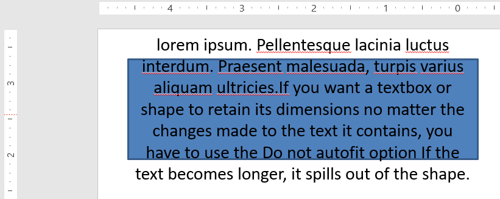

## **Bevezetés**

Alapértelmezés szerint, amikor szövegdobozt ad hozzá, a Microsoft PowerPoint a szövegdobozhoz a **Resize shape to fix text** beállítást használja – automatikusan átméretezi a szövegdobozt, hogy a benne lévő szöveg mindig elférjen benne. 


* Amikor a szövegdoboz szövege hosszabb vagy nagyobb lesz, a PowerPoint automatikusan növeli a szövegdobozt – magasságát – hogy több szöveget tudjon tartalmazni. 
* Amikor a szövegdoboz szövege rövidebb vagy kisebb lesz, a PowerPoint automatikusan csökkenti a szövegdobozt – magasságát – és eltávolítja a felesleges helyet. 

A PowerPointben négy fontos paraméter vagy lehetőség szabályozza a szövegdobozok autofit viselkedését: 

* **Do not Autofit**
* **Shrink text on overflow**
* **Resize shape to fit text**
* **Wrap text in shape.**


Az Aspose.Slides for Python via .NET hasonló lehetőségeket kínál – néhány tulajdonságot a [TextFrameFormat](https://reference.aspose.com/slides/hu/python-net/aspose.slides/textframeformat/) osztályban – amelyekkel szabályozhatja a szövegdobozok autofit viselkedését a bemutatókban. 

## **Resize Shapes to Fit Text**

Ha azt szeretné, hogy egy doboz szövege mindig elférjen a dobozban a szöveg módosítása után is, a **Resize shape to fix text** lehetőséget kell használnia. Ennek beállításához állítsa a [autofit_type](https://reference.aspose.com/slides/hu/python-net/aspose.slides/textframeformat/) tulajdonságot a [TextFrameFormat](https://reference.aspose.com/slides/hu/python-net/aspose.slides/textframeformat/) osztályból `SHAPE`‑re. 


Ez a Python kód megmutatja, hogyan adja meg, hogy a szöveg mindig elférjen a dobozában egy PowerPoint‑prezentációban:

```py
import aspose.slides as slides
import aspose.pydrawing as draw

with slides.Presentation() as presentation:
    slide = presentation.slides[0]
    auto_shape = slide.shapes.add_auto_shape(slides.ShapeType.RECTANGLE, 30, 30, 350, 100)

    portion = slides.Portion("lorem ipsum...")
    portion.portion_format.fill_format.solid_fill_color.color = draw.Color.black
    portion.portion_format.fill_format.fill_type = slides.FillType.SOLID
    auto_shape.text_frame.paragraphs[0].portions.add(portion)

    text_frame_format = auto_shape.text_frame.text_frame_format
    text_frame_format.autofit_type = slides.TextAutofitType.SHAPE

    presentation.save("output.pptx", slides.export.SaveFormat.PPTX)
```

Ha a szöveg hosszabb vagy nagyobb lesz, a szövegdoboz automatikusan átméreteződik (magassága nő), hogy az egész szöveg elférjen benne. Ha a szöveg rövidebb, akkor a fordított történik. 

## **Do Not Autofit**

Ha azt szeretné, hogy egy szövegdoboz vagy alakzat megtartsa méreteit függetlenül a benne lévő szöveg változásaitól, a **Do not Autofit** lehetőséget kell használnia. Ennek beállításához állítsa a [autofit_type](https://reference.aspose.com/slides/hu/python-net/aspose.slides/textframeformat/) tulajdonságot a [TextFrameFormat](https://reference.aspose.com/slides/hu/python-net/aspose.slides/textframeformat/) osztályból `NONE`‑ra. 



Ez a Python kód megmutatja, hogyan adja meg, hogy egy szövegdoboz mindig megtartsa méreteit egy PowerPoint‑prezentációban:

```py
import aspose.slides as slides
import aspose.pydrawing as draw

with slides.Presentation() as presentation:
    slide = presentation.slides[0]
    auto_shape = slide.shapes.add_auto_shape(slides.ShapeType.RECTANGLE, 30, 30, 350, 100)

    portion = slides.Portion("lorem ipsum...")
    portion.portion_format.fill_format.solid_fill_color.color = draw.Color.black
    portion.portion_format.fill_format.fill_type = slides.FillType.SOLID
    auto_shape.text_frame.paragraphs[0].portions.add(portion)

    text_frame_format = auto_shape.text_frame.text_frame_format
    text_frame_format.autofit_type = slides.TextAutofitType.NONE

    presentation.save("output.pptx", slides.export.SaveFormat.PPTX)
```

Ha a szöveg túl hosszú lesz a dobozához képest, kifolyik. 

## **Shrink Text on Overflow**

Ha a szöveg túl hosszúra nő a dobozhoz képest, a **Shrink text on overflow** lehetőséggel megadhatja, hogy a szöveg méretét és a szóközöket csökkenteni kell, hogy elférjen a dobozban. Ennek beállításához állítsa a [autofit_type](https://reference.aspose.com/slides/hu/python-net/aspose.slides/textframeformat/) tulajdonságot a [TextFrameFormat](https://reference.aspose.com/slides/hu/python-net/aspose.slides/textframeformat/) osztályból `NORMAL`‑ra. 


Ez a Python kód megmutatja, hogyan adja meg, hogy a szöveget csökkenteni kell az overflow esetén egy PowerPoint‑prezentációban:

```py
import aspose.slides as slides
import aspose.pydrawing as draw

with slides.Presentation() as presentation:
    slide = presentation.slides[0]
    auto_shape = slide.shapes.add_auto_shape(slides.ShapeType.RECTANGLE, 30, 30, 350, 100)

    portion = slides.Portion("lorem ipsum...")
    portion.portion_format.fill_format.solid_fill_color.color = draw.Color.black
    portion.portion_format.fill_format.fill_type = slides.FillType.SOLID
    auto_shape.text_frame.paragraphs[0].portions.add(portion)

    text_frame_format = auto_shape.text_frame.text_frame_format
    text_frame_format.autofit_type = slides.TextAutofitType.NORMAL

    presentation.save("output.pptx", slides.export.SaveFormat.PPTX)
```

{}
Amikor a **Shrink text on overflow** lehetőséget használja, a beállítás csak akkor lép életbe, amikor a szöveg túl hosszúra nő a dobozához képest. 
{}

## **Wrap Text**

Ha azt szeretné, hogy a szöveg egy alakzatban a forma határain (csak a szélesség mentén) belül legyen tördelve, a **Wrap text in shape** paramétert kell használnia. Ennek beállításához a [wrap_text](https://reference.aspose.com/slides/hu/python-net/aspose.slides/textframeformat/) tulajdonságot a [TextFrameFormat](https://reference.aspose.com/slides/hu/python-net/aspose.slides/textframeformat/) osztályból `NullableBool.TRUE`‑ra kell állítani. 

Ez a Python kód megmutatja, hogyan használja a Wrap Text beállítást egy PowerPoint‑prezentációban:

```py
import aspose.slides as slides
import aspose.pydrawing as draw

with slides.Presentation() as presentation:
    slide = presentation.slides[0]
    auto_shape = slide.shapes.add_auto_shape(slides.ShapeType.RECTANGLE, 30, 30, 350, 100)

    portion = slides.Portion("lorem ipsum...")
    portion.portion_format.fill_format.solid_fill_color.color = draw.Color.black
    portion.portion_format.fill_format.fill_type = slides.FillType.SOLID
    auto_shape.text_frame.paragraphs[0].portions.add(portion)

    text_frame_format = auto_shape.text_frame.text_frame_format
    text_frame_format.autofit_type = slides.TextAutofitType.NONE
    text_frame_format.wrap_text = slides.NullableBool.TRUE

    presentation.save("output.pptx", slides.export.SaveFormat.PPTX)
```

{} 
Ha a `wrap_text` tulajdonságot `NullableBool.FALSE`‑ra állítja egy alakzatra, a szöveg a forma szélességét meghaladó esetben egy sorban a forma határain kívül folytatódik. 
{}

## **FAQ**

**Befolyásolják a szövegkeret belső margói az AutoFit működését?**

Igen. A padding (belső margók) csökkentik a szöveg használható területét, így az AutoFit hamarabb aktiválódik – csökkenti a betűméretet vagy átméretezi a formát korábban. Ellenőrizze és állítsa be a margókat, mielőtt finomhangolná az AutoFitet.

**Hogyan működik az AutoFit a kézi és puha sortörésekhez viszonyítva?**

A kényszerített sortörések megmaradnak, az AutoFit ennek körül a betűméretet és a szóközöket igazítja. A felesleges sortörések eltávolítása gyakran csökkenti az AutoFit által szükséges szövegcsökkentés mértékét.

**A téma betűtípusának módosítása vagy a betűtípus helyettesítés hatással van-e az AutoFit eredményére?**

Igen. A betűtípusra való átállás, amely eltérő glifméretekkel rendelkezik, megváltoztatja a szöveg szélességét/magasságát, ami módosíthatja a végső betűméretet és a sortörést. Bármilyen betűtípus‑változtatás vagy helyettesítés után ellenőrizze újra a diák megjelenését.