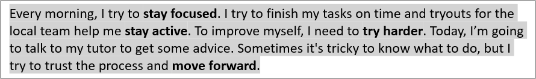

## **Áttekintés**

Ez a cikk bemutatja, hogyan formázható a szöveg PowerPoint és OpenDocument prezentációkban az Aspose.Slides for Python via .NET használatával. Tárgyalja a kiemelést, háttérszíneket, átlátszóságot, karakterközeletet, betűtípus‑tulajdonságokat, forgatást, bekezdésközeletet, automatikus illeszkedés viselkedését, szöveggörgetést, tabulátorállásokat és a nyelvi beállításokat.

Az alábbi példákban egy „sample.pptx” nevű fájlt használunk, amely az első dián egyetlen szövegmezőt tartalmaz a következő szöveggel:


## **Szöveg kiemelése**

Használja a [TextFrame.highlight_text](https://reference.aspose.com/slides/hu/python-net/aspose.slides/textframe/highlight_text/) metódust, amikor egy szövegkereten belül egy adott minta szerint szeretne szöveget kiemelni. A metódus kiemelési színt alkalmaz a megfelelő szövegrészekre, és használható a [TextSearchOptions](https://reference.aspose.com/slides/hu/python-net/aspose.slides/textsearchoptions/) segítségével a keresés módjának szabályozására, például csak egész szavak egyezésére.

Az alábbi kódrészlet kiemeli a **„try”** karakterek minden előfordulását, majd csak a **„to”** teljes szót.

```python
import aspose.pydrawing as draw
import aspose.slides as slides

with slides.Presentation("sample.pptx") as presentation:
    # Az első diáról lekéri az első alakzatot.
    shape = presentation.slides[0].shapes[0]

    # Kiemeli a "try" szót az alakzatban.
    shape.text_frame.highlight_text("try", draw.Color.light_blue)

    search_options = slides.TextSearchOptions()
    search_options.whole_words_only = True

    # Kiemeli a "to" szót az alakzatban.
    shape.text_frame.highlight_text("to", draw.Color.violet, search_options, None)

    presentation.save("highlighted_text.pptx", slides.export.SaveFormat.PPTX)
```

Az eredmény:


## **Szöveg kiemelése reguláris kifejezésekkel**

A [TextFrame.highlight_regex](https://reference.aspose.com/slides/hu/python-net/aspose.slides/textframe/highlight_regex/) metódus kiemeli a reguláris kifejezéssel talált egyezéseket. Pythonban ez az API a [TextFrame](https://reference.aspose.com/slides/hu/python-net/aspose.slides/textframe/) osztályon keresztül érhető el.

Az alábbi kódrészlet kiemeli az összes olyan szót, amely **legalább hét karakterből** áll:

```python
import aspose.pydrawing as draw
import aspose.slides as slides

with slides.Presentation("sample.pptx") as presentation:
    shape = presentation.slides[0].shapes[0]

    regex = r"\b[^\s]{7,}\b"

    # Kiemeli az összes olyan szót, amely hét vagy több karakterből áll.
    shape.text_frame.highlight_regex(regex, draw.Color.yellow, None)

    presentation.save("highlighted_text_using_regex.pptx", slides.export.SaveFormat.PPTX)
```

Az eredmény:


## **Szöveg háttérszínének beállítása**

Használja a [ParagraphFormat.default_portion_format](https://reference.aspose.com/slides/hu/python-net/aspose.slides/paragraphformat/default_portion_format/) metódust a bekezdés alapértelmezett kiemelési színének beállításához, vagy a [PortionFormat.highlight_color](https://reference.aspose.com/slides/hu/python-net/aspose.slides/portionformat/highlight_color/) metódust az egyes szövegrészekhez.

Az alábbi kódrészlet bemutatja, hogyan állítható be a **teljes bekezdés** háttérszíne:

```python
import aspose.pydrawing as draw
import aspose.slides as slides

with slides.Presentation("sample.pptx") as presentation:
    auto_shape = presentation.slides[0].shapes[0]
    paragraph = auto_shape.text_frame.paragraphs[0]

    # Állítsa be a teljes bekezdés kiemelési színét.
    paragraph.paragraph_format.default_portion_format.highlight_color.color = draw.Color.light_gray

    presentation.save("gray_paragraph.pptx", slides.export.SaveFormat.PPTX)
```

Az eredmény:



Az alábbi kódrészlet azt mutatja be, hogyan állítható be a **félkövér betűtípusú** szövegrészek háttérszíne:

```python
import aspose.pydrawing as draw
import aspose.slides as slides

with slides.Presentation("sample.pptx") as presentation:
    auto_shape = presentation.slides[0].shapes[0]
    paragraph = auto_shape.text_frame.paragraphs[0]

    for portion in paragraph.portions:
        if portion.portion_format.get_effective().font_bold:
            # Állítsa be a kiemelési színt a szövegrészhez.
            portion.portion_format.highlight_color.color = draw.Color.light_gray

    presentation.save("gray_text_portions.pptx", slides.export.SaveFormat.PPTX)
```

Az eredmény:


## **Szöveg bekezdések igazítása**

Használja a [ParagraphFormat.alignment](https://reference.aspose.com/slides/hu/python-net/aspose.slides/paragraphformat/alignment/) metódust a bekezdés igazításának beállításához egy szövegkereten belül. Az érték lehet középre, balra, jobbra, sorkizárt stb.

Az alábbi kódrészlet azt mutatja, hogyan igazítható a bekezdés **középre**:

```python
import aspose.slides as slides

with slides.Presentation("sample.pptx") as presentation:
    auto_shape = presentation.slides[0].shapes[0]
    paragraph = auto_shape.text_frame.paragraphs[0]

    # Állítsa be a bekezdés igazítását középre.
    paragraph.paragraph_format.alignment = slides.TextAlignment.CENTER

    presentation.save("aligned_paragraph.pptx", slides.export.SaveFormat.PPTX)
```

Az eredmény:


## **Szöveg átlátszóságának beállítása**

A szöveg átlátszósága a [PortionFormat.fill_format](https://reference.aspose.com/slides/hu/python-net/aspose.slides/portionformat/fill_format/) színének alfa komponensén keresztül szabályozható. Az alábbi példákban az `alpha = 50` egy 0‑255 tartományú ARGB alfa‑csatorna érték, nem pedig átlátszósági százalék.

Az alábbi kódrészlet azt mutatja, hogyan alkalmazható átlátszóság a **teljes bekezdés** esetén:

```python
import aspose.pydrawing as draw
import aspose.slides as slides

alpha = 50

with slides.Presentation("sample.pptx") as presentation:
    auto_shape = presentation.slides[0].shapes[0]
    paragraph = auto_shape.text_frame.paragraphs[0]

    # Állítsa be a szöveg kitöltőszínét átlácsó színre.
    paragraph.paragraph_format.default_portion_format.fill_format.fill_type = slides.FillType.SOLID
    paragraph.paragraph_format.default_portion_format.fill_format.solid_fill_color.color = draw.Color.from_argb(alpha, draw.Color.black)

    presentation.save("transparent_paragraph.pptx", slides.export.SaveFormat.PPTX)
```

Az eredmény:


Az alábbi kódrészlet azt mutatja, hogyan alkalmazható átlátszóság a **félkövér betűtípusú** szövegrészekre:

```python
import aspose.pydrawing as draw
import aspose.slides as slides

alpha = 50

with slides.Presentation("sample.pptx") as presentation:
    auto_shape = presentation.slides[0].shapes[0]
    paragraph = auto_shape.text_frame.paragraphs[0]

    for portion in paragraph.portions:
        if portion.portion_format.get_effective().font_bold:
            # Állítsa be a szövegrész átlátszóságát.
            portion.portion_format.fill_format.fill_type = slides.FillType.SOLID
            portion.portion_format.fill_format.solid_fill_color.color = draw.Color.from_argb(alpha, draw.Color.black)

    presentation.save("transparent_text_portions.pptx", slides.export.SaveFormat.PPTX)
```

Az eredmény:


## **Karakterközelet beállítása szöveghez**

Használja a [BasePortionFormat.spacing](https://reference.aspose.com/slides/hu/python-net/aspose.slides/baseportionformat/spacing/) metódust a karakterköz közötti távolság növelésére vagy csökkentésére egy szövegmezőben.

Az alábbi Python kód megmutatja, hogyan növelhető a karakterköz a **teljes bekezdés** esetén:

```python
import aspose.slides as slides

with slides.Presentation("sample.pptx") as presentation:
    auto_shape = presentation.slides[0].shapes[0]
    paragraph = auto_shape.text_frame.paragraphs[0]

    # Megjegyzés: negatív értékek használata a karakterköz összenyomásához.
    paragraph.paragraph_format.default_portion_format.spacing = 3  # Karakterköz növelése.

    presentation.save("character_spacing_in_paragraph.pptx", slides.export.SaveFormat.PPTX)
```

Az eredmény:


Az alábbi kódrészlet megmutatja, hogyan növelhető a karakterköz a **félkövér betűtípusú** szövegrészekben:

```python
import aspose.slides as slides

with slides.Presentation("sample.pptx") as presentation:
    auto_shape = presentation.slides[0].shapes[0]
    paragraph = auto_shape.text_frame.paragraphs[0]

    for portion in paragraph.portions:
        if portion.portion_format.get_effective().font_bold:
            # Megjegyzés: negatív értékek használata a karakterköz összenyomásához.
            portion.portion_format.spacing = 3  # Karakterköz növelése.

    presentation.save("character_spacing_in_text_portions.pptx", slides.export.SaveFormat.PPTX)
```

Az eredmény:


### **Kerning letiltása bizonyos betűtípusoknál**

Bizonyos esetekben az Aspose.Slides által renderelt szöveg kissé szorosabb lehet, mint a PowerPointban megjelenített változat. Ez akkor fordul elő, ha a PowerPoint figyelmen kívül hagyja a kerning adatokat bizonyos betűtípusoknál, még akkor is, ha a betűtípus tartalmaz érvényes kerning információt és a kerning engedélyezve van a PowerPoint beállításaiban.

Az ilyen esetekben a renderelt kimenet PowerPoint‑hoz hasonlóbbá tételéhez letilthatja a kerninget a érintett betűtípust használó szövegrészeknél. Állítsa be a [PortionFormat.kerning_minimal_size](https://reference.aspose.com/slides/hu/python-net/aspose.slides/baseportionformat/kerning_minimal_size/) értékét a tényleges betűméretnél lényegesen nagyobbra:

```python
import aspose.slides as slides

with slides.Presentation("presentation.pptx") as presentation:
    auto_shape = presentation.slides[0].shapes[0]
    target_font = "Roboto"

    for paragraph in auto_shape.text_frame.paragraphs:
        for portion in paragraph.portions:
            latin_font = portion.portion_format.latin_font
            east_asian_font = portion.portion_format.east_asian_font
            complex_script_font = portion.portion_format.complex_script_font

            if ((latin_font is not None and latin_font.font_name == target_font) or
                    (east_asian_font is not None and east_asian_font.font_name == target_font) or
                    (complex_script_font is not None and complex_script_font.font_name == target_font)):
                portion.portion_format.kerning_minimal_size = 100

    presentation.save("output.pptx", slides.export.SaveFormat.PPTX)
```

Ez a beállítás megakadályozza, hogy a kerning alkalmazásra kerüljön az egyező szövegrészekre, és segíthet a Aspose.Slides renderelésének a PowerPoint vizuális megjelenésével összhangba hozni az érintett betűtípusok esetén.

## **Szöveg betűtípus‑tulajdonságainak kezelése**

A betűtípus‑tulajdonságok beállíthatók bekezdés szinten a [ParagraphFormat.default_portion_format](https://reference.aspose.com/slides/hu/python-net/aspose.slides/paragraphformat/default_portion_format/) segítségével, vagy egyedi részekre a [PortionFormat](https://reference.aspose.com/slides/hu/python-net/aspose.slides/portionformat/) használatával.

Az alábbi kód beállítja a betűtípust és a szövegstílust a teljes bekezdéshez: betűméret, félkövér, dőlt, pontozott aláhúzás és a Times New Roman betűtípus kerül alkalmazásra a bekezdés minden része esetén.

```python
import aspose.slides as slides

with slides.Presentation("sample.pptx") as presentation:
    auto_shape = presentation.slides[0].shapes[0]
    paragraph = auto_shape.text_frame.paragraphs[0]

    # Állítsa be a betűtípus tulajdonságait a bekezdéshez.
    paragraph.paragraph_format.default_portion_format.font_height = 12
    paragraph.paragraph_format.default_portion_format.font_bold = slides.NullableBool.TRUE
    paragraph.paragraph_format.default_portion_format.font_italic = slides.NullableBool.TRUE
    paragraph.paragraph_format.default_portion_format.font_underline = slides.TextUnderlineType.DOTTED
    paragraph.paragraph_format.default_portion_format.latin_font = slides.FontData("Times New Roman")

    presentation.save("font_properties_for_paragraph.pptx", slides.export.SaveFormat.PPTX)
```

Az eredmény:


Az alábbi kódrészlet hasonló tulajdonságokat alkalmaz a **félkövér betűtípusú** szövegrészekre:

```python
import aspose.slides as slides

with slides.Presentation("sample.pptx") as presentation:
    auto_shape = presentation.slides[0].shapes[0]
    paragraph = auto_shape.text_frame.paragraphs[0]

    for portion in paragraph.portions:
        if portion.portion_format.get_effective().font_bold:
            # Állítsa be a betűtípus tulajdonságait a szövegrészhez.
            portion.portion_format.font_height = 13
            portion.portion_format.font_italic = slides.NullableBool.TRUE
            portion.portion_format.font_underline = slides.TextUnderlineType.DOTTED
            portion.portion_format.latin_font = slides.FontData("Times New Roman")

    presentation.save("font_properties_for_text_portions.pptx", slides.export.SaveFormat.PPTX)
```

Az eredmény:


## **Szöveg forgatásának beállítása**

Használja a [TextFrameFormat.text_vertical_type](https://reference.aspose.com/slides/hu/python-net/aspose.slides/textframeformat/text_vertical_type/) metódust, hogy előre definiált szövegorientációt állítson be egy alakzaton belül.

Az alábbi kódrészlet a szövegorientációt `VERTICAL270`‑re állítja, ami **90 fokos óramutatóval ellentétesen** forgatja a szöveget:

```python
import aspose.slides as slides

with slides.Presentation("sample.pptx") as presentation:
    auto_shape = presentation.slides[0].shapes[0]

    auto_shape.text_frame.text_frame_format.text_vertical_type = slides.TextVerticalType.VERTICAL270

    presentation.save("text_rotation.pptx", slides.export.SaveFormat.PPTX)
```

Az eredmény:


## **Egyéni forgatás beállítása szövegkeretekhez**

Használja a [TextFrameFormat.rotation_angle](https://reference.aspose.com/slides/hu/python-net/aspose.slides/textframeformat/rotation_angle/) metódust, hogy egyéni forgatási szöget állítson be egy [TextFrame](https://reference.aspose.com/slides/hu/python-net/aspose.slides/textframe/) számára.

Az alábbi kódrészlet 3 fokkal forgatja el a szövegkeretet az alakzaton belül óramutatóval azonos irányban:

```python
import aspose.slides as slides

with slides.Presentation("sample.pptx") as presentation:
    auto_shape = presentation.slides[0].shapes[0]

    auto_shape.text_frame.text_frame_format.rotation_angle = 3

    presentation.save("custom_text_rotation.pptx", slides.export.SaveFormat.PPTX)
```

Az eredmény:


## **Bekezdések sortávolságának beállítása**

Az Aspose.Slides biztosítja a [ParagraphFormat.space_after](https://reference.aspose.com/slides/hu/python-net/aspose.slides/paragraphformat/space_after/), [ParagraphFormat.space_before](https://reference.aspose.com/slides/hu/python-net/aspose.slides/paragraphformat/space_before/) és [ParagraphFormat.space_within](https://reference.aspose.com/slides/hu/python-net/aspose.slides/paragraphformat/space_within/) tulajdonságokat a bekezdésköz szabályozásához. Ezeket a következőképpen használhatja:

* Pozitív értékkel a sortávolság a sormagasság százalékában adható meg.
* Negatív értékkel a sortávolság pontban adható meg.

Az alábbi kódrészlet bemutatja, hogyan adható meg a sortávolság a bekezdésen belül:

```python
import aspose.slides as slides

with slides.Presentation("sample.pptx") as presentation:
    auto_shape = presentation.slides[0].shapes[0]
    paragraph = auto_shape.text_frame.paragraphs[0]

    paragraph.paragraph_format.space_within = 200

    presentation.save("line_spacing.pptx", slides.export.SaveFormat.PPTX)
```

Az eredmény:


## **Automatikus illeszkedés típusának beállítása szövegkeretekhez**

A [TextFrameFormat.autofit_type](https://reference.aspose.com/slides/hu/python-net/aspose.slides/textframeformat/autofit_type/) meghatározza, hogy a szöveg hogyan viselkedik, ha meghaladja a tárolója határait. Ennek segítségével szabályozható, hogy a szöveg zsugorodjon, túlfusson vagy automatikusan átméretezze az alakzatot.

```python
import aspose.slides as slides

with slides.Presentation("sample.pptx") as presentation:
    auto_shape = presentation.slides[0].shapes[0]

    auto_shape.text_frame.text_frame_format.autofit_type = slides.TextAutofitType.SHAPE

    presentation.save("autofit_type.pptx", slides.export.SaveFormat.PPTX)
```

## **Szövegkeretek rögzítésének beállítása**

A [TextFrameFormat.anchoring_type](https://reference.aspose.com/slides/hu/python-net/aspose.slides/textframeformat/anchoring_type/) meghatározza, hogy a szöveg vertikálisan hogyan helyezkedjen el egy alakzatban, például felül, középen vagy alul.

```python
import aspose.slides as slides

with slides.Presentation("sample.pptx") as presentation:
    auto_shape = presentation.slides[0].shapes[0]

    auto_shape.text_frame.text_frame_format.anchoring_type = slides.TextAnchorType.BOTTOM

    presentation.save("text_anchor.pptx", slides.export.SaveFormat.PPTX)
```

## **Szöveg tabulációjának beállítása**

Használja a [ParagraphFormat.default_tab_size](https://reference.aspose.com/slides/hu/python-net/aspose.slides/paragraphformat/default_tab_size/) és a [ParagraphFormat.tabs](https://reference.aspose.com/slides/hu/python-net/aspose.slides/paragraphformat/tabs/) metódusokat a bekezdés tabulátorállásainak konfigurálásához.

```python
import aspose.slides as slides

with slides.Presentation("sample.pptx") as presentation:
    auto_shape = presentation.slides[0].shapes[0]
    paragraph = auto_shape.text_frame.paragraphs[0]

    paragraph.paragraph_format.default_tab_size = 100
    paragraph.paragraph_format.tabs.add(30, slides.TabAlignment.LEFT)

    presentation.save("paragraph_tabs.pptx", slides.export.SaveFormat.PPTX)
```

Az eredmény:


## **Lektorálási nyelv beállítása**

Az Aspose.Slides a [PortionFormat.language_id](https://reference.aspose.com/slides/hu/python-net/aspose.slides/portionformat/language_id/) segítségével lehetővé teszi, hogy a szövegrész lektorálási nyelvét állítsa be. A lektorálási nyelv határozza meg a helyesírás- és nyelvtani ellenőrzés nyelvét a PowerPointban.

Az alábbi kódrészlet megmutatja, hogyan állítható be a lektorálási nyelv egy szövegrészhez:

```python
import aspose.slides as slides

with slides.Presentation("presentation.pptx") as presentation:
    auto_shape = presentation.slides[0].shapes[0]

    paragraph = auto_shape.text_frame.paragraphs[0]
    paragraph.portions.clear()

    font = slides.FontData("SimSun")

    text_portion = slides.Portion()
    text_portion.portion_format.complex_script_font = font
    text_portion.portion_format.east_asian_font = font
    text_portion.portion_format.latin_font = font

    # Állítsa be a lektorálási nyelv azonosítóját.
    text_portion.portion_format.language_id = "zh-CN"

    text_portion.text = "1."
    paragraph.portions.add(text_portion)

    presentation.save("proofing_language.pptx", slides.export.SaveFormat.PPTX)
```

## **Alapértelmezett nyelv beállítása**

Használja a [LoadOptions.default_text_language](https://reference.aspose.com/slides/hu/python-net/aspose.slides/loadoptions/default_text_language/) beállítást, hogy meghatározza a szöveg alapértelmezett nyelvét a prezentáció betöltése vagy létrehozása során.

```python
import aspose.slides as slides

load_options = slides.LoadOptions()
load_options.default_text_language = "en-US"

with slides.Presentation(load_options) as presentation:
    slide = presentation.slides[0]

    # Új téglalap alakzat hozzáadása szöveggel.
    shape = slide.shapes.add_auto_shape(slides.ShapeType.RECTANGLE, 20, 20, 150, 50)
    shape.text_frame.text = "Sample text"

    # Ellenőrizze az első szövegrész nyelvét.
    portion = shape.text_frame.paragraphs[0].portions[0]
    print(portion.portion_format.language_id)
```

## **Alapértelmezett szövegstílus beállítása**

Az alapértelmezett szövegformázás prezentáció szintű alkalmazásához használja a [Presentation.default_text_style](https://reference.aspose.com/slides/hu/python-net/aspose.slides/presentation/default_text_style/) metódust.

Az alábbi kódrészlet azt mutatja, hogyan állítható be egy alapértelmezett félkövér betűtípus 14 pt mérettel az összes dián egy új prezentációban.

```python
import aspose.slides as slides

with slides.Presentation() as presentation:
    # Lekéri a legfelső szintű bekezdésformátumot.
    paragraph_format = presentation.default_text_style.get_level(0)

    if paragraph_format is not None:
        paragraph_format.default_portion_format.font_height = 14
        paragraph_format.default_portion_format.font_bold = slides.NullableBool.TRUE

    presentation.save("default_text_style.pptx", slides.export.SaveFormat.PPTX)
```

## **Szöveg kinyerése ALL CAPS hatással**

PowerPointban a **All Caps** betűtípus‑hatás alkalmazása a szöveget nagybetűsnek jeleníti meg a dián, még akkor is, ha eredetileg kisbetűkkel lett beírva. Amikor egy ilyen szövegrészt kinyer az Aspose.Slides, a könyvtár a pontosan beírt szöveget adja vissza. A megjelenített szöveghez való igazításhoz ellenőrizze a [TextCapType](https://reference.aspose.com/slides/hu/python-net/aspose.slides/textcaptype/) értékét, és ha az `ALL`, akkor konvertálja a visszaadott karakterláncot nagybetűssé.

Tegyük fel, hogy a sample2.pptx első diáján a következő szövegmező található.


Az alábbi kódrészlet bemutatja, hogyan nyerhető ki a szöveg a **All Caps** hatás alkalmazásával:

```python
import aspose.slides as slides

with slides.Presentation("sample2.pptx") as presentation:
    auto_shape = presentation.slides[0].shapes[0]
    text_portion = auto_shape.text_frame.paragraphs[0].portions[0]

    print("Original text:", text_portion.text)

    text_format = text_portion.portion_format.get_effective()
    if text_format.text_cap_type == slides.TextCapType.ALL:
        text = text_portion.text.upper()
        print("All-Caps effect:", text)
```

Kimenet:

```text
Original text: Hello, Aspose!
All-Caps effect: HELLO, ASPOSE!
```

## **GYIK**

**Hogyan módosítható a szöveg egy táblázatban egy dián?**

A táblázatban lévő szöveg módosításához használja a [Table](https://reference.aspose.com/slides/hu/python-net/aspose.slides/table/) osztályt. Iteráljon végig a cellákon, és frissítse az egyes cellákat a [Cell.text_frame](https://reference.aspose.com/slides/hu/python-net/aspose.slides/cell/text_frame/) és a bekezdésformázást a [Paragraph.paragraph_format](https://reference.aspose.com/slides/hu/python-net/aspose.slides/paragraph/paragraph_format/) segítségével.

**Hogyan alkalmazhatók színátmenetek a szövegre egy PowerPoint dián?**

Színátmenet alkalmazásához használja a [PortionFormat.fill_format](https://reference.aspose.com/slides/hu/python-net/aspose.slides/portionformat/fill_format/) metódust. Állítsa be a [FillFormat.fill_type](https://reference.aspose.com/slides/hu/python-net/aspose.slides/fillformat/fill_type/) értékét a [FillType.GRADIENT](https://reference.aspose.com/slides/hu/python-net/aspose.slides/filltype/) típusra, és konfigurálja a gradient‑állomásokat, irányt és átlátszóságot.