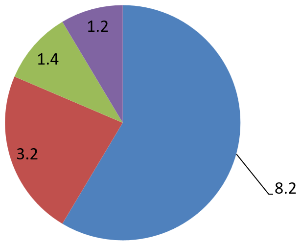

## **Áttekintés**

Az adatcímkék egy diagramon részleteket mutatnak a diagram adat-sorozatairól vagy egyes adatpontokról. Lehetővé teszik az olvasók számára, hogy gyorsan azonosítsák az adat-sorozatokat, és megkönnyítik a diagramok megértését. Az Aspose.Slides for Python esetén engedélyezhet, testreszabhat és formázhat adatcímkéket bármely diagramhoz – kiválaszthatja, hogy mi jelenjen meg (értékek, százalékok, sorozat vagy kategória neve), hol helyezkedjenek el a címkék, és hogy hogyan nézzenek ki (betűtípus, számformátum, elválasztók, vezetővonalak és egyebek). Ez a cikk bemutatja a szükséges API‑kat és példákat, amelyekkel világos, informatív címkéket adhat diagramjaihoz.

## **Adatcímke pontosságának beállítása**

A diagram adatcímkéi gyakran számértékeket jelenítenek meg, amelyekhez egységes pontosság szükséges. Ez a rész bemutatja, hogyan szabályozhatja a tizedesjegyek számát az adatcímkéknél az Aspose.Slides-ben egy megfelelő számformátum alkalmazásával.

Az alábbi Python példában látható, hogyan állítható be a numerikus pontosság a diagram adatcímkéknél:

```py
import aspose.slides as slides
import aspose.slides.charts as charts

with slides.Presentation() as presentation:
    slide = presentation.slides[0]

    chart = slide.shapes.add_chart(charts.ChartType.LINE, 50, 50, 500, 300)

    series = chart.chart_data.series[0]
    series.labels.default_data_label_format.show_value = True
    series.number_format_of_values = "#,##0.00"

    presentation.save("data_label_precision.pptx", slides.export.SaveFormat.PPTX)
```

## **Százalékok megjelenítése címkékként**

Az Aspose.Slides segítségével megjelenítheti a százalékos értékeket adatcímkeként a diagramokon. Az alábbi példa kiszámítja az egyes pontok arányát a saját kategóriájukban, és a címkét úgy formázza, hogy a százalékot mutassa.

```py
import aspose.slides as slides
import aspose.slides.charts as charts

# Hozzon létre egy példányt a Presentation osztályból.
with slides.Presentation() as presentation:
    slide = presentation.slides[0]

    chart = slide.shapes.add_chart(charts.ChartType.STACKED_COLUMN, 20, 20, 600, 400)
    series = chart.chart_data.series[0]

    total_for_categories = [0]*len(chart.chart_data.categories)
    for k in range(len(chart.chart_data.categories)):
        for i in range(len(chart.chart_data.series)):
            total_for_categories[k] += chart.chart_data.series[i].data_points[k].value.data

    for i in range(len(chart.chart_data.series)):
        series = chart.chart_data.series[i]
        series.labels.default_data_label_format.show_legend_key = False

        for j in range(len(series.data_points)):
            data_point_percent = series.data_points[j].value.data / total_for_categories[j] * 100

            text_portion = slides.Portion()
            text_portion.text = "{0:.2f} %".format(data_point_percent)
            text_portion.portion_format.font_height = 8

            label = series.data_points[j].label
            label.text_frame_for_overriding.text = ""

            paragraph = label.text_frame_for_overriding.paragraphs[0]
            paragraph.portions.add(text_portion)

            label.data_label_format.show_series_name = False
            label.data_label_format.show_percentage = False
            label.data_label_format.show_legend_key = False
            label.data_label_format.show_category_name = False
            label.data_label_format.show_bubble_size = False

    # Mentse el a prezentációt, amely tartalmazza a diagramot.
    presentation.save("percentage_as_label.pptx", slides.export.SaveFormat.PPTX)
```

## **Százalékjelek megjelenítése diagram adatcímkékkel**

Ez a rész bemutatja, hogyan jeleníthető meg a százalék az adatcímkékben, és hogyan adható hozzá a százalékjel az Aspose.Slides használatával. Megtanulhatja, hogyan engedélyezheti a százalékos értékeket egész sorozatokra vagy konkrét pontokra (ideális kör-, gyűrű- és 100 %-os halmozott diagramoknál), és hogyan szabályozhatja a formázást címke‑beállítások vagy egyedi számformátum segítségével.

Az alábbi Python példa bemutatja, hogyan adhat hozzá százalékjelet egy diagram adatcímkéjéhez:

```py
import aspose.slides as slides
import aspose.slides.charts as charts
import aspose.pydrawing as draw

# Hozzon létre egy példányt a Presentation osztályból.
with slides.Presentation() as presentation:

    # Kapjon egy diára hivatkozást index alapján.
    slide = presentation.slides[0]

    # Hozzon létre egy PercentsStackedColumn diagramot a dián.
    chart = slide.shapes.add_chart(charts.ChartType.PERCENTS_STACKED_COLUMN, 20, 20, 600, 400)

    chart.axes.vertical_axis.is_number_format_linked_to_source = False
    chart.axes.vertical_axis.number_format = "0.00%"

    chart.chart_data.series.clear()

    # Szerezze meg a diagram adat munkafüzetét.
    workbook = chart.chart_data.chart_data_workbook
    worksheet_index = 0

    # Adjon hozzá egy új sorozatot.
    series = chart.chart_data.series.add(workbook.get_cell(worksheet_index, 0, 1, "Reds"), chart.type)
    series.data_points.add_data_point_for_bar_series(workbook.get_cell(worksheet_index, 1, 1, 0.30))
    series.data_points.add_data_point_for_bar_series(workbook.get_cell(worksheet_index, 2, 1, 0.50))
    series.data_points.add_data_point_for_bar_series(workbook.get_cell(worksheet_index, 3, 1, 0.80))
    series.data_points.add_data_point_for_bar_series(workbook.get_cell(worksheet_index, 4, 1, 0.65))

    # Állítsa be a sorozat kitöltő színét.
    series.format.fill.fill_type = slides.FillType.SOLID
    series.format.fill.solid_fill_color.color = draw.Color.red

    # Állítsa be a címke formátumának tulajdonságait.
    series.labels.default_data_label_format.show_value = True
    series.labels.default_data_label_format.is_number_format_linked_to_source = False
    series.labels.default_data_label_format.number_format = "0.0%"
    series.labels.default_data_label_format.text_format.portion_format.font_height = 10
    series.labels.default_data_label_format.text_format.portion_format.fill_format.fill_type = slides.FillType.SOLID
    series.labels.default_data_label_format.text_format.portion_format.fill_format.solid_fill_color.color = draw.Color.white
    series.labels.default_data_label_format.show_value = True

    # Adjon hozzá egy új sorozatot.
    series2 = chart.chart_data.series.add(workbook.get_cell(worksheet_index, 0, 2, "Blues"), chart.type)
    series2.data_points.add_data_point_for_bar_series(workbook.get_cell(worksheet_index, 1, 2, 0.70))
    series2.data_points.add_data_point_for_bar_series(workbook.get_cell(worksheet_index, 2, 2, 0.50))
    series2.data_points.add_data_point_for_bar_series(workbook.get_cell(worksheet_index, 3, 2, 0.20))
    series2.data_points.add_data_point_for_bar_series(workbook.get_cell(worksheet_index, 4, 2, 0.35))

    # Állítsa be a kitöltés típusát és színét.
    series2.format.fill.fill_type = slides.FillType.SOLID
    series2.format.fill.solid_fill_color.color = draw.Color.blue
    series2.labels.default_data_label_format.show_value = True
    series2.labels.default_data_label_format.is_number_format_linked_to_source = False
    series2.labels.default_data_label_format.number_format = "0.0%"
    series2.labels.default_data_label_format.text_format.portion_format.font_height = 10
    series2.labels.default_data_label_format.text_format.portion_format.fill_format.fill_type = slides.FillType.SOLID
    series2.labels.default_data_label_format.text_format.portion_format.fill_format.solid_fill_color.color = draw.Color.white

    # Mentse el a prezentációt.
    presentation.save("percentage_sign.pptx", slides.export.SaveFormat.PPTX)
```

## **Címke távolságának beállítása a tengelytől**

Ez a rész bemutatja, hogyan szabályozható a távolság az adatcímkék és a diagram tengelye között az Aspose.Slides-ben. Ennek a távolságnak a módosítása segít elkerülni az átfedéseket és javítja az olvashatóságot a sűrű vizualizációkban.

Az alábbi Python kódban látható, hogyan állítható be a címke távolsága a kategória tengelytől, ha tengely‑alapú diagramot használ:

```py
import aspose.slides as slides
import aspose.slides.charts as charts

# Hozzon létre egy példányt a Presentation osztályból.
with slides.Presentation() as presentation:
    # Szerezzen egy diára hivatkozást.
    slide = presentation.slides[0]

    # Hozzon létre egy klaszterezett oszlopdiagramot a dián.
    chart = slide.shapes.add_chart(charts.ChartType.CLUSTERED_COLUMN, 20, 20, 500, 300)

    # Állítsa be a címke távolságát a kategória (vízszintes) tengelytől.
    chart.axes.horizontal_axis.label_offset = 500

    # Mentse el a prezentációt.
    presentation.save("axis_label_distance.pptx", slides.export.SaveFormat.PPTX)
```

## **Címke pozíciójának módosítása**

Ha olyan diagramot hoz létre, amely nem használ tengelyeket, például kördiagramot, az adatcímkék túl közel lehetnek a széléhez. Ebben az esetben állítsa be a címke pozícióját, hogy a vezetővonalak egyértelműen láthatóak legyenek.

Az alábbi Python kódban látható, hogyan módosítható a címke pozíciója egy kördiagramon:

```python
import aspose.slides as slides
import aspose.slides.charts as charts

with slides.Presentation() as presentation:
    slide = presentation.slides[0]

    chart = slide.shapes.add_chart(charts.ChartType.PIE, 50, 50, 600, 300)

    series = chart.chart_data.series[0]
    series.labels.default_data_label_format.show_value = True
    series.labels.default_data_label_format.show_leader_lines = True

    label = series.labels[0]
    label.data_label_format.position = charts.LegendDataLabelPosition.OUTSIDE_END

    label.x = 0.05
    label.y = 0.1

    presentation.save("presentation.pptx", slides.export.SaveFormat.PPTX)
```



## **FAQ**

**Hogyan akadályozhatom meg, hogy az adatcímkék átfedjék egymást sűrű diagramokon?**

Kombinálja az automatikus címkeelhelyezést, a vezetővonalakat és a kisebb betűméretet; ha szükséges, rejtse el egyes mezőket (például a kategóriát), vagy csak a szélsőséges/kulcsfontosságú pontoknál jelenítsen meg címkéket.

**Hogyan tilthatom le a címkéket csak a null, negatív vagy üres értékek esetén?**

Szűrje meg az adatpontokat a címkék engedélyezése előtt, és kapcsolja ki a megjelenítést 0, negatív vagy hiányzó értékek esetén egy meghatározott szabály szerint.

**Hogyan biztosíthatom a címkék egységes stílusát PDF/képek exportálásakor?**

Állítsa be kifejezetten a betűtípusokat (család, méret), és ellenőrizze, hogy a betűtípus elérhető-e a rendereléshez használt oldalon, hogy elkerülje a helyettesítő betűtípus használatát.