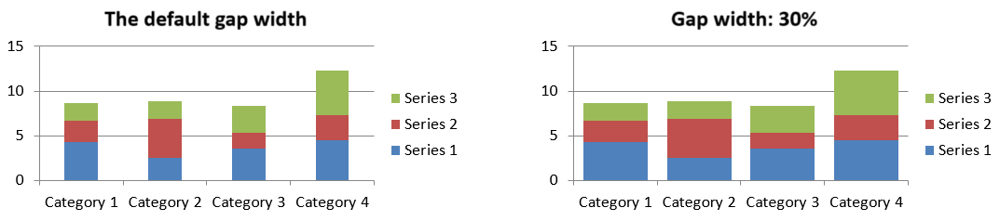

## **Áttekintés**

Ez a cikk leírja a [ChartSeries](https://reference.aspose.com/slides/hu/python-net/aspose.slides.charts/chartseries/) szerepét az Aspose.Slides for Python-ban, különös tekintettel arra, hogyan vannak az adatok struktúráltak és megjelenítve a prezentációkban. Ezek az objektumok az alapvető elemeket biztosítják, amelyek egyedi adatpontkészleteket, kategóriákat és megjelenési paramétereket definiálnak egy diagramon. A [ChartSeries](https://reference.aspose.com/slides/hu/python-net/aspose.slides.charts/chartseries/) használatával a fejlesztők zökkenőmentesen integrálhatják az adatforrásokat, és teljes irányítást gyakorolhatnak az információk megjelenítése felett, ami dinamikus, adat‑vezérelt prezentációkat eredményez, amelyek világosan közvetítik az elemzéseket és a meglátásokat.

Egy sorozat egy sor vagy oszlop szám, amely egy diagramon ábrázolva van.


## **Sorozat átfedés beállítása**

A [ChartSeries.overlap](https://reference.aspose.com/slides/hu/python-net/aspose.slides.charts/chartseries/overlap/) tulajdonság szabályozza, hogy a sávok és oszlopok hogyan fednek át egy 2D diagramon, egy -100 és 100 közötti tartomány megadásával. Mivel ez a tulajdonság a sorozatcsoporthoz kapcsolódik, nem az egyes diagram sorozatokhoz, sorozatszinten csak olvasható. Az átfedési értékek beállításához használja a `parent_series_group.overlap` olvasási/írási tulajdonságot, amely a megadott átfedést az adott csoport összes sorozatára alkalmazza.

Az alábbi Python példa bemutatja, hogyan hozhatunk létre egy prezentációt, adhatunk hozzá egy csoportosított oszlopdiagramot, érhetjük el az első diagram sorozatot, állíthatjuk be az átfedés beállítást, majd menthetjük az eredményt PPTX fájlként:

```py
import aspose.slides as slides
import aspose.slides.charts as charts

series_overlap = 30

with slides.Presentation() as presentation:
    slide = presentation.slides[0]

    # Adjunk hozzá egy csoportosított oszlopdiagramot alapértelmezett adatokkal.
    chart = slide.shapes.add_chart(charts.ChartType.CLUSTERED_COLUMN, 20, 20, 500, 200)

    series = chart.chart_data.series[0]
    if series.overlap == 0:
        # Állítsuk be a sorozat átfedését.
        series.parent_series_group.overlap = series_overlap

    # Mentsük a prezentáció fájlt a lemezen.
    presentation.save("series_overlap.pptx", slides.export.SaveFormat.PPTX)
```

Az eredmény:


## **Sorozat kitöltőszín módosítása**

Az Aspose.Slides egyszerűvé teszi a diagram sorozatok kitöltőszíneinek testreszabását, lehetővé téve egyes adatpontok kiemelését és vizuálisan vonzó diagramok létrehozását. Ezt a [Format](https://reference.aspose.com/slides/hu/python-net/aspose.slides.charts/format/) objektum teszi lehetővé, amely különféle kitöltési típusokat, színbeállításokat és egyéb fejlett stílusopciókat támogat. Miután egy diagramot hozzáadtunk egy diára, és elértük a kívánt sorozatot, egyszerűen szerezze be a sorozatot, és alkalmazza a megfelelő kitöltőszínt. A szilárd kitöltések mellett használhat gradiens vagy minta kitöltéseket is a tervezési rugalmasság növeléséhez. Miután beállította a színeket az igényei szerint, mentse a prezentációt a frissített megjelenés befejezéséhez.

Az alábbi Python kódrészlet bemutatja, hogyan változtatható meg az első sorozat színe:

```py
import aspose.slides as slides
import aspose.slides.charts as charts
import aspose.pydrawing as draw

series_color = draw.Color.blue

with slides.Presentation() as presentation:
    slide = presentation.slides[0]

    # Adjunk hozzá egy csoportosított oszlopdiagramot alapértelmezett adatokkal.
    chart = slide.shapes.add_chart(charts.ChartType.CLUSTERED_COLUMN, 20, 20, 500, 200)

    # Állítsuk be az első sorozat színét.
    series = chart.chart_data.series[0]
    series.format.fill.fill_type = slides.FillType.SOLID
    series.format.fill.solid_fill_color.color = series_color

    # Mentsük a prezentáció fájlt a lemezen.
    presentation.save("series_color.pptx", slides.export.SaveFormat.PPTX)
```

Az eredmény:


## **Sorozat átnevezése**

Az Aspose.Slides egyszerű módot kínál a diagram sorozatok nevének módosítására, megkönnyítve az adatok világos és érthető címkézését. A diagram adataiban a megfelelő munkalap cellájához hozzáférve a fejlesztők testre szabhatják az adatmegjelenítést. Ez a módosítás különösen hasznos, ha a sorozatneveket az adatok kontextusa alapján kell frissíteni vagy tisztázni. A sorozat átnevezése után a prezentáció menthető a változások megőrzéséhez.

Az alábbi Python kódrészlet bemutatja ezt a folyamatot gyakorlatban.

```py
import aspose.slides as slides
import aspose.slides.charts as charts

series_name = "New name"

with slides.Presentation() as presentation:
    slide = presentation.slides[0]

    # Adjunk hozzá egy csoportosított oszlopdiagramot alapértelmezett adatokkal.
    chart = slide.shapes.add_chart(charts.ChartType.CLUSTERED_COLUMN, 20, 20, 500, 200)
    
    # Állítsuk be az első sorozat nevét.
    series_cell = chart.chart_data.chart_data_workbook.get_cell(0, 0, 1)
    series_cell.value = series_name
    
    # Mentsük a prezentáció fájlt a lemezen.
    presentation.save("series_name.pptx", slides.export.SaveFormat.PPTX)
```

Az alábbi Python kód egy alternatív módot mutat a sorozat nevének megváltoztatására:

```py
import aspose.slides as slides
import aspose.slides.charts as charts

series_name = "New name"

with slides.Presentation() as presentation:
    slide = presentation.slides[0]

    # Adjunk hozzá egy csoportosított oszlopdiagramot alapértelmezett adatokkal.
    chart = slide.shapes.add_chart(charts.ChartType.CLUSTERED_COLUMN, 20, 20, 500, 200)
    series = chart.chart_data.series[0]
    
    # Állítsuk be az első sorozat nevét.
    series.name.as_cells[0].value = series_name

    # Mentsük a prezentáció fájlt a lemezen.
    presentation.save("series_name.pptx", slides.export.SaveFormat.PPTX) 
```

Az eredmény:


## **Automatikus sorozat kitöltőszín lekérése**

Az Aspose.Slides for Python lehetővé teszi, hogy lekérje a diagram sorozatok automatikus kitöltőszínét egy ábrázoló területen belül. A [Presentation](https://reference.aspose.com/slides/hu/python-net/aspose.slides/presentation/) osztály egy példányának létrehozása után index alapján hivatkozhat a kívánt diára, majd hozzáadhat egy diagramot a választott típusban (például `ChartType.CLUSTERED_COLUMN`). A diagram sorozatainak elérésével lekérhető az automatikus kitöltőszín.

Az alábbi Python kód részletesen bemutatja ezt a folyamatot.

```py
import aspose.slides as slides
import aspose.slides.charts as charts

with slides.Presentation() as presentation:
    slide = presentation.slides[0]

    # Adjunk hozzá egy csoportosított oszlopdiagramot alapértelmezett adatokkal.
    chart = slide.shapes.add_chart(charts.ChartType.CLUSTERED_COLUMN, 20, 20, 500, 200)

    for i in range(len(chart.chart_data.series)):
        # Szerezze meg a sorozat kitöltőszínét.
        color = chart.chart_data.series[i].get_automatic_series_color()
        print(f"Series {i} color: {color.name}")
```

Példa kimenet:

```text
Series 0 color: ff4f81bd
Series 1 color: ffc0504d
Series 2 color: ff9bbb59
```

## **Inverz kitöltőszínek beállítása egy sorozathoz**

Amikor egy adat sorozat pozitív és negatív értékeket is tartalmaz, minden oszlop vagy sáv egyforma színnel való színezése nehezíti a diagram olvasását. Az Aspose.Slides for Python lehetővé teszi egy invertált kitöltőszín hozzárendelését – egy külön kitöltés, amely automatikusan alkalmazódik a nullánál alacsonyabb adatpontokra – így a negatív értékek egy pillantással kiemelkednek. Ebben a szakaszban megtanulja, hogyan engedélyezze ezt az opciót, válasszon megfelelő színt, és mentse el a frissített prezentációt.

Az alábbi kódrészlet bemutatja a műveletet:

```py
import aspose.slides as slides
import aspose.slides.charts as charts
import aspose.pydrawing as draw

invert_color = draw.Color.red

with slides.Presentation() as presentation:
    slide = presentation.slides[0]

    chart = slide.shapes.add_chart(charts.ChartType.CLUSTERED_COLUMN, 20, 20, 500, 200)
    workBook = chart.chart_data.chart_data_workbook

    chart.chart_data.series.clear()
    chart.chart_data.categories.clear()

    # Új kategóriák hozzáadása.
    chart.chart_data.categories.add(workBook.get_cell(0, 1, 0, "Category 1"))
    chart.chart_data.categories.add(workBook.get_cell(0, 2, 0, "Category 2"))
    chart.chart_data.categories.add(workBook.get_cell(0, 3, 0, "Category 3"))

    # Új sorozat hozzáadása.
    series = chart.chart_data.series.add(workBook.get_cell(0, 0, 1, "Series 1"), chart.type)

    # Töltsük fel a sorozat adataival.
    series.data_points.add_data_point_for_bar_series(workBook.get_cell(0, 1, 1, -20))
    series.data_points.add_data_point_for_bar_series(workBook.get_cell(0, 2, 1, 50))
    series.data_points.add_data_point_for_bar_series(workBook.get_cell(0, 3, 1, -30))

    # A sorozat színbeállításainak megadása.
    series_color = series.get_automatic_series_color()
    series.invert_if_negative = True
    series.format.fill.fill_type = slides.FillType.SOLID
    series.format.fill.solid_fill_color.color = series_color
    series.inverted_solid_fill_color.color = invert_color
    presentation.save("inverted_solid_fill_color.pptx", slides.export.SaveFormat.PPTX)
```

Az eredmény:


Invertálhatja a kitöltőszínt egyetlen adatpont esetén is, a teljes sorozat helyett. Egyszerűen érje el a kívánt `ChartDataPoint`‑ot, és állítsa be a `invert_if_negative` tulajdonságát `True`‑ra.

Az alábbi kódrészlet bemutatja, hogyan tehető ez:

```py
import aspose.slides as slides
import aspose.slides.charts as charts
import aspose.pydrawing as draw

with slides.Presentation() as presentation:
    slide = presentation.slides[0]

	chart = slide.shapes.add_chart(charts.ChartType.CLUSTERED_COLUMN, 20, 20, 500, 200, True)
	chart.chart_data.series.clear()

	series = series.add(chart.chart_data.chart_data_workbook.get_cell(0, "B1"), chart.type)

	series.data_points.add_data_point_for_bar_series(chart.chart_data.chart_data_workbook.get_cell(0, "B2", -5))
	series.data_points.add_data_point_for_bar_series(chart.chart_data.chart_data_workbook.get_cell(0, "B3", 3))
	series.data_points.add_data_point_for_bar_series(chart.chart_data.chart_data_workbook.get_cell(0, "B4", -3))
	series.data_points.add_data_point_for_bar_series(chart.chart_data.chart_data_workbook.get_cell(0, "B5", 1))

	series.invert_if_negative = False
	series.data_points[2].invert_if_negative = True

	presentation.save("data_point_invert_color_if_negative.pptx", slides.export.SaveFormat.PPTX)
```

## **Adatok törlése bizonyos adatpontok számára**

Néha egy diagram tesztértékeket, kiugró vagy elavult bejegyzéseket tartalmaz, amelyeket újraszervezés nélkül kell eltávolítani. Az Aspose.Slides for Python lehetővé teszi, hogy index alapján bármelyik adatpontot kiválassza, törölje annak tartalmát, és azonnal frissítse a diagramot, így a maradék pontok eltolódnak, és a tengelyek automatikusan újraméreteződnek.

Az alábbi kódrészlet bemutatja a műveletet:

```py
import aspose.slides as slides
import aspose.slides.charts as charts

with slides.Presentation("test_chart.pptx") as presentation:
    slide = presentation.slides[0]
    chart = slide.shapes[0]
    series = chart.chart_data.series[0]

    for data_point in series.data_points:
        data_point.x_value.as_cell.value = None
        data_point.y_value.as_cell.value = None

    series.data_points.clear()

    presentation.save("clear_data_points.pptx", slides.export.SaveFormat.PPTX)
```

## **Sorozat hézag szélességének beállítása**

A hézag szélessége szabályozza az egymás melletti oszlopok vagy sávok közötti üres tér mennyiségét – a szélesebb hézagok kiemelik az egyes kategóriákat, míg a szűkebb hézagok sűrűbb, kompaktabb megjelenést eredményeznek. Az Aspose.Slides for Python segítségével ezt a paramétert a teljes sorozatra finoman hangolhatja, pontosan azt a vizuális egyensúlyt elérve, amelyre a prezentációjának szüksége van, anélkül, hogy az alapul szolgáló adatokat módosítaná.

Az alábbi kódrészlet bemutatja, hogyan állítható be a hézag szélessége egy sorozatra:

```py
import aspose.slides as slides
import aspose.slides.charts as charts

gap_width = 30

# Üres prezentáció létrehozása.
with slides.Presentation() as presentation:

    # Az első dia elérése.
    slide = presentation.slides[0]

    # Diagram hozzáadása alapértelmezett adatokkal.
    chart = slide.shapes.add_chart(charts.ChartType.STACKED_COLUMN, 20, 20, 500, 200)

    # Prezentáció mentése a lemezen.
    presentation.save("default_gap_width.pptx", slides.export.SaveFormat.PPTX)

    # A gap_width érték beállítása.
    series = chart.chart_data.series[0]
    series.parent_series_group.gap_width = gap_width

    # Prezentáció mentése a lemezen.
    presentation.save("gap_width_30.pptx", slides.export.SaveFormat.PPTX)
```

Az eredmény:



## **FAQ**

**Van valamilyen korlát, hogy egy diagram hány sorozatot tartalmazhat?**

Az Aspose.Slides nem határoz meg rögzített felső határt a sorozatok számát illetően. A gyakorlati korlátot a diagram olvashatósága és az alkalmazás rendelkezésre álló memóriája határozza meg.

**Mi a teendő, ha a klaszterben lévő oszlopok túl közel vannak egymáshoz vagy túl messze?**

Állítsa a [gap_width](https://reference.aspose.com/slides/hu/python-net/aspose.slides.charts/chartseries/gap_width/) értékét az adott sorozatra (vagy annak szülő sorozatcsoportjára). Az érték növelése szélesíti az oszlopok közti távolságot, a csökkentése pedig közelebb hozza őket.