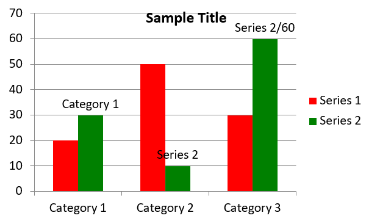

## **Áttekintés**

Ez a cikk átfogó útmutatót nyújt arról, hogyan hozhatunk létre és testre szabhatunk diagramokat az Aspose.Slides for Python via .NET segítségével. Megtanulhatja, hogyan adhat programozott módon diagramot egy diára, hogyan töltheti fel adatokka­l, és hogyan alkalmazhat különféle formázási beállításokat a konkrét tervezési igényeihez igazodva. A cikk során részletes kódrészletek mutatják be minden lépést, a bemutató és a diagramobjektum inicializálásától a sorok, tengelyek és jelmagyarázat beállításáig. Az útmutató követésével szilárd tapasztalatot szerez a dinamikus diagramgenerálás integrálásáról alkalmazásaiba, megkönnyítve az adat‑vezérelt bemutatók elkészítését.

## **Diagram létrehozása**

A diagramok segítenek az embereknek gyorsan megjeleníteni az adatokat, és olyan meglátásokat nyerni, amelyek egy táblázatból vagy munkafüzérből nem lennének azonnal nyilvánvalóak.

**Miért érdemes diagramokat létrehozni?**

Diagramok használatával:

* nagy mennyiségű adatot aggregálhat, tömöríthet vagy összefoglalhat egyetlen dián a bemutatóban;
* mintákat és trendeket tárhat fel az adatokban;
* meghatározhatja az adatok időbeli vagy egy adott mértékegység szerinti irányát és lendületét;
* kiemelheti az outliereket, hibákat, eltéréseket és értelmetlen adatokat;
* bonyolult adatokat kommunikálhat vagy prezentálhat.

A PowerPointban a *Insert* (Beszúrás) funkcióval hozhat létre diagramokat, amely számos sablont kínál különböző diagramtípusokhoz. Az Aspose.Slides segítségével létrehozhat mind szokványos diagramokat (népszerű típusok alapján), mind egyedi diagramokat.

{} 

Használja a [ChartType](https://reference.aspose.com/slides/hu/python-net/aspose.slides.charts/charttype/) felsorolást az [Aspose.Slides.Charts](https://reference.aspose.com/slides/hu/python-net/aspose.slides.charts/) névtérben. Ennek a felsorolásnak az értékei a különböző diagramtípusoknak felelnek meg.

{} 

### **Csoportosított oszlopdiagramok létrehozása**

Ez a rész azt mutatja be, hogyan hozhatók létre csoportosított oszlopdiagramok az Aspose.Slides for Python via .NET segítségével. Megtanulja, hogyan inicializáljon egy prezentációt, adjon hozzá diagramot, és testre szabja annak elemeit, például a címet, az adatokat, a sorokat, a kategóriákat és a stílust. Kövesse az alábbi lépéseket a szabványos csoportosított oszlopdiagram generálásához:

1. Hozzon létre egy példányt a [Presentation](https://reference.aspose.com/slides/hu/python-net/aspose.slides/presentation/) osztályból.
1. Szerezzen hivatkozást egy diára a indexe alapján.
1. Adjon hozzá egy diagramot némi adattal, és adja meg a `ChartType.CLUSTERED_COLUMN` típust.
1. Adjon címet a diagramnak.
1. Szerezze meg a diagram adatmunka­lapi‑lapját.
1. Törölje az összes alapértelmezett sorozatot és kategóriát.
1. Adjon hozzá új sorozatokat és kategóriákat.
1. Adjon hozzá új diagramadatot a diagram sorozatához.
1. Alkalmazzon kitöltőszínt a diagram sorozatra.
1. Adjon címkéket a diagram sorozathoz.
1. Mentse a módosított prezentációt PPTX fájlként.

Ez a Python‑kód bemutatja a csoportosított oszlopdiagram létrehozását:

```py
import aspose.slides.charts as charts
import aspose.slides as slides
import aspose.pydrawing as draw

# A Presentation osztály példányosítása, amely egy PPTX fájlt képvisel.
with slides.Presentation() as presentation:

    # Az első diához való hozzáférés.
    slide = presentation.slides[0]

    # Csoportosított oszlopdiagram hozzáadása alapértelmezett adatával.
    chart = slide.shapes.add_chart(charts.ChartType.CLUSTERED_COLUMN, 20, 20, 500, 300)

    # A diagram címének beállítása.
    chart.chart_title.add_text_frame_for_overriding("Sample Title")
    chart.chart_title.text_frame_for_overriding.text_frame_format.center_text = slides.NullableBool.TRUE
    chart.chart_title.height = 20
    chart.has_title = True

    # Az első sorozat beállítása az értékek megjelenítésére.
    chart.chart_data.series[0].labels.default_data_label_format.show_value = True

    # A diagram adatlap indexének beállítása.
    worksheet_index = 0

    # A diagram adatkönyvtárának lekérése.
    workbook = chart.chart_data.chart_data_workbook

    # Az alapértelmezett generált sorozatok és kategóriák törlése.
    chart.chart_data.series.clear()
    chart.chart_data.categories.clear()

    # Új sorozatok hozzáadása.
    chart.chart_data.series.add(workbook.get_cell(worksheet_index, 0, 1, "Series 1"), chart.type)
    chart.chart_data.series.add(workbook.get_cell(worksheet_index, 0, 2, "Series 2"), chart.type)

    # Új kategóriák hozzáadása.
    chart.chart_data.categories.add(workbook.get_cell(worksheet_index, 1, 0, "Category 1"))
    chart.chart_data.categories.add(workbook.get_cell(worksheet_index, 2, 0, "Category 2"))
    chart.chart_data.categories.add(workbook.get_cell(worksheet_index, 3, 0, "Category 3"))

    # Az első diagram sorozat lekérése.
    series = chart.chart_data.series[0]

    # A sorozat adatainak feltöltése.
    series.data_points.add_data_point_for_bar_series(workbook.get_cell(worksheet_index, 1, 1, 20))
    series.data_points.add_data_point_for_bar_series(workbook.get_cell(worksheet_index, 2, 1, 50))
    series.data_points.add_data_point_for_bar_series(workbook.get_cell(worksheet_index, 3, 1, 30))

    # Kitöltőszín beállítása a sorozathoz.
    series.format.fill.fill_type = slides.FillType.SOLID
    series.format.fill.solid_fill_color.color = draw.Color.red

    # A második diagram sorozat lekérése.
    series = chart.chart_data.series[1]

    # A sorozat adatainak feltöltése.
    series.data_points.add_data_point_for_bar_series(workbook.get_cell(worksheet_index, 1, 2, 30))
    series.data_points.add_data_point_for_bar_series(workbook.get_cell(worksheet_index, 2, 2, 10))
    series.data_points.add_data_point_for_bar_series(workbook.get_cell(worksheet_index, 3, 2, 60))

    # Kitöltőszín beállítása a sorozathoz.
    series.format.fill.fill_type = slides.FillType.SOLID
    series.format.fill.solid_fill_color.color = draw.Color.green

    # Az első címke beállítása a kategórianév megjelenítésére.
    label = series.data_points[0].label
    label.data_label_format.show_category_name = True

    label = series.data_points[1].label
    label.data_label_format.show_series_name = True

    # A sorozat beállítása, hogy a harmadik címkén megjelenjen az érték.
    label = series.data_points[2].label
    label.data_label_format.show_value = True
    label.data_label_format.show_series_name = True
    label.data_label_format.separator = "/"
                
    # A prezentáció mentése lemezre PPTX fájlként.
    presentation.save("ClusteredColumnChart.pptx", slides.export.SaveFormat.PPTX)
```

Az eredmény:



### **Pontdiagramok (Scatter) létrehozása**

A pontdiagramok (más néven szórási diagramok vagy x‑y grafikonok) gyakran használatosak minták keresésére vagy két változó közötti korrelációk bemutatására.

Használjon pontdiagramot, ha:

* párosított numerikus adatai vannak;
* két változó jól párosítható;
* meg szeretné állapítani, hogy a két változó összefügg-e;
* egy független változó több értékkel rendelkezik egy függő változóhoz képest.

Ez a Python‑kód bemutatja, hogyan hozhat létre pontdiagramot különböző jelölő‑sorozatokkal:

```py
import aspose.slides.charts as charts
import aspose.slides as slides
import aspose.pydrawing as draw

# A Presentation osztály példányosítása.
with slides.Presentation() as presentation:

    # Az első diához való hozzáférés.
    slide = presentation.slides[0]

    # Az alapértelmezett pontdiagram (scatter) létrehozása.
    chart = slide.shapes.add_chart(charts.ChartType.SCATTER_WITH_SMOOTH_LINES, 20, 20, 500, 300)

    # A diagram adatlap indexének beállítása.
    worksheet_index = 0

    # A diagram adatkönyvtárának lekérése.
    workbook = chart.chart_data.chart_data_workbook

    # Az alapértelmezett sorozat törlése.
    chart.chart_data.series.clear()

    # Új sorozatok hozzáadása.
    chart.chart_data.series.add(workbook.get_cell(worksheet_index, 1, 1, "Series 1"), chart.type)
    chart.chart_data.series.add(workbook.get_cell(worksheet_index, 1, 3, "Series 2"), chart.type)

    # Az első diagram sorozat lekérése.
    series = chart.chart_data.series[0]

    # Új pont hozzáadása (1:3) a sorozathoz.
    series.data_points.add_data_point_for_scatter_series(workbook.get_cell(worksheet_index, 2, 1, 1), workbook.get_cell(worksheet_index, 2, 2, 3))

    # Új pont hozzáadása (2:10).
    series.data_points.add_data_point_for_scatter_series(workbook.get_cell(worksheet_index, 3, 1, 2), workbook.get_cell(worksheet_index, 3, 2, 10))

    # A sorozat típusának módosítása.
    series.type = charts.ChartType.SCATTER_WITH_STRAIGHT_LINES_AND_MARKERS

    # A diagram sorozat jelölőjének módosítása.
    series.marker.size = 10
    series.marker.symbol = charts.MarkerStyleType.STAR

    # A második diagram sorozat lekérése.
    series = chart.chart_data.series[1]

    # Új pont hozzáadása (5:2) a diagram sorozathoz.
    series.data_points.add_data_point_for_scatter_series(workbook.get_cell(worksheet_index, 2, 3, 5), workbook.get_cell(worksheet_index, 2, 4, 2))

    # Új pont hozzáadása (3:1).
    series.data_points.add_data_point_for_scatter_series(workbook.get_cell(worksheet_index, 3, 3, 3), workbook.get_cell(worksheet_index, 3, 4, 1))

    # Új pont hozzáadása (2:2).
    series.data_points.add_data_point_for_scatter_series(workbook.get_cell(worksheet_index, 4, 3, 2), workbook.get_cell(worksheet_index, 4, 4, 2))

    # Új pont hozzáadása (5:1).
    series.data_points.add_data_point_for_scatter_series(workbook.get_cell(worksheet_index, 5, 3, 5), workbook.get_cell(worksheet_index, 5, 4, 1))

    # A diagram sorozat jelölőjének módosítása.
    series.marker.size = 10
    series.marker.symbol = charts.MarkerStyleType.CIRCLE

    presentation.save("ScatterChart.pptx", slides.export.SaveFormat.PPTX)
```

Az eredmény:


### **Kördiagramok létrehozása**

A kördiagramok leginkább a rész‑egész viszony bemutatására alkalmasak, különösen, ha a adatok kategóriákat tartalmaznak numerikus értékekkel. Ha azonban sok rész vagy címke szerepel az adatokban, érdemesebb oszlopdiagramot használni.

1. Hozzon létre egy példányt a [Presentation](https://reference.aspose.com/slides/hu/python-net/aspose.slides/presentation/) osztályból.
1. Szerezzen hivatkozást egy diára a indexe alapján.
1. Adjon hozzá egy diagramot alapértelmezett adatokkal, és adja meg a `ChartType.PIE` típust.
1. Szerezze meg a diagram adatkönyvtárát ([ChartDataWorkbook](https://reference.aspose.com/slides/hu/python-net/aspose.slides.charts/chartdataworkbook/)).
1. Törölje az alapértelmezett sorozatokat és kategóriákat.
1. Adjon hozzá új sorozatokat és kategóriákat.
1. Adjon hozzá új diagramadatot a diagram sorozatához.
1. Adjon hozzá új pontokat a diagramhoz, és alkalmazzon egyedi színeket a kördiagram szeleteire.
1. Állítson be címkéket a sorozathoz.
1. Engedélyezze a vezetővonalakat a sorozatcímkékhez.
1. Állítsa be a kördiagram forgatási szögét.
1. Mentse a módosított prezentációt PPTX fájlként.

Ez a Python‑kód bemutatja a kördiagram létrehozását:

```py
import aspose.slides.charts as charts
import aspose.slides as slides
import aspose.pydrawing as draw

# A Presentation osztály példányosítása, amely egy PPTX fájlt képvisel.
with slides.Presentation() as presentation:

    # Az első diához való hozzáférés.
    slide = presentation.slides[0]

    # Diagram hozzáadása alapértelmezett adatával.
    chart = slide.shapes.add_chart(charts.ChartType.PIE, 20, 20, 500, 300)

    # A diagram címének beállítása.
    chart.chart_title.add_text_frame_for_overriding("Sample Title")
    chart.chart_title.text_frame_for_overriding.text_frame_format.center_text = slides.NullableBool.TRUE
    chart.chart_title.height = 20
    chart.has_title = True

    # Az első sorozat beállítása az értékek megjelenítésére.
    chart.chart_data.series[0].labels.default_data_label_format.show_value = True

    # A diagram adatlap indexének beállítása.
    worksheet_index = 0

    # A diagram adatkönyvtárának lekérése.
    workbook = chart.chart_data.chart_data_workbook

    # Az alapértelmezett generált sorozatok és kategóriák törlése.
    chart.chart_data.series.clear()
    chart.chart_data.categories.clear()

    # Új kategóriák hozzáadása.
    chart.chart_data.categories.add(workbook.get_cell(0, 1, 0, "First Qtr"))
    chart.chart_data.categories.add(workbook.get_cell(0, 2, 0, "2nd Qtr"))
    chart.chart_data.categories.add(workbook.get_cell(0, 3, 0, "3rd Qtr"))

    # Új sorozatok hozzáadása.
    series = chart.chart_data.series.add(workbook.get_cell(0, 0, 1, "Series 1"), chart.type)

    # A sorozat adatainak feltöltése.
    series.data_points.add_data_point_for_pie_series(workbook.get_cell(worksheet_index, 1, 1, 20))
    series.data_points.add_data_point_for_pie_series(workbook.get_cell(worksheet_index, 2, 1, 50))
    series.data_points.add_data_point_for_pie_series(workbook.get_cell(worksheet_index, 3, 1, 30))

    # A szelet színének beállítása.
    chart.chart_data.series_groups[0].is_color_varied = True

    point = series.data_points[0]
    point.format.fill.fill_type = slides.FillType.SOLID
    point.format.fill.solid_fill_color.color = draw.Color.cyan

    # A szelet szegélyének beállítása.
    point.format.line.fill_format.fill_type = slides.FillType.SOLID
    point.format.line.fill_format.solid_fill_color.color = draw.Color.gray
    point.format.line.width = 3.0
    point.format.line.style = slides.LineStyle.THIN_THICK
    point.format.line.dash_style = slides.LineDashStyle.DASH_DOT

    point1 = series.data_points[1]
    point1.format.fill.fill_type = slides.FillType.SOLID
    point1.format.fill.solid_fill_color.color = draw.Color.brown

    # A szelet szegélyének beállítása.
    point1.format.line.fill_format.fill_type = slides.FillType.SOLID
    point1.format.line.fill_format.solid_fill_color.color = draw.Color.blue
    point1.format.line.width = 3.0
    point1.format.line.style = slides.LineStyle.SINGLE
    point1.format.line.dash_style = slides.LineDashStyle.LARGE_DASH_DOT

    point2 = series.data_points[2]
    point2.format.fill.fill_type = slides.FillType.SOLID
    point2.format.fill.solid_fill_color.color = draw.Color.coral

    # A szelet szegélyének beállítása.
    point2.format.line.fill_format.fill_type = slides.FillType.SOLID
    point2.format.line.fill_format.solid_fill_color.color = draw.Color.red
    point2.format.line.width = 2.0
    point2.format.line.style = slides.LineStyle.THIN_THIN
    point2.format.line.dash_style = slides.LineDashStyle.LARGE_DASH_DOT_DOT

    # Egyéni címkék létrehozása az új sorozat minden kategóriájához.
    label1 = series.data_points[0].label

    label1.data_label_format.show_value = True

    label2 = series.data_points[1].label
    label2.data_label_format.show_value = True
    label2.data_label_format.show_legend_key = True
    label2.data_label_format.show_percentage = True

    label3 = series.data_points[2].label
    label3.data_label_format.show_series_name = True
    label3.data_label_format.show_percentage = True

    # A sorozat beállítása, hogy a diagram vezetővonalakat mutasson.
    series.labels.default_data_label_format.show_leader_lines = True

    # A kördiagram szeletek forgatási szögének beállítása.
    chart.chart_data.series_groups[0].first_slice_angle = 180

    # A prezentáció mentése lemezre PPTX fájlként.
    presentation.save("PieChart.pptx", slides.export.SaveFormat.PPTX)
```

Az eredmény:


### **Vonaldiagramok létrehozása**

A vonaldiagramok (más néven vonalgrafikonok) leginkább olyan helyzetekben használatosak, ahol az értékek időbeli változását szeretné bemutatni. Egy vonaldiagram segítségével egyszerre összehasonlíthat nagy mennyiségű adatot, nyomon követheti a változásokat és trendeket az időben, kiemelheti az adat‑sorozatok anomáliáit, és még sok minden mást.

1. Hozzon létre egy példányt a [Presentation](https://reference.aspose.com/slides/hu/python-net/aspose.slides/presentation/) osztályból.
1. Szerezzen hivatkozást egy diára a indexe alapján.
1. Adjon hozzá egy diagramot alapértelmezett adatokkal, és adja meg a `ChartType.LINE` típust.
1. Szerezze meg a diagram adatkönyvtárát ([ChartDataWorkbook](https://reference.aspose.com/slides/hu/python-net/aspose.slides.charts/chartdataworkbook/)).
1. Törölje az alapértelmezett sorozatokat és kategóriákat.
1. Adjon hozzá új sorozatokat és kategóriákat.
1. Adjon hozzá új diagramadatot a diagram sorozatához.
1. Mentse a módosított prezentációt PPTX fájlként.

Ez a Python‑kód bemutatja a vonaldiagram létrehozását:

```python
import aspose.slides as slides

with slides.Presentation() as presentation:
    line_chart = presentation.slides[0].shapes.add_chart(slides.charts.ChartType.LINE, 20, 20, 500, 300)
    
    presentation.save("LineChart.pptx", slides.export.SaveFormat.PPTX)
```

Alapértelmezés szerint a vonaldiagram pontjait egyenes, folyamatos vonalak kötik össze. Ha a pontokat szaggatott vonalakkal szeretné összekötni, adja meg a kívánt szaggatott‑típust a következőképpen:

```python
line_chart = pres.slides[0].shapes.add_chart(slides.charts.ChartType.LINE, 10, 50, 600, 350)

for series in line_chart.chart_data.series:
    series.format.line.dash_style = slides.charts.LineDashStyle.DASH
```

Az eredmény:


### **Fa térképes diagramok létrehozása**

A fa térképes diagramok leginkább eladási adatokhoz alkalmasak, amikor a kategória‑szintű adatok relatív méretét szeretné megjeleníteni, és gyorsan fel szeretné hívni a figyelmet a nagy hozzájárulású elemekre az egyes kategóriákon belül.

1. Hozzon létre egy példányt a [Presentation](https://reference.aspose.com/slides/hu/python-net/aspose.slides/presentation/) osztályból.
1. Szerezzen hivatkozást egy diára a indexe alapján.
1. Adjon hozzá egy diagramot alapértelmezett adatokkal, és adja meg a `ChartType.TREEMAP` típust.
1. Szerezze meg a diagram adatkönyvtárát ([ChartDataWorkbook](https://reference.aspose.com/slides/hu/python-net/aspose.slides.charts/chartdataworkbook/)).
1. Törölje az alapértelmezett sorozatokat és kategóriákat.
1. Adjon hozzá új sorozatokat és kategóriákat.
1. Adjon hozzá új diagramadatot a diagram sorozatához.
1. Mentse a módosított prezentációt PPTX fájlként.

Ez a Python‑kód bemutatja a fa térképes diagram létrehozását:

```py
import aspose.slides.charts as charts
import aspose.slides as slides
import aspose.pydrawing as draw

with slides.Presentation() as presentation:
    chart = presentation.slides[0].shapes.add_chart(charts.ChartType.TREEMAP, 20, 20, 500, 300)
    chart.chart_data.categories.clear()
    chart.chart_data.series.clear()

    workbook = chart.chart_data.chart_data_workbook
    workbook.clear(0)

    # Ág 1
    leaf = chart.chart_data.categories.add(workbook.get_cell(0, "C1", "Leaf1"))
    leaf.grouping_levels.set_grouping_item(1, "Stem1")
    leaf.grouping_levels.set_grouping_item(2, "Branch1")

    chart.chart_data.categories.add(workbook.get_cell(0, "C2", "Leaf2"))

    leaf = chart.chart_data.categories.add(workbook.get_cell(0, "C3", "Leaf3"))
    leaf.grouping_levels.set_grouping_item(1, "Stem2")

    chart.chart_data.categories.add(workbook.get_cell(0, "C4", "Leaf4"))

    # Ág 2
    leaf = chart.chart_data.categories.add(workbook.get_cell(0, "C5", "Leaf5"))
    leaf.grouping_levels.set_grouping_item(1, "Stem3")
    leaf.grouping_levels.set_grouping_item(2, "Branch2")

    chart.chart_data.categories.add(workbook.get_cell(0, "C6", "Leaf6"))

    leaf = chart.chart_data.categories.add(workbook.get_cell(0, "C7", "Leaf7"))
    leaf.grouping_levels.set_grouping_item(1, "Stem4")

    chart.chart_data.categories.add(workbook.get_cell(0, "C8", "Leaf8"))

    series = chart.chart_data.series.add(charts.ChartType.TREEMAP)
    series.labels.default_data_label_format.show_category_name = True
    series.data_points.add_data_point_for_treemap_series(workbook.get_cell(0, "D1", 4))
    series.data_points.add_data_point_for_treemap_series(workbook.get_cell(0, "D2", 5))
    series.data_points.add_data_point_for_treemap_series(workbook.get_cell(0, "D3", 3))
    series.data_points.add_data_point_for_treemap_series(workbook.get_cell(0, "D4", 6))
    series.data_points.add_data_point_for_treemap_series(workbook.get_cell(0, "D5", 9))
    series.data_points.add_data_point_for_treemap_series(workbook.get_cell(0, "D6", 9))
    series.data_points.add_data_point_for_treemap_series(workbook.get_cell(0, "D7", 4))
    series.data_points.add_data_point_for_treemap_series(workbook.get_cell(0, "D8", 3))

    series.parent_label_layout = charts.ParentLabelLayoutType.OVERLAPPING

    presentation.save("TreeMap.pptx", slides.export.SaveFormat.PPTX)
```

Az eredmény:


### **Részvénydiagramok létrehozása**

A részvénydiagramok a nyitó, magas, alacsony és záró árak megjelenítésére szolgálnak, segítve a piaci trendek és volatilitás elemzését. Lényeges betekintést nyújtanak a részvények teljesítményébe, támogatva a befektetőket és elemzőket a megalapozott döntések meghozatalában.

1. Hozzon létre egy példányt a [Presentation](https://reference.aspose.com/slides/hu/python-net/aspose.slides/presentation/) osztályból.
1. Szerezzen hivatkozást egy diára a indexe alapján.
1. Adjon hozzá egy diagramot alapértelmezett adatokkal, és adja meg a `ChartType.OPEN_HIGH_LOW_CLOSE` típust.
1. Szerezze meg a diagram adatkönyvtárát ([ChartDataWorkbook](https://reference.aspose.com/slides/hu/python-net/aspose.slides.charts/chartdataworkbook/)).
1. Törölje az alapértelmezett sorozatokat és kategóriákat.
1. Adjon hozzá új sorozatokat és kategóriákat.
1. Adjon hozzá új diagramadatot a diagram sorozatához.
1. Adja meg a HiLowLines formátumot.
1. Mentse a módosított prezentációt PPTX fájlként.

Ez a Python‑kód bemutatja a részvénydiagram létrehozását:

```py
import aspose.slides.charts as charts
import aspose.slides as slides
import aspose.pydrawing as draw

with slides.Presentation() as presentation:
    chart = presentation.slides[0].shapes.add_chart(charts.ChartType.OPEN_HIGH_LOW_CLOSE, 20, 20, 500, 300, False)

    chart.chart_data.series.clear()
    chart.chart_data.categories.clear()

    workbook = chart.chart_data.chart_data_workbook

    chart.chart_data.categories.add(workbook.get_cell(0, 1, 0, "A"))
    chart.chart_data.categories.add(workbook.get_cell(0, 2, 0, "B"))
    chart.chart_data.categories.add(workbook.get_cell(0, 3, 0, "C"))

    chart.chart_data.series.add(workbook.get_cell(0, 0, 1, "Open"), chart.type)
    chart.chart_data.series.add(workbook.get_cell(0, 0, 2, "High"), chart.type)
    chart.chart_data.series.add(workbook.get_cell(0, 0, 3, "Low"), chart.type)
    chart.chart_data.series.add(workbook.get_cell(0, 0, 4, "Close"), chart.type)

    series = chart.chart_data.series[0]

    series.data_points.add_data_point_for_stock_series(workbook.get_cell(0, 1, 1, 72))
    series.data_points.add_data_point_for_stock_series(workbook.get_cell(0, 2, 1, 25))
    series.data_points.add_data_point_for_stock_series(workbook.get_cell(0, 3, 1, 38))

    series = chart.chart_data.series[1]
    series.data_points.add_data_point_for_stock_series(workbook.get_cell(0, 1, 2, 172))
    series.data_points.add_data_point_for_stock_series(workbook.get_cell(0, 2, 2, 57))
    series.data_points.add_data_point_for_stock_series(workbook.get_cell(0, 3, 2, 57))

    series = chart.chart_data.series[2]
    series.data_points.add_data_point_for_stock_series(workbook.get_cell(0, 1, 3, 12))
    series.data_points.add_data_point_for_stock_series(workbook.get_cell(0, 2, 3, 12))
    series.data_points.add_data_point_for_stock_series(workbook.get_cell(0, 3, 3, 13))

    series = chart.chart_data.series[3]
    series.data_points.add_data_point_for_stock_series(workbook.get_cell(0, 1, 4, 25))
    series.data_points.add_data_point_for_stock_series(workbook.get_cell(0, 2, 4, 38))
    series.data_points.add_data_point_for_stock_series(workbook.get_cell(0, 3, 4, 50))

    chart.chart_data.series_groups[0].up_down_bars.has_up_down_bars = True
    chart.chart_data.series_groups[0].hi_low_lines_format.line.fill_format.fill_type = slides.FillType.SOLID

    for ser in chart.chart_data.series:
        ser.format.line.fill_format.fill_type = slides.FillType.NO_FILL

    presentation.save("StockChart.pptx", slides.export.SaveFormat.PPTX)
```

Az eredmény:


### **Doboz‑és‑szárnyas diagramok létrehozása**

A doboz‑és‑szárnyas diagramok az adateloszlás megjelenítésére szolgálnak, összefoglalva a kulcsfontosságú statisztikai mutatókat, mint például a medián, kvartilisek és lehetséges outlierek. Különösen hasznosak felfedező adat‑elemzésben és statisztikai tanulmányokban, hogy gyorsan megértsék az adatvariabilitást és az esetleges anomáliákat.

1. Hozzon létre egy példányt a [Presentation](https://reference.aspose.com/slides/hu/python-net/aspose.slides/presentation/) osztályból.
1. Szerezzen hivatkozást egy diára a indexe alapján.
1. Adjon hozzá egy diagramot alapértelmezett adatokkal, és adja meg a `ChartType.BOX_AND_WHISKER` típust.
1. Szerezze meg a diagram adatkönyvtárát ([ChartDataWorkbook](https://reference.aspose.com/slides/hu/python-net/aspose.slides.charts/chartdataworkbook/)).
1. Törölje az alapértelmezett sorozatokat és kategóriákat.
1. Adjon hozzá új sorozatokat és kategóriákat.
1. Adjon hozzá új diagramadatot a diagram sorozatához.
1. Mentse a módosított prezentációt PPTX fájlként.

Ez a Python‑kód bemutatja a doboz‑és‑szárnyas diagram létrehozását:

```py
import aspose.slides.charts as charts
import aspose.slides as slides
import aspose.pydrawing as draw

with slides.Presentation() as presentation:
    chart = presentation.slides[0].shapes.add_chart(charts.ChartType.BOX_AND_WHISKER, 20, 20, 500, 300)
    chart.chart_data.categories.clear()
    chart.chart_data.series.clear()

    workbook = chart.chart_data.chart_data_workbook
    workbook.clear(0)

    chart.chart_data.categories.add(workbook.get_cell(0, "A1", "Category 1"))
    chart.chart_data.categories.add(workbook.get_cell(0, "A2", "Category 1"))
    chart.chart_data.categories.add(workbook.get_cell(0, "A3", "Category 1"))
    chart.chart_data.categories.add(workbook.get_cell(0, "A4", "Category 1"))
    chart.chart_data.categories.add(workbook.get_cell(0, "A5", "Category 1"))
    chart.chart_data.categories.add(workbook.get_cell(0, "A6", "Category 1"))

    series = chart.chart_data.series.add(charts.ChartType.BOX_AND_WHISKER)

    series.quartile_method = charts.QuartileMethodType.EXCLUSIVE
    series.show_mean_line = True
    series.show_mean_markers = True
    series.show_inner_points = True
    series.show_outlier_points = True

    series.data_points.add_data_point_for_box_and_whisker_series(workbook.get_cell(0, "B1", 15))
    series.data_points.add_data_point_for_box_and_whisker_series(workbook.get_cell(0, "B2", 41))
    series.data_points.add_data_point_for_box_and_whisker_series(workbook.get_cell(0, "B3", 16))
    series.data_points.add_data_point_for_box_and_whisker_series(workbook.get_cell(0, "B4", 10))
    series.data_points.add_data_point_for_box_and_whisker_series(workbook.get_cell(0, "B5", 23))
    series.data_points.add_data_point_for_box_and_whisker_series(workbook.get_cell(0, "B6", 16))

    presentation.save("BoxAndWhiskerChart.pptx", slides.export.SaveFormat.PPTX)
```

### **Tölcsér diagramok létrehozása**

A tölcsér diagramok folyamatokat ábrázolnak, amelyek sorozatos szakaszokon mennek keresztül, és ahol az adatmennyiség a lépésről lépésre csökken. Különösen hasznosak a konverziós arányok elemzésében, a szűk keresztmetszetek azonosításában és az értékesítési vagy marketing folyamatok hatékonyságának nyomon követésében.

1. Hozzon létre egy példányt a [Presentation](https://reference.aspose.com/slides/hu/python-net/aspose.slides/presentation/) osztályból.
1. Szerezzen hivatkozást egy diára a indexe alapján.
1. Adjon hozzá egy diagramot alapértelmezett adatokkal, és adja meg a `ChartType.FUNNEL` típust.
1. Mentse a módosított prezentációt PPTX fájlként.

Ez a Python‑kód bemutatja a tölcsér diagram létrehozását:

```py
import aspose.slides.charts as charts
import aspose.slides as slides
import aspose.pydrawing as draw

with slides.Presentation() as presentation:
    chart = presentation.slides[0].shapes.add_chart(charts.ChartType.FUNNEL, 50, 50, 500, 400)
    chart.chart_data.categories.clear()
    chart.chart_data.series.clear()

    workbook = chart.chart_data.chart_data_workbook
    workbook.clear(0)

    chart.chart_data.categories.add(workbook.get_cell(0, "A1", "Category 1"))
    chart.chart_data.categories.add(workbook.get_cell(0, "A2", "Category 2"))
    chart.chart_data.categories.add(workbook.get_cell(0, "A3", "Category 3"))
    chart.chart_data.categories.add(workbook.get_cell(0, "A4", "Category 4"))
    chart.chart_data.categories.add(workbook.get_cell(0, "A5", "Category 5"))
    chart.chart_data.categories.add(workbook.get_cell(0, "A6", "Category 6"))

    series = chart.chart_data.series.add(charts.ChartType.FUNNEL)

    series.data_points.add_data_point_for_funnel_series(workbook.get_cell(0, "B1", 50))
    series.data_points.add_data_point_for_funnel_series(workbook.get_cell(0, "B2", 100))
    series.data_points.add_data_point_for_funnel_series(workbook.get_cell(0, "B3", 200))
    series.data_points.add_data_point_for_funnel_series(workbook.get_cell(0, "B4", 300))
    series.data_points.add_data_point_for_funnel_series(workbook.get_cell(0, "B5", 400))
    series.data_points.add_data_point_for_funnel_series(workbook.get_cell(0, "B6", 500))

    presentation.save("FunnelChart.pptx", slides.export.SaveFormat.PPTX)
```

Az eredmény:


### **Nap sugár diagramok létrehozása**

A nap sugár diagramok hierarchikus adatokat ábrázolnak, a szinteket koncentrikus gyűrűkként jelenítik meg. Segítenek a rész‑egész kapcsolatok illusztrálásában, és ideálisak beágyazott kategóriák és alkategóriák világos, tömör formában történő bemutatására.

1. Hozzon létre egy példányt a [Presentation](https://reference.aspose.com/slides/hu/python-net/aspose.slides/presentation/) osztályból.
1. Szerezzen hivatkozást egy diára a indexe alapján.
1. Adjon hozzá egy diagramot alapértelmezett adatokkal, és adja meg a `ChartType.SUNBURST` típust.
1. Mentse a módosított prezentációt PPTX fájlként.

Ez a Python‑kód bemutatja a nap sugár diagram létrehozását:

```py
import aspose.slides.charts as charts
import aspose.slides as slides
import aspose.pydrawing as draw

with slides.Presentation() as presentation:
    chart = presentation.slides[0].shapes.add_chart(charts.ChartType.SUNBURST, 20, 20, 500, 300)
    chart.chart_data.categories.clear()
    chart.chart_data.series.clear()

    workbook = chart.chart_data.chart_data_workbook
    workbook.clear(0)

    # Ág 1
    leaf = chart.chart_data.categories.add(workbook.get_cell(0, "C1", "Leaf1"))
    leaf.grouping_levels.set_grouping_item(1, "Stem1")
    leaf.grouping_levels.set_grouping_item(2, "Branch1")

    chart.chart_data.categories.add(workbook.get_cell(0, "C2", "Leaf2"))

    leaf = chart.chart_data.categories.add(workbook.get_cell(0, "C3", "Leaf3"))
    leaf.grouping_levels.set_grouping_item(1, "Stem2")

    chart.chart_data.categories.add(workbook.get_cell(0, "C4", "Leaf4"))

    # Ág 2
    leaf = chart.chart_data.categories.add(workbook.get_cell(0, "C5", "Leaf5"))
    leaf.grouping_levels.set_grouping_item(1, "Stem3")
    leaf.grouping_levels.set_grouping_item(2, "Branch2")

    chart.chart_data.categories.add(workbook.get_cell(0, "C6", "Leaf6"))

    leaf = chart.chart_data.categories.add(workbook.get_cell(0, "C7", "Leaf7"))
    leaf.grouping_levels.set_grouping_item(1, "Stem4")

    chart.chart_data.categories.add(workbook.get_cell(0, "C8", "Leaf8"))

    series = chart.chart_data.series.add(charts.ChartType.SUNBURST)
    series.labels.default_data_label_format.show_category_name = True
    series.data_points.add_data_point_for_sunburst_series(workbook.get_cell(0, "D1", 4))
    series.data_points.add_data_point_for_sunburst_series(workbook.get_cell(0, "D2", 5))
    series.data_points.add_data_point_for_sunburst_series(workbook.get_cell(0, "D3", 3))
    series.data_points.add_data_point_for_sunburst_series(workbook.get_cell(0, "D4", 6))
    series.data_points.add_data_point_for_sunburst_series(workbook.get_cell(0, "D5", 9))
    series.data_points.add_data_point_for_sunburst_series(workbook.get_cell(0, "D6", 9))
    series.data_points.add_data_point_for_sunburst_series(workbook.get_cell(0, "D7", 4))
    series.data_points.add_data_point_for_sunburst_series(workbook.get_cell(0, "D8", 3))

    presentation.save("SunburstChart.pptx", slides.export.SaveFormat.PPTX)
```

Az eredmény:


### **Hisztogram diagramok létrehozása**

A hisztogram diagramok numerikus adatok eloszlását jelenítik meg, az értékeket tartományokra (bin‑ekre) csoportosítva. Különösen hasznosak az adatminták, például gyakoriság, ferdeség és szórás azonosításában, valamint az outlierek felderítésében egy adatkészletben.

1. Hozzon létre egy példányt a [Presentation](https://reference.aspose.com/slides/hu/python-net/aspose.slides/presentation/) osztályból.
1. Szerezzen hivatkozást egy diára a indexe alapján.
1. Adjon hozzá egy diagramot némi adattal, és adja meg a `ChartType.HISTOGRAM` típust.
1. Szerezze meg a diagram adatkönyvtárát ([ChartDataWorkbook](https://reference.aspose.com/slides/hu/python-net/aspose.slides.charts/chartdataworkbook/)).
1. Törölje az alapértelmezett sorozatokat és kategóriákat.
1. Adjon hozzá új sorozatokat és kategóriákat.
1. Mentse a módosított prezentációt PPTX fájlként.

Ez a Python‑kód bemutatja a hisztogram diagram létrehozását:

```py
import aspose.slides.charts as charts
import aspose.slides as slides
import aspose.pydrawing as draw

with slides.Presentation() as presentation:
    chart = presentation.slides[0].shapes.add_chart(charts.ChartType.HISTOGRAM, 20, 20, 500, 300)
    chart.chart_data.categories.clear()
    chart.chart_data.series.clear()

    workbook = chart.chart_data.chart_data_workbook
    workbook.clear(0)

    series = chart.chart_data.series.add(charts.ChartType.HISTOGRAM)
    series.data_points.add_data_point_for_histogram_series(workbook.get_cell(0, "A1", 15))
    series.data_points.add_data_point_for_histogram_series(workbook.get_cell(0, "A2", -41))
    series.data_points.add_data_point_for_histogram_series(workbook.get_cell(0, "A3", 16))
    series.data_points.add_data_point_for_histogram_series(workbook.get_cell(0, "A4", 10))
    series.data_points.add_data_point_for_histogram_series(workbook.get_cell(0, "A5", -23))
    series.data_points.add_data_point_for_histogram_series(workbook.get_cell(0, "A6", 16))

    chart.axes.horizontal_axis.aggregation_type = charts.AxisAggregationType.AUTOMATIC

    presentation.save("HistogramChart.pptx", slides.export.SaveFormat.PPTX)
```

Az eredmény:


### **Radar diagramok létrehozása**

A radar diagramok többváltozós adatokat ábrázolnak kétdimenziós formában, lehetővé téve több változó egyszerre történő összehasonlítását. Különösen hasznosak a minták, erősségek és gyengeségek azonosításához több teljesítménymutató vagy attribútum között.

1. Hozzon létre egy példányt a [Presentation](https://reference.aspose.com/slides/hu/python-net/aspose.slides/presentation/) osztályból.
1. Szerezzen hivatkozást egy diára a indexe alapján.
1. Adjon hozzá egy diagramot némi adattal, és adja meg a `ChartType.RADAR` típust.
1. Mentse a módosított prezentációt PPTX fájlként.

Ez a Python‑kód bemutatja a radar diagram létrehozását:

```python
import aspose.slides as slides

with slides.Presentation() as presentation:
    presentation.slides[0].shapes.add_chart(slides.charts.ChartType.RADAR, 20, 20, 500, 300)
    presentation.save("RadarСhart.pptx", slides.export.SaveFormat.PPTX)
```

Az eredmény:


### **Több kategóriás diagramok létrehozása**

A több kategóriás diagramok olyan adatokat jelenítenek meg, amelyek több kategóriacsoportot is tartalmaznak, lehetővé téve az értékek több dimenzióban való egyszerre történő összehasonlítását. Különösen hasznosak összetett, több rétegű adatállományok trendjeinek és összefüggéseinek elemzésében.

1. Hozzon létre egy példányt a [Presentation](https://reference.aspose.com/slides/hu/python-net/aspose.slides/presentation/) osztályból.
1. Szerezzen hivatkozást egy diára a indexe alapján.
1. Adjon hozzá egy diagramot alapértelmezett adatokkal, és adja meg a `ChartType.CLUSTERED_COLUMN` típust.
1. Szerezze meg a diagram adatkönyvtárát ([ChartDataWorkbook](https://reference.aspose.com/slides/hu/python-net/aspose.slides.charts/chartdataworkbook/)).
1. Törölje az alapértelmezett sorozatokat és kategóriákat.
1. Adjon hozzá új sorozatokat és kategóriákat.
1. Adjon hozzá új diagramadatot a diagram sorozatához.
1. Mentse a módosított prezentációt PPTX fájlként.

Ez a Python‑kód bemutatja a többkategóriás diagram létrehozását:

```py
import aspose.slides.charts as charts
import aspose.slides as slides
import aspose.pydrawing as draw

with slides.Presentation() as presentation:
    slide = presentation.slides[0]

    chart = presentation.slides[0].shapes.add_chart(charts.ChartType.CLUSTERED_COLUMN, 20, 20, 500, 300)
    chart.chart_data.series.clear()
    chart.chart_data.categories.clear()

    workbook = chart.chart_data.chart_data_workbook
    workbook.clear(0)

    worksheet_index = 0

    category = chart.chart_data.categories.add(workbook.get_cell(0, "c2", "A"))
    category.grouping_levels.set_grouping_item(1, "Group1")
    category = chart.chart_data.categories.add(workbook.get_cell(0, "c3", "B"))

    category = chart.chart_data.categories.add(workbook.get_cell(0, "c4", "C"))
    category.grouping_levels.set_grouping_item(1, "Group2")
    category = chart.chart_data.categories.add(workbook.get_cell(0, "c5", "D"))

    category = chart.chart_data.categories.add(workbook.get_cell(0, "c6", "E"))
    category.grouping_levels.set_grouping_item(1, "Group3")
    category = chart.chart_data.categories.add(workbook.get_cell(0, "c7", "F"))

    category = chart.chart_data.categories.add(workbook.get_cell(0, "c8", "G"))
    category.grouping_levels.set_grouping_item(1, "Group4")
    category = chart.chart_data.categories.add(workbook.get_cell(0, "c9", "H"))

    # Sorozat hozzáadása.
    series = chart.chart_data.series.add(workbook.get_cell(0, "D1", "Series 1"), charts.ChartType.CLUSTERED_COLUMN)

    series.data_points.add_data_point_for_bar_series(workbook.get_cell(worksheet_index, "D2", 10))
    series.data_points.add_data_point_for_bar_series(workbook.get_cell(worksheet_index, "D3", 20))
    series.data_points.add_data_point_for_bar_series(workbook.get_cell(worksheet_index, "D4", 30))
    series.data_points.add_data_point_for_bar_series(workbook.get_cell(worksheet_index, "D5", 40))
    series.data_points.add_data_point_for_bar_series(workbook.get_cell(worksheet_index, "D6", 50))
    series.data_points.add_data_point_for_bar_series(workbook.get_cell(worksheet_index, "D7", 60))
    series.data_points.add_data_point_for_bar_series(workbook.get_cell(worksheet_index, "D8", 70))
    series.data_points.add_data_point_for_bar_series(workbook.get_cell(worksheet_index, "D9", 80))

    # A prezentáció mentése a diagrammal.
    presentation.save("MultiCategoryChart.pptx", slides.export.SaveFormat.PPTX)
```

Az eredmény:


### **Térképi diagramok létrehozása**

A térképi diagramok földrajzi adatokat ábrázolnak úgy, hogy az információt konkrét helyekhez – például országokhoz, államokhoz vagy városokhoz – rendelik. Különösen hasznosak a regionális trendek, demográfiai adatok és térbeli eloszlások elemzésére, vizuálisan vonzó módon.

Ez a Python‑kód bemutatja a térképi diagram létrehozását:

```python
import aspose.slides as slides

with slides.Presentation() as presentation:
    chart = presentation.slides[0].shapes.add_chart(slides.charts.ChartType.MAP, 20, 20, 500, 300)
    presentation.save("mapChart.pptx", slides.export.SaveFormat.PPTX)
```

Az eredmény:


### **Kombinált diagramok létrehozása**

A kombinált diagram (vagy combo diagram) több diagramtípust egyesít egyetlen grafikonba. Ennek a diagramnak a segítségével kiemelhet, összehasonlíthat vagy megvizsgálhat különböző adatkészletek közti eltéréseket, ezáltal feltárva azok közötti összefüggéseket.


Az alábbi Python‑kód mutatja be, hogyan hozható létre a fenti kombinált diagram egy PowerPoint‑prezentációban:

```python
def create_combo_chart():
    with slides.Presentation() as presentation:
        chart = create_chart_with_first_series(presentation.slides[0])

        add_second_series_to_chart(chart)
        add_third_series_to_chart(chart)

        set_primary_axes_format(chart)
        set_secondary_axes_format(chart)

        presentation.save("combo-chart.pptx", slides.export.SaveFormat.PPTX)


def create_chart_with_first_series(slide):
    chart = slide.shapes.add_chart(charts.ChartType.CLUSTERED_COLUMN, 50, 50, 600, 400)

    # Állítsa be a diagram címét.
    chart.has_title = True
    chart.chart_title.add_text_frame_for_overriding("Chart Title")
    chart.chart_title.overlay = False
    title_paragraph = chart.chart_title.text_frame_for_overriding.paragraphs[0]
    title_format = title_paragraph.paragraph_format.default_portion_format

    title_format.font_bold = slides.NullableBool.FALSE
    title_format.font_height = 18

    # Állítsa be a diagram jelmagyarázatát.
    chart.legend.position = charts.LegendPositionType.BOTTOM
    chart.legend.text_format.portion_format.font_height = 12

    # Törölje az alapértelmezett generált sorozatokat és kategóriákat.
    chart.chart_data.series.clear()
    chart.chart_data.categories.clear()

    worksheet_index = 0
    workbook = chart.chart_data.chart_data_workbook

    # Új kategóriák hozzáadása.
    chart.chart_data.categories.add(workbook.get_cell(worksheet_index, 1, 0, "Category 1"))
    chart.chart_data.categories.add(workbook.get_cell(worksheet_index, 2, 0, "Category 2"))
    chart.chart_data.categories.add(workbook.get_cell(worksheet_index, 3, 0, "Category 3"))
    chart.chart_data.categories.add(workbook.get_cell(worksheet_index, 4, 0, "Category 4"))

    # Az első sorozat hozzáadása.
    series_name_cell = workbook.get_cell(worksheet_index, 0, 1, "Series 1")
    series = chart.chart_data.series.add(series_name_cell, chart.type)

    series.parent_series_group.overlap = -25
    series.parent_series_group.gap_width = 220

    series.data_points.add_data_point_for_bar_series(workbook.get_cell(worksheet_index, 1, 1, 4.3))
    series.data_points.add_data_point_for_bar_series(workbook.get_cell(worksheet_index, 2, 1, 2.5))
    series.data_points.add_data_point_for_bar_series(workbook.get_cell(worksheet_index, 3, 1, 3.5))
    series.data_points.add_data_point_for_bar_series(workbook.get_cell(worksheet_index, 4, 1, 4.5))

    return chart


def add_second_series_to_chart(chart):
    workbook = chart.chart_data.chart_data_workbook
    worksheet_index = 0

    series_name_cell = workbook.get_cell(worksheet_index, 0, 2, "Series 2")
    series = chart.chart_data.series.add(series_name_cell, charts.ChartType.CLUSTERED_COLUMN)

    series.parent_series_group.overlap = -25
    series.parent_series_group.gap_width = 220

    series.data_points.add_data_point_for_bar_series(workbook.get_cell(worksheet_index, 1, 2, 2.4))
    series.data_points.add_data_point_for_bar_series(workbook.get_cell(worksheet_index, 2, 2, 4.4))
    series.data_points.add_data_point_for_bar_series(workbook.get_cell(worksheet_index, 3, 2, 1.8))
    series.data_points.add_data_point_for_bar_series(workbook.get_cell(worksheet_index, 4, 2, 2.8))


def add_third_series_to_chart(chart):
    workbook = chart.chart_data.chart_data_workbook
    worksheet_index = 0

    series_name_cell = workbook.get_cell(worksheet_index, 0, 3, "Series 3")
    series = chart.chart_data.series.add(series_name_cell, charts.ChartType.LINE)

    series.data_points.add_data_point_for_line_series(workbook.get_cell(worksheet_index, 1, 3, 2.0))
    series.data_points.add_data_point_for_line_series(workbook.get_cell(worksheet_index, 2, 3, 2.0))
    series.data_points.add_data_point_for_line_series(workbook.get_cell(worksheet_index, 3, 3, 3.0))
    series.data_points.add_data_point_for_line_series(workbook.get_cell(worksheet_index, 4, 3, 5.0))

    series.plot_on_second_axis = True


def set_primary_axes_format(chart):
    # A vízszintes tengely beállítása.
    horizontal_axis = chart.axes.horizontal_axis
    horizontal_axis.text_format.portion_format.font_height = 12.0
    horizontal_axis.format.line.fill_format.fill_type = slides.FillType.NO_FILL

    set_axis_title(horizontal_axis, "X Axis")

    # A függőleges tengely beállítása.
    vertical_axis = chart.axes.vertical_axis
    vertical_axis.text_format.portion_format.font_height = 12.0
    vertical_axis.format.line.fill_format.fill_type = slides.FillType.NO_FILL

    set_axis_title(vertical_axis, "Y Axis 1")

    # A függőleges fő rácsvonalak színének beállítása.
    major_grid_lines_format = vertical_axis.major_grid_lines_format.line.fill_format
    major_grid_lines_format.fill_type = slides.FillType.SOLID
    major_grid_lines_format.solid_fill_color.color = draw.Color.from_argb(217, 217, 217)


def set_secondary_axes_format(chart):
    # A másodlagos vízszintes tengely beállítása.
    secondary_horizontal_axis = chart.axes.secondary_horizontal_axis
    secondary_horizontal_axis.position = charts.AxisPositionType.BOTTOM
    secondary_horizontal_axis.cross_type = charts.CrossesType.MAXIMUM
    secondary_horizontal_axis.is_visible = False
    secondary_horizontal_axis.major_grid_lines_format.line.fill_format.fill_type = slides.FillType.NO_FILL
    secondary_horizontal_axis.minor_grid_lines_format.line.fill_format.fill_type = slides.FillType.NO_FILL

    # A másodlagos függőleges tengely beállítása.
    secondary_vertical_axis = chart.axes.secondary_vertical_axis
    secondary_vertical_axis.position = charts.AxisPositionType.RIGHT
    secondary_vertical_axis.text_format.portion_format.font_height = 12.0
    secondary_vertical_axis.format.line.fill_format.fill_type = slides.FillType.NO_FILL
    secondary_vertical_axis.major_grid_lines_format.line.fill_format.fill_type = slides.FillType.NO_FILL
    secondary_vertical_axis.minor_grid_lines_format.line.fill_format.fill_type = slides.FillType.NO_FILL

    set_axis_title(secondary_vertical_axis, "Y Axis 2")


def set_axis_title(axis, axis_title):
    axis.has_title = True
    axis.title.overlay = False
    title_portion_format = axis.title.add_text_frame_for_overriding(axis_title).paragraphs[0].paragraph_format.default_portion_format
    title_portion_format.font_bold = slides.NullableBool.FALSE
    title_portion_format.font_height = 12.0
```

## **Diagramok frissítése**

Az Aspose.Slides for Python via .NET lehetővé teszi a PowerPoint‑diagramok frissítését a diagramadatok, formázás és stílus módosításával. Ez a funkció egyszerűsíti a prezentációk dinamikus tartalommal való naprakészen tartását, és biztosítja, hogy a diagramok pontosan tükrözzék a jelenlegi adatokat és vizuális szabványokat.

1. Hozzon létre egy példányt a [Presentation](https://reference.aspose.com/slides/hu/python-net/aspose.slides/presentation/) osztályból, amely a diagramot tartalmazó prezentációt képviseli.
1. Szerezzen hivatkozást egy diára a indexe alapján.
1. Járja végig az összes alakzatot a diagram megtalálásához.
1. Szerezze meg a diagram adatmunka­lapi‑lapját.
1. Módosítsa a diagram adat‑sorozatát a sorozatértékek megváltoztatásával.
1. Adjon hozzá egy új sorozatot és töltse fel adataival.
1. Mentse a módosított prezentációt PPTX fájlként.

Ez a Python‑kód bemutatja a diagram frissítését:

```py
import aspose.slides.charts as charts
import aspose.slides as slides
import aspose.pydrawing as draw

chart_name = "My chart"

# A Presentation osztály példányosítása, amely egy PPTX fájlt képvisel.
with slides.Presentation("ExistingChart.pptx") as presentation:

    # Az első diához való hozzáférés.
    slide = presentation.slides[0]

    for shape in slide.shapes:
        if isinstance(shape, charts.Chart) and shape.name == chart_name:
            chart = shape

            # A diagram adatlap indexének beállítása.
            worksheet_index = 0

            # A diagram adatkönyvtárának lekérése.
            workbook = chart.chart_data.chart_data_workbook

            # A diagram kategória neveinek módosítása.
            workbook.get_cell(worksheet_index, 1, 0, "Modified Category 1")
            workbook.get_cell(worksheet_index, 2, 0, "Modified Category 2")

            # Az első diagram sorozat lekérése.
            series = chart.chart_data.series[0]

            # A sorozat adatainak frissítése.
            workbook.get_cell(worksheet_index, 0, 1, "New_Series1")  # A sorozat nevének módosítása.
            series.data_points[0].value.data = 90
            series.data_points[1].value.data = 123
            series.data_points[2].value.data = 44

            # A második diagram sorozat lekérése.
            series = chart.chart_data.series[1]

            # A sorozat adatainak frissítése.
            workbook.get_cell(worksheet_index, 0, 2, "New_Series2")  # A sorozat nevének módosítása.
            series.data_points[0].value.data = 23
            series.data_points[1].value.data = 67
            series.data_points[2].value.data = 99

            # Új sorozat hozzáadása.
            series = chart.chart_data.series.add(workbook.get_cell(worksheet_index, 0, 3, "Series 3"), chart.type)

            # A sorozat adatainak feltöltése.
            series.data_points.add_data_point_for_bar_series(workbook.get_cell(worksheet_index, 1, 3, 20))
            series.data_points.add_data_point_for_bar_series(workbook.get_cell(worksheet_index, 2, 3, 50))
            series.data_points.add_data_point_for_bar_series(workbook.get_cell(worksheet_index, 3, 3, 30))

            chart.type = charts.ChartType.CLUSTERED_CYLINDER

            # A prezentáció mentése a diagrammal.
            presentation.save("ModifiedChart.pptx", slides.export.SaveFormat.PPTX)
```

## **Adattartomány beállítása diagramokhoz**

Az Aspose.Slides for Python via .NET rugalmasságot biztosít arra, hogy a munkalap egy adott adat‑tartományát állítsa be a diagram adatforrásaként. Ez azt jelenti, hogy közvetlenül leképezhet egy munkalap‑részletet a diagramra, így szabályozhatja, mely cellák járulnak hozzá a diagram sorozataihoz és kategóriáihoz. Ennek eredményeként egyszerűen frissítheti és szinkronizálhatja diagramjait a legújabb munkalap‑adatváltozásokkal, biztosítva, hogy PowerPoint‑prezentációi aktuális és pontos információkat tükrözzenek.

1. Hozzon létre egy példányt a [Presentation](https://reference.aspose.com/slides/hu/python-net/aspose.slides/presentation/) osztályból, amely a diagramot tartalmazó prezentációt képviseli.
1. Szerezzen hivatkozást egy diára a indexe alapján.
1. Járja végig az összes alakzatot a diagram megtalálásához.
1. Szerezze meg a diagram adatait, és állítsa be a tartományt.
1. Mentse a módosított prezentációt PPTX fájlként.

Ez a Python‑kód bemutatja az adattartomány beállítását egy diagramhoz:

```py
import aspose.slides.charts as charts
import aspose.slides as slides
import aspose.pydrawing as draw

chart_name = "My chart"

# A Presentation osztály példányosítása, amely egy PPTX fájlt képvisel.
with slides.Presentation("ExistingChart.pptx") as presentation:

    # Az első diához való hozzáférés.
    slide = presentation.slides[0]

    for shape in slide.shapes:
        if isinstance(shape, charts.Chart) and shape.name == chart_name:
            chart = shape
            chart.chart_data.set_range("Sheet1!A1:B4")

    presentation.save("DataRange.pptx", slides.export.SaveFormat.PPTX)
```

## **Alapértelmezett jelölők használata diagramokban**

Alapértelmezett jelölők használatakor a diagram minden sorozata automatikusan különböző alapértelmezett jelölőszimbólumot kap.

Ez a Python‑kód bemutatja, hogyan állíthatja be a diagram sorozatának jelölőjét automatikusan:

```py
import aspose.slides.charts as charts
import aspose.slides as slides
import aspose.pydrawing as draw

with slides.Presentation() as presentation:
    slide = presentation.slides[0]
    chart = slide.shapes.add_chart(charts.ChartType.LINE_WITH_MARKERS, 10, 10, 400, 400)

    chart.chart_data.series.clear()
    chart.chart_data.categories.clear()

    workbook = chart.chart_data.chart_data_workbook

    series = chart.chart_data.series.add(workbook.get_cell(0, 0, 1, "Series 1"), chart.type)

    chart.chart_data.categories.add(workbook.get_cell(0, 1, 0, "C1"))
    series.data_points.add_data_point_for_line_series(workbook.get_cell(0, 1, 1, 24))

    chart.chart_data.categories.add(workbook.get_cell(0, 2, 0, "C2"))
    series.data_points.add_data_point_for_line_series(workbook.get_cell(0, 2, 1, 23))

    chart.chart_data.categories.add(workbook.get_cell(0, 3, 0, "C3"))
    series.data_points.add_data_point_for_line_series(workbook.get_cell(0, 3, 1, -10))

    chart.chart_data.categories.add(workbook.get_cell(0, 4, 0, "C4"))
    series.data_points.add_data_point_for_line_series(workbook.get_cell(0, 4, 1, None))

    series2 = chart.chart_data.series.add(workbook.get_cell(0, 0, 2, "Series 2"), chart.type)

    # A sorozat adatainak feltöltése.
    series2.data_points.add_data_point_for_line_series(workbook.get_cell(0, 1, 2, 30))
    series2.data_points.add_data_point_for_line_series(workbook.get_cell(0, 2, 2, 10))
    series2.data_points.add_data_point_for_line_series(workbook.get_cell(0, 3, 2, 60))
    series2.data_points.add_data_point_for_line_series(workbook.get_cell(0, 4, 2, 40))

    chart.has_legend = True
    chart.legend.overlay = False

    presentation.save("DefaultMarkersInChart.pptx", slides.export.SaveFormat.PPTX)
```

## **GYIK**

**Milyen diagramtípusokat támogat az Aspose.Slides for Python via .NET?**

Az Aspose.Slides for Python via .NET számos diagramtípust támogat, többek között oszlop-, vonal-, kör-, terület-, pont-, hisztogram-, radar- és még sok mást. Ez a rugalmasság lehetővé teszi, hogy az adatvizualizációs igényeihez leginkább megfelelő diagramtípust válassza.

**Hogyan adhatok új diagramot egy diára?**

Új diagram hozzáadásához először hozza létre a [Presentation](https://reference.aspose.com/slides/hu/python-net/aspose.slides/presentation/) osztály egy példányát, szerezze meg a kívánt diát az indexe alapján, majd hívja meg a diagram hozzáadására szolgáló metódust, megadva a diagram típusát és a kezdeti adatokat. Ez a folyamat közvetlenül a prezentációba illeszti be a diagramot.

**Hogyan frissíthetem a diagramon megjelenített adatokat?**

A diagram adatait a diagram adatkönyvtárának ([ChartDataWorkbook](https://reference.aspose.com/slides/hu/python-net/aspose.slides.charts/chartdataworkbook/)) elérésével frissítheti, az alapértelmezett sorozatok és kategóriák törlésével, majd saját egyedi adatok hozzáadásával. Így programozottan frissítheti a diagramot a legújabb adatok tükrözéséhez.

**Lehetőség van a diagram megjelenésének testreszabására?**

Igen, az Aspose.Slides for Python via .NET kiterjedt testreszabási lehetőségeket biztosít. Módosíthatja a színeket, betűtípusokat, címkéket, jelmagyarázatokat és egyéb formázási elemeket, hogy a diagram megjelenése megfeleljen a konkrét tervezési követelményeknek.