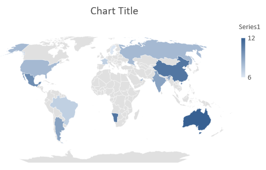

## **Áttekintés**

Ez a cikk bemutatja, hogyan hozhatunk létre és testreszabhatunk diagramokat az Aspose.Slides for Python via .NET segítségével. Megtanulja, hogyan adjon diagramot egy diára, töltse fel adatokka l, és formázza a tervezési követelményeknek megfelelően. A kódpéldák a prezentációk és diagramok létrehozását, a sorozatok, tengelyek és jelmagyarázatok konfigurálását, valamint a diagramgenerálás integrálását az alkalmazásaiba fedik le.

## **Diagram létrehozása**

A diagramok segítenek az embereknek gyorsan megjeleníteni az adatokat és olyan meglátásokat szerezni, amelyek nem feltétlenül nyilvánvalóak egy táblázatból vagy munkalapról.

**Miért hozzunk létre diagramokat?**

* nagy mennyiségű adat aggregálása, sűrítése vagy összefoglalása egyetlen dián egy prezentációban;
* minták és trendek feltárása az adatokban;
* következtetni az adatok irányára és lendületére időben vagy egy adott mérőegységhez viszonyítva;
* kiemelni kiugró értékeket, rendellenességeket, eltéréseket, hibákat és értelmetlen adatokat;
* komplex adatok kommunikálása vagy bemutatása.

PowerPointban a diagramokat a *Beszúrás* funkción keresztül hozhatja létre, amely sablonokat biztosít számos diagramtípus tervezéséhez. Az Aspose.Slides segítségével mind szabványos diagramokat (népszerű diagramtípusok alapján), mind egyedi diagramokat hozhat létre.

{}
Használja a [ChartType](https://reference.aspose.com/slides/hu/python-net/aspose.slides.charts/charttype/) felsorolást az [Aspose.Slides.Charts](https://reference.aspose.com/slides/hu/python-net/aspose.slides.charts/) névtérben. Ennek a felsorolásnak az értékei különböző diagramtípusoknak felelnek meg.
{}

### **Csoportosított oszlopdiagramok létrehozása**

Ez a szakasz bemutatja, hogyan hozhatók létre csoportosított oszlopdiagramok az Aspose.Slides for Python via .NET használatával. Megtanulja, hogyan inicializáljon egy prezentációt, adjon hozzá diagramot, és testre szabja annak elemeit, például címet, adatokat, sorozatokat, kategóriákat és stílusokat. Kövesse az alábbi lépéseket, hogy lássa, hogyan generálódik egy szabványos csoportosított oszlopdiagram:

1. Hozzon létre egy példányt a [Presentation](https://reference.aspose.com/slides/hu/python-net/aspose.slides/presentation/) osztályból.
1. Szerezzen hivatkozást egy diára az indexe alapján.
1. Adjon hozzá egy diagramot némi adattal, és adja meg a `ChartType.CLUSTERED_COLUMN` típust.
1. Adjon címet a diagramnak.
1. Érje el a diagram adatmunkalapját.
1. Törölje az összes alapértelmezett sorozatot és kategóriát.
1. Adjon hozzá új sorozatokat és kategóriákat.
1. Adjon hozzá új diagramadatokat a diagram sorozathoz.
1. Alkalmazzon kitöltőszínt a diagram sorozatához.
1. Adjon címkéket a diagram sorozathoz.
1. Mentse a módosított prezentációt PPTX fájlként.

```py
import aspose.slides.charts as charts
import aspose.slides as slides
import aspose.pydrawing as draw

# Példányosítja a Presentation osztályt, amely egy PPTX fájlt képvisel.
with slides.Presentation() as presentation:

    # Hozzáfér az első diához.
    slide = presentation.slides[0]

    # Hozzáad egy csoportosított oszlop diagramot alapértelmezett adataival.
    chart = slide.shapes.add_chart(charts.ChartType.CLUSTERED_COLUMN, 20, 20, 500, 300)

    # Beállítja a diagram címét.
    chart.chart_title.add_text_frame_for_overriding("Sample Title")
    chart.chart_title.text_frame_for_overriding.text_frame_format.center_text = slides.NullableBool.TRUE
    chart.chart_title.height = 20
    chart.has_title = True

    # Beállítja a diagram adatlapjának indexét.
    worksheet_index = 0

    # Lekéri a diagram adatkönyvtárát.
    workbook = chart.chart_data.chart_data_workbook

    # Törli az alapértelmezett generált sorozatokat és kategóriákat.
    chart.chart_data.series.clear()
    chart.chart_data.categories.clear()

    # Új sorozatokat ad hozzá.
    chart.chart_data.series.add(workbook.get_cell(worksheet_index, 0, 1, "Series 1"), chart.type)
    chart.chart_data.series.add(workbook.get_cell(worksheet_index, 0, 2, "Series 2"), chart.type)

    # Új kategóriákat ad hozzá.
    chart.chart_data.categories.add(workbook.get_cell(worksheet_index, 1, 0, "Category 1"))
    chart.chart_data.categories.add(workbook.get_cell(worksheet_index, 2, 0, "Category 2"))
    chart.chart_data.categories.add(workbook.get_cell(worksheet_index, 3, 0, "Category 3"))

    # Lekéri az első diagram sorozatot.
    series = chart.chart_data.series[0]

    # Feltölti a sorozat adatait.
    series.data_points.add_data_point_for_bar_series(workbook.get_cell(worksheet_index, 1, 1, 20))
    series.data_points.add_data_point_for_bar_series(workbook.get_cell(worksheet_index, 2, 1, 50))
    series.data_points.add_data_point_for_bar_series(workbook.get_cell(worksheet_index, 3, 1, 30))

    # Beállítja a sorozat kitöltőszínét.
    series.format.fill.fill_type = slides.FillType.SOLID
    series.format.fill.solid_fill_color.color = draw.Color.red

    # Lekéri a második diagram sorozatot.
    series = chart.chart_data.series[1]

    # Feltölti a sorozat adatait.
    series.data_points.add_data_point_for_bar_series(workbook.get_cell(worksheet_index, 1, 2, 30))
    series.data_points.add_data_point_for_bar_series(workbook.get_cell(worksheet_index, 2, 2, 10))
    series.data_points.add_data_point_for_bar_series(workbook.get_cell(worksheet_index, 3, 2, 60))

    # Beállítja a sorozat kitöltőszínét.
    series.format.fill.fill_type = slides.FillType.SOLID
    series.format.fill.solid_fill_color.color = draw.Color.green

    # Beállítja az első címkét, hogy megjelenítse a kategória nevét.
    label = series.data_points[0].label
    label.data_label_format.show_category_name = True

    label = series.data_points[1].label
    label.data_label_format.show_series_name = True

    # Beállítja a sorozatot, hogy a harmadik címkéhez mutassa az értéket.
    label = series.data_points[2].label
    label.data_label_format.show_value = True
    label.data_label_format.show_series_name = True
    label.data_label_format.separator = "/"
                
    # Mentse a prezentációt lemezre PPTX fájlként.
    presentation.save("ClusteredColumnChart.pptx", slides.export.SaveFormat.PPTX)
```

Az eredmény:


### **Szórásdiagramok létrehozása**

Az szórásdiagramok (más néven szórásábrák vagy x-y grafikonok) gyakran használatosak minták keresésére vagy két változó közötti korrelációk bemutatására.

Használjon szórásdiagramot, ha:

* Páros numerikus adatai vannak.
* Két, jól párosítható változója van.
* Meg szeretné határozni, hogy a két változó összefügg-e.
* Független változója több értékkel rendelkezik egy függő változóhoz.

```py
import aspose.slides.charts as charts
import aspose.slides as slides
import aspose.pydrawing as draw

# Példányosítja a Presentation osztályt.
with slides.Presentation() as presentation:

    # Hozzáfér az első diához.
    slide = presentation.slides[0]

    # Létrehozza az alapértelmezett szórásdiagramot.
    chart = slide.shapes.add_chart(charts.ChartType.SCATTER_WITH_SMOOTH_LINES, 20, 20, 500, 300)

    # Beállítja a diagram adatlapjának indexét.
    worksheet_index = 0

    # Lekéri a diagram adatkönyvtárát.
    workbook = chart.chart_data.chart_data_workbook

    # Törli az alapértelmezett sorozatot.
    chart.chart_data.series.clear()

    # Új sorozatokat ad hozzá.
    chart.chart_data.series.add(workbook.get_cell(worksheet_index, 1, 1, "Series 1"), chart.type)
    chart.chart_data.series.add(workbook.get_cell(worksheet_index, 1, 3, "Series 2"), chart.type)

    # Lekéri az első diagram sorozatot.
    series = chart.chart_data.series[0]

    # Új pontot (1:3) ad a sorozathoz.
    series.data_points.add_data_point_for_scatter_series(workbook.get_cell(worksheet_index, 2, 1, 1), workbook.get_cell(worksheet_index, 2, 2, 3))

    # Új pontot (2:10) ad hozzá.
    series.data_points.add_data_point_for_scatter_series(workbook.get_cell(worksheet_index, 3, 1, 2), workbook.get_cell(worksheet_index, 3, 2, 10))

    # Megváltoztatja a sorozat típusát.
    series.type = charts.ChartType.SCATTER_WITH_STRAIGHT_LINES_AND_MARKERS

    # Megváltoztatja a diagram sorozat jelölőjét.
    series.marker.size = 10
    series.marker.symbol = charts.MarkerStyleType.STAR

    # Lekéri a második diagram sorozatot.
    series = chart.chart_data.series[1]

    # Új pontot (5:2) ad a diagram sorozathoz.
    series.data_points.add_data_point_for_scatter_series(workbook.get_cell(worksheet_index, 2, 3, 5), workbook.get_cell(worksheet_index, 2, 4, 2))

    # Új pontot (3:1) ad hozzá.
    series.data_points.add_data_point_for_scatter_series(workbook.get_cell(worksheet_index, 3, 3, 3), workbook.get_cell(worksheet_index, 3, 4, 1))

    # Új pontot (2:2) ad hozzá.
    series.data_points.add_data_point_for_scatter_series(workbook.get_cell(worksheet_index, 4, 3, 2), workbook.get_cell(worksheet_index, 4, 4, 2))

    # Új pontot (5:1) ad hozzá.
    series.data_points.add_data_point_for_scatter_series(workbook.get_cell(worksheet_index, 5, 3, 5), workbook.get_cell(worksheet_index, 5, 4, 1))

    # Megváltoztatja a diagram sorozat jelölőjét.
    series.marker.size = 10
    series.marker.symbol = charts.MarkerStyleType.CIRCLE

    presentation.save("ScatterChart.pptx", slides.export.SaveFormat.PPTX)
```

Az eredmény:


### **Szeletdiagramok létrehozása**

A szeletdiagramok leginkább a részek és az egész közötti kapcsolat megjelenítésére alkalmasak, különösen, ha az adatok kategóriákat numerikus értékekkel tartalmaznak. Ha azonban sok rész vagy címke van az adatokban, érdemes inkább oszlopdiagramot használni.

1. Hozzon létre egy példányt a [Presentation](https://reference.aspose.com/slides/hu/python-net/aspose.slides/presentation/) osztályból.
1. Szerezzen hivatkozást egy diára az indexe alapján.
1. Adjon hozzá diagramot alapértelmezett adatokkal, és adja meg a `ChartType.PIE` típust.
1. Érje el a diagram adatkönyvtárát ([ChartDataWorkbook](https://reference.aspose.com/slides/hu/python-net/aspose.slides.charts/chartdataworkbook/)).
1. Törölje az alapértelmezett sorozatokat és kategóriákat.
1. Adjon hozzá új sorozatokat és kategóriákat.
1. Adjon hozzá új diagramadatokat a diagram sorozathoz.
1. Adjon hozzá új pontokat a diagramhoz, és alkalmazzon egyéni színeket a szeletdiagram szektoraira.
1. Állítsa be a sorozat címkéit.
1. Engedélyezze a vezetővonalakat a sorozat címkéihez.
1. Állítsa be a forgásszöget a szeletdiagramhoz.
1. Mentse a módosított prezentációt PPTX fájlként.

```py
import aspose.slides.charts as charts
import aspose.slides as slides
import aspose.pydrawing as draw

# Példányosítja a Presentation osztályt, amely egy PPTX fájlt képvisel.
with slides.Presentation() as presentation:

    # Hozzáfér az első diához.
    slide = presentation.slides[0]

    # Hozzáad egy diagramot az alapértelmezett adataival.
    chart = slide.shapes.add_chart(charts.ChartType.PIE, 20, 20, 500, 300)

    # Beállítja a diagram címét.
    chart.chart_title.add_text_frame_for_overriding("Sample Title")
    chart.chart_title.text_frame_for_overriding.text_frame_format.center_text = slides.NullableBool.TRUE
    chart.chart_title.height = 20
    chart.has_title = True

    # Beállítja a diagram adatlapjának indexét.
    worksheet_index = 0

    # Lekéri a diagram adatkönyvtárát.
    workbook = chart.chart_data.chart_data_workbook

    # Törli az alapértelmezett generált sorozatokat és kategóriákat.
    chart.chart_data.series.clear()
    chart.chart_data.categories.clear()

    # Új kategóriákat ad hozzá.
    chart.chart_data.categories.add(workbook.get_cell(0, 1, 0, "First Qtr"))
    chart.chart_data.categories.add(workbook.get_cell(0, 2, 0, "2nd Qtr"))
    chart.chart_data.categories.add(workbook.get_cell(0, 3, 0, "3rd Qtr"))

    # Új sorozatot ad hozzá.
    series = chart.chart_data.series.add(workbook.get_cell(0, 0, 1, "Series 1"), chart.type)

    # Feltölti a sorozat adatait.
    series.data_points.add_data_point_for_pie_series(workbook.get_cell(worksheet_index, 1, 1, 20))
    series.data_points.add_data_point_for_pie_series(workbook.get_cell(worksheet_index, 2, 1, 50))
    series.data_points.add_data_point_for_pie_series(workbook.get_cell(worksheet_index, 3, 1, 30))

    # Beállítja a szektort színét.
    chart.chart_data.series_groups[0].is_color_varied = True

    point = series.data_points[0]
    point.format.fill.fill_type = slides.FillType.SOLID
    point.format.fill.solid_fill_color.color = draw.Color.cyan

    # Beállítja a szektor szegélyét.
    point.format.line.fill_format.fill_type = slides.FillType.SOLID
    point.format.line.fill_format.solid_fill_color.color = draw.Color.gray
    point.format.line.width = 3.0
    point.format.line.style = slides.LineStyle.THIN_THICK
    point.format.line.dash_style = slides.LineDashStyle.DASH_DOT

    point1 = series.data_points[1]
    point1.format.fill.fill_type = slides.FillType.SOLID
    point1.format.fill.solid_fill_color.color = draw.Color.brown

    # Beállítja a szektor szegélyét.
    point1.format.line.fill_format.fill_type = slides.FillType.SOLID
    point1.format.line.fill_format.solid_fill_color.color = draw.Color.blue
    point1.format.line.width = 3.0
    point1.format.line.style = slides.LineStyle.SINGLE
    point1.format.line.dash_style = slides.LineDashStyle.LARGE_DASH_DOT

    point2 = series.data_points[2]
    point2.format.fill.fill_type = slides.FillType.SOLID
    point2.format.fill.solid_fill_color.color = draw.Color.coral

    # Beállítja a szektor szegélyét.
    point2.format.line.fill_format.fill_type = slides.FillType.SOLID
    point2.format.line.fill_format.solid_fill_color.color = draw.Color.red
    point2.format.line.width = 2.0
    point2.format.line.style = slides.LineStyle.THIN_THIN
    point2.format.line.dash_style = slides.LineDashStyle.LARGE_DASH_DOT_DOT

    # Egyéni címkéket hoz létre minden kategóriához az új sorozatban.
    label1 = series.data_points[0].label

    label1.data_label_format.show_value = True

    label2 = series.data_points[1].label
    label2.data_label_format.show_value = True
    label2.data_label_format.show_legend_key = True
    label2.data_label_format.show_percentage = True

    label3 = series.data_points[2].label
    label3.data_label_format.show_series_name = True
    label3.data_label_format.show_percentage = True

    # Beállítja a sorozatot, hogy a diagramhoz vezető vonalakat jelenítsen meg.
    series.labels.default_data_label_format.show_leader_lines = True

    # Beállítja a kördiagram szektorainak forgásszögét.
    chart.chart_data.series_groups[0].first_slice_angle = 180

    # Mentse a prezentációt lemezre PPTX fájlként.
    presentation.save("PieChart.pptx", slides.export.SaveFormat.PPTX)
```

Az eredmény:


### **Vonaldiagramok létrehozása**

A vonaldiagramok (más néven vonalgrafikonok) leginkább olyan helyzetekben használatosak, ahol az értékek időbeli változását szeretné bemutatni. Vonaldiagram segítségével egyszerre nagy mennyiségű adatot hasonlíthat össze, nyomon követheti az időbeli változásokat és trendeket, kiemelheti az anomáliákat az adat sorozatokban, és még sok mást.

1. Hozzon létre egy példányt a [Presentation](https://reference.aspose.com/slides/hu/python-net/aspose.slides/presentation/) osztályból.
1. Szerezzen hivatkozást egy diára az indexe alapján.
1. Adjon hozzá diagramot alapértelmezett adatokkal, és adja meg a `ChartType.LINE` típust.
1. Mentse a módosított prezentációt PPTX fájlként.

```python
import aspose.slides as slides

with slides.Presentation() as presentation:
    line_chart = presentation.slides[0].shapes.add_chart(slides.charts.ChartType.LINE, 20, 20, 500, 300)
    
    presentation.save("LineChart.pptx", slides.export.SaveFormat.PPTX)
```

Alapértelmezés szerint a vonaldiagram pontjai egyenes folytonos vonalakkal vannak összekötve. Ha azt szeretné, hogy a pontok vonalai szaggatottak legyenek, a következő módon adja meg a kívánt szaggatott típust:

```python
import aspose.slides as slides

with slides.Presentation() as presentation:
    line_chart = presentation.slides[0].shapes.add_chart(slides.charts.ChartType.LINE, 10, 50, 600, 350)

    for series in line_chart.chart_data.series:
        series.format.line.dash_style = slides.LineDashStyle.DASH

    presentation.save("LineChart.pptx", slides.export.SaveFormat.PPTX)
```

Az eredmény:


### **Fa térkép diagramok létrehozása**

A fa térkép diagramok leginkább eladási adatok esetén használatosak, amikor a kategória méretarányát szeretné megjeleníteni, és gyorsan felhívni a figyelmet a legnagyobb hozzájáruló elemekre az egyes kategóriákon belül.

1. Hozzon létre egy példányt a [Presentation](https://reference.aspose.com/slides/hu/python-net/aspose.slides/presentation/) osztályból.
1. Szerezzen hivatkozást egy diára az indexe alapján.
1. Adjon hozzá diagramot alapértelmezett adatokkal, és adja meg a `ChartType.TREEMAP` típust.
1. Érje el a diagram adatkönyvtárát ([ChartDataWorkbook](https://reference.aspose.com/slides/hu/python-net/aspose.slides.charts/chartdataworkbook/)).
1. Törölje az alapértelmezett sorozatokat és kategóriákat.
1. Adjon hozzá új sorozatokat és kategóriákat.
1. Adjon hozzá új diagramadatokat a diagram sorozathoz.
1. Mentse a módosított prezentációt PPTX fájlként.

```py
import aspose.slides.charts as charts
import aspose.slides as slides
import aspose.pydrawing as draw

with slides.Presentation() as presentation:
    chart = presentation.slides[0].shapes.add_chart(charts.ChartType.TREEMAP, 20, 20, 500, 300)
    chart.chart_data.categories.clear()
    chart.chart_data.series.clear()

    workbook = chart.chart_data.chart_data_workbook
    workbook.clear(0)

    # Ág 1
    leaf = chart.chart_data.categories.add(workbook.get_cell(0, "C1", "Leaf1"))
    leaf.grouping_levels.set_grouping_item(1, "Stem1")
    leaf.grouping_levels.set_grouping_item(2, "Branch1")

    chart.chart_data.categories.add(workbook.get_cell(0, "C2", "Leaf2"))

    leaf = chart.chart_data.categories.add(workbook.get_cell(0, "C3", "Leaf3"))
    leaf.grouping_levels.set_grouping_item(1, "Stem2")

    chart.chart_data.categories.add(workbook.get_cell(0, "C4", "Leaf4"))

    # Ág 2
    leaf = chart.chart_data.categories.add(workbook.get_cell(0, "C5", "Leaf5"))
    leaf.grouping_levels.set_grouping_item(1, "Stem3")
    leaf.grouping_levels.set_grouping_item(2, "Branch2")

    chart.chart_data.categories.add(workbook.get_cell(0, "C6", "Leaf6"))

    leaf = chart.chart_data.categories.add(workbook.get_cell(0, "C7", "Leaf7"))
    leaf.grouping_levels.set_grouping_item(1, "Stem4")

    chart.chart_data.categories.add(workbook.get_cell(0, "C8", "Leaf8"))

    series = chart.chart_data.series.add(charts.ChartType.TREEMAP)
    series.labels.default_data_label_format.show_category_name = True
    series.data_points.add_data_point_for_treemap_series(workbook.get_cell(0, "D1", 4))
    series.data_points.add_data_point_for_treemap_series(workbook.get_cell(0, "D2", 5))
    series.data_points.add_data_point_for_treemap_series(workbook.get_cell(0, "D3", 3))
    series.data_points.add_data_point_for_treemap_series(workbook.get_cell(0, "D4", 6))
    series.data_points.add_data_point_for_treemap_series(workbook.get_cell(0, "D5", 9))
    series.data_points.add_data_point_for_treemap_series(workbook.get_cell(0, "D6", 9))
    series.data_points.add_data_point_for_treemap_series(workbook.get_cell(0, "D7", 4))
    series.data_points.add_data_point_for_treemap_series(workbook.get_cell(0, "D8", 3))

    series.parent_label_layout = charts.ParentLabelLayoutType.OVERLAPPING

    presentation.save("TreeMap.pptx", slides.export.SaveFormat.PPTX)
```

Az eredmény:


### **Részvénydiagramok létrehozása**

A részvénydiagramok pénzügyi adatok, például nyitó, legmagasabb, legalacsonyabb és záró árak megjelenítésére szolgálnak, segítve a piaci trendek és a volatilitás elemzését. Alapvető betekintést nyújtanak a részvények teljesítményébe, segítve a befektetőket és elemzőket a tájékozott döntéshozatalban.

1. Hozzon létre egy példányt a [Presentation](https://reference.aspose.com/slides/hu/python-net/aspose.slides/presentation/) osztályból.
1. Szerezzen hivatkozást egy diára az indexe alapján.
1. Adjon hozzá diagramot alapértelmezett adatokkal, és adja meg a `ChartType.OPEN_HIGH_LOW_CLOSE` típust.
1. Érje el a diagram adatkönyvtárát ([ChartDataWorkbook](https://reference.aspose.com/slides/hu/python-net/aspose.slides.charts/chartdataworkbook/)).
1. Törölje az alapértelmezett sorozatokat és kategóriákat.
1. Adjon hozzá új sorozatokat és kategóriákat.
1. Adjon hozzá új diagramadatokat a diagram sorozathoz.
1. Adja meg a magas-alacsony vonalak formátumát.
1. Mentse a módosított prezentációt PPTX fájlként.

```py
import aspose.slides.charts as charts
import aspose.slides as slides
import aspose.pydrawing as draw

with slides.Presentation() as presentation:
    chart = presentation.slides[0].shapes.add_chart(charts.ChartType.OPEN_HIGH_LOW_CLOSE, 20, 20, 500, 300, False)

    chart.chart_data.series.clear()
    chart.chart_data.categories.clear()

    workbook = chart.chart_data.chart_data_workbook

    chart.chart_data.categories.add(workbook.get_cell(0, 1, 0, "A"))
    chart.chart_data.categories.add(workbook.get_cell(0, 2, 0, "B"))
    chart.chart_data.categories.add(workbook.get_cell(0, 3, 0, "C"))

    chart.chart_data.series.add(workbook.get_cell(0, 0, 1, "Open"), chart.type)
    chart.chart_data.series.add(workbook.get_cell(0, 0, 2, "High"), chart.type)
    chart.chart_data.series.add(workbook.get_cell(0, 0, 3, "Low"), chart.type)
    chart.chart_data.series.add(workbook.get_cell(0, 0, 4, "Close"), chart.type)

    series = chart.chart_data.series[0]

    series.data_points.add_data_point_for_stock_series(workbook.get_cell(0, 1, 1, 72))
    series.data_points.add_data_point_for_stock_series(workbook.get_cell(0, 2, 1, 25))
    series.data_points.add_data_point_for_stock_series(workbook.get_cell(0, 3, 1, 38))

    series = chart.chart_data.series[1]
    series.data_points.add_data_point_for_stock_series(workbook.get_cell(0, 1, 2, 172))
    series.data_points.add_data_point_for_stock_series(workbook.get_cell(0, 2, 2, 57))
    series.data_points.add_data_point_for_stock_series(workbook.get_cell(0, 3, 2, 57))

    series = chart.chart_data.series[2]
    series.data_points.add_data_point_for_stock_series(workbook.get_cell(0, 1, 3, 12))
    series.data_points.add_data_point_for_stock_series(workbook.get_cell(0, 2, 3, 12))
    series.data_points.add_data_point_for_stock_series(workbook.get_cell(0, 3, 3, 13))

    series = chart.chart_data.series[3]
    series.data_points.add_data_point_for_stock_series(workbook.get_cell(0, 1, 4, 25))
    series.data_points.add_data_point_for_stock_series(workbook.get_cell(0, 2, 4, 38))
    series.data_points.add_data_point_for_stock_series(workbook.get_cell(0, 3, 4, 50))

    chart.chart_data.series_groups[0].up_down_bars.has_up_down_bars = True
    chart.chart_data.series_groups[0].hi_low_lines_format.line.fill_format.fill_type = slides.FillType.SOLID

    for ser in chart.chart_data.series:
        ser.format.line.fill_format.fill_type = slides.FillType.NO_FILL

    presentation.save("StockChart.pptx", slides.export.SaveFormat.PPTX)
```

Az eredmény:


### **Doboz- és buzogánydiagramok létrehozása**

A doboz- és buzogánydiagramok az adat eloszlását jelenítik meg a főbb statisztikai mérőszámok, például a medián, kvartilisek és esetleges kiugró értékek összegzésével. Különösen hasznosak felderítő adat elemzésben és statisztikai vizsgálatokban, hogy gyorsan megértsük az adat változatosságát és az esetleges anomáliákat.

1. Hozzon létre egy példányt a [Presentation](https://reference.aspose.com/slides/hu/python-net/aspose.slides/presentation/) osztályból.
1. Szerezzen hivatkozást egy diára az indexe alapján.
1. Adjon hozzá diagramot alapértelmezett adatokkal, és adja meg a `ChartType.BOX_AND_WHISKER` típust.
1. Érje el a diagram adatkönyvtárát ([ChartDataWorkbook](https://reference.aspose.com/slides/hu/python-net/aspose.slides.charts/chartdataworkbook/)).
1. Törölje az alapértelmezett sorozatokat és kategóriákat.
1. Adjon hozzá új sorozatokat és kategóriákat.
1. Adjon hozzá új diagramadatokat a diagram sorozathoz.
1. Mentse a módosított prezentációt PPTX fájlként.

```py
import aspose.slides.charts as charts
import aspose.slides as slides
import aspose.pydrawing as draw

with slides.Presentation() as presentation:
    chart = presentation.slides[0].shapes.add_chart(charts.ChartType.BOX_AND_WHISKER, 20, 20, 500, 300)
    chart.chart_data.categories.clear()
    chart.chart_data.series.clear()

    workbook = chart.chart_data.chart_data_workbook
    workbook.clear(0)

    chart.chart_data.categories.add(workbook.get_cell(0, "A1", "Category 1"))
    chart.chart_data.categories.add(workbook.get_cell(0, "A2", "Category 1"))
    chart.chart_data.categories.add(workbook.get_cell(0, "A3", "Category 1"))
    chart.chart_data.categories.add(workbook.get_cell(0, "A4", "Category 1"))
    chart.chart_data.categories.add(workbook.get_cell(0, "A5", "Category 1"))
    chart.chart_data.categories.add(workbook.get_cell(0, "A6", "Category 1"))

    series = chart.chart_data.series.add(charts.ChartType.BOX_AND_WHISKER)

    series.quartile_method = charts.QuartileMethodType.EXCLUSIVE
    series.show_mean_line = True
    series.show_mean_markers = True
    series.show_inner_points = True
    series.show_outlier_points = True

    series.data_points.add_data_point_for_box_and_whisker_series(workbook.get_cell(0, "B1", 15))
    series.data_points.add_data_point_for_box_and_whisker_series(workbook.get_cell(0, "B2", 41))
    series.data_points.add_data_point_for_box_and_whisker_series(workbook.get_cell(0, "B3", 16))
    series.data_points.add_data_point_for_box_and_whisker_series(workbook.get_cell(0, "B4", 10))
    series.data_points.add_data_point_for_box_and_whisker_series(workbook.get_cell(0, "B5", 23))
    series.data_points.add_data_point_for_box_and_whisker_series(workbook.get_cell(0, "B6", 16))

    presentation.save("BoxAndWhiskerChart.pptx", slides.export.SaveFormat.PPTX)
```

### **Tölcsérdiagramok létrehozása**

A tölcsérdiagramok az olyan folyamatok vizualizálására szolgálnak, amelyek egymásutáni lépéseket tartalmaznak, ahol az adatmennyiség csökken a lépésről lépésre haladva. Különösen hasznosak a konverziós arányok elemzésében, a szűk keresztmetszetek azonosításában és az értékesítési vagy marketing folyamatok hatékonyságának nyomon követésében.

1. Hozzon létre egy példányt a [Presentation](https://reference.aspose.com/slides/hu/python-net/aspose.slides/presentation/) osztályból.
1. Szerezzen hivatkozást egy diára az indexe alapján.
1. Adjon hozzá diagramot alapértelmezett adatokkal, és adja meg a `ChartType.FUNNEL` típust.
1. Mentse a módosított prezentációt PPTX fájlként.

```py
import aspose.slides.charts as charts
import aspose.slides as slides
import aspose.pydrawing as draw

with slides.Presentation() as presentation:
    chart = presentation.slides[0].shapes.add_chart(charts.ChartType.FUNNEL, 50, 50, 500, 400)
    chart.chart_data.categories.clear()
    chart.chart_data.series.clear()

    workbook = chart.chart_data.chart_data_workbook
    workbook.clear(0)

    chart.chart_data.categories.add(workbook.get_cell(0, "A1", "Category 1"))
    chart.chart_data.categories.add(workbook.get_cell(0, "A2", "Category 2"))
    chart.chart_data.categories.add(workbook.get_cell(0, "A3", "Category 3"))
    chart.chart_data.categories.add(workbook.get_cell(0, "A4", "Category 4"))
    chart.chart_data.categories.add(workbook.get_cell(0, "A5", "Category 5"))
    chart.chart_data.categories.add(workbook.get_cell(0, "A6", "Category 6"))

    series = chart.chart_data.series.add(charts.ChartType.FUNNEL)

    series.data_points.add_data_point_for_funnel_series(workbook.get_cell(0, "B1", 50))
    series.data_points.add_data_point_for_funnel_series(workbook.get_cell(0, "B2", 100))
    series.data_points.add_data_point_for_funnel_series(workbook.get_cell(0, "B3", 200))
    series.data_points.add_data_point_for_funnel_series(workbook.get_cell(0, "B4", 300))
    series.data_points.add_data_point_for_funnel_series(workbook.get_cell(0, "B5", 400))
    series.data_points.add_data_point_for_funnel_series(workbook.get_cell(0, "B6", 500))

    presentation.save("FunnelChart.pptx", slides.export.SaveFormat.PPTX)
```

Az eredmény:


### **Napcsillag diagramok létrehozása**

A napcsillag diagramok hierarchikus adatok megjelenítésére szolgálnak, a szinteket koncentrikus gyűrűkkel ábrázolva. Segítenek a rész-egész viszonyok illusztrálásában, és ideálisak beágyazott kategóriák és alkategóriák tiszta, kompakt formában történő ábrázolására.

1. Hozzon létre egy példányt a [Presentation](https://reference.aspose.com/slides/hu/python-net/aspose.slides/presentation/) osztályból.
1. Szerezzen hivatkozást egy diára az indexe alapján.
1. Adjon hozzá diagramot alapértelmezett adatokkal, és adja meg a `ChartType.SUNBURST` típust.
1. Mentse a módosított prezentációt PPTX fájlként.

```py
import aspose.slides.charts as charts
import aspose.slides as slides
import aspose.pydrawing as draw

with slides.Presentation() as presentation:
    chart = presentation.slides[0].shapes.add_chart(charts.ChartType.SUNBURST, 20, 20, 500, 300)
    chart.chart_data.categories.clear()
    chart.chart_data.series.clear()

    workbook = chart.chart_data.chart_data_workbook
    workbook.clear(0)

    # Ág 1
    leaf = chart.chart_data.categories.add(workbook.get_cell(0, "C1", "Leaf1"))
    leaf.grouping_levels.set_grouping_item(1, "Stem1")
    leaf.grouping_levels.set_grouping_item(2, "Branch1")

    chart.chart_data.categories.add(workbook.get_cell(0, "C2", "Leaf2"))

    leaf = chart.chart_data.categories.add(workbook.get_cell(0, "C3", "Leaf3"))
    leaf.grouping_levels.set_grouping_item(1, "Stem2")

    chart.chart_data.categories.add(workbook.get_cell(0, "C4", "Leaf4"))

    # Ág 2
    leaf = chart.chart_data.categories.add(workbook.get_cell(0, "C5", "Leaf5"))
    leaf.grouping_levels.set_grouping_item(1, "Stem3")
    leaf.grouping_levels.set_grouping_item(2, "Branch2")

    chart.chart_data.categories.add(workbook.get_cell(0, "C6", "Leaf6"))

    leaf = chart.chart_data.categories.add(workbook.get_cell(0, "C7", "Leaf7"))
    leaf.grouping_levels.set_grouping_item(1, "Stem4")

    chart.chart_data.categories.add(workbook.get_cell(0, "C8", "Leaf8"))

    series = chart.chart_data.series.add(charts.ChartType.SUNBURST)
    series.labels.default_data_label_format.show_category_name = True
    series.data_points.add_data_point_for_sunburst_series(workbook.get_cell(0, "D1", 4))
    series.data_points.add_data_point_for_sunburst_series(workbook.get_cell(0, "D2", 5))
    series.data_points.add_data_point_for_sunburst_series(workbook.get_cell(0, "D3", 3))
    series.data_points.add_data_point_for_sunburst_series(workbook.get_cell(0, "D4", 6))
    series.data_points.add_data_point_for_sunburst_series(workbook.get_cell(0, "D5", 9))
    series.data_points.add_data_point_for_sunburst_series(workbook.get_cell(0, "D6", 9))
    series.data_points.add_data_point_for_sunburst_series(workbook.get_cell(0, "D7", 4))
    series.data_points.add_data_point_for_sunburst_series(workbook.get_cell(0, "D8", 3))

    presentation.save("SunburstChart.pptx", slides.export.SaveFormat.PPTX)
```

Az eredmény:


### **Hisztogram diagramok létrehozása**

A hisztogram diagramok numerikus adatok eloszlását ábrázolják, az értékeket tartományokra vagy „bin”-ekre csoportosítva. Különösen hasznosak az adatok frekvenciájának, ferdeségének és szóródásának felismerésében, valamint az adatbázis kiugró értékeinek felderítésében.

1. Hozzon létre egy példányt a [Presentation](https://reference.aspose.com/slides/hu/python-net/aspose.slides/presentation/) osztályból.
1. Szerezzen hivatkozást egy diára az indexe alapján.
1. Adjon hozzá diagramot némi adattal, és adja meg a `ChartType.HISTOGRAM` típust.
1. Érje el a diagram adatkönyvtárát ([ChartDataWorkbook](https://reference.aspose.com/slides/hu/python-net/aspose.slides.charts/chartdataworkbook/)).
1. Törölje az alapértelmezett sorozatokat és kategóriákat.
1. Adjon hozzá új sorozatot, és töltse fel adatpontokkal. A hisztogramnak nincsenek kategóriái; a bin-ek az értékekből számítódnak ki.
1. Mentse a módosított prezentációt PPTX fájlként.

```py
import aspose.slides.charts as charts
import aspose.slides as slides
import aspose.pydrawing as draw

with slides.Presentation() as presentation:
    chart = presentation.slides[0].shapes.add_chart(charts.ChartType.HISTOGRAM, 20, 20, 500, 300)
    chart.chart_data.categories.clear()
    chart.chart_data.series.clear()

    workbook = chart.chart_data.chart_data_workbook
    workbook.clear(0)

    series = chart.chart_data.series.add(charts.ChartType.HISTOGRAM)
    series.data_points.add_data_point_for_histogram_series(workbook.get_cell(0, "A1", 15))
    series.data_points.add_data_point_for_histogram_series(workbook.get_cell(0, "A2", -41))
    series.data_points.add_data_point_for_histogram_series(workbook.get_cell(0, "A3", 16))
    series.data_points.add_data_point_for_histogram_series(workbook.get_cell(0, "A4", 10))
    series.data_points.add_data_point_for_histogram_series(workbook.get_cell(0, "A5", -23))
    series.data_points.add_data_point_for_histogram_series(workbook.get_cell(0, "A6", 16))

    chart.axes.horizontal_axis.aggregation_type = charts.AxisAggregationType.AUTOMATIC

    presentation.save("HistogramChart.pptx", slides.export.SaveFormat.PPTX)
```

Az eredmény:


### **Radar diagramok létrehozása**

A radar diagramok többváltozós adatokat jelenítenek meg kétdimenziós formában, lehetővé téve több változó egyszerre történő könnyű összehasonlítását. Különösen hasznosak minták, erősségek és gyengeségek azonosítására több teljesítménymutató vagy tulajdonság esetén.

1. Hozzon létre egy példányt a [Presentation](https://reference.aspose.com/slides/hu/python-net/aspose.slides/presentation/) osztályból.
1. Szerezzen hivatkozást egy diára az indexe alapján.
1. Adjon hozzá diagramot némi adattal, és adja meg a `ChartType.RADAR` típust.
1. Mentse a módosított prezentációt PPTX fájlként.

```python
import aspose.slides as slides

with slides.Presentation() as presentation:
    presentation.slides[0].shapes.add_chart(slides.charts.ChartType.RADAR, 20, 20, 500, 300)
    presentation.save("RadarChart.pptx", slides.export.SaveFormat.PPTX)
```

Az eredmény:


### **Többkategóriás diagramok létrehozása**

A többkategóriás diagramok olyan adatokat jelenítenek meg, amelyek több kategória csoportot is tartalmaznak, lehetővé téve, hogy egyszerre több dimenzióban hasonlítsa össze az értékeket. Különösen hasznosak bonyolult, többrétegű adatkészletek trendjeinek és kapcsolatai elemzésénél.

1. Hozzon létre egy példányt a [Presentation](https://reference.aspose.com/slides/hu/python-net/aspose.slides/presentation/) osztályból.
1. Szerezzen hivatkozást egy diára az indexe alapján.
1. Adjon hozzá diagramot alapértelmezett adatokkal, és adja meg a `ChartType.CLUSTERED_COLUMN` típust.
1. Érje el a diagram adatkönyvtárát ([ChartDataWorkbook](https://reference.aspose.com/slides/hu/python-net/aspose.slides.charts/chartdataworkbook/)).
1. Törölje az alapértelmezett sorozatokat és kategóriákat.
1. Adjon hozzá új sorozatokat és kategóriákat.
1. Adjon hozzá új diagramadatokat a diagram sorozathoz.
1. Mentse a módosított prezentációt PPTX fájlként.

```py
import aspose.slides.charts as charts
import aspose.slides as slides
import aspose.pydrawing as draw

with slides.Presentation() as presentation:
    slide = presentation.slides[0]

    chart = presentation.slides[0].shapes.add_chart(charts.ChartType.CLUSTERED_COLUMN, 20, 20, 500, 300)
    chart.chart_data.series.clear()
    chart.chart_data.categories.clear()

    workbook = chart.chart_data.chart_data_workbook
    workbook.clear(0)

    worksheet_index = 0

    category = chart.chart_data.categories.add(workbook.get_cell(0, "c2", "A"))
    category.grouping_levels.set_grouping_item(1, "Group1")
    category = chart.chart_data.categories.add(workbook.get_cell(0, "c3", "B"))

    category = chart.chart_data.categories.add(workbook.get_cell(0, "c4", "C"))
    category.grouping_levels.set_grouping_item(1, "Group2")
    category = chart.chart_data.categories.add(workbook.get_cell(0, "c5", "D"))

    category = chart.chart_data.categories.add(workbook.get_cell(0, "c6", "E"))
    category.grouping_levels.set_grouping_item(1, "Group3")
    category = chart.chart_data.categories.add(workbook.get_cell(0, "c7", "F"))

    category = chart.chart_data.categories.add(workbook.get_cell(0, "c8", "G"))
    category.grouping_levels.set_grouping_item(1, "Group4")
    category = chart.chart_data.categories.add(workbook.get_cell(0, "c9", "H"))

    # Sorozat hozzáadása.
    series = chart.chart_data.series.add(workbook.get_cell(0, "D1", "Series 1"), charts.ChartType.CLUSTERED_COLUMN)

    series.data_points.add_data_point_for_bar_series(workbook.get_cell(worksheet_index, "D2", 10))
    series.data_points.add_data_point_for_bar_series(workbook.get_cell(worksheet_index, "D3", 20))
    series.data_points.add_data_point_for_bar_series(workbook.get_cell(worksheet_index, "D4", 30))
    series.data_points.add_data_point_for_bar_series(workbook.get_cell(worksheet_index, "D5", 40))
    series.data_points.add_data_point_for_bar_series(workbook.get_cell(worksheet_index, "D6", 50))
    series.data_points.add_data_point_for_bar_series(workbook.get_cell(worksheet_index, "D7", 60))
    series.data_points.add_data_point_for_bar_series(workbook.get_cell(worksheet_index, "D8", 70))
    series.data_points.add_data_point_for_bar_series(workbook.get_cell(worksheet_index, "D9", 80))

    # Mentse a prezentációt a diagrammal.
    presentation.save("MultiCategoryChart.pptx", slides.export.SaveFormat.PPTX)
```

Az eredmény:


### **Térkép diagramok létrehozása**

A térkép diagramok földrajzi adatok megjelenítésére szolgálnak, információkat térképezve konkrét helyekhez, például országokhoz, államokhoz vagy városokhoz. Különösen hasznosak regionális trendek, demográfiai adatok és térbeli eloszlások elemzésére egyértelmű, vizuálisan vonzó módon.

```python
import aspose.slides as slides

with slides.Presentation() as presentation:
    chart = presentation.slides[0].shapes.add_chart(slides.charts.ChartType.MAP, 20, 20, 500, 300)
    presentation.save("mapChart.pptx", slides.export.SaveFormat.PPTX)
```

Az eredmény:



### **Kombináció diagramok létrehozása**

Az kombinációs diagram (vagy combo diagram) két vagy több diagramtípust egyesít egyetlen grafikonban. Ez a diagram lehetővé teszi a kiemelést, összehasonlítást vagy a különbségek vizsgálatát két vagy több adatkészlet között, segítve a köztük lévő kapcsolatok azonosítását.


Az alábbi Python kód mutatja, hogyan hozható létre a fenti kombinációs diagram egy PowerPoint prezentációban:

```python
import aspose.slides.charts as charts
import aspose.pydrawing as draw
import aspose.slides as slides

def create_combo_chart():
    with slides.Presentation() as presentation:
        chart = create_chart_with_first_series(presentation.slides[0])

        add_second_series_to_chart(chart)
        add_third_series_to_chart(chart)

        set_primary_axes_format(chart)
        set_secondary_axes_format(chart)

        presentation.save("combo-chart.pptx", slides.export.SaveFormat.PPTX)


def create_chart_with_first_series(slide):
    chart = slide.shapes.add_chart(charts.ChartType.CLUSTERED_COLUMN, 50, 50, 600, 400)

    # Állítsa be a diagram címét.
    chart.has_title = True
    chart.chart_title.add_text_frame_for_overriding("Chart Title")
    chart.chart_title.overlay = False
    title_paragraph = chart.chart_title.text_frame_for_overriding.paragraphs[0]
    title_format = title_paragraph.paragraph_format.default_portion_format

    title_format.font_bold = slides.NullableBool.FALSE
    title_format.font_height = 18

    # Állítsa be a diagram jelmagyarázatát.
    chart.legend.position = charts.LegendPositionType.BOTTOM
    chart.legend.text_format.portion_format.font_height = 12

    # Törölje az alapértelmezett generált sorozatokat és kategóriákat.
    chart.chart_data.series.clear()
    chart.chart_data.categories.clear()

    worksheet_index = 0
    workbook = chart.chart_data.chart_data_workbook

    # Új kategóriákat ad hozzá.
    chart.chart_data.categories.add(workbook.get_cell(worksheet_index, 1, 0, "Category 1"))
    chart.chart_data.categories.add(workbook.get_cell(worksheet_index, 2, 0, "Category 2"))
    chart.chart_data.categories.add(workbook.get_cell(worksheet_index, 3, 0, "Category 3"))
    chart.chart_data.categories.add(workbook.get_cell(worksheet_index, 4, 0, "Category 4"))

    # Az első sorozat hozzáadása.
    series_name_cell = workbook.get_cell(worksheet_index, 0, 1, "Series 1")
    series = chart.chart_data.series.add(series_name_cell, chart.type)

    series.parent_series_group.overlap = -25
    series.parent_series_group.gap_width = 220

    series.data_points.add_data_point_for_bar_series(workbook.get_cell(worksheet_index, 1, 1, 4.3))
    series.data_points.add_data_point_for_bar_series(workbook.get_cell(worksheet_index, 2, 1, 2.5))
    series.data_points.add_data_point_for_bar_series(workbook.get_cell(worksheet_index, 3, 1, 3.5))
    series.data_points.add_data_point_for_bar_series(workbook.get_cell(worksheet_index, 4, 1, 4.5))

    return chart


def add_second_series_to_chart(chart):
    workbook = chart.chart_data.chart_data_workbook
    worksheet_index = 0

    series_name_cell = workbook.get_cell(worksheet_index, 0, 2, "Series 2")
    series = chart.chart_data.series.add(series_name_cell, charts.ChartType.CLUSTERED_COLUMN)

    series.parent_series_group.overlap = -25
    series.parent_series_group.gap_width = 220

    series.data_points.add_data_point_for_bar_series(workbook.get_cell(worksheet_index, 1, 2, 2.4))
    series.data_points.add_data_point_for_bar_series(workbook.get_cell(worksheet_index, 2, 2, 4.4))
    series.data_points.add_data_point_for_bar_series(workbook.get_cell(worksheet_index, 3, 2, 1.8))
    series.data_points.add_data_point_for_bar_series(workbook.get_cell(worksheet_index, 4, 2, 2.8))


def add_third_series_to_chart(chart):
    workbook = chart.chart_data.chart_data_workbook
    worksheet_index = 0

    series_name_cell = workbook.get_cell(worksheet_index, 0, 3, "Series 3")
    series = chart.chart_data.series.add(series_name_cell, charts.ChartType.LINE)

    series.data_points.add_data_point_for_line_series(workbook.get_cell(worksheet_index, 1, 3, 2.0))
    series.data_points.add_data_point_for_line_series(workbook.get_cell(worksheet_index, 2, 3, 2.0))
    series.data_points.add_data_point_for_line_series(workbook.get_cell(worksheet_index, 3, 3, 3.0))
    series.data_points.add_data_point_for_line_series(workbook.get_cell(worksheet_index, 4, 3, 5.0))

    series.plot_on_second_axis = True


def set_primary_axes_format(chart):
    # Állítsa be a vízszintes tengelyt.
    horizontal_axis = chart.axes.horizontal_axis
    horizontal_axis.text_format.portion_format.font_height = 12.0
    horizontal_axis.format.line.fill_format.fill_type = slides.FillType.NO_FILL

    set_axis_title(horizontal_axis, "X Axis")

    # Állítsa be a függőleges tengelyt.
    vertical_axis = chart.axes.vertical_axis
    vertical_axis.text_format.portion_format.font_height = 12.0
    vertical_axis.format.line.fill_format.fill_type = slides.FillType.NO_FILL

    set_axis_title(vertical_axis, "Y Axis 1")

    # Állítsa be a függőleges fő rácsvonalak színét.
    major_grid_lines_format = vertical_axis.major_grid_lines_format.line.fill_format
    major_grid_lines_format.fill_type = slides.FillType.SOLID
    major_grid_lines_format.solid_fill_color.color = draw.Color.from_argb(217, 217, 217)


def set_secondary_axes_format(chart):
    # Állítsa be a másodlagos vízszintes tengelyt.
    secondary_horizontal_axis = chart.axes.secondary_horizontal_axis
    secondary_horizontal_axis.position = charts.AxisPositionType.BOTTOM
    secondary_horizontal_axis.cross_type = charts.CrossesType.MAXIMUM
    secondary_horizontal_axis.is_visible = False
    secondary_horizontal_axis.major_grid_lines_format.line.fill_format.fill_type = slides.FillType.NO_FILL
    secondary_horizontal_axis.minor_grid_lines_format.line.fill_format.fill_type = slides.FillType.NO_FILL

    # Állítsa be a másodlagos függőleges tengelyt.
    secondary_vertical_axis = chart.axes.secondary_vertical_axis
    secondary_vertical_axis.position = charts.AxisPositionType.RIGHT
    secondary_vertical_axis.text_format.portion_format.font_height = 12.0
    secondary_vertical_axis.format.line.fill_format.fill_type = slides.FillType.NO_FILL
    secondary_vertical_axis.major_grid_lines_format.line.fill_format.fill_type = slides.FillType.NO_FILL
    secondary_vertical_axis.minor_grid_lines_format.line.fill_format.fill_type = slides.FillType.NO_FILL

    set_axis_title(secondary_vertical_axis, "Y Axis 2")


def set_axis_title(axis, axis_title):
    axis.has_title = True
    axis.title.overlay = False
    title_portion_format = axis.title.add_text_frame_for_overriding(axis_title).paragraphs[0].paragraph_format.default_portion_format
    title_portion_format.font_bold = slides.NullableBool.FALSE
    title_portion_format.font_height = 12.0
```

## **Diagramok frissítése**

Az Aspose.Slides for Python via .NET lehetővé teszi a diagram adatok, formázás és stílus frissítését, hogy a PowerPoint prezentációk naprakészek legyenek.

1. Hozzon létre egy példányt a [Presentation](https://reference.aspose.com/slides/hu/python-net/aspose.slides/presentation/) osztályból a diagramot tartalmazó prezentáció megnyitásához.
1. Szerezzen hivatkozást egy diára az indexe alapján.
1. Járja be az összes alakzatot a diagram megtalálásához.
1. Érje el a diagram adatmunkalapját.
1. Módosítsa a diagram adat sorozatot a sorozatértékek megváltoztatásával.
1. Adjon hozzá új sorozatot és töltse fel adataival.
1. Mentse a módosított prezentációt PPTX fájlként.

```py
import aspose.slides.charts as charts
import aspose.slides as slides
import aspose.pydrawing as draw

chart_name = "My chart"

# Példányosítja a Presentation osztályt, amely egy PPTX fájlt képvisel.
with slides.Presentation("ExistingChart.pptx") as presentation:

    # Hozzáfér az első diához.
    slide = presentation.slides[0]

    for shape in slide.shapes:
        if isinstance(shape, charts.Chart) and shape.name == chart_name:
            chart = shape

            # Állítsa be a diagram adatlapjának indexét.
            worksheet_index = 0

            # Lekéri a diagram adatkönyvtárát.
            workbook = chart.chart_data.chart_data_workbook

            # Módosítja a diagram kategória neveit.
            workbook.get_cell(worksheet_index, 1, 0, "Modified Category 1")
            workbook.get_cell(worksheet_index, 2, 0, "Modified Category 2")

            # Lekéri az első diagram sorozatot.
            series = chart.chart_data.series[0]

            # Frissíti a sorozat adatait.
            workbook.get_cell(worksheet_index, 0, 1, "New_Series1")  # A sorozat nevét módosítja.
            series.data_points[0].value.data = 90
            series.data_points[1].value.data = 123
            series.data_points[2].value.data = 44

            # Lekéri a második diagram sorozatot.
            series = chart.chart_data.series[1]

            # Frissíti a sorozat adatait.
            workbook.get_cell(worksheet_index, 0, 2, "New_Series2")  # A sorozat nevét módosítja.
            series.data_points[0].value.data = 23
            series.data_points[1].value.data = 67
            series.data_points[2].value.data = 99

            # Új sorozatot ad hozzá.
            series = chart.chart_data.series.add(workbook.get_cell(worksheet_index, 0, 3, "Series 3"), chart.type)

            # Feltölti a sorozat adatait.
            series.data_points.add_data_point_for_bar_series(workbook.get_cell(worksheet_index, 1, 3, 20))
            series.data_points.add_data_point_for_bar_series(workbook.get_cell(worksheet_index, 2, 3, 50))
            series.data_points.add_data_point_for_bar_series(workbook.get_cell(worksheet_index, 3, 3, 30))

            chart.type = charts.ChartType.CLUSTERED_CYLINDER

            # Mentse a prezentációt a diagrammal.
            presentation.save("ModifiedChart.pptx", slides.export.SaveFormat.PPTX)
```

## **Adattartomány beállítása egy diagramhoz**

Az Aspose.Slides for Python via .NET lehetővé teszi, hogy egy konkrét munkalaptartományt használjon adatforrásként egy diagramhoz. Ez szabályozza, mely cellák szolgálják a diagram sorozatait és kategóriáit, és lehetővé teszi a diagram frissítését a munkalap változásainak megfelelően.

1. Hozzon létre egy példányt a [Presentation](https://reference.aspose.com/slides/hu/python-net/aspose.slides/presentation/) osztályból a diagramot tartalmazó prezentáció megnyitásához.
1. Szerezzen hivatkozást egy diára az indexe alapján.
1. Járja be az összes alakzatot a diagram megtalálásához.
1. Érje el a diagram adatait és állítsa be a tartományt.
1. Mentse a módosított prezentációt PPTX fájlként.

```py
import aspose.slides.charts as charts
import aspose.slides as slides
import aspose.pydrawing as draw

chart_name = "My chart"

# Példányosítja a Presentation osztályt, amely egy PPTX fájlt képvisel.
with slides.Presentation("ExistingChart.pptx") as presentation:

    # Hozzáfér az első diához.
    slide = presentation.slides[0]

    for shape in slide.shapes:
        if isinstance(shape, charts.Chart) and shape.name == chart_name:
            chart = shape
            chart.chart_data.set_range("Sheet1!A1:B4")

    presentation.save("DataRange.pptx", slides.export.SaveFormat.PPTX)
```

## **Alapértelmezett jelölők használata diagramokban**

Alapértelmezett jelölők használatakor a diagram minden sorozata automatikusan más-más jelölő szimbólumot kap.

```py
import aspose.slides.charts as charts
import aspose.slides as slides
import aspose.pydrawing as draw

with slides.Presentation() as presentation:
    slide = presentation.slides[0]
    chart = slide.shapes.add_chart(charts.ChartType.LINE_WITH_MARKERS, 10, 10, 400, 400)

    chart.chart_data.series.clear()
    chart.chart_data.categories.clear()

    workbook = chart.chart_data.chart_data_workbook

    series = chart.chart_data.series.add(workbook.get_cell(0, 0, 1, "Series 1"), chart.type)

    chart.chart_data.categories.add(workbook.get_cell(0, 1, 0, "C1"))
    series.data_points.add_data_point_for_line_series(workbook.get_cell(0, 1, 1, 24))

    chart.chart_data.categories.add(workbook.get_cell(0, 2, 0, "C2"))
    series.data_points.add_data_point_for_line_series(workbook.get_cell(0, 2, 1, 23))

    chart.chart_data.categories.add(workbook.get_cell(0, 3, 0, "C3"))
    series.data_points.add_data_point_for_line_series(workbook.get_cell(0, 3, 1, -10))

    chart.chart_data.categories.add(workbook.get_cell(0, 4, 0, "C4"))
    series.data_points.add_data_point_for_line_series(workbook.get_cell(0, 4, 1, None))

    series2 = chart.chart_data.series.add(workbook.get_cell(0, 0, 2, "Series 2"), chart.type)

    # Töltse fel a sorozat adatait.
    series2.data_points.add_data_point_for_line_series(workbook.get_cell(0, 1, 2, 30))
    series2.data_points.add_data_point_for_line_series(workbook.get_cell(0, 2, 2, 10))
    series2.data_points.add_data_point_for_line_series(workbook.get_cell(0, 3, 2, 60))
    series2.data_points.add_data_point_for_line_series(workbook.get_cell(0, 4, 2, 40))

    chart.has_legend = True
    chart.legend.overlay = False

    presentation.save("DefaultMarkersInChart.pptx", slides.export.SaveFormat.PPTX)
```

## **GYIK**

**Milyen diagramtípusokat támogat az Aspose.Slides for Python via .NET?**

Az Aspose.Slides for Python via .NET széles körű diagramtípusokat támogat, többek között oszlop, vonal, szelet, terület, szórás, hisztogram, radar és sok más. Ez a rugalmasság lehetővé teszi, hogy az adatvizualizáció igényeinek legmegfelelőbb típusú diagramot válassza.

**Hogyan adhatok hozzá új diagramot egy diára?**

Új diagram hozzáadásához először hozza létre a [Presentation](https://reference.aspose.com/slides/hu/python-net/aspose.slides/presentation/) osztály egy példányát, szerezze meg a kívánt diát az indexe alapján, majd hívja meg a diagram hozzáadására szolgáló metódust, megadva a diagram típusát és a kezdeti adatokat. Ez a folyamat közvetlenül beilleszti a diagramot a prezentációba.

**Hogyan frissíthetem a diagramon megjelenített adatokat?**

A diagram adatait az adatkönyvtár ([ChartDataWorkbook](https://reference.aspose.com/slides/hu/python-net/aspose.slides.charts/chartdataworkbook/)) elérésével, az alapértelmezett sorozatok és kategóriák törlésével, majd saját adatok hozzáadásával frissítheti. Így programozott módon a legújabb adatokkal láthatja fel a diagramot.

**Lehetséges-e testreszabni a diagram megjelenését?**

Igen, az Aspose.Slides for Python via .NET kiterjedt testreszabási lehetőségeket biztosít. Módosíthatja a színeket, betűtípusokat, címkéket, jelmagyarázatokat és egyéb formázási elemeket, hogy a diagram megjelenését az egyéni tervezési követelményeknek megfelelően alakítsa.