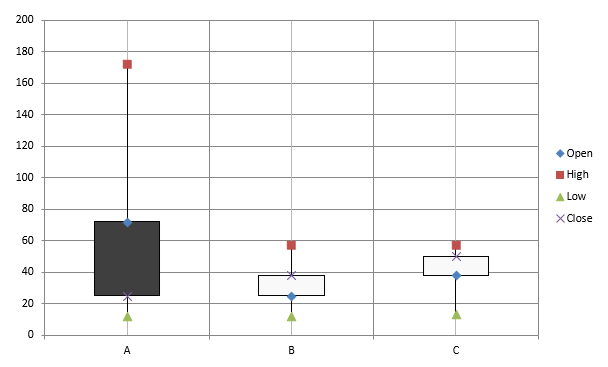
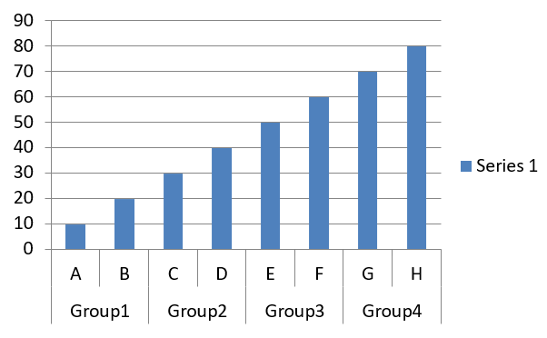

## **Áttekintés**

Ez a cikk bemutatja, hogyan lehet diagramokat létrehozni és testre szabni az Aspose.Slides for Python via .NET segítségével. Megtanulja, hogyan adjon hozzá egy diagramot egy diára, töltse fel adatlarla, és formázza azt úgy, hogy megfeleljen a tervezési követelményeknek. A kódpéldák tartalmazzák a bemutatók és diagramok létrehozását, a sorok, tengelyek és jelmagyarázatok konfigurálását, valamint a diagramgenerálás integrálását az alkalmazásaiba.

## **Diagram létrehozása**

A diagramok segítenek az embereknek gyorsan megjeleníteni az adatokat és olyan betekintéseket nyerni, amelyek egy táblázatból vagy munkafüzettel nem egyértelműek.

**Miért hozzunk létre diagramokat?**

Diagramok használatával:

* egyetlen dián összegyűjthet, tömöríthet vagy összefoglalhat nagy mennyiségű adatot egy prezentációban;
* mintákat és trendeket tárhat fel az adatokban;
* meghatározhatja az adatok irányát és lendületét időben vagy egy adott mértékegységhez viszonyítva;
* felismerheti az outliereket, eltéréseket, hibákat és értelmetlen adatokat;
* komplex adatokat kommunikálhat vagy prezentálhat.

A PowerPointban a *Insert* funkcióval hozhat létre diagramokat, amely számos diagramtípus sablonját kínálja. Az Aspose.Slides segítségével létrehozhat mind szabványos diagramokat (népszerű diagramtípusokon alapulókat), mind egyedi diagramokat.

{}
Használja a [ChartType](https://reference.aspose.com/slides/python-net/aspose.slides.charts/charttype/) felsorolást a [Aspose.Slides.Charts](https://reference.aspose.com/slides/python-net/aspose.slides.charts/) névtérben. Ennek a felsorolásnak az értékei a különböző diagramtípusoknak felelnek meg.
{}

### **Csoportosított oszlopdiagramok létrehozása**

Ez a szakasz bemutatja, hogyan hozhat létre csoportosított oszlopdiagramokat az Aspose.Slides for Python via .NET segítségével. Megtanulja, hogyan inicializáljon egy prezentációt, adjon hozzá egy diagramot, és testre szabja annak elemeit, például a címet, adatokat, sorokat, kategóriákat és a formázást. Kövesse az alábbi lépéseket, hogy lássa, hogyan generálódik egy szabványos csoportosított oszlopdiagram:

1. Hozzon létre egy példányt a [Presentation](https://reference.aspose.com/slides/python-net/aspose.slides/presentation/) osztályból.
1. Szerezzen hivatkozást egy diára az indexe alapján.
1. Adjon hozzá egy diagramot némi adattal, és adja meg a `ChartType.CLUSTERED_COLUMN` típust.
1. Adjon címet a diagramnak.
1. Hozzáférjen a diagram adatlapjához.
1. Törölje az összes alapértelmezett sorozatot és kategóriát.
1. Adjon hozzá új sorozatokat és kategóriákat.
1. Adjon új diagramadatokat a diagram sorozataihoz.
1. Alkalmazzon kitöltőszínt a diagram sorozataihoz.
1. Adjon címkéket a diagram sorozataihoz.
1. Mentse a módosított prezentációt PPTX fájlként.

Ez a Python‑kód bemutatja, hogyan hozható létre egy csoportosított oszlopdiagram:

```py
import aspose.slides.charts as charts
import aspose.slides as slides
import aspose.pydrawing as draw

# Példányosítja a Presentation osztályt, amely egy PPTX fájlt képvisel.
with slides.Presentation() as presentation:

    # Eléri az első diát.
    slide = presentation.slides[0]

    # Csoportosított oszlopdiagramot ad hozzá alapértelmezett adataival.
    chart = slide.shapes.add_chart(charts.ChartType.CLUSTERED_COLUMN, 20, 20, 500, 300)

    # Beállítja a diagram címet.
    chart.chart_title.add_text_frame_for_overriding("Sample Title")
    chart.chart_title.text_frame_for_overriding.text_frame_format.center_text = slides.NullableBool.TRUE
    chart.chart_title.height = 20
    chart.has_title = True

    # Beállítja a diagram adatlapjának indexét.
    worksheet_index = 0

    # Lekéri a diagram adatkönyvtárát.
    workbook = chart.chart_data.chart_data_workbook

    # Törli az alapértelmezett létrehozott sorozatokat és kategóriákat.
    chart.chart_data.series.clear()
    chart.chart_data.categories.clear()

    # Új sorozatokat ad hozzá.
    chart.chart_data.series.add(workbook.get_cell(worksheet_index, 0, 1, "Series 1"), chart.type)
    chart.chart_data.series.add(workbook.get_cell(worksheet_index, 0, 2, "Series 2"), chart.type)

    # Új kategóriákat ad hozzá.
    chart.chart_data.categories.add(workbook.get_cell(worksheet_index, 1, 0, "Category 1"))
    chart.chart_data.categories.add(workbook.get_cell(worksheet_index, 2, 0, "Category 2"))
    chart.chart_data.categories.add(workbook.get_cell(worksheet_index, 3, 0, "Category 3"))

    # Lekéri az első diagram sorozatot.
    series = chart.chart_data.series[0]

    # Feltölti a sorozat adataival.
    series.data_points.add_data_point_for_bar_series(workbook.get_cell(worksheet_index, 1, 1, 20))
    series.data_points.add_data_point_for_bar_series(workbook.get_cell(worksheet_index, 2, 1, 50))
    series.data_points.add_data_point_for_bar_series(workbook.get_cell(worksheet_index, 3, 1, 30))

    # Beállítja a sorozat kitöltőszínét.
    series.format.fill.fill_type = slides.FillType.SOLID
    series.format.fill.solid_fill_color.color = draw.Color.red

    # Lekéri a második diagram sorozatot.
    series = chart.chart_data.series[1]

    # Feltölti a sorozat adataival.
    series.data_points.add_data_point_for_bar_series(workbook.get_cell(worksheet_index, 1, 2, 30))
    series.data_points.add_data_point_for_bar_series(workbook.get_cell(worksheet_index, 2, 2, 10))
    series.data_points.add_data_point_for_bar_series(workbook.get_cell(worksheet_index, 3, 2, 60))

    # Beállítja a sorozat kitöltőszínét.
    series.format.fill.fill_type = slides.FillType.SOLID
    series.format.fill.solid_fill_color.color = draw.Color.green

    # Beállítja az első címkét, hogy a kategória nevét jelenítse meg.
    label = series.data_points[0].label
    label.data_label_format.show_category_name = True

    label = series.data_points[1].label
    label.data_label_format.show_series_name = True

    # Beállítja a sorozatot, hogy a harmadik címkén megjelenítse az értéket.
    label = series.data_points[2].label
    label.data_label_format.show_value = True
    label.data_label_format.show_series_name = True
    label.data_label_format.separator = "/"
                
    # Mentse a prezentációt a lemezre PPTX fájlként.
    presentation.save("ClusteredColumnChart.pptx", slides.export.SaveFormat.PPTX)
```

Az eredmény:


### **Szórdiagramok létrehozása**

A szórdiagramok (más néven szórtábrák vagy x‑y grafikonok) gyakran használatosak minták keresésére vagy két változó közötti korreláció bemutatására.

Használjon szórdiagramot, ha:

* párosított numerikus adatai vannak;
* két változó jól párosítható egymással;
* meg akarja határozni, hogy a két változó összefügg-e;
* van egy független változó, amely több értékkel rendelkezik egy függő változóhoz képest.

Ez a Python‑kód bemutatja, hogyan hozhat létre szórdiagramot különböző jelölőkkel minden sorozathoz:

```py
import aspose.slides.charts as charts
import aspose.slides as slides
import aspose.pydrawing as draw

# Példányosítja a Presentation osztályt.
with slides.Presentation() as presentation:

    # Eléri az első diát.
    slide = presentation.slides[0]

    # Létrehozza az alapértelmezett szórási diagramot.
    chart = slide.shapes.add_chart(charts.ChartType.SCATTER_WITH_SMOOTH_LINES, 20, 20, 500, 300)

    # Beállítja a diagram adatlapjának indexét.
    worksheet_index = 0

    # Lekéri a diagram adatkönyvtárát.
    workbook = chart.chart_data.chart_data_workbook

    # Törli az alapértelmezett sorozatot.
    chart.chart_data.series.clear()

    # Új sorozatokat ad hozzá.
    chart.chart_data.series.add(workbook.get_cell(worksheet_index, 1, 1, "Series 1"), chart.type)
    chart.chart_data.series.add(workbook.get_cell(worksheet_index, 1, 3, "Series 2"), chart.type)

    # Lekéri az első diagram sorozatot.
    series = chart.chart_data.series[0]

    # Új pontot (1:3) ad a sorozathoz.
    series.data_points.add_data_point_for_scatter_series(workbook.get_cell(worksheet_index, 2, 1, 1), workbook.get_cell(worksheet_index, 2, 2, 3))

    # Új pontot (2:10) ad hozzá.
    series.data_points.add_data_point_for_scatter_series(workbook.get_cell(worksheet_index, 3, 1, 2), workbook.get_cell(worksheet_index, 3, 2, 10))

    # Megváltoztatja a sorozat típusát.
    series.type = charts.ChartType.SCATTER_WITH_STRAIGHT_LINES_AND_MARKERS

    # Megváltoztatja a diagram sorozat jelölőjét.
    series.marker.size = 10
    series.marker.symbol = charts.MarkerStyleType.STAR

    # Lekéri a második diagram sorozatot.
    series = chart.chart_data.series[1]

    # Új pontot (5:2) ad a diagram sorozathoz.
    series.data_points.add_data_point_for_scatter_series(workbook.get_cell(worksheet_index, 2, 3, 5), workbook.get_cell(worksheet_index, 2, 4, 2))

    # Új pontot (3:1) ad hozzá.
    series.data_points.add_data_point_for_scatter_series(workbook.get_cell(worksheet_index, 3, 3, 3), workbook.get_cell(worksheet_index, 3, 4, 1))

    # Új pontot (2:2) ad hozzá.
    series.data_points.add_data_point_for_scatter_series(workbook.get_cell(worksheet_index, 4, 3, 2), workbook.get_cell(worksheet_index, 4, 4, 2))

    # Új pontot (5:1) ad hozzá.
    series.data_points.add_data_point_for_scatter_series(workbook.get_cell(worksheet_index, 5, 3, 5), workbook.get_cell(worksheet_index, 5, 4, 1))

    # Megváltoztatja a diagram sorozat jelölőjét.
    series.marker.size = 10
    series.marker.symbol = charts.MarkerStyleType.CIRCLE

    presentation.save("ScatterChart.pptx", slides.export.SaveFormat.PPTX)
```

Az eredmény:


### **Kördiagramok létrehozása**

A kördiagramok leginkább a rész‑egész viszony ábrázolására alkalmasak, különösen, ha a adat tartalmaz kategóriákat numerikus értékekkel. Ha az adata sok részt vagy címkét tartalmaz, érdemes inkább oszlopdiagramot használni.

1. Hozzon létre egy példányt a [Presentation](https://reference.aspose.com/slides/python-net/aspose.slides/presentation/) osztályból.
1. Szerezzen hivatkozást egy diára az indexe alapján.
1. Adjon hozzá egy diagramot alapértelmezett adatokkal, és adja meg a `ChartType.PIE` típust.
1. Hozzáférjen a diagram adatkönyvtárához ([ChartDataWorkbook](https://reference.aspose.com/slides/python-net/aspose.slides.charts/chartdataworkbook/)).
1. Törölje az alapértelmezett sorozatokat és kategóriákat.
1. Adjon hozzá új sorozatokat és kategóriákat.
1. Adjon új diagramadatokat a diagram sorozataihoz.
1. Adjon új pontokat a diagramhoz, és alkalmazzon egyéni színeket a kördiagram szektoraira.
1. Állítson be címkéket a sorozatokhoz.
1. Engedélyezze a vezető vonalakat a sorozatcímkékhez.
1. Állítsa be a forgásszöget a kördiagramhoz.
1. Mentse a módosított prezentációt PPTX fájlként.

Ez a Python‑kód bemutatja, hogyan hozható létre egy kördiagram:

```py
import aspose.slides.charts as charts
import aspose.slides as slides
import aspose.pydrawing as draw

# Példányosítja a Presentation osztályt, amely egy PPTX fájlt képvisel.
with slides.Presentation() as presentation:

    # Eléri az első diát.
    slide = presentation.slides[0]

    # Hozzáad egy diagramot az alapértelmezett adataival.
    chart = slide.shapes.add_chart(charts.ChartType.PIE, 20, 20, 500, 300)

    # Beállítja a diagram címét.
    chart.chart_title.add_text_frame_for_overriding("Sample Title")
    chart.chart_title.text_frame_for_overriding.text_frame_format.center_text = slides.NullableBool.TRUE
    chart.chart_title.height = 20
    chart.has_title = True

    # Beállítja a diagram adatlapjának indexét.
    worksheet_index = 0

    # Lekéri a diagram adatkönyvtárát.
    workbook = chart.chart_data.chart_data_workbook

    # Törli az alapértelmezett generált sorozatokat és kategóriákat.
    chart.chart_data.series.clear()
    chart.chart_data.categories.clear()

    # Új kategóriákat ad hozzá.
    chart.chart_data.categories.add(workbook.get_cell(0, 1, 0, "First Qtr"))
    chart.chart_data.categories.add(workbook.get_cell(0, 2, 0, "2nd Qtr"))
    chart.chart_data.categories.add(workbook.get_cell(0, 3, 0, "3rd Qtr"))

    # Új sorozatot ad hozzá.
    series = chart.chart_data.series.add(workbook.get_cell(0, 0, 1, "Series 1"), chart.type)

    # Feltölti a sorozat adataival.
    series.data_points.add_data_point_for_pie_series(workbook.get_cell(worksheet_index, 1, 1, 20))
    series.data_points.add_data_point_for_pie_series(workbook.get_cell(worksheet_index, 2, 1, 50))
    series.data_points.add_data_point_for_pie_series(workbook.get_cell(worksheet_index, 3, 1, 30))

    # Beállítja a szelet színét.
    chart.chart_data.series_groups[0].is_color_varied = True

    point = series.data_points[0]
    point.format.fill.fill_type = slides.FillType.SOLID
    point.format.fill.solid_fill_color.color = draw.Color.cyan

    # Beállítja a szelet szegélyét.
    point.format.line.fill_format.fill_type = slides.FillType.SOLID
    point.format.line.fill_format.solid_fill_color.color = draw.Color.gray
    point.format.line.width = 3.0
    point.format.line.style = slides.LineStyle.THIN_THICK
    point.format.line.dash_style = slides.LineDashStyle.DASH_DOT

    point1 = series.data_points[1]
    point1.format.fill.fill_type = slides.FillType.SOLID
    point1.format.fill.solid_fill_color.color = draw.Color.brown

    # Beállítja a szelet szegélyét.
    point1.format.line.fill_format.fill_type = slides.FillType.SOLID
    point1.format.line.fill_format.solid_fill_color.color = draw.Color.blue
    point1.format.line.width = 3.0
    point1.format.line.style = slides.LineStyle.SINGLE
    point1.format.line.dash_style = slides.LineDashStyle.LARGE_DASH_DOT

    point2 = series.data_points[2]
    point2.format.fill.fill_type = slides.FillType.SOLID
    point2.format.fill.solid_fill_color.color = draw.Color.coral

    # Beállítja a szelet szegélyét.
    point2.format.line.fill_format.fill_type = slides.FillType.SOLID
    point2.format.line.fill_format.solid_fill_color.color = draw.Color.red
    point2.format.line.width = 2.0
    point2.format.line.style = slides.LineStyle.THIN_THIN
    point2.format.line.dash_style = slides.LineDashStyle.LARGE_DASH_DOT_DOT

    # Egyéni címkék létrehozása az új sorozat minden kategóriájához.
    label1 = series.data_points[0].label

    label1.data_label_format.show_value = True

    label2 = series.data_points[1].label
    label2.data_label_format.show_value = True
    label2.data_label_format.show_legend_key = True
    label2.data_label_format.show_percentage = True

    label3 = series.data_points[2].label
    label3.data_label_format.show_series_name = True
    label3.data_label_format.show_percentage = True

    # Beállítja a sorozatot, hogy a diagramhoz vezetővonalakat jelenítsen meg.
    series.labels.default_data_label_format.show_leader_lines = True

    # Beállítja a kördiagram szeleteinek forgatási szögét.
    chart.chart_data.series_groups[0].first_slice_angle = 180

    # Mentse a prezentációt a lemezre PPTX fájlként.
    presentation.save("PieChart.pptx", slides.export.SaveFormat.PPTX)
```

Az eredmény:


### **Vonaldiagramok létrehozása**

A vonaldiagramok (más néven vonalgrafikonok) leginkább olyan helyzetekben hasznosak, amikor az értékek időbeli változását szeretné bemutatni. Egy vonaldiagram segítségével egyszerre nagy mennyiségű adatot hasonlíthat össze, nyomon követheti a változásokat és trendeket, kiemelheti az anomáliákat az adatcsaládokban, és még sok mást.

1. Hozzon létre egy példányt a [Presentation](https://reference.aspose.com/slides/python-net/aspose.slides/presentation/) osztályból.
1. Szerezzen hivatkozást egy diára az indexe alapján.
1. Adjon hozzá egy diagramot alapértelmezett adatokkal, és adja meg a `ChartType.LINE` típust.
1. Mentse a módosított prezentációt PPTX fájlként.

Ez a Python‑kód bemutatja, hogyan hozható létre egy vonaldiagram:

```python
import aspose.slides as slides

with slides.Presentation() as presentation:
    line_chart = presentation.slides[0].shapes.add_chart(slides.charts.ChartType.LINE, 20, 20, 500, 300)
    
    presentation.save("LineChart.pptx", slides.export.SaveFormat.PPTX)
```

Alapértelmezés szerint a vonaldiagram pontjai egyenes, folytonos vonalakkal vannak összekötve. Ha szeretné, hogy a pontok vonalai szaggatottak legyenek, a kívánt szaggatott típust a következőképpen adhatja meg:

```python
import aspose.slides as slides

with slides.Presentation() as presentation:
    line_chart = presentation.slides[0].shapes.add_chart(slides.charts.ChartType.LINE, 10, 50, 600, 350)

    for series in line_chart.chart_data.series:
        series.format.line.dash_style = slides.LineDashStyle.DASH

    presentation.save("LineChart.pptx", slides.export.SaveFormat.PPTX)
```

Az eredmény:


### **Fa térkép diagramok létrehozása**

A fa térkép diagramok leginkább értékesítési adatok esetén hasznosak, amikor a kategóriák relatív méretét szeretné megjeleníteni, és gyorsan felhívni a figyelmet az egyes kategóriákban nagy hozzájáruló elemekre.

1. Hozzon létre egy példányt a [Presentation](https://reference.aspose.com/slides/python-net/aspose.slides/presentation/) osztályból.
1. Szerezzen hivatkozást egy diára az indexe alapján.
1. Adjon hozzá egy diagramot alapértelmezett adatokkal, és adja meg a `ChartType.TREEMAP` típust.
1. Hozzáférjen a diagram adatkönyvtárához ([ChartDataWorkbook](https://reference.aspose.com/slides/python-net/aspose.slides.charts/chartdataworkbook/)).
1. Törölje az alapértelmezett sorozatokat és kategóriákat.
1. Adjon hozzá új sorozatokat és kategóriákat.
1. Adjon új diagramadatokat a diagram sorozataihoz.
1. Mentse a módosított prezentációt PPTX fájlként.

Ez a Python‑kód bemutatja, hogyan hozható létre egy fa térkép diagram:

```py
import aspose.slides.charts as charts
import aspose.slides as slides
import aspose.pydrawing as draw

with slides.Presentation() as presentation:
    chart = presentation.slides[0].shapes.add_chart(charts.ChartType.TREEMAP, 20, 20, 500, 300)
    chart.chart_data.categories.clear()
    chart.chart_data.series.clear()

    workbook = chart.chart_data.chart_data_workbook
    workbook.clear(0)

    # Ág 1
    leaf = chart.chart_data.categories.add(workbook.get_cell(0, "C1", "Leaf1"))
    leaf.grouping_levels.set_grouping_item(1, "Stem1")
    leaf.grouping_levels.set_grouping_item(2, "Branch1")

    chart.chart_data.categories.add(workbook.get_cell(0, "C2", "Leaf2"))

    leaf = chart.chart_data.categories.add(workbook.get_cell(0, "C3", "Leaf3"))
    leaf.grouping_levels.set_grouping_item(1, "Stem2")

    chart.chart_data.categories.add(workbook.get_cell(0, "C4", "Leaf4"))

    # Ág 2
    leaf = chart.chart_data.categories.add(workbook.get_cell(0, "C5", "Leaf5"))
    leaf.grouping_levels.set_grouping_item(1, "Stem3")
    leaf.grouping_levels.set_grouping_item(2, "Branch2")

    chart.chart_data.categories.add(workbook.get_cell(0, "C6", "Leaf6"))

    leaf = chart.chart_data.categories.add(workbook.get_cell(0, "C7", "Leaf7"))
    leaf.grouping_levels.set_grouping_item(1, "Stem4")

    chart.chart_data.categories.add(workbook.get_cell(0, "C8", "Leaf8"))

    series = chart.chart_data.series.add(charts.ChartType.TREEMAP)
    series.labels.default_data_label_format.show_category_name = True
    series.data_points.add_data_point_for_treemap_series(workbook.get_cell(0, "D1", 4))
    series.data_points.add_data_point_for_treemap_series(workbook.get_cell(0, "D2", 5))
    series.data_points.add_data_point_for_treemap_series(workbook.get_cell(0, "D3", 3))
    series.data_points.add_data_point_for_treemap_series(workbook.get_cell(0, "D4", 6))
    series.data_points.add_data_point_for_treemap_series(workbook.get_cell(0, "D5", 9))
    series.data_points.add_data_point_for_treemap_series(workbook.get_cell(0, "D6", 9))
    series.data_points.add_data_point_for_treemap_series(workbook.get_cell(0, "D7", 4))
    series.data_points.add_data_point_for_treemap_series(workbook.get_cell(0, "D8", 3))

    series.parent_label_layout = charts.ParentLabelLayoutType.OVERLAPPING

    presentation.save("TreeMap.pptx", slides.export.SaveFormat.PPTX)
```

Az eredmény:


### **Részvénydiagramok létrehozása**

A részvénydiagramok pénzügyi adatokat, például nyitó, magas, alacsony és záró árakat jelenítenek meg, segítve a piaci trendek és volatilitás elemzését. Alapvető betekintést nyújtanak a részvények teljesítményébe, támogatva a befektetőket és elemzőket a megalapozott döntések meghozatalában.

1. Hozzon létre egy példányt a [Presentation](https://reference.aspose.com/slides/python-net/aspose.slides/presentation/) osztályból.
1. Szerezzen hivatkozást egy diára az indexe alapján.
1. Adjon hozzá egy diagramot alapértelmezett adatokkal, és adja meg a `ChartType.OPEN_HIGH_LOW_CLOSE` típust.
1. Hozzáférjen a diagram adatkönyvtárához ([ChartDataWorkbook](https://reference.aspose.com/slides/python-net/aspose.slides.charts/chartdataworkbook/)).
1. Törölje az alapértelmezett sorozatokat és kategóriákat.
1. Adjon hozzá új sorozatokat és kategóriákat.
1. Adjon új diagramadatokat a diagram sorozataihoz.
1. Adja meg a magas‑alacsony vonalak formátumát.
1. Mentse a módosított prezentációt PPTX fájlként.

Ez a Python‑kód bemutatja, hogyan hozható létre egy részvénydiagram:

```py
import aspose.slides.charts as charts
import aspose.slides as slides
import aspose.pydrawing as draw

with slides.Presentation() as presentation:
    chart = presentation.slides[0].shapes.add_chart(charts.ChartType.OPEN_HIGH_LOW_CLOSE, 20, 20, 500, 300, False)

    chart.chart_data.series.clear()
    chart.chart_data.categories.clear()

    workbook = chart.chart_data.chart_data_workbook

    chart.chart_data.categories.add(workbook.get_cell(0, 1, 0, "A"))
    chart.chart_data.categories.add(workbook.get_cell(0, 2, 0, "B"))
    chart.chart_data.categories.add(workbook.get_cell(0, 3, 0, "C"))

    chart.chart_data.series.add(workbook.get_cell(0, 0, 1, "Open"), chart.type)
    chart.chart_data.series.add(workbook.get_cell(0, 0, 2, "High"), chart.type)
    chart.chart_data.series.add(workbook.get_cell(0, 0, 3, "Low"), chart.type)
    chart.chart_data.series.add(workbook.get_cell(0, 0, 4, "Close"), chart.type)

    series = chart.chart_data.series[0]

    series.data_points.add_data_point_for_stock_series(workbook.get_cell(0, 1, 1, 72))
    series.data_points.add_data_point_for_stock_series(workbook.get_cell(0, 2, 1, 25))
    series.data_points.add_data_point_for_stock_series(workbook.get_cell(0, 3, 1, 38))

    series = chart.chart_data.series[1]
    series.data_points.add_data_point_for_stock_series(workbook.get_cell(0, 1, 2, 172))
    series.data_points.add_data_point_for_stock_series(workbook.get_cell(0, 2, 2, 57))
    series.data_points.add_data_point_for_stock_series(workbook.get_cell(0, 3, 2, 57))

    series = chart.chart_data.series[2]
    series.data_points.add_data_point_for_stock_series(workbook.get_cell(0, 1, 3, 12))
    series.data_points.add_data_point_for_stock_series(workbook.get_cell(0, 2, 3, 12))
    series.data_points.add_data_point_for_stock_series(workbook.get_cell(0, 3, 3, 13))

    series = chart.chart_data.series[3]
    series.data_points.add_data_point_for_stock_series(workbook.get_cell(0, 1, 4, 25))
    series.data_points.add_data_point_for_stock_series(workbook.get_cell(0, 2, 4, 38))
    series.data_points.add_data_point_for_stock_series(workbook.get_cell(0, 3, 4, 50))

    chart.chart_data.series_groups[0].up_down_bars.has_up_down_bars = True
    chart.chart_data.series_groups[0].hi_low_lines_format.line.fill_format.fill_type = slides.FillType.SOLID

    for ser in chart.chart_data.series:
        ser.format.line.fill_format.fill_type = slides.FillType.NO_FILL

    presentation.save("StockChart.pptx", slides.export.SaveFormat.PPTX)
```

Az eredmény:



### **Doboz‑ és szárnydiagramok (Box and Whisker) létrehozása**

A doboz‑ és szárnydiagramok az adat szélességét mutatják, összefoglalva a kulcsfontosságú statisztikai mutatókat, például a mediánt, kvartiliseket és lehetséges outliereket. Különösen hasznosak felfedező adat-elemzésekben és statisztikai tanulmányokban, hogy gyorsan megértsük az adat változatosságát és az esetleges anomáliákat.

1. Hozzon létre egy példányt a [Presentation](https://reference.aspose.com/slides/python-net/aspose.slides/presentation/) osztályból.
1. Szerezzen hivatkozást egy diára az indexe alapján.
1. Adjon hozzá egy diagramot alapértelmezett adatokkal, és adja meg a `ChartType.BOX_AND_WHISKER` típust.
1. Hozzáférjen a diagram adatkönyvtárához ([ChartDataWorkbook](https://reference.aspose.com/slides/python-net/aspose.slides.charts/chartdataworkbook/)).
1. Törölje az alapértelmezett sorozatokat és kategóriákat.
1. Adjon hozzá új sorozatokat és kategóriákat.
1. Adjon új diagramadatokat a diagram sorozataihoz.
1. Mentse a módosított prezentációt PPTX fájlként.

Ez a Python‑kód bemutatja, hogyan hozható létre egy doboz‑ és szárnydiagram:

```py
import aspose.slides.charts as charts
import aspose.slides as slides
import aspose.pydrawing as draw

with slides.Presentation() as presentation:
    chart = presentation.slides[0].shapes.add_chart(charts.ChartType.BOX_AND_WHISKER, 20, 20, 500, 300)
    chart.chart_data.categories.clear()
    chart.chart_data.series.clear()

    workbook = chart.chart_data.chart_data_workbook
    workbook.clear(0)

    chart.chart_data.categories.add(workbook.get_cell(0, "A1", "Category 1"))
    chart.chart_data.categories.add(workbook.get_cell(0, "A2", "Category 1"))
    chart.chart_data.categories.add(workbook.get_cell(0, "A3", "Category 1"))
    chart.chart_data.categories.add(workbook.get_cell(0, "A4", "Category 1"))
    chart.chart_data.categories.add(workbook.get_cell(0, "A5", "Category 1"))
    chart.chart_data.categories.add(workbook.get_cell(0, "A6", "Category 1"))

    series = chart.chart_data.series.add(charts.ChartType.BOX_AND_WHISKER)

    series.quartile_method = charts.QuartileMethodType.EXCLUSIVE
    series.show_mean_line = True
    series.show_mean_markers = True
    series.show_inner_points = True
    series.show_outlier_points = True

    series.data_points.add_data_point_for_box_and_whisker_series(workbook.get_cell(0, "B1", 15))
    series.data_points.add_data_point_for_box_and_whisker_series(workbook.get_cell(0, "B2", 41))
    series.data_points.add_data_point_for_box_and_whisker_series(workbook.get_cell(0, "B3", 16))
    series.data_points.add_data_point_for_box_and_whisker_series(workbook.get_cell(0, "B4", 10))
    series.data_points.add_data_point_for_box_and_whisker_series(workbook.get_cell(0, "B5", 23))
    series.data_points.add_data_point_for_box_and_whisker_series(workbook.get_cell(0, "B6", 16))

    presentation.save("BoxAndWhiskerChart.pptx", slides.export.SaveFormat.PPTX)
```

### **Tölcsérdiagramok létrehozása**

A tölcsérdiagramok a folyamatok szekvenciális szakaszait ábrázolják, ahol az adat mennyisége csökken a lépésről lépésre haladva. Különösen hasznosak a konverziós arányok elemzésében, a szűk keresztmetszetek azonosításában és az értékesítési vagy marketing folyamatok hatékonyságának nyomon követésében.

1. Hozzon létre egy példányt a [Presentation](https://reference.aspose.com/slides/python-net/aspose.slides/presentation/) osztályból.
1. Szerezzen hivatkozást egy diára az indexe alapján.
1. Adjon hozzá egy diagramot alapértelmezett adatokkal, és adja meg a `ChartType.FUNNEL` típust.
1. Mentse a módosított prezentációt PPTX fájlként.

Ez a Python‑kód bemutatja, hogyan hozható létre egy tölcsérdiagram:

```py
import aspose.slides.charts as charts
import aspose.slides as slides
import aspose.pydrawing as draw

with slides.Presentation() as presentation:
    chart = presentation.slides[0].shapes.add_chart(charts.ChartType.FUNNEL, 50, 50, 500, 400)
    chart.chart_data.categories.clear()
    chart.chart_data.series.clear()

    workbook = chart.chart_data.chart_data_workbook
    workbook.clear(0)

    chart.chart_data.categories.add(workbook.get_cell(0, "A1", "Category 1"))
    chart.chart_data.categories.add(workbook.get_cell(0, "A2", "Category 2"))
    chart.chart_data.categories.add(workbook.get_cell(0, "A3", "Category 3"))
    chart.chart_data.categories.add(workbook.get_cell(0, "A4", "Category 4"))
    chart.chart_data.categories.add(workbook.get_cell(0, "A5", "Category 5"))
    chart.chart_data.categories.add(workbook.get_cell(0, "A6", "Category 6"))

    series = chart.chart_data.series.add(charts.ChartType.FUNNEL)

    series.data_points.add_data_point_for_funnel_series(workbook.get_cell(0, "B1", 50))
    series.data_points.add_data_point_for_funnel_series(workbook.get_cell(0, "B2", 100))
    series.data_points.add_data_point_for_funnel_series(workbook.get_cell(0, "B3", 200))
    series.data_points.add_data_point_for_funnel_series(workbook.get_cell(0, "B4", 300))
    series.data_points.add_data_point_for_funnel_series(workbook.get_cell(0, "B5", 400))
    series.data_points.add_data_point_for_funnel_series(workbook.get_cell(0, "B6", 500))

    presentation.save("FunnelChart.pptx", slides.export.SaveFormat.PPTX)
```

Az eredmény:


### **Napfénydiagramok (Sunburst) létrehozása**

A napfénydiagramok hierarchikus adatokat ábrázolnak, a szinteket koncentrikus gyűrűként jelenítve meg. Segítenek a rész‑egész kapcsolatok szemléltetésében, és ideálisak beágyazott kategóriák és alkategóriák tömör, átlátható megjelenítésére.

1. Hozzon létre egy példányt a [Presentation](https://reference.aspose.com/slides/python-net/aspose.slides/presentation/) osztályból.
1. Szerezzen hivatkozást egy diára az indexe alapján.
1. Adjon hozzá egy diagramot alapértelmezett adatokkal, és adja meg a `ChartType.SUNBURST` típust.
1. Mentse a módosított prezentációt PPTX fájlként.

Ez a Python‑kód bemutatja, hogyan hozható létre egy napfénydiagram:

```py
import aspose.slides.charts as charts
import aspose.slides as slides
import aspose.pydrawing as draw

with slides.Presentation() as presentation:
    chart = presentation.slides[0].shapes.add_chart(charts.ChartType.SUNBURST, 20, 20, 500, 300)
    chart.chart_data.categories.clear()
    chart.chart_data.series.clear()

    workbook = chart.chart_data.chart_data_workbook
    workbook.clear(0)

    # Ág 1
    leaf = chart.chart_data.categories.add(workbook.get_cell(0, "C1", "Leaf1"))
    leaf.grouping_levels.set_grouping_item(1, "Stem1")
    leaf.grouping_levels.set_grouping_item(2, "Branch1")

    chart.chart_data.categories.add(workbook.get_cell(0, "C2", "Leaf2"))

    leaf = chart.chart_data.categories.add(workbook.get_cell(0, "C3", "Leaf3"))
    leaf.grouping_levels.set_grouping_item(1, "Stem2")

    chart.chart_data.categories.add(workbook.get_cell(0, "C4", "Leaf4"))

    # Ág 2
    leaf = chart.chart_data.categories.add(workbook.get_cell(0, "C5", "Leaf5"))
    leaf.grouping_levels.set_grouping_item(1, "Stem3")
    leaf.grouping_levels.set_grouping_item(2, "Branch2")

    chart.chart_data.categories.add(workbook.get_cell(0, "C6", "Leaf6"))

    leaf = chart.chart_data.categories.add(workbook.get_cell(0, "C7", "Leaf7"))
    leaf.grouping_levels.set_grouping_item(1, "Stem4")

    chart.chart_data.categories.add(workbook.get_cell(0, "C8", "Leaf8"))

    series = chart.chart_data.series.add(charts.ChartType.SUNBURST)
    series.labels.default_data_label_format.show_category_name = True
    series.data_points.add_data_point_for_sunburst_series(workbook.get_cell(0, "D1", 4))
    series.data_points.add_data_point_for_sunburst_series(workbook.get_cell(0, "D2", 5))
    series.data_points.add_data_point_for_sunburst_series(workbook.get_cell(0, "D3", 3))
    series.data_points.add_data_point_for_sunburst_series(workbook.get_cell(0, "D4", 6))
    series.data_points.add_data_point_for_sunburst_series(workbook.get_cell(0, "D5", 9))
    series.data_points.add_data_point_for_sunburst_series(workbook.get_cell(0, "D6", 9))
    series.data_points.add_data_point_for_sunburst_series(workbook.get_cell(0, "D7", 4))
    series.data_points.add_data_point_for_sunburst_series(workbook.get_cell(0, "D8", 3))

    presentation.save("SunburstChart.pptx", slides.export.SaveFormat.PPTX)
```

Az eredmény:


### **Hisztogram diagramok létrehozása**

A hisztogram diagramok a numerikus adatok eloszlását ábrázolják, az értékeket tartományokra vagy „bin”-ekre csoportosítva. Különösen hasznosak az adatminták, például gyakoriság, ferdeség és szórás azonosításában, valamint a kiugró értékek felderítésében egy adathalmazon.

1. Hozzon létre egy példányt a [Presentation](https://reference.aspose.com/slides/python-net/aspose.slides/presentation/) osztályból.
1. Szerezzen hivatkozást egy diára az indexe alapján.
1. Adjon hozzá egy diagramot némi adattal, és adja meg a `ChartType.HISTOGRAM` típust.
1. Hozzáférjen a diagram adatkönyvtárához ([ChartDataWorkbook](https://reference.aspose.com/slides/python-net/aspose.slides.charts/chartdataworkbook/)).
1. Törölje az alapértelmezett sorozatokat és kategóriákat.
1. Adjon hozzá egy új sorozatot, és töltse fel adatpontokkal. A hisztogramnak nincsenek kategóriái; a bin-eket az értékekből számítja ki.
1. Mentse a módosított prezentációt PPTX fájlként.

Ez a Python‑kód bemutatja, hogyan hozható létre egy hisztogram diagram:

```py
import aspose.slides.charts as charts
import aspose.slides as slides
import aspose.pydrawing as draw

with slides.Presentation() as presentation:
    chart = presentation.slides[0].shapes.add_chart(charts.ChartType.HISTOGRAM, 20, 20, 500, 300)
    chart.chart_data.categories.clear()
    chart.chart_data.series.clear()

    workbook = chart.chart_data.chart_data_workbook
    workbook.clear(0)

    series = chart.chart_data.series.add(charts.ChartType.HISTOGRAM)
    series.data_points.add_data_point_for_histogram_series(workbook.get_cell(0, "A1", 15))
    series.data_points.add_data_point_for_histogram_series(workbook.get_cell(0, "A2", -41))
    series.data_points.add_data_point_for_histogram_series(workbook.get_cell(0, "A3", 16))
    series.data_points.add_data_point_for_histogram_series(workbook.get_cell(0, "A4", 10))
    series.data_points.add_data_point_for_histogram_series(workbook.get_cell(0, "A5", -23))
    series.data_points.add_data_point_for_histogram_series(workbook.get_cell(0, "A6", 16))

    chart.axes.horizontal_axis.aggregation_type = charts.AxisAggregationType.AUTOMATIC

    presentation.save("HistogramChart.pptx", slides.export.SaveFormat.PPTX)
```

Az eredmény:


### **Radar diagramok létrehozása**

A radar diagramok többváltozós adatot jelenítenek meg kétdimenziós formában, lehetővé téve több változó egyszerre történő összehasonlítását. Különösen hasznosak a minták, erősségek és gyengeségek azonosításában több teljesítménymutató vagy attribútum alapján.

1. Hozzon létre egy példányt a [Presentation](https://reference.aspose.com/slides/python-net/aspose.slides/presentation/) osztályból.
1. Szerezzen hivatkozást egy diára az indexe alapján.
1. Adjon hozzá egy diagramot némi adattal, és adja meg a `ChartType.RADAR` típust.
1. Mentse a módosított prezentációt PPTX fájlként.

Ez a Python‑kód bemutatja, hogyan hozható létre egy radar diagram:

```python
import aspose.slides as slides

with slides.Presentation() as presentation:
    presentation.slides[0].shapes.add_chart(slides.charts.ChartType.RADAR, 20, 20, 500, 300)
    presentation.save("RadarChart.pptx", slides.export.SaveFormat.PPTX)
```

Az eredmény:


### **Többcímkés diagramok létrehozása**

A többcímkés diagramok több kategóriacsoportot tartalmazó adatokat jelenítenek meg, lehetővé téve az értékek összehasonlítását több dimenzióban egyszerre. Különösen hasznosak összetett, több rétegből álló adathalmazok trendjeinek és kapcsolatrendszereinek elemzésekor.

1. Hozzon létre egy példányt a [Presentation](https://reference.aspose.com/slides/python-net/aspose.slides/presentation/) osztályból.
1. Szerezzen hivatkozást egy diára az indexe alapján.
1. Adjon hozzá egy diagramot alapértelmezett adatokkal, és adja meg a `ChartType.CLUSTERED_COLUMN` típust.
1. Hozzáférjen a diagram adatkönyvtárához ([ChartDataWorkbook](https://reference.aspose.com/slides/python-net/aspose.slides.charts/chartdataworkbook/)).
1. Törölje az alapértelmezett sorozatokat és kategóriákat.
1. Adjon hozzá új sorozatokat és kategóriákat.
1. Adjon új diagramadatokat a diagram sorozataihoz.
1. Mentse a módosított prezentációt PPTX fájlként.

Ez a Python‑kód bemutatja, hogyan hozható létre egy többcímkés diagram:

```py
import aspose.slides.charts as charts
import aspose.slides as slides
import aspose.pydrawing as draw

with slides.Presentation() as presentation:
    slide = presentation.slides[0]

    chart = presentation.slides[0].shapes.add_chart(charts.ChartType.CLUSTERED_COLUMN, 20, 20, 500, 300)
    chart.chart_data.series.clear()
    chart.chart_data.categories.clear()

    workbook = chart.chart_data.chart_data_workbook
    workbook.clear(0)

    worksheet_index = 0

    category = chart.chart_data.categories.add(workbook.get_cell(0, "c2", "A"))
    category.grouping_levels.set_grouping_item(1, "Group1")
    category = chart.chart_data.categories.add(workbook.get_cell(0, "c3", "B"))

    category = chart.chart_data.categories.add(workbook.get_cell(0, "c4", "C"))
    category.grouping_levels.set_grouping_item(1, "Group2")
    category = chart.chart_data.categories.add(workbook.get_cell(0, "c5", "D"))

    category = chart.chart_data.categories.add(workbook.get_cell(0, "c6", "E"))
    category.grouping_levels.set_grouping_item(1, "Group3")
    category = chart.chart_data.categories.add(workbook.get_cell(0, "c7", "F"))

    category = chart.chart_data.categories.add(workbook.get_cell(0, "c8", "G"))
    category.grouping_levels.set_grouping_item(1, "Group4")
    category = chart.chart_data.categories.add(workbook.get_cell(0, "c9", "H"))

    # Sorozat hozzáadása.
    series = chart.chart_data.series.add(workbook.get_cell(0, "D1", "Series 1"), charts.ChartType.CLUSTERED_COLUMN)

    series.data_points.add_data_point_for_bar_series(workbook.get_cell(worksheet_index, "D2", 10))
    series.data_points.add_data_point_for_bar_series(workbook.get_cell(worksheet_index, "D3", 20))
    series.data_points.add_data_point_for_bar_series(workbook.get_cell(worksheet_index, "D4", 30))
    series.data_points.add_data_point_for_bar_series(workbook.get_cell(worksheet_index, "D5", 40))
    series.data_points.add_data_point_for_bar_series(workbook.get_cell(worksheet_index, "D6", 50))
    series.data_points.add_data_point_for_bar_series(workbook.get_cell(worksheet_index, "D7", 60))
    series.data_points.add_data_point_for_bar_series(workbook.get_cell(worksheet_index, "D8", 70))
    series.data_points.add_data_point_for_bar_series(workbook.get_cell(worksheet_index, "D9", 80))

    # A prezentáció mentése a diagrammal.
    presentation.save("MultiCategoryChart.pptx", slides.export.SaveFormat.PPTX)
```

Az eredmény:



### **Térkép diagramok létrehozása**

A térkép diagramok földrajzi adatokat ábrázolnak, az információt konkrét helyekhez, például országokhoz, államokhoz vagy városokhoz rendelve. Különösen hasznosak a regionális trendek, demográfiai adatok és térbeli eloszlások elemzésében, átlátható és vizuálisan vonzó módon.

Ez a Python‑kód bemutatja, hogyan hozható létre egy térkép diagram:

```python
import aspose.slides as slides

with slides.Presentation() as presentation:
    chart = presentation.slides[0].shapes.add_chart(slides.charts.ChartType.MAP, 20, 20, 500, 300)
    presentation.save("mapChart.pptx", slides.export.SaveFormat.PPTX)
```

Az eredmény:


### **Kombinációs diagramok létrehozása**

A kombinációs diagram (vagy combo diagram) több diagramtípust egyesít egyetlen grafikonban. Ez a diagram lehetővé teszi, hogy kiemelje, összehasonlítsa vagy megvizsgálja a különböző adatkészletek közti különbségeket, segítve a köztük lévő kapcsolatok azonosítását.


Az alábbi Python‑kód bemutatja, hogyan hozható létre a fenti kombinációs diagram egy PowerPoint‑prezentációban:

```python
import aspose.slides.charts as charts
import aspose.pydrawing as draw
import aspose.slides as slides

def create_combo_chart():
    with slides.Presentation() as presentation:
        chart = create_chart_with_first_series(presentation.slides[0])

        add_second_series_to_chart(chart)
        add_third_series_to_chart(chart)

        set_primary_axes_format(chart)
        set_secondary_axes_format(chart)

        presentation.save("combo-chart.pptx", slides.export.SaveFormat.PPTX)


def create_chart_with_first_series(slide):
    chart = slide.shapes.add_chart(charts.ChartType.CLUSTERED_COLUMN, 50, 50, 600, 400)

    # Állítsa be a diagram címét.
    chart.has_title = True
    chart.chart_title.add_text_frame_for_overriding("Chart Title")
    chart.chart_title.overlay = False
    title_paragraph = chart.chart_title.text_frame_for_overriding.paragraphs[0]
    title_format = title_paragraph.paragraph_format.default_portion_format

    title_format.font_bold = slides.NullableBool.FALSE
    title_format.font_height = 18

    # Állítsa be a diagram jelmagyarázatát.
    chart.legend.position = charts.LegendPositionType.BOTTOM
    chart.legend.text_format.portion_format.font_height = 12

    # Törli az alapértelmezett generált sorozatokat és kategóriákat.
    chart.chart_data.series.clear()
    chart.chart_data.categories.clear()

    worksheet_index = 0
    workbook = chart.chart_data.chart_data_workbook

    # Új kategóriák hozzáadása.
    chart.chart_data.categories.add(workbook.get_cell(worksheet_index, 1, 0, "Category 1"))
    chart.chart_data.categories.add(workbook.get_cell(worksheet_index, 2, 0, "Category 2"))
    chart.chart_data.categories.add(workbook.get_cell(worksheet_index, 3, 0, "Category 3"))
    chart.chart_data.categories.add(workbook.get_cell(worksheet_index, 4, 0, "Category 4"))

    # Az első sorozat hozzáadása.
    series_name_cell = workbook.get_cell(worksheet_index, 0, 1, "Series 1")
    series = chart.chart_data.series.add(series_name_cell, chart.type)

    series.parent_series_group.overlap = -25
    series.parent_series_group.gap_width = 220

    series.data_points.add_data_point_for_bar_series(workbook.get_cell(worksheet_index, 1, 1, 4.3))
    series.data_points.add_data_point_for_bar_series(workbook.get_cell(worksheet_index, 2, 1, 2.5))
    series.data_points.add_data_point_for_bar_series(workbook.get_cell(worksheet_index, 3, 1, 3.5))
    series.data_points.add_data_point_for_bar_series(workbook.get_cell(worksheet_index, 4, 1, 4.5))

    return chart


def add_second_series_to_chart(chart):
    workbook = chart.chart_data.chart_data_workbook
    worksheet_index = 0

    series_name_cell = workbook.get_cell(worksheet_index, 0, 2, "Series 2")
    series = chart.chart_data.series.add(series_name_cell, charts.ChartType.CLUSTERED_COLUMN)

    series.parent_series_group.overlap = -25
    series.parent_series_group.gap_width = 220

    series.data_points.add_data_point_for_bar_series(workbook.get_cell(worksheet_index, 1, 2, 2.4))
    series.data_points.add_data_point_for_bar_series(workbook.get_cell(worksheet_index, 2, 2, 4.4))
    series.data_points.add_data_point_for_bar_series(workbook.get_cell(worksheet_index, 3, 2, 1.8))
    series.data_points.add_data_point_for_bar_series(workbook.get_cell(worksheet_index, 4, 2, 2.8))


def add_third_series_to_chart(chart):
    workbook = chart.chart_data.chart_data_workbook
    worksheet_index = 0

    series_name_cell = workbook.get_cell(worksheet_index, 0, 3, "Series 3")
    series = chart.chart_data.series.add(series_name_cell, charts.ChartType.LINE)

    series.data_points.add_data_point_for_line_series(workbook.get_cell(worksheet_index, 1, 3, 2.0))
    series.data_points.add_data_point_for_line_series(workbook.get_cell(worksheet_index, 2, 3, 2.0))
    series.data_points.add_data_point_for_line_series(workbook.get_cell(worksheet_index, 3, 3, 3.0))
    series.data_points.add_data_point_for_line_series(workbook.get_cell(worksheet_index, 4, 3, 5.0))

    series.plot_on_second_axis = True


def set_primary_axes_format(chart):
    # A vízszintes tengely beállítása.
    horizontal_axis = chart.axes.horizontal_axis
    horizontal_axis.text_format.portion_format.font_height = 12.0
    horizontal_axis.format.line.fill_format.fill_type = slides.FillType.NO_FILL

    set_axis_title(horizontal_axis, "X Axis")

    # A függőleges tengely beállítása.
    vertical_axis = chart.axes.vertical_axis
    vertical_axis.text_format.portion_format.font_height = 12.0
    vertical_axis.format.line.fill_format.fill_type = slides.FillType.NO_FILL

    set_axis_title(vertical_axis, "Y Axis 1")

    # A függőleges fő rácsvonalak színének beállítása.
    major_grid_lines_format = vertical_axis.major_grid_lines_format.line.fill_format
    major_grid_lines_format.fill_type = slides.FillType.SOLID
    major_grid_lines_format.solid_fill_color.color = draw.Color.from_argb(217, 217, 217)


def set_secondary_axes_format(chart):
    # A másodlagos vízszintes tengely beállítása.
    secondary_horizontal_axis = chart.axes.secondary_horizontal_axis
    secondary_horizontal_axis.position = charts.AxisPositionType.BOTTOM
    secondary_horizontal_axis.cross_type = charts.CrossesType.MAXIMUM
    secondary_horizontal_axis.is_visible = False
    secondary_horizontal_axis.major_grid_lines_format.line.fill_format.fill_type = slides.FillType.NO_FILL
    secondary_horizontal_axis.minor_grid_lines_format.line.fill_format.fill_type = slides.FillType.NO_FILL

    # A másodlagos függőleges tengely beállítása.
    secondary_vertical_axis = chart.axes.secondary_vertical_axis
    secondary_vertical_axis.position = charts.AxisPositionType.RIGHT
    secondary_vertical_axis.text_format.portion_format.font_height = 12.0
    secondary_vertical_axis.format.line.fill_format.fill_type = slides.FillType.NO_FILL
    secondary_vertical_axis.major_grid_lines_format.line.fill_format.fill_type = slides.FillType.NO_FILL
    secondary_vertical_axis.minor_grid_lines_format.line.fill_format.fill_type = slides.FillType.NO_FILL

    set_axis_title(secondary_vertical_axis, "Y Axis 2")


def set_axis_title(axis, axis_title):
    axis.has_title = True
    axis.title.overlay = False
    title_portion_format = axis.title.add_text_frame_for_overriding(axis_title).paragraphs[0].paragraph_format.default_portion_format
    title_portion_format.font_bold = slides.NullableBool.FALSE
    title_portion_format.font_height = 12.0
```

## **Diagramok frissítése**

Az Aspose.Slides for Python via .NET lehetővé teszi a diagram adatok, formázás és stílus frissítését annak érdekében, hogy PowerPoint‑prezentációit naprakészen tartsa.

1. Hozzon létre egy példányt a [Presentation](https://reference.aspose.com/slides/python-net/aspose.slides/presentation/) osztályból a diagramot tartalmazó prezentáció megnyitásához.
1. Szerezzen hivatkozást egy diára az indexe alapján.
1. Járja végig az összes alakzatot, hogy megtalálja a diagramot.
1. Hozzáférjen a diagram adatlapjához.
1. Módosítsa a diagram adatcsaládját a sorozatértékek megváltoztatásával.
1. Adjon hozzá egy új sorozatot, és töltse fel adataival.
1. Mentse a módosított prezentációt PPTX fájlként.

Ez a Python‑kód bemutatja, hogyan frissíthet egy diagramot:

```py
import aspose.slides.charts as charts
import aspose.slides as slides
import aspose.pydrawing as draw

chart_name = "My chart"

# Példányosítja a Presentation osztályt, amely egy PPTX fájlt képvisel.
with slides.Presentation("ExistingChart.pptx") as presentation:

    # Eléri az első diát.
    slide = presentation.slides[0]

    for shape in slide.shapes:
        if isinstance(shape, charts.Chart) and shape.name == chart_name:
            chart = shape

            # Beállítja a diagram adatlapjának indexét.
            worksheet_index = 0

            # Lekéri a diagram adatkönyvtárát.
            workbook = chart.chart_data.chart_data_workbook

            # Módosítja a diagram kategórianévét.
            workbook.get_cell(worksheet_index, 1, 0, "Modified Category 1")
            workbook.get_cell(worksheet_index, 2, 0, "Modified Category 2")

            # Lekéri az első diagram sorozatot.
            series = chart.chart_data.series[0]

            # Frissíti a sorozat adatait.
            workbook.get_cell(worksheet_index, 0, 1, "New_Series1")  # A sorozat nevét módosítja.
            series.data_points[0].value.data = 90
            series.data_points[1].value.data = 123
            series.data_points[2].value.data = 44

            # Lekéri a második diagram sorozatot.
            series = chart.chart_data.series[1]

            # Frissíti a sorozat adatait.
            workbook.get_cell(worksheet_index, 0, 2, "New_Series2")  # A sorozat nevét módosítja.
            series.data_points[0].value.data = 23
            series.data_points[1].value.data = 67
            series.data_points[2].value.data = 99

            # Új sorozatot ad hozzá.
            series = chart.chart_data.series.add(workbook.get_cell(worksheet_index, 0, 3, "Series 3"), chart.type)

            # Feltölti a sorozat adataival.
            series.data_points.add_data_point_for_bar_series(workbook.get_cell(worksheet_index, 1, 3, 20))
            series.data_points.add_data_point_for_bar_series(workbook.get_cell(worksheet_index, 2, 3, 50))
            series.data_points.add_data_point_for_bar_series(workbook.get_cell(worksheet_index, 3, 3, 30))

            chart.type = charts.ChartType.CLUSTERED_CYLINDER

            # Mentse a prezentációt a diagrammal.
            presentation.save("ModifiedChart.pptx", slides.export.SaveFormat.PPTX)
```

## **Adattartomány beállítása egy diagramhoz**

A már meglévő diagram által használt tartomány megtekintéséhez lásd a [Retrieve a Chart's Data Range](/slides/hu/python-net/chart-workbook/#retrieve-a-charts-data-range) oldalt.

Az Aspose.Slides for Python via .NET lehetővé teszi, hogy egy meghatározott munkalaptartományt használjon adatforrásként egy diagramhoz. Ez szabályozza, mely cellák szolgáltatják a diagram sorozatait és kategóriáit, és lehetővé teszi a diagram frissítését a munkalap változásainak tükrözésére.

1. Hozzon létre egy példányt a [Presentation](https://reference.aspose.com/slides/python-net/aspose.slides/presentation/) osztályból a diagramot tartalmazó prezentáció megnyitásához.
1. Szerezzen hivatkozást egy diára az indexe alapján.
1. Járja végig az összes alakzatot, hogy megtalálja a diagramot.
1. Hozzáférjen a diagram adataihoz, és állítsa be a tartományt.
1. Mentse a módosított prezentációt PPTX fájlként.

Ez a Python‑kód bemutatja, hogyan állítható be egy diagram adattartománya:

```py
import aspose.slides.charts as charts
import aspose.slides as slides
import aspose.pydrawing as draw

chart_name = "My chart"

# Példányosítja a Presentation osztályt, amely egy PPTX fájlt képvisel.
with slides.Presentation("ExistingChart.pptx") as presentation:

    # Eléri az első diát.
    slide = presentation.slides[0]

    for shape in slide.shapes:
        if isinstance(shape, charts.Chart) and shape.name == chart_name:
            chart = shape
            chart.chart_data.set_range("Sheet1!A1:B4")

    presentation.save("DataRange.pptx", slides.export.SaveFormat.PPTX)
```

## **Alapértelmezett jelölők használata diagramokban**

Alapértelmezett jelölők használatakor minden diagram sorozat automatikusan másik jelölőszimbólumot kap.

Ez a Python‑kód bemutatja, hogyan állítható be egy diagram sorozat jelölője automatikusan:

```py
import aspose.slides.charts as charts
import aspose.slides as slides
import aspose.pydrawing as draw

with slides.Presentation() as presentation:
    slide = presentation.slides[0]
    chart = slide.shapes.add_chart(charts.ChartType.LINE_WITH_MARKERS, 10, 10, 400, 400)

    chart.chart_data.series.clear()
    chart.chart_data.categories.clear()

    workbook = chart.chart_data.chart_data_workbook

    series = chart.chart_data.series.add(workbook.get_cell(0, 0, 1, "Series 1"), chart.type)

    chart.chart_data.categories.add(workbook.get_cell(0, 1, 0, "C1"))
    series.data_points.add_data_point_for_line_series(workbook.get_cell(0, 1, 1, 24))

    chart.chart_data.categories.add(workbook.get_cell(0, 2, 0, "C2"))
    series.data_points.add_data_point_for_line_series(workbook.get_cell(0, 2, 1, 23))

    chart.chart_data.categories.add(workbook.get_cell(0, 3, 0, "C3"))
    series.data_points.add_data_point_for_line_series(workbook.get_cell(0, 3, 1, -10))

    chart.chart_data.categories.add(workbook.get_cell(0, 4, 0, "C4"))
    series.data_points.add_data_point_for_line_series(workbook.get_cell(0, 4, 1, None))

    series2 = chart.chart_data.series.add(workbook.get_cell(0, 0, 2, "Series 2"), chart.type)

    # Sorozat adatainak feltöltése.
    series2.data_points.add_data_point_for_line_series(workbook.get_cell(0, 1, 2, 30))
    series2.data_points.add_data_point_for_line_series(workbook.get_cell(0, 2, 2, 10))
    series2.data_points.add_data_point_for_line_series(workbook.get_cell(0, 3, 2, 60))
    series2.data_points.add_data_point_for_line_series(workbook.get_cell(0, 4, 2, 40))

    chart.has_legend = True
    chart.legend.overlay = False

    presentation.save("DefaultMarkersInChart.pptx", slides.export.SaveFormat.PPTX)
```

## **GYIK**

**Milyen diagramtípusokat támogat az Aspose.Slides for Python via .NET?**

Az Aspose.Slides for Python via .NET széles körű diagramtípusokat támogat, beleértve az oszlop, vonal, kör, terület, szór, hisztogram, radar és még sok más diagramot. Ez a rugalmasság lehetővé teszi, hogy az adatmegjelenítés igényeinek megfelelő diagramtípust válassza.

**Hogyan adhatok hozzá új diagramot egy diához?**

Diagram hozzáadásához először hozza létre a [Presentation](https://reference.aspose.com/slides/python-net/aspose.slides/presentation/) osztály egy példányát, szerezze be a kívánt diát az indexe alapján, majd hívja meg a diagram hozzáadására szolgáló metódust, megadva a diagram típusát és a kezdeti adatokat. Ez a folyamat közvetlenül a diagramot integrálja a prezentációba.

**Hogyan frissíthetem egy diagramon megjelenített adatokat?**

A diagram adatait a diagram adatkönyvtárához ([ChartDataWorkbook](https://reference.aspose.com/slides/python-net/aspose.slides.charts/chartdataworkbook/)) való hozzáféréssel frissítheti, az alapértelmezett sorozatokat és kategóriákat törölve, majd saját egyedi adataival feltöltve. Ez lehetővé teszi, hogy programozottan frissítse a diagramot a legújabb adatokkal.

**Lehetőség van a diagram megjelenésének testreszabására?**

Igen, az Aspose.Slides for Python via .NET kiterjedt testreszabási lehetőségeket biztosít. Módosíthat színeket, betűtípusokat, címkéket, jelmagyarázatokat és más formázási elemeket, hogy a diagram megjelenése megfeleljen az Ön specifikus tervezési követelményeinek.