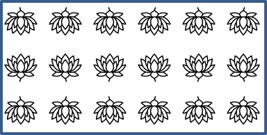

## **Bevezetés**

A PowerPointban alakzatokat adhatsz a diákhoz. Mivel az alakzatok vonalakból állnak, formázhatod őket a körvonaluk módosításával vagy hatások alkalmazásával. Ezen kívül megadhatsz olyan beállításokat is, amelyek szabályozzák, hogyan legyen kitöltve az alakzat belseje.


Az Aspose.Slides for Python osztályokat és tulajdonságokat biztosít, amelyekkel a PowerPointban elérhető ugyanazokkal a lehetőségekkel formázhatod az alakzatokat.

## **Vonalak formázása**

Az Aspose.Slides segítségével egyedi vonalstílust adhatsz egy alakzathoz. A következő lépések mutatják a folyamatot:

1. Hozz létre egy [Presentation](https://reference.aspose.com/slides/hu/python-net/aspose.slides/presentation/) osztálypéldányt.
1. Szerezz hivatkozást egy diára a indexe alapján.
1. Adj egy [AutoShape](https://reference.aspose.com/slides/hu/python-net/aspose.slides/autoshape/) elemet a diához.
1. Állítsd be az alakzat [vonalstílusát](https://reference.aspose.com/slides/hu/python-net/aspose.slides/linestyle/).
1. Állítsd be a vonalvastagságot.
1. Állítsd be az alakzat [vonalkarakterisztikáját](https://reference.aspose.com/slides/hu/python-net/aspose.slides/linedashstyle/).
1. Állítsd be az alakzat vonalszínét.
1. Mentsd a módosított prezentációt PPTX fájlként.

Az alábbi Python kód bemutatja, hogyan formázhatsz egy `AutoShape` téglalapot:

```python
import aspose.slides as slides
import aspose.pydrawing as draw

# Példányosítsa a Presentation osztályt, amely egy prezentációs fájlt képvisel.
with slides.Presentation() as presentation:

    # Szerezze meg az első diát.
    slide = presentation.slides[0]

    # Adjon hozzá egy automatikus alakzatot téglalap típusban.
    shape = slide.shapes.add_auto_shape(slides.ShapeType.RECTANGLE, 50, 150, 150, 75)

    # Állítsa be a téglalap alakzat kitöltőszínét.
    shape.fill_format.fill_type = slides.FillType.NO_FILL

    # Alkalmazzon formázást a téglalap vonalaira.
    shape.line_format.style = slides.LineStyle.THICK_THIN
    shape.line_format.width = 7
    shape.line_format.dash_style = slides.LineDashStyle.DASH

    # Állítsa be a téglalap vonalának színét.
    shape.line_format.fill_format.fill_type = slides.FillType.SOLID
    shape.line_format.fill_format.solid_fill_color.color = draw.Color.blue

    # Mentse el a PPTX fájlt a lemezen.
    presentation.save("formatted_lines.pptx", slides.export.SaveFormat.PPTX)
```

Az eredmény:


## **Kapcsolási stílusok formázása**

A három kapcsolási típus:

* Kör
* Merőleges
* Ferde

Alapértelmezés szerint, amikor a PowerPoint két vonalat összekapcsol egy szögben (például egy alakzat sarkán), a **Kör** beállítást használja. Ha azonban éles szögekkel rendelkező alakzatot rajzolsz, a **Merőleges** opció lehet előnyösebb.


Az alábbi Python kód bemutatja, hogyan hoztak létre három téglalapot (a fenti képen látható módon) a Merőleges, Ferde és Kör kapcsolási beállításokkal:

```python
import aspose.slides as slides
import aspose.pydrawing as draw

# Példányosítja a Presentation osztályt, amely egy prezentációs fájlt képvisel.
with slides.Presentation() as presentation:

	# Megkapja az első diát.
	slide = presentation.slides[0]

	# Hozzáad három automatikus alakzatot téglalap típusban.
	shape1 = slide.shapes.add_auto_shape(slides.ShapeType.RECTANGLE, 20, 20, 150, 75)
	shape2 = slide.shapes.add_auto_shape(slides.ShapeType.RECTANGLE, 210, 20, 150, 75)
	shape3 = slide.shapes.add_auto_shape(slides.ShapeType.RECTANGLE, 20, 135, 150, 75)

	# Beállítja minden téglalap alakzat kitöltőszínét.
	shape1.fill_format.fill_type = slides.FillType.SOLID
	shape1.fill_format.solid_fill_color.color = draw.Color.black
	shape2.fill_format.fill_type = slides.FillType.SOLID
	shape2.fill_format.solid_fill_color.color = draw.Color.black
	shape3.fill_format.fill_type = slides.FillType.SOLID
	shape3.fill_format.solid_fill_color.color = draw.Color.black

	# Beállítja a vonalvastagságot.
	shape1.line_format.width = 15
	shape2.line_format.width = 15
	shape3.line_format.width = 15

	# Beállítja minden téglalap vonalának színét.
	shape1.line_format.fill_format.fill_type = slides.FillType.SOLID
	shape1.line_format.fill_format.solid_fill_color.color = draw.Color.blue
	shape2.line_format.fill_format.fill_type = slides.FillType.SOLID
	shape2.line_format.fill_format.solid_fill_color.color = draw.Color.blue
	shape3.line_format.fill_format.fill_type = slides.FillType.SOLID
	shape3.line_format.fill_format.solid_fill_color.color = draw.Color.blue

	# Beállítja a csatlakozási stílust.
	shape1.line_format.join_style = slides.LineJoinStyle.MITER
	shape2.line_format.join_style = slides.LineJoinStyle.BEVEL
	shape3.line_format.join_style = slides.LineJoinStyle.ROUND

	# Hozzáad szöveget minden téglalaphoz.
	shape1.text_frame.text = "Miter Join style"
	shape2.text_frame.text = "Bevel Join style"
	shape3.text_frame.text = "Round Join style"

	# Elmenti a PPTX fájlt a lemezen.
	presentation.save("join_styles.pptx", slides.export.SaveFormat.PPTX)
```

## **Színátmenetes kitöltés**

A PowerPointban a Színátmenetes kitöltés egy olyan formázási lehetőség, amely lehetővé teszi, hogy folyamatos színkeverést alkalmazz egy alakzatra. Például két vagy több színt alkalmazhatsz úgy, hogy az egyik fokozatosan elmosódik a másikba.

Az alábbiak szerint alkalmazz színátmenetes kitöltést egy alakzatra az Aspose.Slides használatával:

1. Hozz létre egy [Presentation](https://reference.aspose.com/slides/hu/python-net/aspose.slides/presentation/) osztálypéldányt.
1. Szerezz hivatkozást egy diára a indexe alapján.
1. Adj egy [AutoShape](https://reference.aspose.com/slides/hu/python-net/aspose.slides/autoshape/) elemet a diához.
1. Állítsd be az alakzat [FillType](https://reference.aspose.com/slides/hu/python-net/aspose.slides/filltype/) értékét `GRADIENT`-re.
1. Add hozzá a két kívánt színt a meghatározott pozíciókkal a [GradientFormat](https://reference.aspose.com/slides/hu/python-net/aspose.slides/gradientformat/) osztály `gradient_stops` gyűjteményének `add` metódusaival.
1. Mentsd a módosított prezentációt PPTX fájlként.

Az alábbi Python kód bemutatja, hogyan alkalmazz színátmenetes kitöltést egy ellipszisen:

```python
import aspose.slides as slides

# Példányosítja a Presentation osztályt, amely egy prezentációs fájlt képvisel.
with slides.Presentation() as presentation:

    # Lekéri az első diát.
    slide = presentation.slides[0]

    # Hozzáad egy automatikus alakzatot ellipszis típusban.
    shape = slide.shapes.add_auto_shape(slides.ShapeType.ELLIPSE, 50, 50, 150, 75)

    # Színátmenetes formázást alkalmaz az ellipszisre.
    shape.fill_format.fill_type = slides.FillType.GRADIENT
    shape.fill_format.gradient_format.gradient_shape = slides.GradientShape.LINEAR

    # Beállítja a színátmenet irányát.
    shape.fill_format.gradient_format.gradient_direction = slides.GradientDirection.FROM_CORNER2

    # Hozzáad két színátmeneti állomást.
    shape.fill_format.gradient_format.gradient_stops.add(1.0, slides.PresetColor.PURPLE)
    shape.fill_format.gradient_format.gradient_stops.add(0, slides.PresetColor.RED)

    # Elmenti a PPTX fájlt a lemezen.
    presentation.save("gradient_fill.pptx", slides.export.SaveFormat.PPTX)
```

Az eredmény:


## **Minta kitöltés**

A PowerPointban a Minta kitöltés egy olyan formázási lehetőség, amely lehetővé teszi, hogy egy két színű mintát – például pontokat, csíkokat, keresztmintát vagy sakktáblát – alkalmazz egy alakzatra. A minta előtér és háttér színét egyéni módon is megadhatod.

Az Aspose.Slides több mint 45 előre definiált minta stílust kínál, amelyeket az alakzatokra alkalmazhatsz a prezentációk vizuális vonzerejének növelése érdekében. Még egy előre definiált minta kiválasztása után is megadhatod a pontos színeket, amelyeket használni kíván.

Az alábbiak szerint alkalmazz minta kitöltést egy alakzatra az Aspose.Slides használatával:

1. Hozz létre egy [Presentation](https://reference.aspose.com/slides/hu/python-net/aspose.slides/presentation/) osztálypéldányt.
1. Szerezz hivatkozást egy diára a indexe alapján.
1. Adj egy [AutoShape](https://reference.aspose.com/slides/hu/python-net/aspose.slides/autoshape/) elemet a diához.
1. Állítsd be az alakzat [FillType](https://reference.aspose.com/slides/hu/python-net/aspose.slides/filltype/) értékét `PATTERN`-re.
1. Válassz egy minta stílust az előre definiált lehetőségek közül.
1. Állítsd be a minta [back_color](https://reference.aspose.com/slides/hu/python-net/aspose.slides/patternformat/back_color/) értékét.
1. Állítsd be a minta [fore_color](https://reference.aspose.com/slides/hu/python-net/aspose.slides/patternformat/fore_color/) értékét.
1. Mentsd a módosított prezentációt PPTX fájlként.

Az alábbi Python kód bemutatja, hogyan alkalmazz minta kitöltést egy téglalapra:

```python
import aspose.slides as slides
import aspose.pydrawing as draw

# Példányosítja a Presentation osztályt, amely egy prezentációs fájlt képvisel.
with slides.Presentation() as presentation:

    # Lekéri az első diát.
    slide = presentation.slides[0]

    # Hozzáad egy automatikus alakzatot téglalap típusban.
    shape = slide.shapes.add_auto_shape(slides.ShapeType.RECTANGLE, 50, 50, 150, 75)

    # Beállítja a kitöltés típusát Mintára.
    shape.fill_format.fill_type = slides.FillType.PATTERN

    # Beállítja a minta stílusát.
    shape.fill_format.pattern_format.pattern_style = slides.PatternStyle.TRELLIS

    # Beállítja a minta háttér- és előtérszíneit.
    shape.fill_format.pattern_format.back_color.color = draw.Color.light_gray
    shape.fill_format.pattern_format.fore_color.color = draw.Color.yellow

    # Elmenti a PPTX fájlt a lemezen.
    presentation.save("pattern_fill.pptx", slides.export.SaveFormat.PPTX)
```

Az eredmény:


## **Kép kitöltés**

A PowerPointban a Kép kitöltés egy olyan formázási lehetőség, amely lehetővé teszi, hogy egy képet helyezz el egy alakzat belsejében – lényegében a képet a forma háttérként használva.

Az alábbiak szerint használhatod az Aspose.Slides‑t kép kitöltés alkalmazására egy alakzatra:

1. Hozz létre egy [Presentation](https://reference.aspose.com/slides/hu/python-net/aspose.slides/presentation/) osztálypéldányt.
1. Szerezz hivatkozást egy diára a indexe alapján.
1. Adj egy [AutoShape](https://reference.aspose.com/slides/hu/python-net/aspose.slides/autoshape/) elemet a diához.
1. Állítsd be az alakzat [FillType](https://reference.aspose.com/slides/hu/python-net/aspose.slides/filltype/) értékét `PICTURE`‑re.
1. Állítsd be a kép kitöltés módját `TILE`‑ra (vagy egy másik kívánt módra).
1. Hozz létre egy [PPImage](https://reference.aspose.com/slides/hu/python-net/aspose.slides/ppimage/) objektumot a felhasználni kívánt képből.
1. Rendeld hozzá ezt a képet az alakzat `picture_fill_format`-jának `picture.image` tulajdonságához.
1. Mentsd a módosított prezentációt PPTX fájlként.

Tegyük fel, hogy van egy "lotus.png" fájlunk a következő képpel:


Az alábbi Python kód bemutatja, hogyan töltheted ki egy alakzatot a képpel:

```python
import aspose.slides as slides

# Példányosítja a Presentation osztályt, amely egy prezentációs fájlt képvisel.
with slides.Presentation() as presentation:

    # Lekéri az első diát.
    slide = presentation.slides[0]

    # Hozzáad egy automatikus alakzatot téglalap típusban.
    shape = slide.shapes.add_auto_shape(slides.ShapeType.RECTANGLE, 50, 50, 192, 95)

    # Beállítja a kitöltés típusát Kép.
    shape.fill_format.fill_type = slides.FillType.PICTURE

    # Beállítja a kép kitöltés módját.
    shape.fill_format.picture_fill_format.picture_fill_mode = slides.PictureFillMode.TILE

    # Betölti a képet és hozzáadja a prezentáció erőforrásaihoz.
    with slides.Images.from_file("lotus.png") as image:
        presentation_image = presentation.images.add_image(image)

    # Beállítja a képet.
    shape.fill_format.picture_fill_format.picture.image = presentation_image

    # Elmenti a PPTX fájlt a lemezen.
    presentation.save("picture_fill.pptx", slides.export.SaveFormat.PPTX)
```

Az eredmény:


### **Csempe kép textúraként**

Ha csempézett képet szeretnél textúraként beállítani, és testre szabni a csempézés viselkedését, a [PictureFillFormat](https://reference.aspose.com/slides/hu/python-net/aspose.slides/picturefillformat/) osztály következő tulajdonságait használhatod:

- [picture_fill_mode](https://reference.aspose.com/slides/hu/python-net/aspose.slides/picturefillformat/picture_fill_mode/): Beállítja a kép kitöltés módját – `TILE` vagy `STRETCH`.
- [tile_alignment](https://reference.aspose.com/slides/hu/python-net/aspose.slides/picturefillformat/tile_alignment/): Meghatározza a csempék igazítását az alakzaton belül.
- [tile_flip](https://reference.aspose.com/slides/hu/python-net/aspose.slides/picturefillformat/tile_flip/): Szabályozza, hogy a csempe vízszintesen, függőlegesen vagy mindkettőre legyen tükrözve.
- [tile_offset_x](https://reference.aspose.com/slides/hu/python-net/aspose.slides/picturefillformat/tile_offset_x/): Beállítja a csempe vízszintes eltolását (pontban) az alakzat kiindulópontjától.
- [tile_offset_y](https://reference.aspose.com/slides/hu/python-net/aspose.slides/picturefillformat/tile_offset_y/): Beállítja a csempe függőleges eltolását (pontban) az alakzat kiindulópontjától.
- [tile_scale_x](https://reference.aspose.com/slides/hu/python-net/aspose.slides/picturefillformat/tile_scale_x/): Meghatározza a csempe vízszintes méretezését százalékban.
- [tile_scale_y](https://reference.aspose.com/slides/hu/python-net/aspose.slides/picturefillformat/tile_scale_y/): Meghatározza a csempe függőleges méretezését százalékban.

Az alábbi kódrészlet bemutatja, hogyan adhatunk hozzá egy téglalap alakzatot csempézett kép kitöltéssel, és konfigurálhatjuk a csempe beállításait:

```py
import aspose.slides as slides

# Példányosítja a Presentation osztályt, amely egy prezentációs fájlt képvisel.
with slides.Presentation() as presentation:

    # Lekéri az első diát.
    first_slide = presentation.slides[0]

    # Hozzáad egy téglalap automatikus alakzatot.
    shape = first_slide.shapes.add_auto_shape(slides.ShapeType.RECTANGLE, 50, 50, 190, 95)

    # Beállítja az alakzat kitöltés típusát Képre.
    shape.fill_format.fill_type = slides.FillType.PICTURE

    # Betölti a képet és hozzáadja a prezentáció erőforrásaihoz.
    with slides.Images.from_file("lotus.png") as source_image:
        presentation_image = presentation.images.add_image(source_image)

    # Hozzáadja a képet az alakzathoz.
    picture_fill_format = shape.fill_format.picture_fill_format
    picture_fill_format.picture.image = presentation_image

    # Konfigurálja a kép kitöltés módját és a csempézési tulajdonságokat.
    picture_fill_format.picture_fill_mode = slides.PictureFillMode.TILE
    picture_fill_format.tile_offset_x = -32
    picture_fill_format.tile_offset_y = -32
    picture_fill_format.tile_scale_x = 50
    picture_fill_format.tile_scale_y = 50
    picture_fill_format.tile_alignment = slides.RectangleAlignment.BOTTOM_RIGHT
    picture_fill_format.tile_flip = slides.TileFlip.FLIP_BOTH

    # Elmenti a PPTX fájlt a lemezen.
    presentation.save("tile.pptx", slides.export.SaveFormat.PPTX)
```

Az eredmény:



## **Egyszínű kitöltés**

A PowerPointban az Egyszínű kitöltés egy formázási lehetőség, amely egyetlen, egységes színnel tölti ki az alakzatot. Ez az egyszerű háttérszín nincs kiegészítve színátmenetekkel, textúrákkal vagy mintákkal.

Egyszínű kitöltés alkalmazásához egy alakzatra az Aspose.Slides használatával kövesd az alábbi lépéseket:

1. Hozz létre egy [Presentation](https://reference.aspose.com/slides/hu/python-net/aspose.slides/presentation/) osztálypéldányt.
1. Szerezz hivatkozást egy diára a indexe alapján.
1. Adj egy [AutoShape](https://reference.aspose.com/slides/hu/python-net/aspose.slides/autoshape/) elemet a diához.
1. Állítsd be az alakzat [FillType](https://reference.aspose.com/slides/hu/python-net/aspose.slides/filltype/) értékét `SOLID`‑ra.
1. Rendeld hozzá a kívánt kitöltőszínt az alakzathoz.
1. Mentsd a módosított prezentációt PPTX fájlként.

Az alábbi Python kód bemutatja, hogyan alkalmazz egyszínű kitöltést egy téglalapra egy PowerPoint dián:

```python
import aspose.slides as slides
import aspose.pydrawing as draw

# Példányosítja a Presentation osztályt, amely egy prezentációs fájlt képvisel.
with slides.Presentation() as presentation:

    # Lekéri az első diát.
    slide = presentation.slides[0]

    # Hozzáad egy automatikus alakzatot téglalap típusban.
    shape = slide.shapes.add_auto_shape(slides.ShapeType.RECTANGLE, 50, 50, 150, 75)

    # Beállítja a kitöltés típusát Szilárdra.
    shape.fill_format.fill_type = slides.FillType.SOLID

    # Beállítja a kitöltőszínt.
    shape.fill_format.solid_fill_color.color = draw.Color.yellow

    # Elmenti a PPTX fájlt a lemezen.
    presentation.save("solid_color_fill.pptx", slides.export.SaveFormat.PPTX)
```

Az eredmény:


## **Átlátszóság beállítása**

A PowerPointban, amikor egyszínű, színátmenetes, képes vagy textúraszerű kitöltést alkalmazol alakzatokra, beállíthatsz átlátszósági szintet, amely szabályozza a kitöltés átlátszóságát. Magasabb átlátszósági érték a alakzatot áttetszőbbé teszi, így a háttér vagy az alatta lévő objektumok részben láthatóvá válnak.

Az Aspose.Slides lehetővé teszi az átlátszósági szint beállítását a kitöltés színének alfa értékének módosításával. Így teheted:

1. Hozz létre egy [Presentation](https://reference.aspose.com/slides/hu/python-net/aspose.slides/presentation/) osztálypéldányt.
1. Szerezz hivatkozást egy diára a indexe alapján.
1. Adj egy [AutoShape](https://reference.aspose.com/slides/hu/python-net/aspose.slides/autoshape/) elemet a diához.
1. Állítsd be a kitöltés típusát `SOLID`‑ra.
1. Használd a `Color.from_argb` metódust, hogy átlátszó színt definiálj (az `alpha` komponens szabályozza az átlátszóságot).
1. Mentsd a prezentációt.

Az alábbi Python kód bemutatja, hogyan alkalmazz átlátszó kitöltőszínt egy téglalapra:

```python
import aspose.pydrawing as draw
import aspose.slides as slides

# Példányosítja a Presentation osztályt, amely egy prezentációs fájlt képvisel.
with slides.Presentation() as presentation:

    # Lekéri az első diát.
    slide = presentation.slides[0]
    
    # Hozzáad egy szilárd téglalap automatikus alakzatot.
    slide.shapes.add_auto_shape(slides.ShapeType.RECTANGLE, 50, 50, 150, 75)

    # Hozzáad egy áttetsző téglalap automatikus alakzatot a szilárd alakzat fölé.
    shape = slide.shapes.add_auto_shape(slides.ShapeType.RECTANGLE, 80, 80, 150, 75)
    shape.fill_format.fill_type = slides.FillType.SOLID
    shape.fill_format.solid_fill_color.color = draw.Color.from_argb(128, 204, 102, 0)
    
    presentation.save("shape_transparency.pptx", slides.export.SaveFormat.PPTX)
```

Az eredmény:


## **Alakzatok forgatása**

Az Aspose.Slides lehetővé teszi az alakzatok forgatását PowerPoint prezentációkban. Ez akkor hasznos, ha a vizuális elemeket speciális igazítási vagy tervezési igények szerint kell elhelyezni.

Alakzat forgatásához egy dián kövesd az alábbi lépéseket:

1. Hozz létre egy [Presentation](https://reference.aspose.com/slides/hu/python-net/aspose.slides/presentation/) osztálypéldányt.
1. Szerezz hivatkozást egy diára a indexe alapján.
1. Adj egy [AutoShape](https://reference.aspose.com/slides/hu/python-net/aspose.slides/autoshape/) elemet a diához.
1. Állítsd be az alakzat `rotation` tulajdonságát a kívánt fokra.
1. Mentsd a prezentációt.

Az alábbi Python kód bemutatja, hogyan forgathatsz egy alakzatot 5 fokkal:

```python
import aspose.slides as slides

# Példányosítja a Presentation osztályt, amely egy prezentációs fájlt képvisel.
with slides.Presentation() as presentation:

    # Lekéri az első diát.
    slide = presentation.slides[0]

    # Hozzáad egy automatikus alakzatot téglalap típusban.
    shape = slide.shapes.add_auto_shape(slides.ShapeType.RECTANGLE, 50, 50, 150, 75)

    # Forgatja az alakzatot 5 fokkal.
    shape.rotation = 5

    # Elmenti a PPTX fájlt a lemezen.
    presentation.save("shape_rotation.pptx", slides.export.SaveFormat.PPTX)
```

Az eredmény:


## **3D lépcsőhatás hozzáadása**

Az Aspose.Slides lehetővé teszi 3D lépcsőhatások alkalmazását alakzatokon a [ThreeDFormat](https://reference.aspose.com/slides/hu/python-net/aspose.slides/threedformat/) tulajdonságainak beállításával.

3D lépcsőhatás hozzáadásához egy alakzathoz kövesd az alábbi lépéseket:

1. Hozz létre egy [Presentation](https://reference.aspose.com/slides/hu/python-net/aspose.slides/presentation/) osztálypéldányt.
1. Szerezz hivatkozást egy diára a indexe alapján.
1. Adj egy [AutoShape](https://reference.aspose.com/slides/hu/python-net/aspose.slides/autoshape/) elemet a diához.
1. Konfiguráld az alakzat [ThreeDFormat](https://reference.aspose.com/slides/hu/python-net/aspose.slides/threedformat/) tulajdonságait a lépcsőbeállítások meghatározásához.
1. Mentsd a prezentációt.

Az alábbi Python kód megmutatja, hogyan alkalmazz 3D lépcsőhatást egy alakzaton:

```python
import aspose.slides as slides
import aspose.pydrawing as draw

# Példányosítja a Presentation osztályt.
with slides.Presentation() as presentation:

    slide = presentation.slides[0]

    # Hozzáad egy alakzatot a diára.
    shape = slide.shapes.add_auto_shape(slides.ShapeType.ELLIPSE, 50, 50, 100, 100)
    shape.fill_format.fill_type = slides.FillType.SOLID
    shape.fill_format.solid_fill_color.color = draw.Color.green
    shape.line_format.fill_format.fill_type = slides.FillType.SOLID
    shape.line_format.fill_format.solid_fill_color.color = draw.Color.orange
    shape.line_format.width = 2.0

    # Beállítja az alakzat ThreeDFormat tulajdonságait.
    shape.three_d_format.depth = 4
    shape.three_d_format.bevel_top.bevel_type = slides.BevelPresetType.CIRCLE
    shape.three_d_format.bevel_top.height = 6
    shape.three_d_format.bevel_top.width = 6
    shape.three_d_format.camera.camera_type = slides.CameraPresetType.ORTHOGRAPHIC_FRONT
    shape.three_d_format.light_rig.light_type = slides.LightRigPresetType.THREE_PT
    shape.three_d_format.light_rig.direction = slides.LightingDirection.TOP

    # Mentse a prezentációt PPTX fájlként.
    presentation.save("3D_bevel_effect.pptx", slides.export.SaveFormat.PPTX)
```

Az eredmény:


## **3D forgatási hatás hozzáadása**

Az Aspose.Slides lehetővé teszi 3D forgatási hatások alkalmazását alakzatokon a [ThreeDFormat](https://reference.aspose.com/slides/hu/python-net/aspose.slides/threedformat/) tulajdonságainak beállításával.

3D forgatás alkalmazásához egy alakzaton:

1. Hozz létre egy [Presentation](https://reference.aspose.com/slides/hu/python-net/aspose.slides/presentation/) osztálypéldányt.
1. Szerezz hivatkozást egy diára a indexe alapján.
1. Adj egy [AutoShape](https://reference.aspose.com/slides/hu/python-net/aspose.slides/autoshape/) elemet a diához.
1. Állítsd be az alakzat [camera_type](https://reference.aspose.com/slides/hu/python-net/aspose.slides/camera/camera_type/) és [light_type](https://reference.aspose.com/slides/hu/python-net/aspose.slides/lightrig/light_type/) tulajdonságait a 3D forgatás meghatározásához.
1. Mentsd a prezentációt.

Az alábbi Python kód bemutatja, hogyan alkalmazz 3D forgatási hatást egy alakzaton:

```python
import aspose.slides as slides

# Létrehozza a Presentation osztály példányát.
with slides.Presentation() as presentation:

    slide = presentation.slides[0]

    auto_shape = slide.shapes.add_auto_shape(slides.ShapeType.RECTANGLE, 50, 50, 150, 75)
    auto_shape.text_frame.text = "Hello, Aspose!"

    auto_shape.three_d_format.depth = 6
    auto_shape.three_d_format.camera.set_rotation(40, 35, 20)
    auto_shape.three_d_format.camera.camera_type = slides.CameraPresetType.ISOMETRIC_LEFT_UP
    auto_shape.three_d_format.light_rig.light_type = slides.LightRigPresetType.BALANCED

    # Elmenti a prezentációt PPTX fájlként.      
    presentation.save("3D_rotation_effect.pptx", slides.export.SaveFormat.PPTX)
```

Az eredmény:


## **Formázás visszaállítása**

Az alábbi Python kód megmutatja, hogyan állítsd vissza egy dia formázását, és hogyan állítsd alaphelyzetbe a helyzetet, méretet és a [LayoutSlide](https://reference.aspose.com/slides/hu/python-net/aspose.slides/layoutslide/) helyőrzőkkel rendelkező alakzatok formázását:

```python
import aspose.slides as slides

with slides.Presentation("sample.pptx") as presentation:

    for slide in presentation.slides:
        # Visszaállítja a dián lévő minden alakzatot, amelynek helyőrzője van az elrendezésben.
        slide.reset()

    presentation.save("reset_formatting.pptx", slides.export.SaveFormat.PPTX)
```

## **GYIK**

**A formaformázás befolyásolja a kész prezentáció fájlméretét?**

Csak minimálisan. A beágyazott képek és média foglalják a legtöbb helyet, míg a forma paraméterek – például színek, hatások és színátmenetek – metaadatként tárolódnak, és gyakorlatilag nem növelik a méretet.

**Hogyan tudom felismerni azokat a dián lévő alakzatokat, amelyek azonos formázást használnak, hogy csoportosíthassam őket?**

Hasonlítsd össze minden alakzat kulcsfontosságú formázási tulajdonságait – kitöltés, vonal és hatás beállításait. Ha minden megfelelő érték megegyezik, tekintsd a stílusukat azonosnak, és logikailag csoportosítsd ezeket az alakzatokat, ami egyszerűsíti a későbbi stíluskezelést.

**Menthetek egy egyedi forma stílusokból álló készletet külön fájlba, hogy más prezentációkban újra felhasználjam?**

Igen. Tárold a kívánt stílusokkal rendelkező mintaalakzatokat egy sablon diakönyvtárban vagy egy .POTX sablonfájlban. Új prezentáció létrehozásakor nyisd meg a sablont, klónozd a szükséges stílusú alakzatokat, és alkalmazd a formázásukat a kívánt helyeken.