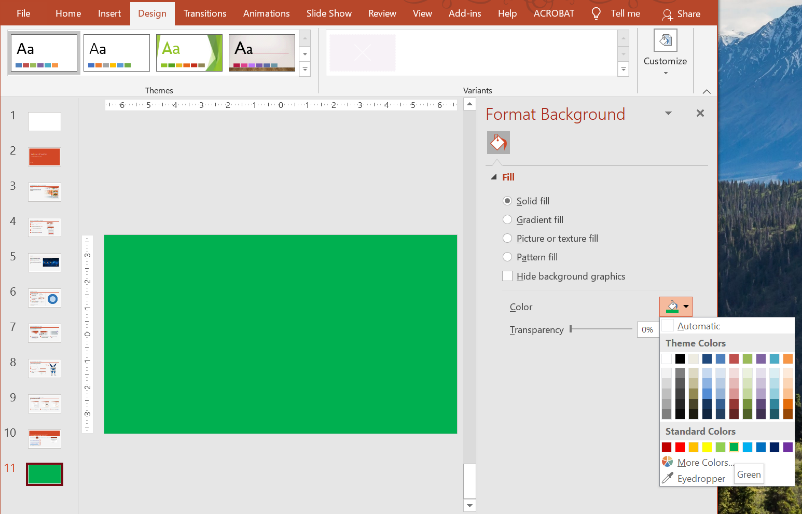

## **Bevezetés**

Az egyszínű háttér, a színátmenetek és a képek gyakran használatosak a diák háttereként. Beállíthatja a hátteret egy **normál dia** (egyetlen dia) vagy egy **mester dia** (egyszerre több diára vonatkozik) számára.



## **Állítsa be az egyszínű háttérszínt egy normál diára**

Az Aspose.Slides lehetővé teszi, hogy egy egyszínű színt állítson be háttérként egy adott diára a prezentációban – még akkor is, ha a prezentáció mester diát használ. A módosítás csak a kiválasztott diára vonatkozik.

1. Hozzon létre egy példányt a [Presentation](https://reference.aspose.com/slides/hu/python-net/aspose.slides/presentation/) osztályból.
2. Állítsa be a dia [BackgroundType](https://reference.aspose.com/slides/hu/python-net/aspose.slides/backgroundtype/) értékét `OWN_BACKGROUND`-ra.
3. Állítsa be a dia háttér [FillType](https://reference.aspose.com/slides/hu/python-net/aspose.slides/filltype/) értékét `SOLID`-ra.
4. Használja a `solid_fill_color` tulajdonságot a [FillFormat](https://reference.aspose.com/slides/hu/python-net/aspose.slides/fillformat/) osztályon, hogy megadja az egyszínű háttérszínt.
5. Mentse el a módosított prezentációt.

Az alábbi Python példa bemutatja, hogyan állíthat be kék egyszínű hátteret egy normál diára:

```python
import aspose.pydrawing as draw
import aspose.slides as slides

# Hozzon létre egy példányt a Presentation osztályból.
with slides.Presentation() as presentation:
    slide = presentation.slides[0]

    # Állítsa be a dia háttérszínét kékre.
    slide.background.type = slides.BackgroundType.OWN_BACKGROUND
    slide.background.fill_format.fill_type = slides.FillType.SOLID
    slide.background.fill_format.solid_fill_color.color = draw.Color.blue

    # Mentse el a prezentációt a lemezen.
    presentation.save("SolidColorBackground.pptx", slides.export.SaveFormat.PPTX)
```

## **Állítsa be az egyszínű háttérszínt a mester diára**

Az Aspose.Slides lehetővé teszi, hogy egyszínű színt állítson be háttérként a prezentáció mester diájára. A mester dia sablonként működik, amely a formázást minden dia számára szabályozza, ezért ha egyszínű színt választ a mester dia háttérre, az minden diára érvényesül.

1. Hozzon létre egy példányt a [Presentation](https://reference.aspose.com/slides/hu/python-net/aspose.slides/presentation/) osztályból.
2. Állítsa be a mester dia [BackgroundType](https://reference.aspose.com/slides/hu/python-net/aspose.slides/backgroundtype/) (a `masters` segítségével) értékét `OWN_BACKGROUND`-ra.
3. Állítsa be a mester dia háttér [FillType](https://reference.aspose.com/slides/hu/python-net/aspose.slides/filltype/) értékét `SOLID`-ra.
4. Használja a `solid_fill_color` tulajdonságot a [FillFormat](https://reference.aspose.com/slides/hu/python-net/aspose.slides/fillformat/) osztályon, hogy megadja az egyszínű háttérszínt.
5. Mentse el a módosított prezentációt.

Az alábbi Python példa bemutatja, hogyan állíthat be egy egyszínű színt (erdőzöld) a mester dia háttérként:

```python
import aspose.pydrawing as draw
import aspose.slides as slides

# Hozzon létre egy példányt a Presentation osztályból.
with slides.Presentation() as presentation:
    master_slide = presentation.masters[0]

    # Állítsa be a mester dia háttérszínét erdei zöldre.
    master_slide.background.type = slides.BackgroundType.OWN_BACKGROUND
    master_slide.background.fill_format.fill_type = slides.FillType.SOLID
    master_slide.background.fill_format.solid_fill_color.color = draw.Color.forest_green

    # Mentse el a prezentációt a lemezen.
    presentation.save("MasterSlideBackground.pptx", slides.export.SaveFormat.PPTX)
```

## **Állítsa be a színátmenetes hátteret egy diára**

Egy színátmenet olyan grafikai hatás, amely fokozatos színváltozással jön létre. Diák háttereként használva a színátmenetek művészibbé és professzionálisabbá tehetik a prezentációkat. Az Aspose.Slides lehetővé teszi, hogy színátmenetes színt állítson be háttérként a diákra.

1. Hozzon létre egy példányt a [Presentation](https://reference.aspose.com/slides/hu/python-net/aspose.slides/presentation/) osztályból.
2. Állítsa be a dia [BackgroundType](https://reference.aspose.com/slides/hu/python-net/aspose.slides/backgroundtype/) értékét `OWN_BACKGROUND`-ra.
3. Állítsa be a dia háttér [FillType](https://reference.aspose.com/slides/hu/python-net/aspose.slides/filltype/) értékét `GRADIENT`-ra.
4. Használja a `gradient_format` tulajdonságot a [FillFormat](https://reference.aspose.com/slides/hu/python-net/aspose.slides/fillformat/) osztályon, hogy beállítsa a kívánt színátmenet beállításokat.
5. Mentse el a módosított prezentációt.

Az alábbi Python példa bemutatja, hogyan állíthat be egy színátmenetes színt a diák háttérként:

```python
import aspose.slides as slides

# Hozzon létre egy példányt a Presentation osztályból.
with slides.Presentation() as presentation:
    slide = presentation.slides[0]

    # Alkalmazzon egy színátmenet hatást a háttérre.
    slide.background.type = slides.BackgroundType.OWN_BACKGROUND
    slide.background.fill_format.fill_type = slides.FillType.GRADIENT
    slide.background.fill_format.gradient_format.tile_flip = slides.TileFlip.FLIP_BOTH

    # Mentse el a prezentációt a lemezen.
    presentation.save("GradientBackground.pptx", slides.export.SaveFormat.PPTX)
```

## **Állítsa be a képet diák háttérként**

Az egyszínű és színátmenetes kitöltések mellett az Aspose.Slides lehetővé teszi, hogy képeket használjon diák háttérként.

1. Hozzon létre egy példányt a [Presentation](https://reference.aspose.com/slides/hu/python-net/aspose.slides/presentation/) osztályból.
2. Állítsa be a dia [BackgroundType](https://reference.aspose.com/slides/hu/python-net/aspose.slides/backgroundtype/) értékét `OWN_BACKGROUND`-ra.
3. Állítsa be a dia háttér [FillType](https://reference.aspose.com/slides/hu/python-net/aspose.slides/filltype/) értékét `PICTURE`-ra.
4. Töltse be a képet, amelyet a diák háttérként szeretne használni.
5. Adja hozzá a képet a prezentáció képgyűjteményéhez.
6. Használja a `picture_fill_format` tulajdonságot a [FillFormat](https://reference.aspose.com/slides/hu/python-net/aspose.slides/fillformat/) osztályon, hogy a képet háttérként hozzárendelje.
7. Mentse el a módosított prezentációt.

Az alábbi Python példa bemutatja, hogyan állíthat be egy képet a diák háttérként:

```python
import aspose.slides as slides

# Hozzon létre egy példányt a Presentation osztályból.
with slides.Presentation() as presentation:
    slide = presentation.slides[0]

    # Állítsa be a háttérkép tulajdonságait.
    slide.background.type = slides.BackgroundType.OWN_BACKGROUND
    slide.background.fill_format.fill_type = slides.FillType.PICTURE
    slide.background.fill_format.picture_fill_format.picture_fill_mode = slides.PictureFillMode.STRETCH

    # Töltse be a képet.
    with slides.Images.from_file("Tulips.jpg") as image:
        # Adja hozzá a képet a prezentáció képgyűjteményéhez.
        pp_image = presentation.images.add_image(image)

    slide.background.fill_format.picture_fill_format.picture.image = pp_image

    # Mentse el a prezentációt a lemezen.
    presentation.save("ImageAsBackground.pptx", slides.export.SaveFormat.PPTX)
```

Az alábbi kódminta bemutatja, hogyan állítható be a háttér kitöltési típusa mozaik képre, és módosíthatók a mozaik beállítások:

```py
import aspose.slides as slides

with slides.Presentation() as presentation:

    first_slide = presentation.slides[0]

    background = first_slide.background

    background.type = slides.BackgroundType.OWN_BACKGROUND
    background.fill_format.fill_type = slides.FillType.PICTURE

    with slides.Images.from_file("image.png") as new_image:
        pp_image = presentation.images.add_image(new_image)

    # Állítsa be a háttér kitöltéséhez használt képet.
    back_picture_fill_format = background.fill_format.picture_fill_format
    back_picture_fill_format.picture.image = pp_image

    # Állítsa be a kép kitöltési módot Csempére, és módosítsa a csempe tulajdonságait.
    back_picture_fill_format.picture_fill_mode = slides.PictureFillMode.TILE
    back_picture_fill_format.tile_offset_x = 15.0
    back_picture_fill_format.tile_offset_y = 15.0
    back_picture_fill_format.tile_scale_x = 46.0
    back_picture_fill_format.tile_scale_y = 87.0
    back_picture_fill_format.tile_alignment = slides.RectangleAlignment.CENTER
    back_picture_fill_format.tile_flip = slides.TileFlip.FLIP_Y

    presentation.save("TileBackground.pptx", slides.export.SaveFormat.PPTX)
```

{}
További információ: [**Kép csempézése textúraként**](/slides/hu/python-net/shape-formatting/#tile-picture-as-texture).
{}

### **A háttérkép átlátszóságának módosítása**

Hogy a dia tartalma kiemelkedjen, előfordulhat, hogy a diák háttérkép átlátszóságát szeretné állítani. Az alábbi Python kód bemutatja, hogyan változtathatja meg egy diák háttérkép átlátszóságát:

```python
transparency_value = 30  # Például.

# Szerezze meg a kép transzformációs műveletek gyűjteményét.
image_transform = slide.background.fill_format.picture_fill_format.picture.image_transform

transparency_operation = None

# Keressen egy meglévő fix százalékos átlátszósági hatást.
for operation in image_transform:
    if type(operation) is slides.AlphaModulateFixed:
        transparency_operation = operation
        break

# Állítsa be az új átlátszósági értéket.
if transparency_operation is None:
    image_transform.add_alpha_modulate_fixed_effect(100 - transparency_value)
else:
    transparency_operation.amount = 100 - transparency_value
```

## **A dia háttérértékének lekérése**

Aspose.Slides biztosítja az [IBackgroundEffectiveData](https://reference.aspose.com/slides/hu/python-net/aspose.slides/ibackgroundeffectivedata/) osztályt a dia hatékony háttérértékeinek lekérdezéséhez. Ez az osztály elérhetővé teszi a hatékony [FillFormat](https://reference.aspose.com/slides/hu/python-net/aspose.slides/fillformat/) és [EffectFormat](https://reference.aspose.com/slides/hu/python-net/aspose.slides/effectformat/) objektumokat. A [BaseSlide](https://reference.aspose.com/slides/hu/python-net/aspose.slides/baseslide/) osztály `background` tulajdonságával lekérheti egy dia hatékony hátterét.

Az alábbi Python példa bemutatja, hogyan lehet lekérni egy dia hatékony háttérértékét:

```python
import aspose.slides as slides

# Hozzon létre egy példányt a Presentation osztályból.
with slides.Presentation("Sample.pptx") as presentation:
    slide = presentation.slides[0]

    # Szerezze meg a hatékony hátteret, figyelembe véve a master, layout és a témát.
    effective_background = slide.background.get_effective()

    if effective_background.fill_format.fill_type == slides.FillType.SOLID:
        color = effective_background.fill_format.solid_fill_color
        print(f"Fill color: Color [A={color.a}, R={color.r}, G={color.g}, B={color.b}]")
    else:
        print("Fill type:", str(effective_background.fill_format.fill_type))
```

## **GYIK**

**Visszaállíthatom a saját háttér beállítását, és visszakaphatom a téma/layoutháttérét?**

Igen. Távolítsa el a dia egyéni kitöltését, ekkor a háttér újra a megfelelő [layout](/slides/hu/python-net/slide-layout/)/[master](/slides/hu/python-net/slide-master/) diától öröklődik (azaz a [téma háttér](/slides/hu/python-net/presentation-theme/) lesz).

**Mi történik a háttérrel, ha később megváltoztatom a prezentáció témáját?**

Ha egy diának saját kitöltése van, az változatlan marad. Ha a háttér a [layout](/slides/hu/python-net/slide-layout/)/[master](/slides/hu/python-net/slide-master/) diától öröklődik, akkor frissül, hogy megfeleljen az [új témának](/slides/hu/python-net/presentation-theme/).