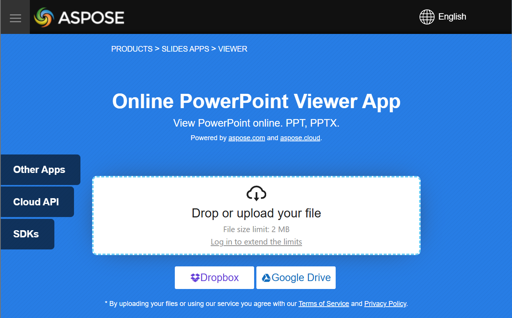

## **Bevezetés**

Az Aspose.Slides for Python a diavetítések fájljainak, diák létrehozására használható. Ezeket a diákat meg lehet tekinteni például a Microsoft PowerPoint programmal. Azonban a fejlesztők néha képekként szeretnék megjeleníteni a diákat a kedvenc képnézegetőjükben, vagy egy egyéni diavetítőben használni őket. Ilyen esetekben az Aspose.Slides lehetővé teszi az egyes diák képként történő exportálását. Ez a cikk bemutatja, hogyan lehet ezt megtenni.

## **SVG kép létrehozása diából**

Az Aspose.Slides használatával egy prezentációdiából SVG képet előállítani, kövesse az alábbi lépéseket:

1. Hozzon létre egy példányt a [Presentation](https://reference.aspose.com/slides/hu/python-net/aspose.slides/presentation/) osztályból.
2. Szerezzen referenciát a diára az indexe alapján.
3. Nyisson meg egy fájlfolyamot.
4. Mentse a diát SVG képként a fájlfolyamra.

```py
import aspose.slides as slides

slide_index = 0

with slides.Presentation("sample.pptx") as presentation:
    slide = presentation.slides[slide_index]

    with open("output.svg", "wb") as svg_stream:
        slide.write_as_svg(svg_stream)
```

## **Dia bélyegkép létrehozása**

Aspose.Slides segít a diák bélyegképeinek előállításában. A dia bélyegképének létrehozásához az Aspose.Slides használatával, kövesse az alábbi lépéseket:

1. Hozzon létre egy példányt a [Presentation](https://reference.aspose.com/slides/hu/python-net/aspose.slides/presentation/) osztályból.
2. Szerezzen referenciát a diára az indexe alapján.
3. Hozzon létre egy bélyegképet a hivatkozott diáról a kívánt méretarányban.
4. Mentse a bélyegképet a kívánt képformátumban.

```py
import aspose.slides as slides

slide_index = 0
scale_x = 1
scale_y = scale_x

with slides.Presentation("sample.pptx") as presentation:
    slide = presentation.slides[slide_index]

    with slide.get_image(scale_x, scale_y) as image:
        image.save("output.jpg", slides.ImageFormat.JPEG)
```

## **Dia bélyegkép létrehozása felhasználó által meghatározott méretekkel**

Felhasználó által meghatározott méretekkel ellátott dia bélyegkép létrehozásához, kövesse az alábbi lépéseket:

1. Hozzon létre egy példányt a [Presentation](https://reference.aspose.com/slides/hu/python-net/aspose.slides/presentation/) osztályból.
2. Szerezzen referenciát a diára az indexe alapján.
3. Generáljon egy bélyegképet a hivatkozott diáról a megadott méretekkel.
4. Mentse a bélyegképet a kívánt képformátumban.

```py
import aspose.slides as slides
import aspose.pydrawing as pydrawing

slide_index = 0
slide_size = pydrawing.Size(1200, 800)

with slides.Presentation("sample.pptx") as presentation:
    slide = presentation.slides[slide_index]

    with slide.get_image(slide_size) as image:
        image.save("output.jpg", slides.ImageFormat.JPEG)
```

## **Dia bélyegkép előállítása előadói jegyzetekkel**

Az Aspose.Slides használatával előadói jegyzetekkel ellátott dia bélyegkép előállításához, kövesse az alábbi lépéseket:

1. Hozzon létre egy példányt a [RenderingOptions](https://reference.aspose.com/slides/hu/python-net/aspose.slides.export/renderingoptions/) osztályból.
2. Használja a `RenderingOptions.slides_layout_options` tulajdonságot az előadói jegyzetek pozíciójának beállításához.
3. Hozzon létre egy példányt a [Presentation](https://reference.aspose.com/slides/hu/python-net/aspose.slides/presentation/) osztályból.
4. Szerezzen referenciát a diára az indexe alapján.
5. Generáljon egy bélyegképet a hivatkozott diáról a renderelési beállítások használatával.
6. Mentse a bélyegképet a kívánt képformátumban.

```py
slide_index = 0

layout_options = slides.export.NotesCommentsLayoutingOptions()
layout_options.notes_position = slides.export.NotesPositions.BOTTOM_TRUNCATED

rendering_options = slides.export.RenderingOptions()
rendering_options.slides_layout_options = layout_options

with slides.Presentation("sample.pptx") as presentation:
    slide = presentation.slides[slide_index]

    with slide.get_image(rendering_options) as image:
        image.save("output.png", slides.ImageFormat.PNG)
```

## **Élő példa**

Próbálja ki az [**Aspose.Slides Viewer**](https://products.aspose.app/slides/hu/viewer/) ingyenes alkalmazást, hogy lássa, mit valósíthat meg az Aspose.Slides API-val:

[](https://products.aspose.app/slides/hu/viewer/)

## **GYIK**

**Beágyazhatok-e egy prezentációs nézőt egy ASP.NET webalkalmazásba?**

Igen. Az Aspose.Slides szerveroldalon használható a diák renderelésére [képek](/slides/hu/python-net/convert-powerpoint-to-png/) vagy [HTML](/slides/hu/python-net/convert-powerpoint-to-html/) formájában, és megjeleníthetőek a böngészőben. A navigációs és nagyítási funkciók JavaScript segítségével valósíthatók meg egy interaktív élményhez.

**Mi a legjobb módja a diák megjelenítésének egy egyéni .NET nézőben?**

Az ajánlott megközelítés, hogy minden diát [képként](/slides/hu/python-net/convert-powerpoint-to-png/) (például PNG vagy SVG) renderelünk, vagy az Aspose.Slides segítségével [HTML]-re konvertáljuk, majd a kimenetet egy képmezőben (asztali alkalmazás esetén) vagy HTML konténerben (web esetén) jelenítjük meg.

**Hogyan kezeljem a sok diát tartalmazó nagy prezentációkat?**

Nagy prezentációk esetén érdemes a diák lazy-loading vagy igény szerinti renderelését alkalmazni. Ez azt jelenti, hogy egy dia tartalma csak akkor generálódik, amikor a felhasználó rá navigál, ezáltal csökkentve a memória- és betöltési időt.