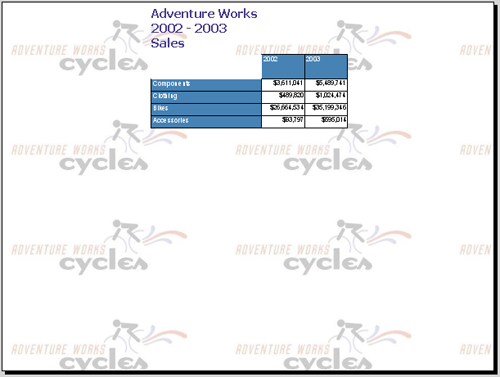

## **Áttekintés**

Kövesse ezeket a lépéseket az Aspose.Slides for Reporting Services telepítéséhez MSI telepítő nélkül, a *Aspose.Slides for Reporting Services XX.XX (DLLs Only)* ZIP csomagból a [letöltési oldalon](https://releases.aspose.com/slides/hu/reportingservices/). Ezek ugyanazokat a kiegészítőket regisztrálják, mint a [MSI telepítő](/slides/hu/reportingservices/install-with-msi-installer/). Ismételje meg őket minden jelentéskiszolgáló példányhoz.

Mielőtt elkezdené, ellenőrizze a [rendszerkövetelményeket](/slides/hu/reportingservices/system-requirements/). Helyi rendszergazdai jogokra van szüksége a jelentéskiszolgálón.

## **Válassza ki az assemblyt**

A ZIP csomag több változatot tartalmaz. Másoljon pontosan egy *Aspose.Slides.ReportingServices.dll*-t a jelentéskiszolgálóra:

| A ZIP csomag fájlja | Használata |
| :- | :- |
| *Bin\Universal\Aspose.Slides.ReportingServices.dll* | SQL Server 2008 és újabb Reporting Services, valamint Power BI Report Server |
| *Bin\SSRS2005\Aspose.Slides.ReportingServices.dll* | SQL Server 2005 Reporting Services |
| *Bin\ReportViewer2010\Aspose.Slides.ReportingServices.dll* | Nem jelentéskiszolgálóhoz: olyan alkalmazásokhoz, amelyek a ReportViewer 2010 vagy 2012 vezérlőből exportálnak, lásd [Using Aspose.Slides with ReportViewer 2010 and 2012](/slides/hu/reportingservices/using-aspose-slides-with-reportviewer-2010-and-2012/) |
| *Bin\RplExport\Aspose.ReportingServices.Debug.Rpl.dll* | Opcionális: jelentéseket RPL formátumban ment, problémajelentésekhez, lásd [Exporting Reports to RPL Format](/slides/hu/reportingservices/exporting-reports-to-rpl-format/) |

## **Keresse meg a jelentéskiszolgáló mappát**

Az alábbi lépések a jelentéskiszolgáló *ReportServer* mappájára hivatkoznak, amely tartalmazza a *rsreportserver.config* és *rssrvpolicy.config* fájlokat. Alapértelmezett telepítés esetén ez:

| Jelentéskiszolgáló | Alapértelmezett *ReportServer* mappa |
| :- | :- |
| SQL Server 2017 és újabb Reporting Services | `C:\Program Files\Microsoft SQL Server Reporting Services\SSRS\ReportServer` |
| Power BI Report Server | `C:\Program Files\Microsoft Power BI Report Server\PBIRS\ReportServer` |
| SQL Server 2016 és korábbi Reporting Services | `C:\Program Files\Microsoft SQL Server\<instance folder>\Reporting Services\ReportServer`, ahol az instance folder például `MSRS13.MSSQLSERVER` a SQL Server 2016-hoz vagy `MSSQL.x` a SQL Server 2005-höz |

További helyekért lásd a Microsoft [RsReportServer.config konfigurációs fájl](https://learn.microsoft.com/en-us/sql/reporting-services/report-server/rsreportserver-config-configuration-file) cikkét.

## **A kiegészítő telepítése**

1. Másolja a kiválasztott assemblyt a *ReportServer* mappa *bin* almappájába.

   A másolt fájlnak nem szabad kifejezetten hozzárendelt NTFS jogosultságokkal rendelkeznie, különben a jelentéskiszolgáló megtagadja a hozzáférést az assembly betöltésekor, és az új export formátumok nem jelennek meg. Kattintson jobb gombbal a fájlra, válassza a **Properties** menüt, és a **Security** lapon távolítsa el a kifejezetten hozzárendelt jogosultságokat, csak az örökölt maradjon. Ha a **General** lapon **Unblock** opciót lát, válassza ki.

2. Mentse el a *rsreportserver.config* egy másolatát, majd nyissa meg egy szövegszerkesztőben. Adja hozzá ezeket a bejegyzéseket a `<Render>` elem belsejébe:

   ```xml
   <Extension Name="ASPPT" Type="Aspose.Slides.ReportingServices.PptRenderer,Aspose.Slides.ReportingServices"/>
   <Extension Name="ASPPS" Type="Aspose.Slides.ReportingServices.PpsRenderer,Aspose.Slides.ReportingServices"/>
   <Extension Name="ASPPTX" Type="Aspose.Slides.ReportingServices.PptxRenderer,Aspose.Slides.ReportingServices"/>
   <Extension Name="ASPPSX" Type="Aspose.Slides.ReportingServices.PpsxRenderer,Aspose.Slides.ReportingServices"/>
   <Extension Name="ASXPSS" Type="Aspose.Slides.ReportingServices.XpsRenderer,Aspose.Slides.ReportingServices"/>
   <Extension Name="ASODP" Type="Aspose.Slides.ReportingServices.OdpRenderer,Aspose.Slides.ReportingServices"/>
   ```

   Minden bejegyzés egy exportformátumot regisztrál; a `Name`-nek egyedinek kell lennie a renderkiegészítők között. Az MSI telepítő ugyanazt a hat nevet és típust regisztrálja. Hagyjon ki bejegyzést, ha nem kívánja, hogy az formátum megjelenjen az export listában.

3. Mentse el a *rssrvpolicy.config* egy másolatát, majd nyissa meg egy szövegszerkesztőben. Keresse meg azt a kódcsoportot, amelynek a `Description` értéke "This code group grants MyComputer code Execution permission.", és adja hozzá ezt a kódcsoportot utolsó gyermekeként:

   ```xml
   <CodeGroup class="UnionCodeGroup" version="1" PermissionSetName="FullTrust" Name="Aspose.Slides_for_Reporting_Services" Description="This code group grants full trust to the Aspose.Slides.ReportingServices.dll assembly.">
       <IMembershipCondition class="StrongNameMembershipCondition" version="1" PublicKeyBlob="00240000048000009400000006020000002400005253413100040000010001005542e99cecd28842dad186257b2c7b6ae9b5947e51e0b17b4ac6d8cecd3e01c4d20658c5e4ea1b9a6c8f854b2d796c4fde740dac65e834167758cff283eed1be5c9a812022b015a902e0b97d4e95569eb8c0971834744e633d9cb4c4a6d8eda03c12f486e13a1a0cb1aa101ad94943236384cbbf5c679944b994de9546e493bf"/>
   </CodeGroup>
   ```

   A `PublicKeyBlob` az Aspose.Slides.ReportingServices assembly nyilvános kulcsa. Tartsa egy sorban.

4. Mentse el mindkét fájlt. A jelentéskiszolgáló újra beolvassa a konfigurációs fájlokat, amikor azok mentésre kerülnek. Ha egy fájl hibás XML-t tartalmaz, a jelentéskiszolgáló figyelmen kívül hagyja vagy nem indul el, ezért állítsa vissza a mentett másolatot, ha probléma merül fel.

## **Ellenőrizze a telepítést**

Nyisson meg egy lapozott jelentést a webportálon (Report Manager a SQL Server 2014 és korábbi verzióknál) és nyissa meg a **Export** listát. Most a következő formátumok szerepelnek:

- PPT – PowerPoint-prezentáció az Aspose.Slides segítségével
- PPS – PowerPoint-diavetítés az Aspose.Slides segítségével
- PPTX – PowerPoint 2007-prezentáció az Aspose.Slides segítségével
- PPSX – PowerPoint 2007-diavetítés az Aspose.Slides segítségével
- ODP – OpenDocument-prezentáció az Aspose.Slides segítségével
- XPS – az Aspose.Slides segítségével

Válassza ki az egyiket a jelentés exportálásához. A fájl a formátumához társított alkalmazásban nyílik meg.



Ha a formátumok nem jelennek meg, ellenőrizze a másolt assembly NTFS jogosultságait. Licenc nélkül az exportált fájlok értékelési vízjelet tartalmaznak; lásd a [Licensing](/slides/hu/reportingservices/license-aspose-slides-for-reporting-services/).