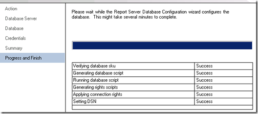

{} 

Az RS szerveren az első megállónk a Reporting Services Configuration Manager. 

{} 
## **Szolgáltatási fiók**
Győződjön meg róla, hogy megértette, melyik szolgáltatási fiókot használja a Reporting Services‑hez. Ha problémákba ütközünk, az a használt szolgáltatási fiókra vezethető vissza. Alapértelmezett a Network Service. Amikor új kiadásokat telepítek, mindig tartományi fiókokat használok, mert ezeknél a legvalószínűbbek a problémák. A szerveremen végzett konfigurációhoz egy **RSService** nevű tartományi fiókot használtam. 
## **Webszolgáltatás URL**
Be kell állítanunk a Web Service URL‑t. Ez a **ReportServer** virtuális könyvtár (vdir), amely a Reporting Services által használt webszolgáltatásokat hosztolja, és amelyen keresztül a SharePoint kommunikál. Hacsak nem szeretné testreszabni a vdir tulajdonságait (pl. SSL, portok, host fejlécek stb.), egyszerűen csak kattintson az Alkalmazás gombra, és készen áll. 

**Ábra 3**: Web Service URL beállítása 

Amikor ez kész, a következő ábrát kell látnia. 

**Ábra 4**: Web Service URL sikeres beállítása 
## **Adatbázis**
Létre kell hoznunk a Reporting Services katalógus adatbázist. Ez bármely SQL 2008 vagy SQL 2008 R2 adatbázismotoron elhelyezhető. A SQL11 is megfelelő lenne, de az még BETA állapotú. Ez a művelet alapértelmezés szerint két adatbázist hoz létre: **ReportServer** és **ReportServerTempDB**. 
A másik fontos lépés, hogy a adatbázis típusánál a SharePoint Integrated opciót válassza. Ha ezt a választást megtette, később nem módosítható. Tekintse meg az 5., 6. és 7. ábrát a referencia miatt. 

**Ábra 5**: Report Server adatbázis létrehozása 

**Ábra 6**: Adatbáziskiszolgáló és hitelesítési típus beállítása 

**Ábra 7**: Adatbázis név és mód beállítása 

A hitelesítési adatokhoz ez határozza meg, hogyan kommunikál a Report Server a SQL Serverrel. Bármelyik fiókot is választja, az RSExecRole‑on keresztül bizonyos jogosultságokat kap a Katalógus adatbázisban, valamint néhány rendszeradatbázisban. Az MSDB az egyik ilyen adatbázis, amelyet az Előfizetésekhez használunk, mivel a SQL Agentet alkalmazzuk. 

**Ábra 8**: Report Server adatbázis hitelesítő adatainak beállítása 

Miután ez kész, a következő ábrának kell kinéznie. 

**Ábra 9**: A Report Server adatbázis beállításának befejezése 
## **Report Manager URL**
Kihagyhatjuk a Report Manager URL‑t, mivel SharePoint Integrated módban nem használatos. A SharePoint a frontendünk. A Report Manager nem működik. 
## **Titkosítási kulcsok**
Készítsen biztonsági mentést a titkosítási kulcsokról, és győződjön meg róla, hogy tudja, hol tárolja őket. Ha az adatbázist migrálni vagy visszaállítani kell, ezekre lesz szüksége. 

Ez minden a Reporting Services Configuration Manager‑hez. Ha a Web Service URL fülön lévő URL‑re navigál, a következő ábrához hasonló eredményt kell látnia. 

**Ábra 12**: Report Server hozzáférés a telepítés után 

Mi történt? A SharePoint a WFE‑emen van telepítve, és befejeztem a Reporting Services beállítását. Ebben a példában a Reporting Services és a SharePoint külön gépeken fut. Ha ugyanazon a gépen lennének, ezt a hibát nem látná. Technikai szempontból a SharePoint‑ot is telepíteni kellene az RS gépen. Ez azt jelenti, hogy az IIS is engedélyezve lesz.