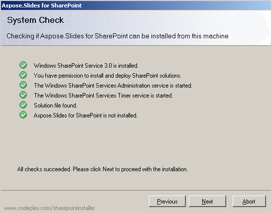

{} 

Az Aspose.Slides for SharePoint egy Aspose.Slides.SharePoint.zip archívumként tölthető le. Az archívum tartalmazza: 

- **Aspose.Slides.SharePoint.wsp**: SharePoint megoldásfájl. Az Aspose.Slides for SharePoint SharePoint megoldásként van csomagolva, hogy megkönnyítse a aktiválást és deaktiválást a szerverkörnyezetben.
- **Aspose_LicenseAgreement.rtf**: A végfelhasználói licencszerződés.
- **Setup.exe**: A telepítőprogram.
- **Setup.exe.config**: A telepítési konfigurációs fájl.

{} 
## **Telepítési folyamat**
A telepítés indítása előtt a beállítóprogram ellenőrzi, hogy:

- WSS 3.0 vagy MOSS 2007 telepítve van.
- A felhasználónak jogosultsága van a SharePoint megoldások telepítésére.
- A SharePoint adatbázis online.
- A WSS Administration Service elindult.
- A WSS Timer service elindult.

A WSS Administration és Timer szolgáltatásokra szükség van, mert egyes telepítési műveletek időzített feladatokra támaszkodnak, amelyek a teljes szerverkörnyezetben terjesztik a változásokat. 
### **A telepítés futtatása**
Az Aspose.Slides for SharePoint telepítéséhez: 

1. Csomagolja ki az Aspose.Slides.SharePoint zip fájlt a helyi meghajtóra a MOSS 7.0 vagy WSS 3.0 szerveren.
2. Futtassa a setup.exe-t, és kövesse a képernyőn megjelenő utasításokat.
   A beállítóprogram a következő műveleteket hajtja végre: 
   1. Ellenőrzi a telepítési előfeltételeket. A telepítés nem folytatódik, ha bármely ellenőrzés sikertelen. 

      **Rendszerellenőrzés futtatása** 

3. Megjeleníti a Végfelhasználói Licencszerződést. A folytatáshoz el kell fogadnia a szerződést. 

   **Az EULA** 

4. Megjeleníti a telepítési célpont kiválasztását. Kiválasztja a webalkalmazásokat és a webhelygyűjteményeket, amelyekhez a funkciót aktiválni kell. 

   **Telepítési célpontok kiválasztása** 

5. Kiadja a funkciót a szerverkörnyezetben. 

   **A telepítés folyamatjelzője** 

6. Aktiválja az Aspose.Slides-et a kiválasztott webhelygyűjteményekben, és beállítja a szülő webalkalmazásokat.
7. Megjeleníti a webalkalmazások és webhelygyűjtemények listáját, amelyeknél a funkció ki lett adva és aktiválva. 

   **Sikeres telepítés** 

