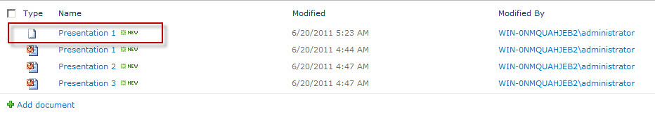

{}

Amikor az Aspose.Slides for SharePoint fel van telepítve a SharePoint szerveren, és egy webhelygyűjteményhez aktiválva van, a dokumentumtárak dokumentumok menüjéhez hozzáadja a **Convert via Aspose.Slides** elemet, ahogy alább látható. A SharePoint 2007 esetén az elem neve **Convert with Aspose.Slides**.

**Az Aspose.Slides for SharePoint telepítése hozzáadja a Convert via Aspose.Slides elemet a dokumentum menükhöz**

{}

## **Prezentáció konvertálása**

1. Válasszon ki egy Microsoft PowerPoint prezentációt egy dokumentumtárban.
2. Nyissa meg a menüt, és kattintson a **Convert via Aspose.Slides** gombra.

   **A Presentation 2 fájl menüje, amely a Convert via Aspose.Slides elemet mutatja**

   

3. Válassza ki a kimeneti formátumot a **Convert to** alatt. Ha szeretné, módosítsa a kimeneti fájl nevét és a célmappát.
4. Kattintson a **Convert** gombra a fájl konvertálásához.

   **A konverziós oldal lehetővé teszi a kimeneti formátum, a fájlnév és a cél kiválasztását**

   

5. A konverzió befejezésekor sikerüzenet jelenik meg.

   **A konverzió sikeres volt**

   

6. Kattintson a **Source Library** (a forrásmappához) vagy a **Destination Library** (a mentett fájl mappájához) gombra.

   A konvertált dokumentum megjelenik a dokumentumtárban.

   **A konvertált dokumentum a mentés helyén lévő könyvtárban megjelenítve**

   

{}

A képernyőképek egy korábbi verzióval készültek, amely csak a PDF, TIFF és XPS formátumokat kínálta. Az aktuális konverziós oldal több kimeneti formátumot kínál; lásd a [Több formátumtámogatás](/slides/hu/sharepoint/multiple-format-support/).

{}

A SharePoint 2010 és újabb verzióiban kiválaszthat egy vagy több prezentációt a könyvtárban, és rákattint a **Convert Slides** gombra a **Aspose Tools** szalagfület. Ez megnyitja ugyanazt a konverziós oldalt.