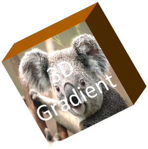

## **Ikhtisar**

Aspose.Slides untuk Android via Java dapat membuat, menyunting, mempertahankan, dan merender pemformatan 3D bergaya PowerPoint untuk bentuk dan teks. Artikel ini mencakup efek 3D seperti rotasi, ekstrusi, bevel, pencahayaan, material, isian gradien atau gambar, dan teks 3D.

{}

Artikel ini membahas efek pemformatan 3D pada bentuk dan teks PowerPoint. Artikel ini tidak membahas penyisipan atau penyuntingan berkas model 3D yang berdiri sendiri. Ketika Anda mengekspor slide ke gambar, PDF, atau HTML, Aspose.Slides merender efek 3D tersebut ke output 2D yang diekspor.

{}

## **Konsep Pemformatan 3D**

Gunakan metode [IShape.getThreeDFormat](https://reference.aspose.com/slides/id/androidjava/com.aspose.slides/ishape/#getThreeDFormat--) untuk menerapkan pemformatan 3D pada sebuah bentuk. Metode ini mengembalikan [IThreeDFormat](https://reference.aspose.com/slides/id/androidjava/com.aspose.slides/ithreedformat/), yang mengontrol adegan 3D untuk bentuk tersebut.

Untuk teks, gunakan metode [ITextFrameFormat.getThreeDFormat](https://reference.aspose.com/slides/id/androidjava/com.aspose.slides/itextframeformat/#getThreeDFormat--) . Ini menerapkan pemformatan 3D pada bingkai teks, bukan pada badan bentuk.

Anggota API yang paling penting adalah:

| Anggota API | Apa yang dikontrol | Kapan digunakan |
|---|---|---|
| [getCamera](https://reference.aspose.com/slides/id/androidjava/com.aspose.slides/ithreedformat/#getCamera--) | Titik pandang, tipe kamera bawaan, rotasi, zoom, dan perspektif. | Memutar objek dalam ruang 3D atau mencocokkan preset rotasi 3D PowerPoint. |
| [getLightRig](https://reference.aspose.com/slides/id/androidjava/com.aspose.slides/ithreedformat/#getLightRig--) | Preset cahaya, arah, dan rotasi cahaya. | Mengubah tampilan sorotan dan bayangan pada permukaan 3D. |
| [getMaterial](https://reference.aspose.com/slides/id/androidjava/com.aspose.slides/ithreedformat/#getMaterial--) dan [setMaterial](https://reference.aspose.com/slides/id/androidjava/com.aspose.slides/ithreedformat/#setMaterial-int-) | Material permukaan, seperti datar, matte, plastik, atau logam. | Membuat geometri yang sama tampak lebih datar, lebih lembut, mengkilap, atau logam. |
| [getExtrusionHeight](https://reference.aspose.com/slides/id/androidjava/com.aspose.slides/ithreedformat/#getExtrusionHeight--) dan [setExtrusionHeight](https://reference.aspose.com/slides/id/androidjava/com.aspose.slides/ithreedformat/#setExtrusionHeight-double-) | Seberapa jauh bentuk menonjol ke belakang dari permukaan depannya. | Mengubah bentuk datar menjadi objek 3D yang tampak tebal. |
| [getExtrusionColor](https://reference.aspose.com/slides/id/androidjava/com.aspose.slides/ithreedformat/#getExtrusionColor--) | Warna sisi yang diekstrusi. | Menampilkan kedalaman atau menyamakan warna sisi dengan isian depan. |
| [getDepth](https://reference.aspose.com/slides/id/androidjava/com.aspose.slides/ithreedformat/#getDepth--) dan [setDepth](https://reference.aspose.com/slides/id/androidjava/com.aspose.slides/ithreedformat/#setDepth-double-) | Kedalaman 3D tambahan yang digunakan oleh pemformatan 3D PowerPoint. | Menyetel kedalaman secara halus untuk bentuk atau teks, terutama bersama bevel dan pengaturan material. |
| [getBevelTop](https://reference.aspose.com/slides/id/androidjava/com.aspose.slides/ithreedformat/#getBevelTop--) dan [getBevelBottom](https://reference.aspose.com/slides/id/androidjava/com.aspose.slides/ithreedformat/#getBevelBottom--) | Tepi yang terangkat atau melengkung pada permukaan depan dan belakang. | Menambahkan tepi yang lembut atau dibentuk alih-alih permukaan datar tajam. |
| [getContourColor](https://reference.aspose.com/slides/id/androidjava/com.aspose.slides/ithreedformat/#getContourColor--), [getContourWidth](https://reference.aspose.com/slides/id/androidjava/com.aspose.slides/ithreedformat/#getContourWidth--), dan [setContourWidth](https://reference.aspose.com/slides/id/androidjava/com.aspose.slides/ithreedformat/#setContourWidth-double-) | Garis luar di sekitar objek 3D. | Menekankan batas objek dalam output yang dirender. |

## **Membuat Bentuk 3D**

Sebuah bentuk biasanya memerlukan empat jenis pengaturan sebelum terlihat benar-benar 3D:

- Pengaturan kamera, karena tampilan depan default dapat menyembunyikan ekstrusi.
- Pengaturan cahaya, karena pencahayaan membuat permukaan dan sisi dapat dibaca.
- Pengaturan material, karena permukaan memengaruhi cara cahaya dirender.
- Pengaturan ekstrusi atau kedalaman, karena bentuk datar memerlukan ketebalan.

Contoh berikut membuat persegi panjang, menambahkan teks ke permukaan depannya, menerapkan pemformatan 3D, menyimpan presentasi sebagai PPTX, dan merender slide ke gambar PNG.

```java
import com.aspose.slides.*;
import java.awt.Color;

final float imageScale = 2;

Presentation presentation = new Presentation();
try {
    ISlide slide = presentation.getSlides().get_Item(0);
    IAutoShape shape = slide.getShapes().addAutoShape(ShapeType.Rectangle, 200, 150, 200, 200);
    shape.getTextFrame().setText("3D");
    shape.getTextFrame().getParagraphs().get_Item(0).getParagraphFormat().getDefaultPortionFormat().setFontHeight(64);

    shape.getFillFormat().setFillType(FillType.Solid);
    shape.getFillFormat().getSolidFillColor().setColor(new Color(100, 149, 237));

    shape.getThreeDFormat().getCamera().setCameraType(CameraPresetType.OrthographicFront);
    shape.getThreeDFormat().getCamera().setRotation(20, 30, 40);
    shape.getThreeDFormat().getLightRig().setLightType(LightRigPresetType.Flat);
    shape.getThreeDFormat().getLightRig().setDirection(LightingDirection.Top);
    shape.getThreeDFormat().setMaterial(MaterialPresetType.Flat);
    shape.getThreeDFormat().setExtrusionHeight(100);
    shape.getThreeDFormat().getExtrusionColor().setColor(Color.BLUE);

    IImage thumbnail = slide.getImage(imageScale, imageScale);
    try {
        thumbnail.save("shape_3d.png", ImageFormat.Png);
    } finally {
        thumbnail.dispose();
    }

    presentation.save("shape_3d.pptx", SaveFormat.Pptx);
} finally {
    presentation.dispose();
}
```

Gambar slide yang dirender menampilkan persegi panjang sebagai blok 3D yang tebal:


## **Memutar Bentuk dengan Kamera**

Di PowerPoint, rotasi 3D dikonfigurasi dari panel Rotasi 3-D. Nilai rotasi X, Y, dan Z sesuai dengan rotasi yang Anda atur melalui API kamera.


Di Aspose.Slides, atur tipe kamera dan rotasi melalui [IThreeDFormat.getCamera](https://reference.aspose.com/slides/id/androidjava/com.aspose.slides/ithreedformat/#getCamera--) :

```java
import com.aspose.slides.*;

Presentation presentation = new Presentation();
try {
    ISlide slide = presentation.getSlides().get_Item(0);
    IAutoShape shape = slide.getShapes().addAutoShape(ShapeType.Rectangle, 200, 150, 200, 200);

    shape.getThreeDFormat().getCamera().setCameraType(CameraPresetType.OrthographicFront);
    shape.getThreeDFormat().getCamera().setRotation(20, 30, 40);
} finally {
    presentation.dispose();
}
```

Gunakan kamera ketika Anda perlu mengubah cara pemirsa melihat objek. Ini tidak mengubah geometri bentuk 2D pada slide. Ini mengubah sudut pandang 3D yang digunakan oleh PowerPoint dan oleh Aspose.Slides saat merender.

## **Menambahkan Ekstrusi dan Kedalaman**

Ekstrusi membuat bentuk tampak tebal dengan memperpanjangnya ke belakang permukaan depan. Di PowerPoint, kontrol kedalaman mengatur ketebalan yang terlihat, dan kontrol warna mengatur warna sisi.


Atur [IThreeDFormat.setExtrusionHeight](https://reference.aspose.com/slides/id/androidjava/com.aspose.slides/ithreedformat/#setExtrusionHeight-double-) untuk ketebalan dan [IThreeDFormat.getExtrusionColor](https://reference.aspose.com/slides/id/androidjava/com.aspose.slides/ithreedformat/#getExtrusionColor--) untuk warna sisi:

```java
import com.aspose.slides.*;
import java.awt.Color;

Presentation presentation = new Presentation();
try {
    ISlide slide = presentation.getSlides().get_Item(0);
    IAutoShape shape = slide.getShapes().addAutoShape(ShapeType.Rectangle, 200, 150, 200, 200);

    shape.getThreeDFormat().getCamera().setRotation(20, 30, 40);
    shape.getThreeDFormat().setExtrusionHeight(100);
    shape.getThreeDFormat().getExtrusionColor().setColor(new Color(128, 0, 128));
} finally {
    presentation.dispose();
}
```

Gunakan [IThreeDFormat.setDepth](https://reference.aspose.com/slides/id/androidjava/com.aspose.slides/ithreedformat/#setDepth-double-) ketika Anda perlu bekerja langsung dengan nilai kedalaman PowerPoint atau menggabungkan kedalaman dengan bevel, material, dan efek teks. Pada banyak skenario bentuk, `setExtrusionHeight` merupakan pengaturan yang lebih jelas karena langsung mengekspresikan ekstrusi yang terlihat.

## **Menggunakan Isian Gradien atau Gambar dengan Efek 3D**

Pemformatan 3D bersifat independen dari isian bentuk. Anda dapat menerapkan warna solid, gradien, pola, atau isian gambar ke permukaan depan dan tetap menggunakan kamera, cahaya, material, serta pengaturan ekstrusi yang sama.

Contoh ini menerapkan isian gradien ke bentuk dan warna ekstrusi yang lebih gelap ke sisi:

```java
import com.aspose.slides.*;
import java.awt.Color;

final float imageScale = 2;

Presentation presentation = new Presentation();
try {
    ISlide slide = presentation.getSlides().get_Item(0);
    IAutoShape shape = slide.getShapes().addAutoShape(ShapeType.Rectangle, 200, 150, 250, 250);
    shape.getTextFrame().setText("3D Gradient");
    shape.getTextFrame().getParagraphs().get_Item(0).getParagraphFormat().getDefaultPortionFormat().setFontHeight(64);

    shape.getFillFormat().setFillType(FillType.Gradient);
    shape.getFillFormat().getGradientFormat().getGradientStops().add(0, Color.BLUE);
    shape.getFillFormat().getGradientFormat().getGradientStops().add(100, new Color(255, 165, 0));

    shape.getThreeDFormat().getCamera().setCameraType(CameraPresetType.OrthographicFront);
    shape.getThreeDFormat().getCamera().setRotation(10, 20, 30);
    shape.getThreeDFormat().getLightRig().setLightType(LightRigPresetType.Flat);
    shape.getThreeDFormat().getLightRig().setDirection(LightingDirection.Top);
    shape.getThreeDFormat().setMaterial(MaterialPresetType.Flat);
    shape.getThreeDFormat().setExtrusionHeight(150);
    shape.getThreeDFormat().getExtrusionColor().setColor(new Color(255, 140, 0));

    IImage thumbnail = slide.getImage(imageScale, imageScale);
    try {
        thumbnail.save("gradient_3d.png", ImageFormat.Png);
    } finally {
        thumbnail.dispose();
    }
} finally {
    presentation.dispose();
}
```

Output yang dirender mempertahankan gradien pada permukaan depan dan merender ekstrusi secara terpisah:


Untuk menggunakan isian gambar, tambahkan gambar ke presentasi dan tetapkan ke isian bentuk:

```java
import com.aspose.slides.*;
import java.awt.Color;
import java.io.FileInputStream;

Presentation presentation = new Presentation();
try {
    ISlide slide = presentation.getSlides().get_Item(0);
    IAutoShape shape = slide.getShapes().addAutoShape(ShapeType.Rectangle, 200, 150, 250, 250);

    IPPImage image;
    try (FileInputStream imageStream = new FileInputStream("image.png")) {
        image = presentation.getImages().addImage(imageStream);
    }

    shape.getFillFormat().setFillType(FillType.Picture);
    shape.getFillFormat().getPictureFillFormat().getPicture().setImage(image);
    shape.getFillFormat().getPictureFillFormat().setPictureFillMode(PictureFillMode.Stretch);

    shape.getThreeDFormat().getCamera().setCameraType(CameraPresetType.OrthographicFront);
    shape.getThreeDFormat().getCamera().setRotation(10, 20, 30);
    shape.getThreeDFormat().setExtrusionHeight(150);
    shape.getThreeDFormat().getExtrusionColor().setColor(new Color(255, 140, 0));
} finally {
    presentation.dispose();
}
```

Gambar tersebut dirender pada permukaan depan, sementara ekstrusi dirender sebagai permukaan sisi 3D:



## **Menerapkan Pemformatan 3D pada Teks**

Pemformatan 3D pada bentuk memengaruhi badan bentuk. Pemformatan 3D pada teks memengaruhi bingkai teks. Ini berguna untuk efek mirip WordArt di mana huruf‑huruf sendiri memerlukan ekstrusi, material, pencahayaan, dan pengaturan kamera.

Contoh berikut membuat teks dengan isian pola, menerapkan transformasi WordArt, dan mengonfigurasi pengaturan 3D pada [ITextFrameFormat](https://reference.aspose.com/slides/id/androidjava/com.aspose.slides/itextframeformat/) :

```java
import com.aspose.slides.*;
import java.awt.Color;

final float imageScale = 2;

Presentation presentation = new Presentation();
try {
    ISlide slide = presentation.getSlides().get_Item(0);
    IAutoShape shape = slide.getShapes().addAutoShape(ShapeType.Rectangle, 200, 150, 250, 250);
    shape.getFillFormat().setFillType(FillType.NoFill);
    shape.getLineFormat().getFillFormat().setFillType(FillType.NoFill);
    shape.getTextFrame().setText("3D Text");

    IPortion portion = shape.getTextFrame().getParagraphs().get_Item(0).getPortions().get_Item(0);
    portion.getPortionFormat().getFillFormat().setFillType(FillType.Pattern);
    portion.getPortionFormat().getFillFormat().getPatternFormat().getForeColor().setColor(new Color(255, 140, 0));
    portion.getPortionFormat().getFillFormat().getPatternFormat().getBackColor().setColor(Color.WHITE);
    portion.getPortionFormat().getFillFormat().getPatternFormat().setPatternStyle(PatternStyle.LargeGrid);

    shape.getTextFrame().getParagraphs().get_Item(0).getParagraphFormat().getDefaultPortionFormat().setFontHeight(128);

    ITextFrameFormat textFrameFormat = shape.getTextFrame().getTextFrameFormat();
    textFrameFormat.setTransform(TextShapeType.ArchUp);

    textFrameFormat.getThreeDFormat().setExtrusionHeight(3.5);
    textFrameFormat.getThreeDFormat().setDepth(3);
    textFrameFormat.getThreeDFormat().setMaterial(MaterialPresetType.Plastic);
    textFrameFormat.getThreeDFormat().getLightRig().setDirection(LightingDirection.Top);
    textFrameFormat.getThreeDFormat().getLightRig().setLightType(LightRigPresetType.Balanced);
    textFrameFormat.getThreeDFormat().getLightRig().setRotation(0, 0, 40);
    textFrameFormat.getThreeDFormat().getCamera().setCameraType(CameraPresetType.PerspectiveContrastingRightFacing);

    IImage thumbnail = slide.getImage(imageScale, imageScale);
    try {
        thumbnail.save("text_3d.png", ImageFormat.Png);
    } finally {
        thumbnail.dispose();
    }

    presentation.save("text_3d.pptx", SaveFormat.Pptx);
} finally {
    presentation.dispose();
}
```

Teks dirender sebagai huruf 3D yang melengkung dan diekstrusi:


## **Perilaku Ekspor dan Rendering**

Aspose.Slides mempertahankan pemformatan 3D saat menyimpan ke format PowerPoint seperti PPTX. Saat merender atau mengekspor ke format tata letak tetap, adegan 3D dirasterisasi atau digambar ke output sebagai hasil 2D. Hal ini berlaku ketika Anda merender slide ke [PNG](/slides/id/androidjava/convert-powerpoint-to-png/), mengekspor ke [PDF](/slides/id/androidjava/convert-powerpoint-to-pdf/), mengekspor ke [HTML](/slides/id/androidjava/convert-powerpoint-to-html/), atau menghasilkan frame untuk [konversi video](/slides/id/androidjava/convert-powerpoint-to-video/) .

Poin‑poin yang perlu diingat:

- Gambar dan PDF yang diekspor tidak bersifat interaktif. Objek tidak dapat diputar oleh pemirsa setelah diekspor.
- Penampilan akhir bergantung pada kombinasi kamera, rig cahaya, material, ekstrusi, isian, dan skala slide.
- Jika Anda perlu memeriksa nilai pemformatan yang diwariskan atau berbasis tema, baca [effective shape properties](/slides/id/androidjava/shape-effective-properties/).
- Beberapa format output tidak dapat menyimpan pemformatan 3D PowerPoint yang dapat disunting. Pada format tersebut, hasil visual dirender alih‑alih dipertahankan sebagai pengaturan 3D yang dapat disunting.

## **FAQ**

### Apakah Aspose.Slides dapat membuat presentasi 3D yang interaktif?

Aspose.Slides membuat dan merender efek 3D PowerPoint untuk bentuk dan teks. Ia tidak membuat gambar, PDF, atau halaman HTML menjadi adegan 3D interaktif yang dapat diputar oleh pemirsa. Pada PPTX, pemformatan 3D tetap dapat disunting di PowerPoint bila format mendukungnya.

### Apa perbedaan antara model 3D dan efek 3D?

Model 3D adalah objek 3D terpisah yang disisipkan ke dalam presentasi. Efek 3D adalah pemformatan yang diterapkan pada bentuk atau teks PowerPoint biasa, seperti rotasi, ekstrusi, bevel, pencahayaan, dan material. Artikel ini membahas efek 3D.

### Pengaturan apa yang diperlukan agar bentuk 3D terlihat?

Setidaknya, atur rotasi kamera dan ekstrusi atau kedalaman. Pada praktiknya, juga atur rig cahaya dan material agar permukaan yang dirender memiliki sorotan dan bayangan yang jelas.

### Bisakah saya menerapkan efek 3D pada bentuk dan teks sekaligus?

Ya. Gunakan [IShape.getThreeDFormat](https://reference.aspose.com/slides/id/androidjava/com.aspose.slides/ishape/#getThreeDFormat--) untuk badan bentuk dan [ITextFrameFormat.getThreeDFormat](https://reference.aspose.com/slides/id/androidjava/com.aspose.slides/itextframeformat/#getThreeDFormat--) untuk teks.

### Apakah efek 3D akan muncul saat mengekspor ke gambar, PDF, HTML, atau frame video?

Ya. Aspose.Slides merender efek 3D saat menghasilkan gambar slide, output PDF, output HTML, dan frame yang digunakan untuk konversi video. Output yang diekspor berisi tampilan yang dirender, bukan objek 3D yang dapat disunting.

### Bisakah saya membaca nilai 3D akhir setelah pewarisan dan pengaturan tema diterapkan?

Ya. Gunakan API pemformatan efektif yang dijelaskan dalam [Shape Effective Properties](/slides/id/androidjava/shape-effective-properties/) untuk membaca kamera, rig cahaya, bevel, dan nilai 3D terkait yang final.