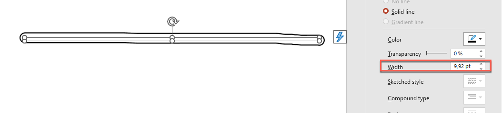

## **Pendahuluan**

PowerPoint menyediakan fitur tinta yang memungkinkan Anda menggambar goresan bebas. Tinta dapat digunakan untuk menyorot objek lain, menunjukkan hubungan dan proses, serta menarik perhatian ke item tertentu pada slide.

Aspose.Slides menyediakan tipe yang diperlukan untuk bekerja dengan objek tinta. Misalnya, antarmuka [IInk](https://reference.aspose.com/slides/id/androidjava/com.aspose.slides/iink/) mewakili sebuah objek tinta pada slide.

## **Perbedaan antara Objek Biasa dan Objek Tinta**

Objek pada slide PowerPoint biasanya direpresentasikan oleh objek bentuk. Dalam bentuk paling sederhana, sebuah bentuk adalah wadah yang menentukan area objek itu sendiri (kerangka) beserta properti seperti ukuran wadah, bentuk, dan latar belakang. Untuk informasi lebih lanjut, lihat [Format Tata Letak Bentuk](https://docs.aspose.com/slides/id/androidjava/shape-manipulations/#access-layout-formats-for-shape).

Namun, ketika PowerPoint menangani objek tinta, ia mengabaikan semua properti kerangka objek (wadah) kecuali ukurannya. Ukuran area wadah ditentukan oleh metode standar [IShape.getWidth](https://reference.aspose.com/slides/id/androidjava/com.aspose.slides/ishape/#getWidth--) dan [IShape.getHeight](https://reference.aspose.com/slides/id/androidjava/com.aspose.slides/ishape/#getHeight--) :


## **Jejak Tinta**

Jejak tinta adalah elemen dasar yang digunakan untuk merekam lintasan pena saat pengguna menulis tinta digital. Sebuah jejak menyimpan urutan titik yang terhubung.

Bentuk enkoding paling sederhana menetapkan koordinat X dan Y setiap titik sampel. Ketika semua titik terhubung dirender, mereka menghasilkan gambar seperti ini:


## **Properti Kuas untuk Menggambar**

Kuas digunakan untuk menggambar garis yang menghubungkan titik‑titik pada jejak tinta. Kuas memiliki warna dan ukuran sendiri, yang direpresentasikan oleh metode [IInkBrush.getColor](https://reference.aspose.com/slides/id/androidjava/com.aspose.slides/iinkbrush/#getColor--) dan [IInkBrush.getSize](https://reference.aspose.com/slides/id/androidjava/com.aspose.slides/iinkbrush/#getSize--) .

### **Mengatur Warna Kuas Tinta**

Berikut kode Java yang memperlihatkan cara mengatur warna kuas tinta:

```java
import android.graphics.Color;
import com.aspose.slides.*;

Presentation presentation = new Presentation("pres.pptx");
try {
    ISlide slide = presentation.getSlides().get_Item(0);
    IInk ink = (IInk) slide.getShapes().get_Item(0);
    IInkBrush brush = ink.getTraces()[0].getBrush();
    brush.setColor(Color.RED);
} finally {
    presentation.dispose();
}
```

### **Mengatur Ukuran Kuas Tinta**

Berikut kode Java yang memperlihatkan cara mengatur ukuran kuas tinta:

```java
import com.aspose.slides.*;
import com.aspose.slides.android.SizeF;

Presentation presentation = new Presentation("pres.pptx");
try {
    ISlide slide = presentation.getSlides().get_Item(0);
    IInk ink = (IInk) slide.getShapes().get_Item(0);
    IInkBrush brush = ink.getTraces()[0].getBrush();
    SizeF brushSize = new SizeF(5, 10);
    brush.setSize(brushSize);
} finally {
    presentation.dispose();
}
```

Secara umum, lebar dan tinggi kuas tidak sama, sehingga PowerPoint tidak menampilkan ukuran kuas (bagian data yang bersangkutan berwarna abu‑abu). Ketika lebar dan tinggi kuas cocok, PowerPoint menampilkan ukurannya seperti ini:



Untuk kejelasan, mari tingkatkan tinggi objek tinta dan tinjau dimensi penting:


Wadah (kerangka) tidak memperhitungkan ukuran kuas—ia selalu mengasumsikan ketebalan garis nol (lihat gambar sebelumnya).

Oleh karena itu, untuk menentukan area yang terlihat dari seluruh objek tinta, ukuran kuas pada jejak‑jejaknya harus diperhitungkan. Di sini, objek target (jejak teks tulisan tangan) telah diskalakan ke ukuran wadah (kerangka). Ketika ukuran wadah berubah, ukuran kuas tetap konstan, dan sebaliknya.


PowerPoint menggunakan perilaku serupa untuk objek teks:


## **Mengontrol Penampilan Tinta Saat Ekspor dan Rendering**

Aspose.Slides menyediakan antarmuka [IInkOptions](https://reference.aspose.com/slides/id/androidjava/com.aspose.slides/iinkoptions/) untuk mengontrol bagaimana objek tinta muncul dalam output yang diekspor atau dirender. Anda dapat menggunakan propertinya untuk menyembunyikan tinta sepenuhnya atau mengubah cara operasi masker kuas tinta ditafsirkan.

Opsi tinta tersedia melalui opsi ekspor atau rendering untuk beberapa tipe output:

| Output | Properti opsi tinta |
| --- | --- |
| PDF | [PdfOptions.getInkOptions](https://reference.aspose.com/slides/id/androidjava/com.aspose.slides/pdfoptions/#getInkOptions--) |
| HTML | [HtmlOptions.getInkOptions](https://reference.aspose.com/slides/id/androidjava/com.aspose.slides/htmloptions/#getInkOptions--) |
| SVG | [SVGOptions.getInkOptions](https://reference.aspose.com/slides/id/androidjava/com.aspose.slides/svgoptions/#getInkOptions--) |
| TIFF | [TiffOptions.getInkOptions](https://reference.aspose.com/slides/id/androidjava/com.aspose.slides/tiffoptions/#getInkOptions--) |
| Gambar slide | [RenderingOptions.getInkOptions](https://reference.aspose.com/slides/id/androidjava/com.aspose.slides/renderingoptions/#getInkOptions--) |

Metode berikut dari [IInkOptions](https://reference.aspose.com/slides/id/androidjava/com.aspose.slides/iinkoptions/) mengekspos dua pengaturan yang sama:

- [IInkOptions.getHideInk](https://reference.aspose.com/slides/id/androidjava/com.aspose.slides/iinkoptions/#getHideInk--) menentukan apakah objek tinta disertakan dalam output. Nilai standar adalah `false`.
- [IInkOptions.getInterpretMaskOpAsOpacity](https://reference.aspose.com/slides/id/androidjava/com.aspose.slides/iinkoptions/#getInterpretMaskOpAsOpacity--) menentukan apakah operasi masker ditafsirkan sebagai opasitas saat merender kuas tinta. Nilai standar adalah `true`; panggil [IInkOptions.setInterpretMaskOpAsOpacity](https://reference.aspose.com/slides/id/androidjava/com.aspose.slides/iinkoptions/#setInterpretMaskOpAsOpacity-boolean-) dengan `false` untuk menggunakan operasi ROP sebagai gantinya.

### **Menyembunyikan Objek Tinta dalam Output PDF**

Secara default, objek tinta tetap terlihat saat ekspor. Untuk membuat output bersih tanpa anotasi tulisan tangan atau konten tinta lainnya, panggil [IInkOptions.setHideInk](https://reference.aspose.com/slides/id/androidjava/com.aspose.slides/iinkoptions/#setHideInk-boolean-) dengan `true`.

Contoh Java berikut mengekspor presentasi ke PDF sambil menyembunyikan semua objek tinta:

```java
import com.aspose.slides.*;

Presentation presentation = new Presentation("presentation.pptx");
try {
    PdfOptions pdfOptions = new PdfOptions();
    pdfOptions.getInkOptions().setHideInk(true);

    presentation.save("presentation_without_ink.pdf", SaveFormat.Pdf, pdfOptions);
} finally {
    presentation.dispose();
}
```

### **Menyembunyikan Objek Tinta Saat Rendering Slide menjadi Gambar**

Untuk menyembunyikan objek tinta saat merender slide menjadi gambar bitmap, konfigurasikan [RenderingOptions.getInkOptions](https://reference.aspose.com/slides/id/androidjava/com.aspose.slides/renderingoptions/#getInkOptions--) dan berikan opsi rendering ke [ISlide.getImage](https://reference.aspose.com/slides/id/androidjava/com.aspose.slides/islide/#getImage-com.aspose.slides.IRenderingOptions-).

Contoh Java berikut merender slide pertama sebagai gambar PNG tanpa objek tinta:

```java
import com.aspose.slides.*;

Presentation presentation = new Presentation("presentation.pptx");
try {
    RenderingOptions renderingOptions = new RenderingOptions();
    renderingOptions.getInkOptions().setHideInk(true);

    ISlide slide = presentation.getSlides().get_Item(0);
    IImage image = slide.getImage(renderingOptions);
    try {
        image.save("slide_without_ink.png", ImageFormat.Png);
    } finally {
        image.dispose();
    }
} finally {
    presentation.dispose();
}
```

### **Mengontrol Rendering Masker Tinta**

Pengaturan [IInkOptions.getInterpretMaskOpAsOpacity](https://reference.aspose.com/slides/id/androidjava/com.aspose.slides/iinkoptions/#getInterpretMaskOpAsOpacity--) mengendalikan bagaimana operasi masker ditafsirkan saat merender kuas tinta. Nilai standar adalah `true`, yang menggunakan opasitas. Untuk menggunakan operasi ROP sebagai gantinya, panggil [IInkOptions.setInterpretMaskOpAsOpacity](https://reference.aspose.com/slides/id/androidjava/com.aspose.slides/iinkoptions/#setInterpretMaskOpAsOpacity-boolean-) dengan `false`.

Contoh Java berikut mengekspor slide ke SVG dan menggunakan rendering berbasis ROP untuk operasi masker tinta:

```java
import com.aspose.slides.*;
import java.io.FileOutputStream;

Presentation presentation = new Presentation("presentation.pptx");
try {
    SVGOptions svgOptions = new SVGOptions();
    svgOptions.getInkOptions().setInterpretMaskOpAsOpacity(false);

    ISlide slide = presentation.getSlides().get_Item(0);
    FileOutputStream stream = new FileOutputStream("slide.svg");
    try {
        slide.writeAsSvg(stream, svgOptions);
    } finally {
        stream.close();
    }
} finally {
    presentation.dispose();
}
```

Pengaturan yang sama dapat diterapkan melalui [TiffOptions.getInkOptions](https://reference.aspose.com/slides/id/androidjava/com.aspose.slides/tiffoptions/#getInkOptions--) saat mengekspor presentasi atau merender slide ke TIFF.

### **Memilih untuk Menyembunyikan atau Mempertahankan Tinta**

Ketika Anda memerlukan versi bersih dari presentasi beranotasi untuk distribusi tanpa tanda‑tanda ulasan, panggil [IInkOptions.setHideInk](https://reference.aspose.com/slides/id/androidjava/com.aspose.slides/iinkoptions/#setHideInk-boolean-) dengan `true` saat mengekspor.

Biarkan [IInkOptions.getHideInk](https://reference.aspose.com/slides/id/androidjava/com.aspose.slides/iinkoptions/#getHideInk--) pada nilai standar `false` ketika anotasi tinta merupakan bagian dari konten yang diinginkan, seperti komentar ulasan, catatan tulisan tangan, sorotan, atau gambar yang harus tetap terlihat dalam hasil yang diekspor. Hal ini memungkinkan aplikasi menghasilkan output ulasan dan final secara terpisah dari presentasi yang sama tanpa memodifikasi objek tinta sumber.

## **FAQ**

**Apakah saya dapat mengubah warna atau ukuran goresan tinta yang sudah ada?**

Ya. Dapatkan jejak dari [IInk.getTraces](https://reference.aspose.com/slides/id/androidjava/com.aspose.slides/iink/#getTraces--), lalu ubah [IInkTrace.getBrush](https://reference.aspose.com/slides/id/androidjava/com.aspose.slides/iinktrace/#getBrush--). Panggil [IInkBrush.setColor](https://reference.aspose.com/slides/id/androidjava/com.aspose.slides/iinkbrush/#setColor-java.lang.Integer-) atau [IInkBrush.setSize](https://reference.aspose.com/slides/id/androidjava/com.aspose.slides/iinkbrush/#setSize-com.aspose.slides.android.SizeF-) untuk mengubah kuas.

**Apakah menyembunyikan tinta mengubah presentasi sumber?**

Tidak. Memanggil [IInkOptions.setHideInk](https://reference.aspose.com/slides/id/androidjava/com.aspose.slides/iinkoptions/#setHideInk-boolean-) hanya memengaruhi hasil yang dirender atau diekspor; ia tidak menghapus atau memodifikasi objek tinta dalam presentasi sumber.

**Format ekspor apa yang mendukung opsi tinta?**

Anda dapat mengonfigurasi opsi tinta untuk PDF, HTML, SVG, TIFF, dan gambar slide bitmap melalui opsi ekspor atau rendering yang bersesuaian seperti yang ditunjukkan di atas.

**Bacaan lanjutan**

* Untuk mempelajari tentang bentuk secara umum, lihat bagian [PowerPoint Shapes](https://docs.aspose.com/slides/id/androidjava/powerpoint-shapes/).
* Untuk informasi lebih lanjut tentang nilai efektif, lihat [Shape Effective Properties](https://docs.aspose.com/slides/id/androidjava/shape-effective-properties/#get-effective-font-height-value).
* Untuk detail tentang ekspor PDF, lihat [Convert PPT and PPTX to PDF](https://docs.aspose.com/slides/id/androidjava/convert-powerpoint-to-pdf/).
* Untuk detail tentang ekspor HTML, lihat [Convert PowerPoint Presentations to HTML](https://docs.aspose.com/slides/id/androidjava/convert-powerpoint-to-html/).
* Untuk detail tentang ekspor SVG, lihat [Render Presentation Slides as SVG Images](https://docs.aspose.com/slides/id/androidjava/render-a-slide-as-an-svg-image/).
* Untuk detail tentang ekspor TIFF, lihat [Convert PowerPoint Presentations to TIFF](https://docs.aspose.com/slides/id/androidjava/convert-powerpoint-to-tiff/).
* Untuk detail tentang rendering slide ke gambar, lihat [Convert Presentation Slides to Images](https://docs.aspose.com/slides/id/androidjava/convert-slide/).