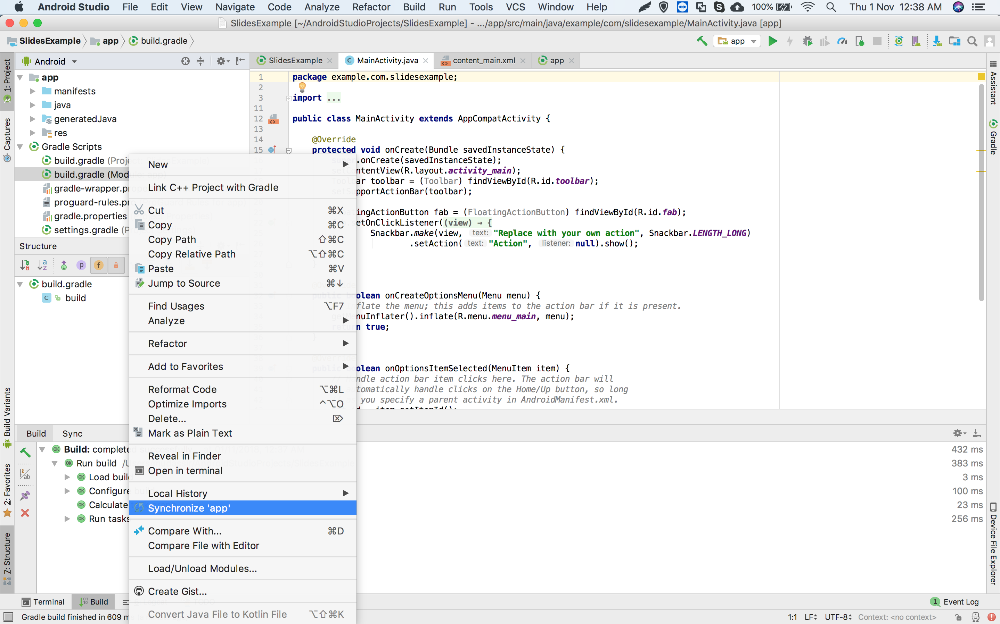
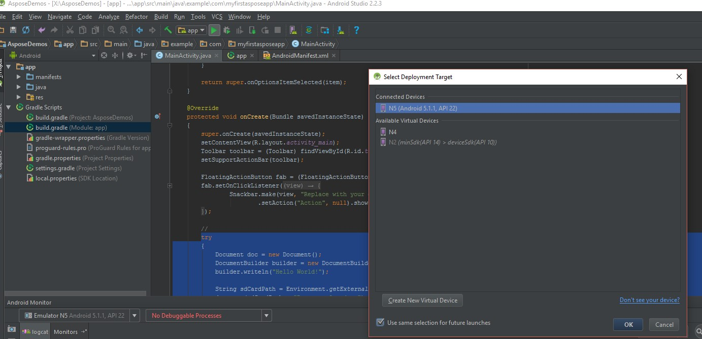

## **Ikhtisar**

Artikel ini menjelaskan cara menginstal Aspose.Slides untuk Android via Java dan menambahkannya ke proyek Android. Artikel ini menggambarkan dua opsi instalasi: menambahkan file JAR Aspose.Slides secara manual ke proyek dan menginstal pustaka dari repositori Maven.

Artikel ini juga menyediakan contoh langkah demi langkah yang menunjukkan cara membuat aplikasi Android baru di Android Studio, mereferensikan pustaka Aspose.Slides, membuat presentasi PowerPoint secara programatis, dan menyimpannya dalam format PPTX. Artikel ini juga mencakup catatan tentang versioning dan menjawab pertanyaan umum tentang cara memverifikasi integrasi, mengelola penggunaan memori, dan mengurangi ukuran JAR akhir.

## **Instalasi**
Sebelumnya, Aspose.Slides untuk Android via Java didistribusikan sebagai satu file ZIP yang berisi file JAR, demo, dan dokumentasi produk. 

1. Jika Anda ingin menggunakan versi yang lebih lama dari Aspose.Words untuk Android via Java 18.9, Anda perlu mengekstrak file Aspose.Slides.Android.zip ke direktori pilihan Anda. 
1. Tambahkan file Jar yang diekstrak ke aplikasi Anda dengan menggunakan konfigurasi Build Path. 
### **Tambahkan Referensi ke Aspose.Slides for Android via Java Jar**
1. Unduh versi terbaru dari [Aspose.Slides for Android via Java](https://downloads.aspose.com/slides/id/androidjava)
1. Salin aspose-slides-18.9-android.via.java.jar ke folder *libs/* proyek Anda


### **Instal Aspose.Slides for Android via Java dari Repository Maven**
1. Tambahkan repository Maven ke file build.gradle. 
1. Tambahkan JAR [Aspose.Slides for Android via Java](https://releases.aspose.com/java/repo/com/aspose/aspose-slides/) sebagai dependensi.

``` java

 // 1. Tambah repositori Maven ke dalam build.gradle Anda

repositories {

    mavenCentral()

    maven { url "https://releases.aspose.com/java/repo/" }

}

// 2. Tambahkan JAR 'Aspose.Slides for Android via Java' sebagai dependensi

dependencies {

    ...

    ...

    compile (group: 'com.aspose', name: 'aspose-slides', version: 'XX.XX', classifier: 'android.via.java')

}

```
## **Aplikasi Pertama Anda Menggunakan Aspose.Slides for Android via Java**
Pada bagian ini, Anda akan belajar cara memulai dengan Aspose.Slides untuk Android via Java. Kami akan menunjukkan cara menyiapkan proyek Android baru dari awal, menambahkan referensi ke JAR Aspose.Slides, dan membuat presentasi PowerPoint baru yang disimpan ke disk dalam format PPTX. Contoh di sini menggunakan [Android Studio](https://developer.android.com/studio/index.html) untuk pengembangan dan aplikasi dijalankan pada Android Emulator. Untuk memulai dengan Aspose.Slides untuk Android via Java, ikuti tutorial langkah demi langkah ini untuk membuat aplikasi yang menggunakan Aspose.Slides untuk Android via Java:

1. Unduh dan instal [Android Studio](https://developer.android.com/studio/index.html) ke lokasi mana pun.
1. Jalankan Android Studio.
1. Buat Proyek Aplikasi Android Baru.


1. Salin aspose-slides-XX.XX-android.via.java.jar ke folder libs/proyek Anda


1. Pilih *Project Section* (dari menu file) dan klik tab *Dependencies*.
   1. Klik tombol “+”. Pilih opsi dependensi file.
   1. Pilih pustaka Aspose.Slides dari folder libs dan klik OK.


1. Sinkronkan proyek dengan file gradle jika diperlukan. 




1. Untuk mengakses kartu SD, izin khusus harus ditambahkan. Buka file AndroidManifest.xml dan pilih tampilan XML. Tambahkan baris ini ke file <uses-permission android:name="android.permission.WRITE_EXTERNAL_STORAGE" />


1. Kembali ke bagian kode aplikasi dan tambahkan impor berikut: 

``` java

 import java.io.File;

import com.aspose.slides.IAutoShape;

import com.aspose.slides.IParagraph;

import com.aspose.slides.IPortion;

import com.aspose.slides.ISlide;

import com.aspose.slides.ITextFrame;

import com.aspose.slides.Presentation;

import com.aspose.slides.SaveFormat;

import com.aspose.slides.ShapeType;

import android.os.Environment; 

```

Sekarang, sisipkan kode ini ke dalam badan metode onCreate untuk membuat *Presentation* baru dari awal menggunakan Aspose.Slides dan menyimpannya ke kartu SD dalam format PPTX.

``` java

 try

{

    // Membuat instance kelas Presentation yang mewakili PPTX
    Presentation pres = new Presentation();


    // Akses slide pertama
    ISlide sld = pres.getSlides().get_Item(0);


    // Tambahkan AutoShape tipe Persegi Panjang
    IAutoShape ashp = sld.getShapes().addAutoShape(ShapeType.Rectangle, 150, 75, 150, 50);


    // Tambahkan TextFrame ke Persegi Panjang
    ashp.addTextFrame(" ");


    // Mengakses text frame
    ITextFrame txtFrame = ashp.getTextFrame();


    // Buat objek Paragraph untuk text frame
    IParagraph para = txtFrame.getParagraphs().get_Item(0);


    // Buat objek Portion untuk paragraf
    IPortion portion = para.getPortions().get_Item(0);


    // Atur Teks
    portion.setText("Aspose TextBox");


    // Simpan PPTX ke kartu
    String sdCardPath = Environment.getExternalStorageDirectory().getPath() + File.separator;
    pres.save(sdCardPath + "Textbox.pptx",SaveFormat.Pptx);
}

catch (Exception e)
{
   e.printStackTrace();
}
```

Kode lengkapnya akan terlihat seperti ini:


1. Jalankan kembali aplikasi. Kali ini, kode Aspose.Slides akan berjalan di latar belakang dan menghasilkan dokumen yang disimpan ke kartu SD.




1. Untuk melihat dokumen yang dibuat, buka menu *Tools*. Pilih *Android* lalu pilih *Android Device Monitor*


## **Versioning**
Sejak 2018, versioning Aspose.Slides untuk Android via Java mematuhi Aspose.Slides untuk Java. 

## **FAQ**

**Bagaimana saya dapat memverifikasi bahwa Aspose.Slides terintegrasi dengan benar?**

Bangun proyek Anda, buat instance kosong dari [Presentation](https://reference.aspose.com/slides/id/androidjava/com.aspose.slides/presentation/) dan simpan dengan nama baru. Jika file dibuat tanpa menghasilkan pengecualian, pustaka telah berhasil diintegrasikan.

**Bagaimana saya dapat membatasi konsumsi memori saat memproses presentasi besar?**

Tingkatkan batas memori JVM hanya sejauh yang diperlukan, dan tutup setiap instance [Presentation](https://reference.aspose.com/slides/id/androidjava/com.aspose.slides/presentation/) dalam blok `finally` untuk segera melepaskan cache. Ini mencegah kesalahan out‑of‑memory dan menjaga penggunaan memori secara keseluruhan tetap dapat diprediksi selama operasi batch.

**Dapatkah saya mengecualikan format ekspor yang tidak diinginkan untuk memperkecil ukuran JAR akhir?**

Rilis Aspose.Slides saat ini didistribusikan sebagai satu pustaka monolitik, sehingga Anda tidak dapat menonaktifkan exporter tertentu seperti PDF atau SVG pada waktu build.