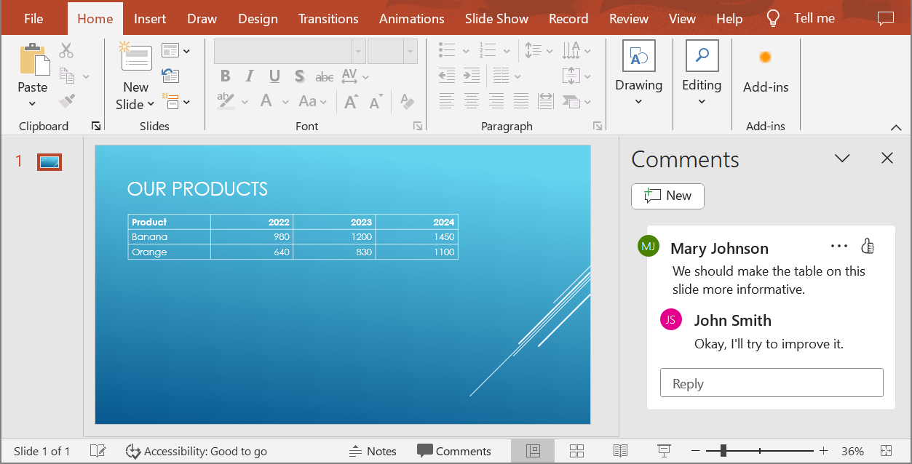

## **Gambaran Umum**

Artikel ini menjelaskan cara mengonversi presentasi PowerPoint ke HTML5 menggunakan Aspose.Slides. Ini mencakup ekspor HTML5 dasar tanpa ekstensi web atau dependensi tambahan, serta opsi untuk mengontrol animasi bentuk dan transisi slide. Artikel ini juga menunjukkan proses ekspor standar PowerPoint‑ke‑HTML, menjelaskan cara menghasilkan output HTML5 dalam mode tampilan slide, dan mendemonstrasikan cara menyertakan komentar dalam dokumen yang diekspor dengan mengonfigurasi tata letaknya.

## **Ekspor PowerPoint ke HTML5**

Kode C++ ini menunjukkan cara mengekspor presentasi ke HTML5.

```cpp
using namespace Aspose::Slides;
using namespace Aspose::Slides::Export;
        
auto pres = System::MakeObject<Presentation>(u"pres.pptx");
pres->Save(u"pres.html", SaveFormat::Html5);
```

{} 
Dalam kasus ini, Anda mendapatkan HTML yang bersih. 
{}

Anda mungkin ingin menentukan pengaturan untuk animasi bentuk dan transisi slide dengan cara ini:

```cpp
using namespace Aspose::Slides;
using namespace Aspose::Slides::Export;

auto pres = System::MakeObject<Presentation>(u"pres.pptx");
auto options = System::MakeObject<Html5Options>();
options->set_AnimateShapes(true);
options->set_AnimateTransitions(true);
pres->Save(u"pres.html", SaveFormat::Html5, options);
```

## **Ekspor PowerPoint ke HTML**

Kode C++ ini menunjukkan proses standar PowerPoint ke HTML:

```cpp
using namespace Aspose::Slides;
using namespace Aspose::Slides::Export;
        
auto pres = System::MakeObject<Presentation>(u"pres.pptx");
pres->Save(u"pres.html", SaveFormat::Html);
```

Dalam kasus ini, konten presentasi dirender melalui SVG dalam bentuk seperti ini:

```html
<body>
<div class="slide" name="slide" id="slideslideIface1">
     <svg version="1.1">
         <g> THE SLIDE CONTENT GOES HERE </g>
     </svg>
</div>
</body>
```

{} 
Ketika Anda menggunakan metode ini untuk mengekspor PowerPoint ke HTML, karena rendering SVG, Anda tidak dapat menerapkan gaya atau menganimasikan elemen tertentu. 
{}

## **Ekspor PowerPoint ke HTML5 Slide View**

**Aspose.Slides** memungkinkan Anda mengonversi presentasi PowerPoint ke dokumen HTML5 di mana slide‑slide ditampilkan dalam mode tampilan slide. Dalam hal ini, ketika Anda membuka file HTML5 yang dihasilkan di peramban, Anda melihat presentasi dalam mode tampilan slide pada halaman web. 

Kode C++ ini mendemonstrasikan proses ekspor PowerPoint ke HTML5 Slide View:

```c++
auto pres = System::MakeObject<Presentation>(u"pres.pptx");
auto html5Options = System::MakeObject<Html5Options>();
html5Options->set_AnimateShapes(true);
html5Options->set_AnimateTransitions(true);
pres->Save(u"HTML5-slide-view.html", SaveFormat::Html5, html5Options);
```

## **Mengonversi Presentasi ke Dokumen HTML5 dengan Komentar**

Komentar di PowerPoint adalah alat yang memungkinkan pengguna meninggalkan catatan atau umpan balik pada slide presentasi. Mereka sangat berguna dalam proyek kolaboratif, di mana banyak orang dapat menambahkan saran atau catatan mereka pada elemen slide tertentu tanpa mengubah konten utama. Setiap komentar menampilkan nama penulis, sehingga mudah melacak siapa yang memberi komentar.

Misalkan kita memiliki presentasi PowerPoint berikut yang disimpan dalam file "sample.pptx".



Saat Anda mengonversi presentasi PowerPoint ke dokumen HTML5, Anda dapat dengan mudah menentukan apakah akan menyertakan komentar dari presentasi dalam dokumen output. Untuk melakukannya, Anda harus menentukan parameter tampilan untuk komentar dalam metode `get_NotesCommentsLayouting` kelas [Html5Options](https://reference.aspose.com/slides/id/cpp/aspose.slides.export/html5options/).

Contoh kode berikut mengonversi presentasi ke dokumen HTML5 dengan komentar yang ditampilkan di sebelah kanan slide.

```cpp
auto html5Options = MakeObject<Html5Options>();
html5Options->get_NotesCommentsLayouting()->set_CommentsPosition(CommentsPositions::Right);

auto presentation = MakeObject<Presentation>(u"sample.pptx");
presentation->Save(u"output.html", SaveFormat::Html5, html5Options);
presentation->Dispose();
```

Dokumen "output.html" ditampilkan pada gambar di bawah.


## **FAQ**

**Apakah saya dapat mengontrol apakah animasi objek dan transisi slide akan diputar di HTML5?**

Ya, HTML5 menyediakan opsi terpisah untuk mengaktifkan atau menonaktifkan [animasi bentuk](https://reference.aspose.com/slides/id/cpp/aspose.slides.export/html5options/set_animateshapes/) dan [transisi slide](https://reference.aspose.com/slides/id/cpp/aspose.slides.export/html5options/set_animatetransitions/).

**Apakah output komentar didukung, dan di mana mereka dapat ditempatkan relatif terhadap slide?**

Ya, komentar dapat ditambahkan dalam HTML5 dan diposisikan (misalnya, di sebelah kanan slide) melalui pengaturan tata letak untuk catatan dan komentar.

**Apakah saya dapat melewatkan tautan yang memanggil JavaScript untuk alasan keamanan atau CSP?**

Ya, ada [setting](https://reference.aspose.com/slides/id/cpp/aspose.slides.export/saveoptions/set_skipjavascriptlinks/) yang memungkinkan Anda melewatkan hyperlink dengan panggilan JavaScript saat menyimpan. Ini membantu mematuhi kebijakan keamanan yang ketat.