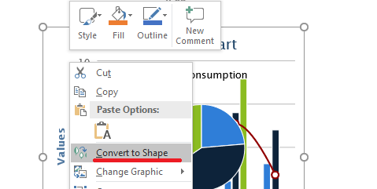

## **Pendahuluan**

Aspose.Slides for C++ menyediakan beberapa cara untuk bekerja dengan gambar, dan masing‑masing melayani tujuan yang berbeda. Anda dapat menyimpan gambar dalam presentasi, menampilkannya dalam bingkai gambar, menggunakannya sebagai latar belakang slide, menautkan ke gambar eksternal, mengganti sumber daya gambar bersama, atau mengonversi konten SVG menjadi bentuk yang dapat diedit.

Artikel ini berfokus pada sumber daya gambar dan cara penggunaannya di seluruh presentasi. Untuk pemotongan, transparansi, efek, peregangan, dan pemformatan lain yang diterapkan pada satu bingkai gambar, lihat [Bingkai Gambar](/slides/id/cpp/picture-frame/).

## **Memahami Model Gambar**

Konsep API berikut saling terkait tetapi tidak dapat dipertukarkan:

- [koleksi gambar presentasi](https://reference.aspose.com/slides/id/cpp/aspose.slides/iimagecollection/) menyimpan sumber daya gambar yang digunakan oleh presentasi. Gunakan [IImageCollection::AddImage](https://reference.aspose.com/slides/id/cpp/aspose.slides/iimagecollection/addimage/) untuk menambahkan data gambar dan memperoleh sumber daya [IPPImage](https://reference.aspose.com/slides/id/cpp/aspose.slides/ippimage/).
- Sebuah [bingkai gambar](https://reference.aspose.com/slides/id/cpp/aspose.slides/ipictureframe/) adalah bentuk yang menampilkan gambar pada slide, tata letak, atau master. Gunakan [IShapeCollection::AddPictureFrame](https://reference.aspose.com/slides/id/cpp/aspose.slides/ishapecollection/addpictureframe/) untuk menempatkan sumber daya gambar pada slide.
- Latar belakang slide menggunakan gambar sebagai bagian dari isian slide, bukan sebagai bentuk. Oleh karena itu tidak berperilaku seperti bingkai gambar.
- [IPPImage::ReplaceImage](https://reference.aspose.com/slides/id/cpp/aspose.slides/ippimage/replaceimage/) mengganti sumber daya gambar. Jika beberapa elemen presentasi menggunakan sumber daya tersebut, semuanya akan menggunakan penggantiannya.
- Mengonversi SVG menjadi bentuk membuat bentuk slide yang dapat diedit. Setelah konversi, konten tidak lagi dikelola sebagai satu sumber daya gambar.

Alur kerja tipikal oleh karena itu: tambahkan data gambar ke koleksi gambar, terima sebuah [IPPImage](https://reference.aspose.com/slides/id/cpp/aspose.slides/ippimage/), lalu gunakan sumber daya tersebut dalam satu atau beberapa bingkai gambar atau isian.

## **Menambahkan Gambar Tersemat**

Untuk menyisipkan gambar lokal, baca file, tambahkan datanya ke koleksi gambar, dan buat bingkai gambar yang menggunakan sumber daya [IPPImage](https://reference.aspose.com/slides/id/cpp/aspose.slides/ippimage/) yang dikembalikan.

```cpp
#include <DOM/IImageCollection.h>
#include <DOM/IShapeCollection.h>
#include <DOM/ISlide.h>
#include <DOM/Presentation.h>
#include <DOM/ShapeType.h>
#include <Export/SaveFormat.h>
#include <system/io/file.h>

using namespace Aspose::Slides;
using namespace Aspose::Slides::Export;
using namespace System;
using namespace System::IO;

auto presentation = MakeObject<Presentation>();

auto imageData = File::ReadAllBytes(u"photo.png");
auto image = presentation->get_Images()->AddImage(imageData);

auto slide = presentation->get_Slide(0);
slide->get_Shapes()->AddPictureFrame(ShapeType::Rectangle, 20.0f, 20.0f, 320.0f, 180.0f, image);

presentation->Save(u"presentation.pptx", SaveFormat::Pptx);
presentation->Dispose();
```

Gambar yang ditambahkan dengan cara ini tersemat dalam presentasi, sehingga berkas hasil tidak bergantung pada ketersediaan berkas gambar asli.

### **Menambahkan Gambar dari Web**

Ketika gambar tersedia melalui HTTP atau HTTPS, unduh bajetnya, tambahkan ke koleksi gambar presentasi, dan gunakan sumber daya gambar yang dikembalikan dengan cara yang sama seperti gambar lokal.

```cpp
#include <DOM/IImageCollection.h>
#include <DOM/IShapeCollection.h>
#include <DOM/ISlide.h>
#include <DOM/Presentation.h>
#include <DOM/ShapeType.h>
#include <Export/SaveFormat.h>
#include <net/web_client.h>
#include <system/uri.h>

using namespace Aspose::Slides;
using namespace Aspose::Slides::Export;
using namespace System;
using namespace System::Net;

auto imageUri = MakeObject<Uri>(u"https://example.com/image.png");
auto webClient = MakeObject<WebClient>();
auto imageData = webClient->DownloadData(imageUri);

auto presentation = MakeObject<Presentation>();

auto image = presentation->get_Images()->AddImage(imageData);
auto slide = presentation->get_Slide(0);
slide->get_Shapes()->AddPictureFrame(ShapeType::Rectangle, 20.0f, 20.0f, 320.0f, 180.0f, image);

presentation->Save(u"presentation-from-web.pptx", SaveFormat::Pptx);
presentation->Dispose();
```

Validasi URL remote, ukuran respons, dan tipe konten ketika sumber tidak dipercaya. Dalam aplikasi yang sudah menggunakan klien HTTP lain, Anda dapat mengunduh gambar dengan klien tersebut dan mengoper bajet atau aliran yang dihasilkan ke [IImageCollection::AddImage](https://reference.aspose.com/slides/id/cpp/aspose.slides/iimagecollection/addimage/).

## **Menggunakan Ulang Gambar di Seluruh Slide**

Jika gambar yang sama diperlukan lebih dari sekali, tambahkan sekali ke presentasi dan gunakan kembali [IPPImage](https://reference.aspose.com/slides/id/cpp/aspose.slides/ippimage/) yang dikembalikan saat membuat bingkai gambar tambahan. Ini menghindari pemuatan berulang data sumber yang sama dan membuat hubungan antara sumber daya gambar bersama dan penggunaannya menjadi eksplisit.

Untuk grafik yang harus muncul secara otomatis di banyak slide, seperti logo perusahaan, pertimbangkan menempatkan bingkai gambar pada [master slide](/slides/id/cpp/slide-master/) atau tata letak alih‑alih menambahkan bentuk setara ke setiap slide.

## **Menggunakan Gambar sebagai Latar Belakang Slide**

Gambar latar belakang ditetapkan ke isian slide; ia tidak ditambahkan sebagai bentuk bingkai gambar. Ini berguna ketika gambar harus menutupi latar belakang slide dan tidak boleh dimanipulasi sebagai objek slide biasa.

```cpp
#include <DOM/BackgroundType.h>
#include <DOM/FillType.h>
#include <DOM/IBackground.h>
#include <DOM/IFillFormat.h>
#include <DOM/IImageCollection.h>
#include <DOM/IPictureFillFormat.h>
#include <DOM/ISlide.h>
#include <DOM/ISlidesPicture.h>
#include <DOM/PictureFillMode.h>
#include <DOM/Presentation.h>
#include <Export/SaveFormat.h>
#include <system/io/file.h>

using namespace Aspose::Slides;
using namespace Aspose::Slides::Export;
using namespace System;
using namespace System::IO;

auto presentation = MakeObject<Presentation>();
auto slide = presentation->get_Slide(0);

auto imageData = File::ReadAllBytes(u"background.jpg");
auto image = presentation->get_Images()->AddImage(imageData);

slide->get_Background()->set_Type(BackgroundType::OwnBackground);
slide->get_Background()->get_FillFormat()->set_FillType(FillType::Picture);
slide->get_Background()->get_FillFormat()->get_PictureFillFormat()->set_PictureFillMode(PictureFillMode::Stretch);
slide->get_Background()->get_FillFormat()->get_PictureFillFormat()->get_Picture()->set_Image(image);

presentation->Save(u"background-image.pptx", SaveFormat::Pptx);
presentation->Dispose();
```

Untuk opsi latar belakang tambahan, termasuk latar belakang master dan tata letak, lihat [Latar Belakang Presentasi](/slides/id/cpp/presentation-background/).

## **Gambar Tersemat dan Gambar Tertaut**

Gambar tersemat dan gambar tertaut memiliki pertukaran portabilitas dan ukuran berkas yang berbeda:

- **Gambar tersemat:** data gambar disimpan di dalam presentasi. Presentasi menjadi mandiri, tetapi ukuran berkas mencakup data gambar.
- **Gambar tertaut:** presentasi menyimpan jalur atau URL ke gambar eksternal. Ini dapat mengurangi ukuran presentasi, tetapi sumber daya eksternal harus tetap dapat diakses saat presentasi dibuka atau dirender.

Gambar tertaut dapat dibuat dengan menetapkan jalur atau URL eksternal melalui [ISlidesPicture::set_LinkPathLong](https://reference.aspose.com/slides/id/cpp/aspose.slides/islidespicture/set_linkpathlong/) alih‑alih menyematkan data gambar.

```cpp
#include <DOM/IPictureFillFormat.h>
#include <DOM/IPictureFrame.h>
#include <DOM/IShapeCollection.h>
#include <DOM/ISlide.h>
#include <DOM/ISlidesPicture.h>
#include <DOM/Presentation.h>
#include <DOM/ShapeType.h>
#include <Export/SaveFormat.h>

using namespace Aspose::Slides;
using namespace Aspose::Slides::Export;
using namespace System;

auto presentation = MakeObject<Presentation>();

auto slide = presentation->get_Slide(0);
auto pictureFrame = slide->get_Shapes()->AddPictureFrame(ShapeType::Rectangle, 20.0f, 20.0f, 320.0f, 180.0f, nullptr);
pictureFrame->get_PictureFormat()->get_Picture()->set_LinkPathLong(u"https://example.com/image.png");

presentation->Save(u"linked-image.pptx", SaveFormat::Pptx);
presentation->Dispose();
```

Gunakan gambar tertaut hanya ketika lingkungan penyebaran dapat mengakses sumber daya eksternal dengan andal. Untuk presentasi yang harus berfungsi offline atau dipindahkan antar sistem, gambar tersemat biasanya lebih aman.

## **Bekerja dengan Gambar SVG**

SVG adalah format vektor, sehingga berguna untuk ikon, diagram, dan grafik lain yang harus diskalakan tanpa kehilangan detail seperti pada gambar raster. Aspose.Slides mendukung SVG baik sebagai sumber daya gambar maupun sebagai sumber untuk bentuk slide yang dapat diedit.

### **Menambahkan SVG sebagai Gambar**

Buat sebuah [SvgImage](https://reference.aspose.com/slides/id/cpp/aspose.slides/svgimage/), tambahkan ke koleksi gambar, dan tempatkan sumber daya gambar yang dihasilkan dalam bingkai gambar.

```cpp
#include <DOM/IImageCollection.h>
#include <DOM/IShapeCollection.h>
#include <DOM/ISlide.h>
#include <DOM/Presentation.h>
#include <DOM/ShapeType.h>
#include <DOM/SvgImage.h>
#include <Export/SaveFormat.h>
#include <system/io/file.h>

using namespace Aspose::Slides;
using namespace Aspose::Slides::Export;
using namespace System;
using namespace System::IO;

auto svgContent = File::ReadAllText(u"icon.svg");
auto svgImage = MakeObject<SvgImage>(svgContent);

auto presentation = MakeObject<Presentation>();

auto image = presentation->get_Images()->AddImage(svgImage);
auto slide = presentation->get_Slide(0);
slide->get_Shapes()->AddPictureFrame(ShapeType::Rectangle, 20.0f, 20.0f, 200.0f, 200.0f, image);

presentation->Save(u"svg-image.pptx", SaveFormat::Pptx);
presentation->Dispose();
```

### **File SVG dengan Sumber Daya Eksternal**

Sebuah SVG dapat merujuk gambar, stylesheet, atau font eksternal. Untuk kasus ini, [SvgImage](https://reference.aspose.com/slides/id/cpp/aspose.slides/svgimage/) menyediakan konstruktor yang menerima sebuah [IExternalResourceResolver](https://reference.aspose.com/slides/id/cpp/aspose.slides.import/iexternalresourceresolver/) dan URI dasar. Resolver dapat memetakan URI relatif ke URI absolut yang diizinkan dan mengembalikan aliran untuk sumber daya yang diminta.

Resolver membuat sumber daya eksternal tersedia saat Aspose.Slides memproses SVG, tetapi tidak menulis ulang SVG menjadi dokumen mandiri. Jika SVG harus tetap portabel, sematkan sumber daya yang dibutuhkan di dalam SVG itu sendiri, misalnya dengan menggunakan URI `data:` untuk gambar tertaut.

Ketika file SVG berasal dari sumber yang tidak dipercaya, batasi skema, lokasi berkas, dan host yang dapat diakses resolver. Resolver jaringan juga harus menerapkan batas waktu, batas ukuran respons, dan validasi konten.

### **Mengonversi SVG menjadi Bentuk yang Dapat Diedit**

Aspose.Slides dapat mengonversi SVG menjadi sekumpulan bentuk slide yang dapat diedit, mirip dengan perintah PowerPoint yang bersangkutan.



Gunakan overload [IShapeCollection::AddGroupShape](https://reference.aspose.com/slides/id/cpp/aspose.slides/ishapecollection/addgroupshape/) yang menerima sebuah [ISvgImage](https://reference.aspose.com/slides/id/cpp/aspose.slides/isvgimage/) untuk melakukan konversi.

```cpp
#include <DOM/IShapeCollection.h>
#include <DOM/ISlide.h>
#include <DOM/ISlideSize.h>
#include <DOM/Presentation.h>
#include <DOM/SvgImage.h>
#include <Export/SaveFormat.h>
#include <system/io/file.h>

using namespace Aspose::Slides;
using namespace Aspose::Slides::Export;
using namespace System;
using namespace System::IO;

auto svgContent = File::ReadAllText(u"diagram.svg");
auto svgImage = MakeObject<SvgImage>(svgContent);

auto presentation = MakeObject<Presentation>();

auto slideSize = presentation->get_SlideSize()->get_Size();
auto slide = presentation->get_Slide(0);
slide->get_Shapes()->AddGroupShape(svgImage, 0.0f, 0.0f, slideSize.get_Width(), slideSize.get_Height());

presentation->Save(u"editable-svg-shapes.pptx", SaveFormat::Pptx);
presentation->Dispose();
```

Gunakan konversi SVG‑ke‑bentuk ketika elemen vektor individu perlu diedit sebagai bentuk PowerPoint. Jika SVG hanya perlu ditampilkan, mempertahankannya sebagai gambar lebih sederhana dan menghindari pembuatan banyak bentuk terpisah.

## **Mengganti Sumber Daya Gambar yang Ada**

Gunakan [IPPImage::ReplaceImage](https://reference.aspose.com/slides/id/cpp/aspose.slides/ippimage/replaceimage/) ketika Anda ingin mengganti sumber daya gambar yang ada. Ini sangat berguna untuk grafik bersama seperti logo.

```cpp
#include <DOM/IPPImage.h>
#include <DOM/Presentation.h>
#include <Export/SaveFormat.h>
#include <system/io/file.h>

using namespace Aspose::Slides;
using namespace Aspose::Slides::Export;
using namespace System;
using namespace System::IO;

auto presentation = MakeObject<Presentation>(u"input.pptx");

auto imageToReplace = presentation->get_Image(0);
auto imageData = File::ReadAllBytes(u"new-logo.png");
imageToReplace->ReplaceImage(imageData);

presentation->Save(u"output.pptx", SaveFormat::Pptx);
presentation->Dispose();
```

Jika beberapa bingkai gambar, latar belakang, master, atau tata letak menggunakan sumber daya gambar yang sama, mengganti sumber daya tersebut memperbarui semua penggunaan tersebut. Jika hanya satu bingkai gambar yang harus berubah, tetapkan gambar yang berbeda ke bingkai itu alih‑alih mengganti sumber daya bersama.

[IPPImage::ReplaceImage](https://reference.aspose.com/slides/id/cpp/aspose.slides/ippimage/replaceimage/) juga menyediakan overload yang menerima sebuah [IImage](https://reference.aspose.com/slides/id/cpp/aspose.slides/iimage/) atau [IPPImage](https://reference.aspose.com/slides/id/cpp/aspose.slides/ippimage/) lain.

## **Panduan Praktis Manajemen Gambar**

### **Mengontrol Ukuran Presentasi**

Gambar raster besar dapat membuat presentasi menjadi terlalu besar. Gunakan gambar sumber dengan dimensi yang sesuai untuk ukuran tampilan yang dimaksud, gunakan kembali sumber daya gambar bersama bila memungkinkan, dan hindari menyematkan salinan berulang dari grafik resolusi penuh yang sama.

Untuk gambar raster yang sudah ditempatkan dalam bingkai gambar, [IPictureFillFormat::CompressImage](https://reference.aspose.com/slides/id/cpp/aspose.slides/ipicturefillformat/compressimage/) dapat mengurangi data gambar menurut resolusi dan pengaturan pemotongan yang dipilih. Ini adalah pemrosesan bingkai gambar bukan manajemen koleksi gambar, jadi lihat [Bingkai Gambar](/slides/id/cpp/picture-frame/) untuk operasi pemformatan terkait.

### **Pilih Antara Konten Tersemat dan Tertaut**

Menyematkan membuat presentasi portabel karena semua data gambar yang diperlukan ikut bersama berkas. Menautkan dapat mengurangi ukuran berkas, tetapi memperkenalkan ketergantungan eksternal. Gunakan tautan hanya ketika ketergantungan tersebut dapat diterima dan stabil.

### **Gunakan Ulang Branding yang Dibagi**

Untuk logo, watermark, atau grafik dekoratif yang berulang, gunakan satu sumber daya gambar dan gunakan kembali. Jika grafik tersebut merupakan bagian dari desain presentasi bukan konten slide, letakkan pada master atau tata letak sehingga diwariskan ke slide yang tepat.

### **Jaga Sumber Daya SVG Portabel**

SVG yang mandiri lebih mudah dipindahkan dan dirender secara konsisten dibandingkan SVG yang bergantung pada berkas atau sumber daya jaringan eksternal. Bila memungkinkan, sematkan sumber daya yang dibutuhkan sebelum mengimpor SVG. Konversi SVG menjadi bentuk hanya ketika elemen vektor individu perlu diedit.

### **Gunakan API Gambar Aspose.Slides**

Untuk alur kerja gambar C++, gunakan API Aspose.Slides [IImage](https://reference.aspose.com/slides/id/cpp/aspose.slides/iimage/) dan [Images](https://reference.aspose.com/slides/id/cpp/aspose.slides/images/) ketika Anda membutuhkan objek gambar, dan gunakan [IImageCollection::AddImage](https://reference.aspose.com/slides/id/cpp/aspose.slides/iimagecollection/addimage/) ketika Anda perlu mendaftarkan data gambar sebagai sumber daya presentasi. Overload koleksi juga mendukung array byte dan aliran, yang berguna ketika data gambar berasal dari file, klien jaringan, basis data, atau perpustakaan lain.

Menghasilkan konten EMF dari spreadsheet atau produk lain adalah alur kerja integrasi terpisah dan berada di luar cakupan artikel ini. Jika file WMF atau EMF yang ada hanya perlu disisipkan ke dalam presentasi, oper data tersebut ke overload [IImageCollection::AddImage](https://reference.aspose.com/slides/id/cpp/aspose.slides/iimagecollection/addimage/) yang sesuai tanpa menambahkan ketergantungan produk kedua ke alur kerja manajemen gambar.

## **FAQ**

**Apa perbedaan antara koleksi gambar dan bingkai gambar?**

Koleksi gambar menyimpan sumber daya gambar yang dapat digunakan kembali. Bingkai gambar adalah bentuk slide yang menampilkan salah satu sumber daya tersebut dan menyediakan pemformatan khusus gambar seperti pemotongan dan efek.

**Cara terbaik mengganti logo yang sama di seluruh slide apa?**

Jika logo sudah dibagikan sebagai satu sumber daya gambar, ganti sumber daya tersebut dengan [IPPImage::ReplaceImage](https://reference.aspose.com/slides/id/cpp/aspose.slides/ippimage/replaceimage/). Untuk branding seluruh presentasi, menempatkan logo pada master atau tata letak juga dapat mengurangi duplikasi konten slide.

**Mengapa gambar tertaut menghilang di komputer lain?**

Gambar tertaut bergantung pada berkas atau URL eksternal. Jika sumber daya tersebut tidak dapat dijangkau dari komputer lain, gambar tertaut tidak tersedia. Sematkan gambar ketika presentasi harus mandiri.

**Apakah SVG yang disisipkan dapat diedit sebagai bentuk PowerPoint?**

Ya. Konversi SVG dengan [IShapeCollection::AddGroupShape](https://reference.aspose.com/slides/id/cpp/aspose.slides/ishapecollection/addgroupshape/); grup yang dihasilkan berisi bentuk slide yang dapat diedit, bukan satu gambar SVG.

**Bagaimana cara menjaga presentasi dengan banyak gambar tetap kecil?**

Gunakan kembali sumber daya gambar bersama, hindari sumber raster yang terlalu besar, kompres gambar raster yang cocok bila diperlukan, letakkan branding berulang pada master atau tata letak, dan gunakan gambar tertaut hanya ketika ketergantungan eksternal dapat diterima.