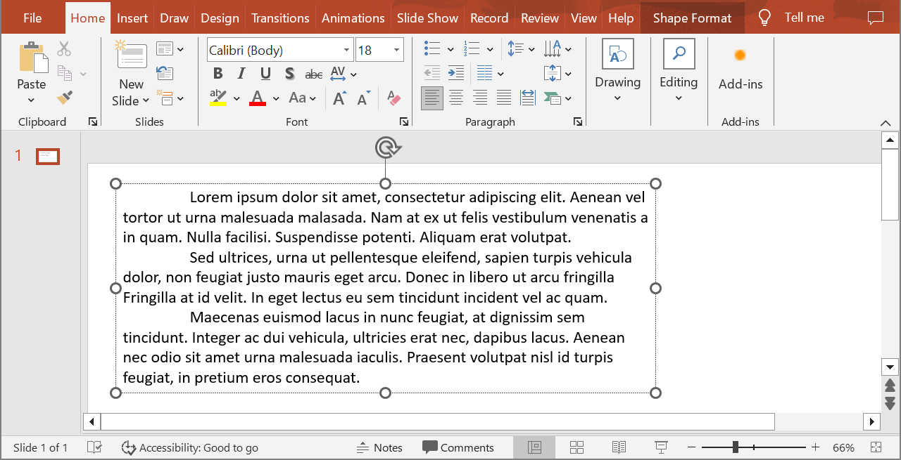

## **Ikhtisar**

Aspose.Slides untuk C++ menyajikan teks sebagai hirarki frame teks, paragraf, dan bagian:

* [ITextFrame](https://reference.aspose.com/slides/id/cpp/aspose.slides/itextframe/) mewakili kontainer teks dalam sebuah bentuk dan menyediakan akses ke koleksi paragrafnya.
* [IParagraph](https://reference.aspose.com/slides/id/cpp/aspose.slides/iparagraph/) mewakili satu paragraf dalam sebuah frame teks dan menyediakan akses ke bagian-bagiannya serta format pada level paragraf.
* [IPortion](https://reference.aspose.com/slides/id/cpp/aspose.slides/iportion/) mewakili satu rangkaian teks dalam sebuah paragraf. Setiap bagian dapat memiliki teks dan format pada level karakter masing-masing.

Dengan demikian, sebuah paragraf dapat berisi teks dengan font, warna, ukuran, dan format lain yang berbeda-beda dengan menggunakan beberapa bagian.

## **Buat dan Format Paragraf**

### **Buat Paragraf dengan Beberapa Bagian**

Langkah-langkah berikut membuat sebuah frame teks dengan tiga paragraf, masing-masing berisi tiga bagian:

1. Buat sebuah instance dari kelas [Presentation](https://reference.aspose.com/slides/id/cpp/aspose.slides/presentation/).
2. Akses referensi slide yang relevan melalui indeksnya.
3. Tambahkan sebuah [IAutoShape](https://reference.aspose.com/slides/id/cpp/aspose.slides/iautoshape/) berbentuk persegi panjang ke slide.
4. Akses [ITextFrame](https://reference.aspose.com/slides/id/cpp/aspose.slides/itextframe/) dari shape.
5. Gunakan paragraf default dan tambahkan dua objek [IParagraph](https://reference.aspose.com/slides/id/cpp/aspose.slides/iparagraph/) lagi ke frame teks.
6. Tambahkan cukup objek [IPortion](https://reference.aspose.com/slides/id/cpp/aspose.slides/iportion/) untuk setiap paragraf agar masing-masing berisi tiga bagian. Paragraf default sudah memiliki satu bagian kosong.
7. Atur teks untuk setiap bagian.
8. Terapkan format pada level karakter melalui [IPortion::get_PortionFormat](https://reference.aspose.com/slides/id/cpp/aspose.slides/iportion/get_portionformat/).
9. Simpan presentasi yang telah dimodifikasi.

Contoh C++ berikut mengimplementasikan langkah-langkah tersebut:

```cpp
#include <DOM/FillType.h>
#include <DOM/IAutoShape.h>
#include <DOM/IParagraphCollection.h>
#include <DOM/IPortionCollection.h>
#include <DOM/NullableBool.h>
#include <DOM/Paragraph.h>
#include <DOM/Portion.h>
#include <DOM/Presentation.h>
#include <DOM/ShapeType.h>
#include <Export/SaveFormat.h>
#include <drawing/color.h>
#include <system/string.h>

using namespace Aspose::Slides;
using namespace Aspose::Slides::Export;
using namespace System;
using namespace System::Drawing;

auto presentation = MakeObject<Presentation>();
auto slide = presentation->get_Slide(0);
auto shape = slide->get_Shapes()->AddAutoShape(ShapeType::Rectangle, 50, 150, 300, 150);
auto textFrame = shape->get_TextFrame();

auto firstParagraph = textFrame->get_Paragraph(0);
firstParagraph->get_Portions()->Add(MakeObject<Portion>());
firstParagraph->get_Portions()->Add(MakeObject<Portion>());

auto secondParagraph = MakeObject<Paragraph>();
secondParagraph->get_Portions()->Add(MakeObject<Portion>());
secondParagraph->get_Portions()->Add(MakeObject<Portion>());
secondParagraph->get_Portions()->Add(MakeObject<Portion>());
textFrame->get_Paragraphs()->Add(secondParagraph);

auto thirdParagraph = MakeObject<Paragraph>();
thirdParagraph->get_Portions()->Add(MakeObject<Portion>());
thirdParagraph->get_Portions()->Add(MakeObject<Portion>());
thirdParagraph->get_Portions()->Add(MakeObject<Portion>());
textFrame->get_Paragraphs()->Add(thirdParagraph);

auto paragraphCount = textFrame->get_Paragraphs()->get_Count();
for (int paragraphIndex = 0; paragraphIndex < paragraphCount; paragraphIndex++)
{
    auto paragraph = textFrame->get_Paragraph(paragraphIndex);
    auto portionCount = paragraph->get_Portions()->get_Count();
    for (int portionIndex = 0; portionIndex < portionCount; portionIndex++)
    {
        auto portion = paragraph->get_Portion(portionIndex);
        portion->set_Text(String::Format(u"Portion {0}.{1}", paragraphIndex + 1, portionIndex + 1));
        auto portionFormat = portion->get_PortionFormat();

        if (portionIndex == 0)
        {
            portionFormat->get_FillFormat()->set_FillType(FillType::Solid);
            portionFormat->get_FillFormat()->get_SolidFillColor()->set_Color(Color::get_Red());
            portionFormat->set_FontBold(NullableBool::True);
            portionFormat->set_FontHeight(15);
        }
        else if (portionIndex == 1)
        {
            portionFormat->get_FillFormat()->set_FillType(FillType::Solid);
            portionFormat->get_FillFormat()->get_SolidFillColor()->set_Color(Color::get_Blue());
            portionFormat->set_FontItalic(NullableBool::True);
            portionFormat->set_FontHeight(18);
        }
    }
}

presentation->Save(u"paragraphs_with_portions.pptx", SaveFormat::Pptx);
presentation->Dispose();
```

## **Buat Daftar Bullet dan Bernomor**

### **Buat Daftar Bullet atau Bernomor**

Peluru dan penomoran memudahkan pemindaian item terkait. Dalam Aspose.Slides, pengaturan daftar didefinisikan melalui [IBulletFormat](https://reference.aspose.com/slides/id/cpp/aspose.slides/ibulletformat/).

1. Buat sebuah instance dari kelas [Presentation](https://reference.aspose.com/slides/id/cpp/aspose.slides/presentation/).
2. Akses referensi slide yang relevan melalui indeksnya.
3. Tambahkan sebuah [IAutoShape](https://reference.aspose.com/slides/id/cpp/aspose.slides/iautoshape/) ke slide yang dipilih.
4. Akses [ITextFrame](https://reference.aspose.com/slides/id/cpp/aspose.slides/itextframe/) dari shape.
5. Hapus paragraf default dari frame teks.
6. Buat sebuah [Paragraph](https://reference.aspose.com/slides/id/cpp/aspose.slides/paragraph/) untuk bullet simbol.
7. Atur [IBulletFormat::set_Type](https://reference.aspose.com/slides/id/cpp/aspose.slides/ibulletformat/set_type/) menjadi [BulletType::Symbol](https://reference.aspose.com/slides/id/cpp/aspose.slides/bullettype/) dan tentukan karakter bullet.
8. Atur teks paragraf, indentasi, warna bullet, dan tinggi bullet.
9. Tambahkan paragraf ke frame teks.
10. Buat paragraf kedua dan atur [IBulletFormat::set_Type](https://reference.aspose.com/slides/id/cpp/aspose.slides/ibulletformat/set_type/) menjadi [BulletType::Numbered](https://reference.aspose.com/slides/id/cpp/aspose.slides/bullettype/).
11. Konfigurasikan gaya bullet bernomor dan tambahkan paragraf ke frame teks.
12. Simpan presentasi.

Contoh C++ berikut membuat bullet simbol dan bullet bernomor:

```cpp
#include <DOM/BulletType.h>
#include <DOM/ColorType.h>
#include <DOM/IAutoShape.h>
#include <DOM/IParagraphCollection.h>
#include <DOM/NullableBool.h>
#include <DOM/NumberedBulletStyle.h>
#include <DOM/Paragraph.h>
#include <DOM/Presentation.h>
#include <DOM/ShapeType.h>
#include <Export/SaveFormat.h>
#include <drawing/color.h>
#include <system/convert.h>

using namespace Aspose::Slides;
using namespace Aspose::Slides::Export;
using namespace System;
using namespace System::Drawing;

auto presentation = MakeObject<Presentation>();
auto slide = presentation->get_Slide(0);
auto shape = slide->get_Shapes()->AddAutoShape(ShapeType::Rectangle, 200, 200, 400, 200);
auto textFrame = shape->get_TextFrame();
textFrame->get_Paragraphs()->Clear();

auto symbolParagraph = MakeObject<Paragraph>();
symbolParagraph->set_Text(u"Welcome to Aspose.Slides");
symbolParagraph->get_ParagraphFormat()->get_Bullet()->set_Type(BulletType::Symbol);
symbolParagraph->get_ParagraphFormat()->get_Bullet()->set_Char(Convert::ToChar(0x2022));
symbolParagraph->get_ParagraphFormat()->set_Indent(25);
symbolParagraph->get_ParagraphFormat()->get_Bullet()->get_Color()->set_ColorType(ColorType::RGB);
symbolParagraph->get_ParagraphFormat()->get_Bullet()->get_Color()->set_Color(Color::get_Black());
symbolParagraph->get_ParagraphFormat()->get_Bullet()->set_IsBulletHardColor(NullableBool::True);
symbolParagraph->get_ParagraphFormat()->get_Bullet()->set_Height(100);
textFrame->get_Paragraphs()->Add(symbolParagraph);

auto numberedParagraph = MakeObject<Paragraph>();
numberedParagraph->set_Text(u"This is a numbered item");
numberedParagraph->get_ParagraphFormat()->get_Bullet()->set_Type(BulletType::Numbered);
numberedParagraph->get_ParagraphFormat()->get_Bullet()->set_NumberedBulletStyle(NumberedBulletStyle::BulletCircleNumWDBlackPlain);
numberedParagraph->get_ParagraphFormat()->set_Indent(25);
numberedParagraph->get_ParagraphFormat()->get_Bullet()->get_Color()->set_ColorType(ColorType::RGB);
numberedParagraph->get_ParagraphFormat()->get_Bullet()->get_Color()->set_Color(Color::get_Black());
numberedParagraph->get_ParagraphFormat()->get_Bullet()->set_IsBulletHardColor(NullableBool::True);
numberedParagraph->get_ParagraphFormat()->get_Bullet()->set_Height(100);
textFrame->get_Paragraphs()->Add(numberedParagraph);

presentation->Save(u"bulleted_and_numbered_list.pptx", SaveFormat::Pptx);
presentation->Dispose();
```

### **Gunakan Bullet Gambar**

Bullet gambar memungkinkan Anda menggunakan gambar kustom alih-alih simbol atau nomor.

1. Buat sebuah instance dari kelas [Presentation](https://reference.aspose.com/slides/id/cpp/aspose.slides/presentation/).
2. Akses referensi slide yang relevan melalui indeksnya.
3. Tambahkan sebuah [IAutoShape](https://reference.aspose.com/slides/id/cpp/aspose.slides/iautoshape/) dan akses [ITextFrame](https://reference.aspose.com/slides/id/cpp/aspose.slides/itextframe/)nya.
4. Hapus paragraf default dari frame teks.
5. Muat gambar bullet dan tambahkan ke koleksi gambar presentasi sebagai [IPPImage](https://reference.aspose.com/slides/id/cpp/aspose.slides/ippimage/).
6. Buat sebuah [Paragraph](https://reference.aspose.com/slides/id/cpp/aspose.slides/paragraph/) dan atur teksnya.
7. Atur [IBulletFormat::set_Type](https://reference.aspose.com/slides/id/cpp/aspose.slides/ibulletformat/set_type/) menjadi [BulletType::Picture](https://reference.aspose.com/slides/id/cpp/aspose.slides/bullettype/).
8. Tetapkan gambar melalui [ISlidesPicture::set_Image](https://reference.aspose.com/slides/id/cpp/aspose.slides/islidespicture/set_image/) dan atur tinggi bullet.
9. Tambahkan paragraf ke frame teks.
10. Simpan presentasi yang telah dimodifikasi.

Contoh C++ berikut membuat bullet gambar:

```cpp
#include <DOM/BulletType.h>
#include <DOM/IAutoShape.h>
#include <DOM/IImageCollection.h>
#include <DOM/IParagraphCollection.h>
#include <DOM/Paragraph.h>
#include <DOM/Presentation.h>
#include <DOM/ShapeType.h>
#include <Export/SaveFormat.h>
#include <IImage.h>
#include <Util/Images.h>

using namespace Aspose::Slides;
using namespace Aspose::Slides::Export;
using namespace System;

auto presentation = MakeObject<Presentation>();
auto slide = presentation->get_Slide(0);

auto bulletImage = Images::FromFile(u"bullets.png");
auto presentationImage = presentation->get_Images()->AddImage(bulletImage);
bulletImage->Dispose();

auto shape = slide->get_Shapes()->AddAutoShape(ShapeType::Rectangle, 200, 200, 400, 200);
auto textFrame = shape->get_TextFrame();
textFrame->get_Paragraphs()->Clear();

auto paragraph = MakeObject<Paragraph>();
paragraph->set_Text(u"Welcome to Aspose.Slides");
paragraph->get_ParagraphFormat()->get_Bullet()->set_Type(BulletType::Picture);
paragraph->get_ParagraphFormat()->get_Bullet()->get_Picture()->set_Image(presentationImage);
paragraph->get_ParagraphFormat()->get_Bullet()->set_Height(100);
textFrame->get_Paragraphs()->Add(paragraph);

presentation->Save(u"picture_bullet.pptx", SaveFormat::Pptx);
presentation->Save(u"picture_bullet.ppt", SaveFormat::Ppt);
presentation->Dispose();
```

### **Buat Daftar Multilevel**

Atur [IParagraphFormat::set_Depth](https://reference.aspose.com/slides/id/cpp/aspose.slides/iparagraphformat/set_depth/) untuk menempatkan paragraf pada level berbeda dalam sebuah daftar. Level teratas memiliki kedalaman `0`.

1. Buat sebuah [Presentation](https://reference.aspose.com/slides/id/cpp/aspose.slides/presentation/) dan akses sebuah slide.
2. Tambahkan sebuah [IAutoShape](https://reference.aspose.com/slides/id/cpp/aspose.slides/iautoshape/) dan hapus paragraf default dari frame teksnya.
3. Buat empat paragraf dan konfigurasikan simbol bullet mereka.
4. Atur nilai [IParagraphFormat::set_Depth](https://reference.aspose.com/slides/id/cpp/aspose.slides/iparagraphformat/set_depth/) mereka menjadi `0`, `1`, `2`, dan `3`.
5. Tambahkan paragraf ke frame teks dan simpan presentasi.

Contoh C++ berikut membuat daftar bullet empat level:

```cpp
#include <DOM/BulletType.h>
#include <DOM/FillType.h>
#include <DOM/IAutoShape.h>
#include <DOM/IParagraphCollection.h>
#include <DOM/Paragraph.h>
#include <DOM/Presentation.h>
#include <DOM/ShapeType.h>
#include <Export/SaveFormat.h>
#include <drawing/color.h>
#include <system/convert.h>

using namespace Aspose::Slides;
using namespace Aspose::Slides::Export;
using namespace System;
using namespace System::Drawing;

auto presentation = MakeObject<Presentation>();
auto slide = presentation->get_Slide(0);
auto shape = slide->get_Shapes()->AddAutoShape(ShapeType::Rectangle, 200, 200, 400, 200);
auto textFrame = shape->get_TextFrame();
textFrame->get_Paragraphs()->Clear();

auto firstParagraph = MakeObject<Paragraph>();
firstParagraph->set_Text(u"Content");
firstParagraph->get_ParagraphFormat()->get_Bullet()->set_Type(BulletType::Symbol);
firstParagraph->get_ParagraphFormat()->get_Bullet()->set_Char(Convert::ToChar(0x2022));
firstParagraph->get_ParagraphFormat()->get_DefaultPortionFormat()->get_FillFormat()->set_FillType(FillType::Solid);
firstParagraph->get_ParagraphFormat()->get_DefaultPortionFormat()->get_FillFormat()->get_SolidFillColor()->set_Color(Color::get_Black());
firstParagraph->get_ParagraphFormat()->set_Depth(0);

auto secondParagraph = MakeObject<Paragraph>();
secondParagraph->set_Text(u"Second level");
secondParagraph->get_ParagraphFormat()->get_Bullet()->set_Type(BulletType::Symbol);
secondParagraph->get_ParagraphFormat()->get_Bullet()->set_Char(u'-');
secondParagraph->get_ParagraphFormat()->get_DefaultPortionFormat()->get_FillFormat()->set_FillType(FillType::Solid);
secondParagraph->get_ParagraphFormat()->get_DefaultPortionFormat()->get_FillFormat()->get_SolidFillColor()->set_Color(Color::get_Black());
secondParagraph->get_ParagraphFormat()->set_Depth(1);

auto thirdParagraph = MakeObject<Paragraph>();
thirdParagraph->set_Text(u"Third level");
thirdParagraph->get_ParagraphFormat()->get_Bullet()->set_Type(BulletType::Symbol);
thirdParagraph->get_ParagraphFormat()->get_Bullet()->set_Char(Convert::ToChar(0x2022));
thirdParagraph->get_ParagraphFormat()->get_DefaultPortionFormat()->get_FillFormat()->set_FillType(FillType::Solid);
thirdParagraph->get_ParagraphFormat()->get_DefaultPortionFormat()->get_FillFormat()->get_SolidFillColor()->set_Color(Color::get_Black());
thirdParagraph->get_ParagraphFormat()->set_Depth(2);

auto fourthParagraph = MakeObject<Paragraph>();
fourthParagraph->set_Text(u"Fourth level");
fourthParagraph->get_ParagraphFormat()->get_Bullet()->set_Type(BulletType::Symbol);
fourthParagraph->get_ParagraphFormat()->get_Bullet()->set_Char(u'-');
fourthParagraph->get_ParagraphFormat()->get_DefaultPortionFormat()->get_FillFormat()->set_FillType(FillType::Solid);
fourthParagraph->get_ParagraphFormat()->get_DefaultPortionFormat()->get_FillFormat()->get_SolidFillColor()->set_Color(Color::get_Black());
fourthParagraph->get_ParagraphFormat()->set_Depth(3);

textFrame->get_Paragraphs()->Add(firstParagraph);
textFrame->get_Paragraphs()->Add(secondParagraph);
textFrame->get_Paragraphs()->Add(thirdParagraph);
textFrame->get_Paragraphs()->Add(fourthParagraph);

presentation->Save(u"multilevel_list.pptx", SaveFormat::Pptx);
presentation->Dispose();
```

### **Mulai Item Daftar Bernomor dengan Nilai Kustom**

Gunakan [IBulletFormat::set_NumberedBulletStartWith](https://reference.aspose.com/slides/id/cpp/aspose.slides/ibulletformat/set_numberedbulletstartwith/) untuk mengatur nomor awal yang ditampilkan pada paragraf bernomor.

1. Buat sebuah [Presentation](https://reference.aspose.com/slides/id/cpp/aspose.slides/presentation/) dan tambahkan sebuah [IAutoShape](https://reference.aspose.com/slides/id/cpp/aspose.slides/iautoshape/) ke sebuah slide.
2. Hapus paragraf default dari frame teks shape.
3. Buat tiga paragraf bernomor.
4. Atur [IBulletFormat::set_NumberedBulletStartWith](https://reference.aspose.com/slides/id/cpp/aspose.slides/ibulletformat/set_numberedbulletstartwith/) menjadi `2`, `3`, dan `7` untuk masing-masing paragraf.
5. Tambahkan paragraf ke frame teks dan simpan presentasi.

Contoh C++ berikut menetapkan nomor awal kustom untuk setiap paragraf:

```cpp
#include <DOM/BulletType.h>
#include <DOM/IAutoShape.h>
#include <DOM/IParagraphCollection.h>
#include <DOM/Paragraph.h>
#include <DOM/Presentation.h>
#include <DOM/ShapeType.h>
#include <Export/SaveFormat.h>

using namespace Aspose::Slides;
using namespace Aspose::Slides::Export;
using namespace System;

auto presentation = MakeObject<Presentation>();
auto slide = presentation->get_Slide(0);
auto shape = slide->get_Shapes()->AddAutoShape(ShapeType::Rectangle, 200, 200, 400, 200);
auto textFrame = shape->get_TextFrame();
textFrame->get_Paragraphs()->Clear();

auto firstParagraph = MakeObject<Paragraph>();
firstParagraph->set_Text(u"Start at 2");
firstParagraph->get_ParagraphFormat()->get_Bullet()->set_Type(BulletType::Numbered);
firstParagraph->get_ParagraphFormat()->get_Bullet()->set_NumberedBulletStartWith(2);
textFrame->get_Paragraphs()->Add(firstParagraph);

auto secondParagraph = MakeObject<Paragraph>();
secondParagraph->set_Text(u"Start at 3");
secondParagraph->get_ParagraphFormat()->get_Bullet()->set_Type(BulletType::Numbered);
secondParagraph->get_ParagraphFormat()->get_Bullet()->set_NumberedBulletStartWith(3);
textFrame->get_Paragraphs()->Add(secondParagraph);

auto thirdParagraph = MakeObject<Paragraph>();
thirdParagraph->set_Text(u"Start at 7");
thirdParagraph->get_ParagraphFormat()->get_Bullet()->set_Type(BulletType::Numbered);
thirdParagraph->get_ParagraphFormat()->get_Bullet()->set_NumberedBulletStartWith(7);
textFrame->get_Paragraphs()->Add(thirdParagraph);

presentation->Save(u"custom_numbered_list.pptx", SaveFormat::Pptx);
presentation->Dispose();
```

## **Kontrol Tata Letak Paragraf dan Properti Akhir**

### **Atur Indent Baris Pertama**

Gunakan [IParagraphFormat::set_Indent](https://reference.aspose.com/slides/id/cpp/aspose.slides/iparagraphformat/set_indent/) untuk mengontrol indent baris pertama dari sebuah paragraf. Metode ini memindahkan hanya baris pertama relatif terhadap margin kiri paragraf. Nilai positif menggeser baris pertama ke kanan, sedangkan baris lainnya tetap sejajar dengan badan paragraf.

Gunakan [IParagraphFormat::set_MarginLeft](https://reference.aspose.com/slides/id/cpp/aspose.slides/iparagraphformat/set_marginleft/) ketika Anda perlu memindahkan seluruh paragraf. Gunakan [IParagraphFormat::set_Indent](https://reference.aspose.com/slides/id/cpp/aspose.slides/iparagraphformat/set_indent/) ketika Anda hanya perlu memindahkan baris pertama.

Contoh di bawah ini membuat beberapa paragraf dan menerapkan nilai [IParagraphFormat::set_Indent](https://reference.aspose.com/slides/id/cpp/aspose.slides/iparagraphformat/set_indent/) yang berbeda untuk menunjukkan bagaimana indent baris pertama memengaruhi tata letak paragraf.

1. Buat sebuah instance dari kelas [Presentation](https://reference.aspose.com/slides/id/cpp/aspose.slides/presentation/).
2. Akses slide target.
3. Tambahkan sebuah [IAutoShape](https://reference.aspose.com/slides/id/cpp/aspose.slides/iautoshape/) berbentuk persegi panjang ke slide.
4. Akses [ITextFrame](https://reference.aspose.com/slides/id/cpp/aspose.slides/itextframe/) shape dan hapus paragraf default.
5. Buat beberapa paragraf dan atur nilai [IParagraphFormat::set_Indent](https://reference.aspose.com/slides/id/cpp/aspose.slides/iparagraphformat/set_indent/) yang berbeda untuk mereka.
6. Tambahkan paragraf ke frame teks.
7. Simpan presentasi yang telah dimodifikasi.

Kode ini menunjukkan cara mengatur indent paragraf:

```cpp
#include <DOM/FillType.h>
#include <DOM/IAutoShape.h>
#include <DOM/IParagraphCollection.h>
#include <DOM/Paragraph.h>
#include <DOM/Presentation.h>
#include <DOM/ShapeType.h>
#include <DOM/TextAutofitType.h>
#include <Export/SaveFormat.h>
#include <drawing/color.h>

using namespace Aspose::Slides;
using namespace Aspose::Slides::Export;
using namespace System;
using namespace System::Drawing;

auto presentation = MakeObject<Presentation>();
auto slide = presentation->get_Slide(0);
auto shape = slide->get_Shapes()->AddAutoShape(ShapeType::Rectangle, 50, 50, 420, 220);
shape->get_FillFormat()->set_FillType(FillType::NoFill);
shape->get_LineFormat()->get_FillFormat()->set_FillType(FillType::Solid);
shape->get_LineFormat()->get_FillFormat()->get_SolidFillColor()->set_Color(Color::get_Gray());

auto textFrame = shape->get_TextFrame();
textFrame->get_TextFrameFormat()->set_AutofitType(TextAutofitType::Shape);
textFrame->get_Paragraphs()->Clear();

auto firstParagraph = MakeObject<Paragraph>();
firstParagraph->set_Text(u"No first-line indent. Wrapped lines start at the same position as the first line.");
firstParagraph->get_ParagraphFormat()->get_DefaultPortionFormat()->get_FillFormat()->set_FillType(FillType::Solid);
firstParagraph->get_ParagraphFormat()->get_DefaultPortionFormat()->get_FillFormat()->get_SolidFillColor()->set_Color(Color::get_Black());
firstParagraph->get_ParagraphFormat()->set_MarginLeft(20);
firstParagraph->get_ParagraphFormat()->set_Indent(0);

auto secondParagraph = MakeObject<Paragraph>();
secondParagraph->set_Text(u"First-line indent of 20 points. The first line moves to the right, while wrapped lines remain aligned to the paragraph body.");
secondParagraph->get_ParagraphFormat()->get_DefaultPortionFormat()->get_FillFormat()->set_FillType(FillType::Solid);
secondParagraph->get_ParagraphFormat()->get_DefaultPortionFormat()->get_FillFormat()->get_SolidFillColor()->set_Color(Color::get_Black());
secondParagraph->get_ParagraphFormat()->set_MarginLeft(20);
secondParagraph->get_ParagraphFormat()->set_Indent(20);

auto thirdParagraph = MakeObject<Paragraph>();
thirdParagraph->set_Text(u"First-line indent of 40 points. This paragraph shows a larger first-line offset to make the effect easier to see.");
thirdParagraph->get_ParagraphFormat()->get_DefaultPortionFormat()->get_FillFormat()->set_FillType(FillType::Solid);
thirdParagraph->get_ParagraphFormat()->get_DefaultPortionFormat()->get_FillFormat()->get_SolidFillColor()->set_Color(Color::get_Black());
thirdParagraph->get_ParagraphFormat()->set_MarginLeft(20);
thirdParagraph->get_ParagraphFormat()->set_Indent(40);

textFrame->get_Paragraphs()->Add(firstParagraph);
textFrame->get_Paragraphs()->Add(secondParagraph);
textFrame->get_Paragraphs()->Add(thirdParagraph);

presentation->Save(u"paragraph_indent.pptx", SaveFormat::Pptx);
presentation->Dispose();
```

Hasilnya:


### **Atur Indent Menggantung**

Indent menggantung adalah tata letak paragraf di mana baris pertama dimulai lebih ke kiri dibandingkan baris-baris berikutnya. Di Aspose.Slides, Anda membuat efek ini dengan [IParagraphFormat::set_Indent](https://reference.aspose.com/slides/id/cpp/aspose.slides/iparagraphformat/set_indent/). Atur indent ke nilai negatif untuk memindahkan baris pertama ke kiri relatif terhadap badan paragraf.

Secara praktik, [IParagraphFormat::set_MarginLeft](https://reference.aspose.com/slides/id/cpp/aspose.slides/iparagraphformat/set_marginleft/) menentukan posisi kiri badan paragraf, dan [IParagraphFormat::set_Indent](https://reference.aspose.com/slides/id/cpp/aspose.slides/iparagraphformat/set_indent/) menentukan posisi baris pertama relatif terhadap margin tersebut. Untuk membuat indent menggantung, atur nilai margin-left positif dan nilai indent negatif.

Format ini berguna untuk bibliografi, referensi, entri glosarium, dan paragraf lain di mana baris yang dibungkus harus sejajar di bawah badan paragraf, bukan di bawah karakter pertama baris pertama.

1. Buat sebuah instance dari kelas [Presentation](https://reference.aspose.com/slides/id/cpp/aspose.slides/presentation/).
2. Akses slide target.
3. Tambahkan sebuah [IAutoShape](https://reference.aspose.com/slides/id/cpp/aspose.slides/iautoshape/) berbentuk persegi panjang ke slide.
4. Akses [ITextFrame](https://reference.aspose.com/slides/id/cpp/aspose.slides/itextframe/) shape dan hapus paragraf default.
5. Buat paragraf dan atur nilai [IParagraphFormat::set_MarginLeft](https://reference.aspose.com/slides/id/cpp/aspose.slides/iparagraphformat/set_marginleft/) positif untuk setiap paragraf.
6. Atur nilai [IParagraphFormat::set_Indent](https://reference.aspose.com/slides/id/cpp/aspose.slides/iparagraphformat/set_indent/) negatif untuk menciptakan efek indent menggantung.
7. Tambahkan paragraf ke frame teks.
8. Simpan presentasi yang telah dimodifikasi.

Kode ini menunjukkan cara mengatur indent menggantung untuk sebuah paragraf:

```cpp
#include <DOM/FillType.h>
#include <DOM/IAutoShape.h>
#include <DOM/IParagraphCollection.h>
#include <DOM/Paragraph.h>
#include <DOM/Presentation.h>
#include <DOM/ShapeType.h>
#include <DOM/TextAutofitType.h>
#include <Export/SaveFormat.h>
#include <drawing/color.h>

using namespace Aspose::Slides;
using namespace Aspose::Slides::Export;
using namespace System;
using namespace System::Drawing;

auto presentation = MakeObject<Presentation>();
auto slide = presentation->get_Slide(0);
auto shape = slide->get_Shapes()->AddAutoShape(ShapeType::Rectangle, 50, 50, 420, 220);
shape->get_FillFormat()->set_FillType(FillType::NoFill);
shape->get_LineFormat()->get_FillFormat()->set_FillType(FillType::Solid);
shape->get_LineFormat()->get_FillFormat()->get_SolidFillColor()->set_Color(Color::get_Gray());

auto textFrame = shape->get_TextFrame();
textFrame->get_TextFrameFormat()->set_AutofitType(TextAutofitType::Shape);
textFrame->get_Paragraphs()->Clear();

auto firstParagraph = MakeObject<Paragraph>();
firstParagraph->set_Text(u"A hanging indent is created by combining a positive left margin with a negative indent. The first line starts to the left, while wrapped lines align with the paragraph body.");
firstParagraph->get_ParagraphFormat()->get_DefaultPortionFormat()->get_FillFormat()->set_FillType(FillType::Solid);
firstParagraph->get_ParagraphFormat()->get_DefaultPortionFormat()->get_FillFormat()->get_SolidFillColor()->set_Color(Color::get_Black());
firstParagraph->get_ParagraphFormat()->set_MarginLeft(40);
firstParagraph->get_ParagraphFormat()->set_Indent(-20);

auto secondParagraph = MakeObject<Paragraph>();
secondParagraph->set_Text(u"This second example uses a deeper hanging indent so the difference between the first line and the wrapped lines is easier to compare.");
secondParagraph->get_ParagraphFormat()->get_DefaultPortionFormat()->get_FillFormat()->set_FillType(FillType::Solid);
secondParagraph->get_ParagraphFormat()->get_DefaultPortionFormat()->get_FillFormat()->get_SolidFillColor()->set_Color(Color::get_Black());
secondParagraph->get_ParagraphFormat()->set_MarginLeft(60);
secondParagraph->get_ParagraphFormat()->set_Indent(-30);

textFrame->get_Paragraphs()->Add(firstParagraph);
textFrame->get_Paragraphs()->Add(secondParagraph);

presentation->Save(u"hanging_indent.pptx", SaveFormat::Pptx);
presentation->Dispose();
```

Hasilnya:


### **Atur Properti Run Akhir Paragraf**

[IParagraph::set_EndParagraphPortionFormat](https://reference.aspose.com/slides/id/cpp/aspose.slides/iparagraph/set_endparagraphportionformat/) mengontrol format tanda akhir paragraf. Contoh berikut menetapkan ukuran font dan font Latin pada tanda akhir paragraf kedua:

1. Muat sebuah [Presentation](https://reference.aspose.com/slides/id/cpp/aspose.slides/presentation/) dan akses sebuah slide.
2. Tambahkan sebuah [IAutoShape](https://reference.aspose.com/slides/id/cpp/aspose.slides/iautoshape/) dan bersihkan paragraf defaultnya.
3. Buat dua paragraf dan tambahkan bagian teks ke masing‑masing.
4. Buat sebuah [PortionFormat](https://reference.aspose.com/slides/id/cpp/aspose.slides/portionformat/) untuk tanda akhir paragraf kedua.
5. Atur [IBasePortionFormat::set_FontHeight](https://reference.aspose.com/slides/id/cpp/aspose.slides/ibaseportionformat/set_fontheight/) dan [IBasePortionFormat::set_LatinFont](https://reference.aspose.com/slides/id/cpp/aspose.slides/ibaseportionformat/set_latinfont/).
6. Tetapkan format dengan [IParagraph::set_EndParagraphPortionFormat](https://reference.aspose.com/slides/id/cpp/aspose.slides/iparagraph/set_endparagraphportionformat/) dan simpan presentasi.

```cpp
#include <DOM/Fonts/FontData.h>
#include <DOM/IAutoShape.h>
#include <DOM/IParagraphCollection.h>
#include <DOM/IPortionCollection.h>
#include <DOM/Paragraph.h>
#include <DOM/Portion.h>
#include <DOM/PortionFormat.h>
#include <DOM/Presentation.h>
#include <DOM/ShapeType.h>
#include <Export/SaveFormat.h>

using namespace Aspose::Slides;
using namespace Aspose::Slides::Export;
using namespace System;

auto presentation = MakeObject<Presentation>(u"Test.pptx");
auto slide = presentation->get_Slide(0);
auto shape = slide->get_Shapes()->AddAutoShape(ShapeType::Rectangle, 10, 10, 200, 250);
auto textFrame = shape->get_TextFrame();
textFrame->get_Paragraphs()->Clear();

auto firstParagraph = MakeObject<Paragraph>();
firstParagraph->get_Portions()->Add(MakeObject<Portion>(u"Sample text"));

auto secondParagraph = MakeObject<Paragraph>();
secondParagraph->get_Portions()->Add(MakeObject<Portion>(u"Sample text 2"));

auto endParagraphFormat = MakeObject<PortionFormat>();
endParagraphFormat->set_FontHeight(48);
endParagraphFormat->set_LatinFont(MakeObject<FontData>(u"Times New Roman"));
secondParagraph->set_EndParagraphPortionFormat(endParagraphFormat);

textFrame->get_Paragraphs()->Add(firstParagraph);
textFrame->get_Paragraphs()->Add(secondParagraph);

presentation->Save(u"end_paragraph_format.pptx", SaveFormat::Pptx);
presentation->Dispose();
```

## **Hitung Baris yang Dirender**

Untuk aturan paragraf yang memengaruhi pembungkusan otomatis dan tanda baca pada akhir baris, lihat [Control Line Breaking](/slides/id/cpp/text-formatting/#control-line-breaking) dan [Control Hanging Punctuation](/slides/id/cpp/text-formatting/#control-hanging-punctuation).

Gunakan [IParagraph::GetLinesCount](https://reference.aspose.com/slides/id/cpp/aspose.slides/iparagraph/getlinescount/) untuk menghitung jumlah baris yang ditempati oleh sebuah paragraf setelah tata letak teks, termasuk pembungkusan otomatis. Ini berguna saat memeriksa panjang teks dan tata letak dalam templat presentasi.

Sebuah paragraf adalah satu item dalam [ITextFrame::get_Paragraphs](https://reference.aspose.com/slides/id/cpp/aspose.slides/itextframe/get_paragraphs/), dan dapat menempati beberapa baris yang dirender. Pemutusan baris eksplisit dalam paragraf memaksa baris baru tanpa membuat paragraf tambahan. Pembungkusan otomatis membuat baris berdasarkan lebar yang tersedia tanpa menyisipkan pemutusan baris eksplisit ke dalam teks. Oleh karena itu, menghitung paragraf atau karakter pemutusan baris tidak memberikan jumlah baris yang dirender.

Contoh berikut membuat sebuah bentuk teks, menghitung barisnya, mempersempit bentuk, dan kemudian mengganti teks dengan string yang lebih pendek. Pembungkusan diaktifkan dan autofit dinonaktifkan sehingga lebar bentuk mengendalikan pembungkusan tanpa secara otomatis memperkecil teks atau mengubah ukuran bentuk. Dimensi bentuk dalam poin. Akhirnya, contoh menambahkan paragraf lain dan menjumlahkan jumlah baris di seluruh frame teks.

```cpp
#include <DOM/IAutoShape.h>
#include <DOM/IParagraphCollection.h>
#include <DOM/NullableBool.h>
#include <DOM/Paragraph.h>
#include <DOM/Presentation.h>
#include <DOM/ShapeType.h>
#include <DOM/TextAutofitType.h>
#include <system/console.h>

using namespace Aspose::Slides;
using namespace System;

auto presentation = MakeObject<Presentation>();
auto slide = presentation->get_Slide(0);

auto shape = slide->get_Shapes()->AddAutoShape(ShapeType::Rectangle, 50, 50, 400, 200);
auto textFrame = shape->get_TextFrame();
textFrame->get_TextFrameFormat()->set_WrapText(NullableBool::True);
textFrame->get_TextFrameFormat()->set_AutofitType(TextAutofitType::None);

auto paragraph = textFrame->get_Paragraph(0);
paragraph->get_ParagraphFormat()->get_DefaultPortionFormat()->set_FontHeight(20);
paragraph->set_Text(u"This text demonstrates how automatic wrapping changes the number of rendered lines.");
Console::WriteLine(u"Original width: {0}", paragraph->GetLinesCount());

shape->set_Width(150);
Console::WriteLine(u"Narrower shape: {0}", paragraph->GetLinesCount());

paragraph->set_Text(u"Short text.");
Console::WriteLine(u"Shorter text: {0}", paragraph->GetLinesCount());

auto secondParagraph = MakeObject<Paragraph>();
secondParagraph->set_Text(u"Another paragraph.");
secondParagraph->get_ParagraphFormat()->get_DefaultPortionFormat()->set_FontHeight(20);
textFrame->get_Paragraphs()->Add(secondParagraph);

auto totalLineCount = 0;
for (auto currentParagraph : textFrame->get_Paragraphs())
{
    totalLineCount += currentParagraph->GetLinesCount();
}
Console::WriteLine(u"Total lines in the text frame: {0}", totalLineCount);
presentation->Dispose();
```

Dengan teks dan dimensi ini, mempersempit bentuk meningkatkan jumlah baris, sementara mengganti teks dengan string pendek menguranginya. Hitungan tepat dapat bervariasi tergantung pada ketersediaan dan substitusi font, ukuran font, margin, indentasi, pembungkusan, dan pengaturan autofit. Gunakan font dan pengaturan tata letak yang ditujukan untuk lingkungan target saat memeriksa sebuah templat.

Jumlah baris saja tidak menentukan apakah teks melampaui kontainernya. Tinggi yang tersedia, tinggi baris, spasi paragraf dan baris, serta perilaku autofit juga penting; bahkan satu baris dapat melampaui lebar tersedia ketika pembungkusan dinonaktifkan.

## **Impor dan Ekspor Konten Paragraf**

### **Impor Teks HTML ke dalam Paragraf**

Gunakan [IParagraphCollection::AddFromHtml](https://reference.aspose.com/slides/id/cpp/aspose.slides/iparagraphcollection/addfromhtml/) untuk mengonversi markup HTML menjadi paragraf dan bagian dalam sebuah frame teks.

1. Buat sebuah instance dari kelas [Presentation](https://reference.aspose.com/slides/id/cpp/aspose.slides/presentation/).
2. Akses sebuah slide dan tambahkan sebuah [IAutoShape](https://reference.aspose.com/slides/id/cpp/aspose.slides/iautoshape/).
3. Akses [ITextFrame](https://reference.aspose.com/slides/id/cpp/aspose.slides/itextframe/) shape dan bersihkan paragraf defaultnya.
4. Baca file HTML sumber.
5. Kirim string HTML ke [IParagraphCollection::AddFromHtml](https://reference.aspose.com/slides/id/cpp/aspose.slides/iparagraphcollection/addfromhtml/).
6. Simpan presentasi yang telah dimodifikasi.

Contoh C++ berikut mengimpor HTML ke dalam sebuah frame teks:

```cpp
#include <DOM/FillType.h>
#include <DOM/IAutoShape.h>
#include <DOM/IParagraphCollection.h>
#include <DOM/ISlideSize.h>
#include <DOM/Presentation.h>
#include <DOM/ShapeType.h>
#include <Export/SaveFormat.h>
#include <system/io/stream_reader.h>

using namespace Aspose::Slides;
using namespace Aspose::Slides::Export;
using namespace System;
using namespace System::IO;

auto presentation = MakeObject<Presentation>();
auto slide = presentation->get_Slide(0);
auto slideSize = presentation->get_SlideSize()->get_Size();
auto shape = slide->get_Shapes()->AddAutoShape(ShapeType::Rectangle, 10, 10, slideSize.get_Width() - 20, slideSize.get_Height() - 20);
shape->get_FillFormat()->set_FillType(FillType::NoFill);
shape->get_TextFrame()->get_Paragraphs()->Clear();

auto reader = MakeObject<StreamReader>(u"file.html");
auto html = reader->ReadToEnd();
reader->Close();
shape->get_TextFrame()->get_Paragraphs()->AddFromHtml(html);

presentation->Save(u"html_text.pptx", SaveFormat::Pptx);
presentation->Dispose();
```

### **Ekspor Teks Paragraf ke HTML**

Gunakan [IParagraphCollection::ExportToHtml](https://reference.aspose.com/slides/id/cpp/aspose.slides/iparagraphcollection/exporttohtml/) untuk mengekspor rentang paragraf terpilih sebagai HTML.

1. Buat sebuah instance dari kelas [Presentation](https://reference.aspose.com/slides/id/cpp/aspose.slides/presentation/) dan muat presentasi yang diinginkan.
2. Akses slide dan temukan [IAutoShape](https://reference.aspose.com/slides/id/cpp/aspose.slides/iautoshape/) yang berisi teks.
3. Akses [ITextFrame](https://reference.aspose.com/slides/id/cpp/aspose.slides/itextframe/) shape.
4. Panggil [IParagraphCollection::ExportToHtml](https://reference.aspose.com/slides/id/cpp/aspose.slides/iparagraphcollection/exporttohtml/) dengan indeks paragraf mulai dan jumlah paragraf yang akan diekspor.
5. Tulis string HTML yang dikembalikan ke sebuah file.

Contoh C++ berikut mengekspor semua paragraf dari bentuk teks pertama:

```cpp
#include <DOM/IAutoShape.h>
#include <DOM/IParagraphCollection.h>
#include <DOM/Presentation.h>
#include <system/console.h>
#include <system/io/stream_writer.h>
#include <system/object_ext.h>
#include <system/text/encoding.h>

using namespace Aspose::Slides;
using namespace System;
using namespace System::IO;
using namespace System::Text;

auto presentation = MakeObject<Presentation>(u"ExportingHTMLText.pptx");
auto shape = presentation->get_Slide(0)->get_Shape(0);
auto textShape = AsCast<IAutoShape>(shape);

if (textShape != nullptr && textShape->get_TextFrame() != nullptr)
{
    auto paragraphs = textShape->get_TextFrame()->get_Paragraphs();
    auto html = paragraphs->ExportToHtml(0, paragraphs->get_Count(), nullptr);
    auto writer = MakeObject<StreamWriter>(u"paragraphs.html", false, Encoding::get_UTF8());
    writer->Write(html);
    writer->Close();
}
else
{
    Console::WriteLine(u"The first shape is not a text shape.");
}

presentation->Dispose();
```

### **Render Paragraf sebagai Gambar**

[IParagraph::GetImage](https://reference.aspose.com/slides/id/cpp/aspose.slides/iparagraph/getimage/) merender sebuah paragraf individu secara langsung dan mengembalikan sebuah [IImage](https://reference.aspose.com/slides/id/cpp/aspose.slides/iimage/). Simpan hasilnya ke file atau aliran dengan [IImage::Save](https://reference.aspose.com/slides/id/cpp/aspose.slides/iimage/save/). Anda tidak perlu merender shape yang memuatnya atau memotong bitmap secara manual.

[IParagraph::GetImage](https://reference.aspose.com/slides/id/cpp/aspose.slides/iparagraph/getimage/) dapat mengembalikan `nullptr` jika paragraf tidak ditemukan dalam koleksi induknya, tidak memiliki batas render yang valid, atau tidak dapat dirender. Periksa hasilnya sebelum menyimpannya dan buang gambar yang dikembalikan setelah selesai digunakan.

#### **Render Paragraf pada Skala Default**

Misalkan kita memiliki file presentasi bernama sample.pptx dengan satu slide, di mana shape pertama adalah kotak teks yang berisi tiga paragraf.



Contoh berikut merender paragraf kedua dalam shape teks biasa pada skala default dan menyimpan gambar yang dikembalikan dalam format PNG.

```cpp
#include <DOM/IAutoShape.h>
#include <DOM/IParagraph.h>
#include <DOM/Presentation.h>
#include <IImage.h>
#include <ImageFormat.h>
#include <system/console.h>
#include <system/object_ext.h>

using namespace Aspose::Slides;
using namespace System;

auto presentation = MakeObject<Presentation>(u"sample.pptx");
auto shape = presentation->get_Slide(0)->get_Shape(0);
auto textShape = AsCast<IAutoShape>(shape);

if (textShape != nullptr && textShape->get_TextFrame() != nullptr && textShape->get_TextFrame()->get_Paragraphs()->get_Count() > 1)
{
    auto paragraph = textShape->get_TextFrame()->get_Paragraph(1);
    auto paragraphImage = paragraph->GetImage();

    if (paragraphImage != nullptr)
    {
        paragraphImage->Save(u"paragraph.png", ImageFormat::Png);
        paragraphImage->Dispose();
    }
    else
    {
        Console::WriteLine(u"The paragraph could not be rendered.");
    }
}
else
{
    Console::WriteLine(u"The expected text shape or paragraph was not found.");
}

presentation->Dispose();
```

Hasilnya:


#### **Render Paragraf dalam Sel Tabel dengan Skala**

Gunakan overload [IParagraph::GetImage](https://reference.aspose.com/slides/id/cpp/aspose.slides/iparagraph/getimage/) yang menerima parameter `float scaleX` dan `float scaleY` untuk mengatur faktor skala horizontal dan vertikal. Contoh berikut membuat sebuah tabel, merender paragraf di sel pertamanya dengan lebar dan tinggi dua kali lipat skala default, dan menyimpan hasilnya sebagai gambar PNG.

```cpp
#include <DOM/IParagraph.h>
#include <DOM/Presentation.h>
#include <DOM/Table/ITable.h>
#include <IImage.h>
#include <ImageFormat.h>
#include <system/array.h>
#include <system/console.h>

using namespace Aspose::Slides;
using namespace System;

auto scaleX = 2.0f;
auto scaleY = 2.0f;

auto presentation = MakeObject<Presentation>();
auto slide = presentation->get_Slide(0);
auto table = slide->get_Shapes()->AddTable(50, 50, MakeArray<double>({300}), MakeArray<double>({80}));
auto paragraph = table->idx_get(0, 0)->get_TextFrame()->get_Paragraph(0);
paragraph->set_Text(u"Text in a table cell");

auto paragraphImage = paragraph->GetImage(scaleX, scaleY);
if (paragraphImage != nullptr)
{
    paragraphImage->Save(u"table_paragraph.png", ImageFormat::Png);
    paragraphImage->Dispose();
}
else
{
    Console::WriteLine(u"The paragraph could not be rendered.");
}

presentation->Dispose();
```

Faktor skala `1` mempertahankan ukuran piksel default pada sumbu tersebut. Misalnya, `2` untuk kedua faktor menghasilkan gambar yang lebar dan tingginya kira‑kira dua kali dimensi default, menghasilkan empat kali lebih banyak piksel. Faktor yang lebih besar umumnya menghasilkan teks yang lebih tajam untuk zoom atau output resolusi tinggi, tetapi juga meningkatkan penggunaan memori dan ukuran berkas. Faktor di bawah `1` menghasilkan gambar lebih kecil dengan detail lebih sedikit. Gunakan faktor yang sama untuk mempertahankan rasio aspek paragraf; faktor horizontal dan vertikal yang berbeda akan meregangkan output secara terpisah.

Merender seluruh shape dengan [IShape::GetImage](https://reference.aspose.com/slides/id/cpp/aspose.slides/ishape/getimage/) tetap berguna ketika output harus mencakup isi, tepi, atau konteks visual lain dari shape. Untuk gambar yang hanya berisi paragraf, gunakan [IParagraph::GetImage](https://reference.aspose.com/slides/id/cpp/aspose.slides/iparagraph/getimage/).

## **FAQ**

**Apakah saya dapat menonaktifkan pembungkusan baris secara total di dalam sebuah frame teks?**

Ya. Gunakan [ITextFrameFormat::set_WrapText](https://reference.aspose.com/slides/id/cpp/aspose.slides/itextframeformat/set_wraptext/) untuk menonaktifkan pembungkusan sehingga baris tidak terputus di tepi frame teks.

**Bagaimana cara mendapatkan batas on-slide yang tepat dari paragraf tertentu?**

Gunakan [IParagraph::GetRect](https://reference.aspose.com/slides/id/cpp/aspose.slides/iparagraph/getrect/) untuk mengambil persegi batas paragraf. [IPortion::GetRect](https://reference.aspose.com/slides/id/cpp/aspose.slides/iportion/getrect/) memberikan batas bagian individu.

**Di mana kontrol perataan paragraf (kiri, kanan, tengah, atau justify) diatur?**

[IParagraphFormat::set_Alignment](https://reference.aspose.com/slides/id/cpp/aspose.slides/iparagraphformat/set_alignment/) adalah pengaturan pada level paragraf dan berlaku untuk seluruh paragraf terlepas dari format bagian individual.

**Apakah saya dapat menetapkan bahasa proofing untuk bagian tertentu dari paragraf?**

Ya. Gunakan [IBasePortionFormat::set_LanguageId](https://reference.aspose.com/slides/id/cpp/aspose.slides/ibaseportionformat/set_languageid/) untuk bagian individual, sehingga satu paragraf dapat berisi teks dalam beberapa bahasa.