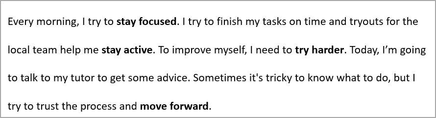

## **Gambaran Umum**

Artikel ini menunjukkan cara memformat teks dalam presentasi PowerPoint dan OpenDocument menggunakan Aspose.Slides untuk C++. Artikel ini mencakup warna latar belakang, transparansi, jarak karakter, properti font, rotasi, jarak paragraf, perilaku autofit, penempatan teks, tab stop, dan pengaturan bahasa.

Dalam contoh di bawah, kami akan menggunakan file bernama **"sample.pptx"**, yang berisi satu kotak teks pada slide pertama dengan teks berikut:


Untuk menemukan dan menyorot teks literal atau kecocokan ekspresi reguler, lihat [Cari dan Ganti Teks](/slides/id/cpp/search-and-replace-text/).

## **Set Warna Latar Belakang Teks**

Gunakan [IParagraphFormat::get_DefaultPortionFormat](https://reference.aspose.com/slides/id/cpp/aspose.slides/iparagraphformat/get_defaultportionformat/) untuk mengatur warna sorotan default untuk sebuah paragraf, atau gunakan [IBasePortionFormat::get_HighlightColor](https://reference.aspose.com/slides/id/cpp/aspose.slides/ibaseportionformat/get_highlightcolor/) untuk potongan teks individu.

Contoh kode berikut menunjukkan cara mengatur warna latar belakang untuk **seluruh paragraf**:

```cpp
#include <DOM/IAutoShape.h>
#include <DOM/IColorFormat.h>
#include <DOM/IParagraph.h>
#include <DOM/IParagraphFormat.h>
#include <DOM/IPortionFormat.h>
#include <DOM/ISlide.h>
#include <DOM/ITextFrame.h>
#include <DOM/Presentation.h>
#include <Export/SaveFormat.h>
#include <drawing/color.h>
using namespace Aspose::Slides;
using namespace Aspose::Slides::Export;

auto presentation = System::MakeObject<Presentation>(u"sample.pptx");

auto firstShape = presentation->get_Slide(0)->get_Shape(0);
auto autoShape = System::ExplicitCast<IAutoShape>(firstShape);
auto paragraph = autoShape->get_TextFrame()->get_Paragraph(0);
auto defaultPortionFormat = paragraph->get_ParagraphFormat()->get_DefaultPortionFormat();
auto highlightColor = System::Drawing::Color::get_LightGray();

// Setel warna sorotan untuk seluruh paragraf.
defaultPortionFormat->get_HighlightColor()->set_Color(highlightColor);

presentation->Save(u"gray_paragraph.pptx", SaveFormat::Pptx);
presentation->Dispose();
```

Hasil:


Contoh kode di bawah ini mendemonstrasikan cara mengatur warna latar belakang untuk **potongan teks dengan font tebal**:

```cpp
#include <DOM/IAutoShape.h>
#include <DOM/IColorFormat.h>
#include <DOM/IParagraph.h>
#include <DOM/IPortion.h>
#include <DOM/IPortionCollection.h>
#include <DOM/IPortionFormat.h>
#include <DOM/IPortionFormatEffectiveData.h>
#include <DOM/ISlide.h>
#include <DOM/ITextFrame.h>
#include <DOM/Presentation.h>
#include <Export/SaveFormat.h>
#include <drawing/color.h>
using namespace Aspose::Slides;
using namespace Aspose::Slides::Export;

auto presentation = System::MakeObject<Presentation>(u"sample.pptx");

auto firstShape = presentation->get_Slide(0)->get_Shape(0);
auto autoShape = System::ExplicitCast<IAutoShape>(firstShape);
auto paragraph = autoShape->get_TextFrame()->get_Paragraph(0);
auto portions = paragraph->get_Portions();
int portionCount = portions->get_Count();
auto highlightColor = System::Drawing::Color::get_LightGray();

for (int portionIndex = 0; portionIndex < portionCount; portionIndex++)
{
    auto portion = paragraph->get_Portion(portionIndex);
    auto portionFormat = portion->get_PortionFormat();
    if (portionFormat->GetEffective()->get_FontBold())
    {
        // Setel warna sorotan untuk potongan teks.
        portionFormat->get_HighlightColor()->set_Color(highlightColor);
    }
}

presentation->Save(u"gray_text_portions.pptx", SaveFormat::Pptx);
presentation->Dispose();
```

Hasil:


## **Align Text Paragraphs**

Gunakan [IParagraphFormat::set_Alignment](https://reference.aspose.com/slides/id/cpp/aspose.slides/iparagraphformat/set_alignment/) untuk mengatur perataan paragraf dalam sebuah bingkai teks. Nilainya dapat berupa tengah, rata kiri, rata kanan, justify, dan sebagainya.

Contoh kode berikut menunjukkan cara meratakan paragraf ke **tengah**:

```cpp
#include <DOM/IAutoShape.h>
#include <DOM/IParagraph.h>
#include <DOM/IParagraphFormat.h>
#include <DOM/ISlide.h>
#include <DOM/ITextFrame.h>
#include <DOM/Presentation.h>
#include <DOM/TextAlignment.h>
#include <Export/SaveFormat.h>
using namespace Aspose::Slides;
using namespace Aspose::Slides::Export;

auto presentation = System::MakeObject<Presentation>(u"sample.pptx");

auto firstShape = presentation->get_Slide(0)->get_Shape(0);
auto autoShape = System::ExplicitCast<IAutoShape>(firstShape);
auto paragraph = autoShape->get_TextFrame()->get_Paragraph(0);

// Setel perataan paragraf ke tengah.
paragraph->get_ParagraphFormat()->set_Alignment(TextAlignment::Center);

presentation->Save(u"aligned_paragraph.pptx", SaveFormat::Pptx);
presentation->Dispose();
```

Hasil:


## **Set Transparency for Text**

Transparansi teks dikendalikan melalui komponen alpha dari warna yang ditetapkan melalui [IBasePortionFormat::get_FillFormat](https://reference.aspose.com/slides/id/cpp/aspose.slides/ibaseportionformat/get_fillformat/). Dalam contoh di bawah, `alpha = 50` adalah nilai saluran alpha ARGB pada skala 0‑255, bukan persentase transparansi.

Contoh kode berikut menunjukkan cara menerapkan transparansi pada **seluruh paragraf**:

```cpp
#include <DOM/FillType.h>
#include <DOM/IAutoShape.h>
#include <DOM/IColorFormat.h>
#include <DOM/IFillFormat.h>
#include <DOM/IParagraph.h>
#include <DOM/IParagraphFormat.h>
#include <DOM/IPortionFormat.h>
#include <DOM/ISlide.h>
#include <DOM/ITextFrame.h>
#include <DOM/Presentation.h>
#include <Export/SaveFormat.h>
#include <drawing/color.h>
using namespace Aspose::Slides;
using namespace Aspose::Slides::Export;

int alpha = 50;

auto presentation = System::MakeObject<Presentation>(u"sample.pptx");

auto firstShape = presentation->get_Slide(0)->get_Shape(0);
auto autoShape = System::ExplicitCast<IAutoShape>(firstShape);
auto paragraph = autoShape->get_TextFrame()->get_Paragraph(0);
auto defaultPortionFormat = paragraph->get_ParagraphFormat()->get_DefaultPortionFormat();

// Setel warna isian teks menjadi warna transparan.
defaultPortionFormat->get_FillFormat()->set_FillType(FillType::Solid);
auto baseColor = System::Drawing::Color::get_Black();
auto transparentColor = System::Drawing::Color::FromArgb(alpha, baseColor);
defaultPortionFormat->get_FillFormat()->get_SolidFillColor()->set_Color(transparentColor);

presentation->Save(u"transparent_paragraph.pptx", SaveFormat::Pptx);
presentation->Dispose();
```

Hasil:


Contoh kode berikut menunjukkan cara menerapkan transparansi pada **potongan teks dengan font tebal**:

```cpp
#include <DOM/FillType.h>
#include <DOM/IAutoShape.h>
#include <DOM/IColorFormat.h>
#include <DOM/IFillFormat.h>
#include <DOM/IParagraph.h>
#include <DOM/IPortion.h>
#include <DOM/IPortionCollection.h>
#include <DOM/IPortionFormat.h>
#include <DOM/IPortionFormatEffectiveData.h>
#include <DOM/ISlide.h>
#include <DOM/ITextFrame.h>
#include <DOM/Presentation.h>
#include <Export/SaveFormat.h>
#include <drawing/color.h>
using namespace Aspose::Slides;
using namespace Aspose::Slides::Export;

int alpha = 50;

auto presentation = System::MakeObject<Presentation>(u"sample.pptx");

auto firstShape = presentation->get_Slide(0)->get_Shape(0);
auto autoShape = System::ExplicitCast<IAutoShape>(firstShape);
auto paragraph = autoShape->get_TextFrame()->get_Paragraph(0);
auto portions = paragraph->get_Portions();
int portionCount = portions->get_Count();

for (int portionIndex = 0; portionIndex < portionCount; portionIndex++)
{
    auto portion = paragraph->get_Portion(portionIndex);
    auto portionFormat = portion->get_PortionFormat();
    if (portionFormat->GetEffective()->get_FontBold())
    {
        // Setel transparansi potongan teks.
        portionFormat->get_FillFormat()->set_FillType(FillType::Solid);
        auto baseColor = System::Drawing::Color::get_Black();
        auto transparentColor = System::Drawing::Color::FromArgb(alpha, baseColor);
        portionFormat->get_FillFormat()->get_SolidFillColor()->set_Color(transparentColor);
    }
}

presentation->Save(u"transparent_text_portions.pptx", SaveFormat::Pptx);
presentation->Dispose();
```

Hasil:


## **Set Character Spacing for Text**

Gunakan [IBasePortionFormat::set_Spacing](https://reference.aspose.com/slides/id/cpp/aspose.slides/ibaseportionformat/set_spacing/) untuk memperlebar atau mempersempit jarak antar karakter dalam sebuah kotak teks.

Kode C++ berikut menunjukkan cara memperlebar jarak karakter dalam **seluruh paragraf**:

```cpp
#include <DOM/IAutoShape.h>
#include <DOM/IParagraph.h>
#include <DOM/IParagraphFormat.h>
#include <DOM/IPortionFormat.h>
#include <DOM/ISlide.h>
#include <DOM/ITextFrame.h>
#include <DOM/Presentation.h>
#include <Export/SaveFormat.h>
using namespace Aspose::Slides;
using namespace Aspose::Slides::Export;

auto presentation = System::MakeObject<Presentation>(u"sample.pptx");

auto firstShape = presentation->get_Slide(0)->get_Shape(0);
auto autoShape = System::ExplicitCast<IAutoShape>(firstShape);
auto paragraph = autoShape->get_TextFrame()->get_Paragraph(0);

// Catatan: Gunakan nilai negatif untuk mengompres jarak karakter.
paragraph->get_ParagraphFormat()->get_DefaultPortionFormat()->set_Spacing(3.0f); // Perluas jarak karakter.

presentation->Save(u"character_spacing_in_paragraph.pptx", SaveFormat::Pptx);
presentation->Dispose();
```

Hasil:


Contoh kode di bawah ini menunjukkan cara memperlebar jarak karakter dalam **potongan teks dengan font tebal**:

```cpp
#include <DOM/IAutoShape.h>
#include <DOM/IParagraph.h>
#include <DOM/IPortion.h>
#include <DOM/IPortionCollection.h>
#include <DOM/IPortionFormat.h>
#include <DOM/IPortionFormatEffectiveData.h>
#include <DOM/ISlide.h>
#include <DOM/ITextFrame.h>
#include <DOM/Presentation.h>
#include <Export/SaveFormat.h>
using namespace Aspose::Slides;
using namespace Aspose::Slides::Export;

auto presentation = System::MakeObject<Presentation>(u"sample.pptx");

auto firstShape = presentation->get_Slide(0)->get_Shape(0);
auto autoShape = System::ExplicitCast<IAutoShape>(firstShape);
auto paragraph = autoShape->get_TextFrame()->get_Paragraph(0);
auto portions = paragraph->get_Portions();
int portionCount = portions->get_Count();

for (int portionIndex = 0; portionIndex < portionCount; portionIndex++)
{
    auto portion = paragraph->get_Portion(portionIndex);
    auto portionFormat = portion->get_PortionFormat();
    if (portionFormat->GetEffective()->get_FontBold())
    {
        // Catatan: Gunakan nilai negatif untuk mengompres jarak karakter.
        portionFormat->set_Spacing(3.0f); // Perluas jarak karakter.
    }
}

presentation->Save(u"character_spacing_in_text_portions.pptx", SaveFormat::Pptx);
presentation->Dispose();
```

Hasil:


### **Disable Kerning for Specific Fonts**

Dalam beberapa kasus, teks yang dirender oleh Aspose.Slides dapat terlihat sedikit lebih rapat dibandingkan teks yang sama yang ditampilkan di PowerPoint. Hal ini dapat terjadi karena PowerPoint mungkin mengabaikan data kerning untuk font tertentu, meskipun font tersebut memiliki informasi kerning yang valid dan kerning diaktifkan dalam pengaturan PowerPoint.

Untuk membuat output yang dirender lebih mirip dengan PowerPoint dalam kasus tersebut, Anda dapat menonaktifkan kerning untuk potongan teks yang menggunakan font yang terpengaruh. Gunakan [IBasePortionFormat::set_KerningMinimalSize](https://reference.aspose.com/slides/id/cpp/aspose.slides/ibaseportionformat/set_kerningminimalsize/) untuk menetapkan nilai yang jauh lebih besar daripada ukuran font sebenarnya:

```cpp
#include <DOM/IAutoShape.h>
#include <DOM/IFontData.h>
#include <DOM/IParagraph.h>
#include <DOM/IParagraphCollection.h>
#include <DOM/IPortion.h>
#include <DOM/IPortionCollection.h>
#include <DOM/IPortionFormat.h>
#include <DOM/ISlide.h>
#include <DOM/ITextFrame.h>
#include <DOM/Presentation.h>
#include <Export/SaveFormat.h>
using namespace Aspose::Slides;
using namespace Aspose::Slides::Export;

auto presentation = System::MakeObject<Presentation>(u"presentation.pptx");

auto firstShape = presentation->get_Slide(0)->get_Shape(0);
auto autoShape = System::ExplicitCast<IAutoShape>(firstShape);
System::String targetFont = u"Roboto";
auto textFrame = autoShape->get_TextFrame();
auto paragraphs = textFrame->get_Paragraphs();
int paragraphCount = paragraphs->get_Count();

for (int paragraphIndex = 0; paragraphIndex < paragraphCount; paragraphIndex++)
{
    auto paragraph = textFrame->get_Paragraph(paragraphIndex);
    auto portions = paragraph->get_Portions();
    int portionCount = portions->get_Count();

    for (int portionIndex = 0; portionIndex < portionCount; portionIndex++)
    {
        auto portion = paragraph->get_Portion(portionIndex);
        auto portionFormat = portion->get_PortionFormat();
        auto latinFont = portionFormat->get_LatinFont();
        auto eastAsianFont = portionFormat->get_EastAsianFont();
        auto complexScriptFont = portionFormat->get_ComplexScriptFont();

        bool isLatinFont = latinFont != nullptr && latinFont->get_FontName() == targetFont;
        bool isEastAsianFont = eastAsianFont != nullptr && eastAsianFont->get_FontName() == targetFont;
        bool isComplexScriptFont = complexScriptFont != nullptr && complexScriptFont->get_FontName() == targetFont;

        if (isLatinFont || isEastAsianFont || isComplexScriptFont)
        {
            portionFormat->set_KerningMinimalSize(100.0f);
        }
    }
}

presentation->Save(u"output.pptx", SaveFormat::Pptx);
presentation->Dispose();
```

Pengaturan ini mencegah kerning diterapkan pada potongan teks yang cocok dan dapat membantu menyamakan hasil render Aspose.Slides dengan output visual PowerPoint untuk font yang dipengaruhi oleh perilaku khusus PowerPoint ini.

## **Manage Text Font Properties**

Properti font dapat diatur pada tingkat paragraf melalui [IParagraphFormat::get_DefaultPortionFormat](https://reference.aspose.com/slides/id/cpp/aspose.slides/iparagraphformat/get_defaultportionformat/) atau pada potongan individu melalui [IPortionFormat](https://reference.aspose.com/slides/id/cpp/aspose.slides/iportionformat/).

Kode berikut mengatur font dan gaya teks untuk seluruh paragraf: ia menerapkan ukuran font, tebal, miring, garis bawah putus-putus, serta font Times New Roman ke semua potongan dalam paragraf.

```cpp
#include <DOM/Fonts/FontData.h>
#include <DOM/IAutoShape.h>
#include <DOM/IParagraph.h>
#include <DOM/IParagraphFormat.h>
#include <DOM/IPortionFormat.h>
#include <DOM/ISlide.h>
#include <DOM/ITextFrame.h>
#include <DOM/NullableBool.h>
#include <DOM/Presentation.h>
#include <DOM/TextUnderlineType.h>
#include <Export/SaveFormat.h>
using namespace Aspose::Slides;
using namespace Aspose::Slides::Export;

auto presentation = System::MakeObject<Presentation>(u"sample.pptx");

auto firstShape = presentation->get_Slide(0)->get_Shape(0);
auto autoShape = System::ExplicitCast<IAutoShape>(firstShape);
auto paragraph = autoShape->get_TextFrame()->get_Paragraph(0);
auto defaultPortionFormat = paragraph->get_ParagraphFormat()->get_DefaultPortionFormat();

// Setel properti font untuk paragraf.
defaultPortionFormat->set_FontHeight(12.0f);
defaultPortionFormat->set_FontBold(NullableBool::True);
defaultPortionFormat->set_FontItalic(NullableBool::True);
defaultPortionFormat->set_FontUnderline(TextUnderlineType::Dotted);
auto font = System::MakeObject<FontData>(u"Times New Roman");
defaultPortionFormat->set_LatinFont(font);

presentation->Save(u"font_properties_for_paragraph.pptx", SaveFormat::Pptx);
presentation->Dispose();
```

Hasil:


Contoh kode di bawah ini menerapkan properti serupa pada **potongan teks dengan font tebal**:

```cpp
#include <DOM/Fonts/FontData.h>
#include <DOM/IAutoShape.h>
#include <DOM/IParagraph.h>
#include <DOM/IPortion.h>
#include <DOM/IPortionCollection.h>
#include <DOM/IPortionFormat.h>
#include <DOM/IPortionFormatEffectiveData.h>
#include <DOM/ISlide.h>
#include <DOM/ITextFrame.h>
#include <DOM/NullableBool.h>
#include <DOM/Presentation.h>
#include <DOM/TextUnderlineType.h>
#include <Export/SaveFormat.h>
using namespace Aspose::Slides;
using namespace Aspose::Slides::Export;

auto presentation = System::MakeObject<Presentation>(u"sample.pptx");

auto firstShape = presentation->get_Slide(0)->get_Shape(0);
auto autoShape = System::ExplicitCast<IAutoShape>(firstShape);
auto paragraph = autoShape->get_TextFrame()->get_Paragraph(0);
auto portions = paragraph->get_Portions();
int portionCount = portions->get_Count();
auto font = System::MakeObject<FontData>(u"Times New Roman");

for (int portionIndex = 0; portionIndex < portionCount; portionIndex++)
{
    auto portion = paragraph->get_Portion(portionIndex);
    auto portionFormat = portion->get_PortionFormat();
    if (portionFormat->GetEffective()->get_FontBold())
    {
        // Setel properti font untuk potongan teks.
        portionFormat->set_FontHeight(13.0f);
        portionFormat->set_FontItalic(NullableBool::True);
        portionFormat->set_FontUnderline(TextUnderlineType::Dotted);
        portionFormat->set_LatinFont(font);
    }
}

presentation->Save(u"font_properties_for_text_portions.pptx", SaveFormat::Pptx);
presentation->Dispose();
```

Hasil:


## **Set Text Rotation**

Gunakan [ITextFrameFormat::set_TextVerticalType](https://reference.aspose.com/slides/id/cpp/aspose.slides/itextframeformat/set_textverticaltype/) untuk mengatur orientasi teks pra‑definisi dalam sebuah bentuk.

Contoh kode berikut mengatur orientasi teks dalam bentuk ke [TextVerticalType::Vertical270](https://reference.aspose.com/slides/id/cpp/aspose.slides/textverticaltype/), yang memutar teks **90 derajat berlawanan arah jarum jam**:

```cpp
#include <DOM/IAutoShape.h>
#include <DOM/ISlide.h>
#include <DOM/ITextFrame.h>
#include <DOM/ITextFrameFormat.h>
#include <DOM/Presentation.h>
#include <DOM/TextVerticalType.h>
#include <Export/SaveFormat.h>
using namespace Aspose::Slides;
using namespace Aspose::Slides::Export;

auto presentation = System::MakeObject<Presentation>(u"sample.pptx");

auto firstShape = presentation->get_Slide(0)->get_Shape(0);
auto autoShape = System::ExplicitCast<IAutoShape>(firstShape);

autoShape->get_TextFrame()->get_TextFrameFormat()->set_TextVerticalType(TextVerticalType::Vertical270);

presentation->Save(u"text_rotation.pptx", SaveFormat::Pptx);
presentation->Dispose();
```

Hasil:


## **Set Custom Rotation for Text Frames**

Gunakan [ITextFrameFormat::set_RotationAngle](https://reference.aspose.com/slides/id/cpp/aspose.slides/itextframeformat/set_rotationangle/) untuk menetapkan sudut rotasi khusus untuk sebuah [ITextFrame](https://reference.aspose.com/slides/id/cpp/aspose.slides/itextframe/).

Contoh kode di bawah ini memutar bingkai teks sebesar 3 derajat searah jarum jam dalam bentuk:

```cpp
#include <DOM/IAutoShape.h>
#include <DOM/ISlide.h>
#include <DOM/ITextFrame.h>
#include <DOM/ITextFrameFormat.h>
#include <DOM/Presentation.h>
#include <Export/SaveFormat.h>
using namespace Aspose::Slides;
using namespace Aspose::Slides::Export;

auto presentation = System::MakeObject<Presentation>(u"sample.pptx");

auto firstShape = presentation->get_Slide(0)->get_Shape(0);
auto autoShape = System::ExplicitCast<IAutoShape>(firstShape);

autoShape->get_TextFrame()->get_TextFrameFormat()->set_RotationAngle(3.0f);

presentation->Save(u"custom_text_rotation.pptx", SaveFormat::Pptx);
presentation->Dispose();
```

Hasil:


## **Set Line Spacing of Paragraphs**

Aspose.Slides menyediakan [IParagraphFormat::set_SpaceAfter](https://reference.aspose.com/slides/id/cpp/aspose.slides/iparagraphformat/set_spaceafter/), [IParagraphFormat::set_SpaceBefore](https://reference.aspose.com/slides/id/cpp/aspose.slides/iparagraphformat/set_spacebefore/), dan [IParagraphFormat::set_SpaceWithin](https://reference.aspose.com/slides/id/cpp/aspose.slides/iparagraphformat/set_spacewithin/) untuk mengontrol jarak paragraf. Metode‑metode ini digunakan sebagai berikut:

* Gunakan nilai positif untuk menentukan jarak baris sebagai persentase dari tinggi baris.
* Gunakan nilai negatif untuk menentukan jarak baris dalam poin.

Contoh kode berikut menunjukkan cara menentukan jarak baris di dalam paragraf:

```cpp
#include <DOM/IAutoShape.h>
#include <DOM/IParagraph.h>
#include <DOM/IParagraphFormat.h>
#include <DOM/ISlide.h>
#include <DOM/ITextFrame.h>
#include <DOM/Presentation.h>
#include <Export/SaveFormat.h>
using namespace Aspose::Slides;
using namespace Aspose::Slides::Export;

auto presentation = System::MakeObject<Presentation>(u"sample.pptx");

auto firstShape = presentation->get_Slide(0)->get_Shape(0);
auto autoShape = System::ExplicitCast<IAutoShape>(firstShape);
auto paragraph = autoShape->get_TextFrame()->get_Paragraph(0);

paragraph->get_ParagraphFormat()->set_SpaceWithin(200.0f);

presentation->Save(u"line_spacing.pptx", SaveFormat::Pptx);
presentation->Dispose();
```

Hasil:



## **Set Autofit Type for Text Frames**

[ITextFrameFormat::set_AutofitType](https://reference.aspose.com/slides/id/cpp/aspose.slides/itextframeformat/set_autofittype/) menentukan bagaimana teks berperilaku ketika melebihi batas kontainernya. Gunakan untuk mengontrol apakah teks menyusut, meluap, atau mengubah ukuran bentuk secara otomatis.

```cpp
#include <DOM/IAutoShape.h>
#include <DOM/ISlide.h>
#include <DOM/ITextFrame.h>
#include <DOM/ITextFrameFormat.h>
#include <DOM/Presentation.h>
#include <DOM/TextAutofitType.h>
#include <Export/SaveFormat.h>
using namespace Aspose::Slides;
using namespace Aspose::Slides::Export;

auto presentation = System::MakeObject<Presentation>(u"sample.pptx");

auto firstShape = presentation->get_Slide(0)->get_Shape(0);
auto autoShape = System::ExplicitCast<IAutoShape>(firstShape);

autoShape->get_TextFrame()->get_TextFrameFormat()->set_AutofitType(TextAutofitType::Shape);

presentation->Save(u"autofit_type.pptx", SaveFormat::Pptx);
presentation->Dispose();
```

Untuk menghitung baris setelah pembungkusan otomatis dan melihat bagaimana lebar teks atau bentuk berubah, lihat [Hitung Baris yang Dihasilkan](/slides/id/cpp/manage-paragraph/). Jumlah baris saja tidak menunjukkan apakah teks meluap dari kontainernya.

## **Set Anchor of Text Frames**

[ITextFrameFormat::set_AnchoringType](https://reference.aspose.com/slides/id/cpp/aspose.slides/itextframeformat/set_anchoringtype/) mendefinisikan bagaimana teks diposisikan secara vertikal di dalam sebuah bentuk, misalnya di bagian atas, tengah, atau bawah.

```cpp
#include <DOM/IAutoShape.h>
#include <DOM/ISlide.h>
#include <DOM/ITextFrame.h>
#include <DOM/ITextFrameFormat.h>
#include <DOM/Presentation.h>
#include <DOM/TextAnchorType.h>
#include <Export/SaveFormat.h>
using namespace Aspose::Slides;
using namespace Aspose::Slides::Export;

auto presentation = System::MakeObject<Presentation>(u"sample.pptx");

auto firstShape = presentation->get_Slide(0)->get_Shape(0);
auto autoShape = System::ExplicitCast<IAutoShape>(firstShape);

autoShape->get_TextFrame()->get_TextFrameFormat()->set_AnchoringType(TextAnchorType::Bottom);

presentation->Save(u"text_anchor.pptx", SaveFormat::Pptx);
presentation->Dispose();
```

## **Set Text Tabulation**

Gunakan [IParagraphFormat::set_DefaultTabSize](https://reference.aspose.com/slides/id/cpp/aspose.slides/iparagraphformat/set_defaulttabsize/) dan [IParagraphFormat::get_Tabs](https://reference.aspose.com/slides/id/cpp/aspose.slides/iparagraphformat/get_tabs/) untuk mengonfigurasi tab stop dalam sebuah paragraf.

```cpp
#include <DOM/IAutoShape.h>
#include <DOM/IParagraph.h>
#include <DOM/IParagraphFormat.h>
#include <DOM/ISlide.h>
#include <DOM/ITabCollection.h>
#include <DOM/ITextFrame.h>
#include <DOM/Presentation.h>
#include <DOM/TabAlignment.h>
#include <Export/SaveFormat.h>
using namespace Aspose::Slides;
using namespace Aspose::Slides::Export;

auto presentation = System::MakeObject<Presentation>(u"sample.pptx");

auto firstShape = presentation->get_Slide(0)->get_Shape(0);
auto autoShape = System::ExplicitCast<IAutoShape>(firstShape);
auto paragraph = autoShape->get_TextFrame()->get_Paragraph(0);

paragraph->get_ParagraphFormat()->set_DefaultTabSize(100.0f);
paragraph->get_ParagraphFormat()->get_Tabs()->Add(30.0f, TabAlignment::Left);

presentation->Save(u"paragraph_tabs.pptx", SaveFormat::Pptx);
presentation->Dispose();
```

Hasil:


## **Set Proofing Language**

Aspose.Slides menyediakan [IBasePortionFormat::set_LanguageId](https://reference.aspose.com/slides/id/cpp/aspose.slides/ibaseportionformat/set_languageid/), yang memungkinkan Anda menetapkan bahasa pemeriksaan ejaan untuk sebuah potongan teks. Bahasa pemeriksaan menentukan bahasa yang digunakan untuk pengecekan ejaan dan tata bahasa di PowerPoint.

Contoh kode berikut menunjukkan cara mengatur bahasa pemeriksaan untuk sebuah potongan teks:

```cpp
#include <DOM/Fonts/FontData.h>
#include <DOM/IAutoShape.h>
#include <DOM/IParagraph.h>
#include <DOM/IPortionCollection.h>
#include <DOM/IPortionFormat.h>
#include <DOM/ISlide.h>
#include <DOM/ITextFrame.h>
#include <DOM/Portion.h>
#include <DOM/Presentation.h>
#include <Export/SaveFormat.h>
using namespace Aspose::Slides;
using namespace Aspose::Slides::Export;

auto presentation = System::MakeObject<Presentation>(u"presentation.pptx");

auto firstShape = presentation->get_Slide(0)->get_Shape(0);
auto autoShape = System::ExplicitCast<IAutoShape>(firstShape);

auto paragraph = autoShape->get_TextFrame()->get_Paragraph(0);
paragraph->get_Portions()->Clear();

auto font = System::MakeObject<FontData>(u"SimSun");

auto textPortion = System::MakeObject<Portion>();
auto portionFormat = textPortion->get_PortionFormat();
portionFormat->set_ComplexScriptFont(font);
portionFormat->set_EastAsianFont(font);
portionFormat->set_LatinFont(font);

// Set the Id of a proofing language.
portionFormat->set_LanguageId(u"zh-CN");

textPortion->set_Text(u"1.");
paragraph->get_Portions()->Add(textPortion);

presentation->Save(u"proofing_language.pptx", SaveFormat::Pptx);
presentation->Dispose();
```

## **Set Default Language**

Gunakan [ILoadOptions::set_DefaultTextLanguage](https://reference.aspose.com/slides/id/cpp/aspose.slides/iloadoptions/set_defaulttextlanguage/) untuk menentukan bahasa default untuk teks yang dibuat saat memuat atau membuat sebuah presentasi.

```cpp
#include <DOM/IAutoShape.h>
#include <DOM/IParagraph.h>
#include <DOM/IPortion.h>
#include <DOM/IPortionFormat.h>
#include <DOM/IShapeCollection.h>
#include <DOM/ISlide.h>
#include <DOM/ITextFrame.h>
#include <DOM/LoadOptions.h>
#include <DOM/Presentation.h>
#include <DOM/ShapeType.h>
#include <system/console.h>
using namespace Aspose::Slides;

auto loadOptions = System::MakeObject<LoadOptions>();
loadOptions->set_DefaultTextLanguage(u"en-US");

auto presentation = System::MakeObject<Presentation>(loadOptions);
auto slide = presentation->get_Slide(0);

// Tambahkan bentuk persegi panjang baru dengan teks.
auto shape = slide->get_Shapes()->AddAutoShape(ShapeType::Rectangle, 20.0f, 20.0f, 150.0f, 50.0f);
shape->get_TextFrame()->set_Text(u"Sample text");

// Periksa bahasa bagian pertama.
auto portion = shape->get_TextFrame()->get_Paragraph(0)->get_Portion(0);
auto languageId = portion->get_PortionFormat()->get_LanguageId();
System::Console::WriteLine(languageId);

presentation->Dispose();
```

## **Set Default Text Style**

Untuk menerapkan pemformatan teks default pada tingkat presentasi, gunakan [IPresentation::get_DefaultTextStyle](https://reference.aspose.com/slides/id/cpp/aspose.slides/ipresentation/get_defaulttextstyle/).

Contoh kode berikut menunjukkan cara menetapkan font tebal default dengan ukuran 14 pt untuk semua teks di seluruh slide dalam sebuah presentasi baru.

```cpp
#include <DOM/IParagraphFormat.h>
#include <DOM/IPortionFormat.h>
#include <DOM/ITextStyle.h>
#include <DOM/NullableBool.h>
#include <DOM/Presentation.h>
#include <Export/SaveFormat.h>
using namespace Aspose::Slides;
using namespace Aspose::Slides::Export;

auto presentation = System::MakeObject<Presentation>();

// Dapatkan format paragraf tingkat atas.
auto paragraphFormat = presentation->get_DefaultTextStyle()->GetLevel(0);

if (paragraphFormat != nullptr)
{
    auto defaultPortionFormat = paragraphFormat->get_DefaultPortionFormat();
    defaultPortionFormat->set_FontHeight(14.0f);
    defaultPortionFormat->set_FontBold(NullableBool::True);
}

presentation->Save(u"default_text_style.pptx", SaveFormat::Pptx);
presentation->Dispose();
```

## **Extract Text with the All-Caps Effect**

Di PowerPoint, menerapkan efek font **All Caps** membuat teks tampil dalam huruf besar pada slide meskipun aslinya diketik dengan huruf kecil. Ketika Anda mengambil potongan teks tersebut dengan Aspose.Slides, perpustakaan mengembalikan teks persis seperti yang dimasukkan. Untuk menyesuaikan dengan teks yang ditampilkan, periksa [TextCapType](https://reference.aspose.com/slides/id/cpp/aspose.slides/textcaptype/) dan ubah string yang dikembalikan menjadi huruf besar bila nilainya [TextCapType::All](https://reference.aspose.com/slides/id/cpp/aspose.slides/textcaptype/).

Misalkan kita memiliki kotak teks berikut pada slide pertama file **sample2.pptx**.


Contoh kode di bawah ini menunjukkan cara mengekstrak teks dengan efek **All Caps** yang diterapkan:

```cpp
#include <DOM/IAutoShape.h>
#include <DOM/IParagraph.h>
#include <DOM/IPortion.h>
#include <DOM/IPortionFormat.h>
#include <DOM/IPortionFormatEffectiveData.h>
#include <DOM/ISlide.h>
#include <DOM/ITextFrame.h>
#include <DOM/Presentation.h>
#include <DOM/TextCapType.h>
#include <system/console.h>
using namespace Aspose::Slides;

auto presentation = System::MakeObject<Presentation>(u"sample2.pptx");

auto firstShape = presentation->get_Slide(0)->get_Shape(0);
auto autoShape = System::ExplicitCast<IAutoShape>(firstShape);
auto textPortion = autoShape->get_TextFrame()->get_Paragraph(0)->get_Portion(0);

auto originalText = textPortion->get_Text();
System::Console::WriteLine(u"Original text: " + originalText);

auto textFormat = textPortion->get_PortionFormat()->GetEffective();
if (textFormat->get_TextCapType() == TextCapType::All)
{
    auto uppercaseText = originalText.ToUpper();
    System::Console::WriteLine(u"All-Caps effect: " + uppercaseText);
}

presentation->Dispose();
```

Output:

```text
Original text: Hello, Aspose!
All-Caps effect: HELLO, ASPOSE!
```

## **FAQ**

**Bagaimana cara memodifikasi teks dalam tabel pada slide?**

Untuk memodifikasi teks dalam tabel pada slide, gunakan [ITable](https://reference.aspose.com/slides/id/cpp/aspose.slides/itable/). Iterasi melalui sel‑sel dan perbarui setiap sel melalui [ICell::get_TextFrame](https://reference.aspose.com/slides/id/cpp/aspose.slides/icell/get_textframe/) serta pemformatan paragraf melalui [IParagraph::get_ParagraphFormat](https://reference.aspose.com/slides/id/cpp/aspose.slides/iparagraph/get_paragraphformat/).

**Bagaimana cara menerapkan warna gradien pada teks di slide PowerPoint?**

Untuk menerapkan warna gradien pada teks, gunakan [IBasePortionFormat::get_FillFormat](https://reference.aspose.com/slides/id/cpp/aspose.slides/ibaseportionformat/get_fillformat/). Tetapkan [IFillFormat::set_FillType](https://reference.aspose.com/slides/id/cpp/aspose.slides/ifillformat/set_filltype/) menjadi [FillType::Gradient](https://reference.aspose.com/slides/id/cpp/aspose.slides/filltype/) dan konfigurasikan stop gradien, arah, serta transparansi.