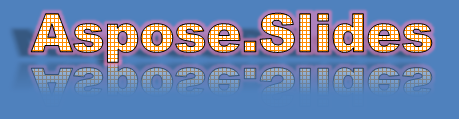

## **Gambaran Umum**

Efek WordArt memungkinkan Anda menambahkan teks bergaya yang menarik secara visual ke presentasi PowerPoint Anda. Dengan Aspose.Slides, pengembang dapat secara programatis membuat, menyesuaikan, dan mengelola WordArt seperti di Microsoft PowerPoint—tanpa perlu menginstal Office. Artikel ini memberikan gambaran tentang cara bekerja dengan WordArt, termasuk cara menerapkan transformasi teks, gaya isi, garis tepi, bayangan, dan opsi pemformatan lainnya untuk membuat konten presentasi Anda lebih ekspresif dan menarik. WordArt memperlakukan teks sebagai objek grafik. Ia terdiri dari efek atau modifikasi khusus yang diterapkan pada teks agar lebih menarik atau terlihat.

## **Membuat Template WordArt Sederhana dan Menerapkannya ke Teks**

**Menggunakan Aspose.Slides** 

Pertama, kami membuat teks sederhana menggunakan kode C++ ini: 

``` cpp 
auto pres = System::MakeObject<Presentation>();
auto slide = pres->get_Slides()->idx_get(0);
auto autoShape = slide->get_Shapes()->AddAutoShape(ShapeType::Rectangle, 200.0f, 200.0f, 400.0f, 200.0f);
auto textFrame = autoShape->get_TextFrame();

auto portion = textFrame->get_Paragraphs()->idx_get(0)->get_Portions()->idx_get(0);
portion->set_Text(u"Aspose.Slides");
```

Sekarang, kami mengatur tinggi font teks ke nilai yang lebih besar agar efeknya lebih terlihat melalui kode berikut:

``` cpp 
auto fontData = System::MakeObject<FontData>(u"Arial Black");
portion->get_PortionFormat()->set_LatinFont(fontData);
portion->get_PortionFormat()->set_FontHeight(36.0f);
```

**Menggunakan Microsoft PowerPoint**

Buka menu efek WordArt di Microsoft PowerPoint:


Dari menu di kanan, Anda dapat memilih efek WordArt yang telah ditentukan. Dari menu di kiri, Anda dapat menentukan pengaturan untuk WordArt baru. 

Berikut beberapa parameter atau opsi yang tersedia:


**Menggunakan Aspose.Slides**

Di sini, kami menerapkan warna pola SmallGrid ke teks dan menambahkan batas teks hitam dengan lebar 1 menggunakan kode ini:

``` cpp 
auto fillFormat = portion->get_PortionFormat()->get_FillFormat();
fillFormat->set_FillType(FillType::Pattern);
fillFormat->get_PatternFormat()->get_ForeColor()->set_Color(Color::get_DarkOrange());
fillFormat->get_PatternFormat()->get_BackColor()->set_Color(Color::get_White());
fillFormat->get_PatternFormat()->set_PatternStyle(PatternStyle::SmallGrid);

auto lineFillFormat = portion->get_PortionFormat()->get_LineFormat()->get_FillFormat();
lineFillFormat->set_FillType(FillType::Solid);
lineFillFormat->get_SolidFillColor()->set_Color(Color::get_Black());
```

Teks yang dihasilkan:


## **Menerapkan Efek WordArt Lainnya**

**Menggunakan Microsoft PowerPoint**

Dari antarmuka program, Anda dapat menerapkan efek-efek ini ke teks, blok teks, bentuk, atau elemen serupa:


Sebagai contoh, efek Shadow, Reflection, dan Glow dapat diterapkan ke teks; efek 3D Format dan 3D Rotation dapat diterapkan ke blok teks; properti Soft Edges dapat diterapkan ke Objek Bentuk (efeknya tetap ada meskipun properti 3D Format tidak diatur). 

### **Menerapkan Efek Bayangan ke Teks**

Di sini, kami hanya mengatur properti yang berhubungan dengan teks. Kami menerapkan efek bayangan ke teks menggunakan kode C++ berikut:

``` cpp 
auto effectFormat = portion->get_PortionFormat()->get_EffectFormat();
effectFormat->EnableOuterShadowEffect();

auto outerShadowEffect = effectFormat->get_OuterShadowEffect();
outerShadowEffect->get_ShadowColor()->set_Color(Color::get_Black());
outerShadowEffect->set_ScaleHorizontal(100);
outerShadowEffect->set_ScaleVertical(65);
outerShadowEffect->set_BlurRadius(4.73);
outerShadowEffect->set_Direction(230.0f);
outerShadowEffect->set_Distance(2);
outerShadowEffect->set_SkewHorizontal(30);
outerShadowEffect->set_SkewVertical(0);
outerShadowEffect->get_ShadowColor()->get_ColorTransform()->Add(ColorTransformOperation::SetAlpha, 0.32f);
```

API Aspose.Slides mendukung tiga jenis bayangan: OuterShadow, InnerShadow, dan PresetShadow. 

Dengan PresetShadow, Anda dapat menerapkan bayangan ke teks (menggunakan nilai preset). 

**Menggunakan Microsoft PowerPoint**

Di PowerPoint, Anda dapat memakai satu jenis bayangan. Berikut contohnya:


**Menggunakan Aspose.Slides**

Aspose.Slides sebenarnya memungkinkan Anda menerapkan dua jenis bayangan sekaligus: InnerShadow dan PresetShadow.

**Catatan:**

- Ketika OuterShadow dan PresetShadow digunakan bersama, hanya efek OuterShadow yang diterapkan. 
- Jika OuterShadow dan InnerShadow digunakan secara bersamaan, efek yang dihasilkan atau diterapkan tergantung pada versi PowerPoint. Misalnya, di PowerPoint 2013, efeknya menjadi ganda. Tetapi di PowerPoint 2007, efek OuterShadow yang diterapkan. 

### **Menerapkan Efek Refleksi**

Kami menambahkan refleksi ke teks melalui contoh kode C++ ini:

``` cpp 
auto effectFormat = portion->get_PortionFormat()->get_EffectFormat();
effectFormat->EnableReflectionEffect();

auto reflectionEffect = effectFormat->get_ReflectionEffect();
reflectionEffect->set_BlurRadius(0.5);
reflectionEffect->set_Distance(4.72);
reflectionEffect->set_StartPosAlpha(0.f);
reflectionEffect->set_EndPosAlpha(60.f);
reflectionEffect->set_Direction(90.0f);
reflectionEffect->set_ScaleHorizontal(100);
reflectionEffect->set_ScaleVertical(-100);
reflectionEffect->set_StartReflectionOpacity(60.f);
reflectionEffect->set_EndReflectionOpacity(0.9f);
reflectionEffect->set_RectangleAlign(RectangleAlignment::BottomLeft);
```

### **Menerapkan Efek Glow**

Kami menerapkan efek glow ke teks agar tampak bersinar atau menonjol menggunakan kode berikut:

``` cpp 
auto effectFormat = portion->get_PortionFormat()->get_EffectFormat();
effectFormat->EnableGlowEffect();

auto glowEffect = effectFormat->get_GlowEffect();
glowEffect->get_Color()->set_R(255);
glowEffect->get_Color()->get_ColorTransform()->Add(ColorTransformOperation::SetAlpha, 0.54f);
glowEffect->set_Radius(7);
```

Hasil operasi:



{} 

Anda dapat mengubah parameter untuk bayangan, tampilan, dan glow. Properti efek diatur secara terpisah pada setiap bagian teks. 

{} 

### **Menggunakan Transformasi di WordArt**

Kami menggunakan metode set_Transform (menerapkan pada seluruh blok teks) melalui kode ini:

``` cpp 
textFrame->get_TextFrameFormat()->set_Transform(TextShapeType::ArchUpPour);
```

Hasilnya:


{} 

Baik Microsoft PowerPoint maupun Aspose.Slides untuk C++ menyediakan sejumlah tipe transformasi yang telah ditentukan. 

{} 

**Menggunakan PowerPoint**

Untuk mengakses tipe transformasi yang telah ditentukan, buka: **Format** -> **TextEffect** -> **Transform**

**Menggunakan Aspose.Slides**

Untuk memilih tipe transformasi, gunakan enum TextShapeType. 

### **Menerapkan Efek 3D ke Teks dan Bentuk**

Kami menetapkan efek 3D ke bentuk teks menggunakan contoh kode berikut:

``` cpp 
auto threeDFormat = autoShape->get_ThreeDFormat();

threeDFormat->get_BevelBottom()->set_BevelType(BevelPresetType::Circle);
threeDFormat->get_BevelBottom()->set_Height(10.5);
threeDFormat->get_BevelBottom()->set_Width(10.5);

threeDFormat->get_BevelTop()->set_BevelType(BevelPresetType::Circle);
threeDFormat->get_BevelTop()->set_Height(12.5);
threeDFormat->get_BevelTop()->set_Width(11);

threeDFormat->get_ExtrusionColor()->set_Color(Color::get_Orange());
threeDFormat->set_ExtrusionHeight(6);

threeDFormat->get_ContourColor()->set_Color(Color::get_DarkRed());
threeDFormat->set_ContourWidth(1.5);

threeDFormat->set_Depth(3);

threeDFormat->set_Material(MaterialPresetType::Plastic);

threeDFormat->get_LightRig()->set_Direction(LightingDirection::Top);
threeDFormat->get_LightRig()->set_LightType(LightRigPresetType::Balanced);
threeDFormat->get_LightRig()->SetRotation(0.0f, 0.0f, 40.0f);

threeDFormat->get_Camera()->set_CameraType(CameraPresetType::PerspectiveContrastingRightFacing);
```

Teks dan bentuk yang dihasilkan:


Kami menerapkan efek 3D ke teks dengan kode C++ ini:

``` cpp 
auto threeDFormat = textFrame->get_TextFrameFormat()->get_ThreeDFormat();

threeDFormat->get_BevelBottom()->set_BevelType(BevelPresetType::Circle);
threeDFormat->get_BevelBottom()->set_Height(3.5);
threeDFormat->get_BevelBottom()->set_Width(3.5);

threeDFormat->get_BevelTop()->set_BevelType(BevelPresetType::Circle);
threeDFormat->get_BevelTop()->set_Height(4);
threeDFormat->get_BevelTop()->set_Width(4);

threeDFormat->get_ExtrusionColor()->set_Color(Color::get_Orange());
threeDFormat->set_ExtrusionHeight(6);

threeDFormat->get_ContourColor()->set_Color(Color::get_DarkRed());
threeDFormat->set_ContourWidth(1.5);

threeDFormat->set_Depth(3);

threeDFormat->set_Material(MaterialPresetType::Plastic);

threeDFormat->get_LightRig()->set_Direction(LightingDirection::Top);
threeDFormat->get_LightRig()->set_LightType(LightRigPresetType::Balanced);
threeDFormat->get_LightRig()->SetRotation(0.0f, 0.0f, 40.0f);

threeDFormat->get_Camera()->set_CameraType(CameraPresetType::PerspectiveContrastingRightFacing);
```

Hasil operasi:


{} 

Penerapan efek 3D ke teks atau bentuknya serta interaksi antar efek didasarkan pada aturan tertentu. 

Pertimbangkan sebuah adegan untuk teks dan bentuk yang berisi teks tersebut. Efek 3D mencakup representasi objek 3D dan adegan tempat objek ditempatkan. 

- Ketika adegan diatur untuk baik gambar maupun teks, adegan gambar mendapatkan prioritas lebih tinggi—adegan teks diabaikan. 
- Ketika gambar tidak memiliki adegan sendiri tetapi memiliki representasi 3D, adegan teks yang digunakan. 
- Jika tidak—ketika bentuk awalnya tidak memiliki efek 3D—bentuk tetap datar dan efek 3D hanya diterapkan ke teks. 

Deskripsi ini terkait dengan metode ThreeDFormat.getLightRig() dan ThreeDFormat.getCamera(). 

{} 

## **Menerapkan Efek Bayangan Luar ke Bentuk**
Aspose.Slides untuk C++ menyediakan kelas [**IOuterShadow**](https://reference.aspose.com/slides/id/cpp/class/aspose.slides.effects.i_outer_shadow) dan [**IInnerShadow**](https://reference.aspose.com/slides/id/cpp/class/aspose.slides.effects.i_inner_shadow) yang memungkinkan Anda menerapkan efek bayangan ke teks yang berada dalam TextFrame. Ikuti langkah-langkah berikut:

1. Buat sebuah instance kelas [Presentation](https://reference.aspose.com/slides/id/cpp/class/aspose.slides.presentation).  
2. Dapatkan referensi slide dengan menggunakan indeksnya.  
3. Tambahkan sebuah AutoShape tipe Rectangle ke slide.  
4. Akses TextFrame yang terkait dengan AutoShape.  
5. Atur FillType AutoShape menjadi NoFill.  
6. Instansiasi kelas OuterShadow.  
7. Atur BlurRadius bayangan.  
8. Atur Direction bayangan.  
9. Atur Distance bayangan.  
10. Atur RectanglelAlign ke TopLeft.  
11. Atur PresetColor bayangan ke Black.  
12. Simpan presentasi sebagai file PPTX.  

Kode contoh dalam C++—implementasi dari langkah-langkah di atas—menunjukkan cara menerapkan efek bayangan luar ke teks:

``` cpp
auto pres = System::MakeObject<Presentation>();
// Dapatkan referensi slide
auto sld = pres->get_Slides()->idx_get(0);

// Tambahkan AutoShape tipe Rectangle
auto ashp = sld->get_Shapes()->AddAutoShape(ShapeType::Rectangle, 150.0f, 75.0f, 150.0f, 50.0f);

// Tambahkan TextFrame ke Rectangle
ashp->AddTextFrame(u"Aspose TextBox");

// Nonaktifkan isian bentuk jika ingin mendapatkan bayangan teks
ashp->get_FillFormat()->set_FillType(FillType::NoFill);

// Tambahkan bayangan luar dan atur semua parameter yang diperlukan
ashp->get_EffectFormat()->EnableOuterShadowEffect();
auto shadow = ashp->get_EffectFormat()->get_OuterShadowEffect();
shadow->set_BlurRadius(4.0);
shadow->set_Direction(45.0f);
shadow->set_Distance(3);
shadow->set_RectangleAlign(RectangleAlignment::TopLeft);
shadow->get_ShadowColor()->set_PresetColor(PresetColor::Black);

// Simpan presentasi ke disk
pres->Save(u"pres_out.pptx", SaveFormat::Pptx);
```

## **Menerapkan Efek Bayangan Dalam ke Bentuk**
Ikuti langkah-langkah berikut:

1. Buat sebuah instance kelas [Presentation](https://reference.aspose.com/slides/id/cpp/class/aspose.slides.presentation).  
2. Dapatkan referensi slide.  
3. Tambahkan sebuah AutoShape tipe Rectangle.  
4. Aktifkan InnerShadowEffect.  
5. Atur semua parameter yang diperlukan.  
6. Atur ColorType menjadi Scheme.  
7. Atur Scheme Color.  
8. Simpan presentasi sebagai file [PPTX](https://docs.fileformat.com/presentation/pptx/).  

Kode contoh (berdasarkan langkah-langkah di atas) menunjukkan cara menambahkan konektor antara dua bentuk dalam C++:

``` cpp
auto presentation = System::MakeObject<Presentation>();
// Dapatkan referensi slide
auto slide = presentation->get_Slides()->idx_get(0);

// Tambahkan AutoShape tipe Rectangle
auto ashp = slide->get_Shapes()->AddAutoShape(ShapeType::Rectangle, 150.0f, 75.0f, 400.0f, 300.0f);
ashp->get_FillFormat()->set_FillType(FillType::NoFill);

// Tambahkan TextFrame ke Rectangle
ashp->AddTextFrame(u"Aspose TextBox");
auto port = ashp->get_TextFrame()->get_Paragraphs()->idx_get(0)->get_Portions()->idx_get(0);
auto pf = port->get_PortionFormat();
pf->set_FontHeight(50.0f);

// Aktifkan InnerShadowEffect
auto ef = pf->get_EffectFormat();
ef->EnableInnerShadowEffect();

// Atur semua parameter yang diperlukan
auto shadow = ef->get_InnerShadowEffect();
shadow->set_BlurRadius(8.0);
shadow->set_Direction(90.0F);
shadow->set_Distance(6.0);
shadow->get_ShadowColor()->set_B(189);

// Atur ColorType menjadi Scheme
shadow->get_ShadowColor()->set_ColorType(ColorType::Scheme);

// Atur Warna Skema
shadow->get_ShadowColor()->set_SchemeColor(SchemeColor::Accent1);

// Simpan Presentasi
presentation->Save(u"WordArt_out.pptx", SaveFormat::Pptx);
```

## **FAQ**

**Apakah saya dapat menggunakan efek WordArt dengan font atau skrip yang berbeda (misalnya Arab, Cina)?**

Ya, Aspose.Slides mendukung Unicode dan bekerja dengan semua font serta skrip utama. Efek WordArt seperti bayangan, isi, dan garis tepi dapat diterapkan terlepas dari bahasa, meskipun ketersediaan font dan render dapat bergantung pada font sistem.

**Apakah saya dapat menerapkan efek WordArt ke elemen master slide?**

Ya, Anda dapat menerapkan efek WordArt ke bentuk pada master slide, termasuk placeholder judul, footer, atau teks latar belakang. Perubahan pada tata letak master akan tercermin pada semua slide terkait.

**Apakah efek WordArt memengaruhi ukuran file presentasi?**

Sedikit. Efek WordArt seperti bayangan, glow, dan isi gradien dapat sedikit menambah ukuran file karena metadata pemformatan tambahan, namun perbedaannya biasanya tidak signifikan.

**Apakah saya dapat melihat pratinjau hasil efek WordArt tanpa menyimpan presentasi?**

Ya, Anda dapat merender slide yang berisi WordArt ke gambar (misalnya PNG, JPEG) menggunakan metode `GetImage` dari antarmuka [IShape](https://reference.aspose.com/slides/id/cpp/aspose.slides/ishape/) atau [ISlide](https://reference.aspose.com/slides/id/cpp/aspose.slides/islide/). Ini memungkinkan Anda meninjau hasil secara in‑memory atau di layar sebelum menyimpan atau mengekspor presentasi lengkap.